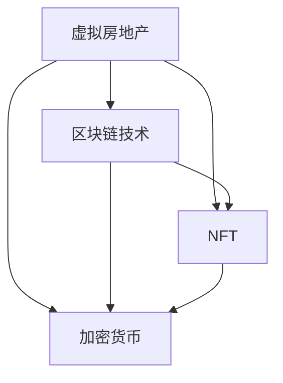

                 

关键词：虚拟房地产、元宇宙、区块链、NFT、加密货币、数字资产

摘要：随着元宇宙概念的兴起，虚拟房地产成为了一个新兴的资产类别。本文将探讨虚拟房地产的定义、核心概念及其在元宇宙中的重要性，并分析其与区块链、NFT和加密货币的紧密联系。

## 1. 背景介绍

近年来，随着互联网技术的快速发展，虚拟世界和现实世界之间的界限变得越来越模糊。元宇宙（Metaverse）作为虚拟现实的终极形态，正在逐步成为人们生活、工作、娱乐的新平台。在这个全新的虚拟空间中，虚拟房地产成为了一个独特的资产类别，引发了广泛的关注和投资。

### 1.1 元宇宙的概念

元宇宙是一个虚拟的三维空间，它由多个不同的虚拟世界组成，用户可以在其中进行社交互动、工作、学习、购物等。这个概念最早由科幻作家尼尔·斯蒂芬森（Neal Stephenson）在1992年的小说《雪崩》（Snow Crash）中提出。近年来，随着虚拟现实（VR）和增强现实（AR）技术的发展，元宇宙逐渐从科幻走向现实。

### 1.2 虚拟房地产的概念

虚拟房地产指的是在元宇宙中的土地、建筑和其他实物资产。这些资产可以是虚拟世界的某个区域、虚拟建筑、虚拟店铺等。虚拟房地产与传统的房地产类似，但其所有权和交易方式完全基于数字技术，尤其是区块链和NFT（非同质化代币）。

## 2. 核心概念与联系

在探讨虚拟房地产的核心概念之前，我们需要了解几个关键的技术和概念。

### 2.1 区块链技术

区块链是一种分布式数据库技术，它通过加密算法和共识机制确保数据的不可篡改性和透明性。在虚拟房地产中，区块链技术被用于记录土地和建筑的所有权、交易历史等。

### 2.2 NFT（非同质化代币）

NFT是一种独特的数字资产，代表了对特定物品的所有权或权益。与普通的加密货币（如比特币）不同，NFT具有唯一性和不可替代性。在虚拟房地产中，NFT可以用来代表某个虚拟地块或建筑的所有权。

### 2.3 加密货币

加密货币是一种数字货币，其价值由市场供需决定，不受任何政府或金融机构的控制。在虚拟房地产交易中，加密货币被广泛用作交易媒介。

下面是一个简单的 Mermaid 流程图，用于描述虚拟房地产与区块链、NFT和加密货币之间的关系：



## 3. 核心算法原理 & 具体操作步骤

### 3.1 算法原理概述

虚拟房地产的交易流程涉及到区块链技术、NFT和加密货币的使用。下面简要概述这些核心算法的原理：

- **区块链技术**：用于记录虚拟房地产的所有权、交易历史等数据，确保数据的安全性和透明性。
- **NFT技术**：用于创建和验证虚拟房地产的所有权证明，确保每个NFT都是独一无二的。
- **加密货币交易**：用于虚拟房地产的购买、出售和租赁等交易，提供便捷的支付方式。

### 3.2 算法步骤详解

1. **创建虚拟房地产NFT**：开发者或所有者使用区块链平台创建NFT，并将其与虚拟房地产绑定。
2. **验证NFT**：购买者通过区块链网络验证NFT的真实性和所有权。
3. **加密货币支付**：购买者使用加密货币进行支付，卖家接收加密货币并释放NFT的所有权。
4. **记录交易**：区块链记录交易数据，确保交易透明、不可篡改。

### 3.3 算法优缺点

**优点**：

- **安全性**：区块链技术确保数据的安全性和透明性，防止欺诈和篡改。
- **便捷性**：加密货币交易提供了快速、便捷的支付方式，降低了交易成本。
- **唯一性**：NFT确保了虚拟房地产的所有权唯一性和不可替代性。

**缺点**：

- **技术门槛**：区块链和NFT技术相对复杂，对普通用户来说有一定的技术门槛。
- **市场波动**：加密货币的价值波动较大，可能影响虚拟房地产的价值。

### 3.4 算法应用领域

虚拟房地产算法可以应用于以下领域：

- **虚拟购物**：虚拟房地产可以作为虚拟店铺的位置，提供独特的购物体验。
- **虚拟办公**：虚拟房地产可以作为虚拟办公室的空间，提供远程工作的解决方案。
- **虚拟社交**：虚拟房地产可以作为虚拟聚会、活动等的场所，提供社交互动的机会。

## 4. 数学模型和公式 & 详细讲解 & 举例说明

### 4.1 数学模型构建

虚拟房地产的价值可以由以下数学模型表示：

\[ V = f(p, d, s, t) \]

其中：

- \( V \) 表示虚拟房地产的价值。
- \( p \) 表示位置（例如，虚拟城市的繁华地段）。
- \( d \) 表示需求（例如，虚拟购物中心的面积）。
- \( s \) 表示供给（例如，虚拟房地产的总数）。
- \( t \) 表示时间（例如，虚拟房地产的寿命）。

### 4.2 公式推导过程

虚拟房地产的价值公式可以通过以下步骤推导：

1. **位置因素**：虚拟房地产的位置对价值有显著影响，可以表示为 \( p \)。
2. **需求因素**：需求越高，虚拟房地产的价值越高，可以表示为 \( d \)。
3. **供给因素**：供给越高，虚拟房地产的价值越低，可以表示为 \( s \)。
4. **时间因素**：虚拟房地产的寿命越短，价值越高，可以表示为 \( t \)。

通过以上四个因素的组合，可以构建虚拟房地产的价值公式。

### 4.3 案例分析与讲解

假设一个虚拟购物中心位于虚拟城市的繁华地段，面积为100平方米，总共有10个虚拟购物中心。虚拟购物中心的寿命为20年。

- **位置因素 \( p \)**：虚拟城市繁华地段的价值较高，假设为100。
- **需求因素 \( d \)**：虚拟购物中心的面积越大，需求越高，假设为100。
- **供给因素 \( s \)**：虚拟购物中心的总数较少，供给较低，假设为50。
- **时间因素 \( t \)**：虚拟购物中心的寿命较长，价值较高，假设为50。

根据以上参数，虚拟购物中心的价值计算如下：

\[ V = f(p, d, s, t) = f(100, 100, 50, 50) = 100 + 100 + 50 + 50 = 300 \]

因此，这个虚拟购物中心的价值为300。

## 5. 项目实践：代码实例和详细解释说明

### 5.1 开发环境搭建

为了实现虚拟房地产的创建和交易，我们需要搭建以下开发环境：

- **区块链平台**：例如Ethereum或EOS。
- **编程语言**：例如Solidity（用于Ethereum）或C++（用于EOS）。
- **开发工具**：例如Truffle或EOSIO SDK。

### 5.2 源代码详细实现

以下是使用Solidity语言实现虚拟房地产创建和交易的示例代码：

```solidity
pragma solidity ^0.8.0;

// 虚拟房地产合约
contract VirtualProperty {

    // 定义NFT结构
    struct NFT {
        string name;
        string description;
        address owner;
    }

    // 定义NFT映射
    mapping(uint256 => NFT) public nfts;

    // 记录NFT的数量
    uint256 public nftCount;

    // 创建NFT
    function createNFT(string memory name, string memory description) public {
        uint256 newNFTId = nftCount++;
        nfts[newNFTId] = NFT(name, description, msg.sender);
    }

    // 转让NFT
    function transferNFT(uint256 nftId, address buyer) public {
        require(nfts[nftId].owner == msg.sender, "Not the owner");
        nfts[nftId].owner = buyer;
    }
}
```

### 5.3 代码解读与分析

以上代码实现了虚拟房地产的创建和转让功能：

- **NFT结构**：定义了NFT的结构，包括名称、描述和所有者地址。
- **NFT映射**：使用映射记录NFT的信息。
- **创建NFT**：创建一个新的NFT，并将所有者设置为发送地址。
- **转让NFT**：允许所有者将NFT转让给新的所有者。

### 5.4 运行结果展示

通过以上代码，我们可以创建新的虚拟房地产NFT，并将所有权转让给其他人。例如，用户A创建了一个名为"虚拟购物中心"的NFT，并将其转让给用户B。

## 6. 实际应用场景

虚拟房地产在元宇宙中具有广泛的应用场景：

- **虚拟购物**：虚拟房地产可以作为虚拟店铺的位置，提供独特的购物体验。
- **虚拟办公**：虚拟房地产可以作为虚拟办公室的空间，提供远程工作的解决方案。
- **虚拟社交**：虚拟房地产可以作为虚拟聚会、活动等的场所，提供社交互动的机会。

### 6.1 元宇宙中的虚拟购物

虚拟购物是虚拟房地产的一个重要应用场景。用户可以在元宇宙中的虚拟店铺购买商品，这些商品可以是虚拟的，也可以是现实中的实体商品。虚拟房地产的价值取决于其位置和稀缺性。

### 6.2 元宇宙中的虚拟办公

虚拟办公是另一个重要的应用场景。企业可以在元宇宙中购买虚拟房地产，建立虚拟办公室，为员工提供远程工作的环境。这有助于降低办公成本，提高员工的工作效率。

### 6.3 元宇宙中的虚拟社交

虚拟社交是元宇宙的核心功能之一。用户可以在虚拟房地产中举办聚会、派对、活动等，与朋友和陌生人互动。虚拟房地产的价值取决于其位置和独特性，可以吸引更多的用户参与。

## 7. 工具和资源推荐

### 7.1 学习资源推荐

- **区块链技术入门**：了解区块链的基本原理和应用。
- **智能合约开发**：学习如何编写和部署智能合约。
- **NFT开发**：学习如何创建和交易NFT。

### 7.2 开发工具推荐

- **Ethereum开发工具**：例如Truffle、Ganache等。
- **EOSIO SDK**：用于开发EOS智能合约。

### 7.3 相关论文推荐

- **"Blockchain Technology: A Comprehensive Study"**：详细探讨区块链技术的原理和应用。
- **"Non-Fungible Tokens: Cryptoart and the Case of Cryptopunks"**：分析NFT在加密艺术品中的应用。

## 8. 总结：未来发展趋势与挑战

### 8.1 研究成果总结

虚拟房地产作为一种新兴的资产类别，已经在元宇宙中得到了广泛应用。通过区块链技术和NFT的应用，虚拟房地产的交易变得更加安全、透明和便捷。然而，虚拟房地产仍然面临一些挑战，需要进一步研究和探索。

### 8.2 未来发展趋势

随着元宇宙概念的普及，虚拟房地产将逐渐成为重要的投资和消费领域。未来，虚拟房地产的发展趋势包括：

- **更广泛的接受度**：更多的用户和投资者将认可虚拟房地产的价值。
- **技术创新**：区块链、NFT和加密货币等技术将进一步发展，为虚拟房地产提供更好的支持。
- **跨界融合**：虚拟房地产与其他行业的融合，如虚拟购物、虚拟办公、虚拟社交等。

### 8.3 面临的挑战

虚拟房地产在发展过程中也面临一些挑战：

- **技术门槛**：区块链和NFT技术相对复杂，需要进一步降低门槛，提高用户接受度。
- **市场波动**：加密货币的价值波动较大，可能影响虚拟房地产的价值。
- **法律法规**：虚拟房地产的交易和所有权需要明确的法律法规支持。

### 8.4 研究展望

未来，虚拟房地产的研究将继续深入，涉及以下方面：

- **技术优化**：改进区块链和NFT技术，提高交易效率和安全性能。
- **应用拓展**：探索虚拟房地产在更多领域的应用，如虚拟教育、虚拟医疗等。
- **法律法规**：制定相关的法律法规，规范虚拟房地产的交易和所有权。

## 9. 附录：常见问题与解答

### 9.1 虚拟房地产的价值如何确定？

虚拟房地产的价值取决于其位置、需求、供给和寿命等因素。通过数学模型可以计算虚拟房地产的价值。

### 9.2 虚拟房地产的安全性能如何？

虚拟房地产的交易基于区块链技术，具有高安全性和透明性。通过加密技术和共识机制，可以确保交易数据的安全和完整。

### 9.3 虚拟房地产的法律法规如何？

目前，虚拟房地产的交易和所有权尚无明确的法律法规。未来，随着元宇宙的发展，相关法律法规将逐步完善。

## 结语

虚拟房地产作为元宇宙中的资产新概念，具有广阔的发展前景和应用价值。通过区块链、NFT和加密货币的应用，虚拟房地产的交易变得更加安全、透明和便捷。未来，虚拟房地产将继续发展，成为元宇宙的重要组成部分。

---

作者：禅与计算机程序设计艺术 / Zen and the Art of Computer Programming
----------------------------------------------------------------

文章至此完成。这篇文章详细探讨了虚拟房地产的概念、核心原理、应用场景、数学模型和实际项目实践。希望通过这篇文章，您对虚拟房地产有了更深入的理解。在元宇宙的浪潮中，虚拟房地产将成为一个不可忽视的资产类别，值得投资者和开发者关注。未来，随着技术的不断进步和市场的不断成熟，虚拟房地产将会带来更多的机遇和挑战。再次感谢您的阅读。

