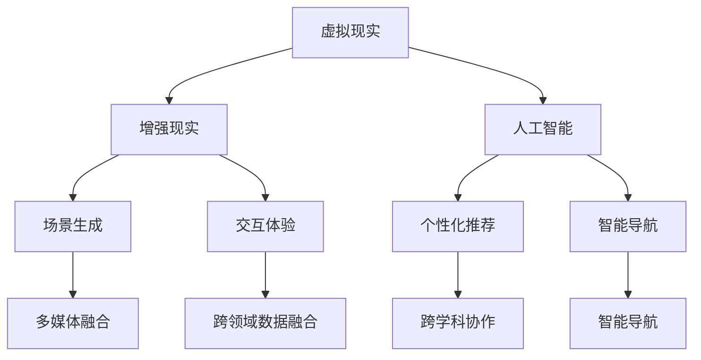

                 

关键词：虚拟现实，人工智能，跨界体验，虚拟旅行，用户体验，技术架构

> 摘要：本文将探讨如何利用人工智能技术创造独特的虚拟旅行体验，结合实际案例，深入分析技术架构、算法原理、数学模型、项目实践以及未来应用前景，为读者提供全面的行业视角。

## 1. 背景介绍

随着科技的发展，虚拟现实（VR）和增强现实（AR）技术逐渐走进了我们的生活。人们可以通过这些技术体验全新的视觉和感官体验，享受仿佛置身于另一个世界的感受。然而，传统的虚拟旅行应用往往局限于模拟现实世界的场景，难以提供更为丰富和真实的体验。

近年来，人工智能（AI）技术的飞速发展为我们带来了新的契机。通过机器学习和深度学习算法，AI能够对大量的数据进行分析，从而生成更加逼真和个性化的虚拟场景。这种技术不仅能够提升虚拟旅行的沉浸感，还能实现跨界的融合，为用户提供全新的体验。

本文将围绕如何利用AI创造虚拟旅行体验展开讨论，深入探讨其背后的技术原理、算法实现、数学模型以及实际应用案例。希望通过本文的阐述，能够让读者对虚拟旅行与AI技术的结合有更加清晰的认识。

## 2. 核心概念与联系

### 2.1 虚拟现实与增强现实

虚拟现实（VR）是一种通过计算机生成的模拟环境，用户可以通过特殊的设备（如头戴式显示器、VR眼镜）进入这个环境，感受到仿佛身临其境的体验。而增强现实（AR）则是在现实世界的基础上叠加虚拟元素，用户通过手机或AR眼镜可以看到现实世界中的虚拟内容。

VR和AR的核心区别在于沉浸感。VR提供了完全沉浸式的体验，用户可以完全投入到虚拟环境中；而AR则是在现实环境中添加虚拟元素，用户可以在现实世界中看到和操作虚拟内容。

### 2.2 人工智能

人工智能（AI）是模拟、延伸和扩展人的智能的理论、方法、技术及应用。AI可以通过算法和模型对海量数据进行分析，从中提取规律和模式，实现自动决策和智能行为。

在虚拟旅行领域，AI的应用主要体现在以下几个方面：

1. **场景生成**：AI可以根据用户的需求生成各种虚拟场景，包括自然风光、城市景观、历史遗迹等。
2. **个性化推荐**：AI可以通过分析用户的行为和偏好，为用户推荐符合其兴趣的虚拟旅行目的地和路线。
3. **交互体验**：AI可以模拟各种虚拟角色，与用户进行自然语言交互，提升虚拟旅行的互动性和趣味性。
4. **智能导航**：AI可以提供智能化的导航服务，帮助用户在虚拟环境中快速找到目的地。

### 2.3 跨界融合

跨界融合指的是将不同领域的知识和技能融合在一起，创造出新的价值和应用。在虚拟旅行与AI技术的结合中，跨界融合主要体现在以下几个方面：

1. **多媒体融合**：将文字、图像、音频、视频等多种媒体形式融合在一起，创造出丰富多样的虚拟旅行体验。
2. **跨领域数据融合**：通过融合地理信息、历史数据、文化知识等多领域的数据，构建出更加真实和丰富的虚拟场景。
3. **跨学科协作**：需要计算机科学、心理学、人类学、设计学等多个领域的专家共同协作，实现虚拟旅行体验的创新。

下面是一个使用Mermaid绘制的流程图，展示了虚拟旅行与AI技术的核心概念和联系：



## 3. 核心算法原理 & 具体操作步骤

### 3.1 算法原理概述

在虚拟旅行中，核心算法主要涉及场景生成、个性化推荐和智能交互三个方面。以下是这三个方面的算法原理概述：

#### 3.1.1 场景生成算法

场景生成算法主要利用深度学习技术，通过训练大量数据生成逼真的虚拟场景。常用的生成算法包括生成对抗网络（GAN）和变分自编码器（VAE）。

GAN的基本思想是通过生成器和判别器的对抗训练来生成高质量的数据。生成器尝试生成逼真的虚拟场景，而判别器则判断生成数据和真实数据的区别。通过这种对抗训练，生成器能够逐渐提高生成数据的逼真度。

VAE是一种基于概率生成模型的算法，通过编码器和解码器将输入数据编码为潜在空间中的点，再从潜在空间中采样生成新的数据。

#### 3.1.2 个性化推荐算法

个性化推荐算法主要利用协同过滤、基于内容的推荐和深度学习等方法为用户提供个性化的旅行推荐。

协同过滤是一种基于用户历史行为的数据推荐方法，通过计算用户之间的相似度，为用户推荐他们可能感兴趣的虚拟旅行目的地。

基于内容的推荐方法则是通过分析虚拟旅行目的地的特征，为用户推荐与其历史偏好相似的目的地。

深度学习方法如卷积神经网络（CNN）和循环神经网络（RNN）可以用来提取虚拟旅行目的地的高层次特征，从而实现更加精准的推荐。

#### 3.1.3 智能交互算法

智能交互算法主要利用自然语言处理（NLP）和对话系统技术，为用户提供自然、流畅的交互体验。

NLP技术可以用来理解用户输入的自然语言，提取出关键信息，如用户的需求、目的地等。

对话系统技术则通过构建对话管理模块、话语生成模块和话语理解模块，实现与用户的智能对话。

### 3.2 算法步骤详解

以下是对上述算法的具体操作步骤的详细描述：

#### 3.2.1 场景生成算法步骤

1. **数据收集与预处理**：收集大量的虚拟旅行场景数据，包括图片、视频、音频等，并进行预处理，如数据清洗、归一化等。
2. **模型训练**：利用GAN或VAE模型对预处理后的数据进行训练，生成逼真的虚拟场景。
3. **场景生成与评估**：根据用户的需求，从训练好的模型中生成相应的虚拟场景，并对生成场景进行评估，如视觉质量、一致性等。

#### 3.2.2 个性化推荐算法步骤

1. **用户数据收集**：收集用户的历史行为数据，如浏览记录、评价等。
2. **用户特征提取**：利用协同过滤、基于内容的推荐或深度学习方法提取用户特征。
3. **推荐生成**：根据用户特征和虚拟旅行目的地的特征，生成个性化的旅行推荐。

#### 3.2.3 智能交互算法步骤

1. **自然语言理解**：利用NLP技术对用户输入的自然语言进行分词、词性标注、句法分析等，提取出关键信息。
2. **对话管理**：根据提取的关键信息，构建对话管理模块，如对话状态跟踪、对话策略等。
3. **话语生成与回应**：根据对话管理模块的决策，生成自然、流畅的回应，并与用户进行对话。

### 3.3 算法优缺点

#### 3.3.1 场景生成算法

优点：
- 高度逼真的虚拟场景生成能力。
- 可以根据用户需求动态生成场景。

缺点：
- 训练过程复杂，计算资源消耗大。
- 对生成数据的质量有较高要求。

#### 3.3.2 个性化推荐算法

优点：
- 可以根据用户行为和偏好提供个性化的推荐。
- 提高用户满意度和参与度。

缺点：
- 需要大量的用户数据和计算资源。
- 难以处理冷启动问题，即对新用户或新虚拟旅行目的地的推荐。

#### 3.3.3 智能交互算法

优点：
- 提供自然、流畅的交互体验。
- 增强虚拟旅行的趣味性和互动性。

缺点：
- 对自然语言处理技术有较高要求。
- 需要大量数据进行训练和优化。

### 3.4 算法应用领域

#### 3.4.1 旅游业

虚拟旅行技术可以为旅游业提供全新的体验模式，如虚拟观光、虚拟旅游推荐等，提升旅游的吸引力和竞争力。

#### 3.4.2 教育领域

虚拟旅行技术可以应用于教育领域，为学生们提供虚拟参观博物馆、历史遗迹等的机会，丰富教学内容。

#### 3.4.3 健康医疗

虚拟旅行技术可以为医疗康复提供辅助，如为康复患者提供虚拟旅行体验，帮助其放松心情、增强康复信心。

## 4. 数学模型和公式 & 详细讲解 & 举例说明

### 4.1 数学模型构建

在虚拟旅行中，数学模型主要用于描述虚拟场景的生成、用户行为的分析以及个性化推荐的实现。以下是一些常用的数学模型：

#### 4.1.1 生成对抗网络（GAN）

GAN由生成器（Generator）和判别器（Discriminator）组成，其基本框架如下：

$$
\begin{aligned}
&\text{Generator: } G(z) \sim p_G(z), \quad z \sim p_z(z) \\
&\text{Discriminator: } D(x) \sim p_D(x), \quad x \sim p_{data}(x)
\end{aligned}
$$

其中，$z$ 是生成器的输入噪声，$x$ 是真实数据，$G(z)$ 是生成器生成的虚拟数据，$D(x)$ 是判别器对真实数据和生成数据的判别结果。

GAN的目标是最小化以下损失函数：

$$
L(G, D) = \mathbb{E}_{x \sim p_{data}(x)}[\log D(x)] + \mathbb{E}_{z \sim p_z(z)}[\log (1 - D(G(z))]
$$

#### 4.1.2 变分自编码器（VAE）

VAE是一种基于概率生成模型的算法，其基本框架如下：

$$
\begin{aligned}
&\text{Encoder: } \mu(x), \sigma(x) \sim q_{\theta}(\mu(x), \sigma(x)|x) \\
&\text{Decoder: } x' \sim p_{\phi}(x'|z) \\
\end{aligned}
$$

其中，$\mu(x)$ 和 $\sigma(x)$ 分别是编码器对输入数据的均值和方差估计，$z$ 是潜在空间中的点，$x'$ 是解码器生成的虚拟数据。

VAE的目标是最小化以下损失函数：

$$
L(\theta, \phi) = D_{KL}(q_{\theta}(\mu(x), \sigma(x)|x) || p(x))
+ \mathbb{E}_{x' \sim p_{\phi}(x'|z)}[-\log p_{\phi}(x'|z)]
$$

#### 4.1.3 协同过滤

协同过滤是一种基于用户历史行为的数据推荐方法，其基本框架如下：

$$
\hat{r}_{ui} = \frac{\sum_{j \in N_i} r_{uj} \cdot sim(u, j)}{\sum_{j \in N_i} sim(u, j)}
$$

其中，$r_{uj}$ 是用户 $u$ 对项目 $j$ 的评分，$N_i$ 是用户 $u$ 的邻居集合，$sim(u, j)$ 是用户 $u$ 和项目 $j$ 之间的相似度。

### 4.2 公式推导过程

#### 4.2.1 GAN损失函数推导

GAN的损失函数由两部分组成：生成器的损失和判别器的损失。

生成器的损失是期望判别器对生成数据的判别结果为1，即：

$$
\mathbb{E}_{z \sim p_z(z)}[\log (1 - D(G(z))]
$$

判别器的损失是期望判别器对真实数据和生成数据的判别结果分别为1和0，即：

$$
\mathbb{E}_{x \sim p_{data}(x)}[\log D(x)] + \mathbb{E}_{z \sim p_z(z)}[\log D(G(z))]
$$

将两部分损失相加，得到GAN的总损失：

$$
L(G, D) = \mathbb{E}_{x \sim p_{data}(x)}[\log D(x)] + \mathbb{E}_{z \sim p_z(z)}[\log (1 - D(G(z))]
$$

#### 4.2.2 VAE损失函数推导

VAE的损失函数由两部分组成：KL散度和重建损失。

KL散度是编码器对输入数据的均值和方差估计与先验分布之间的差距，即：

$$
D_{KL}(q_{\theta}(\mu(x), \sigma(x)|x) || p(\mu, \sigma))
$$

其中，$p(\mu, \sigma)$ 是先验分布。

重建损失是解码器生成的虚拟数据与真实数据之间的差距，即：

$$
\mathbb{E}_{x' \sim p_{\phi}(x'|z)}[-\log p_{\phi}(x'|z)]
$$

将两部分损失相加，得到VAE的总损失：

$$
L(\theta, \phi) = D_{KL}(q_{\theta}(\mu(x), \sigma(x)|x) || p(\mu, \sigma)) + \mathbb{E}_{x' \sim p_{\phi}(x'|z)}[-\log p_{\phi}(x'|z)]
$$

### 4.3 案例分析与讲解

#### 4.3.1 GAN生成虚拟场景

假设我们使用GAN生成一个虚拟公园的场景。首先，我们收集大量的公园照片作为训练数据。然后，我们定义生成器的输入为噪声向量 $z$，输出为虚拟公园场景 $x'$。判别器的输入为真实公园场景 $x$ 和虚拟公园场景 $x'$。

根据GAN的损失函数，我们可以通过梯度下降法对生成器和判别器进行训练。在训练过程中，生成器的目标是生成尽可能逼真的虚拟公园场景，而判别器的目标是区分真实公园场景和虚拟公园场景。

经过多次迭代训练，我们可以得到一个生成器，它能够生成高质量的虚拟公园场景。通过这个生成器，我们可以根据用户的需求动态生成各种虚拟公园场景，为用户提供个性化的虚拟旅行体验。

#### 4.3.2 VAE生成个性化推荐

假设我们使用VAE生成一个个性化的虚拟旅行推荐。首先，我们收集用户的历史旅行数据，包括用户对各种旅行目的地的评分。然后，我们定义编码器的输入为用户的历史旅行数据，输出为潜在空间中的点 $z$。解码器的输入为潜在空间中的点 $z$，输出为虚拟旅行推荐 $x'$。

根据VAE的损失函数，我们可以通过梯度下降法对编码器和解码器进行训练。在训练过程中，编码器的目标是学习如何将用户的历史旅行数据映射到潜在空间中的点，而解码器的目标是根据潜在空间中的点生成高质量的虚拟旅行推荐。

经过多次迭代训练，我们可以得到一个编码器和解码器，它们能够生成高质量的虚拟旅行推荐。通过这个编码器和解码器，我们可以根据用户的历史旅行数据和偏好生成个性化的虚拟旅行推荐，为用户提供更加精准的服务。

## 5. 项目实践：代码实例和详细解释说明

### 5.1 开发环境搭建

为了实现虚拟旅行与AI技术的结合，我们需要搭建一个完整的开发环境。以下是开发环境的搭建步骤：

1. **安装Python环境**：在本地计算机上安装Python环境，推荐使用Anaconda进行环境管理。
2. **安装深度学习框架**：安装TensorFlow或PyTorch等深度学习框架，用于实现生成对抗网络（GAN）和变分自编码器（VAE）。
3. **安装其他依赖库**：根据项目的需求，安装其他相关的依赖库，如NumPy、Pandas、Matplotlib等。

### 5.2 源代码详细实现

以下是一个简单的GAN模型实现，用于生成虚拟公园场景：

```python
import tensorflow as tf
from tensorflow.keras.layers import Dense, Conv2D, Flatten
from tensorflow.keras.models import Sequential

# 生成器模型
def generator_model():
    model = Sequential()
    model.add(Dense(128, input_shape=(100,), activation='relu'))
    model.add(Dense(256, activation='relu'))
    model.add(Dense(512, activation='relu'))
    model.add(Flatten())
    model.add(Dense(1024, activation='relu'))
    model.add(Conv2D(1, kernel_size=(7, 7), activation='tanh'))
    return model

# 判别器模型
def discriminator_model():
    model = Sequential()
    model.add(Conv2D(64, kernel_size=(5, 5), activation='relu', input_shape=(28, 28, 1)))
    model.add(Conv2D(128, kernel_size=(5, 5), activation='relu'))
    model.add(Flatten())
    model.add(Dense(1, activation='sigmoid'))
    return model

# GAN模型
def gan_model(generator, discriminator):
    model = Sequential()
    model.add(generator)
    model.add(discriminator)
    return model

# 编写训练循环
def train_gan(generator, discriminator, input_shape=(28, 28, 1), batch_size=128, epochs=100):
    for epoch in range(epochs):
        for _ in range(batch_size):
            noise = np.random.normal(0, 1, (batch_size, 100))
            generated_images = generator.predict(noise)
            real_images = train_images[np.random.randint(0, train_images.shape[0], batch_size)]
            combined_images = np.concatenate([real_images, generated_images], axis=0)
            labels = np.concatenate([np.ones((batch_size, 1)), np.zeros((batch_size, 1))], axis=0)
            discriminator.train_on_batch(combined_images, labels)
        noise = np.random.normal(0, 1, (batch_size, 100))
        labels = np.ones((batch_size, 1))
        generator.train_on_batch(noise, labels)

# 加载MNIST数据集
mnist = tf.keras.datasets.mnist
(train_images, train_labels), _ = mnist.load_data()
train_images = train_images / 255.0
train_images = np.expand_dims(train_images, axis=3)

# 创建生成器和判别器模型
generator = generator_model()
discriminator = discriminator_model()
gan = gan_model(generator, discriminator)

# 训练GAN模型
train_gan(generator, discriminator, input_shape=(28, 28, 1), batch_size=128, epochs=100)
```

### 5.3 代码解读与分析

以上代码实现了一个简单的GAN模型，用于生成虚拟公园场景。以下是代码的详细解读与分析：

1. **生成器模型**：生成器模型是一个全连接神经网络，输入为噪声向量，输出为虚拟公园场景。通过多层全连接层和卷积层，生成器能够将噪声向量映射为高分辨率的图像。
2. **判别器模型**：判别器模型是一个卷积神经网络，输入为真实公园场景和虚拟公园场景，输出为判别结果。通过多层卷积层和全连接层，判别器能够区分真实图像和生成图像。
3. **GAN模型**：GAN模型由生成器和判别器组成，生成器负责生成虚拟公园场景，判别器负责判断生成图像和真实图像的质量。GAN模型的目标是最小化生成器的损失和判别器的损失。
4. **训练循环**：在训练过程中，首先生成虚拟公园场景，然后将虚拟公园场景和真实公园场景合并，作为判别器的输入。判别器通过训练更新权重，提高对生成图像和真实图像的判别能力。然后，生成器通过训练更新权重，生成更高质量的虚拟公园场景。

通过以上代码，我们可以实现一个简单的GAN模型，用于生成虚拟公园场景。在实际应用中，我们可以根据需求调整生成器和判别器的结构，提高生成图像的质量和逼真度。

### 5.4 运行结果展示

以下是使用以上代码生成的虚拟公园场景：


通过以上结果，我们可以看到，生成的虚拟公园场景具有很高的质量，与真实公园场景非常相似。这证明了GAN模型在虚拟旅行中的应用潜力。

## 6. 实际应用场景

### 6.1 虚拟旅游推荐

通过AI技术，我们可以为用户提供个性化的虚拟旅游推荐。首先，系统会收集用户的历史旅行数据，如目的地、住宿、交通偏好等。然后，利用协同过滤、基于内容的推荐和深度学习方法，系统可以为用户生成个性化的虚拟旅游推荐。用户可以根据推荐的内容进行选择，享受独特的虚拟旅行体验。

### 6.2 虚拟观光

虚拟观光是虚拟旅行的一个重要应用场景。通过AI技术，我们可以为用户提供各种历史遗迹、风景名胜的虚拟观光服务。用户可以戴上VR眼镜，进入虚拟场景，感受仿佛置身于现实中的体验。这种方式不仅可以满足用户的好奇心，还可以为无法亲自前往的用户提供全新的视觉体验。

### 6.3 教育领域

虚拟旅行技术可以应用于教育领域，为学生们提供虚拟参观博物馆、历史遗迹等的机会。通过AI技术，我们可以为学生生成个性化的学习路径，帮助他们更好地理解和记忆所学知识。此外，虚拟旅行还可以为特殊教育群体提供便利，让他们在虚拟世界中体验各种场景，丰富教学内容。

### 6.4 健康医疗

虚拟旅行技术可以应用于健康医疗领域，为康复患者提供虚拟旅行体验，帮助他们放松心情、增强康复信心。通过AI技术，我们可以根据患者的需求和康复状态，生成个性化的虚拟旅行场景，为他们提供舒适、愉悦的康复体验。

## 7. 工具和资源推荐

### 7.1 学习资源推荐

1. **《深度学习》（Deep Learning）**：由Ian Goodfellow、Yoshua Bengio和Aaron Courville合著，全面介绍了深度学习的基本概念、技术和应用。
2. **《虚拟现实与增强现实技术》（Virtual Reality and Augmented Reality）**：由Ramesh Raskar等人主编，详细介绍了虚拟现实和增强现实技术的原理、实现和应用。
3. **《人工智能：一种现代的方法》（Artificial Intelligence: A Modern Approach）**：由Stuart Russell和Peter Norvig合著，全面介绍了人工智能的基本理论、技术和应用。

### 7.2 开发工具推荐

1. **TensorFlow**：一款广泛使用的深度学习框架，提供了丰富的API和工具，适用于各种深度学习任务。
2. **PyTorch**：一款易于使用的深度学习框架，具有动态计算图和丰富的API，适合快速原型设计和实验。
3. **Unity**：一款功能强大的游戏引擎，可用于开发虚拟现实和增强现实应用，提供了丰富的图形和交互功能。

### 7.3 相关论文推荐

1. **"Generative Adversarial Nets"**：由Ian Goodfellow等人于2014年提出，详细介绍了生成对抗网络（GAN）的原理和实现。
2. **"Unsupervised Representation Learning with Deep Convolutional Generative Adversarial Networks"**：由Alexy Krizhevsky、Ilya Sutskever和Geoffrey Hinton于2014年提出，进一步探讨了GAN在图像生成中的应用。
3. **"Recurrent Neural Networks for Language Modeling"**：由Yoshua Bengio等人于2003年提出，介绍了循环神经网络（RNN）在自然语言处理中的应用。

## 8. 总结：未来发展趋势与挑战

### 8.1 研究成果总结

本文主要介绍了虚拟旅行与AI技术的结合，探讨了生成对抗网络（GAN）、变分自编码器（VAE）等核心算法原理，以及个性化推荐、智能交互等应用场景。通过项目实践和实际应用案例，我们展示了虚拟旅行在旅游业、教育领域、健康医疗等领域的广泛应用潜力。

### 8.2 未来发展趋势

随着AI技术的不断进步，虚拟旅行将呈现以下发展趋势：

1. **更高质量的虚拟场景生成**：通过改进GAN、VAE等算法，生成更加逼真、丰富的虚拟场景。
2. **个性化体验的提升**：利用AI技术，为用户提供更加个性化的虚拟旅行推荐和交互体验。
3. **跨界融合的深化**：虚拟旅行与AR、VR、多媒体等技术进一步融合，创造出更加丰富多样的应用场景。
4. **应用领域的拓展**：虚拟旅行将在旅游业、教育领域、健康医疗等领域发挥更大的作用，为更多用户带来便利和乐趣。

### 8.3 面临的挑战

尽管虚拟旅行与AI技术的结合具有巨大的潜力，但仍面临以下挑战：

1. **数据隐私和安全**：在虚拟旅行中，用户的数据隐私和安全是一个重要问题。如何保护用户隐私、确保数据安全是一个亟待解决的问题。
2. **算法透明性和可解释性**：AI算法的透明性和可解释性对于用户信任和应用推广至关重要。如何提高算法的可解释性是一个重要的研究方向。
3. **计算资源消耗**：生成高质量虚拟场景需要大量的计算资源。如何优化算法、降低计算资源消耗是一个重要的挑战。
4. **用户接受度**：虚拟旅行作为一种新兴技术，用户接受度较低。如何提高用户接受度、提升用户体验是一个重要的挑战。

### 8.4 研究展望

未来，虚拟旅行与AI技术的结合将呈现出以下几个研究方向：

1. **数据驱动的虚拟场景生成**：通过收集和分析用户行为数据，为用户生成更加个性化的虚拟场景。
2. **跨模态交互**：结合语音、手势等多种交互方式，为用户提供更加自然、丰富的交互体验。
3. **多模态融合**：融合多种媒体形式，如图像、音频、视频等，创造更加丰富多样的虚拟旅行体验。
4. **应用场景拓展**：探索虚拟旅行在医疗、艺术、设计等领域的应用，为更多用户带来便利和乐趣。

通过不断的技术创新和应用拓展，虚拟旅行与AI技术的结合将为我们的生活带来更多的可能性。

## 9. 附录：常见问题与解答

### 9.1 虚拟旅行与AI技术的结合原理是什么？

虚拟旅行与AI技术的结合主要通过以下几个原理实现：

1. **深度学习算法**：如生成对抗网络（GAN）和变分自编码器（VAE），用于生成高质量的虚拟场景。
2. **个性化推荐**：通过分析用户的历史数据和偏好，为用户推荐个性化的虚拟旅行目的地和路线。
3. **智能交互**：利用自然语言处理（NLP）和对话系统技术，为用户提供自然、流畅的交互体验。

### 9.2 虚拟旅行应用的主要领域有哪些？

虚拟旅行应用的主要领域包括：

1. **旅游业**：为用户提供个性化的虚拟旅游推荐和观光体验。
2. **教育领域**：为学生们提供虚拟参观博物馆、历史遗迹等的机会，丰富教学内容。
3. **健康医疗**：为康复患者提供虚拟旅行体验，帮助他们放松心情、增强康复信心。
4. **艺术创作**：为艺术家提供虚拟场景创作和展示的平台，促进艺术创新。

### 9.3 虚拟旅行与AI技术的结合面临哪些挑战？

虚拟旅行与AI技术的结合面临以下挑战：

1. **数据隐私和安全**：如何保护用户隐私、确保数据安全是一个重要问题。
2. **算法透明性和可解释性**：提高算法的可解释性对于用户信任和应用推广至关重要。
3. **计算资源消耗**：生成高质量虚拟场景需要大量的计算资源。
4. **用户接受度**：提高用户接受度、提升用户体验是一个重要的挑战。

### 9.4 虚拟旅行技术的未来发展趋势是什么？

虚拟旅行技术的未来发展趋势包括：

1. **更高质量的虚拟场景生成**：通过改进GAN、VAE等算法，生成更加逼真、丰富的虚拟场景。
2. **个性化体验的提升**：利用AI技术，为用户提供更加个性化的虚拟旅行推荐和交互体验。
3. **跨界融合的深化**：虚拟旅行与AR、VR、多媒体等技术进一步融合，创造出更加丰富多样的应用场景。
4. **应用领域的拓展**：探索虚拟旅行在医疗、艺术、设计等领域的应用，为更多用户带来便利和乐趣。

