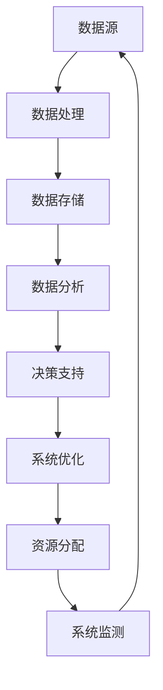
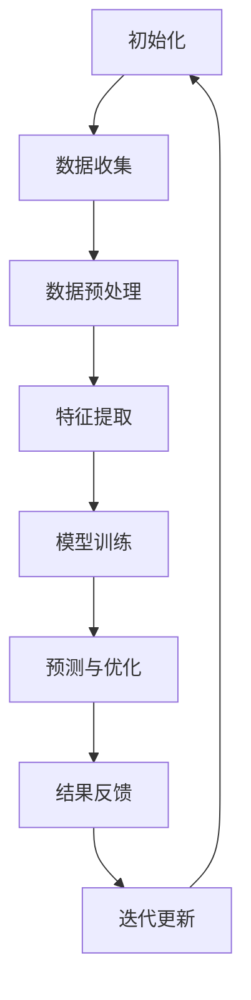

                 

关键词：虚拟生态系统、AI、数字世界、架构设计、算法、实践应用、未来展望

## 摘要

本文旨在探讨如何通过AI技术构建一个虚拟生态系统，这是一个数字世界中相互关联、动态演化的复杂系统。我们将详细分析AI在生态系统设计、算法实现、数学模型构建以及实际应用场景中的作用。文章将涵盖从核心概念到具体实施步骤，再到实际应用的全面介绍，帮助读者了解并掌握这一领域的最新发展动态。

## 1. 背景介绍

随着信息技术的飞速发展，数字世界已经成为现代社会的重要组成部分。从互联网、社交媒体到电子商务，数字世界无处不在。然而，随着数据量的爆炸性增长和系统复杂度的不断提升，传统的数据处理方法和技术逐渐显示出其局限性。因此，如何高效地管理、分析和利用这些海量数据成为了一个亟待解决的问题。

虚拟生态系统的概念正是在这样的背景下提出的。它是一种模拟现实世界中生态系统行为的数字模型，通过AI技术实现自动化管理和动态演化。虚拟生态系统的目标是建立一个可持续、高效、动态适应的数字环境，以应对日益复杂的数据处理需求。

### 1.1 AI在虚拟生态系统中的作用

AI技术在虚拟生态系统中发挥着至关重要的作用。首先，AI可以帮助我们自动识别和处理海量的数据，从而提高数据处理的效率和准确性。其次，AI算法能够模拟生态系统中的各种动态行为，如物种的竞争、共生、捕食等，从而实现系统的自主演化。此外，AI技术还可以用于优化资源分配、预测系统行为、提高系统的适应能力等。

### 1.2 虚拟生态系统的核心特点

虚拟生态系统具有以下几个核心特点：

1. **动态演化**：虚拟生态系统不是静态的，而是随着时间和环境的变化而不断演化。
2. **复杂交互**：虚拟生态系统中的各个部分（如数据、算法、模型等）之间相互关联，形成复杂的交互网络。
3. **适应性**：虚拟生态系统能够根据环境变化和系统状态自动调整其行为和结构。
4. **可持续性**：虚拟生态系统的目标是实现资源的高效利用和环境的可持续发展。

## 2. 核心概念与联系

为了更好地理解虚拟生态系统，我们需要先了解其核心概念和它们之间的联系。以下是一个使用Mermaid绘制的流程图，展示虚拟生态系统的核心概念及其相互关系：



### 2.1 数据处理

数据处理是虚拟生态系统的核心环节之一。通过AI技术，我们可以对海量的数据进行清洗、转换和分析，从而提取出有用的信息。

### 2.2 数据存储

数据存储是虚拟生态系统的另一个关键部分。高效的存储技术能够保证数据的安全、可靠和快速访问。

### 2.3 数据分析

数据分析是利用统计、机器学习和深度学习等方法，对数据进行分析和解释，从而为决策提供支持。

### 2.4 决策支持

决策支持系统通过分析数据，提供各种可能的决策方案，帮助用户做出最优的选择。

### 2.5 系统优化

系统优化旨在提高虚拟生态系统的效率和性能，通过不断调整系统参数，实现最佳运行状态。

### 2.6 资源分配

资源分配是确保虚拟生态系统各部分能够高效运作的关键。通过AI技术，我们可以实现资源的动态分配，最大化利用资源。

### 2.7 系统监测

系统监测是实时监控虚拟生态系统的运行状态，及时发现并处理异常情况。

## 3. 核心算法原理 & 具体操作步骤

在虚拟生态系统中，算法是实现系统功能的关键。以下是一个简化的算法原理图：



### 3.1 算法原理概述

该算法主要包括以下几个步骤：

1. **初始化**：初始化系统参数，包括数据集、模型结构等。
2. **数据收集**：从数据源收集数据。
3. **数据预处理**：对数据进行清洗、标准化等处理。
4. **特征提取**：提取数据中的特征，为后续建模做准备。
5. **模型训练**：使用训练数据训练模型。
6. **预测与优化**：使用模型进行预测，并对模型进行优化。
7. **结果反馈**：将预测结果反馈给系统，用于迭代更新。
8. **迭代更新**：根据反馈结果调整系统参数，实现自我优化。

### 3.2 算法步骤详解

以下是每个步骤的详细解释：

#### 3.2.1 初始化

初始化是算法的第一步，主要包括初始化系统参数，如学习率、迭代次数等。这些参数将影响模型的训练效果和收敛速度。

#### 3.2.2 数据收集

数据收集是从数据源获取数据的过程。数据源可以是数据库、API接口、文件等。在虚拟生态系统中，数据来源非常多样化，需要根据实际情况进行选择。

#### 3.2.3 数据预处理

数据预处理是对数据进行清洗、标准化等处理，以提高数据质量和模型的训练效果。常见的预处理方法包括缺失值处理、异常值处理、数据变换等。

#### 3.2.4 特征提取

特征提取是从原始数据中提取出有用的信息，用于建模。特征提取的质量直接关系到模型的性能。常见的特征提取方法包括主成分分析（PCA）、特征选择等。

#### 3.2.5 模型训练

模型训练是使用训练数据对模型进行调整，使其能够预测新的数据。常见的训练方法包括梯度下降、随机梯度下降等。

#### 3.2.6 预测与优化

预测与优化是使用训练好的模型对新的数据进行预测，并根据预测结果对模型进行调整，以提高模型的准确性。

#### 3.2.7 结果反馈

结果反馈是将预测结果反馈给系统，用于迭代更新。这一步可以帮助系统不断改进，实现自我优化。

#### 3.2.8 迭代更新

迭代更新是根据反馈结果调整系统参数，实现自我优化。这一步是算法的核心，决定了系统的性能和适应性。

### 3.3 算法优缺点

该算法的优点在于：

1. **自动适应**：系统能够根据环境变化和系统状态自动调整，实现自我优化。
2. **高效性**：算法使用AI技术，能够高效地处理海量数据。

然而，该算法也存在一些缺点：

1. **计算复杂度**：算法的迭代更新过程需要大量的计算资源，可能影响系统的实时性。
2. **数据依赖**：算法的性能高度依赖于数据质量，如果数据存在噪声或缺失，可能会影响预测效果。

### 3.4 算法应用领域

该算法可以广泛应用于以下领域：

1. **智能交通**：通过预测交通流量，优化交通信号，提高交通效率。
2. **智能医疗**：通过分析医疗数据，预测疾病发展，提供个性化治疗方案。
3. **智能城市**：通过监控城市环境，优化资源分配，提高城市生活品质。

## 4. 数学模型和公式 & 详细讲解 & 举例说明

在虚拟生态系统中，数学模型和公式是理解和分析系统行为的重要工具。以下是一个简单的数学模型示例：

### 4.1 数学模型构建

假设我们有一个包含n个物种的虚拟生态系统，每个物种的种群数量用X表示。生态系统中的相互作用可以用以下方程表示：

$$
\frac{dX_i}{dt} = r_iX_i(1 - \frac{\sum_{j=1}^{n}X_j}{K})
$$

其中，$r_i$表示物种i的繁殖率，$K$表示生态系统的容量。

### 4.2 公式推导过程

该公式的推导基于Lotka-Volterra捕食-被捕食模型。假设生态系统中有两个物种，一个是捕食者，另一个是被捕食者。捕食者的种群数量随着被捕食者数量的增加而增加，但捕食者种群的增长速度会逐渐减缓，因为食物资源有限。同理，被捕食者的种群数量也会受到捕食者数量的影响。

### 4.3 案例分析与讲解

假设有一个包含兔子和狐狸的虚拟生态系统，兔子的繁殖率为1，狐狸的繁殖率为0.5。生态系统的容量为1000。我们需要预测在一段时间内，兔子和狐狸的种群数量变化。

使用上述公式，我们可以得到以下方程：

$$
\frac{dX_{\text{兔}}}{dt} = X_{\text{兔}}(1 - \frac{X_{\text{狐}}}{1000})
$$

$$
\frac{dX_{\text{狐}}}{dt} = 0.5X_{\text{狐}}(1 - \frac{X_{\text{兔}}}{1000})
$$

通过数值模拟，我们可以得到兔子和狐狸的种群数量随时间的变化趋势。从模拟结果可以看出，兔子种群数量在初期迅速增加，随后由于狐狸的捕食而逐渐下降。而狐狸种群数量则在兔子种群数量下降后逐渐增加，最终达到一个平衡状态。

这一案例展示了数学模型在虚拟生态系统中的应用，通过数学公式，我们可以预测系统中的物种数量变化，从而为生态系统的管理和优化提供科学依据。

## 5. 项目实践：代码实例和详细解释说明

为了更好地展示虚拟生态系统的构建过程，我们将以一个简单的Python项目为例，详细讲解从开发环境搭建到代码实现的各个步骤。

### 5.1 开发环境搭建

在开始项目之前，我们需要搭建一个合适的开发环境。以下是推荐的步骤：

1. **安装Python**：确保安装了Python 3.8或更高版本。
2. **安装Jupyter Notebook**：通过pip安装Jupyter Notebook，用于编写和运行Python代码。
3. **安装必要的库**：使用pip安装以下库：NumPy、Pandas、SciPy、Matplotlib。

### 5.2 源代码详细实现

以下是一个简单的Python代码实例，用于模拟虚拟生态系统中的物种数量变化。

```python
import numpy as np
import pandas as pd
import matplotlib.pyplot as plt
from scipy.integrate import odeint

# 数学模型参数
r = np.array([1.0, 0.5])
K = 1000.0

# 数学模型方程
def model(Y, t):
    X_兔, X_狐 = Y
    dX_兔_dt = X_兔 * (1 - X_狐 / K)
    dX_狐_dt = 0.5 * X_狐 * (1 - X_兔 / K)
    return np.array([dX_兔_dt, dX_狐_dt])

# 初始条件
Y0 = np.array([100, 50])

# 模拟时间
t = np.linspace(0, 100, 1000)

# 求解方程
solution = odeint(model, Y0, t)

# 绘制结果
plt.plot(t, solution[:, 0], label='兔子')
plt.plot(t, solution[:, 1], label='狐狸')
plt.xlabel('时间')
plt.ylabel('种群数量')
plt.legend()
plt.show()
```

### 5.3 代码解读与分析

以下是代码的详细解读：

1. **引入库**：引入NumPy、Pandas、Matplotlib等库，用于数学计算和绘图。
2. **参数定义**：定义数学模型的参数，包括繁殖率和生态系统容量。
3. **模型定义**：定义数学模型方程，使用NumPy数组表示变量和导数。
4. **初始条件**：设置初始条件，即兔子和狐狸的初始种群数量。
5. **模拟时间**：定义模拟的时间范围和步长。
6. **求解方程**：使用SciPy中的`odeint`函数求解微分方程，得到种群数量随时间的变化。
7. **绘制结果**：使用Matplotlib绘制种群数量随时间的变化图，展示模拟结果。

### 5.4 运行结果展示

运行上述代码，我们可以得到一个种群数量随时间变化的动态图。从图中可以看出，兔子种群数量在初期迅速增加，随后由于狐狸的捕食而逐渐下降。而狐狸种群数量则在兔子种群数量下降后逐渐增加，最终达到一个平衡状态。

这一简单的代码实例展示了如何使用Python实现虚拟生态系统的建模和模拟。在实际应用中，我们可以根据需要添加更多的功能和细节，如考虑生态系统的空间分布、食物网等，使模型更加复杂和逼真。

## 6. 实际应用场景

虚拟生态系统在许多实际应用场景中显示出巨大的潜力。以下是一些典型的应用领域和案例：

### 6.1 智能交通系统

虚拟生态系统可以用于模拟交通流量，优化交通信号，提高交通效率。通过收集交通数据，利用AI技术分析交通流量变化，虚拟生态系统可以预测交通拥堵和事故风险，并提出最优的交通信号方案。

### 6.2 智能医疗

虚拟生态系统可以用于模拟医疗数据，预测疾病发展，提供个性化治疗方案。通过分析病人的医疗记录、基因数据等，虚拟生态系统可以帮助医生更好地了解病人的健康状况，制定个性化的治疗方案，提高医疗效果。

### 6.3 智能城市

虚拟生态系统可以用于模拟城市环境，优化资源分配，提高城市生活品质。通过监测城市中的各类数据，如空气质量、交通流量、能源消耗等，虚拟生态系统可以实时分析城市运行状态，优化资源配置，提高城市的可持续发展能力。

### 6.4 金融领域

虚拟生态系统可以用于金融领域的风险管理，预测市场趋势，优化投资策略。通过分析金融市场数据，虚拟生态系统可以预测市场波动，识别潜在的风险，为金融机构提供科学的投资决策支持。

### 6.5 环境保护

虚拟生态系统可以用于模拟生态系统行为，预测环境变化，保护生物多样性。通过分析环境数据，如水质、空气质量、物种分布等，虚拟生态系统可以帮助环境科学家和决策者更好地了解生态系统的状态，制定有效的环境保护措施。

## 7. 未来应用展望

随着AI技术的不断进步，虚拟生态系统在未来将具有更广泛的应用前景。以下是一些可能的发展趋势：

### 7.1 深度学习与虚拟生态系统的融合

深度学习技术的快速发展为虚拟生态系统提供了更强大的数据分析和预测能力。未来，深度学习将与虚拟生态系统紧密结合，实现更精确的模型模拟和预测。

### 7.2 跨领域应用

虚拟生态系统将在更多领域得到应用，如智能制造、智慧农业、环境监测等。通过跨领域的数据整合和模型构建，虚拟生态系统将为各行各业提供创新的解决方案。

### 7.3 实时动态调整

随着计算能力的提升，虚拟生态系统将实现更实时、更高效的动态调整。系统能够根据实时数据和环境变化，快速调整模型参数，实现最优的运行状态。

### 7.4 自适应与自进化

虚拟生态系统将具有更强的自适应和自进化能力。通过不断学习和进化，系统将能够更好地应对复杂多变的环境，实现长期的可持续发展和自我优化。

## 8. 总结：未来发展趋势与挑战

### 8.1 研究成果总结

虚拟生态系统的研究已经取得了显著的成果，包括数学模型的构建、算法的实现和应用场景的拓展。未来，随着AI技术的不断发展，虚拟生态系统的建模和预测能力将得到进一步提升。

### 8.2 未来发展趋势

未来，虚拟生态系统的发展将呈现以下几个趋势：深度学习与虚拟生态系统的融合、跨领域应用、实时动态调整和自适应自进化。

### 8.3 面临的挑战

尽管虚拟生态系统具有巨大的潜力，但仍然面临一些挑战，包括：

1. **数据质量**：数据质量对模型性能至关重要，如何处理噪声和缺失数据是当前研究的重点。
2. **计算资源**：复杂的虚拟生态系统模型需要大量的计算资源，如何优化计算效率是一个重要问题。
3. **模型解释性**：复杂的AI模型往往缺乏解释性，如何提高模型的可解释性，使决策过程更加透明是一个挑战。
4. **隐私保护**：在虚拟生态系统中处理大量个人数据时，如何保护用户隐私是一个重要问题。

### 8.4 研究展望

未来，虚拟生态系统的研究将更加注重跨学科融合、实时动态调整和隐私保护。通过不断探索和创新，虚拟生态系统将为各行各业提供更加智能、高效和可持续的解决方案。

## 9. 附录：常见问题与解答

### 9.1 什么是虚拟生态系统？

虚拟生态系统是一个模拟现实世界中生态系统行为的数字模型，通过AI技术实现自动化管理和动态演化。

### 9.2 虚拟生态系统有哪些应用领域？

虚拟生态系统可以应用于智能交通、智能医疗、智能城市、金融领域、环境保护等多个领域。

### 9.3 虚拟生态系统的核心算法是什么？

虚拟生态系统的核心算法主要包括Lotka-Volterra模型、深度学习模型等。

### 9.4 虚拟生态系统如何处理数据？

虚拟生态系统通过数据预处理、特征提取、模型训练等步骤对数据进行处理和分析。

### 9.5 虚拟生态系统的未来发展趋势是什么？

未来，虚拟生态系统将呈现深度学习与虚拟生态系统的融合、跨领域应用、实时动态调整和自适应自进化的趋势。

## 作者署名

作者：禅与计算机程序设计艺术 / Zen and the Art of Computer Programming

以上就是本文的全部内容，希望对您了解虚拟生态系统及其应用有所帮助。在AI技术的推动下，虚拟生态系统将为我们创造一个更加智能、高效和可持续的未来。希望您继续关注这一领域的发展。作者禅与计算机程序设计艺术 / Zen and the Art of Computer Programming，期待与您一起探索未知的技术世界。

