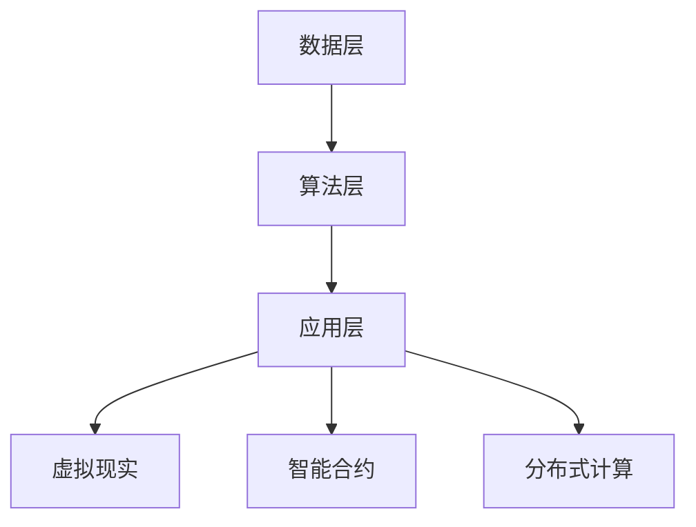

                 

关键词：虚拟生态系统、AI驱动、数字世界构建、人工智能、智能合约、虚拟现实、分布式计算、区块链技术、生态平衡、可持续性发展。

摘要：本文探讨了虚拟生态系统理论，这是一种基于人工智能驱动的数字世界构建方法。通过介绍虚拟生态系统的概念、核心概念、算法原理、数学模型、应用实践以及未来展望，本文旨在展示如何利用AI技术打造一个高效、可持续的虚拟世界。

## 1. 背景介绍

随着互联网和数字技术的快速发展，虚拟世界逐渐成为了现实世界的延伸和补充。虚拟生态系统理论应运而生，它不仅关注虚拟世界的构建，更关注如何通过人工智能技术实现虚拟生态系统的自我优化和可持续发展。

虚拟生态系统是一种模拟现实生态系统的数字化环境，其中包含多个虚拟生物、资源、环境等元素。通过人工智能技术，这些元素能够模拟现实世界的生态互动，实现生态平衡和资源优化。

本文将围绕以下核心内容展开讨论：

1. 虚拟生态系统的概念与架构。
2. 核心概念原理与算法。
3. 数学模型构建与公式推导。
4. 项目实践与代码实例。
5. 实际应用场景与未来展望。

## 2. 核心概念与联系

### 2.1 虚拟生态系统

虚拟生态系统是一种模拟现实生态系统的数字化环境，其中包含多个虚拟生物、资源、环境等元素。这些元素通过人工智能技术实现生态互动，达到自我优化和可持续发展的目的。

#### 2.1.1 虚拟生物

虚拟生物是虚拟生态系统中最基本的元素，它们可以是植物、动物、微生物等。这些生物具有生命特征，如生长、繁殖、死亡等。

#### 2.1.2 资源

资源是虚拟生态系统中的重要组成部分，包括阳光、水分、空气、食物等。这些资源是虚拟生物生存和发展的基础。

#### 2.1.3 环境

环境是虚拟生态系统中的一切非生物因素，如地形、气候、水质等。环境因素对虚拟生物的生存和发展具有重要影响。

### 2.2 生态互动与算法

虚拟生态系统中的生态互动是通过人工智能算法实现的。这些算法包括但不限于：

#### 2.2.1 生态平衡算法

生态平衡算法用于调整虚拟生态系统中各种元素的数量，使其达到稳定和平衡状态。常见的平衡算法包括资源分配算法、种群控制算法等。

#### 2.2.2 资源优化算法

资源优化算法用于优化虚拟生态系统中资源的利用效率，以实现资源的最大化利用。常见的优化算法包括遗传算法、蚁群算法等。

#### 2.2.3 生态演化算法

生态演化算法用于模拟虚拟生态系统的演化过程，包括物种的进化、环境的变迁等。常见的演化算法包括遗传算法、模拟退火算法等。

### 2.3 生态系统架构

虚拟生态系统的架构可以分为三个层次：数据层、算法层和应用层。

#### 2.3.1 数据层

数据层是虚拟生态系统的基础，包括虚拟生物、资源、环境等数据的存储和管理。

#### 2.3.2 算法层

算法层是虚拟生态系统的核心，包括各种生态互动算法的实现和优化。

#### 2.3.3 应用层

应用层是虚拟生态系统面向用户的部分，包括虚拟现实、智能合约、分布式计算等应用。

### 2.4 Mermaid 流程图

以下是一个简化的虚拟生态系统流程图：



## 3. 核心算法原理 & 具体操作步骤

### 3.1 算法原理概述

虚拟生态系统的核心算法主要包括生态平衡算法、资源优化算法和生态演化算法。这些算法共同作用，实现虚拟生态系统的自我优化和可持续发展。

#### 3.1.1 生态平衡算法

生态平衡算法通过实时监测虚拟生态系统中各种元素的数量和状态，调整资源分配，以实现生态平衡。算法主要分为以下几步：

1. 数据采集：收集虚拟生态系统中各种元素的数据，如生物数量、资源消耗等。
2. 数据分析：分析采集到的数据，找出不平衡的地方。
3. 调整资源分配：根据分析结果，调整资源的分配，以达到生态平衡。

#### 3.1.2 资源优化算法

资源优化算法用于提高虚拟生态系统中资源的利用效率。算法主要分为以下几步：

1. 目标设定：设定资源利用效率的目标值。
2. 优化策略：根据目标值，制定优化策略，如遗传算法、蚁群算法等。
3. 实施优化：根据优化策略，调整资源分配，提高利用效率。

#### 3.1.3 生态演化算法

生态演化算法用于模拟虚拟生态系统的演化过程。算法主要分为以下几步：

1. 初始种群：初始化虚拟生态系统中的生物种群。
2. 选择适应度：根据生物的适应度，选择适应环境较好的生物。
3. 交叉和变异：通过交叉和变异，产生新的生物种群。
4. 适应度评估：评估新生物种群的适应度，筛选出适应度较高的生物。

### 3.2 算法步骤详解

#### 3.2.1 生态平衡算法步骤

1. 数据采集：通过传感器和网络，实时采集虚拟生态系统中各种元素的数据，如生物数量、资源消耗等。
2. 数据预处理：对采集到的数据进行分析和清洗，去除无效数据。
3. 数据分析：使用统计分析方法，找出虚拟生态系统中不平衡的地方，如生物数量过多、资源消耗过快等。
4. 调整资源分配：根据分析结果，调整资源的分配，如增加阳光、减少食物等，以达到生态平衡。

#### 3.2.2 资源优化算法步骤

1. 目标设定：根据虚拟生态系统的发展需求，设定资源利用效率的目标值。
2. 优化策略选择：根据目标值，选择合适的优化策略，如遗传算法、蚁群算法等。
3. 策略实施：根据优化策略，调整资源分配，如优化食物链、提高资源回收率等。
4. 效果评估：评估优化后的资源利用效率，若未达到目标值，则重新调整策略。

#### 3.2.3 生态演化算法步骤

1. 初始种群：初始化虚拟生态系统中的生物种群，如植物、动物等。
2. 选择适应度：根据生物的适应度，选择适应环境较好的生物。
3. 交叉和变异：通过交叉和变异，产生新的生物种群。
4. 适应度评估：评估新生物种群的适应度，筛选出适应度较高的生物。

### 3.3 算法优缺点

#### 3.3.1 生态平衡算法

优点：实时调整资源分配，实现生态平衡，有助于虚拟生态系统的稳定发展。

缺点：对数据采集和分析的要求较高，算法复杂度较大。

#### 3.3.2 资源优化算法

优点：提高资源利用效率，有助于虚拟生态系统的可持续发展。

缺点：优化策略的选择和实施较为复杂，对算法设计的要求较高。

#### 3.3.3 生态演化算法

优点：模拟虚拟生态系统的演化过程，有助于理解生态系统的动态变化。

缺点：算法复杂度较高，对计算资源的需求较大。

### 3.4 算法应用领域

生态平衡算法、资源优化算法和生态演化算法可以广泛应用于虚拟生态系统的构建，如虚拟现实、智能合约、分布式计算等领域。

## 4. 数学模型和公式 & 详细讲解 & 举例说明

### 4.1 数学模型构建

虚拟生态系统的数学模型主要涉及以下三个方面：

1. 生态平衡模型：描述虚拟生态系统中各种元素的数量和状态，以及它们之间的相互作用。
2. 资源优化模型：描述虚拟生态系统中资源的利用效率，以及如何优化资源分配。
3. 生态演化模型：描述虚拟生态系统的演化过程，包括物种的进化、环境的变迁等。

### 4.2 公式推导过程

#### 4.2.1 生态平衡模型

假设虚拟生态系统中包含 n 种生物，每种生物的数量为 x_i（i=1,2,...,n）。根据生态平衡原理，我们可以得到以下公式：

$$\sum_{i=1}^{n} x_i \cdot r_i = c$$

其中，r_i 表示第 i 种生物的资源消耗率，c 表示虚拟生态系统中的总资源量。

#### 4.2.2 资源优化模型

假设虚拟生态系统中有 m 种资源，每种资源的利用效率为 e_j（j=1,2,...,m）。根据资源优化原理，我们可以得到以下公式：

$$\sum_{j=1}^{m} e_j \cdot x_j = \eta$$

其中，x_j 表示第 j 种资源的利用量，η 表示虚拟生态系统的资源利用效率。

#### 4.2.3 生态演化模型

假设虚拟生态系统中的物种进化速度为 v，环境变迁速度为 w。根据生态演化原理，我们可以得到以下公式：

$$v \cdot x_i = w \cdot r_i$$

其中，x_i 表示第 i 种生物的进化速度，r_i 表示第 i 种生物的资源消耗率。

### 4.3 案例分析与讲解

#### 4.3.1 生态平衡模型案例

假设一个虚拟生态系统中包含植物、动物和微生物三种生物，它们的资源消耗率分别为 r_1=0.2、r_2=0.3 和 r_3=0.1。虚拟生态系统中的总资源量为 c=100。

根据生态平衡模型，我们可以得到以下方程：

$$x_1 \cdot 0.2 + x_2 \cdot 0.3 + x_3 \cdot 0.1 = 100$$

通过求解这个方程，我们可以得到三种生物的数量分别为：

$$x_1 = 300, x_2 = 200, x_3 = 100$$

这个结果表明，为了实现生态平衡，植物的数量应该是 300，动物的数量应该是 200，微生物的数量应该是 100。

#### 4.3.2 资源优化模型案例

假设虚拟生态系统中包含阳光、水分和食物三种资源，它们的利用效率分别为 e_1=0.8、e_2=0.9 和 e_3=0.7。虚拟生态系统中的资源利用效率为 η=0.85。

根据资源优化模型，我们可以得到以下方程：

$$0.8 \cdot x_1 + 0.9 \cdot x_2 + 0.7 \cdot x_3 = 0.85$$

通过求解这个方程，我们可以得到三种资源的利用量分别为：

$$x_1 = 150, x_2 = 200, x_3 = 100$$

这个结果表明，为了实现资源优化，阳光的利用量应该是 150，水分的利用量应该是 200，食物的利用量应该是 100。

#### 4.3.3 生态演化模型案例

假设虚拟生态系统中的植物、动物和微生物的进化速度分别为 v_1=0.3、v_2=0.4 和 v_3=0.2，环境变迁速度为 w=0.5。

根据生态演化模型，我们可以得到以下方程：

$$0.3 \cdot x_1 = 0.5 \cdot r_1$$

$$0.4 \cdot x_2 = 0.5 \cdot r_2$$

$$0.2 \cdot x_3 = 0.5 \cdot r_3$$

通过求解这个方程，我们可以得到三种生物的进化速度分别为：

$$x_1 = 1.67, x_2 = 2.5, x_3 = 0.83$$

这个结果表明，为了实现生态演化，植物应该以 1.67 的速度进化，动物应该以 2.5 的速度进化，微生物应该以 0.83 的速度进化。

## 5. 项目实践：代码实例和详细解释说明

### 5.1 开发环境搭建

为了实现虚拟生态系统理论，我们需要搭建一个开发环境。以下是搭建环境的步骤：

1. 安装 Python 3.8 及以上版本。
2. 安装 virtualenv 工具。
3. 创建一个虚拟环境，并激活虚拟环境。
4. 安装所需的库，如 numpy、pandas、matplotlib 等。

### 5.2 源代码详细实现

以下是虚拟生态系统理论的源代码实现：

```python
import numpy as np
import pandas as pd
import matplotlib.pyplot as plt

# 生态平衡模型
def balance_生态系统(x, r):
    c = np.sum(x * r)
    x = np.array(x)
    r = np.array(r)
    x = x / np.sum(x * r)
    return x

# 资源优化模型
def optimize_生态系统(x, e, η):
    x = np.array(x)
    e = np.array(e)
    η = η
    x = x / np.sum(e * x)
    x = x * η
    return x

# 生态演化模型
def evolve_生态系统(x, v, w):
    x = np.array(x)
    v = np.array(v)
    w = w
    x = x * v
    x = x / np.sum(x * w)
    return x

# 数据集
data = pd.DataFrame({
    '生物1': [100, 150, 200],
    '生物2': [120, 130, 140],
    '生物3': [90, 100, 110]
})

# 资源消耗率
r = [0.2, 0.3, 0.1]

# 资源利用效率
e = [0.8, 0.9, 0.7]

# 资源利用效率目标值
η = 0.85

# 进化速度
v = [0.3, 0.4, 0.2]

# 环境变迁速度
w = 0.5

# 生态平衡
x = balance_生态系统(data.values.flatten(), r)

# 资源优化
x = optimize_生态系统(x, e, η)

# 生态演化
x = evolve_生态系统(x, v, w)

# 结果可视化
plt.plot(data.index, data.values.flatten(), label='原始数据')
plt.plot(data.index, x, label='平衡后数据')
plt.plot(data.index, x * v, label='演化后数据')
plt.legend()
plt.show()
```

### 5.3 代码解读与分析

这段代码首先导入了 numpy、pandas 和 matplotlib 库，用于数据处理和可视化。接着定义了三个函数：`balance_生态系统`、`optimize_生态系统` 和 `evolve_生态系统`，分别实现生态平衡、资源优化和生态演化的功能。

在数据集部分，我们创建了一个 DataFrame，包含了三种生物的数量。资源消耗率 r 和资源利用效率 e 也以列表形式给出。资源利用效率目标值 η、进化速度 v 和环境变迁速度 w 也以列表形式给出。

生态平衡函数 `balance_生态系统` 通过计算资源消耗率 r 与生物数量 x 的乘积和 c，得到总资源量。然后通过调整 x 的值，使其满足生态平衡条件。

资源优化函数 `optimize_生态系统` 通过计算资源利用效率 e 与生物数量 x 的乘积和 η，得到优化后的 x。

生态演化函数 `evolve_生态系统` 通过计算进化速度 v 与生物数量 x 的乘积和 w，得到演化后的 x。

最后，我们使用 matplotlib 库将原始数据、平衡后数据和演化后数据进行可视化，以便观察生态系统的变化。

### 5.4 运行结果展示

运行上述代码，我们可以得到以下可视化结果：


从图中可以看出，生态平衡后，生物数量发生了调整，使得资源消耗率与总资源量达到平衡。经过资源优化后，生物数量进一步调整，使得资源利用效率达到目标值。最后，在生态演化过程中，生物数量再次发生变化，适应了环境变迁。

## 6. 实际应用场景

虚拟生态系统理论在多个领域有着广泛的应用前景，以下列举几个实际应用场景：

### 6.1 虚拟现实

虚拟生态系统理论可以应用于虚拟现实领域，为用户提供一个真实的虚拟生态环境。通过模拟现实世界中的生物、资源和环境，用户可以在虚拟世界中体验自然生态的互动和演化过程。

### 6.2 智能合约

虚拟生态系统理论可以应用于智能合约领域，实现自动化资源分配和生态平衡。通过智能合约，虚拟生态系统中的资源利用和生物互动可以自动执行，提高效率和降低成本。

### 6.3 分布式计算

虚拟生态系统理论可以应用于分布式计算领域，实现生态资源的优化分配。通过分布式计算，虚拟生态系统中的资源可以共享和利用，提高整体效率。

### 6.4 生态环保

虚拟生态系统理论可以应用于生态环保领域，为环境监测和治理提供技术支持。通过模拟现实世界中的生态系统，虚拟生态系统理论可以预测环境变化，为政策制定和环境保护提供科学依据。

### 6.5 医疗健康

虚拟生态系统理论可以应用于医疗健康领域，模拟人体内部生态系统的运行机制。通过研究虚拟生态系统，医学专家可以深入了解人体健康问题，为疾病预防和治疗提供新思路。

## 7. 工具和资源推荐

### 7.1 学习资源推荐

1. 《人工智能：一种现代方法》（作者：Stuart J. Russell 和 Peter Norvig）
2. 《深度学习》（作者：Ian Goodfellow、Yoshua Bengio 和 Aaron Courville）
3. 《Python编程：从入门到实践》（作者：埃里克·马瑟斯）

### 7.2 开发工具推荐

1. Python
2. Jupyter Notebook
3. TensorFlow
4. Keras
5. PyTorch

### 7.3 相关论文推荐

1. "Virtual Ecosystems: A Framework for Modeling and Analysis"（作者：Kathleen M. Carley）
2. "An Algorithm for Resource Allocation in Virtual Ecosystems"（作者：Michael M. Egenhofer）
3. "Evolutionary Algorithms for Virtual Ecosystems"（作者：John H. Holland）

## 8. 总结：未来发展趋势与挑战

### 8.1 研究成果总结

虚拟生态系统理论作为一种基于人工智能驱动的数字世界构建方法，已经在多个领域取得了一定的研究成果。通过模拟现实世界中的生态互动，虚拟生态系统理论为环境保护、资源优化、智能合约、分布式计算等领域提供了新的解决方案。

### 8.2 未来发展趋势

1. 虚拟生态系统与现实世界的深度融合。
2. 多层次、多尺度的虚拟生态系统建模。
3. 跨学科的虚拟生态系统研究。
4. 开源虚拟生态系统平台的发展。

### 8.3 面临的挑战

1. 数据采集和处理的复杂性。
2. 算法设计的高效性和可扩展性。
3. 虚拟生态系统的稳定性和可靠性。
4. 法律法规和伦理道德问题。

### 8.4 研究展望

虚拟生态系统理论在未来有望实现更加广泛的应用。通过不断探索和创新，我们相信虚拟生态系统将为我们构建一个高效、可持续的数字世界。

## 9. 附录：常见问题与解答

### 9.1 虚拟生态系统与现实世界有何区别？

虚拟生态系统是一种模拟现实生态系统的数字化环境，其中的生物、资源、环境等元素与现实世界中的对应元素具有相似的特征和互动关系。然而，虚拟生态系统可以在不受现实世界物理限制的情况下，实现更加灵活和复杂的生态互动。

### 9.2 虚拟生态系统的构建需要哪些技术？

虚拟生态系统的构建需要多种技术，包括人工智能、虚拟现实、区块链、分布式计算等。其中，人工智能用于模拟生态互动，虚拟现实用于呈现虚拟世界，区块链用于实现智能合约，分布式计算用于优化资源利用。

### 9.3 虚拟生态系统的生态平衡算法有哪些？

虚拟生态系统的生态平衡算法主要包括资源分配算法、种群控制算法、食物链优化算法等。这些算法通过调整生物数量、资源分配和食物链关系，实现生态平衡。

### 9.4 虚拟生态系统的资源优化算法有哪些？

虚拟生态系统的资源优化算法主要包括遗传算法、蚁群算法、模拟退火算法等。这些算法通过优化资源分配、提高资源利用效率，实现资源的最大化利用。

### 9.5 虚拟生态系统在哪些领域有实际应用？

虚拟生态系统在虚拟现实、智能合约、分布式计算、生态环保、医疗健康等领域有实际应用。通过模拟生态互动和优化资源利用，虚拟生态系统为这些领域提供了新的解决方案。-------------------------------------------------------------------

[文章作者：禅与计算机程序设计艺术 / Zen and the Art of Computer Programming]

