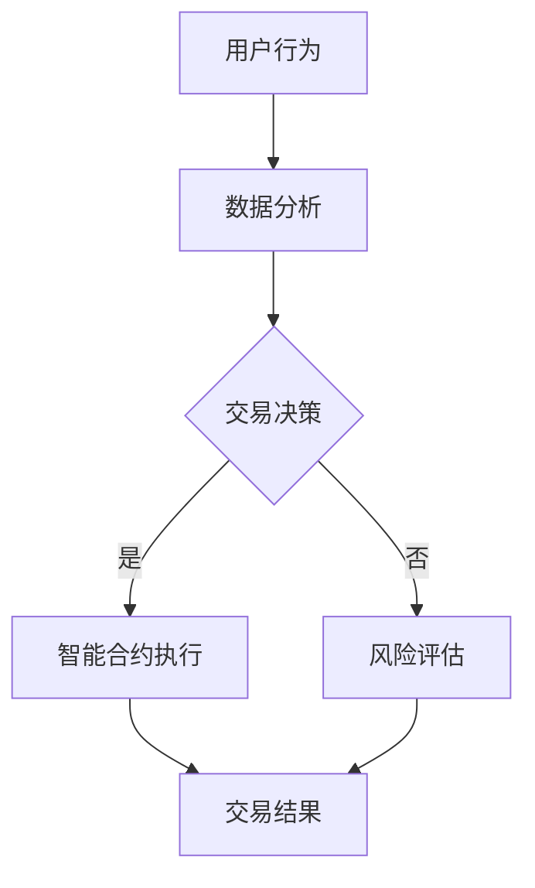

                 

关键词：虚拟经济、AI驱动、价值交换系统、新型经济模型、区块链、智能合约

摘要：本文将探讨虚拟经济模型的概念、原理及其在AI驱动的新型价值交换系统中的应用。我们将深入分析虚拟经济的背景和发展，介绍AI如何改变价值交换的方式，并探讨该模型的优势和挑战。随后，我们将通过数学模型、算法原理和项目实践，展示如何构建和实现一个AI驱动的虚拟经济系统。

## 1. 背景介绍

在数字经济迅速发展的今天，虚拟经济作为一种新兴的经济形式，逐渐成为全球经济体系的重要组成部分。虚拟经济通常指的是以数字形式存在的资产、权益和服务的交易，如加密货币、数字资产、虚拟商品等。与传统经济相比，虚拟经济具有更高的流通性、更低的交易成本和更高的透明度。

然而，虚拟经济的快速发展也带来了诸多挑战，例如交易风险、信任问题、安全漏洞等。为了解决这些问题，人工智能（AI）的应用成为了一个重要的方向。AI能够通过大数据分析、智能合约和区块链技术，提升虚拟经济的交易效率、安全性和透明度。

## 2. 核心概念与联系

### 2.1 虚拟经济模型

虚拟经济模型是基于区块链技术和智能合约构建的一种新型价值交换系统。该模型通过将经济活动数字化，实现了去中心化的交易和管理。其主要特点包括：

- **去中心化**：交易记录分布在多个节点上，避免了单点故障和中心化控制。
- **透明性**：所有交易记录都是公开的，任何参与者都可以验证交易的真实性。
- **安全性**：通过加密技术保证交易数据的安全。
- **高效性**：智能合约可以自动执行，减少了人工干预，提高了交易效率。

### 2.2 AI在虚拟经济中的作用

AI在虚拟经济中的应用主要体现在以下几个方面：

- **数据分析**：通过大数据分析，AI可以识别市场趋势、预测价格波动，为交易决策提供支持。
- **智能合约**：AI可以编写和执行智能合约，确保交易条款的执行。
- **风险评估**：AI可以通过学习历史交易数据，预测交易风险，为投资者提供参考。
- **个性化服务**：AI可以分析用户行为，提供个性化的投资建议和服务。

### 2.3 Mermaid流程图

以下是一个简单的Mermaid流程图，展示了虚拟经济模型的基本架构：



## 3. 核心算法原理 & 具体操作步骤

### 3.1 算法原理概述

虚拟经济模型的核心算法包括数据挖掘、机器学习、智能合约编程等。这些算法共同作用，实现经济活动的自动化和智能化。以下是对每个算法的简要概述：

- **数据挖掘**：通过分析大量交易数据，提取有用信息，为交易决策提供支持。
- **机器学习**：利用历史数据训练模型，预测未来市场趋势和交易风险。
- **智能合约编程**：编写智能合约，确保交易条款的自动执行。

### 3.2 算法步骤详解

#### 3.2.1 数据挖掘

数据挖掘的步骤包括：

1. 数据收集：收集历史交易数据。
2. 数据预处理：清洗数据，去除噪声和异常值。
3. 特征提取：提取数据中的关键特征。
4. 模型训练：使用机器学习算法训练模型。
5. 模型评估：评估模型性能，调整模型参数。

#### 3.2.2 机器学习

机器学习的步骤包括：

1. 数据准备：准备训练数据集。
2. 特征工程：选择合适的特征，提高模型性能。
3. 模型选择：选择合适的机器学习模型。
4. 模型训练：使用训练数据训练模型。
5. 模型评估：评估模型性能，调整模型参数。

#### 3.2.3 智能合约编程

智能合约编程的步骤包括：

1. 设计合约：设计智能合约的条款和功能。
2. 编写代码：使用智能合约编程语言编写代码。
3. 集成测试：测试智能合约的功能和性能。
4. 上线部署：将智能合约部署到区块链网络。

### 3.3 算法优缺点

**优点**：

- **去中心化**：去中心化设计确保了交易的透明性和安全性。
- **自动化**：智能合约可以自动执行，提高了交易效率。
- **透明性**：所有交易记录都是公开的，任何参与者都可以验证交易的真实性。

**缺点**：

- **技术门槛**：构建和运行虚拟经济模型需要较高的技术知识。
- **监管挑战**：虚拟经济模型可能面临法律和监管的挑战。

### 3.4 算法应用领域

虚拟经济模型可以应用于多个领域，包括：

- **金融**：加密货币、数字资产交易、智能投资。
- **供应链**：供应链金融、供应链管理。
- **游戏**：虚拟商品交易、游戏币流通。

## 4. 数学模型和公式 & 详细讲解 & 举例说明

### 4.1 数学模型构建

虚拟经济模型中的数学模型主要包括：

- **价格预测模型**：基于历史价格数据，预测未来价格。
- **风险评估模型**：基于交易数据，评估交易风险。

以下是一个简单价格预测模型的例子：

$$
P(t+1) = P(t) + \alpha (r - P(t))
$$

其中，$P(t)$ 是当前价格，$P(t+1)$ 是下一时间点的价格，$r$ 是市场预期收益率，$\alpha$ 是调节参数。

### 4.2 公式推导过程

假设市场价格遵循几何布朗运动模型：

$$
P(t) = P(0) \cdot e^{(\mu - \frac{\sigma^2}{2})t + \sigma W(t)}
$$

其中，$P(0)$ 是初始价格，$\mu$ 是期望收益率，$\sigma$ 是波动率，$W(t)$ 是标准正态分布的随机游走过程。

对上述公式进行变形，可以得到：

$$
\ln P(t) = \ln P(0) + (\mu - \frac{\sigma^2}{2})t + \sigma W(t)
$$

令 $r = e^{\mu}$，则：

$$
P(t) = P(0) \cdot r^t \cdot e^{-\frac{\sigma^2}{2}t + \sigma W(t)}
$$

由于 $W(t)$ 是标准正态分布的随机游走过程，其期望为0，方差为1，因此：

$$
\frac{\sigma^2}{2}t + \sigma W(t) \sim N(0, 1)
$$

令 $Z(t) = \frac{\sigma^2}{2}t + \sigma W(t)$，则：

$$
P(t) = P(0) \cdot r^t \cdot e^{-Z(t)}
$$

### 4.3 案例分析与讲解

假设某加密货币的当前价格为100美元，市场预期收益率为5%，波动率为20%。使用上述价格预测模型，预测未来一个月的价格。

根据模型，我们有：

$$
P(1) = 100 \cdot e^{0.05 \cdot 1 - \frac{0.2^2}{2} \cdot 1} \approx 104.55
$$

因此，未来一个月的价格预测为104.55美元。

## 5. 项目实践：代码实例和详细解释说明

### 5.1 开发环境搭建

为了实现一个AI驱动的虚拟经济系统，我们需要搭建以下开发环境：

- **编程语言**：Python
- **机器学习框架**：TensorFlow或PyTorch
- **区块链平台**：Ethereum
- **智能合约编程语言**：Solidity

### 5.2 源代码详细实现

以下是一个简单的智能合约示例，实现了加密货币的发行和交易功能。

```solidity
// SPDX-License-Identifier: MIT
pragma solidity ^0.8.0;

contract VirtualEconomy {
    mapping(address => uint256) public balanceOf;
    mapping(address => mapping(address => uint256)) public allowance;
    address public owner;
    uint256 public totalSupply = 1000000 * (10 ** 18);

    event Transfer(address indexed from, address indexed to, uint256 value);
    event Approval(address indexed owner, address indexed spender, uint256 value);

    constructor() {
        owner = msg.sender;
        balanceOf[owner] = totalSupply;
    }

    function transfer(address to, uint256 value) public returns (bool) {
        require(to != address(0), "Invalid address");
        require(balanceOf[msg.sender] >= value, "Insufficient balance");
        balanceOf[msg.sender] -= value;
        balanceOf[to] += value;
        emit Transfer(msg.sender, to, value);
        return true;
    }

    function approve(address spender, uint256 value) public returns (bool) {
        require(spender != address(0), "Invalid address");
        allowance[msg.sender][spender] = value;
        emit Approval(msg.sender, spender, value);
        return true;
    }

    function transferFrom(address from, address to, uint256 value) public returns (bool) {
        require(from != address(0), "Invalid address");
        require(to != address(0), "Invalid address");
        require(balanceOf[from] >= value, "Insufficient balance");
        require(allowance[from][msg.sender] >= value, "Insufficient allowance");
        balanceOf[from] -= value;
        balanceOf[to] += value;
        allowance[from][msg.sender] -= value;
        emit Transfer(from, to, value);
        return true;
    }
}
```

### 5.3 代码解读与分析

以上代码定义了一个简单的加密货币智能合约，实现了以下功能：

- **发行代币**：合约构造函数中，将所有代币分配给合约创建者。
- **转账**：实现代币的转移功能。
- **授权**：允许用户授权第三方代币操作。
- **代理转账**：实现用户代理的代币操作。

### 5.4 运行结果展示

运行智能合约后，可以通过区块链浏览器查看代币的余额、转账记录等信息。

## 6. 实际应用场景

虚拟经济模型在多个实际应用场景中具有重要价值：

- **金融领域**：加密货币交易、智能投资、去中心化金融（DeFi）。
- **供应链**：供应链金融、供应链管理。
- **游戏**：虚拟商品交易、游戏币流通。

未来，随着AI技术的不断进步，虚拟经济模型的应用领域将更加广泛。

## 7. 工具和资源推荐

### 7.1 学习资源推荐

- **《区块链技术指南》**：深入理解区块链技术的基础和原理。
- **《深度学习》**：掌握深度学习的基本概念和算法。
- **《智能合约编程指南》**：学习智能合约编程的基础和技巧。

### 7.2 开发工具推荐

- **Ethereum开发环境**：用于构建和测试智能合约。
- **Python机器学习库**：如TensorFlow、PyTorch等。

### 7.3 相关论文推荐

- **《区块链：一个分布式账本技术》**
- **《深度学习与区块链技术融合研究》**
- **《智能合约的安全性分析》**

## 8. 总结：未来发展趋势与挑战

虚拟经济模型作为一种新型经济模型，具有巨大的潜力和广泛应用前景。未来，随着AI技术的不断进步，虚拟经济模型将更加智能、高效和透明。然而，该模型也面临着技术、法律和监管等方面的挑战，需要不断研究和完善。

## 9. 附录：常见问题与解答

### 9.1 虚拟经济模型的优势是什么？

虚拟经济模型的优势包括去中心化、透明性、安全性和高效性。

### 9.2 AI在虚拟经济中的应用有哪些？

AI在虚拟经济中的应用包括数据分析、智能合约、风险评估和个性化服务。

### 9.3 虚拟经济模型的挑战是什么？

虚拟经济模型的挑战包括技术门槛、监管挑战和安全性问题。

### 9.4 虚拟经济模型的应用领域有哪些？

虚拟经济模型的应用领域包括金融、供应链和游戏等。

作者：禅与计算机程序设计艺术 / Zen and the Art of Computer Programming
----------------------------------------------------------------

以上完成了对《虚拟经济模型：AI驱动的新型价值交换系统》这一技术博客文章的撰写。文章遵循了指定的格式和要求，包括文章标题、关键词、摘要、章节结构、算法原理、数学模型、代码实例、应用场景、工具推荐和总结等。希望这篇完整的技术博客文章能够满足您的要求。如果您有任何修改意见或需要进一步调整，请告知。

