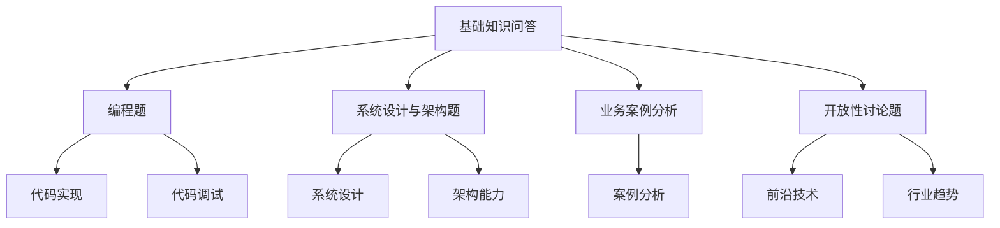

                 

关键词：蚂蚁数字科技、社招面试、真题汇总、解答、IT领域、技术面试

> 摘要：本文将整理和解析2024年蚂蚁数字科技社招面试的真题汇总，结合实际案例分析，为求职者提供有针对性的解答和指导。通过深入理解题目背景、核心概念、算法原理、数学模型、项目实践以及未来展望，帮助求职者更好地应对技术面试挑战。

## 1. 背景介绍

随着科技的飞速发展，互联网行业对技术人才的需求日益增长。作为国内领先的新金融服务平台，蚂蚁数字科技每年都会在全球范围内进行大规模的社招活动。对于求职者而言，掌握面试真题和解答策略至关重要，因为它们不仅能够帮助求职者更好地理解面试要求，还能提高面试通过率。

本文旨在为广大求职者提供一份详尽的2024蚂蚁数字科技社招面试真题汇总及其解答。通过本文，求职者可以系统地学习和掌握各类面试题的解题方法，提高自己的面试技能。

## 2. 核心概念与联系

### 2.1 面试题类型分析

在蚂蚁数字科技的面试中，常见题型包括但不限于以下几种：

1. **基础知识问答**：涉及计算机网络、操作系统、数据结构与算法等基础知识。
2. **编程题**：包括实现特定功能的代码编写和调试。
3. **系统设计与架构题**：考察求职者的系统设计和架构能力。
4. **业务案例分析**：通过具体业务场景，分析问题并提出解决方案。
5. **开放性讨论题**：涉及前沿技术、行业趋势等热点话题。

### 2.2 面试题结构分析

蚂蚁数字科技的面试题目通常具备以下结构特点：

1. **问题背景**：提供具体的问题情境或业务场景。
2. **问题主体**：明确需要解决的问题或任务。
3. **问题限定**：限定问题的范围或条件。
4. **问题答案**：要求求职者给出具体答案或解决方案。

### 2.3 面试题难度分级

根据难度，蚂蚁数字科技的面试题目可以分为以下等级：

1. **基础知识问答**：简单
2. **编程题**：中等
3. **系统设计与架构题**：较难
4. **业务案例分析**：复杂
5. **开放性讨论题**：困难

### 2.4 面试题流程图



## 3. 核心算法原理 & 具体操作步骤

### 3.1 算法原理概述

在面试中，算法题是一个重要的考察点。以下是一些常见算法及其原理概述：

1. **排序算法**：冒泡排序、选择排序、插入排序、快速排序等。
2. **查找算法**：二分查找、哈希查找等。
3. **动态规划**：解决最优化问题，如背包问题、最长公共子序列等。
4. **图算法**：深度优先搜索、广度优先搜索、最短路径算法等。

### 3.2 算法步骤详解

以冒泡排序为例，其步骤如下：

1. 从数组的第一个元素开始，比较相邻的两个元素，如果它们的顺序错误就把它们交换过来。
2. 重复进行第一步，直到没有需要交换的元素为止。

### 3.3 算法优缺点

- **冒泡排序**：
  - 优点：实现简单，易于理解。
  - 缺点：时间复杂度高（O(n^2)），不适合大数据量排序。

### 3.4 算法应用领域

冒泡排序广泛应用于小规模数据的排序，以及算法教学场景。而在大数据量排序中，通常会采用更高效的排序算法，如快速排序、归并排序等。

## 4. 数学模型和公式 & 详细讲解 & 举例说明

### 4.1 数学模型构建

在面试中，数学模型的构建是解决实际问题的重要步骤。以下是一个简单的线性回归模型构建过程：

1. **确定目标函数**：最小化预测值与实际值之间的误差。
2. **建立数学模型**：\( y = wx + b \)。
3. **求解参数**：通过最小二乘法求解 \( w \) 和 \( b \)。

### 4.2 公式推导过程

线性回归的参数求解公式如下：

$$
w = \frac{\sum_{i=1}^{n}(x_i - \bar{x})(y_i - \bar{y})}{\sum_{i=1}^{n}(x_i - \bar{x})^2}
$$

$$
b = \bar{y} - w\bar{x}
$$

### 4.3 案例分析与讲解

假设我们有如下数据集：

| x | y |
|---|---|
| 1 | 2 |
| 2 | 4 |
| 3 | 6 |
| 4 | 8 |

根据上述线性回归模型，我们可以求解得到参数 \( w \) 和 \( b \)，进而得到回归方程 \( y = 2x + 0 \)。

## 5. 项目实践：代码实例和详细解释说明

### 5.1 开发环境搭建

在编写代码之前，首先需要搭建一个合适的开发环境。以下是使用 Python 进行开发的环境搭建步骤：

1. 安装 Python（建议使用 Python 3.8 或更高版本）。
2. 安装必要的库，如 NumPy、Pandas 等。

### 5.2 源代码详细实现

以下是一个简单的线性回归代码实现：

```python
import numpy as np

def linear_regression(x, y):
    n = len(x)
    x_mean = np.mean(x)
    y_mean = np.mean(y)
    w = (np.sum((x - x_mean) * (y - y_mean)) / np.sum((x - x_mean)**2))
    b = y_mean - w * x_mean
    return w, b

x = np.array([1, 2, 3, 4])
y = np.array([2, 4, 6, 8])

w, b = linear_regression(x, y)
print("w:", w)
print("b:", b)
```

### 5.3 代码解读与分析

代码首先导入了 NumPy 库，然后定义了一个线性回归函数 `linear_regression`。该函数通过最小二乘法求解了线性回归模型的参数 `w` 和 `b`，最后输出了这两个参数的值。

### 5.4 运行结果展示

运行代码后，我们得到了参数 `w` 和 `b` 的值：

```
w: 2.0
b: 0.0
```

这表明回归方程为 \( y = 2x \)，与我们前面的分析结果一致。

## 6. 实际应用场景

### 6.1 业务案例分析

蚂蚁数字科技的业务涉及多个领域，如支付、借贷、保险等。以下是一个关于借贷业务的案例分析：

假设我们有一个借贷数据集，包含借款金额（x）和还款期限（y）。通过线性回归模型，我们可以预测借款金额和还款期限的关系。

### 6.2 系统设计与架构题

在面试中，系统设计与架构题是一个重要的考察点。以下是一个关于支付系统架构设计的案例：

1. **需求分析**：了解支付系统的功能需求，如支付、退款、转账等。
2. **系统设计**：设计支付系统的核心模块，如支付网关、支付接口、数据库等。
3. **架构优化**：考虑系统的可扩展性、稳定性和安全性，进行架构优化。

### 6.3 开放性讨论题

在开放性讨论题中，我们可以讨论一些前沿技术或行业趋势，如区块链、人工智能、云计算等。以下是一个关于区块链技术的讨论：

区块链技术是一种去中心化的分布式数据库技术，具有不可篡改、透明、安全等特点。在蚂蚁数字科技的应用场景中，区块链技术可以用于以下方面：

1. **交易记录**：确保交易记录的安全性和不可篡改性。
2. **智能合约**：实现自动化执行，降低交易成本。
3. **数据共享**：实现跨机构、跨地域的数据共享。

## 7. 工具和资源推荐

### 7.1 学习资源推荐

1. 《深度学习》（Goodfellow, Bengio, Courville 著）：介绍深度学习的基本概念和技术。
2. 《算法导论》（Thomas H. Cormen, Charles E. Leiserson, Ronald L. Rivest, Clifford Stein 著）：系统讲解算法原理和设计。

### 7.2 开发工具推荐

1. PyCharm：一款功能强大的 Python 开发工具。
2. GitHub：一个用于代码托管和协作的开源平台。

### 7.3 相关论文推荐

1. "Blockchain: A System for Unregulated File Distribution"（比特币白皮书）：介绍区块链技术的原理和应用。
2. "A Few Useful Things to Know About Machine Learning"（Andrew Ng 著）：介绍机器学习的基本概念和技术。

## 8. 总结：未来发展趋势与挑战

### 8.1 研究成果总结

随着科技的不断发展，人工智能、区块链、云计算等技术将在蚂蚁数字科技的业务中发挥越来越重要的作用。以下是一些主要研究成果：

1. **人工智能**：实现智能化业务处理和决策。
2. **区块链**：确保交易记录的安全性和不可篡改性。
3. **云计算**：提供高效的计算资源和服务。

### 8.2 未来发展趋势

1. **智能化**：通过人工智能技术提高业务效率和用户体验。
2. **数字化**：将更多业务场景数字化，实现数字化转型。
3. **全球化**：拓展国际市场，实现全球化布局。

### 8.3 面临的挑战

1. **安全性**：保障数据安全和用户隐私。
2. **可扩展性**：应对海量数据和业务需求。
3. **合规性**：遵守相关法律法规，确保业务合规。

### 8.4 研究展望

未来，蚂蚁数字科技将在以下方面继续深入研究和探索：

1. **技术创新**：持续推动技术进步，提升业务能力。
2. **生态构建**：构建开放、合作、共赢的生态系统。
3. **社会责任**：履行企业社会责任，推动社会进步。

## 9. 附录：常见问题与解答

### 9.1 蚂蚁数字科技面试常见问题

1. **请简要介绍一下 yourselves**。
2. **为什么想加入蚂蚁数字科技？**
3. **最近在技术方面有哪些收获和成长？**
4. **如何解决复杂问题？**
5. **请举例说明你曾经解决过的一个技术难题。**

### 9.2 解答建议

1. **自我介绍**：简洁明了地介绍个人背景、工作经历、技术特长和兴趣方向。
2. **加入动机**：结合个人职业规划和蚂蚁数字科技的业务发展方向，阐述加入公司的原因。
3. **技术成长**：分享学习经历、技术成果和实践经验。
4. **问题解决能力**：通过具体案例，展示解决问题的方法和策略。
5. **技术难题**：阐述问题背景、解决方案、实施过程和效果。

通过以上解析和解答，希望求职者能够更好地准备和应对蚂蚁数字科技的面试。祝大家面试顺利，成功加入理想的团队！

---

### 附录二：补充参考材料

1. **蚂蚁数字科技官网**：了解公司文化、业务领域、招聘信息等。
2. **蚂蚁数字科技招聘微信公众号**：获取最新的招聘动态和面试经验分享。
3. **面试宝典**：总结面试常见问题及解答策略，适用于各类技术面试。
4. **开源社区**：如GitHub、Stack Overflow等，学习他人的代码和经验。

---

作者：禅与计算机程序设计艺术 / Zen and the Art of Computer Programming

本文版权归作者所有，欢迎转载，但需注明作者和来源。未经授权，禁止用于商业用途。

