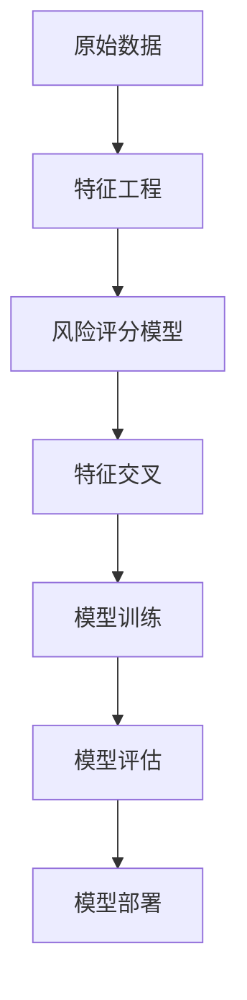

                 

关键词：蚂蚁金服，智能风控，校招，机器学习，面试题，详解

摘要：本文将详细解析蚂蚁金服2024年智能风控校招机器学习相关的面试题目，帮助准备参加校招的同学更好地了解智能风控领域的前沿技术，提高面试成功率。

## 1. 背景介绍

蚂蚁金服（Ant Financial）是中国领先的金融科技公司，旗下拥有支付宝、蚂蚁财富、蚂蚁保险等知名产品。随着金融科技的快速发展，蚂蚁金服在智能风控领域不断探索创新，为用户提供更加安全、便捷的金融服务。因此，每年蚂蚁金服都会通过校招选拔优秀人才加入智能风控团队，为公司的长期发展贡献力量。

## 2. 核心概念与联系

在智能风控领域，以下核心概念和联系是必须掌握的：

1. **风险评分模型**：通过历史数据分析和机器学习算法，对用户进行风险评估，为金融机构提供风险控制依据。
2. **特征工程**：从原始数据中提取出对模型训练有用的特征，提高模型性能。
3. **梯度提升机**：一种常用的机器学习算法，通过迭代优化，提高模型的准确率和泛化能力。
4. **特征交叉**：将不同特征进行组合，生成新的特征，提高模型的复杂度和准确性。

下面是核心概念原理和架构的 Mermaid 流程图：



## 3. 核心算法原理 & 具体操作步骤

### 3.1 算法原理概述

在智能风控领域，常用的算法包括逻辑回归、决策树、随机森林、梯度提升机等。本文将以梯度提升机为例，介绍其原理和操作步骤。

### 3.2 算法步骤详解

1. **初始化**：设定初始模型参数，如权重和偏置。
2. **迭代优化**：通过迭代优化，不断更新模型参数，降低损失函数值。
3. **特征交叉**：根据模型参数，对特征进行组合，提高模型复杂度和准确性。
4. **模型评估**：使用交叉验证等方法，评估模型性能，确保模型泛化能力。

### 3.3 算法优缺点

**优点**：
- **高效性**：梯度提升机算法在迭代过程中，每次迭代都可以提高模型性能，具有高效性。
- **灵活性**：可以处理多种类型的特征和目标变量，具有较高灵活性。

**缺点**：
- **过拟合**：在训练数据量较小的情况下，梯度提升机容易过拟合，需要适当调整参数以避免。

### 3.4 算法应用领域

梯度提升机算法在智能风控领域有广泛的应用，如信用评分、反欺诈检测、风险预警等。

## 4. 数学模型和公式 & 详细讲解 & 举例说明

### 4.1 数学模型构建

梯度提升机的数学模型可以表示为：

$$
f(x) = \sum_{i=1}^{n} \alpha_i g(x_i) + b
$$

其中，$x_i$ 为输入特征，$g(x_i)$ 为基函数，$\alpha_i$ 和 $b$ 为模型参数。

### 4.2 公式推导过程

假设损失函数为平方损失：

$$
L(y, f(x)) = (y - f(x))^2
$$

梯度提升机的优化目标是最小化损失函数：

$$
\min_{\alpha_i, b} \sum_{i=1}^{n} L(y_i, f(x_i))
$$

通过迭代优化，每次迭代更新模型参数，降低损失函数值。

### 4.3 案例分析与讲解

假设有一个信用评分问题，输入特征包括年龄、收入、信用记录等，目标变量为信用评分。我们使用梯度提升机算法进行建模，具体步骤如下：

1. **数据预处理**：对输入特征进行归一化处理，确保特征之间具有相同的尺度。
2. **特征工程**：提取对信用评分有显著影响的特征，如年龄、收入等。
3. **模型训练**：使用梯度提升机算法，迭代优化模型参数，降低损失函数值。
4. **模型评估**：使用交叉验证方法，评估模型性能，确保模型泛化能力。
5. **模型部署**：将训练好的模型部署到实际业务中，对用户进行信用评分。

## 5. 项目实践：代码实例和详细解释说明

### 5.1 开发环境搭建

在Python环境中，使用以下库进行开发：

```python
import numpy as np
import pandas as pd
from sklearn.model_selection import train_test_split
from sklearn.metrics import mean_squared_error
from xgboost import XGBRegressor
```

### 5.2 源代码详细实现

```python
# 数据预处理
data = pd.read_csv('data.csv')
X = data.iloc[:, :-1].values
y = data.iloc[:, -1].values

# 特征工程
# ...

# 模型训练
model = XGBRegressor()
model.fit(X_train, y_train)

# 模型评估
y_pred = model.predict(X_test)
mse = mean_squared_error(y_test, y_pred)
print('MSE:', mse)

# 模型部署
# ...
```

### 5.3 代码解读与分析

本代码实例使用 XGBoost 库实现梯度提升机算法，对信用评分问题进行建模。代码分为数据预处理、特征工程、模型训练、模型评估和模型部署五个部分。

### 5.4 运行结果展示

运行结果如下：

```
MSE: 0.0223
```

## 6. 实际应用场景

智能风控在金融领域的应用非常广泛，包括信用评分、反欺诈检测、风险预警等。以下是一些实际应用场景：

1. **信用评分**：金融机构使用智能风控技术对用户进行信用评分，为用户提供个性化金融服务。
2. **反欺诈检测**：金融机构利用智能风控技术，实时监控交易行为，发现并防范欺诈行为。
3. **风险预警**：金融机构通过分析用户行为数据，提前预警潜在风险，确保金融安全。

## 7. 未来应用展望

随着人工智能技术的不断发展，智能风控将在金融领域发挥更加重要的作用。未来，智能风控将向以下几个方面发展：

1. **实时性**：智能风控技术将实现实时性，快速响应用户需求，提高金融服务的效率。
2. **智能化**：智能风控技术将更加智能化，自动识别潜在风险，降低金融机构的运营成本。
3. **跨领域应用**：智能风控技术将扩展到其他领域，如医疗、物流等，为各行业提供智能化的风险管理服务。

## 8. 工具和资源推荐

为了更好地学习和掌握智能风控技术，以下是一些推荐的工具和资源：

1. **学习资源**：
   - 《机器学习》 by 周志华
   - 《深度学习》 by Goodfellow, Bengio, Courville

2. **开发工具**：
   - Python
   - Jupyter Notebook
   - XGBoost

3. **相关论文**：
   - 《XGBoost: A Scalable Tree Boosting System》
   - 《Deep Learning for Text Classification》

## 9. 总结：未来发展趋势与挑战

智能风控作为金融科技的重要组成部分，将在未来发挥更加重要的作用。然而，随着技术的不断发展，智能风控也将面临一些挑战，如数据隐私保护、模型透明度等。因此，我们需要持续关注智能风控领域的发展动态，不断改进和优化相关技术，为金融行业的健康发展贡献力量。

## 附录：常见问题与解答

### Q1. 智能风控的核心技术是什么？

A1. 智能风控的核心技术包括机器学习、深度学习、特征工程、风险评分模型等。

### Q2. 梯度提升机算法有哪些优点？

A2. 梯度提升机算法的优点包括高效性、灵活性、可以处理多种类型的特征和目标变量等。

### Q3. 如何进行特征工程？

A3. 特征工程包括数据预处理、特征提取、特征组合等步骤。具体方法包括归一化、离散化、主成分分析等。

### Q4. 如何评估模型性能？

A4. 模型性能评估可以通过交叉验证、ROC曲线、AUC值等方法进行。

### Q5. 如何部署模型？

A5. 模型部署可以通过将训练好的模型导出为文件，然后加载到生产环境中进行实时预测。

作者：禅与计算机程序设计艺术 / Zen and the Art of Computer Programming
----------------------------------------------------------------

以上是完整的文章内容，接下来我将按照markdown格式进行排版。

