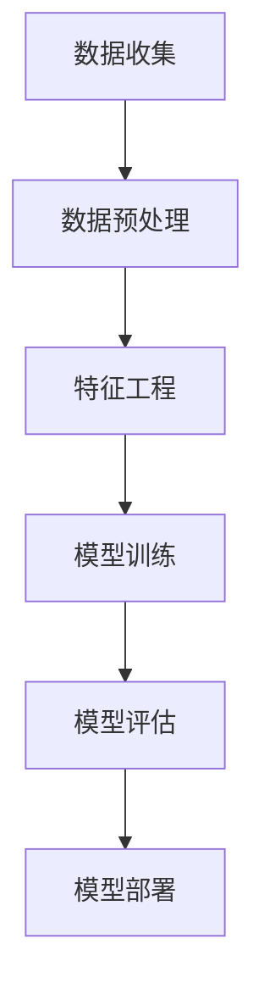

                 

关键词：蚂蚁金服、校招、智能风控、面试题、详解、人工智能、金融科技、数据挖掘、机器学习

摘要：本文将围绕蚂蚁金服2024年校招智能风控工程师的面试题，详细解析每道题的背景、核心考点、解答思路，并结合实际案例，探讨智能风控技术的应用与发展趋势。

## 1. 背景介绍

随着金融科技的快速发展，智能风控已成为金融行业的关键技术之一。蚂蚁金服作为国内领先的金融科技公司，其校招智能风控工程师岗位吸引了大量优秀的人才。本文旨在通过解析蚂蚁金服2024年校招智能风控工程师的面试题，帮助考生更好地理解面试考察的重点和难点，提升面试通过率。

### 1.1 蚂蚁金服简介

蚂蚁金服（Ant Financial）成立于2014年，是阿里巴巴集团旗下的一家子公司，致力于构建全球领先的数字金融生活平台。其主要业务包括支付宝、余额宝、芝麻信用、花呗等，服务了数亿用户。

### 1.2 智能风控工程师岗位

智能风控工程师是蚂蚁金服的核心岗位之一，负责构建、优化和部署智能风控模型，防范金融风险，保障用户资金安全。其工作涉及数据挖掘、机器学习、算法优化等多个领域。

## 2. 核心概念与联系

### 2.1 数据挖掘

数据挖掘是一种从大量数据中提取有价值信息的方法，包括数据清洗、数据预处理、特征工程、模型训练等步骤。在智能风控中，数据挖掘用于发现潜在风险，为风控模型提供基础数据支持。

### 2.2 机器学习

机器学习是一种通过算法模拟人类学习过程，从数据中自动提取规律和知识的技术。在智能风控中，机器学习算法可用于训练风控模型，预测用户行为，识别风险。

### 2.3 风险评估模型

风险评估模型是智能风控的核心，通过分析用户行为数据、历史交易数据等，评估用户的风险等级，为风控策略提供决策依据。

### 2.4 Mermaid 流程图



## 3. 核心算法原理 & 具体操作步骤

### 3.1 算法原理概述

智能风控的核心算法包括逻辑回归、决策树、随机森林、支持向量机等。这些算法通过分析用户行为数据，建立预测模型，评估用户风险等级。

### 3.2 算法步骤详解

1. 数据收集：收集用户行为数据、历史交易数据等。
2. 数据预处理：对数据进行清洗、去重、归一化等处理。
3. 特征工程：提取有用特征，如用户年龄、性别、消费金额等。
4. 模型训练：使用机器学习算法训练预测模型。
5. 模型评估：评估模型准确率、召回率等指标。
6. 模型部署：将模型部署到生产环境，实时评估用户风险。

### 3.3 算法优缺点

- 逻辑回归：简单易懂，易于解释，但性能较差。
- 决策树：可解释性强，但容易过拟合。
- 随机森林：性能较好，可避免过拟合，但可解释性较差。
- 支持向量机：性能优秀，但需要大量计算资源。

### 3.4 算法应用领域

智能风控算法广泛应用于金融、保险、电商等领域，用于防范欺诈、信用评估、风险监控等。

## 4. 数学模型和公式 & 详细讲解 & 举例说明

### 4.1 数学模型构建

假设用户的行为数据为 \(X\)，用户的风险等级为 \(Y\)，则可以使用逻辑回归模型进行风险评估。

$$
P(Y=1|X) = \frac{1}{1 + e^{-(\beta_0 + \beta_1X_1 + \beta_2X_2 + \ldots + \beta_nX_n})}
$$

其中，\( \beta_0, \beta_1, \beta_2, \ldots, \beta_n \) 为模型参数。

### 4.2 公式推导过程

逻辑回归模型的损失函数为：

$$
J(\theta) = -\frac{1}{m} \sum_{i=1}^{m} [y^{(i)} \log(p^{(i)}) + (1 - y^{(i)}) \log(1 - p^{(i)})]
$$

其中，\( p^{(i)} \) 为预测概率，\( y^{(i)} \) 为实际标签。

### 4.3 案例分析与讲解

假设我们有一个用户的行为数据集，包括用户年龄、性别、消费金额等特征。我们可以使用逻辑回归模型进行风险评估。通过训练模型，我们可以得到预测概率，进而判断用户的风险等级。

## 5. 项目实践：代码实例和详细解释说明

### 5.1 开发环境搭建

- Python 3.8
- Scikit-learn 0.22
- Pandas 1.1.5
- Numpy 1.19

### 5.2 源代码详细实现

```python
import numpy as np
import pandas as pd
from sklearn.linear_model import LogisticRegression
from sklearn.model_selection import train_test_split
from sklearn.metrics import accuracy_score, recall_score

# 读取数据
data = pd.read_csv('data.csv')
X = data.iloc[:, :-1].values
y = data.iloc[:, -1].values

# 数据预处理
X = np.concatenate([np.ones((X.shape[0], 1)), X], axis=1)

# 分割训练集和测试集
X_train, X_test, y_train, y_test = train_test_split(X, y, test_size=0.2, random_state=42)

# 训练模型
model = LogisticRegression()
model.fit(X_train, y_train)

# 预测
y_pred = model.predict(X_test)

# 评估
accuracy = accuracy_score(y_test, y_pred)
recall = recall_score(y_test, y_pred)

print('Accuracy:', accuracy)
print('Recall:', recall)
```

### 5.3 代码解读与分析

- 第1-3行：导入所需的库。
- 第5行：读取数据。
- 第7行：将特征和标签分开。
- 第9行：将特征扩展为包括偏置项。
- 第11行：分割训练集和测试集。
- 第14行：训练逻辑回归模型。
- 第17行：预测测试集标签。
- 第20-21行：评估模型准确率和召回率。

## 6. 实际应用场景

### 6.1 金融风控

智能风控技术在金融风控领域应用广泛，如防范欺诈、信用评估、风险监控等。

### 6.2 保险业

智能风控技术可帮助保险公司识别潜在风险，优化理赔流程，提升客户体验。

### 6.3 电商领域

智能风控技术可帮助电商企业防范虚假交易、欺诈行为，保障用户资金安全。

## 7. 未来应用展望

### 7.1 多模态数据融合

未来，智能风控技术将结合多种数据源，如文本、图像、音频等，实现更全面的风险评估。

### 7.2 强化学习

强化学习在智能风控领域具有巨大潜力，可帮助系统自适应调整风控策略。

### 7.3 区块链技术

区块链技术可提高数据透明度和安全性，为智能风控提供更多可能性。

## 8. 工具和资源推荐

### 8.1 学习资源推荐

- 《Python数据科学手册》
- 《机器学习实战》
- 《数据挖掘：实用工具和技术》

### 8.2 开发工具推荐

- Jupyter Notebook
- PyCharm
- Docker

### 8.3 相关论文推荐

- "A Survey on Credit Risk Management in Financial Institutions"
- "Deep Learning for Financial Risk Management"
- "Blockchain Technology in Financial Services"

## 9. 总结：未来发展趋势与挑战

### 9.1 研究成果总结

智能风控技术在金融领域取得了显著成果，为防范金融风险提供了有力支持。

### 9.2 未来发展趋势

未来，智能风控技术将朝着多模态数据融合、强化学习、区块链技术等方向发展。

### 9.3 面临的挑战

智能风控技术在发展过程中，仍面临数据质量、算法透明性、隐私保护等挑战。

### 9.4 研究展望

智能风控技术将在金融、保险、电商等领域发挥更大作用，助力行业创新发展。

## 10. 附录：常见问题与解答

### 10.1 智能风控与大数据的区别是什么？

智能风控侧重于利用机器学习、数据挖掘等技术防范金融风险，而大数据则更关注数据的存储、处理和分析。

### 10.2 智能风控技术在保险业有哪些应用？

智能风控技术在保险业可应用于风险评估、欺诈防范、理赔优化等。

### 10.3 智能风控技术的未来发展趋势是什么？

智能风控技术未来将朝着多模态数据融合、强化学习、区块链技术等方向发展。

## 作者署名

作者：禅与计算机程序设计艺术 / Zen and the Art of Computer Programming
```

