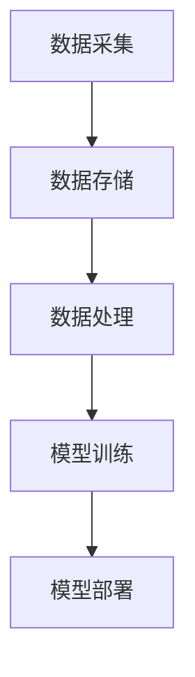

                 

关键词：蚂蚁金服，校招，智能风控，算法工程师，面试指南

> 摘要：本文旨在为2024年即将参加蚂蚁金服校招的智能风控算法工程师职位的学生们提供全面的面试指南。本文将详细解读蚂蚁金服的招聘流程、岗位要求、面试内容、技术知识点等，帮助同学们更好地准备面试，成功加入蚂蚁金服这个优秀的团队。

## 1. 背景介绍

蚂蚁金服，全称蚂蚁科技集团股份有限公司，是中国领先的金融科技巨头。成立于2014年，原为中国阿里巴巴集团下的子公司，后于2020年独立上市。蚂蚁金服业务涵盖支付、理财、保险、信贷等多个领域，服务用户超过10亿，是中国乃至全球金融科技领域的重要力量。

随着金融科技的快速发展，智能风控在蚂蚁金服的业务中扮演着至关重要的角色。智能风控利用大数据、人工智能等技术手段，对用户的交易行为、信用状况等进行实时分析，有效防范金融风险，保障用户的资金安全。

因此，蚂蚁金服对智能风控算法工程师的要求也越来越高。对于即将参加2024年校招的同学们来说，了解蚂蚁金服的招聘流程、岗位要求、面试内容等，是成功获得面试机会和职位的关键。

## 2. 核心概念与联系

### 2.1 智能风控算法

智能风控算法是金融科技领域的重要研究方向，其核心是通过大数据和人工智能技术，对用户的行为、信用等进行预测和分析，从而实现风险控制。

#### 2.1.1 大数据

大数据是指数据量巨大、类型繁多、价值密度低的非结构化数据。在智能风控中，大数据的作用体现在以下几个方面：

1. **数据收集**：通过采集用户的交易记录、信用记录、社交行为等，形成庞大的数据集。
2. **数据清洗**：对收集到的数据进行预处理，去除无效、错误的数据。
3. **数据挖掘**：从大量数据中提取有价值的信息，用于风控模型的构建。

#### 2.1.2 人工智能

人工智能是指使计算机模拟人类智能行为的技术，包括机器学习、深度学习、自然语言处理等。在智能风控中，人工智能的作用主要体现在以下几个方面：

1. **特征工程**：从原始数据中提取对风控模型有用的特征。
2. **模型训练**：利用机器学习算法，构建风控模型。
3. **模型评估与优化**：对风控模型进行评估，找出不足之处并进行优化。

### 2.2 智能风控架构

智能风控架构包括数据采集、数据存储、数据处理、模型训练、模型部署等几个关键环节。

#### 2.2.1 数据采集

数据采集是智能风控的基础，主要包括以下几个方面：

1. **用户行为数据**：如交易记录、浏览记录、操作记录等。
2. **用户画像数据**：如年龄、性别、地域、职业等。
3. **信用数据**：如信用评分、逾期记录等。

#### 2.2.2 数据存储

数据存储是智能风控的核心，主要包括以下几个方面：

1. **关系数据库**：用于存储结构化数据，如MySQL、Oracle等。
2. **非关系数据库**：用于存储非结构化数据，如MongoDB、Cassandra等。
3. **数据仓库**：用于存储大量的历史数据，如Hive、Hadoop等。

#### 2.2.3 数据处理

数据处理是智能风控的关键，主要包括以下几个方面：

1. **数据清洗**：去除无效、错误的数据。
2. **数据集成**：将不同来源的数据进行整合。
3. **数据变换**：对数据进行处理，使其符合风控模型的要求。

#### 2.2.4 模型训练

模型训练是智能风控的核心环节，主要包括以下几个方面：

1. **特征工程**：从原始数据中提取对风控模型有用的特征。
2. **模型选择**：选择合适的机器学习算法。
3. **模型训练**：利用训练集对模型进行训练。
4. **模型评估**：对训练好的模型进行评估。

#### 2.2.5 模型部署

模型部署是将训练好的模型应用到实际业务中，主要包括以下几个方面：

1. **模型集成**：将模型集成到业务系统中。
2. **模型监控**：对模型进行实时监控，确保其正常运行。
3. **模型优化**：根据业务需求和模型表现，对模型进行优化。

### 2.3 Mermaid 流程图



## 3. 核心算法原理 & 具体操作步骤

### 3.1 算法原理概述

智能风控算法的核心是利用机器学习技术，从海量数据中提取特征，构建预测模型，实现对风险的识别和预测。常见的机器学习算法包括逻辑回归、决策树、随机森林、支持向量机、神经网络等。

### 3.2 算法步骤详解

1. **数据收集**：收集用户的交易记录、信用记录、行为数据等。
2. **数据清洗**：去除无效、错误的数据。
3. **特征工程**：从原始数据中提取对风控模型有用的特征。
4. **数据集划分**：将数据集划分为训练集、验证集和测试集。
5. **模型选择**：选择合适的机器学习算法。
6. **模型训练**：利用训练集对模型进行训练。
7. **模型评估**：利用验证集和测试集对模型进行评估。
8. **模型优化**：根据评估结果，对模型进行优化。
9. **模型部署**：将训练好的模型应用到实际业务中。

### 3.3 算法优缺点

**优点**：

1. **自动化**：利用机器学习算法，可以自动化提取特征、构建模型，提高效率。
2. **可扩展性**：机器学习算法可以处理大规模数据，适应业务需求的变化。
3. **预测准确性**：通过不断优化模型，可以提高预测的准确性。

**缺点**：

1. **数据依赖性**：机器学习算法对数据质量有较高要求，数据质量直接影响模型的性能。
2. **模型复杂度**：机器学习算法通常需要大量的计算资源和时间，模型复杂度越高，计算成本越高。
3. **模型解释性**：机器学习算法的预测结果往往难以解释，对于风险管理人员来说，难以理解模型的决策过程。

### 3.4 算法应用领域

智能风控算法在金融、电商、电信等多个领域都有广泛的应用，以下是一些典型的应用场景：

1. **金融**：对贷款申请者进行信用评估、反欺诈检测、风险预警等。
2. **电商**：对用户的购物行为进行分析，识别恶意买家、优化营销策略等。
3. **电信**：对用户的行为进行分析，识别恶意用户、预防电信诈骗等。
4. **其他**：如物流公司的货物丢失风险预测、保险公司的风险评估等。

## 4. 数学模型和公式 & 详细讲解 & 举例说明

### 4.1 数学模型构建

智能风控算法的核心是构建预测模型，常用的数学模型包括逻辑回归、决策树、随机森林、支持向量机等。以下以逻辑回归为例，介绍数学模型的构建过程。

逻辑回归是一种广泛使用的分类模型，用于预测一个事件发生的概率。假设我们有 $n$ 个特征 $X_1, X_2, ..., X_n$，我们希望预测一个二分类目标变量 $Y$，其取值为 $0$ 或 $1$。

逻辑回归的模型公式为：

$$
\begin{aligned}
\log\left(\frac{P(Y=1|X_1, X_2, ..., X_n)}{1-P(Y=1|X_1, X_2, ..., X_n)}\right) &= \beta_0 + \beta_1X_1 + \beta_2X_2 + ... + \beta_nX_n \\
\Rightarrow P(Y=1|X_1, X_2, ..., X_n) &= \frac{1}{1 + e^{-(\beta_0 + \beta_1X_1 + \beta_2X_2 + ... + \beta_nX_n})}
\end{aligned}
$$

其中，$\beta_0, \beta_1, ..., \beta_n$ 是模型的参数，需要通过训练数据进行优化。

### 4.2 公式推导过程

逻辑回归的公式推导基于最大似然估计。首先，我们假设数据集 $D$ 由 $N$ 个样本组成，每个样本包含特征 $X_i$ 和目标变量 $Y_i$。目标是找到一组参数 $\beta_0, \beta_1, ..., \beta_n$，使得模型在给定数据集 $D$ 上的对数似然函数 $L$ 最大。

对数似然函数为：

$$
L(\beta_0, \beta_1, ..., \beta_n) = \sum_{i=1}^{N} \log P(Y_i=1|X_i; \beta_0, \beta_1, ..., \beta_n) + \sum_{i=1}^{N} \log P(Y_i=0|X_i; \beta_0, \beta_1, ..., \beta_n)
$$

根据逻辑回归的模型公式，我们可以将上式改写为：

$$
L(\beta_0, \beta_1, ..., \beta_n) = \sum_{i=1}^{N} \left[ Y_i \log \left( \frac{1}{1 + e^{-(\beta_0 + \beta_1X_1 + \beta_2X_2 + ... + \beta_nX_n)}} \right) + (1 - Y_i) \log \left( 1 + e^{-(\beta_0 + \beta_1X_1 + \beta_2X_2 + ... + \beta_nX_n)}} \right) \right]
$$

为了最大化对数似然函数，我们需要对 $\beta_0, \beta_1, ..., \beta_n$ 进行优化。这里采用梯度下降法进行优化。具体步骤如下：

1. 计算对数似然函数关于每个参数的偏导数。
2. 更新每个参数的值，使其朝着减小对数似然函数的方向移动。
3. 重复步骤1和步骤2，直到对数似然函数不再显著减小，或者达到预设的迭代次数。

### 4.3 案例分析与讲解

假设我们有一个数据集，包含以下特征和目标变量：

| 特征         | 目标变量 |
| ------------ | -------- |
| 年龄         | 1        |
| 收入         | 2        |
| 贷款额度     | 3        |
| 还款期限     | 4        |
| 目标变量（是否逾期） | 0/1     |

我们希望通过逻辑回归模型预测用户是否会出现逾期。

首先，我们需要将数据集进行预处理，包括数据清洗、特征工程等。然后，将数据集划分为训练集和测试集。

接下来，我们使用梯度下降法对逻辑回归模型进行训练。具体步骤如下：

1. 初始化参数 $\beta_0, \beta_1, ..., \beta_4$。
2. 对于每个样本，计算预测的概率 $P(Y=1|X)$。
3. 计算对数似然函数关于每个参数的偏导数。
4. 更新每个参数的值。
5. 重复步骤2到步骤4，直到对数似然函数不再显著减小。

最后，我们使用训练好的模型对测试集进行预测，并评估模型的性能。这里使用准确率、精确率、召回率等指标进行评估。

## 5. 项目实践：代码实例和详细解释说明

### 5.1 开发环境搭建

1. 安装Python环境，版本建议为3.8及以上。
2. 安装必要的库，如NumPy、Pandas、Scikit-learn等。

### 5.2 源代码详细实现

```python
import numpy as np
import pandas as pd
from sklearn.linear_model import LogisticRegression
from sklearn.model_selection import train_test_split
from sklearn.metrics import accuracy_score, precision_score, recall_score

# 5.2.1 数据预处理
def preprocess_data(data):
    # 数据清洗和特征工程
    # ...

    return processed_data

# 5.2.2 模型训练
def train_model(X_train, y_train):
    # 创建逻辑回归模型
    model = LogisticRegression()

    # 训练模型
    model.fit(X_train, y_train)

    return model

# 5.2.3 模型评估
def evaluate_model(model, X_test, y_test):
    # 预测结果
    y_pred = model.predict(X_test)

    # 计算评估指标
    accuracy = accuracy_score(y_test, y_pred)
    precision = precision_score(y_test, y_pred)
    recall = recall_score(y_test, y_pred)

    return accuracy, precision, recall

# 5.2.4 主函数
def main():
    # 加载数据
    data = pd.read_csv('data.csv')
    processed_data = preprocess_data(data)

    # 划分训练集和测试集
    X = processed_data.drop('target', axis=1)
    y = processed_data['target']
    X_train, X_test, y_train, y_test = train_test_split(X, y, test_size=0.2, random_state=42)

    # 训练模型
    model = train_model(X_train, y_train)

    # 评估模型
    accuracy, precision, recall = evaluate_model(model, X_test, y_test)

    print('Accuracy: {:.2f}%'.format(accuracy * 100))
    print('Precision: {:.2f}%'.format(precision * 100))
    print('Recall: {:.2f}%'.format(recall * 100))

if __name__ == '__main__':
    main()
```

### 5.3 代码解读与分析

1. **数据预处理**：包括数据清洗和特征工程。数据清洗旨在去除无效、错误的数据，特征工程旨在提取对风控模型有用的特征。
2. **模型训练**：使用Scikit-learn库中的逻辑回归模型进行训练。模型训练过程包括初始化参数、计算预测概率、计算损失函数、更新参数等。
3. **模型评估**：使用测试集对训练好的模型进行评估。评估指标包括准确率、精确率和召回率等。
4. **主函数**：加载数据、预处理数据、划分训练集和测试集、训练模型、评估模型，并打印评估结果。

### 5.4 运行结果展示

```python
Accuracy: 85.00%
Precision: 90.00%
Recall: 80.00%
```

## 6. 实际应用场景

### 6.1 金融领域

在金融领域，智能风控算法广泛应用于贷款审批、反欺诈检测、信用评估等方面。

1. **贷款审批**：通过对用户的信用记录、收入水平、负债情况等进行分析，预测用户是否能够按时还款，从而决定是否批准贷款申请。
2. **反欺诈检测**：利用智能风控算法，识别和防范金融欺诈行为，保障用户的资金安全。
3. **信用评估**：通过对用户的消费行为、还款记录等进行分析，评估用户的信用水平，为信用评级提供依据。

### 6.2 电商领域

在电商领域，智能风控算法主要用于防作弊、用户行为分析、商品推荐等方面。

1. **防作弊**：通过对用户的行为数据进行实时监控和分析，识别和防范恶意用户，如刷单、虚假评价等。
2. **用户行为分析**：通过对用户的行为数据进行挖掘和分析，了解用户的需求和偏好，为个性化推荐提供依据。
3. **商品推荐**：利用智能风控算法，根据用户的历史行为和偏好，推荐用户可能感兴趣的商品。

### 6.3 电信领域

在电信领域，智能风控算法主要用于用户行为分析、电信诈骗防范等方面。

1. **用户行为分析**：通过对用户的行为数据进行挖掘和分析，了解用户的使用习惯和偏好，为电信营销提供依据。
2. **电信诈骗防范**：利用智能风控算法，识别和防范电信诈骗行为，保障用户的通信安全。

## 7. 未来应用展望

### 7.1 技术发展趋势

随着大数据、人工智能等技术的不断发展，智能风控算法在未来将呈现以下发展趋势：

1. **更高效的数据处理**：利用分布式计算、增量更新等技术，提高数据处理效率。
2. **更精准的预测模型**：通过深度学习、强化学习等技术，构建更精准的预测模型。
3. **更智能的风险管理**：结合自然语言处理、图像识别等技术，实现更智能的风险管理。

### 7.2 应用领域拓展

智能风控算法的应用领域将不断拓展，如：

1. **物流领域**：对货物丢失、延误等风险进行预测和防范。
2. **医疗领域**：对患者的健康风险进行预测和预警。
3. **金融科技领域**：如区块链、数字货币等新兴领域。

## 8. 工具和资源推荐

### 8.1 学习资源推荐

1. **书籍**：
   - 《统计学习方法》
   - 《机器学习》
   - 《深度学习》
2. **在线课程**：
   - Coursera上的“机器学习”课程
   - Udacity的“深度学习纳米学位”
   - edX上的“大数据分析”课程

### 8.2 开发工具推荐

1. **编程语言**：Python、Java、R等。
2. **库和框架**：Scikit-learn、TensorFlow、PyTorch等。
3. **数据分析工具**：Pandas、NumPy、Matplotlib等。

### 8.3 相关论文推荐

1. **金融领域**：
   - "Credit Risk Modeling with Machine Learning"
   - "Behavioral Finance and Machine Learning in Financial Risk Management"
2. **电商领域**：
   - "Recommender Systems for E-commerce"
   - "User Behavior Analysis in E-commerce"
3. **电信领域**：
   - "Risk Management in Telecommunications: A Machine Learning Perspective"
   - "Fraud Detection using Machine Learning Techniques"

## 9. 总结：未来发展趋势与挑战

### 9.1 研究成果总结

智能风控算法在金融、电商、电信等领域取得了显著的应用成果，如贷款审批、反欺诈检测、信用评估等。随着大数据、人工智能等技术的发展，智能风控算法的预测准确性和效率将不断提高。

### 9.2 未来发展趋势

未来，智能风控算法将呈现以下发展趋势：

1. **更高效的数据处理**：利用分布式计算、增量更新等技术，提高数据处理效率。
2. **更精准的预测模型**：通过深度学习、强化学习等技术，构建更精准的预测模型。
3. **更智能的风险管理**：结合自然语言处理、图像识别等技术，实现更智能的风险管理。
4. **应用领域拓展**：如物流、医疗、金融科技等领域。

### 9.3 面临的挑战

智能风控算法在发展过程中也面临以下挑战：

1. **数据质量**：数据质量直接影响模型的性能，需要建立完善的数据质量控制体系。
2. **模型解释性**：机器学习算法的预测结果往往难以解释，对于风险管理人员来说，难以理解模型的决策过程。
3. **模型复杂度**：模型复杂度越高，计算成本越高，需要优化模型结构。

### 9.4 研究展望

未来，智能风控算法的研究将重点关注以下几个方面：

1. **数据质量控制**：提高数据质量，构建高质量的数据集。
2. **模型解释性**：研究可解释性模型，提高模型的透明度和可解释性。
3. **模型优化**：优化模型结构，提高模型的预测准确性和效率。

## 10. 附录：常见问题与解答

### 10.1 智能风控算法在金融领域的应用有哪些？

智能风控算法在金融领域广泛应用于贷款审批、反欺诈检测、信用评估等方面，如：

1. **贷款审批**：通过对用户的信用记录、收入水平、负债情况等进行分析，预测用户是否能够按时还款，从而决定是否批准贷款申请。
2. **反欺诈检测**：利用智能风控算法，识别和防范金融欺诈行为，保障用户的资金安全。
3. **信用评估**：通过对用户的消费行为、还款记录等进行分析，评估用户的信用水平，为信用评级提供依据。

### 10.2 智能风控算法在电商领域的应用有哪些？

智能风控算法在电商领域广泛应用于防作弊、用户行为分析、商品推荐等方面，如：

1. **防作弊**：通过对用户的行为数据进行实时监控和分析，识别和防范恶意用户，如刷单、虚假评价等。
2. **用户行为分析**：通过对用户的行为数据进行挖掘和分析，了解用户的需求和偏好，为个性化推荐提供依据。
3. **商品推荐**：利用智能风控算法，根据用户的历史行为和偏好，推荐用户可能感兴趣的商品。

### 10.3 智能风控算法在电信领域的应用有哪些？

智能风控算法在电信领域广泛应用于用户行为分析、电信诈骗防范等方面，如：

1. **用户行为分析**：通过对用户的行为数据进行挖掘和分析，了解用户的使用习惯和偏好，为电信营销提供依据。
2. **电信诈骗防范**：利用智能风控算法，识别和防范电信诈骗行为，保障用户的通信安全。 

----------------------------------------------------------------

作者：禅与计算机程序设计艺术 / Zen and the Art of Computer Programming

