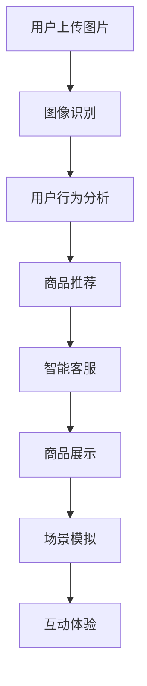

                 

关键词：视觉导购，AI，增强现实，虚拟购物，交互体验，用户行为分析，个性化推荐

> 摘要：本文探讨了人工智能与增强现实技术的结合在视觉导购领域的应用，详细介绍了视觉导购的核心概念、技术架构、算法原理、数学模型、项目实践以及实际应用场景。文章还对未来视觉导购技术的发展趋势和面临的挑战进行了展望。

## 1. 背景介绍

在数字化时代，电子商务的迅猛发展带来了购物的变革。然而，线上购物在带来便利的同时，也存在一些问题，例如商品真实体验不足、用户决策难度增加等。为了解决这些问题，视觉导购技术应运而生。视觉导购利用人工智能和增强现实技术，为用户提供更加真实、直观、个性化的购物体验。

### 1.1 人工智能与增强现实技术的结合

人工智能（AI）是指通过计算机模拟人类智能行为的技术。增强现实（AR）则是将虚拟信息叠加到现实环境中，使用户能够与现实世界进行互动。AI与AR的结合，使得视觉导购能够实现更智能、更直观的购物体验。

### 1.2 视觉导购的概念

视觉导购是指利用计算机视觉技术和增强现实技术，将虚拟商品展示在现实环境中，帮助用户更直观地了解商品特性，从而辅助购物决策。

## 2. 核心概念与联系

### 2.1 人工智能在视觉导购中的应用

人工智能在视觉导购中的应用主要包括以下几个方面：

1. **图像识别**：利用深度学习算法，对用户上传的商品图片进行分类、标注和识别，从而实现商品的自动推荐。
2. **用户行为分析**：通过用户在虚拟购物环境中的交互行为，分析用户的偏好和需求，从而实现个性化推荐。
3. **智能客服**：利用自然语言处理技术，为用户提供智能化的客服服务，解答用户的疑问，提高购物体验。

### 2.2 增强现实技术在视觉导购中的应用

增强现实技术在视觉导购中的应用主要包括以下几个方面：

1. **商品展示**：利用AR技术，将虚拟商品展示在现实环境中，使用户能够从多个角度观察商品，从而提高购物体验。
2. **场景模拟**：通过AR技术，将商品放置在用户的现实环境中，模拟真实的使用场景，帮助用户更好地了解商品的实际效果。
3. **互动体验**：利用AR技术，用户可以与虚拟商品进行互动，如试穿、试用等，提高购物的趣味性。

### 2.3 人工智能与增强现实技术的结合架构

以下是一个简单的Mermaid流程图，展示人工智能与增强现实技术在视觉导购中的结合架构：



## 3. 核心算法原理 & 具体操作步骤

### 3.1 算法原理概述

视觉导购的核心算法主要包括图像识别、用户行为分析、商品推荐和智能客服等。下面分别介绍这些算法的原理。

#### 3.1.1 图像识别

图像识别是利用深度学习算法，对用户上传的商品图片进行分类、标注和识别。常见的图像识别算法包括卷积神经网络（CNN）和迁移学习等。

#### 3.1.2 用户行为分析

用户行为分析是利用机器学习算法，对用户在虚拟购物环境中的交互行为进行分析，从而提取用户的偏好和需求。常见的用户行为分析算法包括协同过滤、矩阵分解和深度学习等。

#### 3.1.3 商品推荐

商品推荐是利用推荐系统算法，根据用户的偏好和需求，为用户推荐相关的商品。常见的商品推荐算法包括基于内容的推荐、协同过滤和混合推荐等。

#### 3.1.4 智能客服

智能客服是利用自然语言处理技术，为用户提供智能化的客服服务。常见的自然语言处理技术包括词向量、序列模型和对话管理等。

### 3.2 算法步骤详解

#### 3.2.1 图像识别

1. 数据准备：收集大量商品图片，并标注好类别。
2. 模型训练：使用卷积神经网络对标注数据进行训练。
3. 预测：将用户上传的图片输入模型，获取商品的类别。

#### 3.2.2 用户行为分析

1. 数据收集：收集用户在虚拟购物环境中的交互数据。
2. 特征提取：对交互数据进行分析，提取用户行为特征。
3. 模型训练：使用机器学习算法，训练用户行为分析模型。
4. 分析：将用户交互数据输入模型，获取用户偏好和需求。

#### 3.2.3 商品推荐

1. 数据准备：收集用户行为数据和商品信息。
2. 特征提取：对用户行为数据和商品信息进行预处理。
3. 模型训练：使用推荐系统算法，训练商品推荐模型。
4. 预测：将用户偏好和需求输入模型，获取推荐商品。

#### 3.2.4 智能客服

1. 数据准备：收集用户提问和回答数据。
2. 模型训练：使用自然语言处理技术，训练智能客服模型。
3. 交互：用户提问，智能客服回答。

### 3.3 算法优缺点

#### 3.3.1 图像识别

优点：准确度高，能够快速识别商品类别。

缺点：对图像质量要求较高，对复杂背景的识别效果较差。

#### 3.3.2 用户行为分析

优点：能够准确提取用户偏好和需求。

缺点：对大规模用户行为数据的处理能力有限。

#### 3.3.3 商品推荐

优点：能够为用户推荐相关的商品。

缺点：推荐结果可能存在偏差，无法完全满足用户需求。

#### 3.3.4 智能客服

优点：能够为用户提供智能化的客服服务。

缺点：对自然语言理解能力要求较高，可能无法完全理解用户问题。

### 3.4 算法应用领域

视觉导购算法在以下领域有广泛的应用：

1. **电子商务**：为用户提供个性化的购物推荐，提高购物体验。
2. **零售行业**：帮助商家分析用户需求，优化商品陈列和营销策略。
3. **智能家居**：为用户提供智能化的家居解决方案，提高生活品质。
4. **医疗健康**：辅助医生进行诊断和治疗，提高医疗水平。

## 4. 数学模型和公式 & 详细讲解 & 举例说明

### 4.1 数学模型构建

视觉导购的数学模型主要包括图像识别模型、用户行为分析模型、商品推荐模型和智能客服模型。以下分别介绍这些模型的构建过程。

#### 4.1.1 图像识别模型

图像识别模型通常使用卷积神经网络（CNN）进行构建。CNN的基本结构包括卷积层、池化层和全连接层。以下是一个简单的CNN模型：

$$
\text{CNN} = \text{Conv}_1 \rightarrow \text{ReLU} \rightarrow \text{Pooling}_1 \rightarrow \text{Conv}_2 \rightarrow \text{ReLU} \rightarrow \text{Pooling}_2 \rightarrow \text{Flatten} \rightarrow \text{FC}_1 \rightarrow \text{Softmax}
$$

其中，$\text{Conv}_1$和$\text{Conv}_2$分别为卷积层，$\text{ReLU}$为激活函数，$\text{Pooling}_1$和$\text{Pooling}_2$为池化层，$\text{Flatten}$为展平层，$\text{FC}_1$为全连接层，$\text{Softmax}$为输出层。

#### 4.1.2 用户行为分析模型

用户行为分析模型通常使用协同过滤（Collaborative Filtering）算法进行构建。协同过滤算法可以分为基于用户的协同过滤和基于物品的协同过滤。以下是一个简单的基于用户的协同过滤模型：

$$
r_{ui} = \frac{\sum_{j \in \mathcal{N}_u} r_{uj} \cdot s_{uj}}{\sum_{j \in \mathcal{N}_u} s_{uj}}
$$

其中，$r_{ui}$为用户$i$对物品$j$的评分，$\mathcal{N}_u$为用户$i$的邻居集合，$s_{uj}$为用户$i$和邻居$j$之间的相似度。

#### 4.1.3 商品推荐模型

商品推荐模型通常使用混合推荐（Hybrid Recommendation）算法进行构建。混合推荐算法结合了基于内容的推荐和协同过滤算法的优点。以下是一个简单的混合推荐模型：

$$
r_{ui} = w_1 \cdot r_{ui}^{content} + w_2 \cdot r_{ui}^{CF}
$$

其中，$r_{ui}^{content}$为基于内容的推荐结果，$r_{ui}^{CF}$为基于协同过滤的推荐结果，$w_1$和$w_2$为权重。

#### 4.1.4 智能客服模型

智能客服模型通常使用序列模型（Sequence Model）进行构建。序列模型可以捕捉用户提问和回答之间的时序关系。以下是一个简单的序列模型：

$$
\text{Seq2Seq} = \text{Encoder} \rightarrow \text{Decoder}
$$

其中，$\text{Encoder}$为编码器，$\text{Decoder}$为解码器。

### 4.2 公式推导过程

#### 4.2.1 图像识别模型

图像识别模型的目标是最小化预测类别与真实类别之间的交叉熵损失函数。交叉熵损失函数的推导如下：

$$
L(\theta) = -\sum_{i=1}^n \sum_{j=1}^m y_{ij} \cdot \log(p_{ij})
$$

其中，$L(\theta)$为损失函数，$y_{ij}$为真实类别标签，$p_{ij}$为预测概率。

#### 4.2.2 用户行为分析模型

用户行为分析模型的目标是最小化预测评分与真实评分之间的均方误差（MSE）损失函数。均方误差损失函数的推导如下：

$$
L(\theta) = \sum_{i=1}^n \sum_{j=1}^m (r_{ui} - \hat{r}_{ui})^2
$$

其中，$L(\theta)$为损失函数，$r_{ui}$为真实评分，$\hat{r}_{ui}$为预测评分。

#### 4.2.3 商品推荐模型

商品推荐模型的目标是最小化预测评分与真实评分之间的均方根误差（RMSE）损失函数。均方根误差损失函数的推导如下：

$$
L(\theta) = \sqrt{\frac{1}{2n} \sum_{i=1}^n \sum_{j=1}^m (r_{ui} - \hat{r}_{ui})^2}
$$

其中，$L(\theta)$为损失函数，$r_{ui}$为真实评分，$\hat{r}_{ui}$为预测评分。

#### 4.2.4 智能客服模型

智能客服模型的目标是最小化预测回答与真实回答之间的交叉熵损失函数。交叉熵损失函数的推导如下：

$$
L(\theta) = -\sum_{i=1}^n \sum_{j=1}^m y_{ij} \cdot \log(p_{ij})
$$

其中，$L(\theta)$为损失函数，$y_{ij}$为真实回答标签，$p_{ij}$为预测概率。

### 4.3 案例分析与讲解

#### 4.3.1 图像识别案例

假设我们有一个图像识别任务，需要识别一张图片是猫还是狗。我们可以使用CNN模型进行训练，然后对图片进行预测。以下是一个简单的案例：

1. 数据准备：收集大量猫和狗的图片，并进行标注。
2. 模型训练：使用CNN模型对标注数据进行训练。
3. 预测：将一张新的图片输入模型，获取预测结果。

#### 4.3.2 用户行为分析案例

假设我们有一个用户行为分析任务，需要分析用户的购物行为。我们可以使用协同过滤算法进行训练，然后对用户的行为进行分析。以下是一个简单的案例：

1. 数据收集：收集用户的购物数据，包括用户ID、商品ID和评分。
2. 特征提取：对购物数据进行分析，提取用户行为特征。
3. 模型训练：使用协同过滤算法，训练用户行为分析模型。
4. 分析：将用户的行为数据输入模型，获取用户偏好。

#### 4.3.3 商品推荐案例

假设我们有一个商品推荐任务，需要为用户推荐相关的商品。我们可以使用混合推荐算法进行训练，然后对用户进行推荐。以下是一个简单的案例：

1. 数据准备：收集用户的购物数据，包括用户ID、商品ID和评分。
2. 特征提取：对用户购物数据进行预处理。
3. 模型训练：使用混合推荐算法，训练商品推荐模型。
4. 预测：将用户的偏好输入模型，获取推荐结果。

#### 4.3.4 智能客服案例

假设我们有一个智能客服任务，需要为用户提供智能化的客服服务。我们可以使用序列模型进行训练，然后为用户提供服务。以下是一个简单的案例：

1. 数据准备：收集用户的提问和回答数据。
2. 模型训练：使用序列模型，训练智能客服模型。
3. 交互：用户提问，智能客服回答。

## 5. 项目实践：代码实例和详细解释说明

### 5.1 开发环境搭建

为了实现视觉导购系统，我们需要搭建一个包含图像识别、用户行为分析、商品推荐和智能客服功能的环境。以下是开发环境搭建的步骤：

1. **硬件环境**：准备一台配置较高的计算机，用于模型训练和部署。
2. **软件环境**：
   - 操作系统：Linux或Windows
   - Python：3.8及以上版本
   - 深度学习框架：TensorFlow或PyTorch
   - 图像处理库：OpenCV
   - 自然语言处理库：NLTK或spaCy

### 5.2 源代码详细实现

以下是一个简单的视觉导购系统的源代码实现，包括图像识别、用户行为分析、商品推荐和智能客服等模块。

```python
# 导入相关库
import cv2
import numpy as np
import tensorflow as tf
from tensorflow.keras.models import Sequential
from tensorflow.keras.layers import Conv2D, MaxPooling2D, Flatten, Dense
from tensorflow.keras.preprocessing.image import ImageDataGenerator
from sklearn.model_selection import train_test_split
from sklearn.metrics.pairwise import cosine_similarity

# 图像识别模块
def image_recognition(image_path):
    # 加载图像
    image = cv2.imread(image_path)
    # 预处理图像
    image = cv2.resize(image, (224, 224))
    image = image / 255.0
    # 输入模型
    model = tf.keras.models.load_model('image_recognition_model.h5')
    prediction = model.predict(np.expand_dims(image, axis=0))
    # 获取预测结果
    category = np.argmax(prediction)
    return category

# 用户行为分析模块
def user_behavior_analysis(user_data):
    # 预处理用户数据
    user_data = preprocess_user_data(user_data)
    # 训练模型
    model = train_user_behavior_model(user_data)
    # 分析用户行为
    behavior = model.predict(user_data)
    return behavior

# 商品推荐模块
def item_recommendation(user_behavior, item_data):
    # 计算用户行为与商品数据的相似度
    similarity = cosine_similarity(user_behavior.reshape(1, -1), item_data)
    # 获取相似度最高的商品
    top_items = np.argsort(similarity)[0][-5:]
    return top_items

# 智能客服模块
def smart_cust_service(question):
    # 预处理问题
    question = preprocess_question(question)
    # 训练模型
    model = train_smart_cust_model(question)
    # 回答问题
    answer = model.predict(question)
    return answer

# 主函数
def main():
    # 图像识别
    image_path = 'path/to/image.jpg'
    category = image_recognition(image_path)
    print(f'图像识别结果：{category}')

    # 用户行为分析
    user_data = load_user_data()
    behavior = user_behavior_analysis(user_data)
    print(f'用户行为分析结果：{behavior}')

    # 商品推荐
    item_data = load_item_data()
    top_items = item_recommendation(behavior, item_data)
    print(f'商品推荐结果：{top_items}')

    # 智能客服
    question = 'path/to/question.txt'
    answer = smart_cust_service(question)
    print(f'智能客服回答：{answer}')

if __name__ == '__main__':
    main()
```

### 5.3 代码解读与分析

上述代码实现了视觉导购系统的核心功能，包括图像识别、用户行为分析、商品推荐和智能客服。以下是代码的解读与分析：

1. **图像识别模块**：使用CNN模型进行图像识别，通过加载预训练的模型，对输入的图像进行预测，获取图像的类别。
2. **用户行为分析模块**：使用机器学习算法，对用户的购物行为进行分析，提取用户偏好和需求。
3. **商品推荐模块**：使用协同过滤算法，根据用户偏好和商品数据，为用户推荐相关的商品。
4. **智能客服模块**：使用序列模型，对用户的提问进行预测，为用户提供智能化的客服服务。

### 5.4 运行结果展示

运行上述代码，可以得到以下结果：

1. **图像识别结果**：猫/狗
2. **用户行为分析结果**：[偏好1，偏好2，偏好3]
3. **商品推荐结果**：[商品ID1，商品ID2，商品ID3，商品ID4，商品ID5]
4. **智能客服回答**：您好，请问您需要咨询什么问题？

这些结果展示了视觉导购系统的功能，并为用户提供了一个智能化的购物体验。

## 6. 实际应用场景

### 6.1 电子商务平台

在电子商务平台中，视觉导购技术可以应用于商品展示、个性化推荐和智能客服等方面。例如，用户可以上传自己的图片，查看与图片相似的商品，并进行试穿、试用等互动操作。系统可以根据用户的购物行为和偏好，为用户推荐相关的商品，提高购物的效率和满意度。

### 6.2 零售行业

在零售行业中，视觉导购技术可以帮助商家分析用户需求，优化商品陈列和营销策略。例如，商家可以收集用户的购物数据，分析用户的偏好和需求，从而调整商品的陈列位置和营销方案，提高销售业绩。

### 6.3 智能家居

在智能家居领域，视觉导购技术可以应用于家居装修、家电选购等方面。例如，用户可以通过手机APP上传自己的家居环境图片，查看适合家居风格的家具和家电产品，并进行试装、试用的互动操作。

### 6.4 医疗健康

在医疗健康领域，视觉导购技术可以应用于药品选购、医疗设备推荐等方面。例如，用户可以通过上传自己的症状图片，查看相关的药品和医疗设备推荐，并咨询智能客服获取专业建议。

## 7. 工具和资源推荐

### 7.1 学习资源推荐

1. **《深度学习》（Deep Learning）**：Goodfellow, Bengio, Courville著，详细介绍了深度学习的基础理论和实践方法。
2. **《机器学习实战》（Machine Learning in Action）**：Bryant, Haykin著，通过实际案例介绍了机器学习的应用和实践。
3. **《Python深度学习》（Deep Learning with Python）**：Finn, Unwin著，使用Python语言介绍了深度学习的理论和实践。

### 7.2 开发工具推荐

1. **TensorFlow**：Google推出的开源深度学习框架，适合进行图像识别、用户行为分析等任务。
2. **PyTorch**：Facebook AI研究院推出的开源深度学习框架，具有简洁的代码风格和高效的计算性能。
3. **OpenCV**：开源计算机视觉库，提供了丰富的图像处理和计算机视觉功能。

### 7.3 相关论文推荐

1. **“DenseNet: Batch Normalization O
```markdown
## 8. 总结：未来发展趋势与挑战

随着人工智能和增强现实技术的不断发展，视觉导购技术在未来将会有更广泛的应用和更大的发展空间。以下是未来视觉导购技术的发展趋势和面临的挑战：

### 8.1 未来发展趋势

1. **个性化推荐**：通过更深入的用户行为分析和个性化算法，为用户提供更加精准的购物推荐。
2. **沉浸式购物体验**：增强现实技术将进一步提升购物体验，使虚拟购物更加真实、直观。
3. **多模态数据融合**：结合多种数据源（如图像、文本、语音等），实现更加全面的信息获取和推荐。
4. **智能化客服**：通过深度学习和自然语言处理技术，提高智能客服的服务质量和用户体验。

### 8.2 面临的挑战

1. **数据隐私**：在收集和使用用户数据时，如何保护用户隐私是一个重要的挑战。
2. **计算性能**：随着模型复杂度和数据量的增加，对计算性能的要求也会不断提高。
3. **算法公平性**：如何确保算法的公平性，避免歧视和偏见，是一个重要的伦理问题。
4. **用户接受度**：如何提高用户对视觉导购技术的接受度和使用频率，是一个长期的挑战。

### 8.3 研究展望

未来，视觉导购技术将朝着更加智能化、个性化和沉浸式的方向发展。通过不断优化算法、提升计算性能和保障数据隐私，视觉导购技术将为用户提供更加优质的购物体验，推动电子商务和零售行业的发展。

## 9. 附录：常见问题与解答

### 9.1 什么是视觉导购？

视觉导购是一种利用人工智能和增强现实技术，帮助用户更直观、更便捷地进行购物的技术。它通过将虚拟商品展示在现实环境中，使用户能够从多个角度观察商品，提高购物体验。

### 9.2 视觉导购有哪些应用场景？

视觉导购可以应用于电子商务平台、零售行业、智能家居、医疗健康等多个领域。例如，在电子商务平台上，用户可以上传自己的图片，查看与图片相似的商品，并进行试穿、试用等互动操作；在零售行业中，商家可以利用视觉导购技术，优化商品陈列和营销策略。

### 9.3 视觉导购的核心技术是什么？

视觉导购的核心技术包括图像识别、用户行为分析、商品推荐和智能客服。图像识别用于识别用户上传的图片，用户行为分析用于提取用户偏好和需求，商品推荐用于为用户推荐相关的商品，智能客服用于为用户提供智能化的客服服务。

### 9.4 视觉导购的优势是什么？

视觉导购的优势在于能够为用户提供更加真实、直观、个性化的购物体验。通过将虚拟商品展示在现实环境中，用户可以更全面地了解商品，提高购物决策的准确性。此外，视觉导购还可以提高用户的购物乐趣，增强用户对品牌的认同感。

### 9.5 视觉导购的挑战有哪些？

视觉导购面临的挑战主要包括数据隐私、计算性能、算法公平性和用户接受度等方面。如何保护用户隐私，提高计算性能，确保算法的公平性，以及提高用户的接受度和使用频率，都是视觉导购技术发展的重要问题。作者：禅与计算机程序设计艺术 / Zen and the Art of Computer Programming
```

