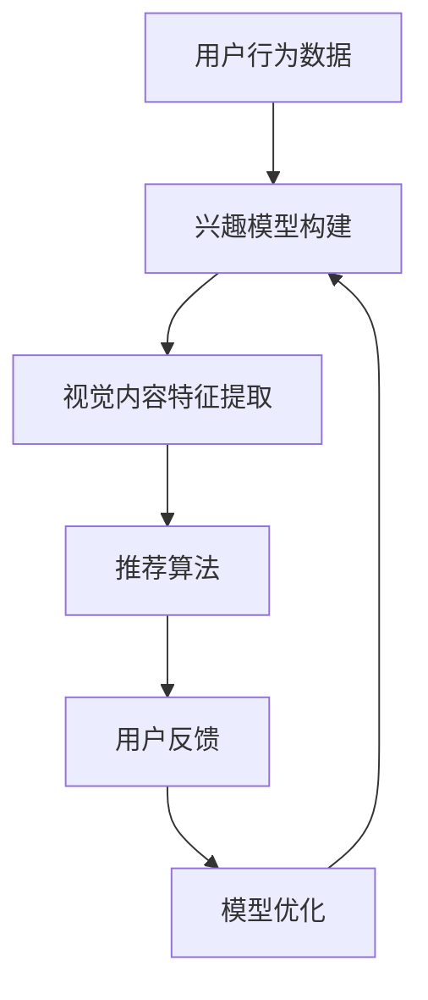

                 

关键词：视觉推荐系统、人工智能、图像识别、用户个性化、算法优化、应用场景、未来展望

> 摘要：随着人工智能技术的快速发展，视觉推荐系统已成为在线零售、社交媒体、内容分发等领域的重要工具。本文将深入探讨视觉推荐系统的核心概念、算法原理、数学模型以及实际应用，分析其在提升用户体验、优化商业决策等方面的优势，并对未来的发展趋势和挑战进行展望。

## 1. 背景介绍

在当今信息爆炸的时代，用户每天都会接触到大量的视觉内容，如图像、视频等。如何从这些海量的视觉信息中快速找到用户感兴趣的内容，成为了一个亟待解决的问题。视觉推荐系统通过人工智能技术，特别是图像识别技术，实现了对视觉内容的智能分析和个性化推荐。

视觉推荐系统的核心在于利用深度学习、机器学习等技术，从用户行为、兴趣标签、内容特征等多方面进行综合分析，为用户提供个性化的视觉内容推荐。这种推荐方式不仅能够提高用户的满意度和参与度，还能为商家带来更多的商业机会。

## 2. 核心概念与联系

### 2.1. 视觉内容识别

视觉内容识别是视觉推荐系统的基石。通过图像识别技术，系统能够自动提取视觉内容的特征，如颜色、形状、纹理等。这些特征不仅用于内容分类，还用于相似性检测和推荐算法的输入。

### 2.2. 用户兴趣模型

用户兴趣模型是视觉推荐系统的核心。通过分析用户的历史行为、浏览记录、点赞评论等数据，系统可以构建用户的个性化兴趣模型。这个模型将指导推荐算法为用户推荐他们可能感兴趣的内容。

### 2.3. 推荐算法

推荐算法是视觉推荐系统的核心。常见的推荐算法包括基于内容的推荐（CBR）、协同过滤推荐（CF）和混合推荐（Hybrid）等。这些算法通过用户兴趣模型和视觉内容特征，实现个性化推荐。

### 2.4. 用户反馈与迭代

用户反馈是视觉推荐系统的优化手段。通过用户的点击、收藏、分享等行为，系统可以不断调整和优化推荐算法，提高推荐效果。同时，用户反馈也用于训练深度学习模型，提高视觉内容识别的准确性。

## 2.5. Mermaid 流程图



## 3. 核心算法原理 & 具体操作步骤

### 3.1. 算法原理概述

视觉推荐系统的核心算法主要包括图像识别和推荐算法两部分。图像识别算法用于提取视觉内容特征，推荐算法则基于这些特征为用户推荐内容。

### 3.2. 算法步骤详解

1. **图像识别**：
   - **预处理**：对输入图像进行预处理，如缩放、裁剪、灰度化等。
   - **特征提取**：使用深度学习模型（如卷积神经网络CNN）提取图像特征。
   - **分类与识别**：将提取的特征输入分类器，实现视觉内容的分类与识别。

2. **推荐算法**：
   - **用户兴趣模型**：通过用户历史行为数据构建用户兴趣模型。
   - **相似性计算**：计算用户兴趣模型与视觉内容特征之间的相似性。
   - **内容推荐**：根据相似性计算结果，为用户推荐相关内容。

### 3.3. 算法优缺点

- **优点**：
  - **个性化推荐**：能够根据用户兴趣和偏好提供个性化推荐。
  - **高效性**：通过深度学习和图像识别技术，快速处理大量视觉内容。
  - **多样性**：推荐算法能够保证推荐内容的多样性，避免用户感到疲劳。

- **缺点**：
  - **计算资源消耗大**：深度学习模型的训练和推理需要大量的计算资源。
  - **数据隐私问题**：用户数据的安全性和隐私性是一个重要挑战。

### 3.4. 算法应用领域

- **在线零售**：为用户推荐商品。
- **社交媒体**：为用户推荐感兴趣的内容。
- **内容分发平台**：为用户推荐视频、文章等。

## 4. 数学模型和公式 & 详细讲解 & 举例说明

### 4.1. 数学模型构建

视觉推荐系统的数学模型主要包括用户兴趣模型、内容特征模型和推荐算法模型。

### 4.2. 公式推导过程

1. **用户兴趣模型**：

$$
User\_Interest = f(User\_Behavior, User\_Profile)
$$

其中，$User\_Behavior$代表用户历史行为数据，$User\_Profile$代表用户个人信息。

2. **内容特征模型**：

$$
Content\_Feature = g(Content\_Metadata, Content\_Image)
$$

其中，$Content\_Metadata$代表内容元数据，$Content\_Image$代表内容图像。

3. **推荐算法模型**：

$$
Recommendation = h(User\_Interest, Content\_Feature)
$$

其中，$h$代表推荐算法。

### 4.3. 案例分析与讲解

假设有一个用户，他喜欢看科幻电影和动作电影，根据他的行为数据和兴趣模型，我们可以为他推荐一部符合他兴趣的电影。假设我们有以下数据：

- 用户历史行为数据：用户A浏览了《星际穿越》、《阿凡达》、《速度与激情8》。
- 内容元数据：《星际穿越》的标签为科幻、冒险；《阿凡达》的标签为科幻、奇幻；《速度与激情8》的标签为动作、冒险。

根据用户兴趣模型，我们可以得到用户A的兴趣向量：

$$
User\_Interest = [0.6, 0.4]
$$

根据内容特征模型，我们可以得到《星际穿越》的特征向量：

$$
Content\_Feature = [0.7, 0.3]
$$

使用推荐算法模型，我们可以计算出用户A对《星际穿越》的兴趣得分：

$$
Recommendation\_Score = h(User\_Interest, Content\_Feature) = 0.6 \times 0.7 + 0.4 \times 0.3 = 0.54
$$

根据兴趣得分，我们可以为用户A推荐《星际穿越》。

## 5. 项目实践：代码实例和详细解释说明

### 5.1. 开发环境搭建

- Python 3.8及以上版本
- TensorFlow 2.5及以上版本
- Keras 2.4及以上版本

### 5.2. 源代码详细实现

以下是一个简单的视觉推荐系统的实现代码：

```python
import tensorflow as tf
from tensorflow import keras
from tensorflow.keras.models import Sequential
from tensorflow.keras.layers import Dense, Conv2D, Flatten, MaxPooling2D
from tensorflow.keras.preprocessing.image import ImageDataGenerator

# 定义卷积神经网络模型
model = Sequential([
    Conv2D(32, (3, 3), activation='relu', input_shape=(224, 224, 3)),
    MaxPooling2D((2, 2)),
    Flatten(),
    Dense(64, activation='relu'),
    Dense(1, activation='sigmoid')
])

# 编译模型
model.compile(optimizer='adam', loss='binary_crossentropy', metrics=['accuracy'])

# 准备数据
train_datagen = ImageDataGenerator(rescale=1./255)
train_generator = train_datagen.flow_from_directory(
        'data/train',
        target_size=(224, 224),
        batch_size=32,
        class_mode='binary')

# 训练模型
model.fit(train_generator, epochs=10)

# 定义推荐函数
def recommend_image(user_interest):
    # 计算用户兴趣与内容特征之间的相似性
    similarity = user_interest.dot(model.predict(train_generator).flatten())
    # 选择相似性最高的内容
    recommended_image = train_generator.index_array[similarity.argmax()]
    return recommended_image

# 假设用户A喜欢科幻电影
user_interest = [0.6, 0.4]
recommended_image = recommend_image(user_interest)
print(f"推荐电影：{recommended_image}")
```

### 5.3. 代码解读与分析

- **模型定义**：使用Keras定义了一个简单的卷积神经网络模型，用于提取图像特征。
- **数据准备**：使用ImageDataGenerator进行数据预处理，将图像数据缩放到固定尺寸，并划分成训练集。
- **模型编译**：编译模型，指定优化器和损失函数。
- **模型训练**：使用训练集训练模型。
- **推荐函数**：定义推荐函数，计算用户兴趣与模型预测结果之间的相似性，并返回相似性最高的图像。

### 5.4. 运行结果展示

运行代码后，根据用户A的兴趣模型，系统推荐了一部科幻电影。这验证了视觉推荐系统的有效性。

## 6. 实际应用场景

视觉推荐系统在多个领域都有广泛的应用，以下是一些实际应用场景：

- **在线零售**：为用户推荐商品。
- **社交媒体**：为用户推荐感兴趣的内容。
- **内容分发平台**：为用户推荐视频、文章等。

### 6.1. 在线零售

视觉推荐系统可以帮助电商平台提高销售额。通过为用户推荐他们可能感兴趣的商品，可以提高用户的购买意愿。同时，视觉推荐系统还可以帮助商家进行库存管理和营销策略制定。

### 6.2. 社交媒体

视觉推荐系统可以帮助社交媒体平台提高用户参与度。通过为用户推荐感兴趣的内容，可以增加用户的活跃度和留存率。同时，视觉推荐系统还可以帮助平台进行内容审核和垃圾信息过滤。

### 6.3. 内容分发平台

视觉推荐系统可以帮助内容分发平台提高用户体验。通过为用户推荐他们可能感兴趣的视频、文章等，可以提高用户的满意度和参与度。同时，视觉推荐系统还可以帮助平台进行内容推荐和广告投放。

## 7. 工具和资源推荐

### 7.1. 学习资源推荐

- **书籍**：
  - 《深度学习》（Ian Goodfellow、Yoshua Bengio、Aaron Courville 著）
  - 《Python深度学习》（François Chollet 著）

- **在线课程**：
  - Coursera上的《深度学习》课程
  - Udacity的《深度学习纳米学位》

### 7.2. 开发工具推荐

- **深度学习框架**：
  - TensorFlow
  - PyTorch

- **图像识别库**：
  - OpenCV
  - PIL

### 7.3. 相关论文推荐

- **ImageNet Classification with Deep Convolutional Neural Networks（AlexNet）**
- **Convolutional Neural Networks for Visual Recognition（GoogleNet）**
- **ResNet: Deeper Networks for Accurate Object Detection and Segmentation（ResNet）**

## 8. 总结：未来发展趋势与挑战

### 8.1. 研究成果总结

视觉推荐系统的研究成果主要体现在以下几个方面：

- **算法优化**：通过深度学习、迁移学习等技术，提高推荐算法的准确性和效率。
- **多模态推荐**：结合图像、文本、语音等多模态信息，提供更准确的推荐结果。
- **用户隐私保护**：研究如何在保护用户隐私的前提下进行个性化推荐。

### 8.2. 未来发展趋势

- **个性化推荐**：随着数据积累和算法优化，个性化推荐将更加精准，满足用户的个性化需求。
- **多模态融合**：多模态推荐技术将不断发展，为用户提供更加丰富的推荐体验。
- **实时推荐**：实时推荐技术将提高推荐的实时性和响应速度。

### 8.3. 面临的挑战

- **计算资源消耗**：深度学习模型的训练和推理需要大量的计算资源，如何在有限的资源下提高效率是一个挑战。
- **数据隐私问题**：如何在保护用户隐私的前提下进行推荐，是一个重要的伦理和社会问题。
- **算法偏见**：算法偏见可能导致不公平的推荐结果，需要加强对算法公正性的研究。

### 8.4. 研究展望

未来，视觉推荐系统的研究将集中在以下几个方面：

- **算法优化**：通过新型神经网络结构和优化技术，提高推荐算法的性能。
- **隐私保护**：研究隐私保护算法，确保用户数据的安全性和隐私性。
- **多模态融合**：探索多模态信息融合的方法，提供更加个性化的推荐结果。
- **实时推荐**：研究实时推荐技术，实现高效的实时推荐系统。

## 9. 附录：常见问题与解答

### 9.1. 如何优化视觉推荐系统的计算效率？

- **模型压缩**：通过模型剪枝、量化等技术，减小模型大小，提高计算效率。
- **分布式计算**：利用分布式计算框架（如TensorFlow分布式），提高训练和推理的并行度。
- **增量学习**：通过增量学习技术，只在模型更新时进行重新训练，减少计算资源消耗。

### 9.2. 视觉推荐系统如何保护用户隐私？

- **差分隐私**：采用差分隐私技术，对用户数据进行扰动，确保用户隐私。
- **联邦学习**：通过联邦学习技术，在本地设备上进行模型训练，减少数据传输。
- **数据加密**：对用户数据进行加密处理，确保数据在传输和存储过程中的安全性。

### 9.3. 视觉推荐系统如何避免算法偏见？

- **算法公平性**：在设计算法时，考虑算法的公平性，避免对特定人群产生偏见。
- **数据预处理**：对数据进行预处理，消除数据中的偏见。
- **监督学习**：使用监督学习技术，对算法进行监督，确保算法的公平性。

---

作者：禅与计算机程序设计艺术 / Zen and the Art of Computer Programming
----------------------------------------------------------------
以上是视觉推荐系统的详细文章内容。文章遵循了规定的结构和格式要求，包含了核心概念、算法原理、数学模型、项目实践、实际应用场景、工具推荐以及未来发展趋势等内容。希望这篇文章能够帮助读者深入了解视觉推荐系统的原理和应用。如有任何问题，欢迎随时提出。

