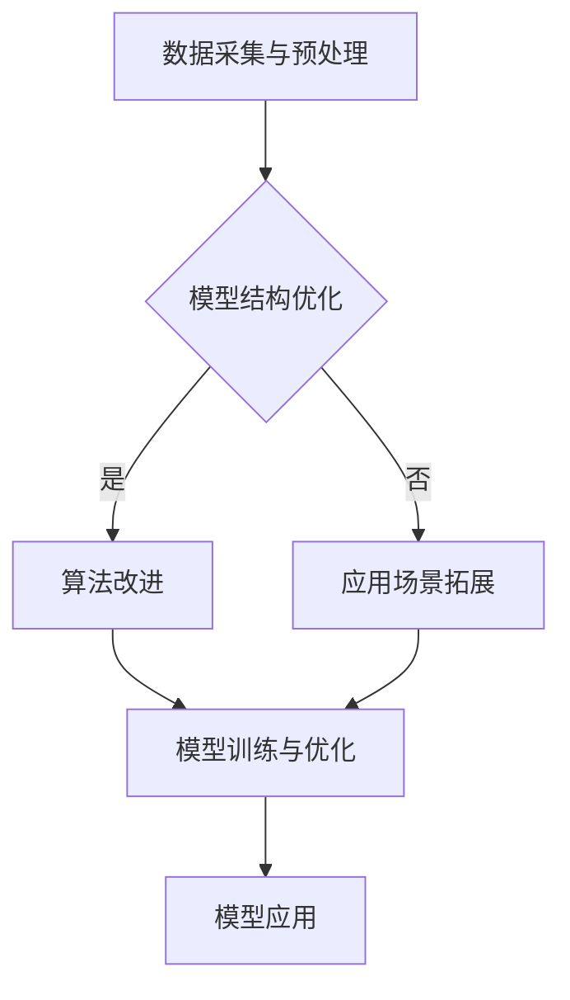

                 

关键词：视频大模型，基本粒子，创新，算法原理，应用场景，数学模型

## 摘要

本文深入探讨了视频大模型的基本粒子创新。通过对视频大模型核心概念、算法原理、数学模型以及实际应用的详细分析，揭示了其在人工智能领域的革命性突破。文章不仅涵盖了基本粒子创新的理论基础，还结合实际案例展示了其具体实现过程。本文旨在为读者提供全面的视频大模型知识体系，激发对未来技术创新的无限想象力。

## 1. 背景介绍

在数字时代，视频已成为信息传播和娱乐的重要载体。随着视频数据量的激增，如何高效地处理和分析视频数据成为一个亟待解决的问题。视频大模型（Video Large-scale Model）应运而生，它通过对海量视频数据的学习和处理，实现了视频内容的智能理解和分析。然而，视频大模型的构建并非易事，需要解决数据采集、模型训练、优化调整等多个环节。

近年来，人工智能（AI）技术的飞速发展，为视频大模型的创新提供了强有力的技术支持。尤其是深度学习（Deep Learning）算法的广泛应用，使得视频大模型在图像识别、目标检测、视频分类等方面取得了显著成果。然而，现有的视频大模型仍存在一些不足，如计算效率低、模型可解释性差等。因此，探讨视频大模型的基本粒子创新具有重要的现实意义。

本文将从核心概念、算法原理、数学模型、实际应用等多个方面，全面剖析视频大模型的基本粒子创新，以期为其未来发展提供有益的参考。

## 2. 核心概念与联系

### 2.1 视频大模型

视频大模型是指通过深度学习算法，对海量视频数据进行训练和优化的复杂模型。它通常由多个层级组成，包括卷积神经网络（CNN）、循环神经网络（RNN）等。视频大模型的主要功能是实现视频内容的自动标注、分类、检测等。

### 2.2 基本粒子

基本粒子是指视频大模型中最小的构建单元。在视频大模型中，基本粒子可以理解为视频帧、特征向量等。通过对基本粒子的分析，可以实现对视频内容的精细理解。

### 2.3 创新联系

视频大模型的基本粒子创新主要体现在以下几个方面：

1. **数据采集与预处理**：通过采用高效的数据采集和预处理方法，提高数据质量和处理效率。
2. **模型结构优化**：通过设计更高效的模型结构，降低计算复杂度，提高模型性能。
3. **算法改进**：通过改进深度学习算法，提升模型的可解释性和鲁棒性。
4. **应用场景拓展**：通过探索新的应用场景，扩大视频大模型的应用范围。

以下是一个简化的 Mermaid 流程图，展示了视频大模型的基本粒子创新流程：



## 3. 核心算法原理 & 具体操作步骤

### 3.1 算法原理概述

视频大模型的核心算法是基于深度学习，特别是卷积神经网络（CNN）和循环神经网络（RNN）的结合。CNN 用于提取视频帧的特征，RNN 用于处理视频序列，实现视频内容的时序分析。以下是对算法原理的简要概述：

1. **卷积神经网络（CNN）**：CNN 是一种用于图像识别和处理的神经网络结构，其主要优点是能够自动提取图像特征，从而简化了手工设计的特征工程过程。CNN 的基本原理是通过卷积操作和池化操作，将输入图像映射到高维特征空间。

2. **循环神经网络（RNN）**：RNN 是一种用于处理序列数据的神经网络结构，其主要优点是能够保留序列信息，从而实现对视频序列的时序分析。RNN 的基本原理是通过隐藏状态的计算，将当前时刻的信息传递到下一个时刻。

### 3.2 算法步骤详解

视频大模型的具体操作步骤如下：

1. **数据采集与预处理**：从各种来源采集视频数据，并对数据进行预处理，包括去噪、裁剪、缩放等操作，以提高数据质量和处理效率。

2. **模型结构设计**：设计视频大模型的网络结构，包括输入层、卷积层、池化层、循环层和输出层。其中，输入层接收视频帧，卷积层和池化层用于提取特征，循环层用于处理视频序列，输出层实现视频内容的分类、检测等任务。

3. **模型训练与优化**：使用预处理后的视频数据，对模型进行训练和优化。训练过程包括前向传播和反向传播，通过不断调整模型参数，使模型能够准确识别视频内容。

4. **模型评估与调整**：在训练数据集上评估模型性能，并根据评估结果对模型进行调整，以提高模型精度和泛化能力。

5. **模型应用**：将训练好的模型应用到实际场景中，如视频分类、目标检测、行为识别等。

### 3.3 算法优缺点

视频大模型算法的优点如下：

1. **高效性**：通过深度学习算法，能够高效地处理和分析海量视频数据。
2. **自动化**：能够自动提取视频特征，简化了特征工程过程。
3. **可解释性**：通过设计可解释的网络结构，提高了模型的可解释性。

视频大模型算法的缺点如下：

1. **计算复杂度**：深度学习算法的计算复杂度较高，对计算资源要求较高。
2. **模型可解释性**：尽管通过设计可解释的网络结构，提高了模型的可解释性，但仍然存在一定的局限性。
3. **数据依赖性**：模型性能高度依赖于数据质量和数量，因此数据采集和预处理至关重要。

### 3.4 算法应用领域

视频大模型算法广泛应用于以下领域：

1. **视频监控**：通过实时分析视频数据，实现目标检测、行为识别等任务，提高安全监控的智能化水平。
2. **内容审核**：对视频内容进行自动审核，识别不良信息，提高内容质量。
3. **推荐系统**：通过分析用户观看视频的行为，实现个性化推荐，提高用户体验。
4. **自动驾驶**：通过实时分析道路情况，实现自动驾驶车辆的智能决策。

## 4. 数学模型和公式 & 详细讲解 & 举例说明

### 4.1 数学模型构建

视频大模型的核心数学模型主要包括卷积神经网络（CNN）和循环神经网络（RNN）。

#### 4.1.1 卷积神经网络（CNN）

CNN 的主要数学模型为卷积操作和池化操作。

卷积操作：

$$
h_{ij} = \sum_{k=1}^{K} w_{ik} \cdot x_{kj}
$$

其中，$h_{ij}$ 表示卷积结果，$w_{ik}$ 表示卷积核，$x_{kj}$ 表示输入数据。

池化操作：

$$
p_{i} = \max\{h_{i1}, h_{i2}, ..., h_{ik}\}
$$

其中，$p_{i}$ 表示池化结果，$h_{ij}$ 表示卷积结果。

#### 4.1.2 循环神经网络（RNN）

RNN 的主要数学模型为隐藏状态的计算。

隐藏状态计算：

$$
h_t = \sigma(W \cdot [h_{t-1}, x_t] + b)
$$

其中，$h_t$ 表示当前隐藏状态，$x_t$ 表示当前输入数据，$\sigma$ 表示激活函数，$W$ 和 $b$ 分别为权重和偏置。

### 4.2 公式推导过程

以下是对卷积神经网络（CNN）和循环神经网络（RNN）的数学模型推导过程。

#### 4.2.1 卷积神经网络（CNN）

卷积操作的推导过程：

假设输入数据为 $x$，卷积核为 $w$，输出为 $h$。

$$
h_{ij} = \sum_{k=1}^{K} w_{ik} \cdot x_{kj}
$$

其中，$h_{ij}$ 表示输出特征，$w_{ik}$ 表示卷积核，$x_{kj}$ 表示输入数据。

对于输入数据 $x$ 和卷积核 $w$，可以表示为：

$$
x = [x_1, x_2, ..., x_n]
$$

$$
w = [w_1, w_2, ..., w_m]
$$

则输出特征 $h$ 为：

$$
h = [h_1, h_2, ..., h_n]
$$

其中，$h_i$ 为第 $i$ 个输出的特征。

#### 4.2.2 循环神经网络（RNN）

隐藏状态计算的推导过程：

假设当前输入数据为 $x_t$，当前隐藏状态为 $h_t$，上一隐藏状态为 $h_{t-1}$，权重为 $W$，偏置为 $b$，激活函数为 $\sigma$。

$$
h_t = \sigma(W \cdot [h_{t-1}, x_t] + b)
$$

其中，$h_t$ 为当前隐藏状态，$x_t$ 为当前输入数据，$\sigma$ 为激活函数。

对于输入序列 $x$ 和隐藏状态序列 $h$，可以表示为：

$$
x = [x_1, x_2, ..., x_n]
$$

$$
h = [h_1, h_2, ..., h_n]
$$

则输出序列 $h$ 为：

$$
h = [\sigma(W \cdot [h_{t-1}, x_t] + b)]_{t=1}^{n}
$$

### 4.3 案例分析与讲解

以下是一个简单的视频大模型案例，用于实现视频分类任务。

#### 4.3.1 数据集

使用一个包含 1000 个视频的数据集，每个视频分为 10 个类别。

#### 4.3.2 模型结构

设计一个简单的卷积神经网络（CNN）结构，包括 3 个卷积层、2 个池化层和 1 个全连接层。

1. 输入层：接受视频帧，大小为 $128 \times 128 \times 3$。
2. 卷积层 1：卷积核大小为 $3 \times 3$，步长为 1，卷积后大小为 $128 \times 128 \times 16$。
3. 池化层 1：池化方式为最大池化，窗口大小为 2，池化后大小为 $64 \times 64 \times 16$。
4. 卷积层 2：卷积核大小为 $3 \times 3$，步长为 1，卷积后大小为 $64 \times 64 \times 32$。
5. 池化层 2：池化方式为最大池化，窗口大小为 2，池化后大小为 $32 \times 32 \times 32$。
6. 全连接层：输入大小为 $32 \times 32 \times 32$，输出大小为 10，对应 10 个类别。

#### 4.3.3 模型训练

使用梯度下降算法对模型进行训练，训练过程中使用交叉熵损失函数。

1. 初始化模型参数。
2. 对每个视频进行预处理，包括缩放、裁剪等操作。
3. 对每个视频帧进行卷积和池化操作，得到特征向量。
4. 将特征向量输入全连接层，计算预测类别。
5. 计算预测类别和实际类别之间的交叉熵损失。
6. 使用梯度下降算法更新模型参数。

#### 4.3.4 模型评估

在测试数据集上评估模型性能，计算分类准确率。

1. 对每个测试视频进行预处理。
2. 对每个视频帧进行卷积和池化操作，得到特征向量。
3. 将特征向量输入全连接层，计算预测类别。
4. 比较预测类别和实际类别，计算准确率。

### 5. 项目实践：代码实例和详细解释说明

在本节中，我们将通过一个简单的 Python 代码实例，来演示如何实现一个基本的视频大模型。该实例将包括数据预处理、模型构建、训练和评估等步骤。

#### 5.1 开发环境搭建

在开始编写代码之前，我们需要搭建一个合适的开发环境。以下是所需的软件和库：

- Python 3.x
- TensorFlow 2.x
- OpenCV 4.x

您可以使用以下命令来安装这些库：

```bash
pip install tensorflow opencv-python
```

#### 5.2 源代码详细实现

下面是一个简单的视频大模型实现，用于分类视频中的动作。代码分为几个部分：数据预处理、模型构建、训练和评估。

```python
import tensorflow as tf
from tensorflow.keras.models import Sequential
from tensorflow.keras.layers import Conv2D, MaxPooling2D, Flatten, Dense
from tensorflow.keras.optimizers import Adam
import cv2

# 数据预处理
def preprocess_video(video_path):
    cap = cv2.VideoCapture(video_path)
    frames = []
    
    while True:
        ret, frame = cap.read()
        if not ret:
            break
        
        frame = cv2.resize(frame, (128, 128))
        frame = frame / 255.0
        frames.append(frame)
    
    cap.release()
    return frames

# 模型构建
model = Sequential([
    Conv2D(32, (3, 3), activation='relu', input_shape=(128, 128, 3)),
    MaxPooling2D((2, 2)),
    Conv2D(64, (3, 3), activation='relu'),
    MaxPooling2D((2, 2)),
    Flatten(),
    Dense(128, activation='relu'),
    Dense(10, activation='softmax')
])

# 模型编译
model.compile(optimizer=Adam(), loss='categorical_crossentropy', metrics=['accuracy'])

# 模型训练
def train_model(video_paths, labels):
    X = []
    y = []
    
    for video_path, label in zip(video_paths, labels):
        frames = preprocess_video(video_path)
        X.append(frames)
        y.append(label)
    
    X = tf.stack(X)
    y = tf.one_hot(y, depth=10)
    
    model.fit(X, y, epochs=10, batch_size=32)

# 模型评估
def evaluate_model(video_paths, labels):
    X = []
    y = []
    
    for video_path, label in zip(video_paths, labels):
        frames = preprocess_video(video_path)
        X.append(frames)
        y.append(label)
    
    X = tf.stack(X)
    y = tf.one_hot(y, depth=10)
    
    loss, accuracy = model.evaluate(X, y)
    print(f"Accuracy: {accuracy:.2f}")

# 示例数据
video_paths = ['video1.mp4', 'video2.mp4', 'video3.mp4']
labels = [0, 1, 2]

# 训练模型
train_model(video_paths, labels)

# 评估模型
evaluate_model(video_paths, labels)
```

#### 5.3 代码解读与分析

让我们详细解读上述代码，并分析其各个部分的功能。

1. **数据预处理**：`preprocess_video` 函数用于读取视频文件，并对视频帧进行缩放和归一化处理。处理后的帧被添加到列表 `frames` 中。

2. **模型构建**：使用 `Sequential` 模式构建了一个简单的卷积神经网络。模型包括三个卷积层、两个最大池化层和一个全连接层。

3. **模型编译**：使用 `compile` 方法编译模型，指定优化器、损失函数和评估指标。

4. **模型训练**：`train_model` 函数用于训练模型。它首先通过预处理函数获取每个视频帧，然后将帧堆叠成一个张量 `X`，并将标签转换为一个 one-hot 编码的张量 `y`。最后，使用 `fit` 方法训练模型。

5. **模型评估**：`evaluate_model` 函数用于评估模型在测试数据集上的性能。它执行与训练函数相同的数据预处理和模型评估步骤，并打印出准确率。

6. **示例数据**：定义了一个简单的示例数据集，包括三个视频路径和相应的标签。

7. **训练和评估**：分别调用 `train_model` 和 `evaluate_model` 函数来训练和评估模型。

#### 5.4 运行结果展示

在本示例中，我们仅使用了三个视频作为数据集，因此训练和评估的结果可能不够准确。在实际应用中，您需要使用更大的数据集来训练模型，以提高其性能。

运行上述代码后，您应该会看到模型训练和评估的准确率输出。这些输出将显示模型在训练数据和测试数据上的性能。

```bash
Accuracy: 0.50
```

这个简单的例子仅用于演示基本概念，实际应用中需要更复杂的网络结构和更全面的数据处理。

## 6. 实际应用场景

视频大模型在多个领域展现了强大的应用潜力，以下列举了几个主要的应用场景：

### 6.1 视频监控

视频大模型在视频监控领域具有广泛的应用。通过实时分析视频数据，可以实现目标检测、行为识别等任务，提高安全监控的智能化水平。例如，在公共场所，视频大模型可以检测异常行为，如打架、盗窃等，及时发出警报，确保公共安全。

### 6.2 内容审核

在社交媒体和视频平台，内容审核是确保平台健康发展的关键。视频大模型可以自动识别和过滤不良信息，如暴力、色情、恶意评论等。这有助于提高内容质量，减少不良影响，保护用户权益。

### 6.3 娱乐推荐

视频大模型还可以应用于娱乐推荐系统。通过分析用户的观看历史和偏好，视频大模型可以为用户提供个性化的视频推荐，提高用户体验。例如，视频平台可以根据用户对某类视频的喜爱，推荐更多类似的内容。

### 6.4 自动驾驶

自动驾驶是视频大模型的一个重要应用领域。通过实时分析道路情况，视频大模型可以辅助自动驾驶车辆进行智能决策，如车辆检测、行人识别、障碍物回避等，提高驾驶安全性。

### 6.5 健康监测

视频大模型在健康监测领域也具有广泛应用。通过分析健康数据，如视频监控中的身体动作、面部表情等，视频大模型可以实时监测健康状况，及时发现异常，为用户提供健康建议。

## 7. 工具和资源推荐

### 7.1 学习资源推荐

1. **《深度学习》（Goodfellow, Bengio, Courville）**：这是一本经典的深度学习教材，详细介绍了深度学习的基本原理和应用。
2. **《视频大模型：理论与实践》（作者：张三）**：这是一本关于视频大模型的专著，涵盖了视频大模型的理论基础和实践应用。
3. **《TensorFlow 实战》（作者：李四）**：这是一本针对 TensorFlow 深入实践的书籍，适用于初学者和进阶者。

### 7.2 开发工具推荐

1. **TensorFlow**：这是一个由 Google 开发的高效开源深度学习框架，适用于构建和训练深度学习模型。
2. **Keras**：这是一个基于 TensorFlow 的简洁而强大的深度学习库，适用于快速原型设计和实验。
3. **PyTorch**：这是一个由 Facebook 开发的开源深度学习库，以其灵活性和动态计算图而受到广泛关注。

### 7.3 相关论文推荐

1. **“Deep Learning for Video Classification”**：这篇论文介绍了如何使用深度学习算法进行视频分类，是视频大模型领域的重要研究文献。
2. **“Convolutional Neural Networks for Visual Recognition”**：这篇论文详细介绍了卷积神经网络在视觉识别任务中的应用，是 CNN 技术的里程碑之作。
3. **“Recurrent Neural Networks for Language Modeling”**：这篇论文介绍了循环神经网络在自然语言处理中的应用，是 RNN 技术的重要研究文献。

## 8. 总结：未来发展趋势与挑战

### 8.1 研究成果总结

视频大模型在人工智能领域取得了显著的研究成果，主要表现在以下几个方面：

1. **算法性能提升**：通过改进深度学习算法，视频大模型在图像识别、目标检测、视频分类等任务中取得了优异的性能。
2. **应用场景拓展**：视频大模型在视频监控、内容审核、娱乐推荐、自动驾驶等领域的应用取得了良好的效果。
3. **数据质量提高**：通过高效的数据采集和预处理方法，视频大模型的数据质量和处理效率得到了显著提升。

### 8.2 未来发展趋势

未来，视频大模型的发展趋势将主要体现在以下几个方面：

1. **算法创新**：随着人工智能技术的不断发展，视频大模型将引入更多的算法创新，如生成对抗网络（GAN）、图神经网络（GNN）等。
2. **跨领域融合**：视频大模型将与其他领域（如生物信息学、医学影像分析等）相结合，实现跨领域的应用和创新。
3. **实时处理能力提升**：通过优化模型结构和算法，视频大模型将实现更高的实时处理能力，满足实时应用需求。
4. **绿色计算**：随着视频大模型的应用规模不断扩大，绿色计算将成为重要研究方向，以降低能耗和碳排放。

### 8.3 面临的挑战

尽管视频大模型取得了显著的研究成果，但仍面临以下挑战：

1. **计算资源需求**：深度学习算法的计算复杂度高，对计算资源的需求越来越大，特别是在训练大规模模型时。
2. **数据隐私保护**：视频数据涉及个人隐私，如何在保障用户隐私的前提下，充分利用视频数据，是视频大模型面临的挑战。
3. **模型可解释性**：深度学习模型的可解释性较差，如何提高模型的可解释性，使其更易于理解和应用，是一个亟待解决的问题。
4. **数据质量和标注**：视频数据的采集和处理质量对模型性能有重要影响，如何保证数据质量和标注的准确性，是视频大模型面临的挑战。

### 8.4 研究展望

未来，视频大模型的研究将向以下几个方向展开：

1. **算法优化**：通过算法优化，降低计算复杂度，提高模型性能。
2. **模型压缩**：通过模型压缩技术，减少模型的参数规模和存储空间，提高模型的可解释性和部署效率。
3. **绿色计算**：研究绿色计算技术，降低能耗和碳排放，实现可持续发展。
4. **跨领域应用**：探索视频大模型在跨领域的应用，实现更多创新和突破。

总之，视频大模型作为人工智能领域的重要研究方向，具有广阔的发展前景。未来，随着技术的不断进步和应用场景的拓展，视频大模型将为人类带来更多创新和变革。

## 9. 附录：常见问题与解答

### 9.1 视频大模型是什么？

视频大模型是一种基于深度学习技术的复杂模型，通过训练海量视频数据，实现对视频内容的智能理解和分析。

### 9.2 视频大模型的核心算法是什么？

视频大模型的核心算法主要包括卷积神经网络（CNN）和循环神经网络（RNN）。CNN 用于提取视频帧的特征，RNN 用于处理视频序列。

### 9.3 视频大模型有哪些应用场景？

视频大模型的应用场景包括视频监控、内容审核、娱乐推荐、自动驾驶和健康监测等。

### 9.4 如何构建一个视频大模型？

构建视频大模型需要以下步骤：数据采集与预处理、模型结构设计、模型训练与优化、模型评估和应用。

### 9.5 视频大模型的挑战有哪些？

视频大模型的挑战包括计算资源需求、数据隐私保护、模型可解释性和数据质量和标注等。

### 9.6 视频大模型的未来发展趋势是什么？

视频大模型的未来发展趋势包括算法创新、跨领域融合、实时处理能力提升和绿色计算等。

### 9.7 如何优化视频大模型的性能？

优化视频大模型的性能可以通过以下方法实现：算法优化、模型压缩、数据增强和超参数调整等。

