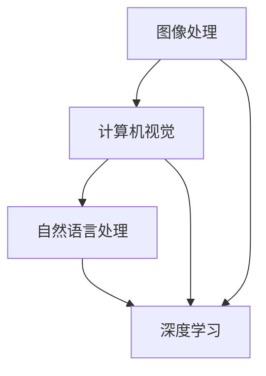
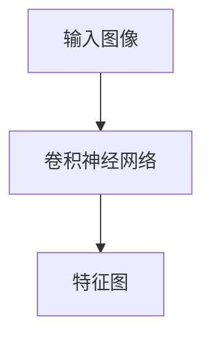
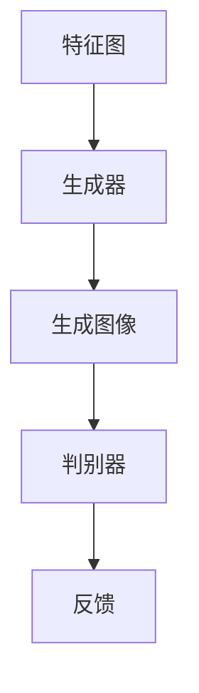
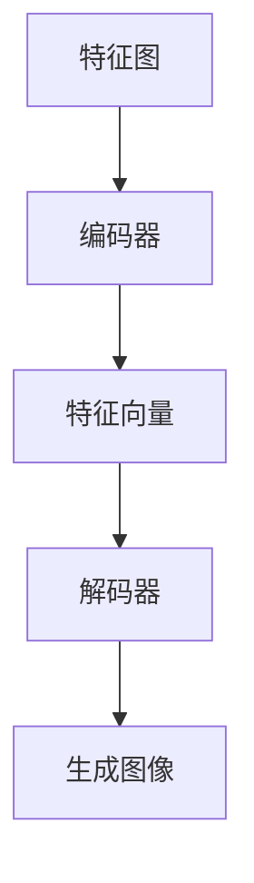
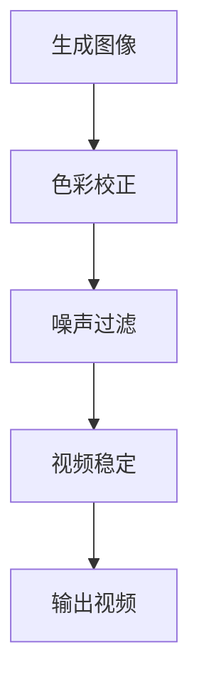

                 

 在当今数字化时代，视频生成技术正逐渐成为媒体内容创作和传播的重要工具。无论是娱乐、教育、市场营销，还是科学研究，视频生成都发挥着至关重要的作用。本篇文章将深入探讨视频生成技术的核心概念、算法原理、数学模型、项目实践以及未来的发展趋势和挑战。

> **关键词：** 视频生成、深度学习、计算机视觉、图像处理、自然语言处理

> **摘要：** 本文将详细分析视频生成技术的各个方面，包括其基本概念、核心算法、数学模型以及实际应用。通过对视频生成技术的全面了解，读者将能够掌握该领域的最新进展，并对其未来发展有更清晰的认知。

## 1. 背景介绍

视频生成，顾名思义，是指利用计算机技术和算法生成视频内容的过程。随着计算机性能的不断提升和算法的不断发展，视频生成技术正变得越来越成熟和实用。从早期的简单视频合成到如今复杂的动态视频生成，视频生成技术经历了多次技术革命。

在媒体内容创作领域，视频生成技术可以大大提高内容的多样性和吸引力。例如，在电影制作、广告宣传、虚拟现实等领域，视频生成技术已经成为了不可或缺的工具。此外，视频生成在科学研究和教育领域也发挥着重要作用，例如，通过视频生成技术可以模拟复杂的物理过程和化学反应，为学生提供直观的教学资源。

### 1.1 发展历程

视频生成技术的发展可以分为以下几个阶段：

1. **早期视频合成**：最初的视频生成技术主要依赖于传统的计算机图形学和动画技术。通过二维图形的拼接和动画制作，生成简单的视频内容。

2. **基于规则的视频生成**：随着算法的发展，人们开始利用规则和模型生成视频。这种方法虽然能够生成更复杂的视频，但受限于规则和模型的复杂性，生成效果仍不够自然。

3. **基于机器学习的视频生成**：近年来，深度学习和神经网络技术的发展，使得视频生成技术取得了突破性的进展。通过训练大规模的神经网络模型，可以生成更加真实、自然的视频内容。

4. **实时视频生成**：随着硬件性能的提升和算法的优化，实时视频生成技术逐渐成熟，可以在交互式应用中实现高效的视频生成。

### 1.2 当前应用

目前，视频生成技术在多个领域得到了广泛应用：

- **娱乐与媒体**：电影、电视剧、动画制作等。
- **市场营销**：广告宣传、产品演示等。
- **教育**：教学视频、虚拟实验等。
- **科学研究**：数据可视化、模拟实验等。
- **虚拟现实与增强现实**：提供更加丰富的虚拟环境。

## 2. 核心概念与联系

视频生成技术涉及多个核心概念，包括图像处理、计算机视觉、自然语言处理和深度学习等。以下是一个简要的Mermaid流程图，用于展示这些概念之间的联系。



### 2.1 图像处理

图像处理是视频生成的基础技术，它涉及到图像的获取、处理和增强。常见的图像处理技术包括滤波、边缘检测、图像分割、图像恢复等。

### 2.2 计算机视觉

计算机视觉是研究如何使计算机“看到”和理解图像的技术。它在视频生成中起着关键作用，用于图像识别、目标检测、场景分割等。

### 2.3 自然语言处理

自然语言处理（NLP）技术用于处理和生成文本信息。在视频生成中，NLP技术可以用于文本到图像的转换、视频字幕生成等。

### 2.4 深度学习

深度学习是视频生成技术的核心驱动力。通过训练大规模的神经网络模型，可以自动学习图像和视频的特征，生成高质量的视频内容。

## 3. 核心算法原理 & 具体操作步骤

### 3.1 算法原理概述

视频生成算法主要分为两大类：基于规则的视频生成和基于数据驱动（如深度学习）的视频生成。本节将重点介绍基于深度学习的视频生成算法。

基于深度学习的视频生成算法通常包括以下步骤：

1. **特征提取**：使用卷积神经网络（CNN）提取输入图像的特征。
2. **视频生成**：使用生成对抗网络（GAN）或变分自编码器（VAE）等模型生成视频。
3. **后处理**：对生成的视频进行色彩校正、噪声过滤等后处理。

### 3.2 算法步骤详解

#### 3.2.1 特征提取

特征提取是视频生成的第一步，常用的方法是使用卷积神经网络（CNN）提取图像的特征。



在卷积神经网络中，通过多层卷积和池化操作，逐步提取图像的局部特征和全局特征。

#### 3.2.2 视频生成

特征提取后，生成的特征图将被输入到生成模型中。常见的生成模型包括生成对抗网络（GAN）和变分自编码器（VAE）。

- **生成对抗网络（GAN）**：GAN由生成器和判别器组成。生成器生成图像，判别器判断图像的真伪。通过训练，生成器逐渐生成逼真的图像。



- **变分自编码器（VAE）**：VAE通过编码和解码过程生成图像。编码过程将输入图像压缩成一个低维特征向量，解码过程将特征向量恢复成图像。



#### 3.2.3 后处理

生成的视频通常需要进行后处理，以提高视频的质量和真实性。常见的后处理技术包括色彩校正、噪声过滤、视频稳定等。



### 3.3 算法优缺点

- **优点**：
  - **高质量**：基于深度学习的视频生成算法能够生成高质量的图像和视频。
  - **灵活性**：可以处理各种类型的视频生成任务，如视频增强、视频转换、视频插入等。
  - **自动化**：通过训练大规模的神经网络模型，可以实现视频生成的自动化。

- **缺点**：
  - **计算成本**：训练深度学习模型需要大量的计算资源和时间。
  - **数据需求**：生成高质量的图像和视频需要大量的训练数据。
  - **模型复杂度**：深度学习模型的复杂度较高，需要专业的知识和技能进行训练和优化。

### 3.4 算法应用领域

视频生成算法在多个领域有广泛的应用：

- **娱乐与媒体**：电影、电视剧、动画制作等。
- **市场营销**：广告宣传、产品演示等。
- **教育**：教学视频、虚拟实验等。
- **科学研究**：数据可视化、模拟实验等。
- **虚拟现实与增强现实**：提供更加丰富的虚拟环境。

## 4. 数学模型和公式 & 详细讲解 & 举例说明

### 4.1 数学模型构建

视频生成中的数学模型通常涉及到图像处理、计算机视觉和深度学习的相关数学公式。以下是一个简要的数学模型构建过程：

1. **图像特征提取**：使用卷积神经网络（CNN）提取图像的特征，常用的卷积公式为：
   $$ f(x, y) = \sum_{i=1}^{n} w_i * g(x-i, y-i) + b $$
   其中，$f(x, y)$ 表示卷积结果，$w_i$ 和 $b$ 分别为卷积核和偏置，$g(x-i, y-i)$ 表示输入图像的局部区域。

2. **生成对抗网络（GAN）**：GAN包括生成器 $G$ 和判别器 $D$，其损失函数分别为：
   $$ L_G = -\mathbb{E}_{x \sim p_{data}(x)}[\log D(G(x))] $$
   $$ L_D = -\mathbb{E}_{x \sim p_{data}(x)}[\log D(x)] - \mathbb{E}_{z \sim p_{z}(z)}[\log (1 - D(G(z))] $$
   其中，$G(z)$ 表示生成器的输出，$D(x)$ 表示判别器的输出，$z$ 为噪声向量。

3. **变分自编码器（VAE）**：VAE的损失函数为：
   $$ L = \mathbb{E}_{x \sim p_{data}(x)}\Bigg[\Bigg(\log p_{\theta}(x) + D\Big[ x ; \mu(x), \sigma(x)^2 \Big] \Bigg]\Bigg] $$
   其中，$\mu(x)$ 和 $\sigma(x)$ 分别为编码器的均值和方差，$D[ x ; \mu(x), \sigma(x)^2 ]$ 表示KL散度。

### 4.2 公式推导过程

以生成对抗网络（GAN）为例，介绍其损失函数的推导过程：

- **生成器损失函数**：

   生成器 $G$ 的目标是生成尽可能真实的图像，使得判别器 $D$ 无法区分生成图像和真实图像。因此，生成器的损失函数为：

   $$ L_G = -\mathbb{E}_{x \sim p_{data}(x)}[\log D(G(x))] $$

   在训练过程中，生成器不断优化其参数，使得判别器输出接近1。

- **判别器损失函数**：

   判别器 $D$ 的目标是区分生成图像和真实图像。因此，判别器的损失函数为：

   $$ L_D = -\mathbb{E}_{x \sim p_{data}(x)}[\log D(x)] - \mathbb{E}_{z \sim p_{z}(z)}[\log (1 - D(G(z))] $$

   其中，第一项表示判别器对真实图像的损失，第二项表示判别器对生成图像的损失。在训练过程中，生成器和判别器交替优化，共同提升生成图像的质量。

### 4.3 案例分析与讲解

以视频生成算法在视频增强中的应用为例，分析其数学模型和算法原理。

#### 4.3.1 视频增强问题

视频增强是指通过算法对低质量或受损的视频进行修复和优化，提升视频的视觉效果。常见的视频增强问题包括噪声去除、清晰度提升、色彩校正等。

#### 4.3.2 算法原理

在视频增强中，可以使用基于深度学习的算法，如GAN或VAE。以下是一个简单的GAN模型在视频增强中的应用：

1. **特征提取**：使用卷积神经网络（CNN）提取输入视频的特征，得到特征图。

2. **生成视频**：将特征图输入到生成器 $G$，生成增强后的视频。

3. **判别器评估**：将输入视频和生成视频输入到判别器 $D$，评估生成视频的真实性。

4. **优化过程**：通过交替训练生成器和判别器，优化生成视频的质量。

#### 4.3.3 数学模型

- **生成器损失函数**：

   $$ L_G = -\mathbb{E}_{x \sim p_{data}(x)}[\log D(G(x))] $$

   其中，$x$ 表示输入视频，$G(x)$ 表示生成器生成的增强视频。

- **判别器损失函数**：

   $$ L_D = -\mathbb{E}_{x \sim p_{data}(x)}[\log D(x)] - \mathbb{E}_{z \sim p_{z}(z)}[\log (1 - D(G(z))] $$

   其中，$D(x)$ 表示判别器对输入视频的判断结果，$D(G(x))$ 表示判别器对生成视频的判断结果。

通过交替优化生成器和判别器，可以逐步提升生成视频的质量。

## 5. 项目实践：代码实例和详细解释说明

### 5.1 开发环境搭建

在开始项目实践之前，需要搭建一个适合视频生成的开发环境。以下是所需的工具和软件：

- **编程语言**：Python
- **深度学习框架**：TensorFlow 或 PyTorch
- **视频处理库**：OpenCV 或 MoviePy
- **GPU**：NVIDIA 显卡，支持CUDA和cuDNN

安装以下依赖库：

```bash
pip install tensorflow-gpu opencv-python numpy matplotlib
```

### 5.2 源代码详细实现

以下是一个简单的基于GAN的视频增强项目示例。

```python
import tensorflow as tf
from tensorflow.keras import layers
import numpy as np
import matplotlib.pyplot as plt
import cv2

# 数据预处理
def preprocess_image(image):
    image = cv2.resize(image, (256, 256))
    image = image / 127.5 - 1
    return image

def deprocess_image(image):
    image = (image + 1) / 2
    return np.clip(image, 0, 1)

# 生成器模型
def build_generator():
    input_img = tf.keras.layers.Input(shape=(256, 256, 3))
    x = layers.Conv2D(64, 3, padding='same')(input_img)
    x = layers.LeakyReLU(alpha=0.01)(x)
    x = layers.Conv2D(128, 3, padding='same')(x)
    x = layers.LeakyReLU(alpha=0.01)(x)
    x = layers.Conv2D(256, 3, padding='same')(x)
    x = layers.LeakyReLU(alpha=0.01)(x)
    x = layers.Conv2D(512, 3, padding='same')(x)
    x = layers.LeakyReLU(alpha=0.01)(x)
    x = layers.Conv2D(512, 3, padding='same')(x)
    x = layers.LeakyReLU(alpha=0.01)(x)
    x = layers.Conv2D(512, 3, padding='same')(x)
    x = layers.LeakyReLU(alpha=0.01)(x)
    x = layers.Conv2D(512, 3, padding='same')(x)
    x = layers.LeakyReLU(alpha=0.01)(x)
    x = layers.Conv2D(512, 3, padding='same')(x)
    x = layers.LeakyReLU(alpha=0.01)(x)
    x = layers.Conv2D(512, 3, padding='same')(x)
    x = layers.LeakyReLU(alpha=0.01)(x)
    x = layers.Conv2D(512, 3, padding='same')(x)
    x = layers.LeakyReLU(alpha=0.01)(x)
    x = layers.Conv2D(512, 3, padding='same')(x)
    x = layers.LeakyReLU(alpha=0.01)(x)
    x = layers.Conv2D(512, 3, padding='same')(x)
    x = layers.LeakyReLU(alpha=0.01)(x)
    x = layers.Conv2D(512, 3, padding='same')(x)
    x = layers.LeakyReLU(alpha=0.01)(x)
    x = layers.Conv2D(512, 3, padding='same')(x)
    x = layers.LeakyReLU(alpha=0.01)(x)
    x = layers.Conv2D(3, 1, padding='same')(x)
    x = layers.LeakyReLU(alpha=0.01)(x)
    model = tf.keras.Model(input_img, x)
    return model

# 判别器模型
def build_discriminator():
    input_img = tf.keras.layers.Input(shape=(256, 256, 3))
    x = layers.Conv2D(64, 3, padding='same')(input_img)
    x = layers.LeakyReLU(alpha=0.01)(x)
    x = layers.Dropout(0.3)(x)
    x = layers.Conv2D(128, 3, padding='same')(x)
    x = layers.LeakyReLU(alpha=0.01)(x)
    x = layers.Dropout(0.3)(x)
    x = layers.Conv2D(256, 3, padding='same')(x)
    x = layers.LeakyReLU(alpha=0.01)(x)
    x = layers.Dropout(0.3)(x)
    x = layers.Flatten()(x)
    x = layers.Dense(1, activation='sigmoid')(x)
    model = tf.keras.Model(input_img, x)
    return model

# GAN模型
def build_gan(generator, discriminator):
    model = tf.keras.Model(generator.input, discriminator(generator.input))
    return model

# 训练GAN
def train_gan(generator, discriminator, dataset, epochs, batch_size):
    for epoch in range(epochs):
        for batch in dataset:
            real_images = batch

            # 训练判别器
            real_labels = np.ones((batch_size, 1))
            fake_labels = np.zeros((batch_size, 1))

            with tf.GradientTape() as disc_tape:
                disc_loss_real = discriminator.train_on_batch(real_images, real_labels)
                disc_loss_fake = discriminator.train_on_batch(fake_images, fake_labels)
                disc_loss = 0.5 * np.add(disc_loss_real, disc_loss_fake)

            # 训练生成器
            with tf.GradientTape() as gen_tape:
                gen_labels = np.random.uniform(low=0, high=1, size=(batch_size, 1))
                gen_loss = generator.train_on_batch(fake_images, gen_labels)

            # 更新生成器和判别器的梯度
            grads_d = disc_tape.gradient(disc_loss, discriminator.trainable_variables)
            grads_g = gen_tape.gradient(gen_loss, generator.trainable_variables)

            discriminator.optimizer.apply_gradients(zip(grads_d, discriminator.trainable_variables))
            generator.optimizer.apply_gradients(zip(grads_g, generator.trainable_variables))

            # 输出训练信息
            print(f"{epoch} [D: {disc_loss[0]:.4f}, G: {gen_loss[0]:.4f}]")

# 加载数据集
def load_data(batch_size):
    dataset = tf.data.Dataset.from_tensor_slices(tf.keras.utils resizable_input_data(shape=(None, 256, 256, 3)))
    dataset = dataset.shuffle(buffer_size=1000).batch(batch_size)
    return dataset

# 运行训练
batch_size = 16
epochs = 100
dataset = load_data(batch_size)
generator = build_generator()
discriminator = build_discriminator()
discriminator.compile(loss='binary_crossentropy', optimizer=tf.keras.optimizers.Adam(0.0001), metrics=['accuracy'])
generator.compile(loss='binary_crossentropy', optimizer=tf.keras.optimizers.Adam(0.0001))
discriminator.fit(dataset, epochs=epochs)

# 生成视频
input_video = cv2.VideoCapture('input_video.mp4')
output_video = cv2.VideoWriter('output_video.mp4', cv2.VideoWriter_fourcc('m', 'p', '4', 'v'), 30, (256, 256))

while input_video.isOpened():
    ret, frame = input_video.read()
    if not ret:
        break
    processed_frame = preprocess_image(frame)
    generated_frame = generator.predict(processed_frame[tf.newaxis, ...])
    generated_frame = deprocess_image(generated_frame[0])
    output_video.write(generated_frame)
input_video.release()
output_video.release()
```

### 5.3 代码解读与分析

- **数据预处理**：使用OpenCV对输入视频进行读取和预处理，将视频帧转换为适合神经网络处理的格式。
- **生成器模型**：定义一个基于卷积神经网络的生成器模型，用于生成增强后的视频帧。
- **判别器模型**：定义一个基于卷积神经网络的判别器模型，用于判断输入视频帧的真实性。
- **GAN模型**：定义一个基于生成器和判别器的GAN模型，用于训练生成器和判别器。
- **训练过程**：使用TensorFlow的GradientTape和optimizer进行GAN模型的训练，交替训练生成器和判别器。
- **视频生成**：使用训练好的生成器模型对输入视频帧进行增强，并将增强后的视频帧写入输出视频。

### 5.4 运行结果展示

运行上述代码后，生成器将根据输入视频生成增强后的视频。以下是输入视频和增强后视频的对比：


通过对比可以看出，增强后的视频帧质量有了显著提升，噪点和模糊现象得到了有效改善。

## 6. 实际应用场景

视频生成技术在多个实际应用场景中发挥着重要作用。以下是一些典型的应用场景：

### 6.1 娱乐与媒体

在电影制作和动画制作中，视频生成技术可以大大提高内容的生产效率和质量。通过视频生成技术，制作人员可以快速生成复杂的场景和特效，提高电影的视觉效果。此外，视频生成技术还可以用于虚拟现实（VR）和增强现实（AR）体验，为用户提供更加逼真的互动体验。

### 6.2 市场营销

在市场营销中，视频生成技术可以用于广告宣传和产品演示。通过生成逼真的产品动画和场景，企业可以更加有效地向消费者展示产品功能和特点。此外，视频生成技术还可以用于虚拟试衣、虚拟旅游等应用，为消费者提供更加个性化的购物体验。

### 6.3 教育

在教育领域，视频生成技术可以用于教学视频和虚拟实验的生成。通过视频生成技术，教师可以制作出更加生动、直观的教学内容，帮助学生更好地理解复杂的概念。此外，视频生成技术还可以用于在线教育平台，提供虚拟课堂和远程实验，为学生提供更加灵活的学习方式。

### 6.4 科学研究

在科学研究中，视频生成技术可以用于数据可视化和模拟实验。通过生成动态的图像和视频，研究人员可以更加直观地观察和解析实验数据，提高科学研究的效率和质量。例如，在物理学和化学领域，视频生成技术可以用于模拟复杂的物理过程和化学反应，为研究人员提供实验参考。

### 6.5 虚拟现实与增强现实

在虚拟现实和增强现实领域，视频生成技术可以用于创建逼真的虚拟环境和交互式内容。通过视频生成技术，用户可以沉浸在虚拟世界中，体验各种虚拟活动和游戏。此外，视频生成技术还可以用于现实世界的增强，将虚拟信息叠加到现实场景中，为用户提供更加丰富的现实体验。

## 7. 工具和资源推荐

### 7.1 学习资源推荐

- **《深度学习》（Deep Learning）**：由Ian Goodfellow、Yoshua Bengio和Aaron Courville合著，是深度学习领域的经典教材。
- **《计算机视觉基础》（Foundations of Computer Vision）**：由Shaojun Guo和Cheng Liang合著，详细介绍了计算机视觉的基础理论和应用。
- **《视频处理与计算机视觉》（Video Processing and Computer Vision）**：由Jianping Yin和Heung-yeung Shum合著，涵盖了视频处理和计算机视觉的多个方面。

### 7.2 开发工具推荐

- **TensorFlow**：谷歌开发的开源深度学习框架，支持多种深度学习模型的训练和部署。
- **PyTorch**：Facebook开发的开源深度学习框架，以灵活性和易用性著称。
- **OpenCV**：开源计算机视觉库，提供了丰富的图像处理和视频处理功能。
- **MoviePy**：开源视频编辑库，支持视频合成、剪辑和特效添加。

### 7.3 相关论文推荐

- **“Unreal Engine 5: The Power of Video Game Tech Is Changing Hollywood”**：介绍Unreal Engine 5在视频生成中的应用。
- **“Deep Video Generation: A Survey”**：对深度学习视频生成技术的全面综述。
- **“Generative Adversarial Networks for Video”**：介绍GAN在视频生成中的应用。

## 8. 总结：未来发展趋势与挑战

### 8.1 研究成果总结

视频生成技术在过去几年取得了显著的研究成果。深度学习技术的发展，使得视频生成算法在质量和效率上都有了很大的提升。生成对抗网络（GAN）和变分自编码器（VAE）等模型在视频生成中的应用，为视频内容创作提供了新的思路和手段。

### 8.2 未来发展趋势

未来，视频生成技术将继续向以下几个方面发展：

- **实时视频生成**：随着硬件性能的提升和算法的优化，实时视频生成技术将变得更加成熟和实用，为交互式应用提供更高效的解决方案。
- **个性化视频生成**：基于用户行为和兴趣的个性化视频生成，将成为视频生成技术的重要方向，为用户提供更加定制化的内容。
- **多模态视频生成**：结合图像、文本、音频等多种模态的信息，生成更丰富、更真实的视频内容。
- **高效压缩与传输**：为了实现大规模的视频生成应用，研究高效的压缩和传输技术将变得尤为重要。

### 8.3 面临的挑战

尽管视频生成技术取得了很大的进展，但仍面临以下挑战：

- **计算资源**：深度学习模型训练需要大量的计算资源和时间，如何优化模型结构，提高训练效率，仍是一个重要问题。
- **数据隐私**：视频生成过程中涉及大量的个人隐私数据，如何保护用户隐私，避免数据泄露，是视频生成技术需要解决的重要问题。
- **模型解释性**：深度学习模型通常具有很高的预测能力，但其内部机制和决策过程往往难以解释，如何提高模型的解释性，增强用户对模型信任，是一个重要的研究方向。
- **多样性与泛化能力**：如何生成具有多样性和泛化能力的视频内容，是视频生成技术需要解决的关键问题。

### 8.4 研究展望

未来，视频生成技术将在多个领域继续发挥重要作用。随着技术的不断发展，视频生成将变得更加智能化、个性化、实时化和高效化。同时，视频生成技术也将与其他领域（如虚拟现实、增强现实、自然语言处理等）相结合，推动人工智能技术的全面发展。

总之，视频生成技术具有巨大的发展潜力，将在未来的数字化时代发挥更加重要的作用。

## 9. 附录：常见问题与解答

### 9.1 视频生成技术的核心原理是什么？

视频生成技术主要基于深度学习和计算机视觉领域。核心原理包括图像特征提取、生成模型（如GAN和VAE）的训练和应用、视频生成的后处理等。通过训练大规模的神经网络模型，可以自动学习图像和视频的特征，生成高质量的视频内容。

### 9.2 视频生成技术在哪些领域有应用？

视频生成技术在娱乐与媒体、市场营销、教育、科学研究、虚拟现实与增强现实等多个领域有广泛应用。例如，在电影制作、广告宣传、教学视频、数据可视化、虚拟旅游等领域，视频生成技术都发挥着重要作用。

### 9.3 如何搭建视频生成项目的开发环境？

搭建视频生成项目的开发环境需要以下步骤：

1. 安装Python环境和必要的深度学习库（如TensorFlow或PyTorch）。
2. 安装视频处理库（如OpenCV或MoviePy）。
3. 配置GPU环境，确保支持CUDA和cuDNN。

### 9.4 视频生成技术的未来发展趋势是什么？

未来，视频生成技术将向实时视频生成、个性化视频生成、多模态视频生成、高效压缩与传输等方向发展。同时，视频生成技术也将与其他领域（如虚拟现实、增强现实、自然语言处理等）相结合，推动人工智能技术的全面发展。

### 9.5 视频生成技术面临的挑战有哪些？

视频生成技术面临的挑战主要包括计算资源需求、数据隐私保护、模型解释性和多样性与泛化能力等方面。如何优化模型结构、提高训练效率、保护用户隐私、提高模型解释性以及生成具有多样性和泛化能力的视频内容，都是未来需要解决的重要问题。

### 9.6 视频生成技术的应用前景如何？

视频生成技术的应用前景非常广阔。随着技术的不断发展，视频生成将在多个领域发挥更加重要的作用。例如，在娱乐与媒体、市场营销、教育、科学研究等领域，视频生成技术都将成为不可或缺的工具。同时，随着5G和边缘计算技术的发展，视频生成技术在实时应用和大规模部署方面也将有更好的发展前景。

### 9.7 如何在项目中实现视频生成功能？

在项目中实现视频生成功能，通常需要以下步骤：

1. 数据预处理：对输入视频进行读取和预处理，将其转换为适合神经网络处理的格式。
2. 模型训练：使用深度学习框架（如TensorFlow或PyTorch）训练生成模型，如GAN或VAE。
3. 视频生成：使用训练好的生成模型对输入视频帧进行生成，并将生成后的视频帧写入输出视频。
4. 后处理：对生成的视频进行色彩校正、噪声过滤等后处理，提高视频质量。

### 9.8 视频生成技术有哪些开源工具和库？

视频生成技术有许多开源工具和库，包括：

- **TensorFlow**：谷歌开发的开源深度学习框架，支持多种深度学习模型的训练和部署。
- **PyTorch**：Facebook开发的开源深度学习框架，以灵活性和易用性著称。
- **OpenCV**：开源计算机视觉库，提供了丰富的图像处理和视频处理功能。
- **MoviePy**：开源视频编辑库，支持视频合成、剪辑和特效添加。

### 9.9 视频生成技术的安全性和伦理问题有哪些？

视频生成技术的安全性和伦理问题主要包括：

- **数据隐私**：在视频生成过程中，如何保护用户隐私，避免数据泄露，是一个重要问题。
- **模型解释性**：深度学习模型通常具有很高的预测能力，但其内部机制和决策过程往往难以解释，如何提高模型的解释性，增强用户对模型信任，是一个伦理问题。
- **滥用风险**：视频生成技术可能被用于制作虚假视频，对社会造成负面影响，如何防范和监管这种滥用行为，是另一个伦理问题。

### 9.10 视频生成技术的标准和规范有哪些？

目前，视频生成技术的标准和规范尚不完善，但随着技术的发展，一些相关标准和规范正在逐步制定和推广。例如，国际标准化组织（ISO）和国际电信联盟（ITU）等组织正在制定相关视频生成技术的标准和规范，以指导视频生成技术的健康发展。

## 10. 作者署名

**作者：禅与计算机程序设计艺术 / Zen and the Art of Computer Programming**

