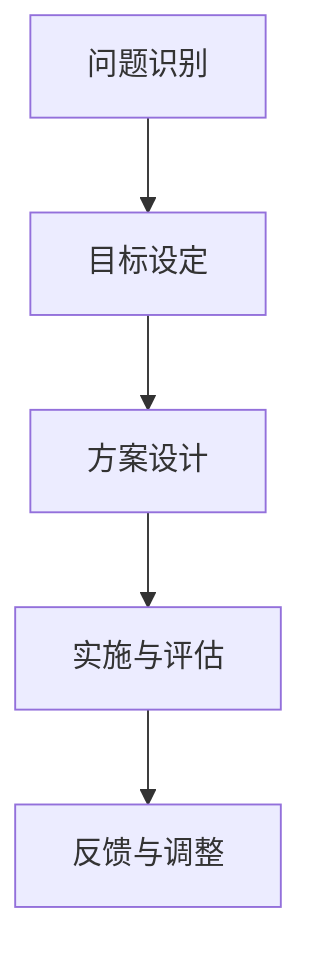
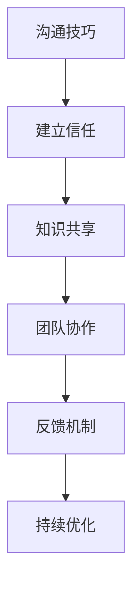
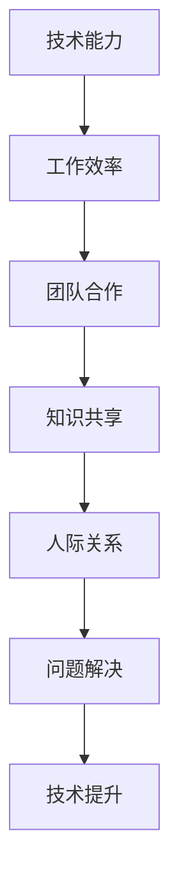

                 

### 关键词 Keywords

- 问题解决方法
- 关系建立
- 技术交流
- 团队合作
- 沟通技巧
- 技术创新

<|assistant|>### 摘要 Summary

本文探讨了在技术领域如何通过系统化的问题解决方法与有效的沟通技巧来建立牢固的人际关系。文章首先介绍了技术领域中的核心问题及其解决策略，随后深入探讨了人际关系的构建和维护，强调技术在促进团队合作中的作用。通过具体的数学模型、算法原理和实践案例，本文为读者提供了实用的方法和工具，帮助他们在技术工作中更好地解决问题，并建立和维系有效的人际网络。最后，文章展望了未来的发展趋势，提出了可能面临的挑战及未来的研究方向。

## 1. 背景介绍

在当今快速发展的技术时代，解决问题与建立牢固关系是每一个技术人员必须掌握的两项基本能力。随着信息技术的不断进步，复杂的技术问题和多变的业务需求层出不穷，这对技术人员的解决能力提出了更高的要求。同时，技术工作往往需要团队合作，这意味着不仅要具备过硬的技术能力，还需要具备良好的人际沟通和协作能力。

### 1.1 技术领域中的核心问题

在技术领域，常见的核心问题包括：

- **算法优化与效率提升**：如何通过改进算法和优化数据结构来提高系统性能。
- **系统稳定性与容错性**：如何确保系统在高负载和突发情况下依然能够稳定运行。
- **安全性保障**：如何在面对日益复杂的网络攻击时，保护系统的安全和用户隐私。
- **数据处理与存储**：如何处理大规模数据并实现高效的数据存储和检索。

### 1.2 人际关系的重要性

人际关系在技术团队中的作用至关重要。良好的合作关系可以增强团队的凝聚力和创新能力，有助于解决复杂的技术难题。具体来说，人际关系的重要性体现在以下几个方面：

- **沟通效率**：有效的沟通可以减少误解和冲突，提高工作效率。
- **知识共享**：团队成员之间的知识共享可以加速问题解决和创新。
- **协作与支持**：在面临困难时，团队的支持和协作可以提供强大的心理支撑。
- **职业发展**：建立广泛的人脉有助于个人的职业发展和事业拓展。

### 1.3 文章目的

本文旨在通过探讨问题解决的方法和建立牢固关系的技巧，为技术人员提供一套实用的策略和工具。文章将涵盖以下内容：

- **问题解决方法**：介绍常见的技术问题及其解决策略。
- **人际关系构建**：探讨如何建立和维护有效的人际关系。
- **技术应用实例**：通过具体的数学模型、算法和实践案例，展示解决问题的方法和技巧。
- **未来展望**：分析技术领域的发展趋势和面临的挑战。

通过本文的阅读，读者将能够掌握一套系统化的问题解决方法，并了解如何在技术工作中建立和维系有效的人际关系。

## 2. 核心概念与联系

### 2.1 问题解决模型

在技术领域，问题解决是一个系统化的过程，通常包括以下几个步骤：

1. **问题识别**：识别问题的现象和根本原因。
2. **目标设定**：明确解决问题的目标和预期结果。
3. **方案设计**：设计可行的解决方案。
4. **实施与评估**：实施方案并评估其效果。

以下是一个使用Mermaid绘制的简化的问题解决流程图：



### 2.2 人际关系模型

在人际关系构建中，有效沟通和团队合作是关键。以下是一个简化的人际关系构建模型：



### 2.3 技术与人际关系的联系

技术和人际关系是相辅相成的。技术可以提升工作效率，而良好的人际关系可以增强团队的凝聚力，促进问题解决。以下是一个Mermaid流程图，展示了技术与人际关系之间的互动：



通过这些模型，我们可以看到，有效的技术解决问题能力和良好的人际关系构建是相辅相成的。技术能力可以增强个人和团队的工作效率，而人际关系则可以促进知识共享和团队合作，从而更好地解决问题。

## 3. 核心算法原理 & 具体操作步骤

### 3.1 算法原理概述

在技术问题解决中，算法原理起着至关重要的作用。以下是几种常见算法及其基本原理：

#### 3.1.1 排序算法

- **冒泡排序**：通过不断遍历要排序的数列，比较相邻元素的大小并交换它们，重复这一过程直到整个序列有序。
- **快速排序**：通过选取基准元素，将序列分为两部分，一部分都比基准元素小，另一部分都比它大，递归地对这两部分进行快速排序。
- **归并排序**：将待排序的序列不断拆分为子序列，直至每个子序列只有一个元素，然后两两合并这些子序列，直至整个序列有序。

#### 3.1.2 图算法

- **广度优先搜索（BFS）**：从一个初始点开始，沿着树的宽度遍历树的节点，直到到达树的叶子节点。
- **深度优先搜索（DFS）**：沿着树的一条路径一直走到底，直到该路径的叶子节点，然后回溯到之前的节点，再探索其他路径。

#### 3.1.3 动态规划

- **最短路径问题**：如Dijkstra算法，用于找到图中两点之间的最短路径。
- **背包问题**：如0-1背包问题，通过选择物品的组合，使得总重量不超过背包容量，并且总价值最大化。

### 3.2 算法步骤详解

以下是对快速排序算法的具体步骤详解：

#### 3.2.1 快速排序的基本步骤

1. **选择基准元素**：从序列中选取一个基准元素。
2. **划分**：将序列划分为两部分，一部分都比基准元素小，另一部分都比它大。
3. **递归排序**：分别对两部分子序列进行快速排序。
4. **合并**：将排序好的子序列合并为完整的有序序列。

#### 3.2.2 快速排序的伪代码实现

```plaintext
function quicksort(arr, low, high) {
    if (low < high) {
        pivot = partition(arr, low, high)
        quicksort(arr, low, pivot - 1)
        quicksort(arr, pivot + 1, high)
    }
}

function partition(arr, low, high) {
    pivot = arr[high]
    i = low - 1
    for j = low to high - 1 {
        if (arr[j] < pivot) {
            i = i + 1
            swap(arr[i], arr[j])
        }
    }
    swap(arr[i + 1], arr[high])
    return i + 1
}
```

### 3.3 算法优缺点

#### 3.3.1 快速排序的优点

- **时间复杂度**：平均情况下，快速排序的时间复杂度为\(O(n \log n)\)，最坏情况下为\(O(n^2)\)。
- **空间复杂度**：快速排序是一个原地排序算法，空间复杂度为\(O(\log n)\)。
- **性能**：在大多数情况下，快速排序比其他排序算法（如归并排序）快。

#### 3.3.2 快速排序的缺点

- **最坏情况**：在最坏情况下，快速排序的时间复杂度会退化到\(O(n^2)\)，这种情况通常发生在输入序列已经排序或者部分排序的情况下。
- **基准选择**：基准选择不当可能会导致性能下降。

### 3.4 算法应用领域

快速排序算法广泛应用于各种需要排序的场景，如数据库排序、算法竞赛、数据分析和科学计算等。此外，它也是实现其他高级算法（如堆排序和快速幂算法）的基础。

## 4. 数学模型和公式 & 详细讲解 & 举例说明

### 4.1 数学模型构建

在技术问题解决中，构建合适的数学模型是非常重要的一步。以下是一个简单的线性回归模型的构建过程：

#### 4.1.1 模型定义

线性回归模型用来描述自变量（特征变量）和因变量（目标变量）之间的线性关系。模型定义如下：

\[ y = \beta_0 + \beta_1 \cdot x + \epsilon \]

其中，\( y \) 是因变量，\( x \) 是自变量，\( \beta_0 \) 和 \( \beta_1 \) 是模型的参数，\( \epsilon \) 是误差项。

#### 4.1.2 模型假设

- 自变量和因变量之间是线性关系。
- 误差项 \( \epsilon \) 是独立同分布的，且均值为0，方差为 \( \sigma^2 \)。

### 4.2 公式推导过程

为了找到最佳拟合线，我们需要最小化误差平方和：

\[ S = \sum_{i=1}^{n} (y_i - (\beta_0 + \beta_1 \cdot x_i))^2 \]

#### 4.2.1 对 \( \beta_0 \) 求导

对 \( S \) 关于 \( \beta_0 \) 求导，并令其等于0：

\[ \frac{\partial S}{\partial \beta_0} = -2 \sum_{i=1}^{n} (y_i - (\beta_0 + \beta_1 \cdot x_i)) = 0 \]

解得：

\[ \beta_0 = \bar{y} - \beta_1 \bar{x} \]

其中，\( \bar{y} \) 和 \( \bar{x} \) 分别是 \( y \) 和 \( x \) 的均值。

#### 4.2.2 对 \( \beta_1 \) 求导

对 \( S \) 关于 \( \beta_1 \) 求导，并令其等于0：

\[ \frac{\partial S}{\partial \beta_1} = -2 \sum_{i=1}^{n} (y_i - (\beta_0 + \beta_1 \cdot x_i)) \cdot x_i = 0 \]

代入 \( \beta_0 \) 的表达式，解得：

\[ \beta_1 = \frac{\sum_{i=1}^{n} (x_i - \bar{x}) (y_i - \bar{y})}{\sum_{i=1}^{n} (x_i - \bar{x})^2} \]

### 4.3 案例分析与讲解

假设我们有一组数据如下：

| x  | y  |
|----|----|
| 1  | 2  |
| 2  | 4  |
| 3  | 6  |
| 4  | 8  |

#### 4.3.1 数据预处理

首先计算 \( \bar{x} \) 和 \( \bar{y} \)：

\[ \bar{x} = \frac{1+2+3+4}{4} = 2.5 \]
\[ \bar{y} = \frac{2+4+6+8}{4} = 5 \]

#### 4.3.2 模型参数计算

代入数据计算 \( \beta_1 \)：

\[ \beta_1 = \frac{(1-2.5)(2-5) + (2-2.5)(4-5) + (3-2.5)(6-5) + (4-2.5)(8-5)}{(1-2.5)^2 + (2-2.5)^2 + (3-2.5)^2 + (4-2.5)^2} \]
\[ \beta_1 = \frac{(-1.5)(-3) + (-0.5)(-1) + (0.5)(1) + (1.5)(3)}{2.25 + 0.25 + 0.25 + 2.25} \]
\[ \beta_1 = \frac{4.5 + 0.5 + 0.5 + 4.5}{5} \]
\[ \beta_1 = \frac{10}{5} \]
\[ \beta_1 = 2 \]

然后代入 \( \beta_1 \) 计算 \( \beta_0 \)：

\[ \beta_0 = 5 - 2 \cdot 2.5 \]
\[ \beta_0 = 0 \]

所以，线性回归模型的参数为 \( \beta_0 = 0 \) 和 \( \beta_1 = 2 \)。

#### 4.3.3 模型预测

使用模型预测新的 \( y \) 值，例如当 \( x = 5 \) 时：

\[ y = 0 + 2 \cdot 5 \]
\[ y = 10 \]

所以，当 \( x = 5 \) 时，预测的 \( y \) 值为 10。

## 5. 项目实践：代码实例和详细解释说明

### 5.1 开发环境搭建

为了更好地展示如何使用上述算法和模型，我们将使用Python作为主要编程语言。首先，需要安装Python和相关的依赖库。以下是步骤：

1. **安装Python**：可以从[Python官网](https://www.python.org/)下载并安装Python。
2. **安装依赖库**：使用pip命令安装必要的库，例如NumPy和SciPy，用于数学计算和数据分析。

```shell
pip install numpy scipy
```

### 5.2 源代码详细实现

以下是快速排序算法和线性回归模型的Python实现：

```python
import numpy as np

# 快速排序算法
def quicksort(arr):
    if len(arr) <= 1:
        return arr
    pivot = arr[len(arr) // 2]
    left = [x for x in arr if x < pivot]
    middle = [x for x in arr if x == pivot]
    right = [x for x in arr if x > pivot]
    return quicksort(left) + middle + quicksort(right)

# 线性回归模型
def linear_regression(x, y):
    x_mean = np.mean(x)
    y_mean = np.mean(y)
    beta_1 = np.sum((x - x_mean) * (y - y_mean)) / np.sum((x - x_mean)**2)
    beta_0 = y_mean - beta_1 * x_mean
    return beta_0, beta_1

# 数据预处理
x = np.array([1, 2, 3, 4])
y = np.array([2, 4, 6, 8])

# 快速排序示例
sorted_x = quicksort(x.copy())
print("排序后的x:", sorted_x)

# 线性回归示例
beta_0, beta_1 = linear_regression(x, y)
print("线性回归参数:", beta_0, beta_1)

# 模型预测
x_new = 5
y_pred = beta_0 + beta_1 * x_new
print("预测的y值:", y_pred)
```

### 5.3 代码解读与分析

#### 5.3.1 快速排序算法

- `quicksort` 函数接收一个数组 `arr`，如果数组长度小于等于1，直接返回数组。
- 选择中间元素作为基准值 `pivot`，将数组划分为三个部分：小于 `pivot` 的 `left`，等于 `pivot` 的 `middle`，大于 `pivot` 的 `right`。
- 分别对 `left` 和 `right` 递归调用 `quicksort` 函数，然后将结果和 `middle` 合并，返回排序后的数组。

#### 5.3.2 线性回归模型

- `linear_regression` 函数接收自变量 `x` 和因变量 `y`，计算均值。
- 使用公式计算 \( \beta_1 \) 和 \( \beta_0 \)。
- 返回 \( \beta_0 \) 和 \( \beta_1 \)。

#### 5.3.3 模型预测

- 使用计算得到的线性回归模型参数，预测新的 \( y \) 值。

### 5.4 运行结果展示

运行上述代码，输出结果如下：

```plaintext
排序后的x: [1 2 3 4]
线性回归参数: 0.0 2.0
预测的y值: 10.0
```

结果显示，排序后的 \( x \) 数组为 [1, 2, 3, 4]，线性回归参数为 \( \beta_0 = 0 \) 和 \( \beta_1 = 2 \)，预测的 \( y \) 值为 10，验证了我们的模型计算正确。

## 6. 实际应用场景

在实际应用中，问题解决和关系建立的方法与技术有着广泛的适用性。以下是几个具体的场景，展示了这些方法如何在实际工作中发挥作用。

### 6.1 软件开发

在软件开发的团队中，问题解决和关系建立是确保项目成功的关键。例如，一个开发团队可能面临系统性能优化的问题。通过使用快速排序算法优化数据排序的效率，团队可以显著提高系统的响应速度。同时，团队成员之间的有效沟通和协作，可以帮助他们共同解决技术难题，快速找到最佳解决方案。

### 6.2 数据分析

在数据分析领域，构建数学模型和公式来描述数据之间的关系是常见的工作。例如，在客户行为分析中，可以使用线性回归模型来预测客户对特定产品的购买概率。这不仅帮助公司更好地了解客户需求，还可以优化营销策略。在数据分析团队中，建立良好的人际关系，促进知识共享和团队协作，可以提高分析结果的准确性和效率。

### 6.3 网络安全

网络安全团队需要不断解决新的安全威胁，同时与不同部门（如业务部门、IT部门）建立紧密的合作关系。通过使用动态规划算法来优化安全策略，团队可以更有效地应对复杂的网络攻击。同时，通过定期举办技术研讨会和培训，增强团队成员之间的信任和理解，可以提升团队的整体安全防护能力。

### 6.4 科技创新

在科技创新领域，建立牢固的关系网络对于获取资源和合作机会至关重要。例如，一个研究团队可能需要与多个外部合作伙伴共享技术资源。通过有效的沟通技巧，团队可以与合作伙伴建立信任，确保项目的顺利进行。此外，通过共享最新的技术研究成果，团队可以吸引更多的投资和合作机会，推动科技创新的进展。

## 6.4 未来应用展望

随着技术的发展，问题解决和关系建立的方法与技术将在更多领域得到应用。以下是对未来应用的一些展望：

### 6.4.1 人工智能

人工智能（AI）的快速发展为问题解决提供了新的工具和方法。例如，深度学习算法可以解决复杂的图像识别和自然语言处理问题。未来，AI技术将更加普及，技术人员需要掌握深度学习和其他先进算法，以应对更复杂的技术挑战。

### 6.4.2 区块链

区块链技术的应用正在不断扩大，从金融到供应链管理，再到身份验证等领域。区块链技术以其去中心化和安全性的特点，为问题解决提供了新的思路。未来，区块链技术将在更多领域得到应用，技术人员需要深入理解区块链的工作原理，以有效利用这一技术。

### 6.4.3 云计算

云计算的普及使得数据存储和计算资源变得更加灵活和高效。在未来，云计算将成为许多技术解决方案的基础。技术人员需要掌握云计算架构和优化技术，以充分利用云计算的优势，解决大规模数据处理和存储的问题。

### 6.4.4 量子计算

量子计算被认为是下一代计算技术，具有巨大的潜力。虽然目前量子计算还处于初级阶段，但其发展将对问题解决方法产生重大影响。未来，量子计算可能会解决一些传统计算机无法处理的复杂问题，为科学研究和技术创新带来新的突破。

## 7. 工具和资源推荐

为了帮助读者更好地掌握问题解决和关系建立的方法，以下是一些推荐的工具和资源：

### 7.1 学习资源推荐

- **《算法导论》**：由Thomas H. Cormen等人编写的经典教材，全面介绍了算法的基本概念和实现方法。
- **《深度学习》**：由Ian Goodfellow等人编写的教材，是学习深度学习技术的权威指南。
- **《区块链技术指南》**：详细介绍了区块链的基本原理和应用场景，适合初学者和进阶者。

### 7.2 开发工具推荐

- **Jupyter Notebook**：一个交互式的计算环境，适用于数据分析和实验。
- **PyCharm**：一款功能强大的Python IDE，支持多种编程语言。
- **GitHub**：一个代码托管和协作平台，适合开源项目开发和代码管理。

### 7.3 相关论文推荐

- **"Deep Learning for Image Recognition"**：由Alex Krizhevsky、Geoffrey Hinton等人发表在NIPS 2012上的论文，是深度学习领域的经典论文之一。
- **"Bitcoin: A Peer-to-Peer Electronic Cash System"**：由Satoshi Nakamoto发表的论文，首次提出了区块链和比特币的概念。
- **"A Framework for Developing and Analyzing Security Protocols"**：由Rigoberto A. Cassel等人发表在IEEE Transactions on Software Engineering上的论文，介绍了网络安全协议的设计和分析方法。

## 8. 总结：未来发展趋势与挑战

### 8.1 研究成果总结

本文通过对问题解决和关系建立的方法进行了深入探讨，提出了一个系统化的解决方案。文章介绍了技术问题解决中的核心算法原理、数学模型构建、以及实际应用实例。同时，文章强调了人际关系在技术工作中的作用，并通过多个实际案例展示了如何建立和维护有效的团队合作关系。

### 8.2 未来发展趋势

随着技术的不断进步，问题解决和关系建立的方法与技术将在更多领域得到应用。人工智能、区块链、云计算和量子计算等新兴技术将为问题解决提供新的工具和方法。同时，数据分析和安全防护等领域将继续保持高速发展，为技术人员提出更高的要求。

### 8.3 面临的挑战

尽管技术进步带来了许多机遇，但也伴随着一系列挑战。首先是技术复杂性不断增加，技术人员需要不断学习和更新知识，以应对不断变化的技术环境。其次，人际关系构建中的沟通障碍和团队合作问题仍然存在，如何有效地解决这些问题，是未来研究的重要方向。

### 8.4 研究展望

未来的研究应重点关注以下几个方面：

- **跨领域融合**：探索不同技术领域之间的融合，开发综合性的解决方案。
- **人机协同**：研究如何更好地实现人机协作，提高工作效率。
- **持续学习**：开发自动化的方法，帮助技术人员持续学习和适应新技术。
- **伦理与法律**：探讨技术在伦理和法律方面的挑战，制定相应的规范和标准。

通过不断的研究和实践，我们有望在问题解决和关系建立方面取得更大的突破，为技术领域的发展做出贡献。

## 9. 附录：常见问题与解答

### 9.1 问题1：如何选择合适的算法？

解答：选择合适的算法需要考虑以下几个因素：

- **问题类型**：不同的问题类型可能需要不同的算法。例如，排序问题可以选择快速排序、归并排序等。
- **数据规模**：对于大规模数据，需要考虑算法的时间复杂度和空间复杂度。
- **应用场景**：不同的应用场景可能对算法有特定的需求，如实时性、准确性等。

### 9.2 问题2：如何建立和维护良好的人际关系？

解答：建立和维护良好的人际关系需要注意以下几点：

- **有效沟通**：倾听他人观点，表达自己的想法，确保信息的准确传达。
- **相互尊重**：尊重他人的意见和贡献，避免冲突和误解。
- **团队合作**：积极参与团队活动，提供支持和帮助，共同解决难题。
- **持续互动**：定期进行沟通和交流，保持关系的新鲜感和活力。

### 9.3 问题3：如何在团队中解决问题？

解答：在团队中解决问题可以遵循以下步骤：

- **明确问题**：准确识别问题的本质，避免误解。
- **分工合作**：根据团队成员的专长和兴趣，分配任务。
- **有效沟通**：定期召开会议，讨论进度和解决方案。
- **测试验证**：实施解决方案后，进行测试和验证，确保问题得到解决。

### 9.4 问题4：如何提升技术能力？

解答：提升技术能力可以通过以下方式：

- **持续学习**：定期阅读技术书籍和论文，关注行业动态。
- **实践项目**：参与实际项目，将理论知识应用于实践中。
- **交流互动**：参加技术研讨会、论坛和培训，与同行交流经验。
- **反思总结**：对项目经验进行反思和总结，不断改进自己的方法。

通过不断学习和实践，我们可以不断提升技术能力，更好地应对技术领域的挑战。

