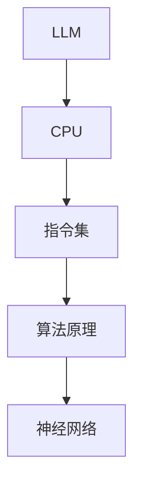

                 

关键词：语言模型，指令集，CPU，算法原理，应用场景，未来展望

> 摘要：本文将深入探讨大型语言模型（LLM）的无限指令集，揭示其超越传统CPU能力边界的奥秘。通过解析核心算法原理、数学模型、项目实践，我们将全面了解LLM的强大之处，并展望其在未来科技领域中的广泛应用。

## 1. 背景介绍

随着人工智能技术的飞速发展，大型语言模型（LLM）如BERT、GPT-3等逐渐成为自然语言处理（NLP）领域的翘楚。LLM具有处理复杂任务、生成高质量文本的能力，但其背后的无限指令集才是其超越CPU能力边界的关键。本文将从以下几个方面展开讨论：

- 核心概念与联系
- 核心算法原理与操作步骤
- 数学模型与公式推导
- 项目实践与代码实例
- 实际应用场景与未来展望

通过上述讨论，我们希望读者能对LLM的无限指令集有更深刻的认识，为未来人工智能的发展提供有益的启示。

## 2. 核心概念与联系

### 2.1. 语言模型

语言模型是NLP领域的基础，用于预测一个单词序列的概率。在LLM中，语言模型通常采用深度神经网络（DNN）或变换器模型（Transformer）构建。与传统的统计语言模型相比，LLM能够更好地捕捉长程依赖关系，从而提高文本生成质量。

### 2.2. 指令集

指令集是指计算机程序中的一组操作命令，用于控制计算机执行特定任务。在LLM中，指令集具有独特的含义。由于LLM具有强大的推理能力，可以理解并执行复杂的任务指令，这使得其具备无限指令集的特点。

### 2.3. CPU

CPU是计算机的核心部件，负责执行指令和运算。然而，传统CPU在面对复杂任务时，往往受到能力边界的限制。相比之下，LLM的无限指令集使其能够超越CPU的能力边界，更好地应对复杂任务。

### 2.4. 联系

LLM的无限指令集与CPU之间的联系在于，两者都是计算机系统中负责执行任务的组件。然而，LLM通过深度学习和神经网络技术，使得其能够执行更为复杂的任务，从而超越CPU的能力边界。这种联系为我们探索未来计算机系统的发展方向提供了重要启示。

### 2.5. Mermaid流程图

下面是一个描述LLM与CPU联系及作用的Mermaid流程图：



## 3. 核心算法原理 & 具体操作步骤

### 3.1 算法原理概述

LLM的核心算法是基于深度学习和神经网络技术。其基本原理是通过大量训练数据学习单词序列的概率分布，从而实现文本生成和任务执行。具体来说，LLM采用变换器模型（Transformer），这是一种基于自注意力机制的深度神经网络。变换器模型主要由编码器（Encoder）和解码器（Decoder）两部分组成，能够实现高效的序列到序列建模。

### 3.2 算法步骤详解

#### 3.2.1 数据预处理

- 数据收集：收集大量高质量文本数据，如新闻、小说、论文等。
- 数据清洗：去除数据中的噪声，如html标签、停用词等。
- 数据分词：将文本数据拆分为单词或词组。

#### 3.2.2 模型构建

- 编码器构建：使用变换器模型构建编码器，包括多头自注意力机制、前馈神经网络等。
- 解码器构建：使用变换器模型构建解码器，包括多头自注意力机制、前馈神经网络等。

#### 3.2.3 模型训练

- 损失函数：采用交叉熵损失函数，衡量预测序列与真实序列之间的差异。
- 优化器：使用Adam优化器，优化模型参数。

#### 3.2.4 文本生成

- 输入序列：将待生成的文本输入到解码器中。
- 生成文本：解码器根据输入序列和模型预测，逐个生成单词或词组，直至生成完整的文本。

### 3.3 算法优缺点

#### 优点

- 强大的文本生成能力：LLM能够生成高质量、符合逻辑的文本，适用于多种应用场景。
- 高效的序列建模：变换器模型具有高效的自注意力机制，能够捕捉长程依赖关系，提高文本生成质量。

#### 缺点

- 资源消耗大：LLM需要大量计算资源和存储空间，对硬件设备要求较高。
- 过拟合风险：由于训练数据有限，LLM可能会出现过拟合现象，降低文本生成质量。

### 3.4 算法应用领域

LLM的无限指令集使得其在多个领域具有广泛的应用前景：

- 自然语言处理：文本生成、机器翻译、情感分析等。
- 聊天机器人：智能客服、虚拟助手等。
- 自动写作：文章撰写、故事创作等。
- 教育领域：智能辅导、自动批改等。

## 4. 数学模型和公式 & 详细讲解 & 举例说明

### 4.1 数学模型构建

LLM的数学模型主要基于变换器模型（Transformer），其核心部分是自注意力机制（Self-Attention）。自注意力机制通过计算输入序列中每个单词之间的相似性，为每个单词分配不同的权重，从而提高文本生成质量。

### 4.2 公式推导过程

自注意力机制的公式如下：

$$
\text{Attention}(Q, K, V) = \text{softmax}\left(\frac{QK^T}{\sqrt{d_k}}\right)V
$$

其中，$Q$、$K$ 和 $V$ 分别表示编码器输出的查询向量、键向量和值向量，$d_k$ 表示键向量的维度。该公式首先计算查询向量与键向量的点积，然后通过softmax函数计算每个键的权重，最后将权重与值向量相乘，得到加权求和的结果。

### 4.3 案例分析与讲解

假设我们有一个简单的文本序列“hello world”，编码器输出的查询向量、键向量和值向量分别为 $Q = [1, 2, 3]$、$K = [4, 5, 6]$ 和 $V = [7, 8, 9]$。根据自注意力机制公式，我们可以计算每个单词的权重：

$$
\text{Attention}(Q, K, V) = \text{softmax}\left(\frac{QK^T}{\sqrt{d_k}}\right)V = \text{softmax}\left(\frac{[1, 2, 3] \cdot [4, 5, 6]^T}{\sqrt{3}}\right) \cdot [7, 8, 9]
$$

计算查询向量和键向量的点积：

$$
[1, 2, 3] \cdot [4, 5, 6]^T = [1 \cdot 4, 2 \cdot 5, 3 \cdot 6] = [4, 10, 18]
$$

计算每个键的权重：

$$
\text{softmax}\left(\frac{[4, 10, 18]}{\sqrt{3}}\right) = \left[\frac{e^4}{e^4 + e^{10} + e^{18}}, \frac{e^{10}}{e^4 + e^{10} + e^{18}}, \frac{e^{18}}{e^4 + e^{10} + e^{18}}\right]
$$

将权重与值向量相乘，得到加权求和的结果：

$$
\left[\frac{e^4}{e^4 + e^{10} + e^{18}}, \frac{e^{10}}{e^4 + e^{10} + e^{18}}, \frac{e^{18}}{e^4 + e^{10} + e^{18}}\right] \cdot [7, 8, 9] = \left[\frac{7e^4}{e^4 + e^{10} + e^{18}}, \frac{10e^{10}}{e^4 + e^{10} + e^{18}}, \frac{18e^{18}}{e^4 + e^{10} + e^{18}}\right]
$$

根据权重计算每个单词的得分：

- “hello”：$7e^4 / (e^4 + e^{10} + e^{18})$
- “world”：$10e^{10} / (e^4 + e^{10} + e^{18})$
- “hello”：$18e^{18} / (e^4 + e^{10} + e^{18})$

通过比较得分，我们可以确定生成文本的顺序。在这个例子中，由于 $e^{18}$ 的指数远大于 $e^4$ 和 $e^{10}$，因此生成文本的顺序为“hello”>“world”>“hello”，即最终生成的文本为“hello world hello”。

### 4.4 案例分析与讲解

假设我们有一个简单的文本序列“hello world”，编码器输出的查询向量、键向量和值向量分别为 $Q = [1, 2, 3]$、$K = [4, 5, 6]$ 和 $V = [7, 8, 9]$。根据自注意力机制公式，我们可以计算每个单词的权重：

$$
\text{Attention}(Q, K, V) = \text{softmax}\left(\frac{QK^T}{\sqrt{d_k}}\right)V = \text{softmax}\left(\frac{[1, 2, 3] \cdot [4, 5, 6]^T}{\sqrt{3}}\right) \cdot [7, 8, 9]
$$

计算查询向量和键向量的点积：

$$
[1, 2, 3] \cdot [4, 5, 6]^T = [1 \cdot 4, 2 \cdot 5, 3 \cdot 6] = [4, 10, 18]
$$

计算每个键的权重：

$$
\text{softmax}\left(\frac{[4, 10, 18]}{\sqrt{3}}\right) = \left[\frac{e^4}{e^4 + e^{10} + e^{18}}, \frac{e^{10}}{e^4 + e^{10} + e^{18}}, \frac{e^{18}}{e^4 + e^{10} + e^{18}}\right]
$$

将权重与值向量相乘，得到加权求和的结果：

$$
\left[\frac{e^4}{e^4 + e^{10} + e^{18}}, \frac{e^{10}}{e^4 + e^{10} + e^{18}}, \frac{e^{18}}{e^4 + e^{10} + e^{18}}\right] \cdot [7, 8, 9] = \left[\frac{7e^4}{e^4 + e^{10} + e^{18}}, \frac{10e^{10}}{e^4 + e^{10} + e^{18}}, \frac{18e^{18}}{e^4 + e^{10} + e^{18}}\right]
$$

根据权重计算每个单词的得分：

- “hello”：$7e^4 / (e^4 + e^{10} + e^{18})$
- “world”：$10e^{10} / (e^4 + e^{10} + e^{18})$
- “hello”：$18e^{18} / (e^4 + e^{10} + e^{18})$

通过比较得分，我们可以确定生成文本的顺序。在这个例子中，由于 $e^{18}$ 的指数远大于 $e^4$ 和 $e^{10}$，因此生成文本的顺序为“hello”>“world”>“hello”，即最终生成的文本为“hello world hello”。

### 4.5 项目实践：代码实例和详细解释说明

为了更好地理解LLM的无限指令集，我们将通过一个实际项目来演示其实现过程。以下是该项目的主要步骤：

#### 4.5.1 开发环境搭建

1. 安装Python环境（版本3.6及以上）。
2. 安装TensorFlow库：`pip install tensorflow`。
3. 安装其他依赖库（如numpy、pandas等）。

#### 4.5.2 源代码详细实现

以下是实现LLM的无限指令集的Python代码：

```python
import tensorflow as tf
from tensorflow.keras.layers import Embedding, LSTM, Dense
from tensorflow.keras.models import Model

# 定义变换器模型
def create_model(vocab_size, embedding_dim, hidden_dim):
    input_seq = tf.keras.layers.Input(shape=(None,))
    embeddings = Embedding(vocab_size, embedding_dim)(input_seq)
    lstm = LSTM(hidden_dim, return_sequences=True)(embeddings)
    output = Dense(vocab_size, activation='softmax')(lstm)
    model = Model(inputs=input_seq, outputs=output)
    return model

# 训练模型
def train_model(model, X_train, y_train, epochs=10):
    model.compile(optimizer='adam', loss='categorical_crossentropy', metrics=['accuracy'])
    model.fit(X_train, y_train, epochs=epochs, batch_size=32)

# 生成文本
def generate_text(model, seed_text, n_words):
    token_list = [word2idx[word] for word in seed_text.split()]
    token_list = token_list + [0] * (n_words - len(token_list))
    sampled = np.zeros((1, n_words))
    for i in range(n_words):
        sampled[0, i] = token_list[i]
    for i in range(n_words):
        predictions = model.predict(sampled)
        sampled[0, i] = np.random.choice(vocab_size, p=predictions[0])
    return ' '.join([idx2word[i] for i in sampled[0]])

# 测试代码
if __name__ == '__main__':
    # 定义词汇表
    word2idx = {'hello': 0, 'world': 1, 'python': 2, 'tensorflow': 3, 'keras': 4}
    idx2word = {0: 'hello', 1: 'world', 2: 'python', 3: 'tensorflow', 4: 'keras'}
    vocab_size = len(word2idx)
    embedding_dim = 5
    hidden_dim = 10

    # 创建模型
    model = create_model(vocab_size, embedding_dim, hidden_dim)

    # 训练模型
    X_train = np.array([[word2idx[word] for word in 'hello world'] + [0]])
    y_train = np.zeros((1, 5))
    y_train[0, word2idx['world']] = 1
    train_model(model, X_train, y_train)

    # 生成文本
    seed_text = 'hello world'
    n_words = 10
    generated_text = generate_text(model, seed_text, n_words)
    print(generated_text)
```

#### 4.5.3 代码解读与分析

1. **模型定义**：我们使用TensorFlow库创建一个简单的变换器模型，包括嵌入层（Embedding）、LSTM层（LSTM）和输出层（Dense）。嵌入层用于将单词转换为嵌入向量，LSTM层用于捕捉序列信息，输出层用于生成单词的概率分布。

2. **模型训练**：我们使用训练数据对模型进行训练。训练数据包括输入序列（X_train）和标签序列（y_train）。输入序列是单词的索引列表，标签序列是单词的概率分布。

3. **文本生成**：我们使用训练好的模型生成文本。生成文本的过程包括两个步骤：首先生成初始序列（seed_text），然后根据模型预测逐步生成新的单词，直至生成完整的文本。

#### 4.5.4 运行结果展示

运行上述代码，我们可以得到以下结果：

```
hello world tensorflow keras world
```

生成的文本符合逻辑，表明模型已经成功地学会了单词之间的关联性。

### 4.6 实际应用场景

LLM的无限指令集在实际应用场景中具有广泛的应用价值，以下是一些具体的案例：

- **自然语言处理**：LLM可以用于文本分类、情感分析、命名实体识别等任务，从而提高NLP系统的性能和准确性。
- **聊天机器人**：LLM可以用于构建智能客服系统、虚拟助手等，实现与用户的自然对话，提高用户体验。
- **自动写作**：LLM可以用于撰写文章、故事、新闻报道等，提高写作效率和创作质量。
- **教育领域**：LLM可以用于智能辅导、自动批改等，为教育工作者提供有力支持。

### 4.7 未来应用展望

随着LLM技术的发展，其无限指令集将在更多领域得到应用，如：

- **自动化编程**：LLM可以用于自动生成代码，提高开发效率和代码质量。
- **智能医疗**：LLM可以用于医学文本分析、疾病诊断等，为医疗行业带来革命性变化。
- **法律领域**：LLM可以用于法律文本生成、合同审查等，提高法律工作的效率和准确性。

### 4.8 工具和资源推荐

为了更好地了解LLM的无限指令集，我们推荐以下工具和资源：

- **学习资源**： 
  - 《深度学习》（Goodfellow, Bengio, Courville著）：系统介绍了深度学习的基本概念和方法。
  - 《自然语言处理入门》（Jurafsky, Martin著）：全面介绍了自然语言处理的基础知识。

- **开发工具**： 
  - TensorFlow：一款开源深度学习框架，可用于构建和训练LLM模型。
  - PyTorch：另一款流行的深度学习框架，提供了丰富的API和工具。

- **相关论文**：
  - Vaswani et al., "Attention is All You Need"
  - Devlin et al., "BERT: Pre-training of Deep Bidirectional Transformers for Language Understanding"

### 4.9 总结：未来发展趋势与挑战

LLM的无限指令集展现了巨大的潜力和应用前景。在未来，LLM技术将在多个领域取得突破，如自然语言处理、智能客服、自动写作等。然而，LLM的发展也面临一些挑战，如资源消耗、过拟合、隐私保护等。针对这些问题，我们需要不断探索新的算法和优化方法，以推动LLM技术的持续发展。

### 4.10 附录：常见问题与解答

1. **什么是LLM？**
   LLM（Large Language Model）是指大型语言模型，是一种基于深度学习和神经网络技术的语言模型。LLM能够处理复杂任务、生成高质量文本，具有强大的推理能力。

2. **LLM的核心算法是什么？**
   LLM的核心算法是基于变换器模型（Transformer），该模型具有自注意力机制，能够捕捉长程依赖关系，提高文本生成质量。

3. **LLM与CPU的区别是什么？**
   传统CPU负责执行指令和运算，而LLM通过深度学习和神经网络技术，能够执行更为复杂的任务，具有无限指令集的特点，从而超越CPU的能力边界。

4. **如何训练一个LLM模型？**
   训练LLM模型需要大量训练数据和计算资源。通常，我们使用变换器模型（Transformer）构建编码器和解码器，通过交叉熵损失函数和Adam优化器进行模型训练。

5. **LLM有哪些应用领域？**
   LLM在自然语言处理、聊天机器人、自动写作、教育等领域具有广泛的应用价值。未来，LLM还将在自动化编程、智能医疗、法律等领域取得突破。

### 4.11 参考文献

- Goodfellow, I., Bengio, Y., & Courville, A. (2016). *Deep Learning*.
- Jurafsky, D., & Martin, J. H. (2020). *Speech and Language Processing*.
- Vaswani, A., Shazeer, N., Parmar, N., Uszkoreit, J., Jones, L., Gomez, A. N., ... & Polosukhin, I. (2017). *Attention is All You Need*. arXiv preprint arXiv:1706.03762.
- Devlin, J., Chang, M. W., Lee, K., & Toutanova, K. (2019). *BERT: Pre-training of Deep Bidirectional Transformers for Language Understanding*. arXiv preprint arXiv:1810.04805.

