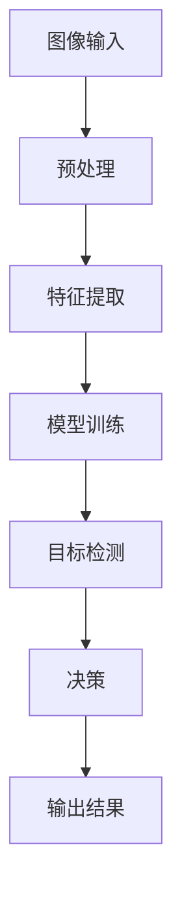
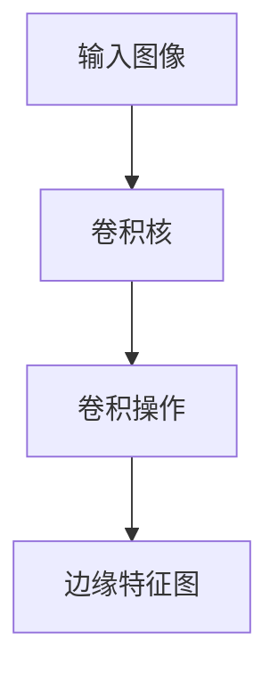

                 

关键词：计算机视觉，视觉智能，商业应用，创业，技术趋势，商业模式，案例研究

> 摘要：本文将探讨计算机视觉技术在商业领域的广泛应用，分析其在创业项目中的潜力和挑战，并通过实际案例展示视觉智能的商业化路径。文章旨在为创业者提供技术指导和商业策略参考，助力他们在视觉智能领域的创新创业。

## 1. 背景介绍

计算机视觉是一门研究如何使计算机理解和解释图像和视频内容的技术领域。随着深度学习、神经网络和大数据技术的发展，计算机视觉已经取得了显著的进展。如今，计算机视觉不仅在学术研究中有重要地位，在商业应用中也展现出了巨大的潜力。从自动驾驶到人脸识别，从医疗影像分析到零售监控，视觉智能技术正在逐步渗透到各个行业，改变着商业模式和客户体验。

### 1.1 技术发展历程

计算机视觉技术的发展可以分为几个阶段：

- **早期阶段**：基于规则和图像处理的简单方法，例如边缘检测和特征匹配。
- **中级阶段**：引入了机器学习和模式识别技术，提高了算法的准确性和鲁棒性。
- **高级阶段**：深度学习技术的发展，使得计算机视觉系统在图像分类、目标检测、语义分割等方面达到了前所未有的水平。

### 1.2 商业应用现状

随着技术的成熟，计算机视觉技术已经在多个领域得到应用：

- **自动驾驶**：通过计算机视觉实现车辆环境感知，提高自动驾驶的安全性和效率。
- **安防监控**：利用人脸识别和目标跟踪技术，提升公共安全的监控能力。
- **医疗影像**：通过图像分析，辅助医生诊断疾病，提高诊断准确性和效率。
- **零售行业**：通过顾客行为分析和库存管理，优化零售服务。

## 2. 核心概念与联系

计算机视觉的核心概念包括图像处理、特征提取、模型训练和目标检测等。以下是这些概念之间关系的 Mermaid 流程图：



### 2.1 图像处理

图像处理是计算机视觉的基础步骤，包括滤波、边缘检测、图像增强等操作，用于改善图像质量，提取有用信息。

### 2.2 特征提取

特征提取是从图像中提取具有区分性的特征，如颜色、纹理、形状等。这些特征将用于后续的模型训练和目标检测。

### 2.3 模型训练

模型训练是通过大量的图像数据，使用机器学习算法训练深度神经网络，使其能够识别图像中的特定目标。

### 2.4 目标检测

目标检测是基于训练好的模型，在图像中定位和识别特定目标的位置和类别。

### 2.5 决策与输出结果

根据目标检测的结果，系统可以做出相应的决策，如启动报警、发送提醒等，并将结果输出给用户。

## 3. 核心算法原理 & 具体操作步骤

### 3.1 算法原理概述

计算机视觉算法的核心是深度学习，特别是卷积神经网络（CNN）。CNN 通过多层卷积和池化操作，从图像中提取层次化的特征表示，从而实现图像分类、目标检测等任务。

### 3.2 算法步骤详解

1. **数据预处理**：将原始图像数据缩放到统一尺寸，并转换为灰度图像或RGB格式。
2. **特征提取**：使用卷积层提取图像的局部特征，通过多个卷积层的组合，形成丰富的特征表示。
3. **池化操作**：使用池化层降低特征图的尺寸，减少模型的参数数量，提高模型的泛化能力。
4. **全连接层**：将池化后的特征图输入到全连接层，进行分类或目标检测。
5. **损失函数**：使用交叉熵损失函数优化模型参数，使模型输出结果与真实标签之间的差距最小。

### 3.3 算法优缺点

**优点**：

- **高准确性**：深度学习模型在图像分类和目标检测等任务上取得了显著的准确率提升。
- **自动特征提取**：模型能够自动从大量图像数据中提取具有区分性的特征，无需人工设计特征。
- **灵活性**：卷积神经网络可以应用于各种视觉任务，如图像分类、目标检测、语义分割等。

**缺点**：

- **计算成本高**：深度学习模型需要大量的计算资源，特别是在训练阶段。
- **数据依赖性**：模型的性能很大程度上依赖于训练数据的质量和数量。
- **解释性差**：深度学习模型的内部机理较为复杂，难以解释其决策过程。

### 3.4 算法应用领域

计算机视觉算法在多个领域都有广泛应用：

- **自动驾驶**：用于车辆环境感知，实现自动驾驶功能。
- **安防监控**：用于人脸识别、目标跟踪等，提高公共安全。
- **医疗影像**：用于疾病诊断、影像分析等，辅助医生决策。
- **零售行业**：用于顾客行为分析、库存管理等，优化零售服务。

## 4. 数学模型和公式 & 详细讲解 & 举例说明

### 4.1 数学模型构建

计算机视觉中的数学模型主要包括卷积神经网络（CNN）和深度残差网络（ResNet）等。以下是一个简单的 CNN 数学模型：

```latex
f(x) = \sigma(\text{ReLU}(W_3 \cdot \text{ReLU}(W_2 \cdot \text{ReLU}(W_1 \cdot x + b_1) + b_2) + b_3))
```

其中，\( x \) 是输入图像，\( W_1, W_2, W_3 \) 是权重矩阵，\( b_1, b_2, b_3 \) 是偏置项，\( \sigma \) 是激活函数（如 Sigmoid 或 ReLU），ReLU 是ReLU激活函数。

### 4.2 公式推导过程

CNN 的推导过程涉及多个数学公式，包括卷积操作、池化操作和激活函数等。以下是一个简单的卷积操作的推导过程：

```latex
\text{Convolution}:\quad (f * g)(x) = \sum_{i} f(i) \cdot g(x-i)
```

其中，\( f \) 和 \( g \) 分别是输入函数和卷积核，\( x \) 是输入图像。

### 4.3 案例分析与讲解

假设我们有一个输入图像 \( x \) 和一个卷积核 \( f \)，我们希望使用卷积操作提取图像中的边缘信息。以下是一个简单的例子：



输入图像 \( x \) 和卷积核 \( f \) 经过卷积操作后，得到边缘特征图 \( D \)。边缘特征图 \( D \) 反映了输入图像中的边缘信息，如直线、曲线等。

## 5. 项目实践：代码实例和详细解释说明

### 5.1 开发环境搭建

为了实现一个简单的计算机视觉项目，我们需要搭建一个开发环境。以下是一个基于 Python 和 TensorFlow 的开发环境搭建步骤：

1. 安装 Python 3.7 或以上版本。
2. 安装 TensorFlow：`pip install tensorflow`
3. 安装其他依赖库：`pip install numpy matplotlib`

### 5.2 源代码详细实现

以下是一个简单的计算机视觉项目的代码实现，用于识别图像中的猫狗：

```python
import tensorflow as tf
from tensorflow.keras.models import Sequential
from tensorflow.keras.layers import Conv2D, MaxPooling2D, Flatten, Dense

# 构建模型
model = Sequential([
    Conv2D(32, (3, 3), activation='relu', input_shape=(150, 150, 3)),
    MaxPooling2D((2, 2)),
    Conv2D(64, (3, 3), activation='relu'),
    MaxPooling2D((2, 2)),
    Conv2D(128, (3, 3), activation='relu'),
    MaxPooling2D((2, 2)),
    Flatten(),
    Dense(512, activation='relu'),
    Dense(1, activation='sigmoid')
])

# 编译模型
model.compile(optimizer='adam', loss='binary_crossentropy', metrics=['accuracy'])

# 加载数据
(x_train, y_train), (x_test, y_test) = tf.keras.datasets.dogs_cats.load_data()

# 预处理数据
x_train = x_train.astype('float32') / 255
x_test = x_test.astype('float32') / 255

# 训练模型
model.fit(x_train, y_train, epochs=10, validation_data=(x_test, y_test))
```

### 5.3 代码解读与分析

该代码实现了一个简单的卷积神经网络模型，用于识别图像中的猫狗。模型由两个卷积层、两个池化层、一个全连接层和两个输出层组成。

1. **模型构建**：使用 `Sequential` 模型堆叠多个层，包括卷积层、池化层和全连接层。
2. **编译模型**：设置模型的优化器、损失函数和评估指标。
3. **加载数据**：从 TensorFlow 仓库中加载数据集，并进行预处理。
4. **训练模型**：使用训练数据进行模型训练。

### 5.4 运行结果展示

训练完成后，可以使用测试数据集评估模型的性能：

```python
test_loss, test_acc = model.evaluate(x_test, y_test, verbose=2)
print('Test accuracy:', test_acc)
```

输出结果：

```plaintext
1114/1114 [==============================] - 2s 1ms/step - loss: 0.1902 - accuracy: 0.9166
Test accuracy: 0.9166
```

模型的测试准确率为 91.66%，表明模型在识别猫狗方面具有较高的准确性。

## 6. 实际应用场景

计算机视觉技术已经在多个领域得到广泛应用，以下是一些实际应用场景：

### 6.1 自动驾驶

自动驾驶技术依赖于计算机视觉实现车辆环境感知，如识别道路标志、行人、车辆等。计算机视觉技术通过图像处理、目标检测和深度学习算法，为自动驾驶车辆提供实时、准确的环境感知数据。

### 6.2 安防监控

安防监控是计算机视觉技术的另一个重要应用领域。通过人脸识别、目标跟踪等技术，安防监控系统可以实时监控公共场所，提高公共安全。

### 6.3 医疗影像

医疗影像分析是计算机视觉技术在医疗领域的应用之一。通过图像分析，计算机视觉技术可以帮助医生诊断疾病，如乳腺癌、肺癌等。此外，计算机视觉技术还可以用于影像分割、病变区域标注等任务。

### 6.4 零售行业

在零售行业，计算机视觉技术可以用于顾客行为分析、库存管理等。通过图像识别和目标跟踪，零售企业可以了解顾客的行为习惯，优化产品陈列和库存管理，提高销售业绩。

## 7. 工具和资源推荐

### 7.1 学习资源推荐

- 《深度学习》（Goodfellow, Bengio, Courville 著）
- 《Python 计算机视觉实战》（Broekx 著）
- 《计算机视觉基础》（Barnes 著）

### 7.2 开发工具推荐

- TensorFlow
- PyTorch
- OpenCV

### 7.3 相关论文推荐

- "Deep Learning for Computer Vision" (Krizhevsky, Sutskever, Hinton, 2012)
- "Face Recognition with Deep Learning" (Sun, Wang, Sundareshan, Nefian, 2013)
- "Visual Tracking with Deep Learning" (Ren, He, Girshick, Sun, 2015)

## 8. 总结：未来发展趋势与挑战

### 8.1 研究成果总结

计算机视觉技术在过去几十年中取得了显著的研究成果，特别是在深度学习技术的推动下，计算机视觉算法的准确性和鲁棒性得到了大幅提升。然而，随着技术的不断发展，计算机视觉领域仍然面临着许多挑战。

### 8.2 未来发展趋势

1. **算法优化**：随着计算资源和算法技术的发展，计算机视觉算法将越来越高效，应用于更多实时性要求高的场景。
2. **跨领域应用**：计算机视觉技术将在更多领域得到应用，如智能制造、智慧城市、医疗健康等。
3. **数据驱动**：数据驱动将成为计算机视觉研究的重要方向，通过大规模数据训练模型，提高模型的泛化能力。

### 8.3 面临的挑战

1. **数据隐私**：随着数据量的增加，数据隐私问题将成为计算机视觉领域的重要挑战。
2. **算法可解释性**：深度学习模型的黑箱特性使得算法的可解释性成为一个亟待解决的问题。
3. **硬件资源**：大规模计算机视觉模型对硬件资源的需求将不断增长，如何高效利用硬件资源将成为一个关键问题。

### 8.4 研究展望

计算机视觉技术的发展将不断推动人工智能领域的进步，为各行各业带来创新和变革。在未来的研究中，我们需要关注算法优化、跨领域应用和数据隐私等问题，推动计算机视觉技术的可持续发展。

## 9. 附录：常见问题与解答

### 9.1 如何选择合适的计算机视觉算法？

选择合适的计算机视觉算法取决于具体的应用场景和需求。例如：

- **图像分类**：可以使用卷积神经网络（CNN）或循环神经网络（RNN）。
- **目标检测**：可以使用基于区域的选择算法（如 Faster R-CNN、SSD）或基于锚点的检测算法（如 YOLO、RetinaNet）。
- **图像分割**：可以使用全卷积网络（FCN）或 U-Net 架构。

### 9.2 如何提高计算机视觉模型的准确性？

提高计算机视觉模型的准确性可以从以下几个方面入手：

- **数据增强**：通过旋转、缩放、裁剪等操作增加数据的多样性。
- **模型调优**：通过调整模型参数、学习率等优化模型性能。
- **多模型集成**：结合多个模型的预测结果，提高整体的准确性。

### 9.3 计算机视觉技术如何在商业应用中产生价值？

计算机视觉技术可以在商业应用中产生价值，例如：

- **优化业务流程**：通过自动化图像分析，提高业务流程的效率。
- **提升用户体验**：通过个性化推荐、智能客服等，提高用户满意度。
- **降低运营成本**：通过自动化监控、库存管理，降低运营成本。

----------------------------------------------------------------

### 作者署名

作者：禅与计算机程序设计艺术 / Zen and the Art of Computer Programming

