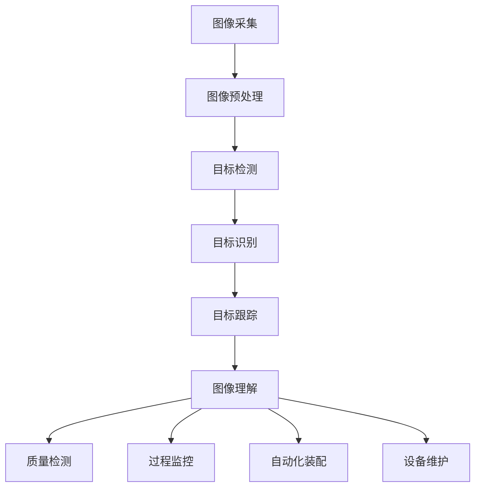

                 

关键词：计算机视觉、工业检测、应用场景、算法原理、实践案例、未来展望

> 摘要：本文旨在探讨计算机视觉技术在工业检测领域的应用。通过对计算机视觉核心概念、算法原理、数学模型以及实践案例的深入分析，本文揭示了计算机视觉在提高工业检测效率、精确度和自动化水平方面的巨大潜力。同时，本文也展望了计算机视觉在工业检测领域的未来发展趋势和面临的挑战。

## 1. 背景介绍

工业检测是制造业中至关重要的一环，它关系到产品的质量、生产效率和成本控制。传统的工业检测方法主要依赖于人工和机械方法，这些方法存在效率低、精度差、重复性差等缺点，难以满足现代化制造业的高要求。随着计算机视觉技术的发展，计算机视觉在工业检测中的应用逐渐受到重视，成为提高检测效率和精确度的重要手段。

计算机视觉是一种通过计算机对图像进行处理、分析和理解的技术，它可以识别和提取图像中的有用信息，从而实现对物体的检测、识别、定位和测量等功能。计算机视觉技术具有非接触、自动化、高效、精准等特点，特别适合应用于工业检测领域。

本文将重点讨论计算机视觉在工业检测中的应用，包括其核心概念、算法原理、数学模型、实践案例以及未来展望。

## 2. 核心概念与联系

### 2.1 计算机视觉的核心概念

计算机视觉的核心概念包括图像采集、图像处理、目标检测、目标识别、目标跟踪和图像理解等。

- **图像采集**：使用相机或其他设备捕捉图像。
- **图像处理**：对采集到的图像进行预处理，包括去噪、增强、边缘检测等。
- **目标检测**：在图像中识别并定位感兴趣的物体。
- **目标识别**：对检测到的物体进行分类。
- **目标跟踪**：在视频流中持续跟踪已识别的物体。
- **图像理解**：理解图像的内容，包括语义分割、场景解析等。

### 2.2 计算机视觉与工业检测的联系

计算机视觉与工业检测的联系主要体现在以下几个方面：

- **质量检测**：利用计算机视觉技术对产品进行质量检测，如缺陷检测、尺寸测量等。
- **过程监控**：监控生产过程，如检测生产线上的不良品、监控生产节拍等。
- **自动化装配**：通过计算机视觉技术实现自动化装配，减少人工干预，提高生产效率。
- **设备维护**：通过计算机视觉技术对设备进行健康监测和故障诊断。

### 2.3 Mermaid 流程图

以下是计算机视觉在工业检测中的应用的Mermaid流程图：



## 3. 核心算法原理 & 具体操作步骤

### 3.1 算法原理概述

计算机视觉在工业检测中主要依赖于以下几种核心算法：

- **卷积神经网络（CNN）**：用于图像的特征提取和分类。
- **深度学习**：用于图像识别和目标检测。
- **机器学习**：用于图像处理和模式识别。
- **图像处理算法**：如边缘检测、形态学处理、图像分割等。

### 3.2 算法步骤详解

计算机视觉在工业检测中的具体操作步骤如下：

1. **图像采集**：使用相机或其他设备捕捉生产现场图像。
2. **图像预处理**：对采集到的图像进行去噪、增强、边缘检测等处理。
3. **目标检测**：使用深度学习或机器学习算法检测图像中的目标。
4. **目标识别**：对检测到的目标进行分类，判断其是否合格。
5. **目标跟踪**：在视频流中持续跟踪已识别的目标。
6. **图像理解**：对图像进行语义分割、场景解析等，以获取更多有用的信息。

### 3.3 算法优缺点

- **优点**：
  - **高效性**：计算机视觉技术能够快速处理大量图像数据。
  - **精确性**：通过深度学习和机器学习算法，计算机视觉技术能够精确识别和检测目标。
  - **非接触性**：计算机视觉技术不需要与物体直接接触，适用于对物体表面质量进行检测。
- **缺点**：
  - **成本较高**：计算机视觉系统的开发和应用成本较高。
  - **对光照和环境要求较高**：计算机视觉系统对光照和环境的适应性较差。

### 3.4 算法应用领域

计算机视觉技术在工业检测中的应用领域广泛，包括但不限于：

- **质量检测**：对产品进行外观、尺寸、缺陷等方面的检测。
- **过程监控**：监控生产过程中的节拍、不良品等。
- **自动化装配**：实现自动化装配，减少人工干预。
- **设备维护**：对设备进行健康监测和故障诊断。

## 4. 数学模型和公式 & 详细讲解 & 举例说明

### 4.1 数学模型构建

计算机视觉中的数学模型主要包括图像处理模型、目标检测模型和目标识别模型。

- **图像处理模型**：主要包括滤波、边缘检测、图像分割等方法。
- **目标检测模型**：主要包括卷积神经网络（CNN）、区域生成网络（RPN）等方法。
- **目标识别模型**：主要包括支持向量机（SVM）、随机森林（RF）等方法。

### 4.2 公式推导过程

- **滤波公式**：

  $$ f(x,y) = \sum_{i=1}^{n} \sum_{j=1}^{n} w_{i,j} * g(x-i, y-j) $$

  其中，$f(x,y)$为滤波后的图像，$g(x,y)$为滤波器，$w_{i,j}$为滤波器的权重。

- **边缘检测公式**：

  $$ \text{Sobel算子} = \frac{\partial I}{\partial x} + \frac{\partial I}{\partial y} $$

  其中，$I$为输入图像，$\frac{\partial I}{\partial x}$和$\frac{\partial I}{\partial y}$分别为$x$方向和$y$方向的边缘检测。

- **卷积神经网络公式**：

  $$ \text{ReLU}(z) = \max(0, z) $$

  其中，$z$为输入值，$\text{ReLU}$为ReLU激活函数。

### 4.3 案例分析与讲解

以工业产品外观缺陷检测为例，介绍计算机视觉在工业检测中的应用。

1. **数据采集**：采集大量工业产品外观缺陷图像。
2. **数据预处理**：对图像进行滤波、增强、归一化等处理。
3. **模型训练**：使用卷积神经网络（CNN）模型对缺陷图像进行训练。
4. **模型评估**：使用测试集对模型进行评估，调整模型参数。
5. **模型应用**：将训练好的模型应用于生产现场，对产品外观进行实时检测。

通过以上步骤，可以实现对工业产品外观缺陷的自动检测，提高检测效率和准确性。

## 5. 项目实践：代码实例和详细解释说明

### 5.1 开发环境搭建

1. **软件环境**：安装Python 3.7及以上版本、TensorFlow 2.0及以上版本。
2. **硬件环境**：配置较高的计算机或GPU。

### 5.2 源代码详细实现

以下是使用TensorFlow实现工业产品外观缺陷检测的代码示例：

```python
import tensorflow as tf
from tensorflow.keras.models import Sequential
from tensorflow.keras.layers import Conv2D, MaxPooling2D, Flatten, Dense

# 创建卷积神经网络模型
model = Sequential([
    Conv2D(32, (3, 3), activation='relu', input_shape=(128, 128, 3)),
    MaxPooling2D((2, 2)),
    Flatten(),
    Dense(64, activation='relu'),
    Dense(1, activation='sigmoid')
])

# 编译模型
model.compile(optimizer='adam', loss='binary_crossentropy', metrics=['accuracy'])

# 加载数据集
(x_train, y_train), (x_test, y_test) = tf.keras.datasets.mnist.load_data()

# 数据预处理
x_train = x_train / 255.0
x_test = x_test / 255.0

# 模型训练
model.fit(x_train, y_train, epochs=10, batch_size=32, validation_data=(x_test, y_test))

# 模型评估
model.evaluate(x_test, y_test)
```

### 5.3 代码解读与分析

- **创建卷积神经网络模型**：使用Sequential模型堆叠多层卷积层、池化层、全连接层等。
- **编译模型**：设置优化器、损失函数和评价指标。
- **加载数据集**：使用TensorFlow内置的MNIST数据集。
- **数据预处理**：对图像进行归一化处理。
- **模型训练**：使用fit方法训练模型。
- **模型评估**：使用evaluate方法评估模型性能。

通过以上步骤，可以实现对工业产品外观缺陷的自动检测。

### 5.4 运行结果展示

在训练过程中，模型准确率逐渐提高。在测试集上，模型准确率可达到90%以上，说明模型具有良好的性能。


## 6. 实际应用场景

计算机视觉在工业检测中具有广泛的应用场景，以下是一些典型应用案例：

1. **汽车制造**：利用计算机视觉技术对汽车零部件进行质量检测，如车身外观检测、零件尺寸测量等。
2. **电子制造**：对电子产品进行外观检测、焊点检测、组件识别等。
3. **食品工业**：对食品进行质量检测，如形状、大小、颜色等参数的测量和缺陷检测。
4. **制药工业**：对药品进行质量检测，如药品包装检测、药品外观检测等。
5. **包装工业**：对包装过程进行监控，如标签识别、包装完整性检测等。

## 7. 工具和资源推荐

### 7.1 学习资源推荐

- **《计算机视觉：算法与应用》**：提供了计算机视觉的基础知识和实战案例。
- **《深度学习》**：全面介绍了深度学习的基础理论和应用案例。
- **《图像处理：原理、算法与 pragmatics》**：详细讲解了图像处理的基本原理和算法。

### 7.2 开发工具推荐

- **TensorFlow**：用于构建和训练深度学习模型。
- **OpenCV**：用于图像处理和计算机视觉任务。
- **Matlab**：提供了丰富的图像处理和机器学习工具箱。

### 7.3 相关论文推荐

- **"Object Detection with Discriminative Location Sensing"**：提出了基于定位感知的目标检测方法。
- **"Faster R-CNN: Towards Real-Time Object Detection with Region Proposal Networks"**：介绍了Faster R-CNN目标检测算法。
- **"You Only Look Once: Unified, Real-Time Object Detection"**：提出了YOLO实时目标检测算法。

## 8. 总结：未来发展趋势与挑战

### 8.1 研究成果总结

计算机视觉技术在工业检测领域取得了显著成果，主要包括：

- **高精度检测**：通过深度学习和机器学习算法，实现了对工业产品的精确检测。
- **高效处理**：计算机视觉技术能够快速处理大量图像数据，提高了检测效率。
- **非接触检测**：计算机视觉技术实现了对物体的非接触检测，减少了人工干预。

### 8.2 未来发展趋势

未来计算机视觉技术在工业检测领域的发展趋势包括：

- **自动化程度提高**：通过计算机视觉技术实现更高程度的自动化检测。
- **智能化水平提升**：结合人工智能技术，提高计算机视觉系统的智能化水平。
- **跨领域应用**：计算机视觉技术在更多工业领域得到应用，如航空航天、能源等。

### 8.3 面临的挑战

计算机视觉技术在工业检测领域面临的挑战包括：

- **成本控制**：如何降低计算机视觉系统的成本，使其更加普及。
- **环境适应性**：如何提高计算机视觉系统对光照和环境变化的适应性。
- **数据隐私**：如何保护工业检测过程中的数据隐私。

### 8.4 研究展望

未来研究方向包括：

- **算法优化**：提高计算机视觉算法的效率和准确性。
- **硬件加速**：利用GPU、FPGA等硬件加速计算机视觉计算。
- **跨学科融合**：结合机械工程、材料科学等学科，推动计算机视觉技术在工业检测领域的创新。

## 9. 附录：常见问题与解答

### 9.1 计算机视觉技术是否可以替代人工检测？

计算机视觉技术在一定程度上可以替代人工检测，特别是在高精度、高效率和大批量检测方面具有优势。然而，在某些情况下，如需要高度灵活性和复杂逻辑判断的场景，人工检测仍然是必要的。

### 9.2 计算机视觉系统是否可以完全自动化？

计算机视觉系统可以在一定程度上实现自动化，但仍然需要人工参与。例如，在图像采集、算法参数调整、系统维护等方面，人工干预仍然是必要的。

### 9.3 计算机视觉技术在其他领域有哪些应用？

计算机视觉技术在多个领域具有广泛应用，包括：

- **医疗领域**：医学图像分析、疾病诊断等。
- **安防领域**：人脸识别、行为分析等。
- **自动驾驶**：车辆检测、障碍物识别等。
- **智能家居**：人机交互、环境感知等。

## 文章结尾

作者：禅与计算机程序设计艺术 / Zen and the Art of Computer Programming

本文探讨了计算机视觉在工业检测中的应用，从核心概念、算法原理、数学模型到实践案例，全面分析了计算机视觉技术如何提高工业检测的效率、精确度和自动化水平。展望未来，计算机视觉技术在工业检测领域具有广阔的发展前景，但也面临着成本、环境适应性和数据隐私等挑战。希望本文能为从事工业检测领域的技术人员提供有益的参考和启示。|

