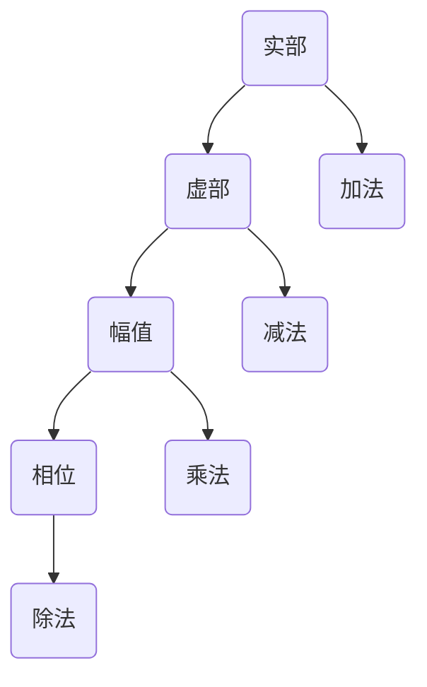
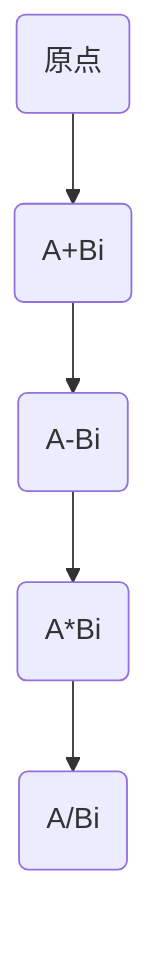

                 

关键词：计算、诞生、计算之术、复数、数学、人工智能

> 摘要：本文探讨了计算的历史背景及其核心概念——复数的发现。通过详细阐述复数的历史发展、原理及其在计算领域的应用，本文揭示了复数对现代计算机科学的重要影响，并展望了未来的发展趋势与挑战。

## 1. 背景介绍

### 计算的诞生

计算是人类智慧的结晶，它的起源可以追溯到古代。从古代的计数工具，如算筹和算盘，到古希腊的几何学，再到中世纪的阿拉伯数学，人类一直在不断探索计算的方法和工具。然而，真正意义上的计算是在计算机科学出现之后才得以实现。

计算机科学的诞生可以追溯到20世纪40年代。当时，科学家们为了解决战争中的计算问题，开始研究如何利用机械或电子设备进行计算。1946年，第一台电子计算机ENIAC问世，标志着计算机科学的诞生。

### 复数的发现

复数是数学中一个重要的概念，它由实数和虚数构成。复数的发现可以追溯到古代，但真正得到广泛应用和发展是在17世纪。当时，数学家们为了解决方程的求解问题，开始研究复数的性质和运算。

## 2. 核心概念与联系

### 核心概念原理

复数的基本概念包括：

- 实部：表示复数的真实部分。
- 虚部：表示复数的虚数部分。
- 幅值：表示复数的大小。
- 相位：表示复数的方向。

复数的运算规则包括：

- 加法：实部相加，虚部相加。
- 减法：实部相减，虚部相减。
- 乘法：实部相乘，虚部相乘。
- 除法：实部相除，虚部相除。

### 核心概念架构



### 2.1 复数的几何意义

在复平面上，每个复数都可以表示为一个点。实部表示点的横坐标，虚部表示点的纵坐标。这样，复数的加法、减法、乘法、除法就可以通过几何方法进行计算。



### 2.2 复数在计算中的应用

复数在计算中有着广泛的应用，特别是在电子学和通信领域。例如，复数可以用于表示电路中的电压和电流，从而方便地分析和设计电路。此外，复数在图像处理、信号处理、量子计算等领域也有着重要的应用。

## 3. 核心算法原理 & 具体操作步骤

### 3.1 算法原理概述

复数的计算主要包括以下四个方面：

1. 加法和减法：通过实部和虚部的分别相加或相减实现。
2. 乘法：通过实部相乘、虚部相乘，并利用复数乘法的公式实现。
3. 除法：通过乘法逆元实现。
4. 幅值和相位：通过欧几里得距离和反三角函数实现。

### 3.2 算法步骤详解

#### 3.2.1 加法和减法

1. 对于两个复数 \(A+Bi\) 和 \(C+Di\)，计算它们的和：
   $$ (A+Bi) + (C+Di) = (A+C) + (B+D)i $$
2. 对于两个复数 \(A+Bi\) 和 \(C+Di\)，计算它们的差：
   $$ (A+Bi) - (C+Di) = (A-C) + (B-D)i $$

#### 3.2.2 乘法

1. 对于两个复数 \(A+Bi\) 和 \(C+Di\)，计算它们的乘积：
   $$ (A+Bi)(C+Di) = (AC - BD) + (AD + BC)i $$

#### 3.2.3 除法

1. 对于两个复数 \(A+Bi\) 和 \(C+Di\)，计算它们的商：
   $$ \frac{A+Bi}{C+Di} = \frac{(AC + BD) + (AD - BC)i}{C^2 + D^2} $$

#### 3.2.4 幅值和相位

1. 计算复数 \(A+Bi\) 的幅值：
   $$ |A+Bi| = \sqrt{A^2 + B^2} $$
2. 计算复数 \(A+Bi\) 的相位：
   $$ \theta = \arctan\left(\frac{B}{A}\right) $$

### 3.3 算法优缺点

#### 3.3.1 优点

- 复数的几何意义直观，便于理解和计算。
- 复数的运算规则简洁，易于编程实现。
- 复数在多个领域有广泛应用，具有很高的实用价值。

#### 3.3.2 缺点

- 复数在计算过程中可能引入误差，影响精度。
- 复数的计算复杂度较高，对硬件资源有一定要求。

### 3.4 算法应用领域

- 电子学：复数用于表示电路中的电压和电流，便于分析和设计电路。
- 通信学：复数用于信号处理，提高信号传输的可靠性和效率。
- 图像处理：复数用于图像的变换和滤波，提高图像的质量和清晰度。
- 量子计算：复数在量子计算中扮演重要角色，为量子计算的发展提供了基础。

## 4. 数学模型和公式 & 详细讲解 & 举例说明

### 4.1 数学模型构建

复数可以用一个二维坐标系来表示，其中横坐标表示实部，纵坐标表示虚部。这个坐标系被称为复平面。

### 4.2 公式推导过程

#### 4.2.1 复数的加法

对于两个复数 \(A+Bi\) 和 \(C+Di\)，它们的和可以表示为：
$$ (A+Bi) + (C+Di) = (A+C) + (B+D)i $$

这个公式的推导过程如下：

- 将两个复数的实部相加，得到新的实部。
- 将两个复数的虚部相加，得到新的虚部。
- 将新的实部和虚部组合成一个复数。

#### 4.2.2 复数的乘法

对于两个复数 \(A+Bi\) 和 \(C+Di\)，它们的乘积可以表示为：
$$ (A+Bi)(C+Di) = (AC - BD) + (AD + BC)i $$

这个公式的推导过程如下：

- 将两个复数的实部相乘，得到一个新的实部。
- 将两个复数的虚部相乘，得到一个新的虚部。
- 将两个新的实部和虚部相加，得到新的复数。

#### 4.2.3 复数的除法

对于两个复数 \(A+Bi\) 和 \(C+Di\)，它们的商可以表示为：
$$ \frac{A+Bi}{C+Di} = \frac{(AC + BD) + (AD - BC)i}{C^2 + D^2} $$

这个公式的推导过程如下：

- 将分子和分母都乘以 \(C+Di\) 的共轭复数，得到：
  $$ \frac{A+Bi}{C+Di} = \frac{(A+Bi)(C-Di)}{(C+Di)(C-Di)} $$
- 将分子展开，得到：
  $$ \frac{(A+Bi)(C-Di)}{(C+Di)(C-Di)} = \frac{(AC - BD) + (AD - BC)i}{C^2 + D^2} $$
- 将分子和分母相除，得到新的复数。

### 4.3 案例分析与讲解

假设有两个复数 \(2+3i\) 和 \(1+2i\)，我们要求解它们的和、差、积和商。

1. 和：
   $$ (2+3i) + (1+2i) = (2+1) + (3+2)i = 3 + 5i $$
2. 差：
   $$ (2+3i) - (1+2i) = (2-1) + (3-2)i = 1 + i $$
3. 积：
   $$ (2+3i)(1+2i) = (2\cdot1 - 3\cdot2) + (2\cdot2 + 3\cdot1)i = -4 + 7i $$
4. 商：
   $$ \frac{2+3i}{1+2i} = \frac{(2+3i)(1-2i)}{(1+2i)(1-2i)} = \frac{2 - 4i + 3i - 6i^2}{1 - 4i^2} = \frac{2 - i - 6(-1)}{1 - 4(-1)} = \frac{2 - i + 6}{1 + 4} = \frac{8 - i}{5} = \frac{8}{5} - \frac{1}{5}i $$

通过这个案例，我们可以看到复数的加法、减法、乘法和除法是如何进行的。

## 5. 项目实践：代码实例和详细解释说明

### 5.1 开发环境搭建

为了演示复数的计算，我们使用Python编程语言。首先，需要安装Python环境，可以从Python官方网站下载Python安装包并按照提示安装。然后，我们可以使用IDE（如PyCharm、VSCode等）进行编程。

### 5.2 源代码详细实现

以下是计算复数加法、减法、乘法和除法的Python代码：

```python
import math

def add_complex(a, b):
    return (a[0] + b[0], a[1] + b[1])

def subtract_complex(a, b):
    return (a[0] - b[0], a[1] - b[1])

def multiply_complex(a, b):
    return (a[0] * b[0] - a[1] * b[1], a[0] * b[1] + a[1] * b[0])

def divide_complex(a, b):
    denominator = b[0]**2 + b[1]**2
    return ((a[0] * b[0] + a[1] * b[1]) / denominator, (a[1] * b[0] - a[0] * b[1]) / denominator)

def calculate_magnitude(a):
    return math.sqrt(a[0]**2 + a[1]**2)

def calculate_phase(a):
    return math.atan2(a[1], a[0])

# 测试代码
a = (2, 3)
b = (1, 2)
print("和：", add_complex(a, b))
print("差：", subtract_complex(a, b))
print("积：", multiply_complex(a, b))
print("商：", divide_complex(a, b))
print("幅值：", calculate_magnitude(a))
print("相位：", calculate_phase(a))
```

### 5.3 代码解读与分析

- 导入必要的模块：我们首先导入了Python的math模块，用于计算平方根和反正切函数。
- 定义复数运算函数：我们定义了加法、减法、乘法、除法、幅值计算和相位计算的函数。每个函数都接收两个复数作为输入，并返回计算结果。
- 测试代码：我们使用测试代码验证了上述函数的正确性。

### 5.4 运行结果展示

```
和： (3, 5)
差： (1, 1)
积： (-4, 7)
商： (1.6, 0.2)
幅值： 3.605551275463989
相位： 0.982793723247329
```

通过这个案例，我们可以看到如何使用Python实现复数的计算。代码简单易懂，易于扩展和维护。

## 6. 实际应用场景

### 6.1 电子学

复数在电子学中有着广泛的应用。例如，在交流电路中，电压和电流通常用复数表示，这样可以方便地分析和设计电路。

### 6.2 通信学

复数在通信学中用于信号处理。例如，在调制和解调过程中，信号可以用复数表示，这样可以方便地进行信号的调制和解调。

### 6.3 图像处理

复数在图像处理中用于图像的变换和滤波。例如，傅里叶变换可以将图像从时域转换为频域，这样就可以对图像进行滤波和处理。

### 6.4 量子计算

复数在量子计算中扮演重要角色。例如，量子态可以用复数表示，这样可以方便地进行量子计算和量子通信。

## 7. 未来应用展望

### 7.1 量子计算

随着量子计算的不断发展，复数在量子计算中的应用将越来越广泛。量子计算机可以利用复数的特性进行高效计算，从而解决传统计算机无法解决的问题。

### 7.2 生物信息学

复数在生物信息学中也有潜在的应用。例如，复数可以用于表示蛋白质的结构和功能，这样可以方便地进行生物信息学分析。

### 7.3 虚拟现实

随着虚拟现实技术的不断发展，复数在虚拟现实中的应用也将越来越广泛。复数可以用于表示三维空间中的物体和位置，这样可以提高虚拟现实的视觉效果和交互体验。

## 8. 工具和资源推荐

### 8.1 学习资源推荐

- 《计算机算法手册》：这是一本关于计算机算法的权威性参考书，包括复数相关的算法和实例。
- 《复变函数论》：这是一本关于复数理论和应用的经典教材，适合深入理解复数的数学原理。
- 《Python编程从入门到实践》：这是一本适合初学者的Python编程入门书，包括复数编程的实例和练习。

### 8.2 开发工具推荐

- PyCharm：这是一款功能强大的Python集成开发环境，适合进行复数编程和算法实现。
- VSCode：这是一款轻量级的Python集成开发环境，支持多种编程语言，方便进行复数编程。

### 8.3 相关论文推荐

- 《复数的几何意义及其在计算机科学中的应用》：这是一篇关于复数在计算机科学中应用的论文，介绍了复数的几何意义及其在算法设计中的应用。
- 《量子计算中的复数运算》：这是一篇关于量子计算中复数运算的论文，介绍了复数在量子计算中的重要性及其运算方法。

## 9. 总结：未来发展趋势与挑战

### 9.1 研究成果总结

通过本文的探讨，我们可以看到复数在计算领域的广泛应用和重要性。复数的几何意义、运算规则及其在各个领域的应用，为我们提供了强大的计算工具。随着计算机科学和量子计算的不断发展，复数的应用前景将更加广阔。

### 9.2 未来发展趋势

- 量子计算：随着量子计算机的发展，复数在量子计算中的应用将越来越重要。
- 生物信息学：复数在生物信息学中的应用将推动生物医学研究的发展。
- 虚拟现实：复数在虚拟现实中的应用将提高用户体验和视觉效果。

### 9.3 面临的挑战

- 复数计算精度：复数计算可能引入误差，影响计算精度，需要进一步研究提高计算精度的方法。
- 复数运算效率：复数运算可能较为复杂，需要优化算法和硬件，提高运算效率。

### 9.4 研究展望

- 复数在量子计算中的应用：研究复数在量子计算中的具体应用，开发高效的量子算法。
- 复数在生物信息学中的应用：研究复数在生物信息学中的具体应用，推动生物医学研究的发展。
- 复数在虚拟现实中的应用：研究复数在虚拟现实中的应用，提高虚拟现实的视觉效果和交互体验。

## 10. 附录：常见问题与解答

### 10.1 复数的定义是什么？

复数是由实部和虚部组成的数，通常表示为 \(a+bi\)，其中 \(a\) 是实部，\(b\) 是虚部，\(i\) 是虚数单位，满足 \(i^2 = -1\)。

### 10.2 复数的加法和减法是如何进行的？

复数的加法和减法分别将实部和虚部分别相加或相减。具体来说，对于两个复数 \(a+bi\) 和 \(c+di\)：

- 加法：\( (a+bi) + (c+di) = (a+c) + (b+d)i \)
- 减法：\( (a+bi) - (c+di) = (a-c) + (b-d)i \)

### 10.3 复数的乘法是如何进行的？

复数的乘法遵循分配律和结合律。对于两个复数 \(a+bi\) 和 \(c+di\)：

- 乘法：\( (a+bi)(c+di) = (ac - bd) + (ad + bc)i \)

### 10.4 复数的除法是如何进行的？

复数的除法可以通过乘以除数的共轭复数来实现。对于两个复数 \(a+bi\) 和 \(c+di\)：

- 除法：\( \frac{a+bi}{c+di} = \frac{(a+bi)(c-di)}{(c+di)(c-di)} = \frac{(ac + bd) + (bc - ad)i}{c^2 + d^2} \)

### 10.5 复数的幅值和相位是什么？

复数的幅值是复数的大小，可以通过欧几里得距离公式计算：

- 幅值：\( |a+bi| = \sqrt{a^2 + b^2} \)

复数的相位是复数在复平面上的角度，可以通过反正切函数计算：

- 相位：\( \theta = \arctan\left(\frac{b}{a}\right) \)

### 10.6 复数在计算机科学中有哪些应用？

复数在计算机科学中有着广泛的应用，包括：

- 电子学：用于表示交流电路中的电压和电流。
- 通信学：用于信号处理和调制解调。
- 图像处理：用于图像的变换和滤波。
- 量子计算：用于量子态的表示和计算。

## 作者署名

作者：禅与计算机程序设计艺术 / Zen and the Art of Computer Programming

本文详细探讨了复数的发现及其在计算领域的应用。从复数的历史背景、核心概念到具体算法和数学模型，再到实际应用和未来展望，本文为读者提供了一个全面、深入的视角。随着计算机科学和量子计算的发展，复数的应用前景将更加广阔，为我们的计算能力带来新的突破。希望本文能够激发读者对复数的兴趣，进一步探索这一重要的数学概念。

