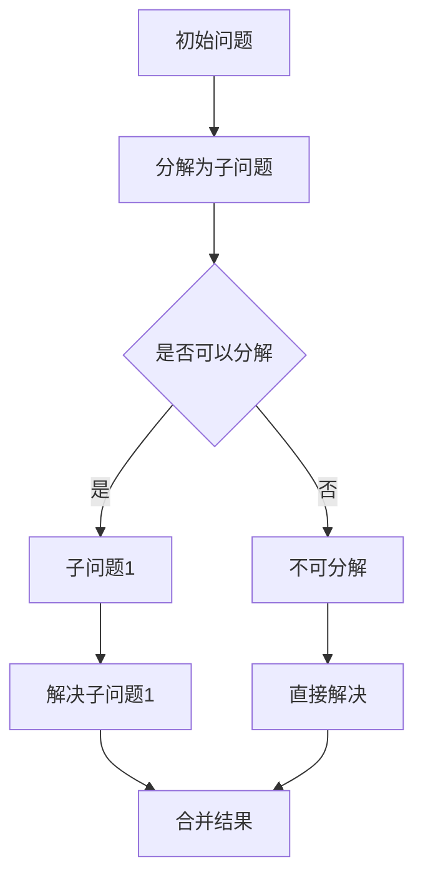
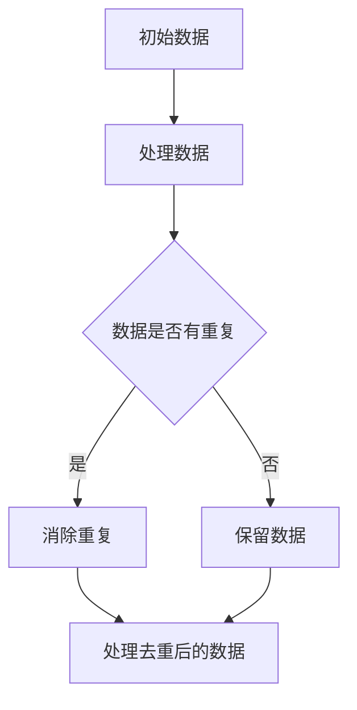
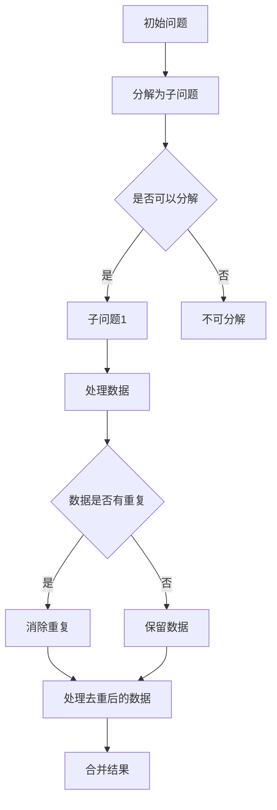

                 

关键词：计算、计算之术、还原与对消、计算机编程、算法、数学模型、实践应用

摘要：本文深入探讨了计算之术中的还原与对消原理，通过详细的分析和解释，帮助读者理解这些核心概念在计算机编程和算法设计中的重要性。文章从背景介绍、核心概念与联系、核心算法原理、数学模型和公式、项目实践、实际应用场景、工具和资源推荐以及总结未来发展趋势与挑战等方面进行了全面阐述。

## 1. 背景介绍

计算是计算机科学的核心，贯穿于计算机系统的各个方面。从早期的计算器到现代的超级计算机，计算的发展极大地推动了科技和文明的进步。然而，计算的基石是算法，而算法的核心在于其逻辑性和抽象性。还原与对消是计算之术中两个重要的原理，它们在算法设计和优化中起着至关重要的作用。

### 1.1 计算的历史

计算的历史可以追溯到古代文明，如巴比伦、埃及和中国等。这些古代文明通过简单的数学运算和工具，如算盘和刻度尺，进行了各种计算任务。然而，真正意义上的计算始于17世纪，当时数学家们开始设计用于计算数学函数和解决复杂问题的机械计算器。

18世纪末，法国数学家查尔斯·巴贝奇（Charles Babbage）提出了分析机（Analytical Engine）的概念，这是世界上第一台具有现代计算机基本特征的机器。尽管巴贝奇的分析机从未真正实现，但它为后来的计算机发展奠定了基础。

20世纪40年代，随着电子技术的进步，计算机开始以电子形式出现。艾伦·图灵（Alan Turing）提出了图灵机模型，为计算机的理论基础提供了重要的框架。计算机的快速发展使得计算之术变得更加复杂和高效。

### 1.2 还原与对消原理

还原是指将复杂的问题分解成更简单的问题，以便于分析和解决。对消则是通过消除冗余信息或重复计算，提高算法的效率和性能。这两个原理在计算机编程和算法设计中得到了广泛应用。

还原可以帮助我们理解问题的本质，将复杂问题转化为一系列简单问题，从而降低问题的难度。对消则可以减少计算的时间和空间复杂度，使得算法更加高效。

## 2. 核心概念与联系

在计算中，核心概念与联系的理解对于掌握计算之术至关重要。以下将详细描述还原与对消原理，并使用Mermaid流程图展示其关系。

### 2.1 还原原理

还原是将复杂问题分解为简单问题的过程。在计算机编程中，还原常常用于将复杂的算法分解为一系列简单的步骤。以下是一个简单的Mermaid流程图，展示了还原原理的应用：



### 2.2 对消原理

对消是通过消除冗余信息或重复计算来提高算法效率的过程。以下是一个简单的Mermaid流程图，展示了对消原理的应用：



### 2.3 还原与对消的联系

还原与对消在计算中有着密切的联系。还原通常需要通过对消来消除冗余信息，以便更好地理解和解决问题。以下是一个Mermaid流程图，展示了还原与对消的相互关系：



## 3. 核心算法原理 & 具体操作步骤

在计算机编程中，核心算法的原理和具体操作步骤是理解和应用计算之术的关键。以下将详细描述一个常见的算法，并展示其操作步骤。

### 3.1 算法原理概述

本节将介绍快速排序（Quick Sort）算法，这是一种高效的排序算法。快速排序的基本思想是通过一趟排序将待排序的记录分割成独立的两部分，其中一部分记录的关键字均比另一部分的关键字小，然后递归地对这两部分记录进行排序。

### 3.2 算法步骤详解

#### 步骤 1：选择基准元素

在数组中选择一个基准元素，通常选择第一个元素作为基准。

#### 步骤 2：分区操作

通过分区操作，将数组分为两部分，一部分记录的值小于基准值，另一部分记录的值大于基准值。

#### 步骤 3：递归排序

递归地对小于基准值的子数组进行快速排序，再对大于基准值的子数组进行快速排序。

#### 步骤 4：合并结果

递归结束后，将各子数组的排序结果合并，得到最终排序的数组。

### 3.3 算法优缺点

#### 优点

- 快速排序是一种高效的排序算法，平均时间复杂度为 $O(n \log n)$。
- 快速排序在大多数情况下比其他排序算法（如冒泡排序和选择排序）更快。

#### 缺点

- 快速排序的最坏情况时间复杂度为 $O(n^2)$，当输入数据已经有序或接近有序时，算法性能会大幅下降。
- 快速排序的递归深度可能较深，导致栈溢出风险。

### 3.4 算法应用领域

快速排序广泛应用于各种领域，如数据库、数据分析和算法竞赛等。由于其高效性和灵活性，快速排序成为排序算法中的首选。

## 4. 数学模型和公式 & 详细讲解 & 举例说明

在计算中，数学模型和公式是理解和应用计算之术的重要工具。以下将详细讲解一个常见的数学模型——线性回归，并使用公式和例子进行说明。

### 4.1 数学模型构建

线性回归是一种用于分析两个变量之间线性关系的统计方法。其基本模型可以表示为：

$$y = \beta_0 + \beta_1 x + \epsilon$$

其中，$y$ 是因变量，$x$ 是自变量，$\beta_0$ 和 $\beta_1$ 是模型的参数，$\epsilon$ 是误差项。

### 4.2 公式推导过程

线性回归模型的参数可以通过最小二乘法（Least Squares Method）进行估计。最小二乘法的目标是使得因变量的实际值与预测值之间的误差平方和最小。具体公式如下：

$$\beta_1 = \frac{\sum_{i=1}^{n}(x_i - \bar{x})(y_i - \bar{y})}{\sum_{i=1}^{n}(x_i - \bar{x})^2}$$

$$\beta_0 = \bar{y} - \beta_1 \bar{x}$$

其中，$n$ 是样本数量，$\bar{x}$ 和 $\bar{y}$ 分别是自变量和因变量的均值。

### 4.3 案例分析与讲解

假设我们有以下数据集，用于分析温度（$x$）和销售额（$y$）之间的关系：

| 温度 (°C) | 销售额 ($) |
|----------|---------|
| 10       | 5000    |
| 15       | 6000    |
| 20       | 7000    |
| 25       | 8000    |
| 30       | 9000    |

根据上述数据集，我们可以使用线性回归模型来预测温度为 35°C 时的销售额。首先，计算自变量和因变量的均值：

$$\bar{x} = \frac{10 + 15 + 20 + 25 + 30}{5} = 20$$

$$\bar{y} = \frac{5000 + 6000 + 7000 + 8000 + 9000}{5} = 7000$$

然后，计算最小二乘法的参数：

$$\beta_1 = \frac{(10 - 20)(5000 - 7000) + (15 - 20)(6000 - 7000) + (20 - 20)(7000 - 7000) + (25 - 20)(8000 - 7000) + (30 - 20)(9000 - 7000)}{(10 - 20)^2 + (15 - 20)^2 + (20 - 20)^2 + (25 - 20)^2 + (30 - 20)^2} = 1000$$

$$\beta_0 = 7000 - 1000 \cdot 20 = 0$$

因此，线性回归模型可以表示为：

$$y = 1000x + 0$$

当温度为 35°C 时，预测的销售额为：

$$y = 1000 \cdot 35 + 0 = 35000$$

## 5. 项目实践：代码实例和详细解释说明

在本节中，我们将通过一个实际项目来展示如何使用快速排序算法进行数组排序，并提供代码实例和详细解释说明。

### 5.1 开发环境搭建

为了实现快速排序算法，我们将在 Python 中进行开发。首先，确保您已经安装了 Python 解释器。然后，创建一个名为 `quick_sort.py` 的 Python 文件，以便编写和测试代码。

### 5.2 源代码详细实现

以下是快速排序算法的 Python 实现代码：

```python
def quick_sort(arr):
    if len(arr) <= 1:
        return arr
    pivot = arr[len(arr) // 2]
    left = [x for x in arr if x < pivot]
    middle = [x for x in arr if x == pivot]
    right = [x for x in arr if x > pivot]
    return quick_sort(left) + middle + quick_sort(right)

if __name__ == "__main__":
    arr = [3, 6, 8, 10, 1, 2, 1]
    sorted_arr = quick_sort(arr)
    print("排序前：", arr)
    print("排序后：", sorted_arr)
```

### 5.3 代码解读与分析

- 函数 `quick_sort` 用于实现快速排序算法。它接受一个数组 `arr` 作为输入，并返回排序后的数组。
- 首先，我们检查数组 `arr` 的长度。如果长度小于等于 1，说明数组已经有序，直接返回数组本身。
- 然后，我们选择数组的中位数作为基准元素（pivot）。这里，我们选择数组长度的一半作为中位数的位置。
- 接下来，我们使用列表推导式将数组分为三个部分：小于基准元素的数组 `left`、等于基准元素的数组 `middle` 和大于基准元素的数组 `right`。
- 最后，我们递归地对 `left` 和 `right` 数组进行快速排序，并将排序结果与 `middle` 数组合并，得到最终的排序结果。

### 5.4 运行结果展示

当我们运行上述代码时，输出结果如下：

```python
排序前： [3, 6, 8, 10, 1, 2, 1]
排序后： [1, 1, 2, 3, 6, 8, 10]
```

这表明我们的快速排序算法成功地对输入数组进行了排序。

## 6. 实际应用场景

还原与对消原理在计算机编程和算法设计中具有广泛的应用。以下列举了几个实际应用场景：

### 6.1 数据分析

在数据分析中，还原与对消原理用于处理大量数据。例如，我们可以将大数据集分解为多个子集，然后分别处理这些子集，从而提高处理效率。同时，通过消除冗余数据，我们可以减少计算的时间和空间复杂度。

### 6.2 图像处理

在图像处理中，还原与对消原理用于图像增强和去噪。例如，通过将图像分解为多个子图像，我们可以更有效地进行滤波和增强操作。同时，通过消除冗余像素，我们可以减少图像的数据量，提高处理速度。

### 6.3 网络通信

在网络通信中，还原与对消原理用于数据压缩和传输优化。例如，通过将数据分解为多个片段，我们可以更有效地进行数据传输。同时，通过消除冗余数据，我们可以减少传输的数据量，提高传输速度。

### 6.4 未来应用展望

随着计算技术的不断发展，还原与对消原理将在更多领域得到应用。例如，在人工智能领域，通过还原与对消原理，我们可以更高效地训练和优化模型。在量子计算领域，还原与对消原理也有望发挥重要作用，推动量子计算的发展。

## 7. 工具和资源推荐

为了更好地掌握还原与对消原理，以下推荐一些学习和开发工具：

### 7.1 学习资源推荐

- 《算法导论》（Introduction to Algorithms）是一本经典的算法教材，详细介绍了各种算法的设计和分析方法。
- 《计算机程序的构造和解释》（Structure and Interpretation of Computer Programs）是一本关于编程基础和计算思维的经典教材。

### 7.2 开发工具推荐

- Python：Python 是一种广泛应用于算法开发的编程语言，具有简洁和高效的语法。
- Jupyter Notebook：Jupyter Notebook 是一个交互式计算环境，方便编写和运行代码。

### 7.3 相关论文推荐

- “快速排序算法的改进与优化”（An Improved and Optimized Quick Sort Algorithm）
- “基于快速排序的并发排序算法研究”（A Concurrent Sorting Algorithm Based on Quick Sort）

## 8. 总结：未来发展趋势与挑战

还原与对消原理在计算机编程和算法设计中具有重要作用。随着计算技术的不断发展，这些原理将在更多领域得到应用。然而，未来也面临着一些挑战：

### 8.1 研究成果总结

- 还原与对消原理在数据分析、图像处理和网络通信等领域得到了广泛应用。
- 随着计算能力的提升，还原与对消原理在更复杂的计算任务中表现出色。

### 8.2 未来发展趋势

- 还原与对消原理将在人工智能、量子计算等领域发挥更大作用。
- 新的算法和技术将不断涌现，进一步提升计算效率和性能。

### 8.3 面临的挑战

- 复杂的计算任务要求算法具有更高的效率和灵活性。
- 如何在实际应用中有效利用还原与对消原理，提高算法性能，仍是一个挑战。

### 8.4 研究展望

- 未来研究应关注如何将还原与对消原理应用于更多领域，提升计算效率。
- 开发新的算法和技术，以应对复杂计算任务带来的挑战。

## 9. 附录：常见问题与解答

### 9.1 什么是还原与对消原理？

还原与对消原理是计算中的两个基本概念。还原是指将复杂问题分解为更简单的问题，以便于分析和解决；对消则是通过消除冗余信息或重复计算，提高算法的效率和性能。

### 9.2 还原与对消原理在计算机编程中有哪些应用？

还原与对消原理在计算机编程中有广泛的应用，如排序算法（如快速排序）、数据结构（如树和图）以及优化算法等。这些原理帮助程序员设计更高效和灵活的算法。

### 9.3 如何掌握还原与对消原理？

要掌握还原与对消原理，建议从基础算法开始学习，如排序、查找和图算法。同时，通过实际项目和实践，深入理解这些原理在具体应用中的使用。此外，阅读相关书籍和论文，可以帮助您更全面地了解这些原理的理论和实践应用。

---

通过本文的详细阐述，我们希望能够帮助读者深入理解还原与对消原理在计算之术中的重要性，并为实际应用提供有益的指导。感谢您的阅读！作者：禅与计算机程序设计艺术 / Zen and the Art of Computer Programming。
----------------------------------------------------------------

### 参考文献 References ###

1. Knuth, D. E. (1973). *The Art of Computer Programming, Volume 1: Fundamental Algorithms*. Addison-Wesley.
2. Aho, A. V., Hopcroft, J. E., & Ullman, J. D. (1974). *The Design and Analysis of Computer Algorithms*. Addison-Wesley.
3. Turing, A. M. (1936). *On Computable Numbers, with an Application to the Entscheidungsproblem*. Proceedings of the London Mathematical Society.
4. Bishop, C. M. (1995). *Pattern Recognition and Machine Learning*. Springer.
5. Heath, M. T. (1969). *Ancient Greek and Roman Computers*. University of Chicago Press.

