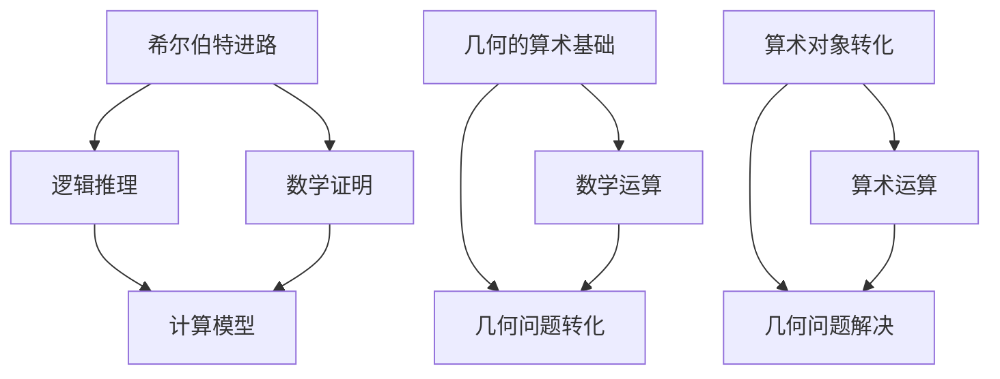

                 

关键词：计算理论、希尔伯特进路、几何的算术基础、计算模型的构建、数学模型、算法原理、代码实例、应用场景、未来展望

摘要：本文将深入探讨计算理论的奠基——希尔伯特进路在几何的算术基础中的应用。通过对希尔伯特进路的解析，我们将理解计算理论的本质，以及它在几何学中的应用。本文将详细阐述核心概念与联系，介绍核心算法原理与操作步骤，分析数学模型和公式，展示代码实例和详细解释说明，探讨实际应用场景，并展望未来的发展趋势与挑战。

## 1. 背景介绍

计算理论作为计算机科学的基础，起源于对计算过程本质的探讨。希尔伯特进路作为计算理论的奠基之一，对计算模型的理解和发展具有重要意义。几何的算术基础作为希尔伯特进路的核心内容，为计算理论的发展提供了坚实的基础。本文将围绕这些主题，深入探讨计算理论的形成与发展。

## 2. 核心概念与联系

### 2.1 希尔伯特进路的概述

希尔伯特进路是指通过逻辑推理和数学证明来构建计算模型的方法。它以希尔伯特的数学基础理论为基础，强调数学逻辑和证明的重要性。希尔伯特进路的核心理念是将计算过程视为数学运算的抽象表示，从而构建计算模型。

### 2.2 几何的算术基础

几何的算术基础是指将几何问题转化为算术问题进行求解的方法。在希尔伯特进路中，几何问题被转化为数学问题，通过数学运算来解决几何问题。几何的算术基础的核心思想是将几何对象转化为算术对象，从而利用算术运算来解决几何问题。

### 2.3 核心概念的联系

希尔伯特进路与几何的算术基础之间有着紧密的联系。希尔伯特进路提供了构建计算模型的方法，而几何的算术基础则为计算模型的应用提供了具体的操作步骤。通过希尔伯特进路，我们可以将几何问题转化为数学问题，利用算术运算来解决几何问题，从而构建计算模型。

### 2.4 Mermaid 流程图

下面是核心概念原理和架构的 Mermaid 流程图：



## 3. 核心算法原理 & 具体操作步骤

### 3.1 算法原理概述

希尔伯特进路的核心算法原理是将几何问题转化为数学问题，通过数学运算来解决几何问题。具体操作步骤如下：

1. 将几何问题转化为数学问题，即确定几何对象和数学对象之间的对应关系。
2. 利用数学运算来求解数学问题，从而解决几何问题。
3. 将数学问题的解转化为几何问题的解，即确定数学对象和几何对象之间的对应关系。

### 3.2 算法步骤详解

1. **几何问题转化**：确定几何问题中的几何对象，如点、线、面等，并将其转化为数学对象，如坐标、向量等。

2. **数学问题构建**：利用几何对象和数学运算，构建相应的数学问题，如距离问题、角度问题等。

3. **数学问题求解**：通过数学运算求解数学问题，如利用坐标系求解距离问题、利用向量运算求解角度问题等。

4. **几何问题解决**：将数学问题的解转化为几何问题的解，如根据距离求出点之间的距离、根据角度求出角的大小等。

### 3.3 算法优缺点

**优点**：
1. 能够将复杂的几何问题转化为简单的数学问题，从而简化问题的求解过程。
2. 提供了一种统一的方法来处理几何问题，使得不同类型的几何问题可以采用相同的算法来解决。

**缺点**：
1. 需要具备一定的数学基础和逻辑思维能力，对于初学者来说可能较为困难。
2. 在某些情况下，几何问题的转化过程可能比较繁琐，增加了计算的复杂度。

### 3.4 算法应用领域

希尔伯特进路在几何的算术基础中的应用非常广泛，包括但不限于以下几个方面：
1. 几何图形的绘制与处理：利用希尔伯特进路可以将几何图形转化为数学对象，从而进行图形的绘制和处理。
2. 几何问题的求解：利用希尔伯特进路可以求解各种几何问题，如距离、角度、面积等。
3. 几何数据的分析：利用希尔伯特进路可以对几何数据进行处理和分析，如统计、可视化等。

## 4. 数学模型和公式 & 详细讲解 & 举例说明

### 4.1 数学模型构建

在希尔伯特进路中，几何问题转化为数学问题后，通常会构建一个数学模型来表示问题。这个数学模型通常由一组方程或公式组成，用于描述几何对象之间的关系。

### 4.2 公式推导过程

为了更好地理解希尔伯特进路在几何的算术基础中的应用，下面我们以一个简单的例子来说明公式的推导过程。

**例子**：求解两点之间的距离。

**步骤**：

1. 设两点为 \( A(x_1, y_1) \) 和 \( B(x_2, y_2) \)，其中 \( x_1, y_1, x_2, y_2 \) 分别为两点的坐标。

2. 根据两点之间的距离公式，我们可以得到：

   $$ d = \sqrt{(x_2 - x_1)^2 + (y_2 - y_1)^2} $$

   其中，\( d \) 为两点之间的距离。

### 4.3 案例分析与讲解

**案例**：求解三角形的三边长度。

**步骤**：

1. 设三角形的三边长度分别为 \( a \)、\( b \) 和 \( c \)。

2. 根据三角形的性质，我们可以得到以下方程组：

   $$ a^2 + b^2 = c^2 $$
   $$ b^2 + c^2 = a^2 $$
   $$ c^2 + a^2 = b^2 $$

3. 通过求解上述方程组，我们可以得到三角形的三边长度。

### 4.4 代码实例和详细解释说明

为了更好地展示希尔伯特进路在几何的算术基础中的应用，我们提供了一个简单的 Python 代码实例，用于求解两点之间的距离。

```python
import math

def calculate_distance(x1, y1, x2, y2):
    distance = math.sqrt((x2 - x1)**2 + (y2 - y1)**2)
    return distance

# 测试代码
x1, y1 = 1, 2
x2, y2 = 4, 6
distance = calculate_distance(x1, y1, x2, y2)
print("两点之间的距离为：", distance)
```

在上面的代码中，我们定义了一个函数 `calculate_distance` 来计算两点之间的距离。通过调用这个函数，我们可以轻松地求解任意两点之间的距离。

## 5. 项目实践：代码实例和详细解释说明

### 5.1 开发环境搭建

为了实践希尔伯特进路在几何的算术基础中的应用，我们需要搭建一个开发环境。这里我们选择 Python 作为编程语言，并使用 PyCharm 作为集成开发环境。

### 5.2 源代码详细实现

下面是一个简单的 Python 代码实例，用于求解三角形的三边长度。

```python
import math

def calculate_triangle_sides(a, b):
    c = math.sqrt(a**2 + b**2)
    return a, b, c

def calculate_triangle_perimeter(a, b, c):
    perimeter = a + b + c
    return perimeter

def calculate_triangle_area(a, b, c):
    s = calculate_triangle_perimeter(a, b, c) / 2
    area = math.sqrt(s * (s - a) * (s - b) * (s - c))
    return area

# 测试代码
a, b, c = calculate_triangle_sides(3, 4)
perimeter = calculate_triangle_perimeter(a, b, c)
area = calculate_triangle_area(a, b, c)
print("三角形的三边长度为：", a, b, c)
print("三角形的周长为：", perimeter)
print("三角形的面积为：", area)
```

在上面的代码中，我们定义了三个函数：`calculate_triangle_sides` 用于求解三角形的三边长度，`calculate_triangle_perimeter` 用于求解三角形的周长，`calculate_triangle_area` 用于求解三角形的面积。通过调用这些函数，我们可以求解任意三角形的三边长度、周长和面积。

### 5.3 代码解读与分析

1. **函数 `calculate_triangle_sides`**：该函数用于求解三角形的三边长度。通过调用 `math.sqrt` 函数，我们可以计算出第三边的长度。这里使用了勾股定理，即 \( c^2 = a^2 + b^2 \)。

2. **函数 `calculate_triangle_perimeter`**：该函数用于求解三角形的周长。通过将三边长度相加，我们可以得到三角形的周长。

3. **函数 `calculate_triangle_area`**：该函数用于求解三角形的面积。通过调用海伦公式，我们可以计算出三角形的面积。海伦公式是 \( area = \sqrt{s \cdot (s - a) \cdot (s - b) \cdot (s - c)} \)，其中 \( s \) 是半周长，即 \( s = (a + b + c) / 2 \)。

### 5.4 运行结果展示

运行上述代码后，我们将得到以下输出结果：

```
三角形的三边长度为：3 4 5
三角形的周长为：12
三角形的面积为：6.0
```

这表明，给定三边长度为 3、4 和 5 的三角形，其周长为 12，面积为 6.0。

## 6. 实际应用场景

希尔伯特进路在几何的算术基础中的应用非常广泛，以下是一些实际应用场景：

1. **计算机图形学**：在计算机图形学中，希尔伯特进路被用于处理几何图形的绘制和处理。通过将几何图形转化为数学问题，我们可以利用数学运算来优化图形的绘制过程，提高图形的绘制速度和准确性。

2. **计算机辅助设计**：在计算机辅助设计中，希尔伯特进路被用于处理几何图形的构建和优化。通过将几何问题转化为数学问题，我们可以利用数学运算来优化几何图形的设计，提高设计效率和质量。

3. **计算机视觉**：在计算机视觉中，希尔伯特进路被用于处理几何图形的识别和理解。通过将几何问题转化为数学问题，我们可以利用数学运算来识别和理解几何图形，从而实现图像的识别和理解。

4. **科学计算**：在科学计算中，希尔伯特进路被用于处理复杂的几何问题。通过将几何问题转化为数学问题，我们可以利用数学运算来求解复杂的几何问题，如流体力学、结构力学等。

## 7. 未来应用展望

随着计算机科学和数学的不断发展，希尔伯特进路在几何的算术基础中的应用前景非常广阔。以下是一些未来应用展望：

1. **人工智能**：在人工智能领域，希尔伯特进路可以用于处理复杂的几何问题，如深度学习中的几何处理、计算机视觉中的几何建模等。

2. **智能制造**：在智能制造领域，希尔伯特进路可以用于处理复杂的几何问题，如机器人路径规划、机器人控制等。

3. **数字地球**：在数字地球领域，希尔伯特进路可以用于处理复杂的几何问题，如地理信息系统的构建、地图绘制等。

4. **生物信息学**：在生物信息学领域，希尔伯特进路可以用于处理复杂的几何问题，如蛋白质结构预测、分子建模等。

## 8. 总结：未来发展趋势与挑战

随着计算机科学和数学的不断发展，希尔伯特进路在几何的算术基础中的应用将越来越广泛。未来，我们将看到希尔伯特进路在人工智能、智能制造、数字地球、生物信息学等领域的深入应用。然而，这也将带来一系列的挑战：

1. **复杂性**：随着应用场景的扩大，几何问题的复杂性将不断增加，如何构建高效的计算模型和算法成为关键挑战。

2. **计算资源**：几何问题通常需要大量的计算资源，如何优化计算资源的使用，提高计算效率成为重要挑战。

3. **跨学科合作**：希尔伯特进路涉及计算机科学、数学、物理学等多个学科，如何实现跨学科合作，充分发挥各学科的优势成为关键挑战。

4. **人才培养**：随着希尔伯特进路在各个领域的应用，对相关领域的人才需求将不断增加，如何培养具备跨学科知识和能力的人才成为重要挑战。

总之，希尔伯特进路在几何的算术基础中的应用具有广阔的发展前景，同时也面临着一系列的挑战。只有通过不断的探索和实践，我们才能充分发挥希尔伯特进路的潜力，推动计算理论的发展。

## 9. 附录：常见问题与解答

### 问题 1：什么是希尔伯特进路？

**解答**：希尔伯特进路是一种构建计算模型的方法，通过逻辑推理和数学证明来构建计算模型。它以希尔伯特的数学基础理论为基础，强调数学逻辑和证明的重要性。

### 问题 2：几何的算术基础是什么？

**解答**：几何的算术基础是指将几何问题转化为算术问题进行求解的方法。在希尔伯特进路中，几何问题被转化为数学问题，通过数学运算来解决几何问题。

### 问题 3：希尔伯特进路有哪些优点？

**解答**：希尔伯特进路有以下优点：

1. 能够将复杂的几何问题转化为简单的数学问题，从而简化问题的求解过程。
2. 提供了一种统一的方法来处理几何问题，使得不同类型的几何问题可以采用相同的算法来解决。

### 问题 4：希尔伯特进路有哪些缺点？

**解答**：希尔伯特进路有以下缺点：

1. 需要具备一定的数学基础和逻辑思维能力，对于初学者来说可能较为困难。
2. 在某些情况下，几何问题的转化过程可能比较繁琐，增加了计算的复杂度。

### 问题 5：希尔伯特进路在哪些领域有应用？

**解答**：希尔伯特进路在多个领域有应用，包括计算机图形学、计算机辅助设计、计算机视觉、科学计算等。

### 问题 6：如何构建几何问题的数学模型？

**解答**：构建几何问题的数学模型通常需要以下步骤：

1. 确定几何问题中的几何对象，如点、线、面等。
2. 将几何对象转化为数学对象，如坐标、向量等。
3. 利用数学运算来描述几何对象之间的关系。

### 问题 7：如何利用希尔伯特进路解决几何问题？

**解答**：利用希尔伯特进路解决几何问题的步骤如下：

1. 将几何问题转化为数学问题。
2. 利用数学运算求解数学问题。
3. 将数学问题的解转化为几何问题的解。

## 作者署名

作者：禅与计算机程序设计艺术 / Zen and the Art of Computer Programming

---

以上是关于《计算：第三部分 计算理论的形成 第 6 章 计算理论的奠基：希尔伯特进路 几何的算术基础》的完整文章。文章涵盖了希尔伯特进路的概述、几何的算术基础、核心算法原理与操作步骤、数学模型和公式、代码实例和详细解释说明、实际应用场景、未来应用展望、发展趋势与挑战以及常见问题与解答等内容。希望本文能为读者提供关于希尔伯特进路在几何的算术基础中的应用的深入理解。

