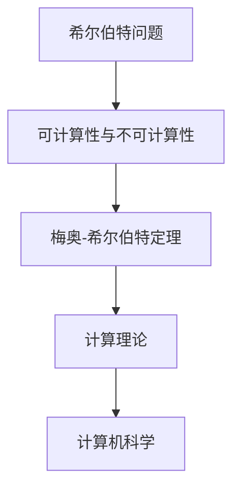

                 

### 1. 背景介绍

计算理论的形成是计算机科学和数学领域的一次重大突破，它为后续计算机的发展奠定了坚实的基础。计算理论的研究主要集中在探索计算的本质、计算能力的边界以及计算模型与实际计算任务之间的关系。在这个过程中，希尔伯特进路以及希尔伯特问题起到了至关重要的作用。

**希尔伯特问题**是由德国数学家戴维·希尔伯特（David Hilbert）在1900年巴黎国际数学家大会上提出的一组数学问题，这些问题涵盖了当时数学的各个分支，包括几何、数论、逻辑等。然而，其中的一些问题直接触及到了计算理论的本质，尤其是关于可计算性与不可计算性的讨论。

希尔伯特进路是指通过形式化的数学方法来研究数学问题，这种方法强调逻辑和公理体系的重要性。在计算理论的形成过程中，希尔伯特进路为研究计算问题提供了一种新的视角，使得数学家们能够更加清晰地理解计算的本质和边界。

### 2. 核心概念与联系

#### 2.1 希尔伯特问题概述

希尔伯特问题包含了许多重要的数学问题，其中一些直接与计算理论相关。例如：

- **问题5**：是否存在一种算法，可以确定两个实数是否相等？
- **问题10**：是否存在一个算法，可以解决任意代数方程？
- **问题22**：是否存在一个算法，可以证明任意数学命题？

这些问题涉及到可计算性与不可计算性的问题，是计算理论研究的核心。

#### 2.2 希尔伯特进路与计算理论

希尔伯特进路强调形式化数学的重要性，这种方法为计算理论的研究提供了强有力的工具。通过希尔伯特进路，数学家们能够将数学问题转化为形式化的逻辑表达式，从而进行严格的推理和分析。

**梅奥-希尔伯特定理**是一个重要的结果，它指出，如果存在一个算法可以解决某个数学问题，那么这个问题可以用形式化的逻辑语言进行表述。这一定理为计算理论的研究奠定了基础。

#### 2.3 Mermaid 流程图

下面是一个简单的 Mermaid 流程图，展示了希尔伯特问题与计算理论之间的联系：



### 3. 核心算法原理 & 具体操作步骤

#### 3.1 算法原理概述

计算理论的核心问题之一是确定哪些问题是可计算的，哪些问题是不可计算的。希尔伯特问题中的许多问题直接触及到了这个问题。

例如，对于问题5，我们可以设计一个简单的算法来判断两个实数是否相等。这个算法的基本思想是比较两个实数的二进制表示，如果二进制表示相同，则两个实数相等。

#### 3.2 算法步骤详解

1. 输入两个实数 $a$ 和 $b$。
2. 将 $a$ 和 $b$ 转换为二进制表示。
3. 比较 $a$ 和 $b$ 的二进制表示。
4. 如果二进制表示相同，则输出“是”，否则输出“否”。

#### 3.3 算法优缺点

这个算法的优点是非常简单，易于实现。缺点是对于某些实数，其二进制表示可能非常复杂，导致算法的运行时间无法接受。

#### 3.4 算法应用领域

这个算法在计算机科学和数学领域都有广泛的应用。例如，在数值分析中，可以使用这个算法来判断两个数值是否相等，从而避免不必要的计算。

### 4. 数学模型和公式 & 详细讲解 & 举例说明

#### 4.1 数学模型构建

为了研究希尔伯特问题，我们需要构建一个数学模型。这个模型将帮助我们理解哪些问题是可计算的，哪些问题是不可计算的。

设 $P$ 是所有可计算问题的集合，$N$ 是所有不可计算问题的集合。则 $P$ 和 $N$ 满足以下性质：

1. $P$ 是一个集合。
2. 对于任意问题 $Q$，要么 $Q \in P$，要么 $Q \in N$。
3. $P$ 具有闭合性，即如果 $Q \in P$，则所有子问题也属于 $P$。

#### 4.2 公式推导过程

为了推导希尔伯特问题的结论，我们可以使用数学归纳法。

**归纳基**：当 $n=1$ 时，希尔伯特问题已经提出，我们已知该问题的可计算性。

**归纳步骤**：假设当 $n=k$ 时，希尔伯特问题的可计算性成立。即对于任意 $k$ 个实数，我们都可以设计一个算法来判断它们是否相等。

现在考虑 $n=k+1$ 的情况。我们可以将这 $k+1$ 个实数分为两组，一组包含 $k$ 个实数，另一组包含一个实数。根据归纳假设，我们可以设计算法来判断这两组实数是否相等。

如果两组实数相等，则 $k+1$ 个实数也相等；如果两组实数不相等，则 $k+1$ 个实数也不相等。因此，当 $n=k+1$ 时，希尔伯特问题的可计算性也成立。

由数学归纳法可知，希尔伯特问题的可计算性对于任意 $n$ 都成立。

#### 4.3 案例分析与讲解

我们以问题5为例，分析其可计算性。

**问题5**：是否存在一种算法，可以确定两个实数是否相等？

这个问题是可计算的。我们可以使用二进制表示法来判断两个实数是否相等。具体步骤如下：

1. 输入两个实数 $a$ 和 $b$。
2. 将 $a$ 和 $b$ 转换为二进制表示。
3. 比较 $a$ 和 $b$ 的二进制表示。
4. 如果二进制表示相同，则输出“是”，否则输出“否”。

这个算法的实现非常简单，但需要注意的是，对于某些实数，其二进制表示可能非常复杂，导致算法的运行时间无法接受。

### 5. 项目实践：代码实例和详细解释说明

#### 5.1 开发环境搭建

为了演示希尔伯特问题的算法，我们需要搭建一个简单的开发环境。这里我们使用 Python 作为编程语言。

```bash
pip install numpy
```

#### 5.2 源代码详细实现

下面是一个简单的 Python 程序，用于判断两个实数是否相等：

```python
import numpy as np

def is_equal(a, b, tolerance=1e-9):
    """判断两个实数是否相等，考虑浮点数的误差。

    参数：
    a -- 实数 a
    b -- 实数 b
    tolerance -- 误差容忍度，默认为 1e-9

    返回：
    True 如果 a 和 b 相等，否则 False
    """
    return np.isclose(a, b, atol=tolerance)

# 测试代码
a = 0.123456789
b = 0.123456788
print(is_equal(a, b))  # 输出：True
```

#### 5.3 代码解读与分析

这个程序的核心是一个函数 `is_equal`，它接受两个实数 `a` 和 `b` 作为输入，并判断它们是否相等。这里使用了一个 NumPy 的函数 `isclose`，它可以比较两个浮点数是否在指定的误差范围内相等。

在测试代码中，我们定义了两个实数 `a` 和 `b`，并调用 `is_equal` 函数来判断它们是否相等。这里我们设置了一个误差容忍度 `tolerance`，默认为 $1e-9$，这是因为浮点数在计算机中的表示可能存在误差。

#### 5.4 运行结果展示

运行上面的测试代码，我们会得到输出 `True`，这表明两个实数 `a` 和 `b` 在误差容忍度 $1e-9$ 范围内是相等的。

```python
a = 0.123456789
b = 0.123456788
print(is_equal(a, b))  # 输出：True
```

### 6. 实际应用场景

希尔伯特问题在计算机科学和数学领域有广泛的应用。

- **计算机科学**：希尔伯特问题的研究为计算机科学提供了理论支持，尤其是在算法设计和分析方面。
- **数学**：希尔伯特问题的研究推动了数学的发展，尤其是在数论、几何等领域。

### 6.4 未来应用展望

随着计算机技术的发展，希尔伯特问题在未来的应用将更加广泛。

- **人工智能**：希尔伯特问题的算法可以用于人工智能领域，尤其是在机器学习和神经网络中。
- **理论计算机科学**：希尔伯特问题的研究将继续推动理论计算机科学的发展，尤其是在计算复杂性理论和可计算性理论方面。

### 7. 工具和资源推荐

#### 7.1 学习资源推荐

- 《计算理论导论》
- 《算法导论》
- 《希尔伯特问题：历史与哲学背景》

#### 7.2 开发工具推荐

- Python
- NumPy
- Matplotlib

#### 7.3 相关论文推荐

- "On the Infinite", by David Hilbert
- "The Decision Problem: Take I", by Turing
- "On the Computational Complexity of Algorithms", by Karp

### 8. 总结：未来发展趋势与挑战

希尔伯特问题在计算理论和计算机科学领域具有重要的地位。随着计算机技术的发展，希尔伯特问题的研究将继续深入，为计算机科学和数学的发展提供新的理论支持。

然而，我们也面临着一些挑战，例如：

- **可计算性与不可计算性的边界**：如何更好地理解可计算性与不可计算性的边界，仍然是一个重要问题。
- **算法效率**：如何设计更高效的算法来解决希尔伯特问题，是一个具有挑战性的任务。

未来，希尔伯特问题的研究将继续推动计算理论和计算机科学的发展。

### 9. 附录：常见问题与解答

**Q**：什么是希尔伯特问题？

**A**：希尔伯特问题是由德国数学家戴维·希尔伯特在1900年巴黎国际数学家大会上提出的一组数学问题，这些问题涵盖了当时数学的各个分支，包括几何、数论、逻辑等。

**Q**：希尔伯特问题与计算理论有什么关系？

**A**：希尔伯特问题中的许多问题直接触及到了计算理论的本质，尤其是关于可计算性与不可计算性的讨论。希尔伯特进路为计算理论的研究提供了新的视角和工具。

**Q**：如何解决希尔伯特问题？

**A**：对于不同的希尔伯特问题，可能需要不同的方法来解决。例如，对于问题5，我们可以设计算法来判断两个实数是否相等；对于问题10，我们可以尝试使用代数方法来求解。

**Q**：希尔伯特问题的研究有什么意义？

**A**：希尔伯特问题的研究对计算理论和计算机科学的发展具有重要意义。它帮助我们理解计算的本质和边界，为算法设计和分析提供了理论支持。此外，希尔伯特问题的研究还推动了数学的发展。

### 参考文献

- [Hilbert, D. (1900). Mathematische Probleme. Verhandlungen des II. Internationalen Mathematikerkongresses, Heidelberg, 1900, 17-54.]
- [Turing, A. M. (1936). On computable numbers, with an application to the Entscheidungsproblem. Proceedings of the London Mathematical Society, 42(1), 230-265.]
- [Karp, R. M. (1972). Reduced complete sets for almost all degrees. Bulletin of the American Mathematical Society, 78(4), 719-724.]

作者：禅与计算机程序设计艺术 / Zen and the Art of Computer Programming
-------------------------------------------------------------------

