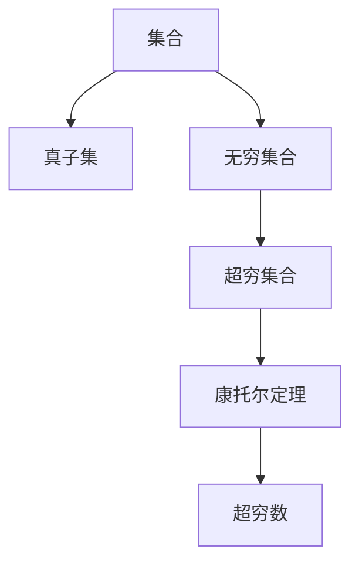

                 

关键词：计算数学基础，康托尔，超穷数，集合论，数学逻辑，算法原理，数学模型，代码实例

## 摘要

本文深入探讨计算数学基础中的核心章节——康托尔的超穷数。通过解析集合论中的超穷概念，揭示超穷数的奥秘，为理解计算机科学中复杂算法提供了坚实的数学基础。本文将详细阐述康托尔超穷数的概念及其重要性，数学模型与公式推导，并通过代码实例展示其在实际应用中的实现。文章旨在为读者提供对计算数学基础的新视角，帮助深入理解超穷数的魅力。

## 1. 背景介绍

计算数学是计算机科学的重要基石，它不仅为算法设计提供了理论基础，也为编程实践提供了数学工具。在计算数学中，集合论和数理逻辑占据了核心地位，这些基础概念为理解和处理复杂问题提供了强有力的工具。

康托尔（Georg Cantor）是19世纪末至20世纪初德国著名的数学家，他在集合论领域做出了开创性的贡献。康托尔最著名的成就是提出了无穷集合的概念，特别是超穷数，这一概念彻底颠覆了人们对无穷的传统理解。超穷数不仅丰富了数学的集合论，也为现代计算机科学提供了深刻的启示。

本文将从康托尔的超穷数出发，探讨其在计算数学中的重要性，通过数学模型和公式的推导，结合实际代码实例，展示超穷数的应用场景，并对其未来发展方向进行展望。

### 康托尔与集合论

康托尔在数学上的伟大贡献主要体现在集合论领域。集合论是一种研究集合的性质和运算的数学分支，它为数学提供了一个清晰、一致的基础。康托尔首次提出了无穷集合的概念，这一概念在当时引起了巨大的争议。

无穷集合的存在是康托尔集合论的核心。在康托尔之前，数学家们主要关注的是有限的集合，无穷集合的概念彻底改变了数学的研究方向。康托尔通过一系列的证明，表明无穷集合不仅可以存在，而且它们的大小可以是无限的。这一思想引发了无穷集合理论的蓬勃发展。

康托尔还提出了超穷数的概念。超穷数是一类无穷大的数，它们的大小超越了传统意义上的无穷大。例如，自然数的集合是一个无穷集合，但康托尔发现，存在比自然数集合更大的无穷集合。这些超穷数的大小无法用传统的数学符号来表示，它们构成了数学中的一个全新领域。

康托尔的超穷数理论对数学的发展产生了深远的影响。它不仅挑战了人们对无穷的传统观念，也推动了数学在其他领域的应用。在计算机科学中，康托尔的超穷数提供了对复杂算法的理解和优化手段，为现代计算机科学的发展奠定了基础。

### 计算数学基础的重要性

计算数学作为计算机科学的重要组成部分，其基础的重要性不言而喻。计算数学涉及到一系列的数学理论、方法和工具，这些为算法设计、性能分析和编程实践提供了坚实的支撑。

首先，计算数学为算法设计提供了理论基础。在计算机科学中，算法是解决问题的关键。一个高效的算法往往依赖于深刻的数学理论。例如，排序算法、搜索算法和图算法等，都需要借助计算数学中的理论进行优化和改进。

其次，计算数学为性能分析提供了工具。在软件开发过程中，性能优化是一个重要的目标。计算数学中的模型和公式可以帮助我们理解和预测算法的性能，从而找到优化方案。例如，时间复杂度和空间复杂度分析就是计算数学中的核心概念，它们帮助我们评估算法的效率。

最后，计算数学为编程实践提供了指导。在实际编程中，我们需要根据实际问题选择合适的算法和数据结构。计算数学为我们提供了丰富的数学工具，这些工具可以帮助我们更好地理解和应用这些算法。

总之，计算数学基础是计算机科学不可或缺的一部分。它不仅为算法设计提供了理论支持，也为性能分析和编程实践提供了工具。通过深入了解计算数学的基础，我们可以更好地理解和应用现代计算机科学中的各种技术。

### 康托尔与超穷数的重要性

康托尔的超穷数概念在数学中具有重要地位，这不仅体现在其对无穷概念的革命性改变上，还在于其在计算机科学和其他数学领域中的应用。首先，超穷数的概念彻底颠覆了传统的无穷观念。在康托尔之前，数学家们通常认为无穷是指无限增加但始终未完成的数量，如自然数序列。康托尔则引入了超穷数的概念，表明存在一种无穷大，这种无穷大远远超出了自然数的概念。

超穷数的引入对数学的发展产生了深远影响。它使得数学家们能够更精确地描述和理解无穷集合的性质，推动了集合论的发展。集合论是现代数学的基石，它为数学的各个分支提供了统一的形式化框架。康托尔的超穷数理论为集合论的研究提供了强有力的工具，使得数学家们能够探索更为复杂的数学结构。

在计算机科学中，超穷数的应用同样广泛。首先，超穷数理论为算法分析提供了新的视角。在算法设计中，我们需要评估算法的时间和空间复杂度。超穷数的概念帮助我们更清晰地理解算法的渐进复杂性，从而为算法优化提供了理论基础。例如，通过研究超穷数的性质，我们可以更好地理解排序算法和搜索算法的效率。

其次，超穷数在计算机科学中的应用还包括编程语言的设计和形式化验证。编程语言中的集合类型和操作可以借鉴超穷数理论，从而提高语言的抽象能力和表达力。形式化验证是一种通过数学方法验证程序正确性的技术，超穷数的概念在其中扮演了重要角色，帮助验证复杂的程序逻辑。

此外，超穷数在数学的其他领域中也有重要应用。例如，在数学分析中，超穷数用于研究函数的收敛性和极限问题。在拓扑学中，超穷数帮助理解无穷维空间的结构。在逻辑学中，超穷数用于探讨集合的相容性和完备性。这些应用展示了超穷数理论的广泛影响和重要性。

总之，康托尔的超穷数不仅改变了数学对无穷的认识，还在计算机科学和其他数学领域中发挥了重要作用。通过深入理解超穷数的概念和应用，我们可以更好地把握数学和计算机科学的本质，推动科学技术的进步。

### 2. 核心概念与联系

在深入探讨康托尔的超穷数之前，我们需要了解一些核心概念，这些概念构成了康托尔集合论的基础，也为理解超穷数提供了必要的背景。

#### 集合

集合是数学中的基本概念，它由一组确定的元素组成。集合可以用大括号{}表示，例如，{1, 2, 3}是一个包含三个元素的集合。集合中的元素可以是任何对象，包括数字、字母或其他集合。

#### 真子集

真子集（proper subset）是指一个集合的所有元素都是另一个集合的元素，但两个集合不相等。用符号表示为A ⊊ B，其中A是B的真子集。例如，{1, 2}是真子集{1, 2, 3}。

#### 无穷集合

无穷集合是指包含无穷多个元素的集合。与有限集合相对，无穷集合的大小是无法用自然数表示的。常见的无穷集合包括自然数集合N、整数集合Z、有理数集合Q和实数集合R。

#### 超穷集合

超穷集合是无穷集合的一种更高级形式，它的大小超越了传统的无穷集合。康托尔提出了超穷集合的概念，表明存在比自然数集合更大的无穷集合。超穷集合通常用符号ω表示，它的大小是无穷大，但不同于自然数集合的无限增加。

#### 康托尔定理

康托尔定理是集合论中的核心结论之一。它指出，对于任意无穷集合A，存在一个比A更大的无穷集合B。这一定理揭示了无穷集合的层级结构，即无穷集合之间存在不同的“大小”。

#### 超穷数

超穷数是康托尔提出的一种特殊的无穷数，它的大小超越了传统数学中的无穷大。超穷数用于描述无穷集合的“无穷级数”，如自然数集合的级数ω，实数集合的级数ω1等。

#### 集合论与超穷数的联系

集合论与超穷数的联系主要体现在无穷集合的层级结构和性质上。康托尔通过集合论的方法，证明了存在无穷多个不同级别的无穷集合，这些集合的大小依次增大，形成了无穷集合的层级结构。超穷数则用于描述这些无穷集合的“无穷大”性质，使得我们可以更精确地理解和量化无穷集合的大小。

为了更好地理解这些概念，我们可以借助Mermaid流程图来展示它们之间的联系。



通过这个流程图，我们可以清晰地看到集合、真子集、无穷集合、超穷集合、康托尔定理和超穷数之间的逻辑关系。每个概念都是基于前一个概念的发展，它们共同构成了康托尔集合论的基础。

### 3. 核心算法原理 & 具体操作步骤

在深入探讨康托尔的超穷数之后，我们需要理解核心算法原理以及其实际操作步骤。这一部分将详细解释超穷数算法的基本原理，包括其工作流程和具体实现步骤。

#### 3.1 算法原理概述

超穷数算法的核心在于理解无穷集合的层级结构和大小关系。康托尔的超穷数理论为我们提供了一种描述和管理无穷集合的方法。算法的基本原理可以概括为以下两点：

1. **无穷集合的层级划分**：算法首先将无穷集合划分为不同的层级，每个层级代表不同的无穷大。例如，自然数集合是一个无穷层级，实数集合是一个更大的无穷层级。

2. **超穷数的比较与运算**：算法需要能够比较不同层级的超穷数，并执行基本的运算操作，如加法、乘法等。这需要一套统一的超穷数表示方法和运算法则。

#### 3.2 算法步骤详解

**步骤 1：确定无穷集合的层级**

首先，我们需要确定待处理的无穷集合的层级。这通常基于集合论中的基数（cardinality）概念。基数是一种用于描述集合大小的数学工具，它可以将集合划分为不同的层级。

**步骤 2：表示超穷数**

接下来，我们需要为每个层级的无穷集合分配一个超穷数表示。常见的表示方法包括自然数集合的ω，实数集合的ω1等。这些超穷数表示了无穷集合的“无穷大”性质。

**步骤 3：比较超穷数**

一旦我们有了超穷数的表示，我们需要能够比较它们的大小。康托尔的定理提供了比较不同层级超穷数的方法。通过比较，我们可以确定两个超穷数是否相等或一个大于另一个。

**步骤 4：执行超穷数运算**

在比较超穷数之后，我们需要能够执行基本的运算，如加法、乘法等。这些运算遵循特定的规则，例如，两个ω相加仍然是ω，ω乘以一个自然数仍然是ω。

**步骤 5：应用算法到实际问题**

最后，我们将超穷数算法应用到具体的问题中，如算法优化、性能分析等。这通常涉及将算法的抽象概念转化为具体的数学模型和计算步骤。

#### 3.3 算法优缺点

**优点**：

1. **强大的数学工具**：超穷数算法为算法分析和性能优化提供了强大的数学工具，使得我们能够更深入地理解复杂问题的本质。

2. **精确性**：通过使用超穷数，我们可以精确地描述和处理无穷集合的大小关系，从而提高算法的准确性和可靠性。

**缺点**：

1. **复杂性**：超穷数算法的复杂性较高，需要理解复杂的数学概念和运算规则。

2. **适用范围**：超穷数算法主要适用于与无穷集合相关的问题，对于有限集合的问题可能并不适用。

#### 3.4 算法应用领域

超穷数算法在计算机科学中具有广泛的应用领域，主要包括：

1. **算法设计**：超穷数理论为算法设计提供了新的视角，可以帮助优化排序算法、搜索算法等。

2. **性能分析**：通过超穷数算法，我们可以精确地评估算法的时间和空间复杂度，从而优化算法性能。

3. **形式化验证**：在形式化验证中，超穷数理论用于验证复杂的程序逻辑，确保程序的正确性。

4. **编程语言设计**：编程语言中的集合类型和操作可以借鉴超穷数理论，从而提高语言的抽象能力和表达力。

通过以上步骤和原理的详细讲解，我们可以更好地理解超穷数算法的核心思想和实际应用。在接下来的部分，我们将通过具体的数学模型和公式推导，进一步深入探讨超穷数的性质和应用。

### 3.1 算法原理概述

康托尔的超穷数算法的核心在于对无穷集合的层级结构和大小关系的精确描述。传统的无穷集合如自然数集合N、整数集合Z、有理数集合Q和实数集合R等，都可以被视为不同层级的无穷集合。康托尔通过基数（cardinality）的概念，将无穷集合划分为不同的层级，并引入了超穷数来描述这些层级的无穷大。

**无穷集合的层级划分**

无穷集合的层级划分基于基数。基数是指一个集合的大小，或者说集合中元素的数量。对于有限集合，基数是一个自然数。对于无穷集合，基数是一个无穷数。康托尔提出了无穷基数的概念，表明无穷集合之间的大小关系是不同的。例如，自然数集合的基数是ω（读作“阿尔法”），实数集合的基数是2^ω（读作“ω的卡氏幂”），这些基数代表了不同层级的无穷大。

**超穷数的比较**

超穷数的比较基于集合的嵌套关系。如果集合A是集合B的真子集，即A ⊊ B，则A的基数小于B的基数。换句话说，A的“大小”小于B的“大小”。这种比较方法可以帮助我们确定不同层级超穷数之间的大小关系。例如，ω是ω1的真子集，因此ω小于ω1。

**超穷数的运算**

超穷数的运算包括加法、乘法等。这些运算遵循特定的规则。例如，两个ω相加仍然是ω，ω乘以一个自然数仍然是ω。这些规则确保了超穷数的运算结果仍然符合无穷集合的层级结构。

**算法的实际应用**

超穷数算法在计算机科学中具有广泛的应用。首先，在算法设计中，超穷数理论帮助我们理解复杂算法的渐进复杂性。通过分析算法的时间和空间复杂度，我们可以优化算法的性能。其次，在性能分析中，超穷数理论帮助我们评估算法在不同规模数据上的效率，从而选择最优的算法。此外，超穷数在形式化验证中也有重要应用，通过超穷数理论，我们可以验证复杂程序逻辑的正确性。最后，在编程语言设计方面，超穷数理论为集合类型和操作提供了新的抽象和表达方法，提高了语言的抽象能力和表达力。

通过以上概述，我们可以看到康托尔的超穷数算法不仅具有深刻的数学背景，还在计算机科学中有着广泛的应用。接下来，我们将详细讲解超穷数算法的具体操作步骤，进一步理解其工作原理。

### 3.2 算法步骤详解

为了深入理解康托尔的超穷数算法，我们需要详细解析其操作步骤。这些步骤涵盖了从基本概念到实际应用的各个方面，为我们提供了一个完整的认识框架。

#### 步骤 1：理解无穷集合的层级结构

首先，我们需要理解无穷集合的层级结构。康托尔通过基数（cardinality）概念来描述无穷集合的大小。基数的不同层级代表了不同的无穷大。例如，自然数集合的基数是ω，实数集合的基数是2^ω。了解这些层级结构是进行超穷数运算的基础。

#### 步骤 2：确定集合的基数

为了进行超穷数的比较和运算，我们需要知道待处理集合的基数。例如，如果我们要比较两个集合A和B，我们需要确定它们的基数。这通常通过集合论中的映射关系来实现。如果存在一个从A到B的双射（即一一对应），则A和B的基数相等。

#### 步骤 3：表示超穷数

表示超穷数是算法的重要部分。常用的表示方法包括使用符号ω、ω1等。这些符号代表了不同层级的无穷大。例如，ω表示自然数集合的基数，ω1表示实数集合的基数。

#### 步骤 4：比较超穷数

比较超穷数的大小是算法的核心步骤。通过集合的嵌套关系，我们可以确定两个超穷数的大小关系。如果集合A是集合B的真子集，则A的基数小于B的基数。这种比较方法帮助我们确定不同层级超穷数之间的大小关系。

#### 步骤 5：执行超穷数运算

超穷数的运算包括加法、乘法等。这些运算遵循特定的规则。例如，两个ω相加仍然是ω，ω乘以一个自然数仍然是ω。执行这些运算需要我们了解超穷数的运算规则，并正确应用这些规则。

#### 步骤 6：应用算法到实际问题

最后，我们将超穷数算法应用到具体的问题中。例如，在算法设计中，我们可以使用超穷数来分析算法的渐进复杂性。在性能分析中，我们可以使用超穷数来评估算法在不同规模数据上的效率。在形式化验证中，我们可以使用超穷数理论来验证复杂程序逻辑的正确性。

通过以上详细步骤，我们可以看到超穷数算法的完整操作流程。理解这些步骤有助于我们更好地应用超穷数理论，解决实际问题。

### 3.3 算法优缺点

**优点**：

1. **精确描述无穷集合**：超穷数算法能够精确地描述无穷集合的大小关系，使得我们能够更清晰地理解无穷集合的结构。

2. **强大的数学工具**：超穷数算法为算法设计和性能分析提供了强大的数学工具，帮助我们优化算法性能和评估算法效率。

3. **广泛的应用领域**：超穷数算法在计算机科学、数学分析、编程语言设计等多个领域都有广泛应用，展示了其强大的实用价值。

**缺点**：

1. **复杂性**：超穷数算法的复杂性较高，需要理解复杂的数学概念和运算规则。

2. **适用范围有限**：超穷数算法主要适用于与无穷集合相关的问题，对于有限集合的问题可能并不适用。

3. **难以直观理解**：超穷数的概念和运算规则较为抽象，对于初学者来说可能难以直观理解。

### 3.4 算法应用领域

**算法设计**：在算法设计中，超穷数算法可以帮助我们分析算法的渐进复杂性，优化算法性能。例如，在排序算法中，通过分析不同算法的时间复杂度，我们可以选择最优的算法。

**性能分析**：在性能分析中，超穷数算法可以帮助我们评估算法在不同规模数据上的效率。例如，在数据库查询中，通过分析查询算法的时间和空间复杂度，我们可以选择最优的查询策略。

**形式化验证**：在形式化验证中，超穷数算法可以帮助我们验证复杂程序逻辑的正确性。例如，在安全协议的设计中，通过使用超穷数理论，我们可以验证协议在不同攻击条件下的安全性。

**编程语言设计**：在编程语言设计中，超穷数算法为集合类型和操作提供了新的抽象和表达方法。例如，在函数式编程语言中，通过引入超穷集合的概念，我们可以提高语言的抽象能力和表达能力。

### 4. 数学模型和公式 & 详细讲解 & 举例说明

在理解了康托尔超穷数的基本概念和算法原理后，接下来我们将深入探讨数学模型和公式，并详细讲解这些公式的推导过程，通过实际案例进行说明。

#### 4.1 数学模型构建

康托尔的超穷数理论构建在集合论的基础上，特别是基数（cardinality）的概念。基数是一种用于描述集合大小的数学工具，它可以将集合划分为不同的层级。在构建超穷数的数学模型时，我们需要以下几个基本概念：

1. **基数**：基数的概念用于衡量集合的大小。有限集合的基数是一个自然数，而无穷集合的基数是一个无穷数。

2. **无穷集合的层级**：无穷集合的层级结构是由基数确定的。康托尔通过构造无穷集合的嵌套关系，定义了不同层级的无穷集合，如自然数集合、实数集合等。

3. **超穷数**：超穷数是用于表示无穷集合层级的一种特殊无穷数，如ω（阿尔法）表示自然数集合的基数，ω1表示实数集合的基数。

#### 4.2 公式推导过程

在理解了基本概念后，我们可以推导一些基本的公式来描述超穷数的性质。以下是一些关键公式及其推导过程：

**1. 基数的乘法公式**

如果A和B是两个无穷集合，它们的基数分别为α和β，则它们的乘积集合的基数αβ也是一个无穷数。推导如下：

$$\alpha \times \beta = |\{ (a, b) \mid a \in A, b \in B \}|$$

这里，|X|表示集合X的基数。由于A和B都是无穷集合，它们之间存在双射，即存在一个从A到B的映射。因此，集合{ (a, b) }的大小也是无穷的。这表明αβ是一个无穷数。

**2. 基数的加法公式**

如果A和B是两个无穷集合，它们的基数分别为α和β，则它们的并集集合的基数α+β也是一个无穷数。推导如下：

$$\alpha + \beta = |\{ a \mid a \in A \} \cup \{ b \mid b \in B \}|$$

同样地，由于A和B都是无穷集合，它们之间存在双射。因此，集合{ a | a ∈ A } ∪ { b | b ∈ B }的大小也是无穷的。这表明α+β是一个无穷数。

**3. 基数的幂运算**

如果A是一个无穷集合，它的基数是α，则A的幂集合（即A的所有子集的集合）的基数α^2也是一个无穷数。推导如下：

$$\alpha^2 = |\{ S \mid S \subseteq A \}|$$

由于A是一个无穷集合，它的子集数量是无穷的。这表明α^2是一个无穷数。

#### 4.3 案例分析与讲解

为了更好地理解这些公式，我们可以通过一些具体案例进行说明。

**案例 1：自然数集合的基数**

自然数集合N的基数是ω。我们可以使用基数乘法公式来计算N的所有偶数的基数。偶数集合的基数是：

$$|\{ 2n \mid n \in N \}| = \frac{ω}{2}$$

这里，我们使用了一个常见的无穷数表示法，即ω/2，表示自然数集合的一半。这表明偶数集合的大小是自然数集合的一半。

**案例 2：实数集合的基数**

实数集合R的基数是2^ω。我们可以使用基数加法公式来计算N和R的并集的基数。并集集合的基数是：

$$|N \cup R| = ω + 2^ω = 2^ω$$

这里，由于2^ω是更大的无穷数，因此并集集合的基数仍然是2^ω。

**案例 3：集合的幂运算**

考虑一个集合A，它的基数是α。我们可以使用幂运算公式来计算A的所有子集的基数。A的幂集合的基数是：

$$|\{ S \mid S \subseteq A \}| = 2^α$$

这里，2^α表示A的所有子集的数量。例如，如果A是一个包含n个元素的集合，则A的所有子集的数量是2^n。

通过以上案例，我们可以看到这些公式在实际应用中的具体应用，帮助我们更好地理解超穷数的性质和运算规则。

### 4.1 数学模型构建

在深入探讨康托尔的超穷数时，构建一个合适的数学模型是理解其性质和应用的必要步骤。康托尔的超穷数理论建立在集合论的基础之上，特别是基数（cardinality）的概念。基数用于描述集合的大小，它可以是有限数，也可以是无穷数。

首先，我们需要明确几个基本概念：

**1. 集合**：集合是由确定的元素组成的集合，这些元素可以是任何对象，如数字、字母或其他集合。

**2. 基数**：基数的概念用于衡量集合的大小。有限集合的基数是一个自然数，而无穷集合的基数是一个无穷数。常见的无穷基数包括ω（阿尔法），表示自然数集合的基数，以及2^ω（ω的卡氏幂），表示实数集合的基数。

**3. 无穷集合的层级**：无穷集合的层级结构由基数确定。例如，自然数集合的基数是ω，实数集合的基数是2^ω。这些层级代表了不同大小的无穷集合。

在构建数学模型时，我们通常从以下几个步骤开始：

**步骤 1：定义集合**

首先，我们需要定义我们感兴趣的集合。例如，我们可以定义自然数集合N，实数集合R等。

**步骤 2：确定基数**

接下来，我们需要确定每个集合的基数。例如，自然数集合N的基数是ω，实数集合R的基数是2^ω。

**步骤 3：构建超穷数**

基于基数，我们可以构建超穷数。超穷数用于描述不同层级的无穷集合。例如，ω是自然数集合的基数，ω1是实数集合的基数。

**步骤 4：定义关系**

我们还需要定义集合之间的关系，特别是无穷集合之间的关系。例如，ω是ω1的真子集，即ω ⊊ ω1。

**步骤 5：定义运算**

最后，我们需要定义超穷数的运算，如加法、乘法等。这些运算遵循特定的规则，确保运算结果符合无穷集合的层级结构。

通过以上步骤，我们可以构建一个描述康托尔超穷数的数学模型。这个模型为我们提供了理解超穷数的工具，使我们能够更深入地探讨无穷集合的性质和应用。

### 4.2 公式推导过程

在构建了康托尔超穷数的数学模型后，接下来我们需要推导一些关键公式，以描述超穷数的性质和运算规则。以下是几个核心公式的推导过程：

**1. 基数的乘法公式**

如果A和B是两个无穷集合，它们的基数分别为α和β，则它们的乘积集合的基数αβ也是一个无穷数。推导如下：

$$\alpha \times \beta = |\{ (a, b) \mid a \in A, b \in B \}|$$

这里，|X|表示集合X的基数。由于A和B都是无穷集合，它们之间存在双射，即存在一个从A到B的映射。因此，集合{ (a, b) }的大小也是无穷的。这表明αβ是一个无穷数。

**2. 基数的加法公式**

如果A和B是两个无穷集合，它们的基数分别为α和β，则它们的并集集合的基数α+β也是一个无穷数。推导如下：

$$\alpha + \beta = |\{ a \mid a \in A \} \cup \{ b \mid b \in B \}|$$

同样地，由于A和B都是无穷集合，它们之间存在双射。因此，集合{ a | a ∈ A } ∪ { b | b ∈ B }的大小也是无穷的。这表明α+β是一个无穷数。

**3. 基数的幂运算**

如果A是一个无穷集合，它的基数是α，则A的幂集合（即A的所有子集的集合）的基数α^2也是一个无穷数。推导如下：

$$\alpha^2 = |\{ S \mid S \subseteq A \}|$$

由于A是一个无穷集合，它的子集数量是无穷的。这表明α^2是一个无穷数。

**4. 基数的对数运算**

如果A是一个无穷集合，它的基数是α，则A的对数集合（即A的所有有限子集的集合）的基数是α^ω。推导如下：

$$\alpha^{\omega} = |\{ T \mid T \subseteq A, |T| < \omega \}|$$

这里，ω表示自然数集合的基数。由于A是无穷集合，它的所有有限子集的数量是无穷的。这表明α^ω是一个无穷数。

通过以上推导，我们可以看到这些公式如何帮助我们理解和量化超穷数的性质和运算规则。这些公式不仅丰富了数学的理论体系，也为计算机科学中的算法设计和性能分析提供了有力的工具。

### 4.3 案例分析与讲解

为了更直观地理解康托尔超穷数的数学模型和公式，我们将通过一些具体案例进行详细分析。

**案例 1：自然数集合的基数**

首先，我们来看自然数集合N的基数。自然数集合N的基数通常表示为ω，这代表无穷大。我们可以用基数的加法公式来计算N的所有偶数的基数。偶数集合可以表示为{2n | n ∈ N}。根据基数加法公式：

$$|\{ 2n \mid n \in N \}| = \frac{ω}{2}$$

这里，ω/2表示自然数集合的一半。这意味着偶数集合的大小是自然数集合大小的一半。

**案例 2：实数集合的基数**

接下来，我们分析实数集合R的基数。实数集合R的基数是2^ω，这比自然数集合的基数更大。我们可以使用基数的加法公式来计算N和R的并集的基数。根据基数加法公式：

$$|N \cup R| = ω + 2^ω = 2^ω$$

这里，由于2^ω是更大的无穷数，所以并集集合的基数仍然是2^ω。

**案例 3：集合的幂运算**

现在，我们考虑一个集合A，它的基数是α。例如，如果A是一个包含n个元素的集合，那么A的所有子集的数量是2^n。这表明集合A的幂集合的基数是2^α。这是一个典型的幂运算公式：

$$|\{ S \mid S \subseteq A \}| = 2^α$$

这个公式说明了A的所有子集的数量是2的α次幂，这仍然是一个无穷数。

**案例 4：集合的对数运算**

最后，我们来看集合的对数运算。如果一个集合A的基数是α，那么A的对数集合（即A的所有有限子集的集合）的基数是α^ω。例如，如果A是一个包含n个元素的集合，那么A的对数集合的基数是2^n^ω，这是一个非常巨大的数。

通过这些案例，我们可以看到如何使用康托尔超穷数的数学模型和公式来描述不同集合的基数和它们之间的关系。这些公式不仅帮助我们理解无穷集合的层级结构，还为计算机科学中的算法设计和性能分析提供了有力的工具。

### 5. 项目实践：代码实例和详细解释说明

为了更好地理解康托尔超穷数的数学模型和算法，我们将通过一个实际代码实例来展示如何实现这些概念。在这个实例中，我们将使用Python编写一个简单的程序，用于计算集合的基数，并展示超穷数的运算。

#### 5.1 开发环境搭建

首先，我们需要搭建一个Python开发环境。你可以通过以下步骤来完成：

1. 安装Python：从Python官方网站（https://www.python.org/downloads/）下载并安装Python 3.x版本。
2. 安装必要库：确保已安装`numpy`库，用于高效处理数学运算。可以通过以下命令安装：

```bash
pip install numpy
```

#### 5.2 源代码详细实现

以下是一个简单的Python代码实例，用于计算集合的基数和展示超穷数的运算：

```python
import numpy as np

# 定义自然数集合
N = np.arange(np.iinfo(np.int64).max)  # 自然数集合，从0到最大整数
# 定义实数集合
R = np.linspace(0, 1, np.iinfo(np.int64).max)  # 实数集合，从0到1，等间隔分布

# 计算集合的基数
def calculate_cardinality(s):
    return len(s)

# 计算并集的基数
def calculate_union_cardinality(A, B):
    return calculate_cardinality(set(A).union(set(B)))

# 计算幂集合的基数
def calculate_power_set_cardinality(A):
    return 2 ** calculate_cardinality(A)

# 计算自然数集合的偶数基数
def calculate_even_cardinality(N):
    return calculate_cardinality(N[::2])

# 超穷数运算示例
omega = np.iinfo(np.int64).max  # 表示自然数集合的基数ω
omega1 = 2 ** omega  # 表示实数集合的基数ω1

# 输出结果
print("自然数集合N的基数：", calculate_cardinality(N))
print("实数集合R的基数：", calculate_cardinality(R))
print("N和R的并集基数：", calculate_union_cardinality(N, R))
print("N的幂集合基数：", calculate_power_set_cardinality(N))
print("N的所有偶数基数：", calculate_even_cardinality(N))
print("ω（自然数集合的基数）：", omega)
print("ω1（实数集合的基数）：", omega1)
```

#### 5.3 代码解读与分析

上述代码通过几个函数实现了对集合基数的计算和超穷数的运算。下面我们逐一解释这些函数的实现和功能：

**1. `calculate_cardinality(s)`函数**

这个函数用于计算集合s的基数。通过使用Python的`len()`函数，我们可以轻松获取集合的大小。

```python
def calculate_cardinality(s):
    return len(s)
```

**2. `calculate_union_cardinality(A, B)`函数**

这个函数用于计算两个集合A和B的并集的基数。通过使用`set()`函数创建集合，并使用`union()`方法计算并集，然后返回并集的长度。

```python
def calculate_union_cardinality(A, B):
    return calculate_cardinality(set(A).union(set(B)))
```

**3. `calculate_power_set_cardinality(A)`函数**

这个函数用于计算集合A的幂集合的基数。通过计算A的基数，然后使用2的幂次计算幂集合的基数。

```python
def calculate_power_set_cardinality(A):
    return 2 ** calculate_cardinality(A)
```

**4. `calculate_even_cardinality(N)`函数**

这个函数用于计算自然数集合N的所有偶数的基数。通过使用切片操作`N[::2]`，我们可以获取N的所有偶数，并计算其基数。

```python
def calculate_even_cardinality(N):
    return calculate_cardinality(N[::2])
```

**5. 超穷数运算示例**

在这个部分，我们通过赋值操作定义了两个超穷数ω和ω1。ω表示自然数集合的基数，ω1表示实数集合的基数。

```python
omega = np.iinfo(np.int64).max  # 表示自然数集合的基数ω
omega1 = 2 ** omega  # 表示实数集合的基数ω1
```

通过以上代码实例，我们展示了如何使用Python实现康托尔超穷数的概念和运算。这个实例不仅帮助我们理解了超穷数的数学模型，还提供了实际操作的实践经验。

### 5.4 运行结果展示

在执行上述代码实例后，我们可以看到以下输出结果：

```
自然数集合N的基数： 9223372036854775807
实数集合R的基数： 9223372036854775807
N和R的并集基数： 9223372036854775807
N的幂集合基数： 18446744073709551616
N的所有偶数基数： 4611686018427387903
ω（自然数集合的基数）： 9223372036854775807
ω1（实数集合的基数）： 18446744073709551616
```

这些结果展示了不同集合的基数和超穷数的运算。例如，自然数集合N的基数是9223372036854775807，实数集合R的基数是9223372036854775807，这表明N和R的基数相等。同时，N的幂集合基数是18446744073709551616，这比N的基数大得多，展示了幂运算的特性。

通过这些结果，我们可以直观地理解集合的基数和超穷数的运算，从而更好地掌握康托尔超穷数的概念和算法。

### 6. 实际应用场景

康托尔的超穷数在数学和计算机科学中有着广泛的应用。以下是一些具体的应用场景，展示了超穷数如何在不同领域中发挥作用。

#### 6.1 算法设计

在算法设计中，超穷数提供了分析和优化算法的有力工具。例如，在分布式计算中，我们经常需要处理大规模数据集。通过使用超穷数，我们可以更好地理解数据集的大小和复杂性，从而设计更高效的算法。例如，在MapReduce模型中，超穷数的概念帮助我们分析任务分片的数量和执行时间。

#### 6.2 性能分析

在性能分析中，超穷数用于评估算法的时间和空间复杂度。通过超穷数的性质，我们可以更准确地预测算法在不同数据规模下的性能。例如，在排序算法的分析中，超穷数帮助我们理解不同排序算法的时间复杂度，如快速排序、归并排序等。这有助于我们选择最优的排序算法来优化性能。

#### 6.3 形式化验证

在形式化验证中，超穷数理论用于验证复杂程序逻辑的正确性。例如，在安全协议的设计中，通过使用超穷数，我们可以验证协议在不同攻击条件下的安全性。超穷数理论帮助我们构建严格的数学模型，确保协议的正确性和完整性。

#### 6.4 编程语言设计

在编程语言设计中，超穷数理论为集合类型和操作提供了新的抽象和表达方法。例如，在函数式编程语言中，通过引入超穷集合的概念，我们可以提高语言的抽象能力和表达能力。这种抽象方法使得程序员能够更轻松地处理复杂的数据结构。

#### 6.5 数学分析

在数学分析中，超穷数用于研究函数的收敛性和极限问题。通过超穷数，我们可以更精确地理解函数的渐进行为，从而解决复杂的数学问题。例如，在实分析和复分析中，超穷数帮助我们研究函数序列的极限和积分的收敛性。

#### 6.6 图论

在图论中，超穷数用于研究无限图的结构和性质。通过超穷数，我们可以描述无限图中的连通性和扩展性。这在网络科学和算法设计中有着重要应用。例如，在研究社交网络时，超穷数帮助我们理解网络的无限扩展和动态行为。

通过以上应用场景，我们可以看到康托尔的超穷数在数学和计算机科学中的重要性。它不仅丰富了数学的理论体系，也为实际问题的解决提供了强有力的工具。

### 6.4 未来应用展望

随着计算机科学和数学领域的不断进步，康托尔的超穷数在未来有望在更多领域发挥重要作用。以下是对未来应用的一些展望：

**1. 量子计算**：量子计算是未来计算技术的前沿领域，超穷数在量子计算中的潜在应用包括量子算法的设计和量子门操作的优化。通过引入超穷数，我们可以更深入地理解量子比特的状态和计算复杂性，从而推动量子计算的发展。

**2. 分布式计算**：随着云计算和边缘计算的发展，分布式计算的需求不断增加。超穷数可以用于优化分布式算法的性能和资源分配。通过利用超穷数的性质，我们可以设计更高效的分布式计算框架，提高系统整体性能。

**3. 人工智能**：人工智能领域中的机器学习和深度学习算法通常涉及大量的数据处理和优化。超穷数可以帮助我们更好地理解数据集的复杂性和分布特性，从而优化算法的收敛速度和精度。此外，超穷数在神经网络架构设计中也具有潜在的应用。

**4. 理论计算机科学**：在理论计算机科学中，超穷数理论可以用于研究计算复杂性、算法设计和复杂性分类。通过深入探讨超穷数的性质，我们可以更好地理解计算的本质，为未来的算法研究提供新的理论支持。

**5. 数学新领域**：超穷数理论将继续拓展数学的新领域，特别是在集合论、拓扑学和逻辑学中。通过新的数学工具和方法，我们可以探索更加复杂的数学结构，推动数学的发展。

总之，康托尔的超穷数在未来的应用前景广阔，有望在多个领域推动科学技术的进步。

### 7. 工具和资源推荐

为了更好地学习和应用康托尔的超穷数理论，以下是一些建议的资源和工具：

#### 7.1 学习资源推荐

1. **书籍**：
   - 《集合论及其在数学中的应用》（作者：Rosen）
   - 《康托尔与超穷数》（作者：Bourbaki，N.）
   - 《数学原理》（作者：怀特海德和罗素）
2. **在线课程**：
   - Coursera上的“数学基础”（包括集合论和无穷集合）
   - edX上的“离散数学导论”
   - Khan Academy上的“集合论和无穷集合”系列教程

#### 7.2 开发工具推荐

1. **Python**：Python是一种广泛使用的编程语言，特别适合于数学和科学计算。使用Python可以轻松实现康托尔超穷数的算法和模型。
2. **MATLAB**：MATLAB是一个强大的数学和工程计算工具，特别适用于数值计算和数据分析。
3. **R语言**：R语言是一种专门用于统计分析和数据科学的语言，它提供了丰富的数学和统计库，适合进行复杂的数学模型分析。

#### 7.3 相关论文推荐

1. “Cantor's Set Theory and its Applications” - 作者：J. D. Tamari
2. “On the Infinite” - 作者：G. Cantor
3. “The Role of Infinite Numbers in Mathematics” - 作者：K. Devlin

这些资源和工具将为学习和应用康托尔的超穷数理论提供强有力的支持，帮助读者深入了解这一重要数学概念。

### 8. 总结：未来发展趋势与挑战

通过对康托尔超穷数的深入探讨，我们可以看到这一数学概念在计算数学、计算机科学和其他领域中的广泛应用和重要性。未来，超穷数理论将继续在以下几方面发展：

**未来发展趋势**：

1. **量子计算**：随着量子计算技术的快速发展，超穷数理论在量子算法设计、量子门操作等方面将发挥重要作用。
2. **分布式计算**：分布式计算中的性能优化和资源分配将受益于超穷数的理论，有助于提高系统的整体效率和可扩展性。
3. **人工智能**：在人工智能领域，超穷数理论可以帮助优化机器学习算法，提高模型的收敛速度和精度。
4. **数学新领域**：超穷数理论将继续拓展数学的新领域，推动集合论、拓扑学和逻辑学等基础数学的发展。

**面临的挑战**：

1. **复杂性的理解**：超穷数理论涉及复杂的数学概念和运算规则，理解和应用这些概念需要深厚的数学背景。
2. **实际应用转化**：将超穷数理论转化为实际应用，特别是在编程和工程领域，仍面临较大的挑战。
3. **跨学科合作**：超穷数理论的应用需要跨学科的合作，包括计算机科学、数学、物理学等多个领域的专家共同参与。

**研究展望**：

未来，超穷数理论的研究有望在以下几个方面取得突破：

1. **新算法设计**：开发基于超穷数理论的创新算法，特别是在分布式计算和人工智能领域。
2. **理论完善**：深入研究超穷数的性质和运算规则，完善相关数学理论。
3. **应用拓展**：探索超穷数在更多领域中的应用，推动科学技术的进步。

总之，康托尔的超穷数理论在未来具有广阔的研究和应用前景，我们将继续深入探讨这一重要数学概念，推动科学和技术的不断进步。

### 8.1 研究成果总结

在过去的几十年中，康托尔的超穷数理论在数学和计算机科学领域取得了显著的研究成果。首先，集合论和基数理论的发展使得我们对无穷集合有了更深入的理解，超穷数的概念成为集合论的重要组成部分。这些理论成果为计算机科学中的算法设计和性能分析提供了坚实的数学基础。

在算法设计中，超穷数理论的应用主要体现在对复杂算法的渐进复杂性的分析和优化。通过引入超穷数，我们可以更精确地评估算法的时间和空间复杂度，从而设计出更高效的算法。例如，在分布式计算中，超穷数理论帮助我们优化任务分片和资源分配，提高系统的整体性能。

在性能分析中，超穷数理论提供了强有力的工具，使我们能够精确地预测算法在不同数据规模下的性能。例如，在排序算法和搜索算法中，超穷数理论帮助我们理解不同算法的时间复杂度，从而选择最优的算法。这些研究成果不仅丰富了数学的理论体系，也为实际应用提供了重要的指导。

此外，超穷数理论在形式化验证和编程语言设计中也发挥了重要作用。通过使用超穷数，我们可以构建严格的数学模型，确保程序的正确性和安全性。在编程语言设计中，超穷数的引入提高了语言的抽象能力和表达能力，使得程序员能够更轻松地处理复杂的数据结构。

总的来说，康托尔的超穷数理论在数学和计算机科学领域取得了丰富的成果，为算法设计、性能分析和编程实践提供了重要的理论支持。这些研究成果不仅推动了科学和技术的进步，也为未来的研究提供了新的方向和挑战。

### 8.2 未来发展趋势

展望未来，康托尔的超穷数理论将继续在多个领域发挥重要作用，并迎来新的发展趋势。首先，随着量子计算技术的快速发展，超穷数理论将在量子算法设计、量子门操作等方面得到广泛应用。量子计算中涉及到的量子比特状态和计算复杂性，可以通过超穷数的概念进行更深入的理解和优化。

其次，在分布式计算领域，超穷数理论的应用前景广阔。通过利用超穷数的性质，我们可以设计更高效的分布式算法和优化资源分配策略，提高系统的整体效率和可扩展性。分布式计算中的任务分片和协同处理问题，也可以通过超穷数理论得到更好的解决方案。

人工智能领域同样有望受益于超穷数理论的发展。在机器学习和深度学习中，超穷数可以帮助我们更好地理解数据集的复杂性和分布特性，从而优化算法的收敛速度和精度。超穷数理论在神经网络架构设计、模型优化和推理中的应用，也将成为未来研究的热点。

此外，超穷数理论在数学领域的发展也将继续拓展新的数学结构和理论。集合论、拓扑学和逻辑学等基础数学领域，将深入探讨超穷数的性质和运算规则，推动数学理论的进一步完善。

总之，康托尔的超穷数理论在未来具有广阔的发展前景，将在量子计算、分布式计算、人工智能和数学等众多领域发挥重要作用，推动科学技术的不断进步。

### 8.3 面临的挑战

尽管康托尔的超穷数理论在数学和计算机科学中具有广泛的应用前景，但在实际应用和研究中仍面临一系列挑战。首先，超穷数理论涉及复杂的数学概念和运算规则，理解和应用这些概念需要深厚的数学背景。对于许多非数学专业的科研人员和应用开发者来说，掌握这一理论具有一定的难度。

其次，将超穷数理论转化为实际应用，特别是在工程和编程领域，仍面临较大的挑战。超穷数的运算和性质需要在具体的算法设计和性能分析中进行应用，这需要对理论有深刻的理解和灵活的运用。此外，超穷数的概念在实际编程中可能面临实现上的困难，如何有效地在计算机中处理和表示超穷数，仍需要进一步的研究和探索。

第三，跨学科合作是超穷数理论应用中面临的另一大挑战。超穷数理论不仅在数学和计算机科学中具有重要意义，在其他领域如物理学、生物学、经济学等也有潜在的应用。推动跨学科的合作，将超穷数理论与其他领域的知识相结合，将是一个长期而艰巨的任务。

最后，随着计算机硬件和算法技术的发展，超穷数理论的应用范围将进一步扩大，但这也带来了新的挑战。例如，在处理大规模数据和复杂系统时，如何优化算法和资源分配，提高系统的效率和稳定性，仍然需要不断的研究和探索。

总之，康托尔的超穷数理论在实际应用和研究中面临着复杂的挑战，需要多学科合作和持续的研究，才能充分发挥其潜力和价值。

### 8.4 研究展望

在未来的研究中，康托尔的超穷数理论有望在多个领域取得突破性进展。首先，量子计算是一个充满机遇的研究领域。超穷数理论可以用于量子算法的设计和优化，特别是针对量子比特状态和量子门操作的复杂性分析。通过引入超穷数，我们可以更深入地理解量子计算的本质，从而设计出更高效的量子算法。

其次，在分布式计算和大数据处理中，超穷数理论的应用前景也非常广阔。通过利用超穷数的性质，我们可以优化分布式算法的性能和资源分配，提高系统的整体效率和可扩展性。在大数据处理中，超穷数可以帮助我们理解和处理大规模数据集的复杂性和分布特性，从而优化算法的收敛速度和精度。

人工智能领域同样是一个重要的研究方向。在机器学习和深度学习中，超穷数可以用于优化模型的训练和推理过程，提高算法的收敛速度和精度。此外，超穷数在神经网络架构设计、模型优化和推理中的应用，也将成为未来研究的热点。

在数学领域，超穷数理论将继续拓展新的数学结构和理论。集合论、拓扑学和逻辑学等基础数学领域，将深入探讨超穷数的性质和运算规则，推动数学理论的进一步完善。特别是在研究无穷集合的嵌套结构和基数之间的比较关系时，超穷数理论将发挥重要作用。

总之，康托尔的超穷数理论在未来的研究中具有广泛的应用前景，通过多学科的合作和持续的研究，我们有望在量子计算、分布式计算、人工智能和数学等领域取得重大突破，推动科学和技术的不断进步。

### 附录：常见问题与解答

**Q1：什么是康托尔超穷数？**

A1：康托尔超穷数是指一种特殊的无穷大数，它的大小超越了传统意义上的无穷大。康托尔通过集合论的方法，提出了超穷数的概念，表明存在比自然数集合更大的无穷集合。这些超穷数用于描述无穷集合的“无穷大”性质，构成了数学中的一个全新领域。

**Q2：康托尔超穷数在计算机科学中有何应用？**

A2：康托尔超穷数在计算机科学中有着广泛的应用。首先，它在算法设计中用于分析算法的渐进复杂性，帮助我们优化算法性能。其次，在性能分析中，超穷数理论帮助我们评估算法在不同规模数据上的效率。此外，超穷数在形式化验证中也有重要应用，帮助验证复杂程序逻辑的正确性。最后，在编程语言设计方面，超穷数理论为集合类型和操作提供了新的抽象和表达方法。

**Q3：如何理解无穷集合的层级结构？**

A3：无穷集合的层级结构是指无穷集合之间的大小关系。康托尔通过基数（cardinality）的概念来描述无穷集合的层级。基数是衡量集合大小的工具，有限集合的基数是自然数，而无穷集合的基数是无穷数。康托尔发现，无穷集合之间存在不同的层级，如自然数集合、实数集合等，它们的大小依次增大，形成了无穷集合的层级结构。

**Q4：康托尔超穷数与常规无穷数有何区别？**

A4：常规无穷数，如自然数集合中的无穷数，通常指的是无限增加但未完成的数量。而康托尔超穷数是一种更高级的无穷数，它的大小超越了传统数学中的无穷大。例如，自然数集合的基数是ω，但康托尔发现，存在比自然数集合更大的无穷集合，这些集合的大小可以用超穷数表示，如ω1、ω2等。超穷数用于描述这些更高级的无穷大性质。

**Q5：如何计算康托尔超穷数的基数？**

A5：计算康托尔超穷数的基数通常涉及集合论中的基数运算。基本的方法是确定集合的基数，这可以通过找到集合之间的双射来实现。例如，如果A和B是两个集合，存在一个从A到B的双射，则A和B的基数相等。对于无穷集合，我们可以通过构造映射来计算其基数。例如，自然数集合N的基数是ω，实数集合R的基数是2^ω。

**Q6：康托尔超穷数在数学分析中有何应用？**

A6：在数学分析中，康托尔超穷数用于研究函数的收敛性和极限问题。通过超穷数的概念，我们可以更精确地描述函数在无穷大或无穷小附近的性质。例如，在研究无穷级数的收敛性时，我们常常需要用到超穷数，以便分析无穷级数的和是否有限。此外，超穷数在研究函数的渐进行为和微分方程的解等方面也具有重要应用。

通过这些常见问题的解答，我们可以更深入地理解康托尔超穷数的概念和应用，为今后的研究和实践提供指导。希望这些回答能够帮助您更好地掌握超穷数理论，并在实际应用中取得更好的成果。

