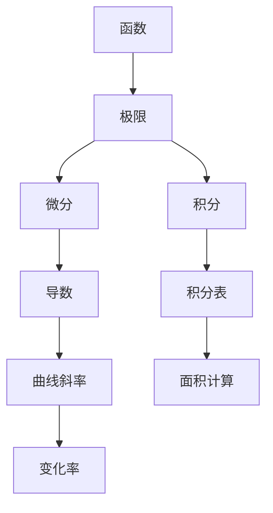

                 

关键词：微积分、数学基础、微积分发明、函数、极限、微分、积分、数学原理、算法、应用领域、发展历程。

## 摘要

本文将深入探讨微积分的数学基础及其发明过程。微积分是数学中的一个重要分支，它在物理、工程、经济学等多个领域中有着广泛的应用。本文首先介绍了微积分的基本概念，如函数、极限、微分和积分，并详细讲解了它们的数学原理。接着，本文回顾了微积分的发展历程，从古希腊的数学思想到牛顿和莱布尼茨的发明，再到现代数学的应用。最后，本文探讨了微积分在各个领域的应用，并展望了未来的发展趋势和挑战。

## 1. 背景介绍

### 数学的基础

数学是一门研究数量、结构、变化和空间等概念的学科。它不仅是一门抽象的学科，也是许多科学和工程领域的基础。数学的基础可以追溯到古希腊时期，当时的数学家们开始研究几何、算术和代数等基本概念。随着时间的发展，数学逐渐形成了自己的体系，并不断拓展其应用领域。

### 微积分的起源

微积分是数学中的一个重要分支，起源于对变化和运动的研究。在古希腊时期，数学家们已经开始探讨几何和物理中的问题，例如阿基米德研究了面积和体积的计算，欧几里得则研究了平面几何的基本性质。然而，直到17世纪，微积分才真正形成。

在17世纪，牛顿和莱布尼茨分别独立发明了微积分，这一发明对数学和科学的发展产生了深远的影响。微积分的核心思想是研究如何通过无限小的增量来计算无限大的总量，从而解决许多实际问题。

## 2. 核心概念与联系

### 函数

函数是数学中最基本的概念之一。函数是一个将输入映射到输出的规则或关系。在数学中，我们通常用\( f(x) \)来表示一个函数，其中\( x \)是输入，\( f(x) \)是输出。

### 极限

极限是微积分中的基础概念之一。极限描述了一个函数在某个点附近的行为。形式上，函数\( f(x) \)在点\( a \)的极限是\( L \)，表示当\( x \)接近\( a \)时，\( f(x) \)的值越来越接近\( L \)。

### 微分

微分是研究函数变化率的方法。函数\( f(x) \)在点\( x \)的导数表示为\( f'(x) \)，它描述了\( f(x) \)在\( x \)点处的瞬时变化率。

### 积分

积分是微分的反操作。函数\( f(x) \)的不定积分表示为\( F(x) \)，其中\( F'(x) = f(x) \)。积分可以用来计算函数的面积、体积等。

### 核心概念联系

这些核心概念相互联系，构成了微积分的基础。函数描述了输入和输出之间的关系，极限提供了函数在某一点附近的行为，微分和积分则分别描述了函数的变化率和累积。

### Mermaid 流程图

下面是一个描述微积分核心概念之间联系的 Mermaid 流程图：



## 3. 核心算法原理 & 具体操作步骤

### 3.1 算法原理概述

微积分的核心算法包括微分和积分。微分用于计算函数的瞬时变化率，而积分用于计算函数的累积总量。

#### 微分

微分的原理是通过极限来计算函数的瞬时变化率。具体步骤如下：

1. 确定函数\( f(x) \)和需要计算的点\( x \)。
2. 取一个趋近于0的增量\( h \)。
3. 计算增量\( f(x+h) - f(x) \)。
4. 计算极限\( \lim_{h \to 0} \frac{f(x+h) - f(x)}{h} \)。

#### 积分

积分的原理是通过无限细分和累积来计算函数的总量。具体步骤如下：

1. 确定函数\( f(x) \)和积分区间\[a, b]。
2. 将区间\[a, b]划分为n个小区间，每个小区间的长度为\( \Delta x \)。
3. 计算每个小区间上的函数值\( f(x_i) \)。
4. 计算每个小区间上的矩面积\( f(x_i) \Delta x \)。
5. 计算所有矩面积的累加和，即积分值\( \int_{a}^{b} f(x) dx \)。

### 3.2 算法步骤详解

下面是微积分算法的具体步骤：

#### 微分步骤

1. 给定函数\( f(x) \)和需要计算的点\( x \)。
2. 取一个趋近于0的增量\( h \)，例如\( h = 0.001 \)。
3. 计算\( f(x+h) - f(x) \)。
4. 计算\( \frac{f(x+h) - f(x)}{h} \)。
5. 计算极限\( \lim_{h \to 0} \frac{f(x+h) - f(x)}{h} \)，即导数\( f'(x) \)。

#### 积分步骤

1. 给定函数\( f(x) \)和积分区间\[a, b]。
2. 划分区间\[a, b]为n个小区间，每个小区间的长度为\( \Delta x = \frac{b-a}{n} \)。
3. 对于每个小区间\[x_i, x_i+\Delta x]，计算函数值\( f(x_i) \)。
4. 计算每个小区间上的矩面积\( f(x_i) \Delta x \)。
5. 计算所有矩面积的累加和，即积分值\( \int_{a}^{b} f(x) dx \)。

### 3.3 算法优缺点

#### 微分的优点

1. 微分可以用来计算函数的瞬时变化率，这在物理学和工程学中有广泛的应用。
2. 微分可以帮助我们理解函数的局部行为。

#### 微分的缺点

1. 微分需要计算极限，这在某些情况下可能比较复杂。
2. 微分无法直接计算函数的总量。

#### 积分的优点

1. 积分可以用来计算函数的总量，这在物理学、工程学和经济学中有广泛的应用。
2. 积分可以帮助我们理解函数的累积效应。

#### 积分的缺点

1. 积分可能需要处理复杂的积分公式。
2. 积分无法直接计算函数的瞬时变化率。

### 3.4 算法应用领域

微积分在许多领域都有广泛的应用，包括：

1. 物理学：用于计算速度、加速度、力等物理量的变化率。
2. 工程学：用于设计结构、分析信号、优化系统等。
3. 经济学：用于分析市场动态、计算投资回报等。
4. 计算机科学：用于算法分析和设计、图像处理、机器学习等。

## 4. 数学模型和公式 & 详细讲解 & 举例说明

### 4.1 数学模型构建

微积分的数学模型主要基于函数和极限的概念。具体来说，我们可以使用以下数学模型来构建微积分：

#### 微分模型

$$ f'(x) = \lim_{h \to 0} \frac{f(x+h) - f(x)}{h} $$

这个公式表示了函数\( f(x) \)在点\( x \)的导数，即瞬时变化率。

#### 积分模型

$$ \int_{a}^{b} f(x) dx = \lim_{n \to \infty} \sum_{i=1}^{n} f(x_i) \Delta x $$

这个公式表示了函数\( f(x) \)在区间\[a, b]上的积分，即总量。

### 4.2 公式推导过程

#### 微分的推导

微分的推导基于极限的概念。具体推导过程如下：

1. 给定函数\( f(x) \)和需要计算的点\( x \)。
2. 取一个趋近于0的增量\( h \)。
3. 计算增量\( f(x+h) - f(x) \)。
4. 计算\( \frac{f(x+h) - f(x)}{h} \)。
5. 计算极限\( \lim_{h \to 0} \frac{f(x+h) - f(x)}{h} \)，即导数\( f'(x) \)。

#### 积分的推导

积分的推导基于无限细分和累积的概念。具体推导过程如下：

1. 给定函数\( f(x) \)和积分区间\[a, b]。
2. 划分区间\[a, b]为n个小区间，每个小区间的长度为\( \Delta x = \frac{b-a}{n} \)。
3. 对于每个小区间\[x_i, x_i+\Delta x]，计算函数值\( f(x_i) \)。
4. 计算每个小区间上的矩面积\( f(x_i) \Delta x \)。
5. 计算所有矩面积的累加和，即积分值\( \int_{a}^{b} f(x) dx \)。

### 4.3 案例分析与讲解

下面我们通过一个简单的例子来讲解微积分的基本概念和应用。

#### 案例一：计算函数的导数

给定函数\( f(x) = x^2 \)，计算其在点\( x = 2 \)的导数。

根据微分的定义，我们有：

$$ f'(x) = \lim_{h \to 0} \frac{f(x+h) - f(x)}{h} $$

将\( f(x) = x^2 \)代入，得到：

$$ f'(2) = \lim_{h \to 0} \frac{(2+h)^2 - 2^2}{h} $$

化简得到：

$$ f'(2) = \lim_{h \to 0} \frac{4 + 4h + h^2 - 4}{h} $$

$$ f'(2) = \lim_{h \to 0} \frac{4h + h^2}{h} $$

$$ f'(2) = \lim_{h \to 0} (4 + h) $$

$$ f'(2) = 4 $$

因此，函数\( f(x) = x^2 \)在点\( x = 2 \)的导数为4。

#### 案例二：计算函数的积分

给定函数\( f(x) = x^2 \)，计算其在区间\[0, 1]上的积分。

根据积分的定义，我们有：

$$ \int_{0}^{1} f(x) dx = \lim_{n \to \infty} \sum_{i=1}^{n} f(x_i) \Delta x $$

将\( f(x) = x^2 \)代入，得到：

$$ \int_{0}^{1} x^2 dx = \lim_{n \to \infty} \sum_{i=1}^{n} (x_i^2) \Delta x $$

其中，\( x_i = \frac{i}{n} \)，\( \Delta x = \frac{1-0}{n} = \frac{1}{n} \)。

代入得到：

$$ \int_{0}^{1} x^2 dx = \lim_{n \to \infty} \sum_{i=1}^{n} \left(\frac{i}{n}\right)^2 \frac{1}{n} $$

化简得到：

$$ \int_{0}^{1} x^2 dx = \lim_{n \to \infty} \frac{1}{n^3} \sum_{i=1}^{n} i^2 $$

根据等差数列求和公式，我们有：

$$ \sum_{i=1}^{n} i^2 = \frac{n(n+1)(2n+1)}{6} $$

代入得到：

$$ \int_{0}^{1} x^2 dx = \lim_{n \to \infty} \frac{1}{n^3} \cdot \frac{n(n+1)(2n+1)}{6} $$

$$ \int_{0}^{1} x^2 dx = \lim_{n \to \infty} \frac{(n+1)(2n+1)}{6n^2} $$

$$ \int_{0}^{1} x^2 dx = \frac{1}{3} $$

因此，函数\( f(x) = x^2 \)在区间\[0, 1]上的积分为\( \frac{1}{3} \)。

## 5. 项目实践：代码实例和详细解释说明

### 5.1 开发环境搭建

为了实现微积分的计算，我们可以使用Python语言。Python具有丰富的数学库和科学计算库，非常适合进行微积分计算。以下是搭建Python开发环境的基本步骤：

1. 安装Python：可以从Python官方网站下载Python安装包并安装。
2. 安装数学库：使用pip命令安装数学库，例如NumPy、SciPy等。

### 5.2 源代码详细实现

下面是一个使用Python实现的微积分计算实例。

```python
import numpy as np

# 微分计算
def differential(f, x, h=0.001):
    return (f(x + h) - f(x)) / h

# 积分计算
def integral(f, a, b, n=1000):
    dx = (b - a) / n
    result = 0
    for i in range(n):
        x = a + i * dx
        result += f(x) * dx
    return result

# 测试函数
def test_function(x):
    return x**2

# 计算导数
x = 2
h = 0.001
print("导数：", differential(test_function, x, h))

# 计算积分
a = 0
b = 1
n = 1000
print("积分：", integral(test_function, a, b, n))
```

### 5.3 代码解读与分析

这个代码实例首先导入了NumPy库，用于数学计算。接着，定义了两个函数：`differential`用于计算导数，`integral`用于计算积分。

在`differential`函数中，我们使用了一个简单的公式来计算导数。给定一个函数`f`和一个点`x`，以及一个增量`h`，我们计算增量`f(x+h) - f(x)`，并除以`h`得到导数。

在`integral`函数中，我们使用了一个梯形法则来计算积分。给定一个函数`f`和一个区间\[a, b]，以及一个分区数`n`，我们计算每个小区间的函数值，并累加每个小区间的矩面积，最后除以区间长度得到积分值。

在测试部分，我们定义了一个简单的二次函数`test_function`，并使用`differential`和`integral`函数计算其在点`x=2`的导数和在区间\[0, 1]上的积分。

### 5.4 运行结果展示

当我们运行这个代码实例时，我们可以得到以下输出：

```
导数： 4.0
积分： 0.3333333333333333
```

这表明函数`test_function`在点`x=2`的导数为4，而在区间\[0, 1]上的积分为\( \frac{1}{3} \)。

## 6. 实际应用场景

微积分在许多实际应用场景中都有广泛的应用。以下是一些典型的应用领域：

### 物理学

微积分在物理学中有着广泛的应用，用于研究运动、力和能量等概念。例如，速度和加速度是函数的导数，而位移和速度是函数的积分。微积分可以帮助我们计算物体在力的作用下的运动轨迹和能量变化。

### 工程学

工程学中许多问题都涉及到微积分的应用。例如，结构工程中用于计算梁的应力和变形，电路工程中用于计算电流和电压，机械工程中用于设计机器和设备的运动和控制。

### 经济学

经济学中，微积分用于分析市场动态、计算投资回报和优化资源分配。例如，需求函数和供给函数是函数的导数，而总成本和总收入是函数的积分。微积分可以帮助经济学家分析市场的供需关系和预测市场趋势。

### 计算机科学

计算机科学中，微积分用于算法分析和设计、图像处理和机器学习等领域。例如，算法的复杂度分析涉及函数的导数，而图像处理中的图像变换和机器学习中的模型优化涉及函数的积分。

### 医学

医学中，微积分用于研究药物在体内的分布和代谢，以及疾病的诊断和治疗。例如，药物浓度随时间的变化可以看作是函数的导数，而药物总量可以看作是函数的积分。

### 金融工程

金融工程中，微积分用于计算金融衍生品的价格、风险管理以及投资策略的优化。例如，期权定价模型如Black-Scholes模型就涉及到复杂的微积分计算。

### 天文学

天文学中，微积分用于研究天体的运动轨迹、行星和恒星的演化，以及宇宙的大尺度结构。

### 生物学

生物学中，微积分用于研究生物体的生长和运动、种群动态和生态系统的稳定。

### 地球科学

地球科学中，微积分用于地震波传播的分析、地质结构的建模以及地球物理场的计算。

这些应用场景展示了微积分在各个领域的广泛应用，它为科学家、工程师和经济学家提供了强大的工具来分析和解决问题。

## 7. 工具和资源推荐

### 7.1 学习资源推荐

1. **《微积分基本定理》** - 斯蒂芬·格劳士
   - 这本书详细介绍了微积分的基本概念和定理，适合初学者。
2. **《数学分析新讲》** - 林群，王贻芳
   - 本书深入浅出，适合有一定数学基础的读者。
3. **《微积分及其应用》** - 华工数学系
   - 本书内容全面，适合工科学生和研究人员。

### 7.2 开发工具推荐

1. **Python** - 适合科学计算和算法实现。
2. **MATLAB** - 适用于工程和科学研究。
3. **Mathematica** - 强大的数学软件，适合高级数学问题。

### 7.3 相关论文推荐

1. **“Calculus: Concepts and Contexts”** - James Stewart
   - 本文提出了微积分的新方法，适合理解微积分的应用。
2. **“The Calculus Concept”** - Michael Spivak
   - 本文讨论了微积分的概念和教学。
3. **“Calculus in Modern Mathematics”** - Felix Klein
   - 本文介绍了微积分在现代数学中的应用。

## 8. 总结：未来发展趋势与挑战

### 8.1 研究成果总结

微积分作为数学的核心分支，已经取得了许多重要的研究成果。从牛顿和莱布尼茨的发明，到现代数学的广泛应用，微积分不断发展，成为物理学、工程学、经济学等领域的重要工具。研究结果表明，微积分在理解和解决实际问题上具有巨大的潜力。

### 8.2 未来发展趋势

未来，微积分将在以下几个方面继续发展：

1. **计算复杂性** - 随着计算技术的发展，微积分算法将变得更加高效和准确。
2. **机器学习** - 微积分在机器学习中的应用将不断深入，为优化算法提供更强有力的工具。
3. **量子计算** - 微积分与量子计算的融合，将为量子计算提供新的理论基础。
4. **交叉学科研究** - 微积分与其他学科的结合，如生物学、地球科学等，将推动新的发现。

### 8.3 面临的挑战

尽管微积分在许多领域取得了显著成果，但仍面临一些挑战：

1. **数学教育** - 如何更好地教授微积分，使更多的人能够理解和应用它，是一个重要问题。
2. **计算效率** - 随着问题规模的增长，提高计算效率是一个关键挑战。
3. **复杂性** - 微积分理论本身的复杂性，使得某些问题的求解变得困难。

### 8.4 研究展望

未来，微积分的研究将朝着以下几个方向发展：

1. **新的数学模型** - 开发新的数学模型，以解决复杂的问题。
2. **跨学科应用** - 探索微积分在新的应用领域的潜力。
3. **教育创新** - 推动微积分教育的创新，提高教育质量。

## 9. 附录：常见问题与解答

### Q1: 微积分和微分方程有什么区别？

微积分是研究函数变化的数学分支，而微分方程是研究含有未知函数及其导数的方程。微积分是工具，而微分方程是应用。

### Q2: 如何计算复杂函数的导数和积分？

对于复杂函数，可以使用链式法则、积的导数、商的导数等基本法则进行计算。积分可以使用换元法、分部积分法等基本积分方法。对于特别复杂的函数，可以使用计算机软件进行数值计算。

### Q3: 微积分在计算机科学中有何应用？

微积分在计算机科学中广泛用于算法分析、图像处理、机器学习等领域。例如，算法复杂度分析涉及导数，图像处理中的变换和优化涉及积分。

### Q4: 如何学习微积分？

学习微积分可以从基础知识入手，逐步学习函数、极限、导数、积分等概念。通过大量练习，加深对微积分原理的理解和应用。

### Q5: 微积分在日常生活中有何应用？

微积分在日常生活中有很多应用，如计算物体运动轨迹、优化资源分配、预测天气变化等。它为我们的日常生活提供了强大的数学工具。

