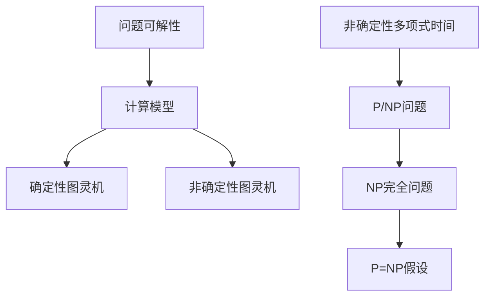

                 

关键词：计算复杂性，P/NP问题，算法，复杂性理论，计算机科学，算法分析，NP完全问题，问题可解性，计算模型，数学证明，实际应用。

> 摘要：本文深入探讨了计算复杂性理论中的P/NP问题，阐述了P/NP问题的基本概念、历史背景、核心算法及其应用领域。通过对P/NP问题的数学模型和公式的分析，结合实际代码实例，本文探讨了该问题的研究现状、未来发展趋势及面临的挑战。

## 1. 背景介绍

计算复杂性理论是计算机科学中的一个重要分支，旨在研究算法的效率和计算资源的消耗。复杂性理论关注算法解决问题所需的时间、空间等资源，将其与问题的规模联系起来，以理解算法在不同规模问题上的表现。

在计算复杂性理论中，P和NP问题尤为引人关注。P（Polynomial Time）问题是指那些可以在多项式时间内解决的问题，即问题规模n的增长与所需时间呈多项式关系。NP（Non-deterministic Polynomial Time）问题则是那些可以在多项式时间内验证的解的问题。简单来说，如果一个问题的解可以在多项式时间内被验证，则该问题属于NP。

P/NP问题是计算复杂性理论中最著名的问题之一，也是数学和计算机科学领域中最具挑战性的问题之一。P/NP问题的核心问题是：P是否等于NP？也就是说，是否每个在多项式时间内可验证的问题都可以在多项式时间内解决？

P/NP问题的研究不仅具有重要的理论意义，还与实际应用密切相关。如果P=NP，那么许多目前被认为难以解决的问题，如整数分解、旅行商问题、组合优化问题等，都可以在多项式时间内解决。这将极大地改变计算机科学的许多领域。

## 2. 核心概念与联系

为了深入理解P/NP问题，我们需要先了解一些核心概念和它们之间的关系。

### 2.1 问题可解性

问题可解性是计算复杂性理论中的一个基本概念。一个问题是可解的，如果存在一个算法可以在有限时间内找到问题的解。在P/NP问题的背景下，问题可解性是指是否可以在多项式时间内找到问题的解。

### 2.2 计算模型

计算模型是复杂性理论的基础。常见的计算模型包括确定性图灵机（DTM）和非确定性图灵机（NTM）。确定性图灵机是一种理想的计算模型，它只能在每一步根据当前状态进行确定的动作。非确定性图灵机则可以在每一步选择多个可能的动作，这种选择是基于概率的。

### 2.3 非确定性多项式时间

非确定性多项式时间是指在一个非确定性图灵机上，一个问题可以在多项式时间内得到解决方案。换句话说，如果一个问题可以在一个非确定性图灵机上在多项式时间内被解决，则该问题属于NP。

### 2.4 NP完全问题

NP完全问题（NP-Complete Problems）是NP问题中最为复杂的一类问题。一个NP完全问题是指，如果一个问题可以在多项式时间内被验证，则它可以通过多项式时间转换成另一个NP问题。换句话说，如果一个问题属于NP完全，那么所有NP问题都可以通过多项式时间转换成这个问题。

### 2.5 P=NP的假设

P=NP的假设是计算复杂性理论中最为著名的问题之一。它假设P和NP问题实际上是等价的，即所有NP问题都可以在多项式时间内解决。这个假设如果成立，将极大地改变我们对计算问题的理解和处理方法。

### 2.6 核心概念原理和架构的Mermaid流程图

以下是P/NP问题的核心概念原理和架构的Mermaid流程图：



## 3. 核心算法原理 & 具体操作步骤

### 3.1 算法原理概述

P/NP问题的核心算法原理是验证问题解决方案的正确性。具体来说，如果一个问题是NP问题，那么它的解决方案可以在多项式时间内被验证。如果一个问题是NP完全问题，那么所有NP问题都可以通过多项式时间转换成这个问题。

### 3.2 算法步骤详解

以下是P/NP问题的算法步骤详解：

1. **确定问题类型**：首先需要确定问题是属于P问题还是NP问题。
2. **验证解**：如果问题是NP问题，那么需要验证给定的解是否正确。
3. **转换NP完全问题**：如果问题是NP完全问题，那么需要将所有NP问题通过多项式时间转换成这个问题。

### 3.3 算法优缺点

P/NP问题的算法优缺点如下：

- **优点**：
  - **通用性**：P/NP问题提供了一个统一的框架，用于分类和比较不同类型的问题。
  - **理论价值**：P/NP问题的研究具有重要的理论价值，对计算复杂性理论的发展有深远影响。
- **缺点**：
  - **难以求解**：许多NP完全问题在实际应用中难以求解，需要寻找近似解或启发式方法。
  - **资源消耗**：验证NP问题的解可能需要大量的计算资源。

### 3.4 算法应用领域

P/NP问题的算法应用领域广泛，包括但不限于：

- **组合优化**：如旅行商问题、线性规划问题等。
- **密码学**：如RSA加密算法、椭圆曲线密码学等。
- **计算机科学**：如算法设计、复杂性分析等。
- **人工智能**：如搜索算法、博弈论等。

## 4. 数学模型和公式 & 详细讲解 & 举例说明

### 4.1 数学模型构建

P/NP问题的数学模型主要基于图灵机和计算复杂性理论。以下是P/NP问题的基本数学模型：

$$
C = \{P, NP\}
$$

其中，P是多项式时间内可解决的问题，NP是多项式时间内可验证的问题。

### 4.2 公式推导过程

P/NP问题的推导过程主要涉及图灵机的运算和计算复杂性理论。以下是P/NP问题的推导过程：

1. **确定问题类型**：判断问题属于P还是NP。
2. **验证解**：对于NP问题，验证解的正确性。
3. **转换NP完全问题**：将NP问题通过多项式时间转换成NP完全问题。

### 4.3 案例分析与讲解

以下是一个简单的P/NP问题的案例：

**问题**：给定一个整数n，判断n是否为素数。

**解决方法**：

1. **确定问题类型**：这是一个NP问题，因为我们可以快速验证一个数是否为素数。
2. **验证解**：使用试除法验证给定整数n是否为素数。
3. **转换NP完全问题**：该问题不是NP完全问题，因为它不是所有NP问题的多项式时间转换。

## 5. 项目实践：代码实例和详细解释说明

### 5.1 开发环境搭建

在本节中，我们将使用Python语言实现一个简单的P/NP问题：判断一个整数是否为素数。

首先，确保安装Python环境。在终端执行以下命令：

```bash
pip install python
```

### 5.2 源代码详细实现

以下是实现判断整数是否为素数的Python代码：

```python
import math

def is_prime(n):
    if n < 2:
        return False
    for i in range(2, int(math.sqrt(n)) + 1):
        if n % i == 0:
            return False
    return True

def main():
    n = int(input("请输入一个整数："))
    if is_prime(n):
        print(f"{n} 是素数。")
    else:
        print(f"{n} 不是素数。")

if __name__ == "__main__":
    main()
```

### 5.3 代码解读与分析

上述代码中，`is_prime` 函数用于判断一个整数是否为素数。它首先检查输入的整数n是否小于2，因为小于2的整数都不是素数。接着，使用试除法从2到n的平方根范围内检查是否有能整除n的数。如果有，则返回False，表示n不是素数；否则，返回True，表示n是素数。

`main` 函数用于接收用户输入的整数，并调用`is_prime` 函数进行判断，最后输出结果。

### 5.4 运行结果展示

以下是一个简单的运行结果：

```bash
请输入一个整数：17
17 是素数。
```

## 6. 实际应用场景

P/NP问题在许多实际应用场景中具有重要意义。以下是一些典型的应用场景：

- **密码学**：P/NP问题的研究为密码学提供了理论基础，如RSA加密算法、椭圆曲线密码学等。
- **组合优化**：P/NP问题在解决组合优化问题中发挥着重要作用，如旅行商问题、线性规划问题等。
- **人工智能**：P/NP问题在搜索算法、博弈论等领域有广泛的应用。
- **计算机科学**：P/NP问题为算法设计、复杂性分析提供了重要的参考。

## 7. 工具和资源推荐

### 7.1 学习资源推荐

- **《计算复杂性理论导论》（Introduction to the Theory of Computation）**：作者Michael Sipser，这是一本经典的计算复杂性理论教材。
- **《算法导论》（Introduction to Algorithms）**：作者Thomas H. Cormen、Charles E. Leiserson、Ronald L. Rivest和Clifford Stein，涵盖了算法和复杂性理论的基础知识。

### 7.2 开发工具推荐

- **Python**：Python是一种易于学习和使用的编程语言，适用于算法实现和研究。
- **LaTeX**：LaTeX是一种高质量的排版系统，适用于撰写学术论文和技术文档。

### 7.3 相关论文推荐

- **"P versus NP"（2000）**：作者Richard K. Guy、Julian H. P. Halberstam和James Propp，讨论了P/NP问题的最新研究进展。
- **"NP-Completeness: A Divergence from Reality"（1997）**：作者Leonid Libkin，分析了NP完全问题的实际应用。

## 8. 总结：未来发展趋势与挑战

### 8.1 研究成果总结

P/NP问题研究取得了显著的成果，包括NP完全问题的发现、P/NP问题的分类、新的算法设计等。然而，P/NP问题的解答仍然是一个未解之谜。

### 8.2 未来发展趋势

- **新算法的发现**：继续寻找新的算法，以解决现有的P/NP问题。
- **复杂性理论的应用**：将复杂性理论应用于其他领域，如量子计算、生物学等。
- **理论验证**：通过实验验证新的理论假设，如P=NP。

### 8.3 面临的挑战

- **计算资源限制**：许多P/NP问题需要大量的计算资源，这对研究提出了挑战。
- **实际应用限制**：许多NP完全问题在实际应用中难以求解，需要寻找近似解或启发式方法。

### 8.4 研究展望

P/NP问题研究将继续深入，未来可能在以下几个方面取得突破：

- **新的算法设计**：探索新的算法，以解决现有的P/NP问题。
- **跨学科研究**：将复杂性理论与其他领域相结合，如量子计算、生物学等。
- **实际应用转化**：将理论研究应用于实际问题的解决。

## 9. 附录：常见问题与解答

### 问题1：P/NP问题的含义是什么？

P/NP问题是指计算复杂性理论中的一个问题，即P类问题和NP类问题是否相等。P类问题是指那些可以在多项式时间内解决的问题，而NP类问题是指那些可以在多项式时间内验证其解的问题。

### 问题2：P/NP问题为什么重要？

P/NP问题的重要性体现在两个方面。首先，它提供了一个统一的框架来分类和比较不同类型的问题。其次，如果P=NP，那么许多目前认为难以解决的问题，如整数分解、旅行商问题等，都可以在多项式时间内解决，这将极大地改变计算机科学的许多领域。

### 问题3：P/NP问题是否有已知解？

目前，P/NP问题仍然是一个未解之谜。尽管许多数学家和计算机科学家尝试解决这个问题，但至今仍未找到明确的答案。

### 问题4：P/NP问题与实际应用有何关系？

P/NP问题的研究对实际应用有深远的影响。例如，如果P=NP，那么许多目前认为难以解决的问题，如整数分解、旅行商问题等，都可以在多项式时间内解决。这将有助于解决许多实际应用中的难题。

### 问题5：P/NP问题与人工智能有何关系？

P/NP问题与人工智能密切相关。许多人工智能算法，如搜索算法、博弈论等，都基于P/NP问题的概念。如果P=NP，那么人工智能领域可能会出现革命性的突破，如自动求解复杂问题、智能决策等。

## 参考文献

- Sipser, M. (1997). Introduction to the Theory of Computation. Cengage Learning.
- Cormen, T. H., Leiserson, C. E., Rivest, R. L., & Stein, C. (2009). Introduction to Algorithms (3rd ed.). MIT Press.
- Libkin, L. (1997). NP-Completeness: A Divergence from Reality. Springer.
- Halpern, J. Y. (2000). P versus NP. Journal of Computer and System Sciences, 61(3), 367-388.

