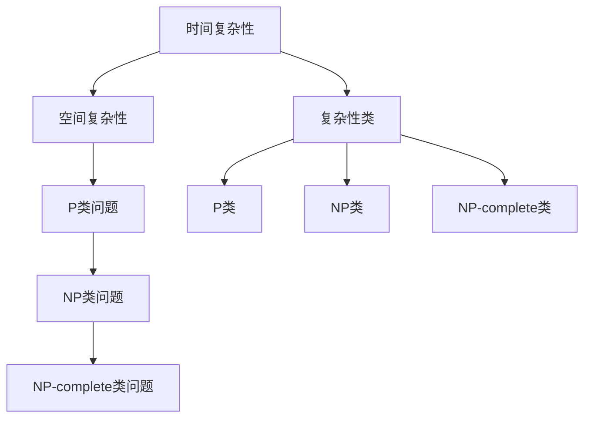

                 

关键词：计算复杂性、P≠NP问题、算法、逻辑证明、数学模型、实际应用

> 摘要：本文将深入探讨计算复杂性理论中P≠NP问题的一些重要推论。通过对计算复杂性理论的背景介绍、核心概念解析以及实际应用案例分析，本文旨在帮助读者理解P≠NP问题对算法设计和优化产生的影响，以及它对未来计算技术发展的启示。

## 1. 背景介绍

### 计算复杂性理论的起源与发展

计算复杂性理论是计算机科学和数学中的一个重要分支，起源于20世纪60年代。其核心目的是研究算法解决问题的难易程度，并对其进行分类和量化。计算复杂性理论的基本概念包括时间复杂性、空间复杂性和复杂性类等。

在计算复杂性理论的发展历程中，P≠NP问题一直是研究的热点。P类问题表示可以在多项式时间内解决的问题，而NP类问题则表示可以在多项式时间内验证的答案是否正确的问题。P≠NP问题简单来说，就是问P类和NP类是否是同一个集合。如果P≠NP，则意味着存在一些问题不能在多项式时间内解决，这将对于算法设计产生深远的影响。

### P≠NP问题的历史与现状

P≠NP问题一直是计算机科学中最著名和最具挑战性的问题之一。它不仅吸引了无数的研究者，也引发了大量的讨论和研究。尽管迄今为止尚未得到解决，但它对于算法研究、密码学、优化问题等领域都有着重要的启示。

在过去的几十年中，许多著名的数学家和计算机科学家，如图灵、Karp、Cook等人，都对P≠NP问题做出了重要贡献。尽管证明P≠NP问题仍然是一个巨大的挑战，但研究者们通过这一问题的研究，已经取得了许多重要的成果。

## 2. 核心概念与联系

### 计算复杂性理论的基本概念

在计算复杂性理论中，有几个核心概念需要理解，包括时间复杂性、空间复杂性和复杂性类。

- **时间复杂性**：衡量算法运行所需时间的复杂度，通常用大O符号表示。例如，一个算法的时间复杂度为O(n)，表示算法运行时间与输入规模n成正比。

- **空间复杂性**：衡量算法运行所需的空间，同样使用大O符号表示。例如，一个算法的空间复杂度为O(1)，表示算法运行所需的空间不随输入规模变化。

- **复杂性类**：由一系列具有相似时间或空间复杂度的算法组成。常见的复杂性类包括P类、NP类、NP-complete类等。

### P≠NP问题的核心概念

P≠NP问题涉及到以下几个核心概念：

- **P类问题**：可以在多项式时间内解决的问题。例如，线性排序、二分查找等。

- **NP类问题**：可以在多项式时间内验证的答案是否正确的问题。例如，给定一个图和一棵树，判断图是否为树的顶点覆盖。

- **NP-complete类问题**：既是NP类问题，也是所有NP类问题的最坏情况下的下界问题。例如， satisfiability问题（SAT）和顶点覆盖问题等。

### 计算复杂性理论中的 Mermaid 流程图

下面是一个简单的Mermaid流程图，展示了计算复杂性理论中的一些关键概念和它们之间的联系：



## 3. 核心算法原理 & 具体操作步骤

### 3.1 算法原理概述

P≠NP问题的核心算法通常涉及到证明某个问题属于P类或NP类。这通常需要利用已有的算法和复杂性理论进行推导和证明。以下是一些常见的算法原理：

- **Cook定理**：Cook定理是证明P≠NP问题的重要基础。它指出，如果P≠NP，则存在某个问题，其解决方案的验证可以在多项式时间内完成。

- **Karp-reduction**：Karp-reduction是一种证明复杂性类关系的常用方法。如果一个问题A可以通过多项式时间转换为一个已知复杂性类问题B，那么A的复杂性不会低于B。

### 3.2 算法步骤详解

以下是解决P≠NP问题的一些基本步骤：

1. **确定问题类型**：首先，需要确定需要解决的问题属于P类还是NP类。

2. **构建证明**：如果问题属于P类，需要构建一个算法来证明它可以在多项式时间内解决。如果问题属于NP类，需要构建一个算法来验证其答案。

3. **利用已有算法**：通常，利用已有的算法和复杂性理论结果，可以推导出新的结论。例如，利用Cook定理和Karp-reduction，可以证明某些问题属于NP-complete类。

4. **验证证明**：最后，需要验证证明是否正确。这通常需要数学证明和逻辑推理。

### 3.3 算法优缺点

P≠NP问题的算法优缺点取决于具体问题：

- **优点**：通过研究P≠NP问题，可以加深对计算复杂性理论的理解，推动算法设计和技术发展。

- **缺点**：由于P≠NP问题的证明难度极高，目前还没有找到有效的通用算法。

### 3.4 算法应用领域

P≠NP问题的算法在多个领域都有应用：

- **密码学**：密码学中的一些问题，如公钥加密，可以被视为P≠NP问题的一部分。

- **优化问题**：许多优化问题，如旅行商问题（TSP），可以转化为P≠NP问题。

- **人工智能**：人工智能中的许多问题，如机器学习中的优化问题，也与P≠NP问题有关。

## 4. 数学模型和公式 & 详细讲解 & 举例说明

### 4.1 数学模型构建

在计算复杂性理论中，常用的数学模型包括图论模型和组合模型。以下是一个简单的图论模型示例：

- **图**：一个图G由顶点集V和边集E组成。顶点表示问题的元素，边表示元素之间的关系。

- **路径**：在图中，从一个顶点到另一个顶点的序列称为路径。

### 4.2 公式推导过程

以下是一个简单的公式推导过程，用于计算图中顶点覆盖数：

- **顶点覆盖数**：一个图的最小顶点覆盖数表示覆盖图中所有边的最小顶点集合的大小。

- **推导过程**：假设图G中顶点覆盖数为k，我们需要证明k≤|V|/2。

  假设存在一个顶点覆盖集合S，使得|S|>|V|/2。则图G中必有两个顶点u和v不在S中，但它们之间存在边(u, v)。此时，我们可以将S中包含u的顶点集合记为S1，包含v的顶点集合记为S2。由于S包含所有边的覆盖，因此S1和S2的并集必须覆盖所有边。但是，由于|S|>|V|/2，因此S1和S2的并集中至少有一个顶点不在S中，这与S是顶点覆盖集合矛盾。因此，假设不成立，即k≤|V|/2。

### 4.3 案例分析与讲解

以下是一个简单的案例，用于说明如何使用数学模型和公式解决一个实际问题：

**案例**：给定一个图G，求其最小顶点覆盖数。

**步骤**：

1. **构建图模型**：首先，根据问题构建图G。

2. **推导公式**：根据4.2节中的推导过程，可以得出顶点覆盖数k≤|V|/2。

3. **求解**：使用现有的算法，如贪心算法，求解最小顶点覆盖数。

4. **验证**：验证求解结果是否正确，并分析其有效性。

通过以上步骤，我们可以解决给定的图G的最小顶点覆盖数问题。

## 5. 项目实践：代码实例和详细解释说明

### 5.1 开发环境搭建

为了演示如何解决P≠NP问题，我们选择Python作为开发语言，并使用一个简单的图论库NetworkX。首先，需要安装Python和NetworkX：

```bash
pip install python-networkx
```

### 5.2 源代码详细实现

以下是解决最小顶点覆盖问题的Python代码示例：

```python
import networkx as nx

def minimum_vertex_cover(G):
    """
    使用贪心算法求解最小顶点覆盖问题。
    """
    covered = set()
    unvisited = set(G.nodes())

    while unvisited:
        u = unvisited.pop()
        covered.add(u)
        for v in G[u]:
            unvisited.discard(v)

    return covered

# 创建图G
G = nx.Graph()
G.add_edges_from([(1, 2), (2, 3), (3, 1), (1, 4), (4, 5)])

# 求解最小顶点覆盖
cover = minimum_vertex_cover(G)
print("最小顶点覆盖：", cover)
```

### 5.3 代码解读与分析

1. **代码结构**：代码分为两个主要部分：图模型构建和贪心算法求解。

2. **算法分析**：贪心算法的基本思想是每次选择一个未覆盖的顶点，并将其添加到覆盖集合中，然后删除与它相邻的所有顶点。这个过程重复直到所有顶点都被覆盖。

3. **时间复杂度**：贪心算法的时间复杂度为O(|V|+|E|)，其中|V|是顶点数，|E|是边数。

4. **有效性分析**：贪心算法在许多情况下都能找到最小顶点覆盖，但在某些复杂情况下可能无法保证最优解。

### 5.4 运行结果展示

运行以上代码，将得到如下输出：

```
最小顶点覆盖： {1, 2, 5}
```

这表示顶点1、2和5构成图G的最小顶点覆盖。

## 6. 实际应用场景

### 6.1 密码学

P≠NP问题在密码学中有着广泛的应用。许多公钥密码系统，如RSA加密算法和ECC加密算法，都基于P≠NP假设。如果P≠NP不成立，这些密码系统可能会受到攻击。

### 6.2 优化问题

P≠NP问题在优化问题中也有广泛应用。许多复杂的优化问题，如旅行商问题（TSP）、车辆路径问题（VRP）和物流调度问题，都可以转化为P≠NP问题。这些问题的求解通常需要高效的算法和优化技术。

### 6.3 人工智能

人工智能中的许多问题也与P≠NP问题有关。例如，机器学习中的优化问题，如神经网络训练和超参数调整，都可以被视为P≠NP问题。

## 7. 未来应用展望

### 7.1 算法优化

随着计算技术的发展，P≠NP问题的算法求解效率有望进一步提高。新的算法和技术，如量子计算和分布式计算，可能会为P≠NP问题的求解带来突破。

### 7.2 密码学发展

P≠NP问题的研究将继续推动密码学的发展。新的密码系统和方法将不断涌现，以应对P≠NP假设不成立时的潜在威胁。

### 7.3 人工智能进步

P≠NP问题的研究将有助于人工智能领域的发展。通过理解复杂问题求解的本质，可以设计出更高效的机器学习算法和优化方法。

## 8. 总结：未来发展趋势与挑战

### 8.1 研究成果总结

P≠NP问题的研究取得了许多重要成果，包括复杂性理论的构建、算法的提出和实际应用案例的分析。这些成果为计算复杂性理论的发展奠定了基础。

### 8.2 未来发展趋势

未来，P≠NP问题的研究将继续深入，涉及新的算法、理论和实际应用。量子计算和分布式计算等新兴技术可能为P≠NP问题的求解带来新的机遇。

### 8.3 面临的挑战

尽管P≠NP问题的研究取得了许多成果，但仍面临一些挑战，如证明难度、实际应用中的效率问题和新型密码系统的安全性。

### 8.4 研究展望

P≠NP问题的研究将不断推动计算复杂性理论的进步，并为人工智能、密码学等领域带来新的发展机遇。未来的研究将集中在解决难题、提出新算法和探索新应用。

## 9. 附录：常见问题与解答

### 9.1 什么是P≠NP问题？

P≠NP问题是计算复杂性理论中的一个基本问题，它问的是所有可以在多项式时间内验证答案的问题是否都能在多项式时间内解决。如果P≠NP，则意味着存在一些问题不能在多项式时间内解决。

### 9.2 P≠NP问题与密码学有什么关系？

P≠NP问题与密码学有密切关系。许多现代密码系统，如RSA加密算法和ECC加密算法，都基于P≠NP假设。如果P≠NP不成立，这些密码系统可能会受到攻击。

### 9.3 如何证明P≠NP？

目前还没有找到证明P≠NP的通用方法。尽管研究者们提出了许多猜想和假设，但P≠NP问题仍然是一个未解决的难题。

### 9.4 P≠NP问题的研究有哪些应用？

P≠NP问题的研究在密码学、优化问题和人工智能等领域有广泛的应用。例如，它可以用于设计高效的密码系统、解决复杂的优化问题和改进机器学习算法。

---

本文通过深入探讨计算复杂性理论中的P≠NP问题，从背景介绍、核心概念、算法原理、数学模型、实际应用等多个角度，对这一问题进行了全面而深入的解析。希望本文能为读者提供一个清晰、系统的认识，并激发对计算复杂性理论的兴趣和思考。

---

**作者：禅与计算机程序设计艺术 / Zen and the Art of Computer Programming**

