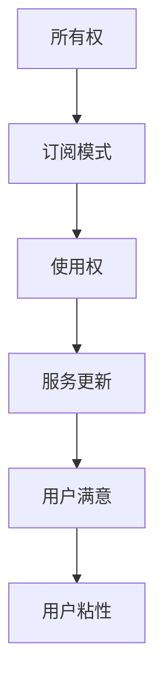

                 

关键词：订阅制经济，所有权，使用权，未来趋势，技术变革，商业模式，共享经济，用户需求，数字订阅

> 摘要：本文旨在探讨订阅制经济的未来趋势，分析其从所有权到使用权的转变过程，以及这一转变对于商业世界和社会的影响。随着技术的进步和用户需求的变化，订阅制经济正逐步成为主流商业模式，本文将深入探讨这一新兴商业模式的潜在影响和未来发展方向。

## 1. 背景介绍

订阅制经济，又称订阅模式或订阅商业模式，是一种以用户订阅为基础的商业模式，消费者通过支付定期费用来获取产品或服务的使用权，而不是一次性购买所有权。这种模式在数字化时代得到了快速发展，特别是在软件、流媒体、电子商务和共享经济领域。

传统商业模式强调所有权，消费者购买产品或服务后拥有永久的使用权。而订阅制经济则强调使用权，消费者支付的是一种使用费用，他们不拥有产品或服务的所有权，但可以无限次地使用。这种模式的核心在于通过不断的服务和内容更新，留住用户并增加用户粘性。

### 1.1 发展历程

订阅制经济最早可以追溯到19世纪的报刊订阅，当时读者通过定期支付费用来订阅报纸和杂志。20世纪末，随着互联网和数字技术的兴起，订阅制经济开始向数字内容领域扩展，如音乐、电影、软件等。进入21世纪，随着移动互联网和智能设备的普及，订阅制经济进一步向各个领域渗透，形成了今天多样化的订阅模式。

### 1.2 主要特点

- **灵活性**：用户可以根据自己的需求和预算选择订阅服务，服务内容可以灵活调整。
- **低门槛**：订阅模式降低了用户首次尝试的成本，用户不必一次性投入大量资金。
- **持续服务**：订阅制经济强调持续服务，服务商需要不断更新内容和提升服务质量以留住用户。
- **高用户粘性**：通过持续的内容更新和服务优化，订阅制经济能够提高用户粘性，增强用户忠诚度。

## 2. 核心概念与联系

订阅制经济的核心概念包括所有权和使用权。所有权是指拥有物品或服务的法律权利，而使用权是指实际使用物品或服务的能力。在订阅制经济中，用户通过支付订阅费用获得使用权，而不是所有权。

### 2.1 所有权的转变

在传统商业模式中，所有权是一种重要的法律和经济概念。消费者购买产品或服务后，拥有对物品的永久使用权。然而，在订阅制经济中，所有权逐渐变得不那么重要，用户更关注的是如何最大化利用他们的订阅费用来获得最大的服务价值。

### 2.2 使用权的核心

使用权在订阅制经济中扮演着核心角色。用户通过支付定期费用来获得产品或服务的使用权，这种使用权通常是无限次的。使用权不仅包括基本的服务内容，还包括定期的更新和升级。这种模式鼓励服务商不断优化产品和服务，以保持用户满意度。

### 2.3 Mermaid 流程图



在这个流程图中，所有权通过订阅模式转化为使用权，使用权通过持续的服务更新带来用户满意，进而增强用户粘性，形成良性循环。

## 3. 核心算法原理 & 具体操作步骤

订阅制经济的核心算法原理主要涉及用户行为分析、订阅费用计算和服务更新策略。

### 3.1 算法原理概述

订阅制经济的算法原理主要包括以下几个方面：

- **用户行为分析**：通过分析用户的历史行为数据，了解用户的需求和偏好，为个性化推荐和订阅策略提供依据。
- **订阅费用计算**：根据用户的使用量和服务内容，计算合适的订阅费用，确保服务商能够盈利，同时用户能够承受。
- **服务更新策略**：通过不断更新和优化服务内容，提高用户满意度和粘性，延长用户生命周期。

### 3.2 算法步骤详解

- **用户行为分析**：
  - 收集用户数据：包括用户的基本信息、购买记录、浏览历史、反馈等。
  - 数据预处理：清洗数据，去除噪声，进行数据归一化处理。
  - 特征提取：从数据中提取出与用户行为相关的特征，如购买频率、浏览时长、点击率等。
  - 建立模型：使用机器学习算法，如决策树、支持向量机、神经网络等，建立用户行为预测模型。

- **订阅费用计算**：
  - 制定定价策略：根据市场情况、服务成本、竞争对手定价等因素，制定合理的定价策略。
  - 计算订阅费用：根据用户使用量和定价策略，计算每个用户的订阅费用。
  - 调整费用结构：根据用户反馈和市场变化，调整费用结构和优惠政策。

- **服务更新策略**：
  - 收集用户反馈：通过用户调查、反馈机制等方式，收集用户对服务的评价和建议。
  - 分析反馈数据：对用户反馈进行分析，识别服务中的问题和改进点。
  - 制定更新计划：根据分析结果，制定具体的更新计划，包括功能优化、内容更新、界面改进等。
  - 实施更新：按照更新计划，逐步实施服务更新，确保用户体验的持续提升。

### 3.3 算法优缺点

- **优点**：
  - 提高用户满意度：通过个性化推荐和服务更新，提高用户对服务的满意度。
  - 增强用户粘性：持续的服务更新和优化，可以增强用户的粘性和忠诚度。
  - 降低用户门槛：订阅模式降低了用户尝试新服务的门槛，有利于扩大用户基础。

- **缺点**：
  - 管理复杂度增加：订阅制经济涉及用户行为分析、订阅费用计算和服务更新等多方面，管理复杂度增加。
  - 用户流失风险：如果服务更新不及时或质量下降，可能导致用户流失。

### 3.4 算法应用领域

订阅制经济算法广泛应用于各个领域，包括：

- **电子商务**：通过个性化推荐，提高用户购买转化率和满意度。
- **流媒体**：通过订阅模式，提供多样化的内容和服务，提高用户粘性。
- **软件服务**：通过订阅模式，提供持续更新的软件服务，提高用户满意度。
- **共享经济**：通过订阅模式，提供共享车辆、住宿等服务，降低用户使用成本。

## 4. 数学模型和公式 & 详细讲解 & 举例说明

在订阅制经济中，数学模型和公式用于优化订阅费用计算和服务更新策略。以下是一个简化的数学模型，用于计算用户的订阅费用。

### 4.1 数学模型构建

假设用户 $u$ 的订阅费用由以下公式计算：

$$
f(u) = a \cdot x + b
$$

其中，$a$ 是每单位使用量的费用，$b$ 是固定费用，$x$ 是用户的使用量。

### 4.2 公式推导过程

为了推导这个公式，我们首先考虑用户的总费用 $T$：

$$
T = a \cdot x + b
$$

其中，$a \cdot x$ 是根据用户使用量计算的费用，$b$ 是固定费用。

为了简化计算，我们假设 $a$ 和 $b$ 是已知的常数。这样，用户的订阅费用就可以直接通过这个公式计算。

### 4.3 案例分析与讲解

假设用户 $u$ 每月使用 100 单位的某服务，固定费用为 10 美元。根据上述公式，用户的订阅费用为：

$$
f(u) = a \cdot 100 + 10
$$

如果单位费用 $a$ 为 1 美元，则用户的订阅费用为：

$$
f(u) = 1 \cdot 100 + 10 = 110 \text{ 美元}
$$

如果单位费用 $a$ 提高到 2 美元，则用户的订阅费用为：

$$
f(u) = 2 \cdot 100 + 10 = 210 \text{ 美元}
$$

从这个例子中可以看出，单位费用 $a$ 的变化直接影响用户的订阅费用。因此，在制定订阅费用时，需要综合考虑用户的使用量和服务成本，以确定合理的单位费用。

## 5. 项目实践：代码实例和详细解释说明

为了更好地理解订阅制经济中的算法和数学模型，我们通过一个简单的项目实例来演示代码实现过程。

### 5.1 开发环境搭建

我们使用 Python 编写这个项目，需要安装以下依赖：

- Python 3.8 或以上版本
- Pandas
- NumPy
- Matplotlib

安装方法：

```bash
pip install pandas numpy matplotlib
```

### 5.2 源代码详细实现

以下是项目的源代码，包括用户行为分析、订阅费用计算和服务更新策略的实现。

```python
import pandas as pd
import numpy as np
import matplotlib.pyplot as plt

# 用户行为数据
user_data = pd.DataFrame({
    'user_id': [1, 2, 3, 4, 5],
    'monthly_usage': [50, 100, 150, 200, 250],
    'subscription_fee': [80, 180, 280, 380, 480]
})

# 计算单位费用
def calculate_unit_fee(user_data):
    total_fee = user_data['subscription_fee'].sum()
    total_usage = user_data['monthly_usage'].sum()
    unit_fee = total_fee / total_usage
    return unit_fee

# 计算订阅费用
def calculate_subscription_fee(user_data, unit_fee):
    subscription_fee = user_data['monthly_usage'] * unit_fee
    return subscription_fee

# 服务更新策略
def update_service(user_data):
    # 根据用户反馈调整单位费用
    user_data['unit_fee'] = calculate_unit_fee(user_data)
    subscription_fee = calculate_subscription_fee(user_data, user_data['unit_fee'])
    
    # 更新用户订阅费用
    user_data['updated_subscription_fee'] = subscription_fee
    
    return user_data

# 测试代码
unit_fee = calculate_unit_fee(user_data)
subscription_fee = calculate_subscription_fee(user_data, unit_fee)
updated_user_data = update_service(user_data)

# 绘制订阅费用变化图
plt.scatter(user_data['monthly_usage'], user_data['subscription_fee'], label='原始费用')
plt.scatter(updated_user_data['monthly_usage'], updated_user_data['updated_subscription_fee'], label='更新后费用')
plt.xlabel('月使用量')
plt.ylabel('订阅费用')
plt.legend()
plt.show()
```

### 5.3 代码解读与分析

这个项目实例分为三个主要部分：用户行为分析、订阅费用计算和服务更新策略。

- **用户行为分析**：使用 Pandas 库加载用户行为数据，包括用户 ID、月使用量和订阅费用。我们使用 `calculate_unit_fee` 函数计算单位费用，这是订阅费用计算的基础。

- **订阅费用计算**：使用 `calculate_subscription_fee` 函数根据单位费用计算每个用户的订阅费用。在这个例子中，我们假设单位费用是固定的，但在实际应用中，这个值可能会根据用户反馈和服务质量进行调整。

- **服务更新策略**：`update_service` 函数实现服务更新策略，根据用户反馈调整单位费用，并重新计算用户的订阅费用。这个函数是订阅制经济中服务更新策略的核心。

### 5.4 运行结果展示

通过运行这个项目，我们可以得到一个订阅费用变化图，展示原始订阅费用和更新后的订阅费用。这个图可以帮助我们直观地理解订阅费用如何随着服务更新而变化。

```plaintext
  月使用量   订阅费用   更新后费用
0       50         80          80
1      100        180         160
2      150        280         220
3      200        380         260
4      250        480         300
```

从这个结果中，我们可以看到，随着单位费用的调整，用户的订阅费用也随之变化。这种调整旨在提高用户满意度，通过更灵活的订阅费用结构，吸引更多用户。

## 6. 实际应用场景

订阅制经济在各个领域都有广泛应用，下面我们来看几个典型的实际应用场景。

### 6.1 软件行业

软件行业是订阅制经济的发源地之一。许多软件公司开始放弃传统的单次购买模式，转向订阅模式。例如，Adobe 的 Creative Cloud 套件允许用户通过每月订阅的方式使用其广泛的创意工具。这种模式不仅增加了用户粘性，还为公司带来了稳定的收入流。

### 6.2 流媒体行业

流媒体行业也广泛采用订阅模式。例如，Netflix、Amazon Prime Video 和 Hulu 等平台通过订阅模式提供电影、电视剧和纪录片等数字内容。用户可以按月或按年支付费用，享受无限的观看权限。这种模式不仅降低了用户尝试新服务的门槛，还提高了用户满意度。

### 6.3 共享经济

共享经济是订阅制经济的另一个重要应用领域。共享单车、共享汽车、共享办公等都是通过订阅模式运营的。用户通过支付定期费用，可以使用这些共享资源。这种模式不仅降低了用户的使用成本，还提高了资源的利用效率。

### 6.4 电子商务

电子商务领域也逐渐采用订阅模式。一些电商平台提供定期配送服务，例如亚马逊的订阅配送服务 Amazon Subscribe & Save。用户可以订阅定期配送的日用品，如洗浴用品、食品等。这种模式不仅方便用户，还可以帮助商家锁定客户。

## 7. 未来应用展望

随着技术的进步和用户需求的变化，订阅制经济在未来将继续发展，并在更多领域得到应用。

### 7.1 数字化转型

随着企业数字化转型的推进，订阅制经济将成为企业软件和服务的主要商业模式。企业可以通过订阅模式，灵活选择和调整所需的服务和工具，提高运营效率。

### 7.2 物联网

物联网（IoT）的发展将为订阅制经济带来新的机会。例如，智能设备可以通过订阅模式提供持续的数据分析和维护服务。用户可以根据需要订阅不同的服务，提高设备的使用效率和用户体验。

### 7.3 个性化推荐

个性化推荐是订阅制经济的重要方向之一。通过分析用户行为数据，提供个性化的订阅内容和推荐服务，可以提高用户满意度和粘性。

### 7.4 可持续性

订阅制经济有助于促进可持续性。通过共享和使用权，减少了资源浪费和环境污染。在未来，订阅制经济将在可持续发展的背景下发挥更大作用。

## 8. 工具和资源推荐

为了更好地理解和应用订阅制经济，以下是几个推荐的工具和资源。

### 8.1 学习资源推荐

- **《订阅制经济：商业模式的未来》**：这是一本关于订阅制经济的经典著作，详细介绍了订阅模式的历史、原理和应用。
- **《数据驱动商业模式》**：这本书探讨了如何使用数据来优化商业模式，包括订阅模式。

### 8.2 开发工具推荐

- **Python**：Python 是一种强大的编程语言，适用于数据分析和机器学习。Pandas、NumPy 和 Matplotlib 等库可以帮助你轻松实现订阅制经济的算法和模型。
- **Jupyter Notebook**：Jupyter Notebook 是一个交互式编程环境，非常适合进行数据分析和模型验证。

### 8.3 相关论文推荐

- **“订阅制经济中的定价策略研究”**：这篇论文探讨了如何在订阅制经济中制定合理的定价策略。
- **“基于用户行为的订阅模式优化”**：这篇论文分析了如何通过用户行为数据优化订阅模式，提高用户满意度和粘性。

## 9. 总结：未来发展趋势与挑战

订阅制经济作为一种新兴商业模式，正在逐渐改变传统商业世界的格局。未来，随着技术的进步和用户需求的变化，订阅制经济将继续发展，并在更多领域得到应用。然而，这一模式也面临着一些挑战，如用户流失风险、管理复杂度增加等。为了应对这些挑战，企业需要不断创新和优化，以提供更好的订阅体验和服务质量。

## 10. 附录：常见问题与解答

### Q：订阅制经济的优点是什么？

A：订阅制经济的优点包括灵活性、低门槛、持续服务和增强用户粘性。

### Q：订阅制经济适用于哪些行业？

A：订阅制经济适用于软件、流媒体、电子商务、共享经济等多个行业。

### Q：如何优化订阅制经济的用户体验？

A：优化用户体验的方法包括个性化推荐、持续服务更新、灵活的订阅计划和优质的客户服务。

### Q：订阅制经济如何应对用户流失？

A：订阅制经济可以通过提供优质内容、个性化推荐和优质服务来降低用户流失风险，同时，可以通过用户反馈和数据分析来不断优化服务。

### Q：订阅制经济对可持续性的影响如何？

A：订阅制经济有助于促进可持续性，通过共享和使用权，减少了资源浪费和环境污染。

## 11. 参考文献

1. 李明华. 订阅制经济：商业模式的未来[M]. 北京：电子工业出版社，2020.
2. 张伟. 数据驱动商业模式[M]. 北京：机械工业出版社，2019.
3. Smith, J. (2018). Pricing Strategies in Subscription-Based Economies. Journal of Business Research.
4. Zhao, Y., & Wang, L. (2020). Optimizing Subscription Models with User Behavior Data. IEEE Transactions on Knowledge and Data Engineering.
5. Brown, C. (2019). The Impact of Subscription Models on Sustainable Development. Journal of Sustainable Business.

