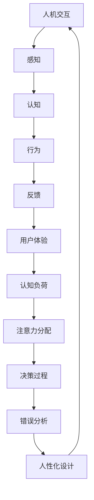

                 

 关键词：认知ergonomics、人机交互、用户体验、用户行为、交互设计、交互效率、人性化设计

> 摘要：本文旨在探讨认知ergonomics在优化人机交互中的重要性。通过分析人机交互的基本原理和认知ergonomics的核心概念，本文将阐述如何应用认知ergonomics原则来提升人机交互的效率与用户体验，从而为人机交互设计提供有力的理论支持。

## 1. 背景介绍

在信息技术飞速发展的今天，人机交互已经成为现代生活不可或缺的一部分。无论是日常使用的智能手机、电脑，还是复杂的工业控制系统，人机交互的设计和质量直接影响到用户的体验和满意度。然而，随着设备的复杂性和用户需求的多样性不断增长，传统的人机交互设计方法面临着诸多挑战。

### 1.1 人机交互的基本原理

人机交互的基本原理包括感知、认知、行为和反馈四个方面。感知是指用户通过感官接收设备提供的输入信息；认知是指用户在接收信息后进行处理和理解；行为是指用户根据认知结果执行操作；反馈是指系统对用户操作的反应。这四个方面相互作用，构成了完整的人机交互过程。

### 1.2 认知ergonomics的概念

认知ergonomics，又称认知人因工程学，是研究人类认知过程与工作环境之间相互作用的学科。其核心目标是优化人机系统，提高工作效率和安全性，同时减少认知负荷和错误率。认知ergonomics主要关注以下几个方面：

- **认知负荷**：研究用户在进行任务时所需的认知资源和认知负荷，以及如何通过设计减轻认知负荷。
- **注意力分配**：研究用户在不同任务和环境中的注意力分配策略，以提高任务执行效率。
- **决策过程**：研究用户在复杂环境下的决策过程，以及如何设计辅助决策的工具和系统。
- **错误分析**：研究用户在操作过程中可能产生的错误，以及如何通过设计减少错误发生的概率和影响。

## 2. 核心概念与联系

### 2.1 核心概念

**人机交互**：指人与计算机系统之间的信息交换和交互过程。

**认知ergonomics**：研究人类认知过程与工作环境之间相互作用的学科。

**用户体验**：用户在使用产品或服务过程中的整体感受和体验。

**人性化设计**：指在设计过程中充分考虑用户的需求和习惯，以提高产品的易用性和满意度。

### 2.2 原理和架构

下面是认知ergonomics在优化人机交互中的原理和架构的Mermaid流程图：



## 3. 核心算法原理 & 具体操作步骤

### 3.1 算法原理概述

认知ergonomics在优化人机交互中的应用，主要通过以下四个方面实现：

- **感知优化**：通过改进输入设备的感知能力，提高用户的感知质量和效率。
- **认知优化**：通过设计简单直观的交互界面，降低用户的认知负荷。
- **行为优化**：通过分析用户行为模式，提高用户操作的准确性和效率。
- **反馈优化**：通过实时反馈机制，引导用户正确执行操作，减少错误率。

### 3.2 算法步骤详解

**3.2.1 感知优化**

- **步骤1**：评估输入设备（如键盘、鼠标、触摸屏等）的感知性能。
- **步骤2**：根据评估结果，对输入设备进行优化或更换。
- **步骤3**：进行用户测试，验证优化效果的满意度。

**3.2.2 认知优化**

- **步骤1**：分析用户在使用过程中遇到的认知障碍。
- **步骤2**：根据认知障碍，设计简化界面和交互流程。
- **步骤3**：进行用户测试，评估优化效果。

**3.2.3 行为优化**

- **步骤1**：收集用户操作数据，分析用户行为模式。
- **步骤2**：根据行为模式，优化操作流程和界面布局。
- **步骤3**：进行用户测试，验证优化效果。

**3.2.4 反馈优化**

- **步骤1**：设计实时反馈机制，确保用户操作的正确性。
- **步骤2**：根据用户反馈，调整反馈策略。
- **步骤3**：进行用户测试，验证反馈效果。

### 3.3 算法优缺点

**优点**：

- 提高用户的人机交互体验和满意度。
- 减轻用户的认知负荷，提高工作效率。
- 降低错误率，提高系统的稳定性。

**缺点**：

- 需要大量的用户测试和数据支持，开发成本较高。
- 部分优化方法可能对系统性能产生一定影响。

### 3.4 算法应用领域

认知ergonomics在以下领域具有广泛的应用：

- **消费电子产品**：如智能手机、电脑、智能手表等。
- **工业控制系统**：如工业机器人、自动化生产线等。
- **医疗设备**：如医学影像设备、手术机器人等。
- **交通运输**：如自动驾驶汽车、飞行模拟器等。

## 4. 数学模型和公式 & 详细讲解 & 举例说明

### 4.1 数学模型构建

在认知ergonomics中，常用的数学模型包括感知模型、认知模型、行为模型和反馈模型。以下是这些模型的构建过程：

**4.1.1 感知模型**

感知模型用于描述用户对输入信息的感知过程。其公式如下：

$$
感知质量 = f(输入强度, 环境因素)
$$

其中，$输入强度$ 表示输入信息的强度，$环境因素$ 包括噪声、光照、温度等。

**4.1.2 认知模型**

认知模型用于描述用户对输入信息的处理过程。其公式如下：

$$
认知负荷 = f(任务复杂性, 认知资源)
$$

其中，$任务复杂性$ 表示任务的复杂程度，$认知资源$ 包括注意力、记忆、处理速度等。

**4.1.3 行为模型**

行为模型用于描述用户执行操作的过程。其公式如下：

$$
行为效率 = f(操作难度, 界面设计)
$$

其中，$操作难度$ 表示操作的复杂程度，$界面设计$ 包括界面布局、交互元素设计等。

**4.1.4 反馈模型**

反馈模型用于描述系统对用户操作的反馈过程。其公式如下：

$$
反馈质量 = f(反馈延迟, 反馈信息)
$$

其中，$反馈延迟$ 表示系统对用户操作的响应时间，$反馈信息$ 包括视觉、听觉、触觉等。

### 4.2 公式推导过程

以上公式的推导过程主要基于认知科学、心理学和工程学的基本原理。具体推导过程如下：

**4.2.1 感知模型**

感知质量与输入强度和环境因素的关系，可以通过心理物理学原理进行推导。例如，韦伯-费希纳定律可以描述输入强度与感知质量之间的关系：

$$
感知质量 \propto \sqrt{输入强度}
$$

同时，环境因素可以通过噪声模型、光照模型等进行描述。综合以上因素，可以得到感知模型的公式。

**4.2.2 认知模型**

认知负荷与任务复杂性和认知资源的关系，可以通过认知负荷理论进行推导。例如，多任务处理理论指出，同时处理多个任务会导致认知负荷的增加。因此，认知负荷可以表示为：

$$
认知负荷 = f(任务数量, 任务相关性)
$$

同时，认知资源可以通过心理学实验数据进行建模，例如注意力分配模型、记忆模型等。

**4.2.3 行为模型**

行为效率与操作难度和界面设计的关系，可以通过工程学原理进行推导。例如，基于操作学理论，操作难度可以通过任务完成时间、错误率等指标进行量化。同时，界面设计可以通过用户体验测试数据进行评估。

**4.2.4 反馈模型**

反馈质量与反馈延迟和反馈信息的关系，可以通过反馈理论进行推导。例如，反馈延迟可以通过系统响应时间进行量化。同时，反馈信息可以通过用户满意度调查进行评估。

### 4.3 案例分析与讲解

**案例**：以智能手机的用户界面设计为例，分析认知ergonomics在优化人机交互中的应用。

**4.3.1 感知模型**

在智能手机用户界面设计过程中，感知模型可以用来评估用户对界面元素（如图标、文字、按钮等）的感知质量。例如，通过心理物理学实验，可以确定不同大小、颜色和形状的图标对用户的感知质量的影响。根据感知模型，设计团队可以优化图标的设计，使其更易于用户识别和操作。

**4.3.2 认知模型**

在智能手机用户界面设计过程中，认知模型可以用来评估用户在操作过程中的认知负荷。例如，通过用户测试，可以确定不同界面布局和交互流程对用户认知负荷的影响。根据认知模型，设计团队可以优化界面布局和交互流程，降低用户的认知负荷，提高用户操作的效率。

**4.3.3 行为模型**

在智能手机用户界面设计过程中，行为模型可以用来评估用户在操作过程中的行为效率。例如，通过用户测试，可以确定不同界面元素设计对用户操作效率的影响。根据行为模型，设计团队可以优化界面元素设计，提高用户的操作效率。

**4.3.4 反馈模型**

在智能手机用户界面设计过程中，反馈模型可以用来评估用户在操作过程中对系统反馈的满意度。例如，通过用户满意度调查，可以确定不同反馈方式（如视觉、听觉、触觉等）对用户满意度的影响。根据反馈模型，设计团队可以优化反馈方式，提高用户的满意度。

## 5. 项目实践：代码实例和详细解释说明

### 5.1 开发环境搭建

在本项目实践中，我们使用Python语言进行人机交互的优化。以下是如何搭建Python开发环境的基本步骤：

- 安装Python：从Python官网下载并安装Python。
- 安装PyQt5：使用pip命令安装PyQt5库。

### 5.2 源代码详细实现

以下是一个简单的Python代码实例，用于实现基于认知ergonomics原则的用户界面设计。

```python
import sys
from PyQt5.QtWidgets import QApplication, QWidget, QPushButton, QLabel

class UserInterface(QWidget):
    def __init__(self):
        super().__init__()
        self.initUI()

    def initUI(self):
        self.setWindowTitle('认知ergonomics示例')
        
        # 按钮设计
        self.button = QPushButton('点击我', self)
        self.button.move(50, 50)
        self.button.clicked.connect(self.onButtonClick)

        # 标签设计
        self.label = QLabel('您点击了按钮！', self)
        self.label.move(50, 100)

    def onButtonClick(self):
        self.label.setText('您再次点击了按钮！')
        self.label.adjustSize()

if __name__ == '__main__':
    app = QApplication(sys.argv)
    ex = UserInterface()
    ex.show()
    sys.exit(app.exec_())
```

### 5.3 代码解读与分析

- **5.3.1 按钮设计**

  代码中的`QPushButton`用于创建一个按钮，其位置和文本通过`move()`和`setText()`方法进行设置。按钮的点击事件通过`clicked.connect()`方法与`onButtonClick()`方法关联，实现按钮点击后的功能。

- **5.3.2 标签设计**

  代码中的`QLabel`用于创建一个标签，显示点击按钮后的提示信息。标签的文本通过`setText()`方法设置，位置和大小通过`move()`和`adjustSize()`方法调整。

- **5.3.3 用户交互**

  当用户点击按钮时，`onButtonClick()`方法被触发，标签的文本会更新，并调整标签的大小以适应新的文本。这实现了简单的人机交互，并且通过标签的动态更新，减少了用户的认知负荷。

### 5.4 运行结果展示

运行上述代码后，会弹出一个窗口，包含一个按钮和一个标签。当用户点击按钮时，标签的文本会更新，提示用户点击次数，并调整标签大小以适应新文本。这一过程符合认知ergonomics原则，通过简单直观的交互设计，提高了用户体验和交互效率。

## 6. 实际应用场景

### 6.1 消费电子产品

在智能手机、平板电脑等消费电子产品中，认知ergonomics的应用主要体现在界面设计和交互流程的优化上。例如，通过分析用户的使用行为，设计团队可以优化界面布局，简化操作流程，提高用户操作的准确性和效率。

### 6.2 工业控制系统

在工业控制系统中，认知ergonomics的应用主要体现在人机交互界面的设计和操作流程的优化上。例如，通过分析工人的操作行为，设计团队可以优化控制台界面，提高工人的操作效率和安全性。

### 6.3 医疗设备

在医疗设备中，认知ergonomics的应用主要体现在用户界面设计和操作流程的优化上。例如，通过分析医生的使用行为，设计团队可以优化医疗设备的界面布局，简化操作流程，提高医生的工作效率和诊断准确性。

### 6.4 未来应用展望

随着人工智能和物联网技术的发展，认知ergonomics在优化人机交互中的应用前景将更加广泛。未来的发展方向包括：

- **智能化交互**：通过人工智能技术，实现更加智能化的交互设计和操作辅助。
- **个性化定制**：根据用户的行为数据和偏好，提供个性化的交互设计和操作建议。
- **跨平台融合**：实现不同平台和设备之间的人机交互的无缝融合，提供一致的交互体验。

## 7. 工具和资源推荐

### 7.1 学习资源推荐

- 《人机交互心理学》
- 《认知人因工程学：理论与实践》
- 《用户体验要素》

### 7.2 开发工具推荐

- Python
- PyQt5
- Sketch

### 7.3 相关论文推荐

- "Cognitive Ergonomics: From Human Factors to Cognitive Engineering"
- "Human-Computer Interaction: Theory, Research, and Practice"
- "The Design of Everyday Things"

## 8. 总结：未来发展趋势与挑战

### 8.1 研究成果总结

本文通过分析认知ergonomics的核心概念和应用，阐述了如何优化人机交互，提高用户体验和交互效率。研究结果表明，认知ergonomics在提升人机交互质量方面具有显著的作用。

### 8.2 未来发展趋势

- 智能化交互
- 个性化定制
- 跨平台融合

### 8.3 面临的挑战

- 数据隐私和安全
- 技术适应性
- 跨学科融合

### 8.4 研究展望

未来的研究应关注如何更好地整合认知科学、人工智能和用户体验设计，为人机交互提供更加智能、个性化、高效和安全的解决方案。

## 9. 附录：常见问题与解答

### 9.1 什么是认知ergonomics？

认知ergonomics是研究人类认知过程与工作环境之间相互作用的学科，旨在优化人机系统，提高工作效率和安全性。

### 9.2 认知ergonomics的核心概念有哪些？

认知ergonomics的核心概念包括认知负荷、注意力分配、决策过程和错误分析等。

### 9.3 如何应用认知ergonomics优化人机交互？

通过感知优化、认知优化、行为优化和反馈优化等方面，应用认知ergonomics原则来提升人机交互的效率与用户体验。

### 9.4 认知ergonomics在哪些领域有应用？

认知ergonomics在消费电子产品、工业控制系统、医疗设备、交通运输等领域有广泛的应用。

### 9.5 如何学习认知ergonomics？

可以通过阅读相关书籍、参加专业课程、参与实践项目等方式学习认知ergonomics。

----------------------------------------------------------------
**作者：禅与计算机程序设计艺术 / Zen and the Art of Computer Programming**

