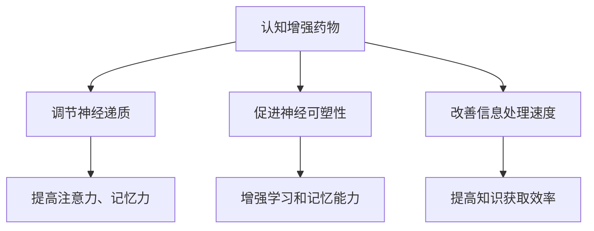

                 

关键词：认知增强药物、知识获取、伦理边界、人工智能、技术影响

## 摘要

随着人工智能和生物技术的快速发展，认知增强药物成为了一个备受关注的话题。本文旨在探讨认知增强药物在知识获取过程中所带来的伦理边界问题，并从技术、法律和社会角度提出相应的应对策略。本文首先介绍了认知增强药物的基本概念和发展历程，随后分析了其在知识获取中的潜在影响，并探讨了相关的伦理困境。最后，本文提出了若干解决思路和未来研究方向，为认知增强药物的健康发展提供参考。

## 1. 背景介绍

### 认知增强药物的定义与发展

认知增强药物，通常被称为“智能药物”或“神经增强剂”，是指通过外部化学物质干预，提高大脑认知功能的药物。这些药物可以影响神经递质水平、神经元连接和突触可塑性，从而改善记忆、注意力、学习和执行功能。

认知增强药物的发展可以追溯到20世纪50年代。当时，科学家们发现了如苯丙胺（Adderall）等药物可以用于治疗注意力缺陷多动障碍（ADHD）。然而，随着研究的深入，人们开始意识到这些药物在其他认知功能上的潜力，并逐渐将其用于非医学目的。

### 认知增强药物的类型

认知增强药物可以分为以下几种类型：

1. **刺激剂**：如苯丙胺和哌甲酯，通过提高中枢神经系统的兴奋性，增加注意力和警觉性。
2. **褪黑素受体激动剂**：如雷沙吉兰，可以改善睡眠质量，进而提高日间的认知功能。
3. **脑源性神经营养因子（BDNF）调节剂**：通过调节BDNF的表达，增强学习和记忆功能。
4. **神经递质调节剂**：如盐酸多奈哌齐，通过调节神经递质的水平，改善认知功能。

### 认知增强药物的应用现状

目前，认知增强药物主要应用于以下几个领域：

1. **医学治疗**：用于治疗注意力缺陷多动障碍、抑郁症、阿尔茨海默病等疾病。
2. **职业和工作**：提高职场人士的工作效率和学习能力。
3. **学习和教育**：辅助学生和学者提高学习效果和学术表现。

### 认知增强药物的社会影响

随着认知增强药物的应用范围不断扩大，其社会影响也逐渐显现。一方面，认知增强药物为个体提供了新的提升认知功能的可能性，有助于提高工作效率和学业成绩。另一方面，其潜在的风险和伦理问题也引起了广泛关注。

## 2. 核心概念与联系

### 2.1 认知增强药物的作用机制

认知增强药物的作用机制主要通过以下几种方式实现：

1. **调节神经递质**：通过增加或减少特定神经递质（如多巴胺、去甲肾上腺素等）的水平，提高大脑的兴奋性和传递效率。
2. **促进神经可塑性**：通过促进神经元之间的连接和突触形成，增强大脑的可塑性，从而改善学习和记忆能力。
3. **改善血液循环**：通过扩张血管、增加脑部血流，提高脑部氧和营养的供应，改善认知功能。

### 2.2 认知增强药物与知识获取的关系

认知增强药物与知识获取的关系主要体现在以下几个方面：

1. **学习效率**：认知增强药物可以增加个体的注意力和记忆力，从而提高学习效率。
2. **信息处理速度**：通过提升大脑的处理速度，认知增强药物可以帮助个体更快地处理和理解信息。
3. **记忆巩固**：认知增强药物可以增强记忆巩固过程，提高长期记忆的形成。

### 2.3 认知增强药物的伦理影响

认知增强药物的伦理影响主要体现在以下几个方面：

1. **公平性**：认知增强药物的使用可能导致社会上的不公平现象，使只有少数人能够获得认知优势。
2. **隐私**：使用认知增强药物可能涉及个人隐私问题，如药物使用记录的保密性。
3. **健康风险**：长期使用认知增强药物可能带来健康风险，如成瘾性、心脏负担等。

### 2.4 Mermaid 流程图

下面是一个简化的Mermaid流程图，展示了认知增强药物的作用机制和知识获取的关系。



## 3. 核心算法原理 & 具体操作步骤

### 3.1 算法原理概述

认知增强药物的算法原理主要集中在以下几个方面：

1. **神经递质调节**：通过特定的药物成分，调节神经递质的合成、释放和回收过程，从而提高神经信号的传递效率。
2. **神经可塑性增强**：通过影响神经元之间的连接和突触形成，增强大脑的可塑性，从而改善学习和记忆能力。
3. **信息处理优化**：通过调节大脑的神经网络活动，优化信息处理速度和效率。

### 3.2 算法步骤详解

1. **药物成分筛选**：首先，通过生物信息和药理学分析，筛选具有潜在认知增强效果的药物成分。
2. **动物实验验证**：在动物模型上进行药物效应的验证，评估其对认知功能的影响。
3. **临床试验**：在人类志愿者或患者中进行临床试验，评估药物的安全性和有效性。
4. **剂量优化**：根据临床试验结果，优化药物的剂量和使用频率，以达到最佳的认知增强效果。
5. **长期监测**：在药物使用过程中进行长期监测，评估其长期效果和潜在的健康风险。

### 3.3 算法优缺点

**优点**：

1. **提高认知功能**：认知增强药物可以显著提高个体的注意力、记忆力和信息处理速度，有助于提高学习效率和工作表现。
2. **快速作用**：药物作用迅速，可以在短时间内产生明显的认知提升效果。

**缺点**：

1. **健康风险**：长期使用认知增强药物可能带来健康风险，如心脏负担、药物成瘾等。
2. **社会不公平**：认知增强药物的使用可能导致社会上的不公平现象，使只有少数人能够获得认知优势。

### 3.4 算法应用领域

1. **医学治疗**：用于治疗注意力缺陷多动障碍、抑郁症、阿尔茨海默病等认知障碍疾病。
2. **教育和培训**：辅助学生和教师提高学习效果和教学效果。
3. **职场应用**：提高职场人士的工作效率和学习能力。

## 4. 数学模型和公式 & 详细讲解 & 举例说明

### 4.1 数学模型构建

认知增强药物的数学模型主要基于神经科学和药理学的基础理论，具体包括以下方面：

1. **神经递质动力学模型**：描述神经递质在神经元之间的传递过程，包括合成、释放、传递和回收等环节。
2. **神经可塑性模型**：描述神经元之间的连接和突触形成过程，以及这些过程如何影响认知功能。
3. **信息处理模型**：描述大脑处理信息的过程，包括感知、注意、记忆、决策等环节。

### 4.2 公式推导过程

以神经递质动力学模型为例，我们假设神经元之间的传递过程可以用以下公式描述：

\[ C(t) = k_1 \cdot [A(t)] - k_2 \cdot C(t) \]

其中，\( C(t) \) 表示神经递质在时间 \( t \) 的浓度，\( [A(t)] \) 表示神经递质的合成速率，\( k_1 \) 和 \( k_2 \) 分别表示神经递质的释放和回收速率。

### 4.3 案例分析与讲解

假设我们想要研究一种新型认知增强药物对神经递质浓度的影响，我们可以通过以下步骤进行模拟：

1. **参数设置**：根据现有的药理学和神经科学数据，设置神经递质的合成速率、释放速率和回收速率。
2. **模型模拟**：使用上述公式进行模拟，观察神经递质浓度随时间的变化。
3. **结果分析**：分析模拟结果，评估药物对神经递质浓度的影响，并探讨其对认知功能的影响。

通过这样的案例分析，我们可以更好地理解认知增强药物的作用机制，并为实际应用提供科学依据。

## 5. 项目实践：代码实例和详细解释说明

### 5.1 开发环境搭建

在开始编写代码之前，我们需要搭建一个合适的开发环境。以下是搭建过程的基本步骤：

1. **安装Python**：下载并安装Python，版本建议为3.8及以上。
2. **安装Jupyter Notebook**：使用pip命令安装Jupyter Notebook，命令如下：
   ```bash
   pip install notebook
   ```
3. **安装必需的库**：安装用于科学计算和神经科学模型的库，如NumPy、SciPy、Matplotlib等，命令如下：
   ```bash
   pip install numpy scipy matplotlib
   ```

### 5.2 源代码详细实现

以下是一个简单的神经递质动力学模型的实现代码，用于模拟药物对神经递质浓度的影响。

```python
import numpy as np
import matplotlib.pyplot as plt

# 参数设置
k1 = 0.1  # 神经递质合成速率
k2 = 0.05  # 神经递质回收速率
t_max = 100  # 模拟时间
dt = 1  # 时间步长

# 初始化变量
C = np.zeros(t_max)  # 神经递质浓度
A = np.random.uniform(0, 1, t_max)  # 神经递质合成速率

# 模型模拟
for t in range(1, t_max):
    C[t] = k1 * A[t-1] - k2 * C[t-1]

# 结果分析
plt.plot(C)
plt.xlabel('Time (t)')
plt.ylabel('Neurotransmitter Concentration (C)')
plt.title('Neurotransmitter Dynamics')
plt.show()
```

### 5.3 代码解读与分析

这段代码实现了神经递质动力学模型的基本功能。我们首先设置了模型参数，包括神经递质的合成速率 \( k_1 \) 和回收速率 \( k_2 \)，以及模拟的时间范围 \( t_{max} \) 和时间步长 \( dt \)。

接下来，我们初始化神经递质浓度 \( C \) 和合成速率 \( A \)。由于神经递质合成速率是一个随机过程，我们使用随机均匀分布生成 \( A \)。

在模拟过程中，我们使用一个循环来更新神经递质浓度 \( C \)，公式为 \( C(t) = k_1 \cdot [A(t)] - k_2 \cdot C(t) \)。

最后，我们使用Matplotlib库绘制神经递质浓度随时间的变化图，以直观地展示模型结果。

### 5.4 运行结果展示

运行上述代码后，我们将得到一个显示神经递质浓度随时间变化的折线图。通过分析这个图，我们可以观察到神经递质浓度在时间上的动态变化，以及药物对浓度的影响。

## 6. 实际应用场景

### 6.1 教育领域

认知增强药物在教育领域具有广泛的应用前景。例如，学生可以使用这些药物来提高学习效率、记忆力和注意力。然而，这也带来了一系列伦理问题，如教育公平性和药物滥用的风险。

### 6.2 职场应用

在职场中，认知增强药物可以帮助员工提高工作效率和学习能力。然而，这同样可能导致工作压力增加和职业倦怠，以及对工作环境的依赖。

### 6.3 军事和国家安全

认知增强药物在军事和国家安全领域具有潜在的应用价值。例如，士兵可以使用这些药物来提高战斗力和反应速度。然而，这也涉及到药物滥用的风险和军事机密的保护问题。

### 6.4 医学治疗

认知增强药物在医学治疗领域具有显著的应用前景。例如，对于注意力缺陷多动障碍、抑郁症和阿尔茨海默病等疾病，认知增强药物可以提供有效的治疗手段。然而，这也需要严格的伦理审查和监管，以确保药物的安全性和有效性。

## 7. 工具和资源推荐

### 7.1 学习资源推荐

1. **书籍**：
   - 《认知增强药物：神经科学与伦理学视角》
   - 《神经增强：药物、技术与未来》
2. **在线课程**：
   - Coursera上的《神经科学与伦理学》
   - Udemy上的《认知增强药物：神经科学与伦理学基础》

### 7.2 开发工具推荐

1. **Python**：Python是一种广泛应用于科学计算和数据处理的编程语言。
2. **Jupyter Notebook**：Jupyter Notebook是一种交互式的计算环境，适合编写和运行代码。
3. **Matplotlib**：Matplotlib是一种用于绘制数据可视化的库。

### 7.3 相关论文推荐

1. **《认知增强药物：科学、伦理与政策挑战》**：本文对认知增强药物进行了全面的综述，涵盖了科学、伦理和政策方面的问题。
2. **《神经增强药物的临床应用与潜在风险》**：本文探讨了神经增强药物在临床应用中的潜在风险和挑战。
3. **《人工智能与认知增强药物：未来的可能性与挑战》**：本文从人工智能的角度探讨了认知增强药物的潜在应用和挑战。

## 8. 总结：未来发展趋势与挑战

### 8.1 研究成果总结

认知增强药物的研究取得了显著的进展，不仅在医学治疗领域表现出巨大的潜力，还在教育、职场和国家安全等领域展示了广泛的应用前景。然而，其伦理影响和潜在风险也引起了广泛关注。

### 8.2 未来发展趋势

1. **药物研发**：随着生物技术和人工智能的发展，认知增强药物的研发将继续推进，新型药物和组合疗法将不断出现。
2. **伦理审查**：随着认知增强药物的应用范围扩大，伦理审查和监管将变得更加重要，以确保其安全和公平性。
3. **社会接受度**：随着公众对认知增强药物的了解加深，其社会接受度将逐渐提高，但同时也需要警惕潜在的滥用风险。

### 8.3 面临的挑战

1. **健康风险**：长期使用认知增强药物可能带来健康风险，如心脏负担、药物成瘾等。
2. **伦理问题**：认知增强药物的使用可能导致社会上的不公平现象，如教育、职场和军事等领域的药物滥用。
3. **监管政策**：如何制定合理的监管政策，以平衡药物的利益和风险，是一个巨大的挑战。

### 8.4 研究展望

未来的研究应重点关注以下几个方面：

1. **药物安全性**：深入探讨认知增强药物的安全性，特别是长期使用的健康影响。
2. **伦理问题**：开展广泛的伦理讨论，制定合理的伦理规范和政策。
3. **技术创新**：推动生物技术和人工智能在认知增强药物研发中的应用，探索新的药物和治疗方案。

## 9. 附录：常见问题与解答

### 9.1 认知增强药物是否有成瘾性？

认知增强药物确实存在一定的成瘾性风险，尤其是那些具有中枢神经系统兴奋作用的药物。长期过量使用可能导致药物依赖和成瘾，因此在使用时需谨慎。

### 9.2 认知增强药物是否会导致心理依赖？

认知增强药物的使用可能会导致个体对药物效果的依赖，尤其是在需要药物来维持正常认知功能的情况下。这种心理依赖需要引起足够的重视。

### 9.3 认知增强药物在医学治疗中的应用有哪些限制？

认知增强药物在医学治疗中的应用需要遵循严格的医学伦理和监管要求。其应用范围受到药物的适应症、剂量、频率和使用时间的限制。

### 9.4 认知增强药物对社会公平性的影响如何？

认知增强药物的使用可能导致社会上的不公平现象，使只有少数人能够获得认知优势。这需要通过政策调节和教育来减少这种不平等。

---

作者：禅与计算机程序设计艺术 / Zen and the Art of Computer Programming

