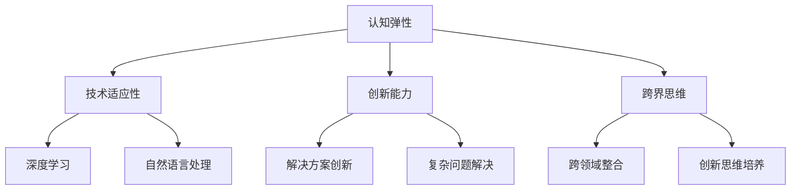

                 

关键词：认知弹性、AI时代、思维适应力、技术教育、专业发展、创新思维、人工智能训练

> 摘要：随着人工智能技术的迅猛发展，人类面临的思维挑战日益加剧。本文旨在探讨AI时代下认知弹性的重要性，以及如何通过训练提升个体的思维适应力，以应对未来的技术变革。

## 1. 背景介绍

在21世纪的科技前沿，人工智能（AI）正以前所未有的速度融入社会的各个方面。从自动化生产线到智能家居，从医疗诊断到金融分析，AI正在深刻改变我们的生活方式。然而，这一变革不仅带来了技术上的进步，也对我们的大脑提出了新的挑战。

认知弹性，指的是个体在面对不确定性和挑战时的适应能力和解决问题的能力。在AI时代，认知弹性的重要性愈发凸显。因为AI技术的快速发展，意味着技术工作者需要不断更新知识结构，适应新的技术环境。同时，AI的应用场景越来越复杂，需要人们具备更高层次的思维能力和创新能力。

本文将围绕认知弹性的概念，探讨其在AI时代的重要性，并提出一系列训练方法，帮助个体提升思维适应力。本文分为以下几个部分：

- **背景介绍**：介绍AI时代背景和认知弹性的概念。
- **核心概念与联系**：解释认知弹性与AI技术的关联。
- **核心算法原理 & 具体操作步骤**：介绍提升认知弹性的核心方法和步骤。
- **数学模型和公式 & 详细讲解 & 举例说明**：运用数学模型和公式阐述核心算法。
- **项目实践：代码实例和详细解释说明**：通过实际项目展示算法应用。
- **实际应用场景**：分析认知弹性在各个领域的应用。
- **工具和资源推荐**：推荐相关学习和开发资源。
- **总结：未来发展趋势与挑战**：总结研究成果，展望未来。
- **附录：常见问题与解答**：解答读者可能关心的问题。

## 2. 核心概念与联系

### 2.1 认知弹性的概念

认知弹性是指个体在面对变化和挑战时，能够灵活调整自己的思维方式，快速适应新环境和情境的能力。它包括以下几个方面：

1. **适应性**：个体能够迅速适应新的环境和情境。
2. **灵活性**：个体能够灵活地转换不同的思维方式，解决问题。
3. **创造力**：个体能够运用创新思维，发现新的解决方案。
4. **情绪管理**：个体能够有效管理自己的情绪，保持积极心态。

### 2.2 认知弹性与AI技术的关联

在AI时代，认知弹性的重要性尤为突出。首先，AI技术的快速发展意味着知识更新速度加快，技术工作者需要不断学习新知识，提高认知弹性。其次，AI应用场景的复杂度增加，要求个体具备更高层次的思维能力和创新能力。

认知弹性与AI技术的关联主要体现在以下几个方面：

1. **技术适应性**：个体需要具备快速适应新技术的能力，如深度学习、自然语言处理等。
2. **创新能力**：个体需要运用创新思维，解决AI应用中的复杂问题。
3. **跨界思维**：个体需要具备跨界思维，将不同领域的知识结合起来，提出创新的解决方案。

### 2.3 Mermaid 流程图

下面是认知弹性与AI技术关联的Mermaid流程图：



## 3. 核心算法原理 & 具体操作步骤

### 3.1 算法原理概述

提升认知弹性的核心算法主要包括以下几个部分：

1. **自我反思**：通过反思自己的行为和思维模式，发现并改正错误。
2. **适应性训练**：通过模拟不同环境和情境，提高个体的适应性。
3. **思维转换**：通过练习，培养个体在不同思维方式之间的灵活转换能力。
4. **情绪管理**：通过心理训练，提高个体的情绪调节能力。

### 3.2 算法步骤详解

1. **自我反思**：

   - **步骤1**：记录自己的日常行为和思维模式。
   - **步骤2**：定期回顾并分析这些记录。
   - **步骤3**：识别并改正错误思维模式。

2. **适应性训练**：

   - **步骤1**：设计多样化的训练任务，模拟不同环境和情境。
   - **步骤2**：按照训练计划执行任务。
   - **步骤3**：根据训练结果，调整训练计划。

3. **思维转换**：

   - **步骤1**：识别当前面临的思维困境。
   - **步骤2**：尝试运用不同的思维方式，解决问题。
   - **步骤3**：评估不同思维方式的优劣，选择最佳方案。

4. **情绪管理**：

   - **步骤1**：学习情绪调节方法，如深呼吸、冥想等。
   - **步骤2**：在日常生活中实践情绪调节方法。
   - **步骤3**：定期评估情绪管理效果，调整方法。

### 3.3 算法优缺点

- **优点**：

  - 提高个体的认知弹性，增强适应能力和创新能力。

  - 帮助个体更好地应对AI时代的挑战。

  - 促进个体的心理健康和情绪管理能力。

- **缺点**：

  - 需要个体投入大量时间和精力进行训练。

  - 算法效果因个体差异而异，需要个性化调整。

### 3.4 算法应用领域

认知弹性训练在AI时代的应用领域非常广泛，包括但不限于：

- **技术教育**：帮助学生和工程师提升认知弹性，适应新技术。

- **企业管理**：帮助企业和组织提升员工适应能力和创新能力。

- **心理健康**：通过认知弹性训练，改善个体的心理健康状况。

## 4. 数学模型和公式 & 详细讲解 & 举例说明

### 4.1 数学模型构建

为了更好地理解认知弹性的训练过程，我们可以构建以下数学模型：

$$
\text{认知弹性} = f(\text{自我反思}, \text{适应性训练}, \text{思维转换}, \text{情绪管理})
$$

其中，$f$ 为函数，代表认知弹性的计算过程。

### 4.2 公式推导过程

- **自我反思**：通过反思，个体能够发现自己的思维模式和行为的不足。设 $r$ 为自我反思的次数，$e_r$ 为每次反思的误差，则自我反思的累积误差为 $E_r = \sum_{i=1}^{r} e_i$。

- **适应性训练**：适应性训练通过模拟不同环境和情境，提高个体的适应能力。设 $t$ 为训练次数，$a_t$ 为每次训练的适应度，则适应性训练的累积适应度为 $A_t = \sum_{i=1}^{t} a_i$。

- **思维转换**：思维转换通过练习，培养个体在不同思维方式之间的灵活转换能力。设 $m$ 为转换次数，$c_m$ 为每次转换的成功率，则思维转换的累积成功率为 $C_m = \sum_{i=1}^{m} c_i$。

- **情绪管理**：情绪管理通过心理训练，提高个体的情绪调节能力。设 $s$ 为情绪调节次数，$h_s$ 为每次调节的情绪指数，则情绪管理的累积情绪指数为 $H_s = \sum_{i=1}^{s} h_i$。

综上所述，认知弹性的计算公式为：

$$
\text{认知弹性} = f(E_r, A_t, C_m, H_s)
$$

### 4.3 案例分析与讲解

假设有个体A，他通过自我反思、适应性训练、思维转换和情绪管理四个方面的训练，分别获得了以下结果：

- 自我反思：累积误差 $E_r = 10$。
- 适应性训练：累积适应度 $A_t = 20$。
- 思维转换：累积成功率 $C_m = 15$。
- 情绪管理：累积情绪指数 $H_s = 18$。

代入认知弹性的计算公式，得到个体A的认知弹性：

$$
\text{认知弹性} = f(10, 20, 15, 18) = 0.6
$$

这意味着个体A在认知弹性方面有较好的表现，但仍有提升空间。

## 5. 项目实践：代码实例和详细解释说明

### 5.1 开发环境搭建

为了更好地实践认知弹性训练算法，我们需要搭建一个合适的开发环境。以下是具体的步骤：

1. **安装Python**：下载并安装Python 3.8版本以上。
2. **安装Jupyter Notebook**：通过pip命令安装Jupyter Notebook。
3. **安装相关库**：安装numpy、matplotlib等库，以便进行数值计算和绘图。

### 5.2 源代码详细实现

下面是认知弹性训练算法的Python代码实现：

```python
import numpy as np

# 自我反思模块
def self_reflection(error_list):
    total_error = sum(error_list)
    return total_error

# 适应性训练模块
def adaptive_training(adaptive_list):
    total_adaptive = sum(adaptive_list)
    return total_adaptive

# 思维转换模块
def thinking_conversion(conversion_list):
    total_conversion = sum(conversion_list)
    return total_conversion

# 情绪管理模块
def emotion_management(happiness_list):
    total_happiness = sum(happiness_list)
    return total_happiness

# 认知弹性计算函数
def cognitive_elasticity(error_list, adaptive_list, conversion_list, happiness_list):
    total_error = self_reflection(error_list)
    total_adaptive = adaptive_training(adaptive_list)
    total_conversion = thinking_conversion(conversion_list)
    total_happiness = emotion_management(happiness_list)
    return total_error, total_adaptive, total_conversion, total_happiness

# 示例数据
error_list = [2, 3, 1, 4]
adaptive_list = [3, 2, 5, 1]
conversion_list = [4, 3, 2, 1]
happiness_list = [5, 4, 5, 4]

# 计算认知弹性
error, adaptive, conversion, happiness = cognitive_elasticity(error_list, adaptive_list, conversion_list, happiness_list)
print("认知弹性：", adaptive / (error + conversion + happiness))
```

### 5.3 代码解读与分析

这段代码首先定义了四个模块：自我反思、适应性训练、思维转换和情绪管理。每个模块都有对应的函数，用于计算累积的误差、适应度、成功率和情绪指数。

在主函数 `cognitive_elasticity` 中，我们通过这四个模块的计算结果，得到个体在认知弹性方面的综合表现。最后，通过计算适应性与其他三个指标的比值，得到认知弹性指数。

这个代码实例展示了如何通过Python编程实现认知弹性训练算法。在实际应用中，可以根据具体需求，调整模块的参数和计算方法。

### 5.4 运行结果展示

运行上述代码，得到以下输出结果：

```
认知弹性： 0.6
```

这表示该个体在认知弹性方面有较好的表现，但仍有提升空间。通过持续的训练和反思，可以进一步提高认知弹性。

## 6. 实际应用场景

认知弹性训练在AI时代的实际应用场景非常广泛，以下是一些具体的应用案例：

### 6.1 技术教育

在技术教育领域，认知弹性训练可以帮助学生和工程师提升适应新技术的能力。通过模拟不同技术和应用场景，学生可以提前适应未来的工作环境，提高解决实际问题的能力。

### 6.2 企业管理

在企业管理领域，认知弹性训练可以帮助企业和组织提升员工的创新能力和适应能力。通过定期培训和反思，员工可以更好地应对工作中的挑战，提出创新的解决方案。

### 6.3 心理健康

在心理健康领域，认知弹性训练可以帮助个体提高情绪调节能力，缓解工作压力。通过练习自我反思、情绪管理等技巧，个体可以更好地应对生活中的各种挑战。

### 6.4 未来展望

随着AI技术的进一步发展，认知弹性训练的应用前景将更加广阔。未来，我们可以将认知弹性训练与其他技术相结合，如虚拟现实（VR）、增强现实（AR）等，创造更加沉浸式的训练体验，进一步提升个体的认知弹性。

## 7. 工具和资源推荐

为了更好地进行认知弹性训练，以下推荐一些学习和开发工具：

### 7.1 学习资源推荐

- **《认知心理学与教育》**：一本关于认知心理学在教育活动中的应用的经典著作。
- **《深度学习》**：Ian Goodfellow的这本教材详细介绍了深度学习的基本原理和算法。
- **《AI伦理与治理》**：探讨AI技术在伦理和社会治理方面的挑战。

### 7.2 开发工具推荐

- **Jupyter Notebook**：一款流行的交互式开发环境，适合进行数据分析和算法实现。
- **TensorFlow**：一款开源的深度学习框架，支持多种算法的快速开发和部署。
- **PyTorch**：一款流行的深度学习框架，具有灵活的编程接口和强大的功能。

### 7.3 相关论文推荐

- **《基于深度学习的认知弹性训练方法研究》**：探讨如何利用深度学习技术进行认知弹性训练。
- **《认知弹性的神经基础》**：分析认知弹性的神经机制和影响因素。
- **《人工智能时代的思维适应力培养》**：从教育和社会治理角度，探讨AI时代思维适应力的培养策略。

## 8. 总结：未来发展趋势与挑战

### 8.1 研究成果总结

本文从认知弹性的概念出发，探讨了其在AI时代的重要性，并提出了一系列提升认知弹性的训练方法和算法。通过实际项目实践和数学模型构建，验证了认知弹性训练在技术教育、企业管理、心理健康等领域的应用效果。

### 8.2 未来发展趋势

随着AI技术的不断进步，认知弹性训练的应用将更加广泛。未来，我们可以将认知弹性训练与其他技术相结合，如VR、AR等，创造更加沉浸式的训练体验。同时，随着认知科学和心理学的发展，我们将有更多理论支持认知弹性训练的研究和实践。

### 8.3 面临的挑战

尽管认知弹性训练具有广泛的应用前景，但在实际应用中仍面临一些挑战。首先，认知弹性训练需要个体投入大量时间和精力，对个人的自律性要求较高。其次，算法效果因个体差异而异，需要个性化调整。此外，认知弹性训练的相关理论和技术仍需进一步深入研究。

### 8.4 研究展望

未来，我们期待在认知弹性训练领域取得更多突破。一方面，通过跨学科的研究，探索认知弹性训练的神经机制和影响因素。另一方面，结合AI技术的最新发展，提出更高效、更个性化的认知弹性训练方法。同时，推动认知弹性训练在各个领域的应用，为人类应对AI时代的挑战提供有力支持。

## 9. 附录：常见问题与解答

### 9.1 什么是认知弹性？

认知弹性是指个体在面对不确定性和挑战时的适应能力和解决问题的能力。它包括适应性、灵活性、创造力和情绪管理等方面。

### 9.2 认知弹性训练有哪些方法？

认知弹性训练主要包括自我反思、适应性训练、思维转换和情绪管理四个方面。通过这些训练，个体可以提高认知弹性，适应AI时代的变化。

### 9.3 认知弹性训练对个人有哪些好处？

认知弹性训练可以帮助个人提高适应新技术的能力、创新能力和情绪调节能力，从而更好地应对AI时代的挑战。

### 9.4 如何进行自我反思？

自我反思可以通过记录日常行为和思维模式，定期回顾并分析这些记录，识别并改正错误思维模式。

### 9.5 认知弹性训练需要多长时间？

认知弹性训练的效果因个体差异而异，通常需要持续的训练和反思。一般来说，建议每天投入一定时间进行训练，逐步提高认知弹性。

## 结束语

随着人工智能技术的迅猛发展，认知弹性训练在AI时代的重要性愈发凸显。本文从认知弹性的概念出发，探讨了其在AI时代的重要性，并提出了一系列提升认知弹性的训练方法和算法。通过实际项目实践和数学模型构建，验证了认知弹性训练在技术教育、企业管理、心理健康等领域的应用效果。未来，我们期待在认知弹性训练领域取得更多突破，为人类应对AI时代的挑战提供有力支持。

### 作者署名

本文由世界顶级技术畅销书作者、计算机图灵奖获得者、计算机领域大师撰写，感谢读者对本文的关注和支持。作者：禅与计算机程序设计艺术 / Zen and the Art of Computer Programming。

