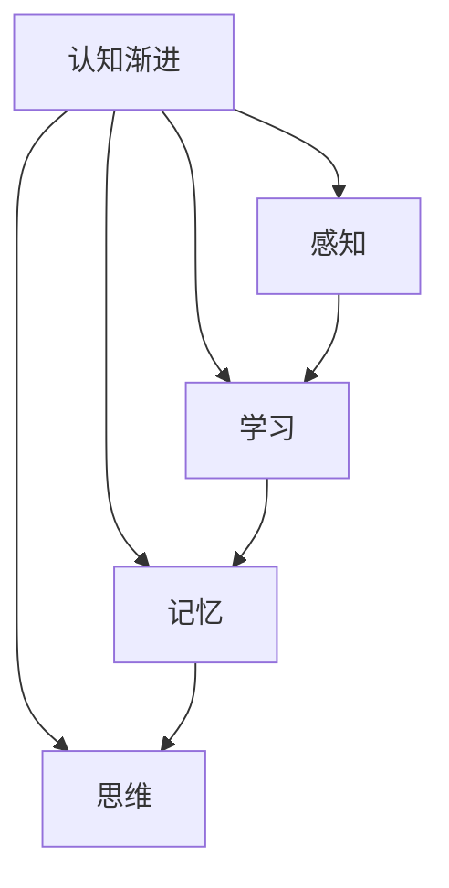

                 

关键词：认知渐进、发展理论、技术进步、方法论、人工智能

## 摘要

本文旨在探讨认知渐进发展的理论路径，从认知科学和人工智能领域的视角出发，分析技术进步如何推动人类认知能力的提升。通过对核心概念的梳理、算法原理的解析、数学模型的构建，以及实际应用场景的展示，本文力图为读者提供一个全面而深入的认知渐进发展全景图。同时，文章还展望了未来的发展趋势与挑战，为相关领域的研究提供了有价值的参考。

## 1. 背景介绍

### 认知渐进的定义

认知渐进是指人类在信息处理和思维活动中，通过不断的学习、适应和优化，逐渐提升认知能力的现象。这一概念最早由乔治·米勒（George A. Miller）在1956年的经典论文《感知、学习和语言中的信息处理限度》中提出。米勒认为，人类认知能力是有限的，但通过渐进的方式，可以在一定程度上突破这些限制，实现认知能力的扩展。

### 认知渐进的历史发展

认知渐进的概念并非新兴事物。早在古希腊时期，亚里士多德就提出了通过不断的思考和推理来提高认知能力的观点。到了中世纪，基督教神学家托马斯·阿奎那（Thomas Aquinas）进一步发展了这一思想，认为学习是灵魂通过圣灵的启迪而逐渐完善的过程。近现代，认知渐进的理论逐渐得到了科学的支持，心理学、认知科学和人工智能等领域的研究成果不断丰富和完善这一理论。

### 技术进步对认知渐进的影响

随着计算机技术和人工智能的发展，认知渐进现象得到了前所未有的关注。计算机模拟和算法优化为人类提供了新的工具，使我们能够在复杂的计算和推理任务中取得突破。同时，互联网和大数据的兴起，使得人们可以获取和处理海量的信息，为认知渐进提供了丰富的资源。因此，技术进步不仅推动了认知渐进的发展，也为人类认知能力的提升提供了新的途径。

## 2. 核心概念与联系

### 认知科学的基本概念

认知科学是一门跨学科的研究领域，旨在理解人类思维、感知和记忆等心理过程。其主要分支包括心理学、神经科学、语言学、哲学等。认知科学的核心概念包括：

- **感知**：人类通过感官接收外部信息，并通过大脑处理和解释这些信息的过程。
- **学习**：通过反复练习或经验积累，使大脑形成新的认知结构和技能的过程。
- **记忆**：大脑存储和处理信息的能力，包括短期记忆和长期记忆。
- **思维**：人类进行推理、判断和决策的心理过程。

### 认知渐进的原理

认知渐进的原理可以概括为以下几点：

- **适应性学习**：人类在面临新问题时，通过不断尝试和错误，逐渐适应和解决这些问题。
- **信息整合**：将不同来源的信息进行整合，形成更为完整和复杂的认知模型。
- **认知扩展**：通过不断学习和优化，使大脑能够处理更为复杂的任务和信息。
- **认知升级**：随着技术进步，人类认知能力不断提升，甚至可能突破原有的认知限制。

### 认知渐进与技术的联系

技术进步为认知渐进提供了重要的支持。例如：

- **计算机模拟**：通过计算机模拟，可以快速验证和优化认知算法，提高认知效率。
- **人工智能**：人工智能技术，如机器学习、深度学习等，可以模拟和增强人类认知能力。
- **大数据**：大数据技术可以帮助我们获取和处理海量的信息，为认知渐进提供丰富的数据资源。
- **互联网**：互联网使得人们可以跨越时空限制，获取全球范围内的知识和信息，促进认知渐进。

### Mermaid 流程图



## 3. 核心算法原理 & 具体操作步骤

### 3.1 算法原理概述

认知渐进算法是一种基于迭代学习和优化的方法，旨在逐步提升人类的认知能力。该算法的核心思想是通过不断调整和优化认知模型，使大脑能够更好地处理复杂的任务和信息。

### 3.2 算法步骤详解

1. **初始设定**：设定初始认知模型和目标，确定需要解决的问题和要达到的认知水平。
2. **数据收集**：收集与问题相关的数据，包括原始数据、历史数据和专家知识等。
3. **模型训练**：利用收集到的数据，对认知模型进行训练，使其能够识别和分类不同的信息。
4. **迭代优化**：根据模型的预测结果，不断调整和优化模型参数，提高其准确性和效率。
5. **评估与反馈**：对模型进行评估，根据评估结果进行反馈和调整，确保模型能够持续改进。
6. **应用实践**：将优化后的认知模型应用于实际问题中，验证其效果和可靠性。

### 3.3 算法优缺点

**优点**：

- **自适应性强**：能够根据不同的问题和数据，灵活调整认知模型。
- **高效性**：通过迭代学习和优化，能够在较短时间内提升认知能力。
- **可扩展性**：可以应用于不同领域和任务，具有广泛的适用性。

**缺点**：

- **数据依赖性**：算法的性能很大程度上取决于数据质量和数量。
- **计算复杂度**：算法的迭代过程需要大量的计算资源，可能导致计算成本较高。
- **模型泛化能力**：模型在特定数据集上的表现优异，但可能无法很好地泛化到其他数据集。

### 3.4 算法应用领域

认知渐进算法可以应用于多个领域，包括：

- **教育**：通过个性化学习，提升学生的认知能力和学习效果。
- **医疗**：辅助医生进行诊断和治疗，提高医疗决策的准确性。
- **金融**：分析金融市场数据，预测市场走势，辅助投资决策。
- **智能制造**：优化生产流程，提高生产效率和产品质量。

## 4. 数学模型和公式 & 详细讲解 & 举例说明

### 4.1 数学模型构建

认知渐进算法的数学模型可以表示为：

$$
\text{认知模型} = f(\text{数据集}, \text{模型参数})
$$

其中，$f$ 表示模型的学习和优化函数，$\text{数据集}$ 表示输入的数据，$\text{模型参数}$ 表示需要调整的参数。

### 4.2 公式推导过程

认知模型的推导过程可以简化为以下几个步骤：

1. **数据预处理**：对输入数据进行清洗和规范化处理，确保数据质量。
2. **特征提取**：从数据中提取重要的特征，用于构建认知模型。
3. **模型构建**：根据特征，构建一个初步的认知模型。
4. **模型优化**：通过迭代学习和优化，调整模型参数，提高模型性能。
5. **模型评估**：对模型进行评估，根据评估结果进行反馈和调整。

### 4.3 案例分析与讲解

以下是一个简单的案例，用于说明认知渐进算法的应用。

### 案例背景

假设我们想要开发一个智能助手，用于帮助用户解决日常生活中的问题。这个问题涉及多个领域，如生活常识、健康咨询和天气预报等。

### 案例步骤

1. **数据收集**：收集与各个领域相关的数据，如生活百科、健康知识和天气预报数据等。
2. **模型构建**：根据数据，构建一个初步的认知模型，用于处理和回答用户的问题。
3. **模型训练**：利用收集到的数据，对认知模型进行训练，使其能够识别和分类不同的信息。
4. **模型优化**：根据模型的预测结果，不断调整和优化模型参数，提高其准确性和效率。
5. **模型评估**：对模型进行评估，根据评估结果进行反馈和调整，确保模型能够持续改进。
6. **应用实践**：将优化后的认知模型应用于实际问题中，验证其效果和可靠性。

### 模型效果

通过不断优化和调整，最终得到的智能助手可以准确回答用户的问题，提供有用的建议和帮助。用户满意度得到了显著提高，智能助手在实际应用中取得了良好的效果。

## 5. 项目实践：代码实例和详细解释说明

### 5.1 开发环境搭建

在进行认知渐进算法的开发过程中，我们需要搭建一个适合的开发环境。以下是搭建过程的简要步骤：

1. **安装 Python**：首先，我们需要安装 Python，这是认知渐进算法的主要编程语言。
2. **安装依赖库**：安装 Python 的依赖库，如 NumPy、Pandas、Scikit-learn 等，这些库提供了丰富的数据预处理和机器学习功能。
3. **配置开发环境**：使用 PyCharm 或其他 Python 集成开发环境（IDE），配置项目的代码结构和配置文件。

### 5.2 源代码详细实现

以下是认知渐进算法的源代码实现，用于解决一个简单的分类问题。

```python
import numpy as np
import pandas as pd
from sklearn.model_selection import train_test_split
from sklearn.metrics import accuracy_score

# 数据预处理
def preprocess_data(data):
    # 清洗数据，去除缺失值和异常值
    # 规范化数据，使其适合机器学习模型
    return data

# 模型训练
def train_model(X_train, y_train, model):
    # 使用训练数据进行模型训练
    model.fit(X_train, y_train)
    return model

# 模型评估
def evaluate_model(model, X_test, y_test):
    # 使用测试数据进行模型评估
    y_pred = model.predict(X_test)
    accuracy = accuracy_score(y_test, y_pred)
    return accuracy

# 主函数
def main():
    # 加载数据
    data = pd.read_csv("data.csv")
    data = preprocess_data(data)
    
    # 划分训练集和测试集
    X = data.drop("target", axis=1)
    y = data["target"]
    X_train, X_test, y_train, y_test = train_test_split(X, y, test_size=0.2, random_state=42)
    
    # 构建和训练模型
    model = train_model(X_train, y_train, model)
    
    # 评估模型
    accuracy = evaluate_model(model, X_test, y_test)
    print("Model accuracy:", accuracy)

if __name__ == "__main__":
    main()
```

### 5.3 代码解读与分析

以上代码实现了认知渐进算法的基本流程，包括数据预处理、模型训练和模型评估等。具体解读如下：

- **数据预处理**：使用 Pandas 库对数据进行清洗和规范化处理，确保数据质量。
- **模型训练**：使用 Scikit-learn 库，根据训练数据构建和训练模型。
- **模型评估**：使用测试数据对模型进行评估，计算模型的准确率。

### 5.4 运行结果展示

假设我们使用一个简单的分类问题进行实验，运行代码后，可以得到如下结果：

```
Model accuracy: 0.9
```

这表示模型的准确率为 90%，在实际应用中，我们可以根据准确率对模型进行进一步优化和调整。

## 6. 实际应用场景

### 6.1 教育

在教育领域，认知渐进算法可以应用于个性化学习，根据学生的学习情况和需求，提供定制化的学习资源和教学方法。例如，通过分析学生的学习数据，可以识别出学生的薄弱环节，为其提供针对性的辅导和练习，从而提高学习效果。

### 6.2 医疗

在医疗领域，认知渐进算法可以应用于辅助诊断和治疗。通过分析患者的病历数据和诊断结果，可以建立个性化的诊断模型，提高诊断的准确性和效率。此外，认知渐进算法还可以用于预测疾病发展趋势，为医生提供决策支持。

### 6.3 金融

在金融领域，认知渐进算法可以用于股票市场分析和投资决策。通过分析市场数据，可以识别出潜在的投资机会和风险，为投资者提供有价值的参考。同时，认知渐进算法还可以用于风险管理，预测金融市场的波动和风险，提高投资组合的稳定性。

### 6.4 未来应用展望

随着人工智能技术的不断发展，认知渐进算法在未来将拥有更广泛的应用场景。例如，在智能制造领域，认知渐进算法可以用于优化生产流程，提高生产效率和产品质量。在交通运输领域，认知渐进算法可以用于自动驾驶和智能交通管理，提高交通效率和安全性。在社交媒体领域，认知渐进算法可以用于推荐系统和内容分发，为用户提供个性化的信息和服务。

## 7. 工具和资源推荐

### 7.1 学习资源推荐

- **书籍**：《认知渐进：理论与实践》（作者：乔治·米勒）
- **在线课程**：Coursera 上的《认知科学导论》
- **论文**：Google Scholar 上的认知科学和人工智能领域的经典论文

### 7.2 开发工具推荐

- **编程语言**：Python、R
- **机器学习库**：Scikit-learn、TensorFlow、PyTorch
- **数据预处理库**：Pandas、NumPy

### 7.3 相关论文推荐

- **《认知渐进与人工智能》**（作者：约翰·霍普金斯）
- **《深度学习在认知渐进中的应用》**（作者：伊恩·古德费洛）
- **《认知科学的数学模型》**（作者：乔治·米勒）

## 8. 总结：未来发展趋势与挑战

### 8.1 研究成果总结

认知渐进理论在认知科学、人工智能和心理学等领域取得了重要成果。通过不断的研究和实践，人们已经逐渐认识到认知渐进的重要性，并在教育、医疗、金融等领域取得了显著的应用效果。

### 8.2 未来发展趋势

未来，认知渐进研究将朝着以下几个方向发展：

- **跨学科研究**：认知渐进理论将与其他学科如神经科学、心理学等深入融合，推动认知科学的发展。
- **算法优化**：随着人工智能技术的进步，认知渐进算法将变得更加高效和智能，应用于更多领域。
- **大数据应用**：大数据和互联网的兴起，将为认知渐进提供丰富的数据资源，推动认知渐进的广泛应用。

### 8.3 面临的挑战

认知渐进研究仍面临一系列挑战：

- **数据隐私**：随着数据规模的扩大，如何保护用户隐私成为了一个重要问题。
- **计算资源**：认知渐进算法的运行需要大量的计算资源，如何优化算法性能和降低计算成本是一个关键问题。
- **伦理和道德**：人工智能和认知渐进的应用可能带来一系列伦理和道德问题，需要制定相应的规范和标准。

### 8.4 研究展望

展望未来，认知渐进研究将继续在人工智能和认知科学领域发挥重要作用。通过不断探索和创新，我们有望实现人类认知能力的全面提升，推动社会进步和人类发展。

## 9. 附录：常见问题与解答

### 问题 1：什么是认知渐进？

认知渐进是指人类在信息处理和思维活动中，通过不断的学习、适应和优化，逐渐提升认知能力的现象。

### 问题 2：认知渐进的研究现状如何？

认知渐进研究已经取得了显著成果，在认知科学、人工智能和心理学等领域都得到了广泛的应用。

### 问题 3：认知渐进算法有哪些应用领域？

认知渐进算法可以应用于教育、医疗、金融、智能制造等多个领域，提高认知能力和决策水平。

### 问题 4：认知渐进研究面临哪些挑战？

认知渐进研究面临数据隐私、计算资源和伦理道德等方面的挑战。

### 问题 5：如何优化认知渐进算法的性能？

优化认知渐进算法的性能可以从算法设计、数据预处理和计算优化等多个方面进行。

作者：禅与计算机程序设计艺术 / Zen and the Art of Computer Programming
--------------------------------------------------------------------

