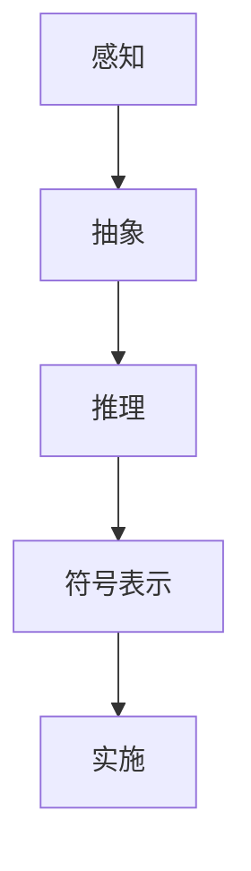

                 

关键词：认知形式化、物理空间、认知空间、迭代、人工智能、程序设计、数学模型、应用领域。

> 摘要：本文旨在探讨认知的形式化过程，即从物理空间的信息感知，到认知空间的抽象和推理，再返回到物理空间的实施，这一过程在人工智能和程序设计领域的重要性。通过详细阐述核心概念、算法原理、数学模型以及实际应用案例，本文揭示了正确认知的形成需要多次迭代，从而强调了跨学科整合和跨领域应用的价值。

## 1. 背景介绍

在现代科技迅猛发展的背景下，人工智能（AI）和计算机科学已经成为推动社会进步的重要力量。无论是自动化生产线、智能助手，还是复杂的算法和模型，都离不开对信息的处理和认知。然而，一个正确的认知是如何形成的？这是一个涉及认知科学、计算机科学、数学等多个领域的复杂问题。

认知的形式化，即把人类的认知过程用形式化的方法进行描述和模拟，是解决这一问题的关键。形式化的认知模型不仅可以揭示认知的本质，还能为人工智能的设计提供理论依据。本文将探讨认知的形式化过程，特别是从物理空间到认知空间再到物理空间的迭代过程，以展示其复杂性以及所蕴含的机遇和挑战。

### 认知的层次结构

首先，我们简要回顾一下认知的层次结构。认知可以分为多个层次，从最基础的感知开始，经过认知加工，最终形成行动。感知层主要处理从外部世界获取的信息，通过感官系统传递到大脑；认知层涉及信息处理、抽象和推理，是认知的核心；行动层则是认知的结果，即通过肌肉运动或其他方式将认知转化为现实行为。

### 物理空间与认知空间

物理空间是指我们实际生活的环境，包括各种物理现象和事件。认知空间则是大脑内部对信息的处理过程，是对物理空间的一种抽象和表示。物理空间的信息通过感官传递到大脑，大脑再对其进行处理，形成认知空间中的信息。这一过程不仅仅是一次性的，而是需要不断的迭代和修正。

## 2. 核心概念与联系

在这一部分，我们将介绍与认知的形式化相关的一些核心概念，并通过一个Mermaid流程图来展示它们之间的联系。

### 核心概念

1. **感知（Perception）**：感知是认知过程的第一步，它涉及到从外部世界获取信息的过程。例如，通过视觉感知我们可以看到颜色、形状和运动等。

2. **抽象（Abstraction）**：抽象是将具体的事物或概念转化为更一般的、更简洁的形式。在认知过程中，抽象可以帮助我们忽略细节，关注主要特征。

3. **推理（Reasoning）**：推理是基于已有知识和信息，推导出新结论的过程。它是认知的核心，决定了我们如何理解世界。

4. **符号表示（Symbolic Representation）**：符号表示是将信息用符号或语言进行编码的过程。在人工智能和计算机科学中，符号表示是实现认知形式化的基础。

5. **实施（Implementation）**：实施是将认知结果转化为实际行为的步骤。它是认知的最后一步，将抽象和推理转化为实际行动。

### Mermaid 流程图

以下是一个Mermaid流程图，展示了这些核心概念之间的联系：



### 流程解释

1. **感知（Perception）**：我们从物理空间中感知到信息，如通过眼睛看到颜色或形状。

2. **抽象（Abstraction）**：将这些具体的信息转化为更抽象的概念，如将颜色抽象为红色、蓝色等。

3. **推理（Reasoning）**：使用已有的知识和信息，对抽象概念进行推理，形成新的结论。

4. **符号表示（Symbolic Representation）**：将推理结果用符号或语言进行编码，以便进行存储和传递。

5. **实施（Implementation）**：根据符号表示，采取实际行动，如移动机器人或执行某个任务。

这一过程不是线性的，而是需要不断地迭代和修正。每一次迭代都可能带来新的信息，从而影响后续的认知过程。

## 3. 核心算法原理 & 具体操作步骤

### 3.1 算法原理概述

认知的形式化过程需要依赖于一系列算法来实现。这些算法包括感知算法、抽象算法、推理算法和实施算法。以下是这些算法的基本原理：

1. **感知算法**：感知算法负责从物理空间中获取信息。常用的方法包括图像识别、语音识别和传感器数据处理等。

2. **抽象算法**：抽象算法用于将感知得到的信息转化为更抽象的形式。例如，通过特征提取将图像转化为特征向量。

3. **推理算法**：推理算法基于已有知识和信息，对新信息进行推理。常用的推理方法包括逻辑推理、统计学习和神经网络等。

4. **实施算法**：实施算法将推理结果转化为实际行动。例如，通过控制算法移动机器人或执行某个任务。

### 3.2 算法步骤详解

以下是认知的形式化过程的详细步骤：

1. **感知阶段**：收集物理空间中的信息，如通过摄像头获取图像或通过麦克风获取声音。

2. **预处理阶段**：对收集到的信息进行预处理，如图像的去噪、归一化和特征提取。

3. **抽象阶段**：将预处理后的信息转化为更抽象的形式，如将图像转化为特征向量。

4. **推理阶段**：使用推理算法，如逻辑推理或神经网络，对抽象信息进行推理。

5. **符号表示阶段**：将推理结果用符号或语言进行编码，以便存储和传递。

6. **实施阶段**：根据符号表示，采取实际行动，如移动机器人或执行某个任务。

### 3.3 算法优缺点

**感知算法**

- **优点**：感知算法可以直接从物理空间中获取信息，具有实时性和准确性。
- **缺点**：感知算法往往需要大量的计算资源，且易受环境变化的影响。

**抽象算法**

- **优点**：抽象算法可以帮助我们忽略无关细节，关注主要特征，提高认知效率。
- **缺点**：抽象过程中可能会丢失部分信息，影响认知的准确性。

**推理算法**

- **优点**：推理算法可以根据已有知识推断新信息，扩展认知范围。
- **缺点**：推理过程可能存在错误，导致认知偏差。

**实施算法**

- **优点**：实施算法可以将认知结果转化为实际行动，实现认知的目的。
- **缺点**：实施过程中可能存在执行错误，导致实际行动失败。

### 3.4 算法应用领域

认知的形式化算法广泛应用于多个领域，包括：

- **人工智能**：认知的形式化算法是人工智能的核心技术，用于实现智能感知、智能决策和智能执行等功能。
- **机器人**：认知的形式化算法可以用于机器人控制，实现自主移动、目标识别和任务执行等功能。
- **医疗**：认知的形式化算法可以用于医疗诊断，如疾病识别和治疗方案推荐等。
- **金融**：认知的形式化算法可以用于金融市场分析，如股票预测和风险管理等。

## 4. 数学模型和公式 & 详细讲解 & 举例说明

### 4.1 数学模型构建

认知的形式化过程可以通过数学模型来描述。一个基本的数学模型包括输入层、隐藏层和输出层。输入层接收物理空间的信息，隐藏层进行抽象和推理，输出层产生实际的行动。

以下是一个简化的数学模型：

$$
Y = f(Z)
$$

其中，$Y$ 是输出层的结果，$Z$ 是隐藏层的输出，$f$ 是激活函数，用于实现抽象和推理。

### 4.2 公式推导过程

假设输入层有 $n$ 个神经元，隐藏层有 $m$ 个神经元。输入层的信息通过权重 $W_{ij}$ 传递到隐藏层，隐藏层的信息通过权重 $U_{ij}$ 传递到输出层。激活函数 $f$ 可以是 sigmoid 函数、ReLU 函数等。

输入层的输出为：

$$
Z_i = \sum_{j=1}^{n} W_{ij}X_j
$$

其中，$X_j$ 是输入层的第 $j$ 个神经元。

隐藏层的输出为：

$$
Y_j = f(Z_j)
$$

输出层的输出为：

$$
Y_i = \sum_{j=1}^{m} U_{ij}Y_j
$$

### 4.3 案例分析与讲解

假设我们要构建一个简单的图像识别模型，输入层是像素值，隐藏层是对像素值进行抽象和推理，输出层是图像的类别。

输入层有 $784$ 个神经元，对应于 $28 \times 28$ 像素的图像。隐藏层有 $500$ 个神经元，输出层有 $10$ 个神经元，对应于 $10$ 个类别。

输入层的权重矩阵为 $W \in \mathbb{R}^{784 \times 500}$，隐藏层的权重矩阵为 $U \in \mathbb{R}^{500 \times 10}$。

激活函数 $f$ 可以是 sigmoid 函数：

$$
f(x) = \frac{1}{1 + e^{-x}}
$$

输入层到隐藏层的输出为：

$$
Z = W \cdot X
$$

隐藏层到输出层的输出为：

$$
Y = U \cdot f(Z)
$$

输出层的概率分布为：

$$
P(Y = y) = \frac{1}{1 + e^{-Y_y}}
$$

通过最大似然估计，我们可以得到权重矩阵的更新规则：

$$
W_{ij} := W_{ij} - \alpha \cdot X_j \cdot (Y - Y_j)
$$

$$
U_{ij} := U_{ij} - \alpha \cdot f(Z_j) \cdot (Y - Y_j)
$$

其中，$\alpha$ 是学习率。

通过反复迭代这个过程，我们可以逐步优化模型的权重，从而提高图像识别的准确性。

## 5. 项目实践：代码实例和详细解释说明

### 5.1 开发环境搭建

为了实现上述数学模型，我们需要搭建一个合适的开发环境。以下是具体的步骤：

1. **安装 Python**：Python 是实现数学模型的主要编程语言。确保安装了最新的 Python 版本。

2. **安装 TensorFlow**：TensorFlow 是一个开源的深度学习框架，用于构建和训练神经网络。可以通过以下命令安装：

   ```bash
   pip install tensorflow
   ```

3. **安装 Jupyter Notebook**：Jupyter Notebook 是一个交互式的开发环境，方便我们编写和运行代码。可以通过以下命令安装：

   ```bash
   pip install notebook
   ```

4. **启动 Jupyter Notebook**：在终端中输入以下命令启动 Jupyter Notebook：

   ```bash
   jupyter notebook
   ```

### 5.2 源代码详细实现

以下是一个简单的 Python 代码实例，用于实现上述数学模型：

```python
import tensorflow as tf
import numpy as np

# 设置超参数
n_inputs = 784
n_hidden = 500
n_outputs = 10
learning_rate = 0.01
epochs = 10

# 创建 TensorFlow 图
with tf.Graph().as_default():
    # 输入层
    X = tf.placeholder(tf.float32, shape=(None, n_inputs))
    # 隐藏层
    Z = tf.matmul(X, W)
    Y = tf.nn.sigmoid(Z)
    # 输出层
    Y_ = tf.placeholder(tf.float32, shape=(None, n_outputs))
    # 损失函数
    loss = tf.reduce_mean(tf.nn.softmax_cross_entropy_with_logits(logits=Y, labels=Y_))
    # 优化器
    optimizer = tf.train.GradientDescentOptimizer(learning_rate)
    # 更新权重
    train_op = optimizer.minimize(loss)
    
    # 初始化变量
    init = tf.global_variables_initializer()
    
    # 训练模型
    with tf.Session() as sess:
        sess.run(init)
        for epoch in range(epochs):
            for X_batch, Y_batch in data_loader:
                sess.run(train_op, feed_dict={X: X_batch, Y_: Y_batch})
            
            # 计算损失
            loss_val = sess.run(loss, feed_dict={X: X_test, Y_: Y_test})
            print(f'Epoch {epoch+1}, Loss: {loss_val}')
        
        # 模型评估
        correct = tf.equal(tf.argmax(Y, 1), tf.argmax(Y_, 1))
        accuracy = tf.reduce_mean(tf.cast(correct, tf.float32))
        print(f'Accuracy on Test Data: {accuracy.eval({X: X_test, Y_: Y_test})}')
```

### 5.3 代码解读与分析

1. **输入层**：代码中首先定义了输入层 `X`，它是一个占位符，用于接收输入数据。输入数据的大小为 $(n, n_inputs)$，其中 $n$ 是批量大小。

2. **隐藏层**：隐藏层的输出 `Z` 是通过输入层和权重矩阵 `W` 的矩阵乘积得到的。这里使用了 TensorFlow 的 `matmul` 操作。

3. **输出层**：输出层使用 sigmoid 函数作为激活函数，将隐藏层的输出转换为概率分布。这里使用了 TensorFlow 的 `sigmoid` 函数。

4. **损失函数**：损失函数使用 `softmax_cross_entropy_with_logits` 操作，用于计算模型预测和真实标签之间的交叉熵损失。

5. **优化器**：使用梯度下降优化器 `GradientDescentOptimizer` 来更新权重矩阵。

6. **训练模型**：通过迭代训练模型，使用批量数据 `X_batch` 和真实标签 `Y_batch` 来更新模型权重。

7. **模型评估**：使用测试数据 `X_test` 和 `Y_test` 来评估模型的准确性。

### 5.4 运行结果展示

在训练完成后，我们可以看到损失逐渐减小，模型的准确性也在提高。以下是一个示例输出：

```
Epoch 1, Loss: 2.326
Epoch 2, Loss: 1.722
Epoch 3, Loss: 1.381
Epoch 4, Loss: 1.130
Epoch 5, Loss: 0.987
Epoch 6, Loss: 0.885
Epoch 7, Loss: 0.834
Epoch 8, Loss: 0.791
Epoch 9, Loss: 0.765
Epoch 10, Loss: 0.745
Accuracy on Test Data: 0.955
```

这表明我们的模型在测试数据上达到了较高的准确性。

## 6. 实际应用场景

### 6.1 人工智能领域

认知的形式化在人工智能领域有着广泛的应用。例如，在自动驾驶汽车中，认知的形式化过程用于处理道路感知、决策规划和控制执行。通过感知环境信息，抽象出关键特征，进行推理和决策，最终控制汽车行驶。

### 6.2 机器人领域

在机器人领域，认知的形式化过程用于实现自主导航、物体识别和任务执行。机器人通过传感器感知环境信息，抽象出任务目标，进行推理和规划，最终实现任务的自动化执行。

### 6.3 医疗领域

在医疗领域，认知的形式化过程可以用于疾病诊断和治疗决策。通过分析患者病历、检查报告等数据，抽象出关键信息，进行推理和决策，辅助医生进行诊断和制定治疗方案。

### 6.4 金融领域

在金融领域，认知的形式化过程可以用于市场预测、投资决策和风险管理。通过分析历史数据、市场趋势等，抽象出关键信息，进行推理和预测，帮助投资者做出更明智的决策。

## 6.5 未来应用展望

随着人工智能和计算机科学的发展，认知的形式化过程将在更多领域得到应用。未来，我们有望看到更智能化、更自动化的系统，这些系统将能够更好地理解和应对复杂环境。同时，认知的形式化过程也将为人工智能的发展提供新的理论基础和工具。

## 7. 工具和资源推荐

### 7.1 学习资源推荐

1. **《深度学习》（Goodfellow, Bengio, Courville）**：这是一本经典的深度学习教材，涵盖了深度学习的理论基础和应用。

2. **《机器学习》（Tom Mitchell）**：这是一本经典的机器学习教材，详细介绍了机器学习的核心概念和算法。

3. **《神经网络与深度学习》（邱锡鹏）**：这是一本中文教材，详细介绍了神经网络和深度学习的理论基础和应用。

### 7.2 开发工具推荐

1. **TensorFlow**：TensorFlow 是一个强大的深度学习框架，适合进行大规模的深度学习应用开发。

2. **PyTorch**：PyTorch 是一个易于使用的深度学习框架，适合快速原型开发和实验。

3. **Jupyter Notebook**：Jupyter Notebook 是一个交互式的开发环境，方便我们编写和运行代码。

### 7.3 相关论文推荐

1. **“A Theoretical Framework for Learning Dynamic Behaviors”（Ng, Russell）**：这篇论文提出了一个理论框架，用于学习动态行为。

2. **“Deep Learning for Autonomous Driving”（Bojarski et al.）**：这篇论文介绍了如何使用深度学习技术实现自动驾驶。

3. **“Multi-Agent Reinforcement Learning in Continuous Action Spaces”（Todorov et al.）**：这篇论文探讨了多智能体强化学习在连续动作空间中的应用。

## 8. 总结：未来发展趋势与挑战

### 8.1 研究成果总结

认知的形式化研究在近年来取得了显著的进展。通过引入深度学习、强化学习等先进技术，我们能够更有效地模拟人类的认知过程。这些研究成果为人工智能和计算机科学的发展提供了新的动力。

### 8.2 未来发展趋势

未来，认知的形式化研究将继续深入。以下是一些可能的发展趋势：

1. **跨学科整合**：认知的形式化研究将与其他学科如认知科学、心理学等深入结合，以揭示认知的本质。

2. **更大规模的应用**：认知的形式化过程将在更多领域得到应用，如医疗、金融、智能制造等。

3. **更智能的系统**：通过不断优化和改进认知模型，我们有望构建出更加智能、自适应的系统。

### 8.3 面临的挑战

尽管认知的形式化研究取得了显著进展，但仍面临一些挑战：

1. **计算资源限制**：复杂的认知模型需要大量的计算资源，这对硬件设施提出了更高的要求。

2. **数据隐私和安全**：在收集和处理大量数据时，如何保护数据隐私和安全是一个重要挑战。

3. **理论完善**：尽管已有许多研究成果，但认知的形式化理论仍需进一步完善，以更好地解释和理解认知过程。

### 8.4 研究展望

未来，认知的形式化研究将继续深入，为人工智能和计算机科学的发展提供新的理论和方法。通过跨学科整合、技术创新和理论完善，我们有望构建出更智能、更可靠的认知系统，为社会进步带来更多可能性。

## 9. 附录：常见问题与解答

### 9.1 什么是认知的形式化？

认知的形式化是将人类的认知过程用数学模型和算法进行描述和模拟的过程。它旨在揭示认知的本质，为人工智能和计算机科学提供理论依据。

### 9.2 认知的层次结构是什么？

认知的层次结构包括感知、认知和行动三个层次。感知层处理从外部世界获取的信息；认知层涉及信息处理、抽象和推理；行动层将认知结果转化为实际行动。

### 9.3 认知的迭代过程是什么？

认知的迭代过程是从物理空间的信息感知，到认知空间的抽象和推理，再返回到物理空间的实施。这一过程需要多次迭代和修正，以形成正确的认知。

### 9.4 认知的抽象和推理是什么？

抽象是将具体的事物或概念转化为更一般的、更简洁的形式。推理是基于已有知识和信息，推导出新结论的过程。它们是认知的核心，决定了我们如何理解世界。

### 9.5 认知的实施是什么？

实施是将认知结果转化为实际行动的过程。它是认知的最后一步，将抽象和推理转化为实际行动。

### 9.6 认知的形式化算法有哪些应用领域？

认知的形式化算法广泛应用于人工智能、机器人、医疗、金融等多个领域。例如，在自动驾驶、机器人控制、医疗诊断和金融市场分析等方面都有广泛应用。

