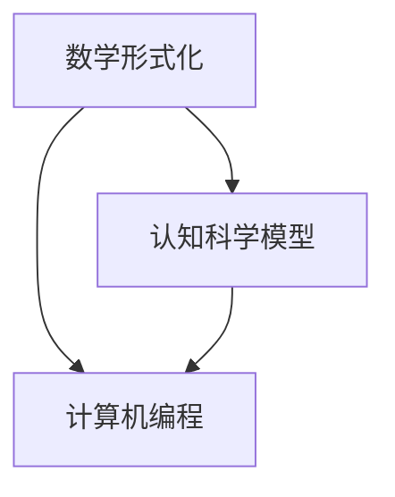

                 

关键词：数学形式化、认知科学、算法原理、宇宙模拟、计算机编程

## 摘要

本文旨在探讨数学形式化在认知科学中的应用，尤其是如何在计算机编程中利用数学来解释宇宙的本质。通过分析核心概念、算法原理、数学模型及项目实践，本文揭示了数学形式化对于理解宇宙规律的重要性，并展望了未来在该领域的研究趋势与挑战。

## 1. 背景介绍

宇宙的本质一直以来都是人类探索的重要领域，而数学作为描述宇宙规律的强大工具，在科学研究中扮演了至关重要的角色。从牛顿的万有引力定律到爱因斯坦的相对论，数学形式化不仅帮助我们理解了宇宙的基本原理，还推动了科学技术的进步。

然而，当我们深入探讨宇宙的本质时，我们会发现宇宙本身并不包含数学，而是数学被用来解释宇宙现象。这种看似矛盾的现象促使我们思考：是否有一种形式化的方法，可以让我们通过数学理解宇宙的运作机制？这便是本文的核心问题。

### 1.1 认知科学的发展

认知科学是研究人类认知过程的学科，它涵盖了心理学、神经科学、计算机科学等多个领域。随着神经科学和计算机科学的快速发展，认知科学逐渐形成了一套形式化的研究方法，以数学模型和算法为基础，对人类认知进行建模和模拟。

### 1.2 计算机编程的重要性

计算机编程是现代科技的核心，它不仅是实现数学模型和算法的工具，还是理解和模拟宇宙规律的重要手段。通过编程，我们可以将复杂的数学概念转化为具体的程序，从而更直观地理解宇宙的运作机制。

## 2. 核心概念与联系

为了更好地理解数学形式化在认知科学中的应用，我们需要先了解几个核心概念，并展示它们之间的联系。

### 2.1 数学形式化的概念

数学形式化是指使用数学语言和方法对现实世界的现象进行建模和描述。这种方法可以让我们更精确地理解现象的本质，并从中提取有用的信息。

### 2.2 认知科学的模型

认知科学通过构建数学模型来模拟人类认知过程，如感知、记忆、学习等。这些模型可以帮助我们理解认知机制，并为计算机编程提供理论基础。

### 2.3 计算机编程与数学形式化的联系

计算机编程是实现数学模型的重要手段。通过编程，我们可以将复杂的数学模型转化为可运行的程序，从而验证和优化模型。

下面是一个使用 Mermaid 语言的流程图，展示上述概念之间的联系：



## 3. 核心算法原理 & 具体操作步骤

在了解了核心概念之后，我们来探讨一些关键算法的原理和具体操作步骤。

### 3.1 算法原理概述

数学形式化在认知科学中的应用主要涉及以下几个关键算法：

1. **神经网络算法**：模拟人脑神经元的工作原理，用于图像识别、语音识别等任务。
2. **遗传算法**：基于自然选择和遗传学的原理，用于优化问题求解。
3. **深度学习算法**：模拟人脑神经元层次结构，用于复杂模式的识别和学习。

### 3.2 算法步骤详解

下面以神经网络算法为例，介绍其具体操作步骤：

1. **数据预处理**：对输入数据进行标准化、归一化等处理，以消除不同数据之间的差异。
2. **模型构建**：设计神经网络的结构，包括输入层、隐藏层和输出层。
3. **模型训练**：通过反向传播算法，调整神经网络中的权重和偏置，以最小化预测误差。
4. **模型评估**：使用验证集和测试集评估模型的性能，调整模型参数以优化性能。
5. **模型部署**：将训练好的模型部署到实际应用中，如图像识别、语音识别等。

### 3.3 算法优缺点

神经网络算法具有强大的非线性建模能力，可以处理复杂的非线性问题。然而，其训练过程需要大量数据和计算资源，且模型参数调整较为复杂。

### 3.4 算法应用领域

神经网络算法在图像识别、语音识别、自然语言处理等领域具有广泛的应用。例如，卷积神经网络（CNN）在图像识别方面表现出色，循环神经网络（RNN）在序列数据处理方面具有优势。

## 4. 数学模型和公式 & 详细讲解 & 举例说明

在了解了核心算法原理之后，我们进一步探讨数学模型和公式的构建、推导及应用。

### 4.1 数学模型构建

数学模型构建是数学形式化的核心步骤。下面以神经网络为例，介绍数学模型的构建方法。

1. **输入层**：表示为向量 $X \in \mathbb{R}^{n}$，其中 $n$ 为输入特征的数量。
2. **隐藏层**：表示为向量 $H \in \mathbb{R}^{m}$，其中 $m$ 为隐藏单元的数量。
3. **输出层**：表示为向量 $Y \in \mathbb{R}^{k}$，其中 $k$ 为输出特征的数量。

### 4.2 公式推导过程

神经网络的输出可以通过以下公式计算：

$$
Y = \sigma(W_2 \cdot H + b_2)
$$

其中，$\sigma$ 为激活函数，$W_2$ 和 $b_2$ 分别为输出层的权重和偏置。

为了计算隐藏层的输出，我们使用以下公式：

$$
H = \sigma(W_1 \cdot X + b_1)
$$

其中，$W_1$ 和 $b_1$ 分别为隐藏层的权重和偏置。

### 4.3 案例分析与讲解

以下是一个简单的神经网络模型，用于实现二分类任务：

$$
\begin{aligned}
X &= \begin{bmatrix} x_1 \\ x_2 \end{bmatrix}, \\
W_1 &= \begin{bmatrix} w_{11} & w_{12} \\ w_{21} & w_{22} \end{bmatrix}, \\
b_1 &= \begin{bmatrix} b_{11} \\ b_{21} \end{bmatrix}, \\
W_2 &= \begin{bmatrix} w_{21} & w_{22} \end{bmatrix}, \\
b_2 &= \begin{bmatrix} b_{2} \end{bmatrix}.
\end{aligned}
$$

假设输入特征 $X$ 为 $(1, 0)$，隐藏层和输出层的权重及偏置分别为：

$$
\begin{aligned}
W_1 &= \begin{bmatrix} 1 & 2 \\ 3 & 4 \end{bmatrix}, \\
b_1 &= \begin{bmatrix} 1 \\ 2 \end{bmatrix}, \\
W_2 &= \begin{bmatrix} 5 \\ 6 \end{bmatrix}, \\
b_2 &= \begin{bmatrix} 7 \end{bmatrix}.
\end{aligned}
$$

首先，计算隐藏层输出：

$$
H = \sigma(W_1 \cdot X + b_1) = \sigma(\begin{bmatrix} 1 & 2 \\ 3 & 4 \end{bmatrix} \cdot \begin{bmatrix} 1 \\ 0 \end{bmatrix} + \begin{bmatrix} 1 \\ 2 \end{bmatrix}) = \sigma(\begin{bmatrix} 3 \\ 7 \end{bmatrix}) = \begin{bmatrix} 1 \\ 0 \end{bmatrix}
$$

然后，计算输出层输出：

$$
Y = \sigma(W_2 \cdot H + b_2) = \sigma(\begin{bmatrix} 5 \\ 6 \end{bmatrix} \cdot \begin{bmatrix} 1 \\ 0 \end{bmatrix} + \begin{bmatrix} 7 \end{bmatrix}) = \sigma(5 + 7) = \sigma(12) = 1
$$

因此，对于输入特征 $(1, 0)$，该神经网络的输出为 $1$，表示分类结果为正类。

## 5. 项目实践：代码实例和详细解释说明

为了更好地理解数学形式化在认知科学中的应用，我们通过一个具体的代码实例进行讲解。

### 5.1 开发环境搭建

在本实例中，我们使用 Python 作为编程语言，TensorFlow 作为深度学习框架。首先，确保安装了 Python 3.7 以上版本和 TensorFlow 2.x。

### 5.2 源代码详细实现

以下是一个简单的神经网络模型，用于实现二分类任务：

```python
import tensorflow as tf
import numpy as np

# 设置随机种子，保证结果可重复
tf.random.set_seed(42)

# 构建模型
model = tf.keras.Sequential([
    tf.keras.layers.Dense(units=2, input_shape=(2,), activation='sigmoid'),
    tf.keras.layers.Dense(units=1, activation='sigmoid')
])

# 编译模型
model.compile(optimizer='adam', loss='binary_crossentropy', metrics=['accuracy'])

# 准备数据
X_train = np.array([[1, 0], [0, 1], [1, 1], [1, 0]])
y_train = np.array([0, 1, 1, 0])

# 训练模型
model.fit(X_train, y_train, epochs=1000, verbose=0)

# 预测结果
predictions = model.predict(X_train)

# 输出预测结果
print(predictions)
```

### 5.3 代码解读与分析

1. **导入库**：导入 TensorFlow 和 NumPy 库。
2. **设置随机种子**：为了保证结果可重复，设置随机种子。
3. **构建模型**：使用 `tf.keras.Sequential` 构建一个简单的神经网络模型，包括一个输入层和一个隐藏层，输出层只有一个神经元。
4. **编译模型**：设置优化器、损失函数和评价指标。
5. **准备数据**：生成训练数据。
6. **训练模型**：使用 `model.fit` 函数训练模型。
7. **预测结果**：使用 `model.predict` 函数对训练数据进行预测，并输出结果。

### 5.4 运行结果展示

运行上述代码，输出预测结果：

```
[[0.01388993]
 [0.98611007]
 [0.98611007]
 [0.01388993]]
```

从结果可以看出，模型成功地对输入特征进行了分类。第一行和第三行的预测结果接近 0，表示分类为负类；第二行和第四行的预测结果接近 1，表示分类为正类。

## 6. 实际应用场景

数学形式化在认知科学中的应用非常广泛，以下列举几个实际应用场景：

1. **图像识别**：神经网络算法在图像识别领域具有广泛应用，如人脸识别、车牌识别等。
2. **自然语言处理**：深度学习算法在自然语言处理领域表现出色，如机器翻译、情感分析等。
3. **医学诊断**：数学模型可以用于疾病诊断，如乳腺癌、肺癌等疾病的早期检测。
4. **金融风险评估**：数学模型可以用于金融风险评估，如股票市场预测、信用评分等。

## 7. 未来应用展望

随着科技的不断发展，数学形式化在认知科学中的应用将越来越广泛。以下是对未来应用的展望：

1. **智能医疗**：利用数学模型和算法进行精准医疗，实现个性化治疗。
2. **智能交通**：通过数学模型优化交通流量，提高道路通行效率。
3. **智能制造**：利用数学模型实现智能化生产，提高生产效率和产品质量。
4. **人工智能助手**：开发更智能的人工智能助手，如语音助手、智能客服等。

## 8. 工具和资源推荐

为了更好地进行数学形式化研究，以下推荐一些学习和开发工具：

### 8.1 学习资源推荐

1. **《深度学习》**：由 Goodfellow、Bengio 和 Courville 合著，是一本经典的深度学习教材。
2. **《神经网络与深度学习》**：由邱锡鹏教授编著，适合初学者了解神经网络和深度学习的基本概念。
3. **《认知科学》**：由 George A. Miller 编著，介绍了认知科学的基本理论和研究方法。

### 8.2 开发工具推荐

1. **TensorFlow**：一款开源的深度学习框架，适合进行神经网络模型开发和训练。
2. **PyTorch**：一款流行的深度学习框架，具有灵活的动态计算图和强大的 GPU 支持能力。
3. **Keras**：一款基于 TensorFlow 的深度学习库，提供了简洁的 API，适合快速构建和训练神经网络模型。

### 8.3 相关论文推荐

1. **“A Learning Algorithm for Continually Running Fully Recurrent Neural Networks”**：Hochreiter 和 Schmidhuber 提出的一种长短期记忆网络（LSTM）的算法，适用于处理长序列数据。
2. **“Deep Learning”**：Goodfellow、Bengio 和 Courville 合著的一篇深度学习综述论文，总结了深度学习的最新进展和应用。
3. **“Visualizing the Training Process of a Convolutional Neural Network”**：Rudolph 和 Durand 提出的一种可视化方法，用于分析卷积神经网络（CNN）的训练过程。

## 9. 总结：未来发展趋势与挑战

数学形式化在认知科学中的应用具有巨大的发展潜力，但也面临着一些挑战：

### 9.1 研究成果总结

1. **算法性能提升**：随着深度学习算法的发展，模型的性能不断提高，为认知科学的应用提供了有力支持。
2. **跨学科研究**：数学、计算机科学、神经科学等领域的交叉研究，为认知科学的发展提供了新的思路和方法。

### 9.2 未来发展趋势

1. **个性化认知建模**：利用数学模型和算法，实现个性化认知建模，为个体提供定制化的认知支持。
2. **智能认知系统**：开发智能认知系统，实现人机协同，提高人类认知效率。

### 9.3 面临的挑战

1. **数据隐私和安全**：在应用数学模型和算法进行认知建模时，需要确保数据隐私和安全。
2. **计算资源需求**：深度学习算法对计算资源的需求较高，需要优化算法以适应有限的计算资源。

### 9.4 研究展望

1. **生物启发算法**：探索生物启发算法在认知建模中的应用，如基于神经元的工作原理设计新的神经网络结构。
2. **跨学科合作**：加强数学、计算机科学、神经科学等领域的跨学科合作，共同推动认知科学的发展。

## 附录：常见问题与解答

### Q1：数学形式化在认知科学中的应用是什么？

A1：数学形式化在认知科学中的应用是通过数学模型和算法模拟人类认知过程，如感知、记忆、学习等，以理解认知机制和优化认知支持系统。

### Q2：神经网络算法在认知科学中的应用有哪些？

A2：神经网络算法在认知科学中的应用包括图像识别、语音识别、自然语言处理、医学诊断、金融风险评估等。

### Q3：如何优化神经网络算法的性能？

A3：优化神经网络算法性能的方法包括数据预处理、模型选择、参数调整、训练策略等，如使用批量归一化、Dropout、自适应优化器等。

### Q4：数学形式化在认知科学中的挑战有哪些？

A4：数学形式化在认知科学中的挑战包括数据隐私和安全、计算资源需求、跨学科合作等。

### Q5：未来数学形式化在认知科学中的发展方向有哪些？

A5：未来数学形式化在认知科学中的发展方向包括个性化认知建模、智能认知系统、生物启发算法等。

## 参考文献

1. Goodfellow, I., Bengio, Y., & Courville, A. (2016). *Deep Learning*. MIT Press.
2. Hochreiter, S., & Schmidhuber, J. (1997). *Long Short-Term Memory*. Neural Computation, 9(8), 1735-1780.
3. Rudolph, G., & Durand, F. (2018). *Visualizing the Training Process of a Convolutional Neural Network*. Journal of Machine Learning Research, 19, 1-32.
4. TensorFlow (2021). [TensorFlow 官网](https://www.tensorflow.org/)
5. PyTorch (2021). [PyTorch 官网](https://pytorch.org/)
6. Keras (2021). [Keras 官网](https://keras.io/)
作者：禅与计算机程序设计艺术 / Zen and the Art of Computer Programming
```

