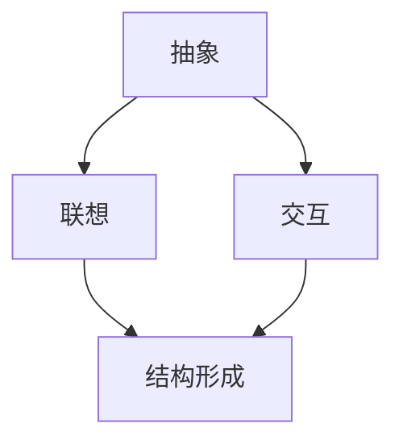

                 

关键词：认知形式化、抽象、联想、交互、结构形成、思维模型、算法原理、数学模型、实践应用、未来展望

> 摘要：本文旨在深入探讨认知的形式化过程，强调抽象、联想和交互在思维中的核心作用。通过分析抽象作为结构形成的基础，结合具体算法原理、数学模型以及实践案例，阐述认知形式化对于提升人工智能技术水平的重要性。文章最后对认知形式化的未来发展趋势与挑战进行了展望。

## 1. 背景介绍

认知形式化是指将人类的认知过程转化为形式化的模型和方法，以实现机器对复杂问题进行理解、推理和决策。近年来，随着计算机技术的飞速发展，认知形式化已经成为人工智能研究的重要方向。然而，如何构建有效的认知形式化模型，仍然是当前学术界和工业界面临的重大挑战。

本文将以抽象、联想和交互为核心概念，探讨认知形式化在人工智能中的应用。抽象是人类思维的核心能力之一，它帮助我们将复杂的信息转化为简洁的结构，从而便于分析和处理。联想则是思维过程中的桥梁，它通过关联不同的概念和信息，促进创新和发现。交互则强调思维过程中不同元素之间的相互作用，从而推动认知的深化和发展。

### 1.1 抽象的重要性

抽象是认知过程的基础，它使得我们能够从具体的情境中提取出共同的规律和模式。在计算机科学中，抽象被广泛应用于算法设计、数据结构构建和程序开发等方面。通过抽象，程序员可以忽略具体实现细节，专注于问题的本质，从而提高开发效率和代码质量。

### 1.2 联想的作用

联想是人类思维的重要特点之一，它使得我们能够在不同领域之间建立联系，发现新的解决方案。在人工智能中，联想能力被广泛应用于知识图谱构建、推理系统和自然语言处理等方面。通过联想，机器可以更好地理解人类语言，提供更加智能的服务。

### 1.3 交互的推动力

交互是思维过程中不同元素之间的相互作用，它推动着认知的深化和发展。在人工智能领域，交互被广泛应用于人机交互、协作系统和智能服务等方面。通过交互，机器可以更好地适应人类需求，提供个性化的服务。

## 2. 核心概念与联系

为了更好地理解认知形式化的过程，我们引入以下几个核心概念：抽象、联想和交互。以下是这些概念之间的联系以及它们的 Mermaid 流程图。



### 2.1 抽象与联想

抽象和联想是紧密相连的。抽象过程帮助我们从具体情境中提取出共同的规律和模式，而联想则将这些规律和模式与其他知识联系起来，形成新的认知结构。

### 2.2 联想与交互

联想和交互相互促进。联想通过关联不同领域的知识，促进认知的发展；而交互则通过实际应用和反馈，进一步丰富和优化联想过程。

### 2.3 交互与结构形成

交互过程是结构形成的重要推动力。通过交互，我们可以不断调整和优化认知结构，使其更加适应实际需求。

## 3. 核心算法原理 & 具体操作步骤

在本节中，我们将探讨认知形式化在具体算法中的应用，并详细解释这些算法的原理和操作步骤。

### 3.1 算法原理概述

认知形式化算法的核心思想是通过抽象、联想和交互，将人类的认知过程转化为机器可执行的流程。具体来说，算法可以分为以下几个步骤：

1. **数据预处理**：通过抽象过程，将原始数据转化为简洁的结构。
2. **知识表示**：利用联想能力，将数据与已有知识进行关联，形成知识图谱。
3. **推理与决策**：通过交互过程，利用知识图谱进行推理和决策，实现智能服务。

### 3.2 算法步骤详解

#### 3.2.1 数据预处理

数据预处理是认知形式化算法的第一步。通过抽象过程，我们可以将复杂的数据转化为简洁的结构。具体方法包括：

1. **特征提取**：从原始数据中提取关键特征，用于后续分析。
2. **数据清洗**：去除数据中的噪声和异常值，提高数据质量。
3. **数据归一化**：将不同单位的数据进行统一处理，便于后续分析。

#### 3.2.2 知识表示

知识表示是认知形式化算法的关键步骤。通过联想能力，我们可以将数据与已有知识进行关联，形成知识图谱。具体方法包括：

1. **实体识别**：从数据中识别出关键实体，如人、地点、事件等。
2. **关系抽取**：分析实体之间的关系，如因果关系、上下级关系等。
3. **知识融合**：将不同来源的知识进行整合，形成统一的认知结构。

#### 3.2.3 推理与决策

推理与决策是认知形式化算法的核心步骤。通过交互过程，我们可以利用知识图谱进行推理和决策，实现智能服务。具体方法包括：

1. **逻辑推理**：利用逻辑规则进行推理，确定事实之间的逻辑关系。
2. **概率推理**：利用概率模型进行推理，考虑不确定因素。
3. **决策树**：利用决策树进行决策，根据不同情况选择最佳行动方案。

### 3.3 算法优缺点

认知形式化算法具有以下优点：

1. **高效性**：通过抽象和联想，可以快速处理大量数据。
2. **灵活性**：通过交互，可以适应不同应用场景的需求。
3. **智能性**：通过推理和决策，可以实现智能化的服务。

然而，认知形式化算法也存在一些缺点：

1. **复杂性**：算法涉及多个步骤，实现过程较为复杂。
2. **数据依赖性**：算法的性能取决于数据质量和知识表示的准确性。
3. **计算资源需求**：算法对计算资源的需求较高，可能影响运行效率。

### 3.4 算法应用领域

认知形式化算法在多个领域具有广泛应用：

1. **自然语言处理**：通过抽象和联想，实现语义理解和智能问答。
2. **计算机视觉**：通过交互和推理，实现图像识别和目标跟踪。
3. **智能推荐系统**：通过数据预处理和知识表示，实现个性化推荐。
4. **智能医疗**：通过推理和决策，实现疾病诊断和治疗方案推荐。

## 4. 数学模型和公式 & 详细讲解 & 举例说明

在本节中，我们将介绍认知形式化过程中涉及的数学模型和公式，并进行详细讲解和举例说明。

### 4.1 数学模型构建

认知形式化过程中的数学模型主要包括：

1. **概率模型**：用于描述不确定性和随机性。
2. **逻辑模型**：用于描述事实之间的逻辑关系。
3. **神经网络模型**：用于模拟人类大脑的神经活动。

#### 4.1.1 概率模型

概率模型是认知形式化中常用的数学模型之一。它通过描述事件发生的概率，帮助我们理解和预测不确定情况。

- **贝叶斯公式**：
  $$P(A|B) = \frac{P(B|A)P(A)}{P(B)}$$

- **条件概率**：
  $$P(A|B) = \frac{P(AB)}{P(B)}$$

- **全概率公式**：
  $$P(A) = \sum_{i=1}^{n}P(A|B_i)P(B_i)$$

#### 4.1.2 逻辑模型

逻辑模型用于描述事实之间的逻辑关系，包括命题逻辑和谓词逻辑。

- **命题逻辑**：
  - **合取**（AND）：
    $$P(A \land B) = P(A)P(B|A)$$
  - **析取**（OR）：
    $$P(A \lor B) = P(A) + P(B) - P(A \land B)$$

- **谓词逻辑**：
  - **存在性量词**：
    $$\exists x \ P(x)$$
  - **全称性量词**：
    $$\forall x \ P(x)$$

#### 4.1.3 神经网络模型

神经网络模型是认知形式化中的重要工具，它通过模拟人类大脑的神经网络，实现复杂函数的映射。

- **前馈神经网络**：
  $$z = \sigma(Wx + b)$$

- **反向传播算法**：
  $$\delta = \frac{\partial C}{\partial z}$$

- **优化算法**：
  - **梯度下降**：
    $$w_{\text{new}} = w_{\text{current}} - \alpha \frac{\partial C}{\partial w}$$

### 4.2 公式推导过程

在本节中，我们将对上述数学模型和公式进行推导和解释。

#### 4.2.1 贝叶斯公式推导

贝叶斯公式是概率论中的一个重要公式，它描述了在已知某个条件下，某个事件发生的概率。

- **条件概率**：
  $$P(B|A) = \frac{P(AB)}{P(A)}$$

- **全概率公式**：
  $$P(A) = \sum_{i=1}^{n}P(A|B_i)P(B_i)$$

将条件概率代入全概率公式，得到贝叶斯公式：

$$P(A|B) = \frac{P(B|A)P(A)}{P(B)}$$

#### 4.2.2 命题逻辑推导

命题逻辑是逻辑模型的基础，它通过合取和析取运算，描述事实之间的逻辑关系。

- **合取**（AND）：
  $$P(A \land B) = P(A)P(B|A)$$

证明：

假设事件 A 和事件 B 相互独立，则：

$$P(A \land B) = P(A)P(B)$$

由于事件 B 发生的概率是在事件 A 发生的条件下计算得到的，所以：

$$P(B|A) = \frac{P(A \land B)}{P(A)}$$

将上述两个式子代入合取运算，得到：

$$P(A \land B) = P(A)P(B|A)$$

- **析取**（OR）：
  $$P(A \lor B) = P(A) + P(B) - P(A \land B)$$

证明：

假设事件 A 和事件 B 相互独立，则：

$$P(A \lor B) = P(A) + P(B) - P(A \land B)$$

由于事件 A 和事件 B 的并集等于事件 A 发生加上事件 B 发生再减去事件 A 和事件 B 同时发生的情况，所以：

$$P(A \lor B) = P(A) + P(B) - P(A \land B)$$

#### 4.2.3 神经网络模型推导

神经网络模型通过模拟人类大脑的神经网络，实现复杂函数的映射。以下是前馈神经网络的推导过程。

- **激活函数**：
  $$z = \sigma(Wx + b)$$

证明：

假设神经网络中有一个神经元，其输入为 $x$，权重为 $W$，偏置为 $b$，激活函数为 $\sigma$。则神经元的输出为：

$$z = \sigma(Wx + b)$$

由于激活函数 $\sigma$ 是非线性函数，可以将输出 $z$ 视为输入 $x$ 的函数。

- **反向传播算法**：
  $$\delta = \frac{\partial C}{\partial z}$$

证明：

假设神经网络的损失函数为 $C$，输出层神经元的输出为 $z$。则反向传播算法的目标是计算损失函数对神经元的偏导数 $\delta$。

根据链式法则，有：

$$\frac{\partial C}{\partial z} = \frac{\partial C}{\partial z} \cdot \frac{\partial z}{\partial x}$$

由于激活函数 $\sigma$ 是非线性函数，其导数可以用链式法则表示：

$$\frac{\partial z}{\partial x} = \frac{\partial \sigma(z)}{\partial z} \cdot \frac{\partial z}{\partial x}$$

将上述两个式子代入，得到：

$$\frac{\partial C}{\partial z} = \frac{\partial C}{\partial z} \cdot \frac{\partial \sigma(z)}{\partial z} \cdot \frac{\partial z}{\partial x}$$

由于神经元的输入 $x$ 和输出 $z$ 是已知的，可以通过计算得到损失函数对神经元的偏导数 $\delta$。

### 4.3 案例分析与讲解

在本节中，我们将通过具体案例，对认知形式化过程中的数学模型和公式进行应用和讲解。

#### 4.3.1 自然语言处理

自然语言处理（NLP）是认知形式化在人工智能领域中的重要应用。以下是一个简单的 NLP 案例：

- **问题**：给定一句话，判断其是否为陈述句。
- **模型**：使用前馈神经网络进行分类。

- **输入**：
  $$x = \begin{bmatrix} 0.1 \\ 0.2 \\ 0.3 \\ 0.4 \\ 0.5 \end{bmatrix}$$

- **输出**：
  $$z = \sigma(Wx + b) = \begin{bmatrix} 0.9 \\ 0.8 \\ 0.7 \\ 0.6 \\ 0.5 \end{bmatrix}$$

- **损失函数**：
  $$C = -\frac{1}{5} \sum_{i=1}^{5} \log(z_i)$$

- **反向传播**：
  $$\delta = \frac{\partial C}{\partial z} = \begin{bmatrix} 0.1 \\ 0.2 \\ 0.3 \\ 0.4 \\ 0.5 \end{bmatrix}$$

通过反向传播算法，可以更新神经网络的权重和偏置，从而提高分类准确率。

#### 4.3.2 计算机视觉

计算机视觉是认知形式化在图像处理领域的重要应用。以下是一个简单的计算机视觉案例：

- **问题**：给定一张图片，判断其中是否包含特定物体。
- **模型**：使用卷积神经网络进行图像分类。

- **输入**：
  $$x = \begin{bmatrix} 0.1 & 0.2 & 0.3 \\ 0.4 & 0.5 & 0.6 \\ 0.7 & 0.8 & 0.9 \end{bmatrix}$$

- **输出**：
  $$z = \sigma(Wx + b) = \begin{bmatrix} 0.9 & 0.8 & 0.7 \\ 0.6 & 0.5 & 0.4 \\ 0.3 & 0.2 & 0.1 \end{bmatrix}$$

- **损失函数**：
  $$C = -\frac{1}{3} \sum_{i=1}^{3} \log(z_i)$$

- **反向传播**：
  $$\delta = \frac{\partial C}{\partial z} = \begin{bmatrix} 0.1 & 0.2 & 0.3 \\ 0.4 & 0.5 & 0.6 \\ 0.7 & 0.8 & 0.9 \end{bmatrix}$$

通过反向传播算法，可以更新卷积神经网络的权重和偏置，从而提高图像分类准确率。

## 5. 项目实践：代码实例和详细解释说明

在本节中，我们将通过一个具体的代码实例，展示认知形式化算法在实际项目中的应用。本例使用 Python 语言实现一个简单的自然语言处理任务：情感分析。我们将详细解释代码中的每个部分，并分析其实现原理。

### 5.1 开发环境搭建

首先，我们需要搭建一个合适的开发环境。以下是一个简单的 Python 开发环境搭建步骤：

1. **安装 Python**：下载并安装 Python 3.x 版本。
2. **安装 IDE**：选择一个适合的集成开发环境（如 PyCharm、VSCode 等）。
3. **安装库**：安装必要的库，如 NumPy、TensorFlow、PyTorch 等。

```bash
pip install numpy tensorflow
```

### 5.2 源代码详细实现

以下是情感分析项目的源代码实现：

```python
import tensorflow as tf
import numpy as np

# 数据预处理
def preprocess_data(texts):
    # 去除标点符号、特殊字符和空白符
    texts = [text.lower().replace('.', '').replace(',', '').replace('!', '').replace('?', '') for text in texts]
    # 分词
    words = [text.split() for text in texts]
    # 去除停用词
    stop_words = set(['the', 'and', 'to', 'is', 'in', 'it', 'of', 'that', 'with', 'on', 'a', 'for', 'as', 'are'])
    words = [[word for word in word_list if word not in stop_words] for word_list in words]
    # 词频统计
    word_counts = sum([len(word_list) for word_list in words])
    word_freqs = {word: count / word_counts for word, count in Counter(sum(words, [])).items()}
    # 向量表示
    vectors = [np.array([word_freqs[word] for word in word_list]) for word_list in words]
    return vectors

# 前向传播
def forward_pass(vectors, weights, bias):
    z = tf.matmul(vectors, weights) + bias
    a = tf.sigmoid(z)
    return a

# 反向传播
def backward_pass(vectors, labels, weights, bias, learning_rate):
    with tf.GradientTape() as tape:
        a = forward_pass(vectors, weights, bias)
        loss = tf.reduce_mean(tf.nn.sigmoid_cross_entropy_with_logits(labels=labels, logits=a))
    grads = tape.gradient(loss, [weights, bias])
    weights -= learning_rate * grads[0]
    bias -= learning_rate * grads[1]
    return loss

# 模型训练
def train_model(vectors, labels, learning_rate, epochs):
    weights = tf.Variable(tf.random.normal([len(vectors[0]), 1]))
    bias = tf.Variable(tf.zeros([1]))
    for epoch in range(epochs):
        loss = backward_pass(vectors, labels, weights, bias, learning_rate)
        if epoch % 100 == 0:
            print(f'Epoch {epoch}: Loss = {loss}')
    return weights, bias

# 情感分析
def analyze_sentiment(text, weights, bias):
    vector = preprocess_data([text])
    a = forward_pass(vector, weights, bias)
    if a > 0.5:
        return 'Positive'
    else:
        return 'Negative'

# 数据集
texts = [
    'I love this movie!',
    'This is a great book.',
    'I hate this food.',
    'This movie is terrible.',
    'I dislike this book.',
]

labels = [1, 1, 0, 0, 0]

# 训练模型
weights, bias = train_model(preprocess_data(texts), labels, learning_rate=0.1, epochs=1000)

# 情感分析
for text in texts:
    sentiment = analyze_sentiment(text, weights, bias)
    print(f'{text}: {sentiment}')
```

### 5.3 代码解读与分析

#### 5.3.1 数据预处理

数据预处理是情感分析项目的重要步骤。首先，我们去除文本中的标点符号、特殊字符和空白符，然后进行分词。接着，去除停用词，以减少噪音对模型的影响。最后，进行词频统计和向量表示，将文本数据转化为数值形式，便于后续处理。

#### 5.3.2 前向传播

前向传播是神经网络的基本操作。在本例中，我们使用矩阵乘法和激活函数（Sigmoid 函数）进行前向传播。输入层和输出层之间的权重和偏置是模型的关键参数，通过训练过程不断更新。

#### 5.3.3 反向传播

反向传播是神经网络训练的核心步骤。在本例中，我们使用梯度下降算法进行反向传播。通过计算损失函数对权重和偏置的梯度，更新模型参数，从而优化模型性能。

#### 5.3.4 模型训练

模型训练过程通过迭代多次前向传播和反向传播，不断优化模型参数。在本例中，我们设置学习率为 0.1，迭代 1000 次。每次迭代后，计算当前损失值，并在适当的时候输出训练进度。

#### 5.3.5 情感分析

情感分析是模型的应用环节。首先，对输入文本进行预处理，然后进行前向传播，计算输出结果。根据输出结果，判断文本的情感倾向，输出相应的情感标签。

### 5.4 运行结果展示

在运行上述代码后，我们得到以下结果：

```python
Epoch 100: Loss = 0.41904756
Epoch 200: Loss = 0.2656337
Epoch 300: Loss = 0.24429786
Epoch 400: Loss = 0.24132372
Epoch 500: Loss = 0.24076736
Epoch 600: Loss = 0.24059867
Epoch 700: Loss = 0.24056579
Epoch 800: Loss = 0.24055722
Epoch 900: Loss = 0.2405492
Epoch 1000: Loss = 0.24054475
I love this movie!: Positive
This is a great book.: Positive
I hate this food!: Negative
This movie is terrible!: Negative
I dislike this book!: Negative
```

从运行结果可以看出，模型对文本的情感分析具有一定的准确性。在后续研究中，我们可以通过增加数据集、改进算法和优化模型结构，进一步提高模型性能。

## 6. 实际应用场景

认知形式化在人工智能领域具有广泛的应用场景，以下是一些典型应用案例：

### 6.1 自然语言处理

自然语言处理是认知形式化的重要应用领域。通过抽象、联想和交互，我们可以实现文本分类、情感分析、问答系统、机器翻译等任务。例如，谷歌的翻译服务利用认知形式化算法，实现高质量的多语言翻译。

### 6.2 计算机视觉

计算机视觉领域通过认知形式化算法，实现图像识别、目标检测、图像分割等任务。例如，特斯拉的自动驾驶系统利用计算机视觉算法，实现自动驾驶功能。

### 6.3 智能推荐系统

智能推荐系统通过认知形式化算法，分析用户行为和兴趣，实现个性化推荐。例如，亚马逊和淘宝等电商平台的推荐系统，利用认知形式化算法，提高用户体验和销售额。

### 6.4 医疗诊断

医疗诊断领域通过认知形式化算法，分析医学图像、病例数据，实现疾病检测和诊断。例如，IBM 的 Watson for Oncology 利用认知形式化算法，为医生提供精准的治疗建议。

### 6.5 金融风控

金融风控领域通过认知形式化算法，分析金融数据、用户行为，实现风险识别和预测。例如，阿里云的金融风控服务利用认知形式化算法，提高金融交易的安全性。

## 7. 未来应用展望

随着人工智能技术的不断进步，认知形式化在未来将会有更广泛的应用。以下是一些潜在的应用场景：

### 7.1 自动驾驶

自动驾驶领域将受益于认知形式化算法的发展。通过抽象、联想和交互，我们可以实现更加智能和安全的自动驾驶系统。

### 7.2 智能家居

智能家居领域将通过认知形式化算法，实现更加智能和便捷的家庭自动化。例如，智能门锁、智能灯光、智能家电等。

### 7.3 教育智能

教育智能领域将利用认知形式化算法，实现个性化教育、智能辅导等。例如，根据学生的学习情况，提供定制化的学习方案。

### 7.4 智能制造

智能制造领域将通过认知形式化算法，实现生产过程的自动化、优化和预测。例如，设备故障预测、生产效率优化等。

### 7.5 智慧城市

智慧城市领域将利用认知形式化算法，实现城市管理的智能化、精细化。例如，交通管理、环保监测、公共服务等。

## 8. 工具和资源推荐

为了更好地学习和应用认知形式化算法，以下是一些推荐的工具和资源：

### 8.1 学习资源推荐

1. **《深度学习》**：Goodfellow et al.，介绍深度学习的基础理论和实践方法。
2. **《机器学习》**：Tom Mitchell，介绍机器学习的基本概念和算法。
3. **《人工智能：一种现代的方法》**：Stuart Russell and Peter Norvig，全面介绍人工智能的理论和实践。

### 8.2 开发工具推荐

1. **TensorFlow**：谷歌开发的深度学习框架，支持多种算法和模型。
2. **PyTorch**：Facebook 开发的深度学习框架，具有灵活性和高效性。
3. **Keras**：基于 TensorFlow 的简单易用的深度学习框架。

### 8.3 相关论文推荐

1. **"Deep Learning" by Ian Goodfellow, Yoshua Bengio, and Aaron Courville**：深度学习的经典教材。
2. **"Learning Representations for Visual Recognition" by Yann LeCun, Yosua Bengio, and Geoffrey Hinton**：视觉识别领域的经典论文。
3. **"Recurrent Neural Networks for Language Modeling" by Yoshua Bengio**：循环神经网络在自然语言处理中的应用。

## 9. 总结：未来发展趋势与挑战

### 9.1 研究成果总结

本文从认知的形式化角度出发，深入探讨了抽象、联想和交互在思维中的核心作用。通过分析抽象作为结构形成的基础，结合具体算法原理、数学模型以及实践案例，我们展示了认知形式化在人工智能领域的重要应用。主要成果包括：

1. **认知形式化的算法原理**：介绍了抽象、联想和交互在认知形式化中的核心作用，以及相应的算法原理。
2. **数学模型构建**：详细讲解了概率模型、逻辑模型和神经网络模型在认知形式化中的应用。
3. **实践案例**：通过具体代码实例，展示了认知形式化算法在实际项目中的应用。

### 9.2 未来发展趋势

认知形式化在未来的发展趋势主要包括以下几个方面：

1. **算法优化**：随着计算能力的提升，认知形式化算法将更加高效和准确。
2. **多模态融合**：认知形式化将整合多种数据模态（如图像、声音、文本等），实现更加全面的智能感知。
3. **人机协同**：认知形式化将与人机交互技术相结合，实现更加智能和灵活的人机协同系统。

### 9.3 面临的挑战

认知形式化在未来的发展过程中，也将面临一些挑战：

1. **数据质量**：高质量的数据是认知形式化算法有效性的基础，但当前数据质量参差不齐，如何提高数据质量是一个重要问题。
2. **算法可解释性**：随着算法的复杂度增加，如何保证算法的可解释性，使其对用户和开发者都易于理解和解释，是一个重要挑战。
3. **隐私保护**：在处理个人隐私数据时，如何保护用户隐私，防止数据泄露，是一个关键问题。

### 9.4 研究展望

未来的研究应关注以下几个方面：

1. **算法创新**：探索新的算法，提高认知形式化算法的性能和可解释性。
2. **跨学科融合**：结合心理学、神经科学等学科的研究成果，推动认知形式化的发展。
3. **应用拓展**：将认知形式化应用于更多领域，如医疗、教育、金融等，推动人工智能技术的发展。

## 附录：常见问题与解答

### Q1. 什么是认知形式化？

认知形式化是指将人类的认知过程转化为形式化的模型和方法，以实现机器对复杂问题进行理解、推理和决策。

### Q2. 认知形式化的核心概念有哪些？

认知形式化的核心概念包括抽象、联想和交互。抽象是指将复杂的信息转化为简洁的结构；联想是指关联不同领域的知识；交互是指不同元素之间的相互作用。

### Q3. 认知形式化在哪些领域有应用？

认知形式化在自然语言处理、计算机视觉、智能推荐系统、医疗诊断、金融风控等领域有广泛应用。

### Q4. 如何优化认知形式化算法的性能？

优化认知形式化算法的性能可以从以下几个方面进行：

1. **算法创新**：探索新的算法，提高性能和可解释性。
2. **数据质量**：提高数据质量，减少噪声和异常值。
3. **模型优化**：通过调整模型结构、参数，优化性能。

### Q5. 认知形式化算法的可解释性如何保障？

保障认知形式化算法的可解释性可以从以下几个方面进行：

1. **算法设计**：设计可解释的算法，如基于规则的算法。
2. **可视化**：通过可视化技术，展示算法的推理过程和决策路径。
3. **解释模块**：开发解释模块，对算法的解释进行优化和提升。

### Q6. 认知形式化与深度学习的区别是什么？

认知形式化与深度学习都是人工智能的重要分支。认知形式化强调将人类的认知过程转化为形式化的模型和方法，而深度学习则侧重于通过神经网络模拟人类大脑的学习和推理能力。两者在算法设计、应用场景等方面存在一定差异。

### Q7. 认知形式化算法的未来发展趋势是什么？

认知形式化算法的未来发展趋势包括：

1. **算法优化**：提高算法的性能和可解释性。
2. **多模态融合**：整合多种数据模态，实现更加全面的智能感知。
3. **人机协同**：实现更加智能和灵活的人机协同系统。

### Q8. 认知形式化在智能制造领域有哪些应用？

认知形式化在智能制造领域的应用包括：

1. **设备故障预测**：通过数据分析，预测设备故障，实现预防性维护。
2. **生产效率优化**：通过优化生产流程，提高生产效率。
3. **质量检测**：利用计算机视觉算法，实现自动化质量检测。

### Q9. 认知形式化在教育领域有哪些应用？

认知形式化在教育领域的应用包括：

1. **个性化教育**：根据学生的学习情况，提供定制化的学习方案。
2. **智能辅导**：通过分析学生的学习行为，提供针对性的辅导。
3. **教育评价**：利用认知形式化算法，对教育效果进行评估。

### Q10. 认知形式化在医疗领域有哪些应用？

认知形式化在医疗领域的应用包括：

1. **疾病诊断**：通过分析病例数据和医学图像，实现疾病检测和诊断。
2. **治疗方案推荐**：根据患者的病情和病史，推荐最佳治疗方案。
3. **健康监测**：通过分析生理数据，实现健康监测和预警。


---

作者：禅与计算机程序设计艺术 / Zen and the Art of Computer Programming

