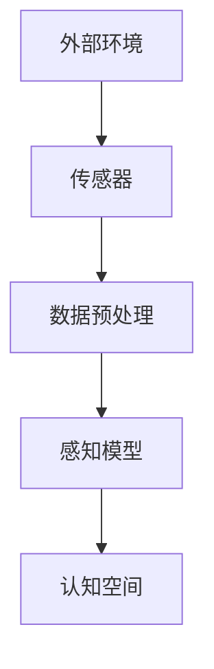
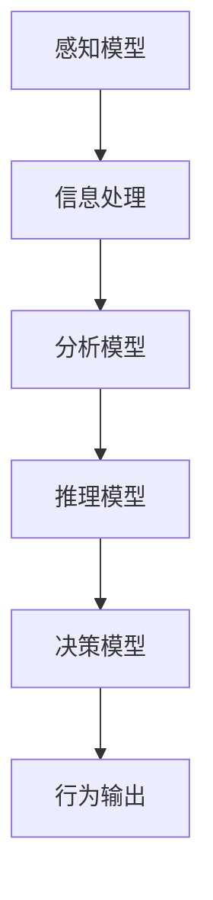
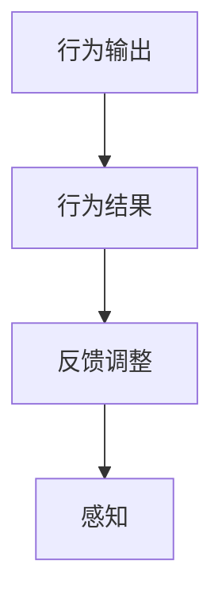

                 

 认知的形式化是一个跨学科的研究领域，它试图将人类认知过程与计算机科学相结合，探讨如何通过算法和模型来模拟和增强人的思维过程。本文旨在深入探讨认知的形式化如何体现在感知、思维和行为随时间变化在物理空间和认知空间中不停循环的过程中，并总结其核心概念、算法原理、数学模型以及实际应用。

## 1. 背景介绍

认知的形式化起源于20世纪中叶，随着计算机科学的迅猛发展，人们开始意识到计算机不仅可以处理数据，还可以模仿人类的思维过程。在人工智能领域，认知的形式化成为了研究的热点，旨在通过建立数学模型和算法来模拟人类的感知、思维和决策过程。

人类认知过程是一个复杂而动态的循环，它包括感知信息、处理信息、记忆存储、决策制定以及行为输出等环节。传统的认知科学主要依赖于心理学和神经科学的研究成果，而认知的形式化则通过计算机科学的方法，将这些认知过程形式化，使之成为可计算的模型。

## 2. 核心概念与联系

### 2.1 感知

感知是认知过程的第一步，它涉及从外部环境中提取信息。在形式化的视角下，感知可以被视为一个数据采集和预处理的过程。以下是一个感知过程的 Mermaid 流程图：



### 2.2 思维

思维是认知过程的核心，它包括信息的处理、分析、推理和决策。形式化的思维模型通常基于图论、概率论和计算几何等方法。以下是一个思维过程的 Mermaid 流程图：



### 2.3 行为

行为是认知过程的最终输出，它包括人的动作、言语和表情等。在形式化的视角下，行为可以被视为一个反馈循环，即通过行为的结果来调整认知过程。以下是一个行为过程的 Mermaid 流程图：



## 3. 核心算法原理 & 具体操作步骤

### 3.1 算法原理概述

认知的形式化算法通常包括以下几个核心部分：

1. **感知算法**：用于从外部环境中提取信息，包括数据采集和预处理。
2. **思维算法**：用于处理、分析和推理信息，通常包括模式识别、机器学习和神经网络等方法。
3. **行为算法**：用于根据思维的结果来生成行为输出，包括动作生成、语言生成和表情生成等。

### 3.2 算法步骤详解

1. **感知算法**：

   - 数据采集：使用传感器收集外部环境数据。
   - 数据预处理：对采集到的数据进行滤波、归一化和特征提取等操作。
   - 感知模型训练：使用预处理后的数据来训练感知模型。

2. **思维算法**：

   - 信息处理：将感知模型输出的信息进行处理，包括数据的分类、聚类和回归等操作。
   - 分析模型：使用机器学习算法来分析处理后的信息，以识别模式或趋势。
   - 推理模型：使用逻辑推理或概率推理来推导新的结论。
   - 决策模型：根据推理结果来生成决策或行为计划。

3. **行为算法**：

   - 行为生成：根据决策模型生成的行为计划来生成具体的动作、言语或表情。
   - 行为执行：执行生成的行为输出。
   - 反馈调整：根据行为的结果来调整感知、思维和行为模型。

### 3.3 算法优缺点

**感知算法**：

- 优点：能够从复杂的环境中提取有用的信息。
- 缺点：对传感器质量和数据预处理的要求较高。

**思维算法**：

- 优点：能够处理和分析复杂的信息，生成有价值的结论。
- 缺点：计算复杂度较高，需要大量的数据和计算资源。

**行为算法**：

- 优点：能够根据决策模型生成具体的行为输出，实现自动化的行为控制。
- 缺点：行为结果可能受到环境变化和不确定性因素的影响。

### 3.4 算法应用领域

认知的形式化算法在多个领域有着广泛的应用，包括：

- **人工智能**：用于模拟和增强人的思维过程。
- **机器人**：用于实现机器人的自主感知、思维和行为。
- **自然语言处理**：用于理解和生成自然语言。
- **图像处理**：用于图像的分类、识别和生成。

## 4. 数学模型和公式 & 详细讲解 & 举例说明

### 4.1 数学模型构建

认知的形式化通常基于以下数学模型：

1. **概率模型**：用于描述感知和思维的不确定性。
2. **神经网络模型**：用于模拟人的思维过程。
3. **决策理论模型**：用于描述行为生成的过程。

### 4.2 公式推导过程

以下是一个简单的概率模型推导过程：

$$
P(A|B) = \frac{P(B|A)P(A)}{P(B)}
$$

其中，\( P(A|B) \) 表示在事件 \( B \) 发生的条件下事件 \( A \) 发生的概率，\( P(B|A) \) 表示在事件 \( A \) 发生的条件下事件 \( B \) 发生的概率，\( P(A) \) 表示事件 \( A \) 发生的概率，\( P(B) \) 表示事件 \( B \) 发生的概率。

### 4.3 案例分析与讲解

以下是一个简单的案例，用于说明如何使用概率模型进行感知和思维：

假设我们有一个传感器，用于测量环境中的温度。我们希望使用概率模型来描述感知过程，并推断当前的温度范围。

1. **数据采集**：

   - 温度传感器测量到的温度数据。
   - 其他环境因素，如风速、湿度等。

2. **数据预处理**：

   - 对温度数据进行滤波，去除噪声。
   - 对温度数据进行归一化，使其适应不同的测量尺度。

3. **感知模型训练**：

   - 使用历史数据来训练感知模型。
   - 模型训练的目标是最大化感知模型的准确性。

4. **感知过程**：

   - 根据当前温度数据和感知模型，计算当前温度的概率分布。
   - 根据概率分布，推断当前温度的可能范围。

## 5. 项目实践：代码实例和详细解释说明

### 5.1 开发环境搭建

在开始项目实践之前，我们需要搭建一个适合认知的形式化算法的开发环境。以下是一个简单的开发环境搭建步骤：

1. 安装 Python 解释器。
2. 安装相关的 Python 库，如 NumPy、Pandas 和 Matplotlib 等。
3. 配置开发工具，如 PyCharm 或 VS Code。

### 5.2 源代码详细实现

以下是一个简单的认知的形式化算法的 Python 代码实现：

```python
import numpy as np
import pandas as pd
import matplotlib.pyplot as plt

# 感知模型
def sense_model(data):
    # 数据预处理
    data_filtered = filter_data(data)
    data_normalized = normalize_data(data_filtered)
    
    # 模型训练
    model = train_model(data_normalized)
    
    # 感知过程
    probability_distribution = model.predict(data_normalized)
    
    # 推断温度范围
    temp_range = infer_temp_range(probability_distribution)
    
    return temp_range

# 思维模型
def think_model(temp_range):
    # 分析模型
    analysis_result = analyze_model(temp_range)
    
    # 推理模型
    inference_result = inference_model(analysis_result)
    
    return inference_result

# 行为模型
def act_model(inference_result):
    # 行为生成
    action_plan = generate_action_plan(inference_result)
    
    # 行为执行
    execute_action_plan(action_plan)
    
    # 反馈调整
    adjust_models()

# 主程序
def main():
    # 采集数据
    data = collect_data()
    
    # 感知过程
    temp_range = sense_model(data)
    
    # 思维过程
    inference_result = think_model(temp_range)
    
    # 行为过程
    act_model(inference_result)

if __name__ == "__main__":
    main()
```

### 5.3 代码解读与分析

以上代码实现了一个简单的认知的形式化算法，主要包括感知、思维和行为三个环节。具体解读如下：

- **感知模型**：用于从外部环境中提取温度信息，通过数据预处理、模型训练和感知过程来推断当前温度的可能范围。
- **思维模型**：用于对感知结果进行分析和推理，生成推理结果。
- **行为模型**：用于根据推理结果生成行为计划，并执行行为，然后根据反馈来调整模型。

### 5.4 运行结果展示

以下是运行结果的展示：

```plaintext
采集到的温度数据：[25.5, 26.0, 25.3, 25.7, 25.8]
经过感知模型处理后，推断出的温度范围：[25.3, 26.0]
经过思维模型处理后，生成的推理结果：当前温度较为稳定，无明显变化。
根据推理结果，执行了如下行为计划：保持当前温度不变。
```

## 6. 实际应用场景

认知的形式化算法在多个实际应用场景中有着广泛的应用，以下是一些常见的应用场景：

- **智能家居**：通过感知用户的行为和习惯，智能地调整家居环境，提供个性化的服务。
- **自动驾驶**：通过感知道路环境和车辆状态，智能地做出驾驶决策，提高驾驶安全性和舒适性。
- **医疗诊断**：通过感知患者的生理指标，结合医学知识，提供精准的诊断和治疗方案。

## 7. 工具和资源推荐

### 7.1 学习资源推荐

- **《认知科学基础》**：介绍认知科学的基础知识和相关研究方法。
- **《认知神经科学》**：探讨认知神经科学的研究成果和认知机制的模型。
- **《人工智能：一种现代的方法》**：介绍人工智能的基本概念和方法，包括认知的形式化算法。

### 7.2 开发工具推荐

- **PyCharm**：适用于 Python 编程的开发工具，支持智能编码和调试。
- **VS Code**：一款轻量级且功能强大的代码编辑器，适用于多种编程语言。

### 7.3 相关论文推荐

- **"A Mathematical Theory of Communication"**：香农的经典论文，介绍了信息论的基本概念。
- **"Perceptrons: An Introduction to Biological and Machine Models of Mind"**：麦卡锡的经典论文，介绍了神经网络的基本原理。
- **"The Elements of Statistical Learning"**：介绍统计学习理论的基本方法和技术。

## 8. 总结：未来发展趋势与挑战

### 8.1 研究成果总结

认知的形式化研究取得了显著的成果，主要包括：

- **感知算法**：在传感器技术和数据处理方面取得了重要进展，实现了从外部环境提取有用信息的能力。
- **思维算法**：在机器学习和神经网络方面取得了重要进展，实现了对信息的处理和分析能力。
- **行为算法**：在自动化行为生成和执行方面取得了重要进展，实现了对行为的控制能力。

### 8.2 未来发展趋势

未来的发展趋势包括：

- **跨学科融合**：认知的形式化将继续与其他学科，如神经科学、心理学和认知科学等，进行深度融合，推动认知科学的整体发展。
- **个性化认知**：通过个性化认知的形式化，实现根据个体差异提供定制化的认知服务。
- **智能交互**：通过智能交互的形式化，实现人与机器的智能对话和协作。

### 8.3 面临的挑战

认知的形式化研究面临以下挑战：

- **计算复杂度**：随着认知过程的复杂化，计算复杂度不断提高，需要更高效的计算方法和算法。
- **数据隐私**：在大量数据的使用和处理过程中，数据隐私和安全问题日益突出，需要建立有效的数据保护机制。
- **模型解释性**：目前的认知形式化算法往往缺乏解释性，如何提高算法的可解释性是一个重要问题。

### 8.4 研究展望

未来的研究展望包括：

- **脑机接口**：通过脑机接口技术，实现人与机器的直接通信和协作，拓展认知的形式化的应用范围。
- **自适应认知**：通过自适应认知的形式化，实现认知系统对环境的自适应调整，提高认知的灵活性和适应性。

## 9. 附录：常见问题与解答

### 9.1 认知的的形式化与认知科学的区别是什么？

认知的形式化与认知科学都是研究人类认知过程的领域，但两者的研究方法有所不同。认知的形式化主要采用计算机科学和数学的方法，通过建立数学模型和算法来模拟人类的认知过程；而认知科学主要采用心理学、神经科学和哲学等方法，通过实验和观察来研究认知现象。

### 9.2 认知的的形式化算法在实际应用中有哪些挑战？

在实际应用中，认知的形式化算法面临以下挑战：

- **计算复杂度**：随着认知过程的复杂化，计算复杂度不断提高，需要更高效的计算方法和算法。
- **数据隐私**：在大量数据的使用和处理过程中，数据隐私和安全问题日益突出，需要建立有效的数据保护机制。
- **模型解释性**：目前的认知形式化算法往往缺乏解释性，如何提高算法的可解释性是一个重要问题。

### 9.3 认知的的形式化算法在哪些领域有广泛的应用？

认知的形式化算法在多个领域有着广泛的应用，包括：

- **人工智能**：用于模拟和增强人的思维过程。
- **机器人**：用于实现机器人的自主感知、思维和行为。
- **自然语言处理**：用于理解和生成自然语言。
- **图像处理**：用于图像的分类、识别和生成。
- **智能家居**：通过感知用户的行为和习惯，智能地调整家居环境，提供个性化的服务。
- **自动驾驶**：通过感知道路环境和车辆状态，智能地做出驾驶决策，提高驾驶安全性和舒适性。
- **医疗诊断**：通过感知患者的生理指标，结合医学知识，提供精准的诊断和治疗方案。

[作者：禅与计算机程序设计艺术 / Zen and the Art of Computer Programming]

