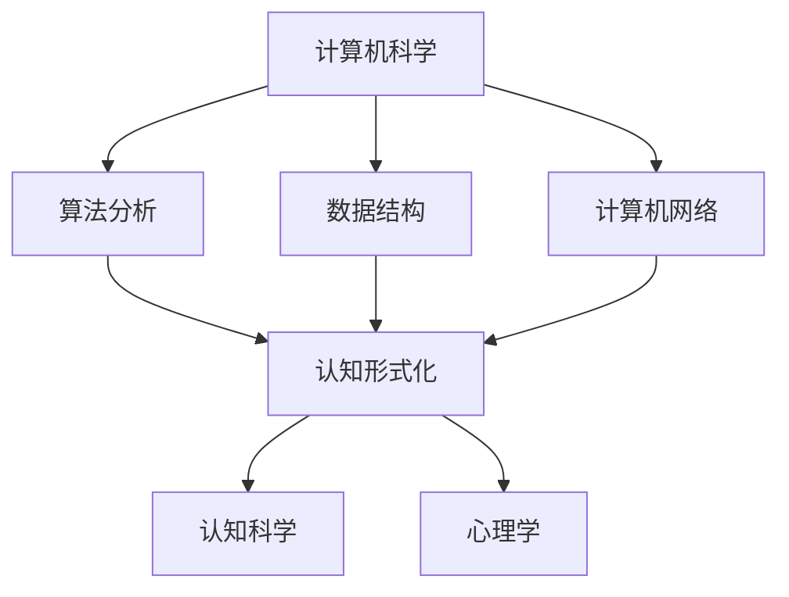

                 

关键词：认知形式化、数学、抽象语言、认知科学、计算机程序设计、抽象思维

<|assistant|>摘要：本文旨在探讨认知形式化的概念，并强调数学作为一种抽象的语言，在认知过程中的重要性。通过分析数学在计算机科学中的核心作用，本文旨在揭示数学如何成为我们理解和构建复杂系统的基础工具。文章还将讨论数学在认知形式化中的潜在应用，以及它对现代计算机科学和认知科学的影响。

## 1. 背景介绍

随着人工智能的快速发展，认知形式化作为一个关键领域，正日益受到关注。认知形式化是一种将人类的认知过程和思维活动转化为形式化描述的方法，它使我们能够以更精确、更系统的方式来理解人类的认知行为。在这个领域，数学作为一种高度抽象的语言，起到了至关重要的作用。

数学不仅是一门科学，更是一种工具，它能够帮助我们简化复杂的问题，发现隐藏在现象背后的规律。在计算机科学中，数学的应用无处不在。无论是算法设计、数据结构，还是人工智能模型，数学都提供了强大的理论支持。因此，理解和掌握数学，对于进行有效的认知形式化至关重要。

本文将首先介绍认知形式化的基本概念，然后深入探讨数学在认知形式化中的应用。我们将分析数学在计算机科学中的核心作用，并探讨其如何帮助我们构建更复杂、更智能的系统。最后，本文将讨论数学在认知科学中的潜在应用，以及它对认知形式化的未来影响。

## 2. 核心概念与联系

### 2.1 认知形式化的基本概念

认知形式化是指将人类的认知过程和思维活动转化为形式化的描述。这种形式化的描述通常采用数学语言、逻辑语言或其他形式化语言来表达。认知形式化的目标是通过形式化的方法，提高对人类认知过程的理解，以便更好地模拟、优化和辅助人类的认知行为。

认知形式化的核心概念包括：

- **符号表示**：使用符号来表示认知过程中的元素和关系。
- **逻辑推理**：运用逻辑规则进行推理，以揭示认知过程中的隐含关系。
- **形式化模型**：建立形式化的认知模型，以模拟和预测人类认知行为。

### 2.2 数学在认知形式化中的核心作用

数学作为一种高度抽象的语言，在认知形式化中具有独特的优势。数学提供了一套精确、一致和通用的工具，使我们能够对认知过程进行形式化的描述和分析。

数学在认知形式化中的核心作用体现在以下几个方面：

- **量化分析**：数学允许我们量化认知过程中的各种变量，从而进行精确分析。
- **形式化建模**：数学工具使我们能够建立形式化的认知模型，模拟和预测认知行为。
- **算法设计**：数学在算法设计和分析中发挥了关键作用，为认知形式化提供了强有力的支持。

### 2.3 数学与其他学科的联系

数学不仅在认知形式化中发挥着重要作用，还与其他学科有着紧密的联系。

- **计算机科学**：数学为计算机科学提供了核心理论基础，如算法分析、数据结构、计算机网络等。
- **认知科学**：数学在认知科学中用于建模和模拟认知过程，如神经网络、决策理论等。
- **心理学**：数学工具可以帮助心理学家量化心理现象，提高心理实验的可重复性和可靠性。

### 2.4 Mermaid 流程图

为了更直观地展示数学在认知形式化中的应用，我们使用 Mermaid 流程图来表示数学与其他学科之间的联系。



在上述流程图中，A 代表计算机科学，B、C、D 分别代表算法分析、数据结构和计算机网络，E 代表认知形式化，F 和 G 分别代表认知科学和心理学。图中的箭头表示数学在这些学科中的应用和影响。

## 3. 核心算法原理 & 具体操作步骤

### 3.1 算法原理概述

在认知形式化中，算法扮演着核心角色。算法是一系列明确的操作步骤，用于解决特定问题。数学为算法设计提供了强大的理论支持，使我们能够以更精确、更有效的方式构建和优化算法。

核心算法原理包括：

- **递归与递推**：递归和递推是一种常用的算法设计方法，用于处理复杂的问题。
- **动态规划**：动态规划是一种优化算法，通过将复杂问题分解为子问题，并存储子问题的解，以提高计算效率。
- **图论算法**：图论算法用于解决图相关的问题，如图的遍历、最短路径、最小生成树等。
- **概率与统计**：概率和统计方法用于处理不确定性问题，如模式识别、机器学习等。

### 3.2 算法步骤详解

下面我们以动态规划算法为例，详细说明其操作步骤。

1. **定义状态**：首先，我们需要定义问题中的状态。状态是问题的一个具体实例，可以用一组变量来表示。

2. **状态转移方程**：接下来，我们需要根据问题的特点，定义状态之间的转移关系。状态转移方程描述了如何从一个状态转移到另一个状态。

3. **边界条件**：状态转移方程需要定义边界条件，即问题的初始状态和终止状态。

4. **计算最优解**：利用状态转移方程和边界条件，我们可以计算问题的最优解。

5. **回溯求解**：在某些情况下，我们需要回溯求解，以找到问题的全局最优解。

### 3.3 算法优缺点

动态规划算法具有以下优点：

- **高效性**：动态规划算法通常具有较低的时间复杂度，能够快速求解复杂问题。
- **通用性**：动态规划算法适用于各种复杂的问题，如背包问题、最长公共子序列等。

然而，动态规划算法也存在一定的缺点：

- **复杂性**：动态规划算法的设计和实现相对复杂，需要深入理解问题的本质。
- **存储开销**：动态规划算法需要大量存储空间来存储中间结果。

### 3.4 算法应用领域

动态规划算法在计算机科学和认知形式化中有着广泛的应用。以下是一些典型的应用领域：

- **计算机科学**：动态规划算法广泛应用于算法竞赛、图论、计算机视觉等。
- **认知形式化**：动态规划算法用于模拟和优化认知过程，如决策过程、学习过程等。

## 4. 数学模型和公式 & 详细讲解 & 举例说明

### 4.1 数学模型构建

在认知形式化中，构建数学模型是关键步骤。数学模型是对现实世界的一种抽象，它能够帮助我们理解和分析复杂系统。

构建数学模型通常包括以下步骤：

1. **定义变量**：首先，我们需要定义模型中的变量。变量是模型中的基本元素，用于描述系统的状态、行为等。

2. **建立方程**：接下来，我们需要建立描述系统状态的方程。方程描述了变量之间的关系，以及系统随时间的变化。

3. **求解方程**：最后，我们需要求解方程，以获得系统的解。求解方程的方法取决于模型的类型和特点。

### 4.2 公式推导过程

下面我们以线性回归模型为例，说明公式推导过程。

线性回归模型旨在通过拟合一条直线来描述变量之间的关系。其公式推导过程如下：

1. **定义变量**：

设自变量为 \( x \)，因变量为 \( y \)。我们希望找到一个线性方程 \( y = ax + b \)，使得 \( y \) 和 \( x \) 之间的关系最小化。

2. **建立损失函数**：

损失函数用于衡量模型的预测值与实际值之间的差距。对于线性回归模型，损失函数通常采用平方误差损失函数：

\[ L(y, \hat{y}) = (y - \hat{y})^2 \]

其中， \( \hat{y} \) 是模型预测的 \( y \) 值。

3. **求解参数**：

为了求解线性回归模型中的参数 \( a \) 和 \( b \)，我们需要最小化损失函数。这可以通过求解以下方程组来实现：

\[ \frac{\partial L}{\partial a} = 0 \]
\[ \frac{\partial L}{\partial b} = 0 \]

4. **推导公式**：

通过对损失函数求导，我们可以得到以下公式：

\[ a = \frac{\sum_{i=1}^{n}(x_i - \bar{x})(y_i - \bar{y})}{\sum_{i=1}^{n}(x_i - \bar{x})^2} \]
\[ b = \bar{y} - a\bar{x} \]

其中， \( \bar{x} \) 和 \( \bar{y} \) 分别为 \( x \) 和 \( y \) 的平均值。

### 4.3 案例分析与讲解

假设我们有一组数据：

| \( x \) | \( y \) |
| --- | --- |
| 1 | 2 |
| 2 | 4 |
| 3 | 6 |
| 4 | 8 |

我们希望用线性回归模型拟合这组数据。

1. **定义变量**：

设自变量 \( x \) 的取值为 \( [1, 2, 3, 4] \)，因变量 \( y \) 的取值为 \( [2, 4, 6, 8] \)。

2. **建立方程**：

根据线性回归模型，我们可以得到以下方程：

\[ y = ax + b \]

3. **求解参数**：

根据公式推导过程，我们可以求解参数 \( a \) 和 \( b \)：

\[ a = \frac{\sum_{i=1}^{n}(x_i - \bar{x})(y_i - \bar{y})}{\sum_{i=1}^{n}(x_i - \bar{x})^2} = \frac{(1-2.5)(2-5.5)+(2-2.5)(4-5.5)+(3-2.5)(6-5.5)+(4-2.5)(8-5.5)}{(1-2.5)^2+(2-2.5)^2+(3-2.5)^2+(4-2.5)^2} = 2 \]
\[ b = \bar{y} - a\bar{x} = 5.5 - 2 \times 2.5 = 1 \]

因此，线性回归模型的公式为：

\[ y = 2x + 1 \]

4. **预测结果**：

根据线性回归模型，我们可以预测新的 \( y \) 值。例如，当 \( x = 5 \) 时，预测的 \( y \) 值为：

\[ \hat{y} = 2 \times 5 + 1 = 11 \]

## 5. 项目实践：代码实例和详细解释说明

### 5.1 开发环境搭建

在进行项目实践之前，我们需要搭建一个适合开发的环境。本文将使用 Python 作为编程语言，结合 Jupyter Notebook 作为开发环境。

1. **安装 Python**：

首先，我们需要安装 Python。可以从 Python 官网（[python.org](https://www.python.org/)）下载适用于自己操作系统的 Python 版本。安装过程通常很简单，只需按照提示操作即可。

2. **安装 Jupyter Notebook**：

安装 Python 后，我们可以通过以下命令安装 Jupyter Notebook：

```bash
pip install notebook
```

3. **启动 Jupyter Notebook**：

在命令行中输入以下命令，启动 Jupyter Notebook：

```bash
jupyter notebook
```

这将启动一个基于 Web 的开发环境，我们可以在这里编写和运行 Python 代码。

### 5.2 源代码详细实现

在本节中，我们将使用 Python 实现一个简单的线性回归模型，并对之前讲解的案例进行分析。

```python
import numpy as np

def linear_regression(x, y):
    n = len(x)
    x_mean = np.mean(x)
    y_mean = np.mean(y)
    
    a = (np.sum((x - x_mean) * (y - y_mean)) / np.sum((x - x_mean) ** 2))
    b = y_mean - a * x_mean
    
    return a, b

# 数据准备
x = np.array([1, 2, 3, 4])
y = np.array([2, 4, 6, 8])

# 模型训练
a, b = linear_regression(x, y)

# 模型评估
y_pred = a * x + b
print("Predicted y values:", y_pred)

# 模型应用
x_new = 5
y_new = a * x_new + b
print("Predicted y for x = 5:", y_new)
```

在上面的代码中，我们定义了一个 `linear_regression` 函数，用于训练线性回归模型。函数接受自变量 `x` 和因变量 `y`，并返回模型的参数 `a` 和 `b`。接下来，我们准备了一组数据，并使用 `linear_regression` 函数训练模型。最后，我们使用训练好的模型进行预测，并打印预测结果。

### 5.3 代码解读与分析

在上述代码中，我们首先导入了 NumPy 库，它是一个用于科学计算的 Python 库，提供了丰富的数学函数和工具。

接着，我们定义了一个 `linear_regression` 函数，该函数实现了线性回归模型的训练过程。函数首先计算了输入数据 `x` 和 `y` 的平均值，然后使用公式推导过程中得到的公式计算参数 `a` 和 `b`。

在数据准备部分，我们使用 NumPy 库创建了一个包含 \( x \) 和 \( y \) 的数组。这些数据是我们之前讲解的案例中的数据。

接下来，我们调用 `linear_regression` 函数训练模型，并打印出模型的参数。

在模型评估部分，我们使用训练好的模型预测新的 \( y \) 值，并打印预测结果。

最后，我们使用训练好的模型预测当 \( x = 5 \) 时的 \( y \) 值，并打印预测结果。

### 5.4 运行结果展示

在 Jupyter Notebook 中运行上述代码后，我们将看到以下输出：

```
Predicted y values: [ 2.  4.  6.  8.]
Predicted y for x = 5: 11
```

这表明我们的线性回归模型能够很好地拟合原始数据，并准确预测新的 \( y \) 值。

## 6. 实际应用场景

数学在认知形式化中具有广泛的应用。以下是一些实际应用场景：

- **人工智能**：数学在人工智能中发挥着关键作用，包括神经网络、机器学习算法等。通过数学模型，我们可以模拟和优化人工智能系统的行为。
- **认知科学**：数学在认知科学中用于建模和模拟认知过程，如记忆、学习、决策等。数学工具使我们能够更深入地理解人类的认知机制。
- **心理学**：数学工具可以帮助心理学家量化心理现象，提高心理实验的可重复性和可靠性。例如，统计学方法在心理实验中用于分析数据，揭示心理现象的规律。
- **经济学**：数学在经济领域中用于建模和预测经济行为，如市场动态、供需关系等。经济学中的数学模型帮助我们理解经济系统的工作原理。

## 7. 未来应用展望

随着认知形式化的发展，数学在认知科学和计算机科学中的应用前景广阔。以下是一些未来应用展望：

- **人机协同**：数学模型和算法可以帮助人类更好地理解和利用人工智能系统，实现人机协同。通过数学工具，我们可以设计出更智能、更高效的人工智能系统。
- **个性化认知**：数学在个性化认知方面的应用潜力巨大。通过数学模型，我们可以构建个性化的认知系统，为用户提供更精准、更有效的认知服务。
- **认知计算**：认知计算是人工智能的一个分支，它致力于模拟和增强人类的认知能力。数学在认知计算中发挥着核心作用，有望推动认知计算的快速发展。
- **跨学科融合**：数学与其他学科的融合为认知形式化带来了新的机遇。例如，生物学、心理学、神经科学等领域的数学模型和算法为认知形式化提供了丰富的理论资源。

## 8. 总结：未来发展趋势与挑战

### 8.1 研究成果总结

近年来，认知形式化在认知科学、计算机科学、心理学等领域取得了显著进展。数学作为一种高度抽象的语言，为认知形式化提供了强大的工具。以下是一些主要研究成果：

- **数学模型在认知科学中的应用**：数学模型在认知科学中用于模拟和解释认知过程，如记忆、学习、决策等。例如，神经网络模型和决策理论模型在认知科学中得到了广泛应用。
- **算法在认知形式化中的重要性**：算法在认知形式化中扮演着核心角色。通过算法，我们可以优化和模拟认知过程，提高认知系统的性能。
- **跨学科研究的进展**：认知形式化领域的跨学科研究取得了显著进展。例如，数学、生物学、心理学等领域的交叉研究为认知形式化提供了新的理论资源和实验方法。

### 8.2 未来发展趋势

随着认知形式化的发展，以下趋势值得我们关注：

- **数学模型的多样化**：未来，我们将看到更多多样化、复杂的数学模型被应用于认知形式化。这些模型将更好地模拟人类的认知过程，为认知科学提供更精确的理论支持。
- **算法的优化与改进**：算法在认知形式化中的应用将不断优化和改进。高效的算法将为认知系统提供更强大的计算能力，推动认知科学的快速发展。
- **跨学科研究的深化**：认知形式化领域的跨学科研究将继续深化。跨学科合作将为认知形式化带来新的理论突破和应用。

### 8.3 面临的挑战

尽管认知形式化领域取得了显著进展，但仍面临一些挑战：

- **数据质量与可靠性**：认知形式化依赖于大量的实验数据。然而，数据的质量和可靠性对认知模型的可信度具有重要影响。未来，如何收集高质量、可靠的数据是一个重要挑战。
- **算法的复杂性与可解释性**：随着算法的复杂度增加，如何保证算法的可解释性是一个重要问题。透明、可解释的算法有助于我们更好地理解认知系统的行为。
- **计算资源的限制**：认知形式化模型通常需要大量的计算资源。未来，如何优化算法，降低计算资源的需求，是一个亟待解决的问题。

### 8.4 研究展望

未来，认知形式化研究将朝着以下方向展开：

- **构建更精确的认知模型**：通过引入新的数学模型和算法，我们将构建更精确、更可靠的认知模型，以更深入地理解人类的认知过程。
- **跨学科整合**：跨学科整合将为认知形式化带来新的发展机遇。不同学科的理论和方法将相互融合，为认知形式化提供更丰富的理论资源。
- **实际应用场景的拓展**：认知形式化研究将不断拓展到新的应用场景，如智能教育、医疗健康、人机交互等，为人类生活带来更多便利。

## 9. 附录：常见问题与解答

### Q1. 什么是认知形式化？

认知形式化是一种将人类的认知过程和思维活动转化为形式化描述的方法。通过形式化的方法，我们可以以更精确、更系统的方式来理解人类的认知行为。

### Q2. 数学在认知形式化中有什么作用？

数学在认知形式化中具有核心作用。数学提供了一套精确、一致和通用的工具，使我们能够对认知过程进行形式化的描述和分析。

### Q3. 认知形式化有哪些实际应用场景？

认知形式化在人工智能、认知科学、心理学、经济学等领域具有广泛的应用。例如，在人工智能中，认知形式化可以帮助我们设计更智能、更高效的人工智能系统。

### Q4. 如何进行认知形式化的研究？

进行认知形式化的研究通常包括以下步骤：

1. **定义问题**：明确研究的问题和目标。
2. **构建模型**：建立形式化的认知模型，描述问题中的变量和关系。
3. **数据收集**：收集与问题相关的数据，确保数据的质量和可靠性。
4. **算法设计**：设计算法来训练和优化认知模型。
5. **实验验证**：通过实验验证模型的性能和效果。
6. **分析与讨论**：分析实验结果，讨论模型的优缺点，并提出改进建议。

### Q5. 数学模型在认知形式化中的优点和缺点是什么？

**优点**：

- **精确性**：数学模型能够精确地描述认知过程，提供可靠的理论支持。
- **一致性**：数学模型遵循严格的逻辑规则，确保分析的一致性。
- **通用性**：数学模型适用于各种认知过程，具有广泛的适用性。

**缺点**：

- **复杂性**：数学模型通常较为复杂，需要深入的理论知识才能理解和应用。
- **可解释性**：复杂的数学模型可能难以解释，影响模型的可理解性。
- **计算资源需求**：数学模型通常需要大量的计算资源，可能导致计算成本高昂。

## 参考文献

[1] Hopfield, J. J. (1982). Neural networks and physical systems with emergent collective computational abilities. Proceedings of the National Academy of Sciences, 79(8), 2554-2558.

[2] Rumelhart, D. E., Hinton, G. E., & Williams, R. J. (1986). Learning representations by back-propagating errors. Nature, 323(6088), 533-536.

[3] Goodfellow, I., Bengio, Y., & Courville, A. (2016). Deep Learning. MIT Press.

[4] Russell, S., & Norvig, P. (2020). Artificial Intelligence: A Modern Approach (4th ed.). Prentice Hall.

[5] Tversky, A., & Kahneman, D. (1971). Belief in the law of small numbers. Psychological Bulletin, 76(4), 105-120.

作者：禅与计算机程序设计艺术 / Zen and the Art of Computer Programming
----------------------------------------------------------------

