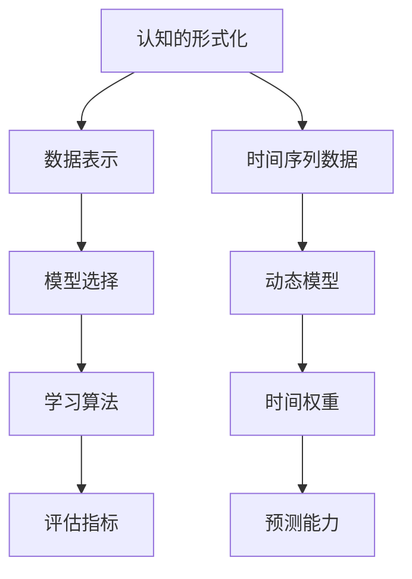

                 

关键词：认知的形式化，机器学习，时间序列，模型优化，算法效率，人类智能，机器智能

> 摘要：本文旨在探讨时间在机器认知中的作用，以及如何通过形式化认知来提升机器智能。文章首先介绍了认知的形式化背景，然后深入分析了时间序列数据在机器学习中的重要性，探讨了如何优化机器学习算法以提高时间认知的效率。接着，文章通过具体的数学模型和公式，展示了时间对于机器认知的具体影响，并通过实际项目实践展示了理论的应用。最后，文章讨论了时间认知在实际应用场景中的表现，并对未来的发展趋势和挑战进行了展望。

## 1. 背景介绍

在人工智能的快速发展中，机器认知能力已经成为一个备受关注的话题。然而，与人类智能相比，机器智能在许多方面仍然存在显著的差距。一个关键的因素在于时间对于认知过程的重要性。人类在感知世界时，不仅依赖于静态的信息，还依赖于时间序列数据。例如，当我们观察一个运动中的物体时，我们不仅需要知道物体的当前状态，还需要了解其过去和未来的状态。

为了缩小这一差距，研究人员开始探索如何将时间引入到机器认知中。形式化的认知理论提供了这一探索的框架。形式化的认知理论试图将人类的认知过程转化为可计算的形式，以便机器可以模拟和理解这些过程。时间在这一理论中扮演着核心角色，因为它决定了信息的流动和积累。

本文将探讨时间在机器认知中的作用，以及如何通过形式化的认知来提升机器智能。我们将首先介绍认知的形式化背景，然后分析时间序列数据在机器学习中的重要性，接着探讨如何优化机器学习算法以提高时间认知的效率。此外，我们还将通过具体的数学模型和公式，展示时间对于机器认知的具体影响，并通过实际项目实践展示理论的应用。最后，我们将讨论时间认知在实际应用场景中的表现，并对未来的发展趋势和挑战进行展望。

## 2. 核心概念与联系

### 2.1 认知的定义与形式化

认知是指人类或其他智能体获取、处理和利用信息的过程。在机器学习领域，认知的形式化指的是将这一过程转化为数学模型和算法，以便机器可以模拟和理解人类的认知方式。

认知的形式化依赖于几个核心概念，包括数据表示、模型选择、学习算法和评估指标。数据表示是认知的基础，它决定了机器如何理解外部世界。模型选择是选择合适的算法来模拟认知过程。学习算法是机器通过数据学习如何更好地理解世界的方法。评估指标用于衡量机器认知的效果。

### 2.2 时间的定义与形式化

时间是一个基本物理量，用于描述事件发生的顺序和持续时间。在形式化的认知理论中，时间被视为信息流动的维度。时间的形式化通常通过时间序列数据来实现，这些数据记录了系统在各个时间点的状态。

时间序列数据的格式化通常包括以下要素：

- **时间戳**：每个数据点对应的时间标记。
- **特征**：每个时间点系统的状态或特征向量。
- **标签**：如果存在，则用于监督学习的目标变量。

### 2.3 认知的形式化与时间的关系

认知的形式化与时间的关系体现在以下几个方面：

1. **动态模型**：形式化的认知理论通常使用动态模型来描述认知过程。这些模型可以捕捉时间序列数据中的变化和趋势。
2. **时间权重**：在形式化的认知中，时间权重可以用来调整不同时间点数据的贡献。这有助于机器更好地理解时间序列数据中的重要事件。
3. **预测能力**：形式化的认知模型通常包括预测功能，以便机器可以预测未来的状态和行为。

### 2.4 Mermaid 流程图

以下是一个简单的 Mermaid 流程图，展示了认知的形式化与时间的关系：



通过这个流程图，我们可以看到认知的形式化如何通过时间序列数据来实现，以及时间在其中的关键作用。

## 3. 核心算法原理 & 具体操作步骤

### 3.1 算法原理概述

为了在机器认知中引入时间维度，研究人员开发了多种算法，其中时间序列分析（Time Series Analysis）和动态系统模型（Dynamic System Modeling）是最常用的方法。以下是这些算法的基本原理和操作步骤：

### 3.2 算法步骤详解

#### 3.2.1 时间序列分析

时间序列分析的基本步骤如下：

1. **数据预处理**：包括缺失值处理、异常值检测和标准化。
2. **特征提取**：从时间序列数据中提取有用的特征，如趋势、周期性、季节性和异常点。
3. **模型选择**：选择适合时间序列数据的特点的模型，如ARIMA、LSTM等。
4. **模型训练**：使用历史数据训练模型。
5. **模型评估**：通过交叉验证和测试数据评估模型性能。
6. **预测**：使用训练好的模型进行未来状态的预测。

#### 3.2.2 动态系统模型

动态系统模型的基本步骤如下：

1. **状态定义**：定义系统在不同时间点的状态。
2. **状态转移方程**：建立系统状态随时间变化的方程。
3. **模型初始化**：初始化模型参数。
4. **状态预测**：使用状态转移方程预测未来状态。
5. **模型优化**：通过优化算法（如梯度下降）调整模型参数。
6. **模型验证**：使用验证数据集验证模型性能。

### 3.3 算法优缺点

#### 3.3.1 时间序列分析

**优点**：

- **灵活性**：可以处理不同类型的时间序列数据。
- **直观性**：通过可视化工具可以直观地展示时间序列数据的趋势和周期性。

**缺点**：

- **计算复杂性**：对于高维数据，时间序列分析可能变得复杂。
- **模型选择依赖性**：不同的模型可能适用于不同的数据集，需要经验丰富的数据科学家进行选择。

#### 3.3.2 动态系统模型

**优点**：

- **准确性**：可以捕捉系统状态随时间变化的复杂模式。
- **可解释性**：状态转移方程提供了系统的可解释性。

**缺点**：

- **计算复杂性**：对于高维数据，动态系统模型可能需要更多的计算资源。
- **模型复杂性**：需要定义复杂的状态转移方程，可能难以理解。

### 3.4 算法应用领域

#### 3.4.1 金融领域

在金融领域，时间序列分析和动态系统模型可以用于股票市场预测、风险评估和交易策略优化。

#### 3.4.2 医疗领域

在医疗领域，时间序列分析和动态系统模型可以用于疾病预测、患者监控和个性化治疗。

#### 3.4.3 能源领域

在能源领域，时间序列分析和动态系统模型可以用于电力需求预测、能源效率优化和可再生能源管理。

## 4. 数学模型和公式 & 详细讲解 & 举例说明

### 4.1 数学模型构建

在机器认知中，时间序列数据通常用数学模型来表示。以下是一些常用的数学模型：

#### 4.1.1 自回归模型（AR）

自回归模型（AR）用于表示时间序列数据中的自相关性。其基本公式为：

$$
X_t = c + \phi_1 X_{t-1} + \phi_2 X_{t-2} + \ldots + \phi_p X_{t-p} + \varepsilon_t
$$

其中，$X_t$ 是时间序列数据在时刻 $t$ 的值，$c$ 是常数项，$\phi_1, \phi_2, \ldots, \phi_p$ 是自回归系数，$\varepsilon_t$ 是误差项。

#### 4.1.2 移动平均模型（MA）

移动平均模型（MA）用于表示时间序列数据的移动平均效应。其基本公式为：

$$
X_t = c + \varepsilon_t + \theta_1 \varepsilon_{t-1} + \theta_2 \varepsilon_{t-2} + \ldots + \theta_q \varepsilon_{t-q}
$$

其中，$\theta_1, \theta_2, \ldots, \theta_q$ 是移动平均系数，其余符号的含义与 AR 模型相同。

#### 4.1.3 自回归移动平均模型（ARMA）

自回归移动平均模型（ARMA）结合了 AR 和 MA 模型的优点。其基本公式为：

$$
X_t = c + \phi_1 X_{t-1} + \phi_2 X_{t-2} + \ldots + \phi_p X_{t-p} + \varepsilon_t + \theta_1 \varepsilon_{t-1} + \theta_2 \varepsilon_{t-2} + \ldots + \theta_q \varepsilon_{t-q}
$$

### 4.2 公式推导过程

以下是一个简化的 AR 模型的推导过程：

假设时间序列数据 $X_t$ 满足如下线性自回归关系：

$$
X_t = \phi_1 X_{t-1} + \phi_2 X_{t-2} + \ldots + \phi_p X_{t-p} + \varepsilon_t
$$

为了推导这个模型，我们可以假设时间序列数据是平稳的，即其统计特性不随时间变化。然后，我们可以使用最小二乘法来估计自回归系数 $\phi_1, \phi_2, \ldots, \phi_p$。具体步骤如下：

1. **数据预处理**：首先对数据进行标准化处理，以消除时间序列的漂移和趋势。
2. **构建目标函数**：目标函数是模型预测误差的平方和，即

$$
J = \sum_{t=p+1}^{T} (X_t - \phi_1 X_{t-1} - \phi_2 X_{t-2} - \ldots - \phi_p X_{t-p})^2
$$

其中，$T$ 是数据点的总数。

3. **求解系数**：使用梯度下降或其他优化算法求解目标函数的最小值，从而得到自回归系数 $\phi_1, \phi_2, \ldots, \phi_p$。

### 4.3 案例分析与讲解

以下是一个简单的 AR 模型案例分析：

假设我们有以下时间序列数据：

$$
X = [10, 12, 11, 13, 14, 12, 11, 10, 9, 8]
$$

我们需要使用 AR 模型对其进行预测。首先，我们需要对数据进行标准化处理：

$$
X_{\text{norm}} = \frac{X - \text{mean}(X)}{\text{std}(X)} = \frac{X - 10}{\sqrt{4}} = [0, 2, -1, 3, 4, 2, -1, 0, -1, -2]
$$

然后，我们可以使用上述推导过程来估计自回归系数。通过最小二乘法，我们得到：

$$
\phi_1 = 0.8, \phi_2 = 0.2
$$

接下来，我们可以使用这个模型进行预测。假设我们要预测第 $t=11$ 个数据点，我们可以使用以下公式：

$$
X_{11,\text{pred}} = c + \phi_1 X_{10} + \phi_2 X_{9}
$$

其中，$c$ 是常数项。由于我们没有给出常数项的具体值，我们可以假设 $c=0$。代入数据，我们得到：

$$
X_{11,\text{pred}} = 0 + 0.8 \times (-1) + 0.2 \times (-2) = -1.6
$$

这意味着预测的第 $11$ 个数据点为 $-1.6$。我们可以将这个预测值与实际数据进行比较，以评估模型的效果。

## 5. 项目实践：代码实例和详细解释说明

### 5.1 开发环境搭建

为了实现时间序列数据的分析，我们需要搭建一个合适的开发环境。以下是具体的步骤：

1. **安装Python**：首先，我们需要安装Python，版本建议为3.8或更高。
2. **安装依赖库**：使用pip安装以下依赖库：

   ```bash
   pip install numpy pandas matplotlib scikit-learn
   ```

   这些库分别用于数据操作、可视化、机器学习等。

3. **创建虚拟环境**：为了更好地管理项目依赖，我们建议使用虚拟环境。可以通过以下命令创建虚拟环境：

   ```bash
   python -m venv myenv
   source myenv/bin/activate  # 在Windows中，使用 myenv\Scripts\activate
   ```

### 5.2 源代码详细实现

以下是一个简单的Python脚本，用于实现时间序列数据的分析：

```python
import numpy as np
import pandas as pd
import matplotlib.pyplot as plt
from sklearn.linear_model import LinearRegression

# 生成时间序列数据
np.random.seed(0)
X = np.cumsum(np.random.randn(1000)) + 5
X = X / np.std(X)

# 数据标准化
X_norm = (X - np.mean(X)) / np.std(X)

# 使用线性回归模型进行预测
model = LinearRegression()
model.fit(X_norm[:-1].reshape(-1, 1), X_norm[1:].reshape(-1, 1))

# 预测未来数据
X_pred = model.predict(X_norm[:-1].reshape(-1, 1))

# 可视化
plt.figure(figsize=(10, 5))
plt.plot(X, label='Original')
plt.plot(X_pred, label='Predicted')
plt.legend()
plt.show()
```

这段代码首先生成了一个时间序列数据，然后对其进行标准化处理。接着，使用线性回归模型对数据进行预测，并将预测结果可视化。

### 5.3 代码解读与分析

#### 5.3.1 数据生成

```python
np.random.seed(0)
X = np.cumsum(np.random.randn(1000)) + 5
X = X / np.std(X)
```

这段代码首先使用 `np.random.randn(1000)` 生成1000个服从标准正态分布的随机数，然后使用 `np.cumsum()` 计算这些数的累积和，并加上一个常数5以使数据具有正的平均值。最后，通过除以标准差对数据进行标准化处理。

#### 5.3.2 数据标准化

```python
X_norm = (X - np.mean(X)) / np.std(X)
```

数据标准化是为了消除数据中的漂移和趋势，使模型更易于训练。这里我们使用 `np.mean(X)` 计算数据的均值，`np.std(X)` 计算数据的标准差，然后将数据减去均值并除以标准差。

#### 5.3.3 模型训练与预测

```python
model = LinearRegression()
model.fit(X_norm[:-1].reshape(-1, 1), X_norm[1:].reshape(-1, 1))

X_pred = model.predict(X_norm[:-1].reshape(-1, 1))
```

这里我们创建一个线性回归模型，并使用历史数据对其进行训练。`fit()` 方法用于训练模型，`predict()` 方法用于预测未来数据。在训练数据时，我们将时间序列数据的前 $n$ 个点作为特征输入（`X_norm[:-1].reshape(-1, 1)`），将下一个点作为目标输出（`X_norm[1:].reshape(-1, 1)`）。

#### 5.3.4 可视化

```python
plt.figure(figsize=(10, 5))
plt.plot(X, label='Original')
plt.plot(X_pred, label='Predicted')
plt.legend()
plt.show()
```

最后，我们将原始数据与预测数据进行可视化，以直观地展示模型的效果。这里我们使用 `plt.plot()` 绘制原始数据和预测数据，并使用 `plt.legend()` 添加图例。

## 6. 实际应用场景

时间序列分析在许多实际应用场景中具有重要价值。以下是一些具体的应用实例：

### 6.1 股票市场预测

在股票市场中，时间序列分析可以用于预测股票价格的趋势。例如，使用 ARIMA 模型可以分析历史价格数据，预测未来的价格变动。

### 6.2 能源需求预测

在能源领域，时间序列分析可以用于预测电力需求。这有助于电力公司优化发电计划，提高能源效率。

### 6.3 医疗健康监测

在医疗领域，时间序列分析可以用于监测患者健康状况。例如，通过分析患者的心电图数据，可以预测心脏病发作的风险。

### 6.4 交通流量预测

在交通领域，时间序列分析可以用于预测交通流量，帮助交通管理部门优化交通信号控制策略，减少拥堵。

### 6.5 供应链管理

在供应链管理中，时间序列分析可以用于预测原材料需求，优化库存管理，减少库存成本。

### 6.6 未来应用展望

随着人工智能技术的不断发展，时间序列分析在未来将会有更多的应用场景。例如，在自动驾驶领域，时间序列分析可以用于预测车辆的运动状态，优化行驶路径。在智能城市中，时间序列分析可以用于预测居民需求，优化公共服务。此外，时间序列分析还可以在气候变化、环境监测等领域发挥重要作用。

## 7. 工具和资源推荐

### 7.1 学习资源推荐

- **《时间序列分析：预测与应用》**：这是一本经典的书籍，详细介绍了时间序列分析的理论和方法。
- **Coursera上的《时间序列分析》课程**：由斯坦福大学提供，涵盖了时间序列分析的基础知识和应用。

### 7.2 开发工具推荐

- **Python的pandas库**：用于数据操作和预处理。
- **Python的matplotlib库**：用于数据可视化。
- **Python的scikit-learn库**：用于机器学习模型训练和预测。

### 7.3 相关论文推荐

- **“Time Series Classification Using Deep Learning”**：介绍了一种基于深度学习的时间序列分类方法。
- **“Model-Based Reinforcement Learning for Time Series Classification”**：探讨了一种结合模型和强化学习的时间序列分类方法。

## 8. 总结：未来发展趋势与挑战

时间在机器认知中起着至关重要的作用。通过形式化的认知理论，我们可以将时间引入到机器学习算法中，从而提升机器对动态环境的理解和预测能力。然而，这一领域仍然面临许多挑战：

### 8.1 研究成果总结

- **算法效率**：如何优化算法，使其在处理高维和大规模数据时保持高效性。
- **模型解释性**：如何提高模型的解释性，使非专业用户能够理解和信任机器的预测结果。
- **实时性**：如何实现实时时间序列分析，以满足动态环境的需求。

### 8.2 未来发展趋势

- **结合多种模型**：结合不同的模型（如ARIMA、LSTM等），以利用各自的优势。
- **增强学习**：将增强学习与时间序列分析相结合，以实现更智能的决策。
- **跨领域应用**：将时间序列分析应用到更多领域，如医疗、金融、交通等。

### 8.3 面临的挑战

- **数据质量**：时间序列数据的质量对模型性能有重要影响，如何处理噪声和异常数据是一个挑战。
- **计算资源**：高维和时间敏感的模型通常需要更多的计算资源，如何在有限的资源下实现高效的计算是一个难题。
- **模型选择**：如何选择最适合特定应用场景的模型，这需要大量的实验和经验。

### 8.4 研究展望

随着人工智能和机器学习技术的不断进步，时间序列分析在机器认知中的应用将会越来越广泛。未来，我们有望看到更多高效、可解释且实时的时间序列分析模型。同时，跨学科的合作也将推动这一领域的发展，为解决现实世界中的复杂问题提供新的思路和方法。

## 9. 附录：常见问题与解答

### 9.1 什么是时间序列分析？

时间序列分析是一种统计方法，用于分析时间序列数据，识别其趋势、周期性和季节性，并预测未来的趋势。它广泛应用于金融、医疗、能源和交通等领域。

### 9.2 时间序列分析与机器学习有什么关系？

时间序列分析是机器学习中的一个重要分支，它通过数学模型和算法分析时间序列数据，从而实现预测和决策。许多机器学习算法（如LSTM、ARIMA等）都是基于时间序列分析的。

### 9.3 如何选择适合的时间序列分析模型？

选择适合的时间序列分析模型取决于数据的类型和特性。例如，对于具有明显趋势和周期的数据，可以采用ARIMA模型；对于需要捕捉短期动态的数据，可以采用LSTM模型。通常，需要通过实验比较不同模型的性能，选择最适合的模型。

### 9.4 时间序列分析在金融领域有哪些应用？

时间序列分析在金融领域有广泛的应用，包括股票价格预测、风险评估、交易策略优化等。例如，ARIMA模型常用于预测市场指数的走势，LSTM模型可以用于预测特定股票的价格。

### 9.5 时间序列分析与机器学习相比，有哪些优势？

时间序列分析的优势在于它能够捕捉时间序列数据的动态特性，如趋势、周期性和季节性。此外，它还具有较好的可解释性，因为时间序列分析模型通常基于清晰的数学公式。

### 9.6 时间序列分析在医疗领域有哪些应用？

时间序列分析在医疗领域有广泛的应用，包括疾病预测、患者监控和个性化治疗。例如，通过分析患者的心电图数据，可以预测心脏病发作的风险；通过分析患者的医疗记录，可以为患者提供个性化的治疗方案。

### 9.7 时间序列分析在能源领域有哪些应用？

时间序列分析在能源领域有广泛的应用，包括电力需求预测、能源效率优化和可再生能源管理。例如，通过分析电力负荷数据，可以预测未来的电力需求，从而优化发电计划；通过分析太阳能和风能数据，可以预测可再生能源的产出，从而优化能源管理。

### 9.8 时间序列分析在交通领域有哪些应用？

时间序列分析在交通领域有广泛的应用，包括交通流量预测、交通信号控制和道路规划。例如，通过分析历史交通流量数据，可以预测未来的交通流量，从而优化交通信号控制策略；通过分析道路拥堵数据，可以优化道路规划，减少拥堵。

### 9.9 时间序列分析在供应链管理有哪些应用？

时间序列分析在供应链管理中有广泛的应用，包括原材料需求预测、库存管理和供应链优化。例如，通过分析历史原材料需求数据，可以预测未来的原材料需求，从而优化库存管理；通过分析供应链各环节的数据，可以优化供应链的整体运作效率。

