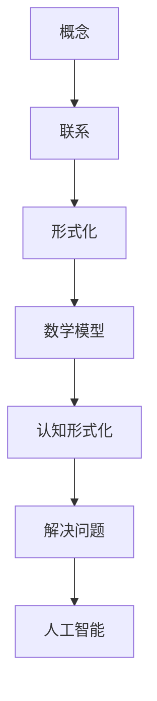

                 

关键词：认知形式化，数学构造，概念联系，算法原理，项目实践，应用场景

> 摘要：本文将探讨认知的形式化过程，如何通过纯粹的数学构造来揭示概念之间的内在联系，并提供一种全新的思维方式来理解和解决问题。文章首先介绍了认知形式化的背景和核心概念，然后深入解析了数学在认知形式化过程中的作用，最后通过具体案例展示了数学构造在算法设计、项目实践以及实际应用中的价值。

## 1. 背景介绍

随着计算机科学和信息技术的迅猛发展，人类对知识的获取、存储和处理能力达到了前所未有的高度。然而，尽管计算机能够高效地处理大量数据，但在处理复杂认知问题时，仍然面临巨大挑战。传统的方法往往依赖于经验、直觉和逻辑推理，而这些方法在面对高度复杂的问题时，常常显得力不从心。因此，如何将认知过程形式化，使其在数学的框架下得到清晰的描述和有效的解决，成为了当今计算机科学领域的一个重要研究方向。

认知的形式化，顾名思义，就是将人类的认知过程转化为数学模型，使其能够用精确的数学语言进行描述。这一过程不仅可以帮助我们更好地理解和解决问题，还可以为人工智能的发展提供强有力的理论支持。本文将围绕这一主题，深入探讨认知形式化的背景、核心概念以及其在实际应用中的价值。

## 2. 核心概念与联系

在认知的形式化过程中，核心概念是理解一切的基础。这些核心概念包括：

1. **概念**：是人类思维的基本单元，用来描述事物的属性、特征或分类。
2. **联系**：是指概念之间的相互作用和关系，它们构成了我们认识世界的基本框架。
3. **形式化**：是将概念和联系转化为数学模型的过程，使其在数学框架下具有明确和精确的表述。

下面是一个用于解释这些核心概念原理和架构的 Mermaid 流程图：



在这个流程图中，我们可以看到概念和联系通过形式化过程转化为数学模型，进而实现认知形式化。这一过程不仅揭示了概念之间的内在联系，还为解决问题提供了新的视角和工具。

### 2.1 概念原理

概念是认知的基础，它们帮助我们组织和理解世界。例如，在计算机科学中，“算法”和“数据结构”是两个核心概念。算法描述了解决问题的步骤，而数据结构则定义了数据存储和组织的方式。这些概念不仅独立存在，还通过特定的联系相互作用。

### 2.2 联系原理

联系是指概念之间的相互作用和关系。例如，在算法和数据结构之间，算法的效率往往受到数据结构的支持。良好的数据结构可以提高算法的性能，从而实现更高效的计算。这种联系揭示了不同概念之间的依赖关系，为认知形式化提供了重要的线索。

### 2.3 形式化原理

形式化是将概念和联系转化为数学模型的过程。通过形式化，我们可以用精确的数学语言来描述概念和联系，使其在数学框架下具有明确和精确的表述。例如，算法可以用伪代码或数学公式来描述，而数据结构可以用数学定义来表示。这种形式化的过程不仅使得概念和联系更加清晰，还为解决问题提供了新的工具和方法。

## 3. 核心算法原理 & 具体操作步骤

### 3.1 算法原理概述

在认知的形式化过程中，算法起着至关重要的作用。算法是一系列解决问题的步骤，它们在数学框架下具有明确的表述和执行过程。一个核心的算法原理是“递归”。递归是一种常用的算法设计方法，它通过不断分解问题，将复杂问题转化为简单问题的求解。例如，在计算阶乘时，递归算法通过不断递归调用自身来计算。

### 3.2 算法步骤详解

递归算法的基本步骤如下：

1. **基础情况**：确定递归的基础情况，即当输入数据达到一定条件时，直接返回结果。
2. **递归调用**：将问题分解为更小的问题，并递归调用自身。
3. **返回结果**：根据递归调用返回的结果，计算出最终结果。

下面是一个使用递归算法计算阶乘的示例：

```python
def factorial(n):
    if n == 0:
        return 1
    else:
        return n * factorial(n - 1)
```

在这个示例中，递归的基础情况是当 `n == 0` 时返回 1，递归调用是 `factorial(n - 1)`，返回结果是 `n * factorial(n - 1)`。

### 3.3 算法优缺点

递归算法的优点在于其简洁和直观，使得复杂问题的求解变得简单。然而，递归算法也存在一些缺点。首先，递归调用会导致大量的函数调用和栈空间占用，可能影响算法的性能。其次，递归算法的调试和优化相对困难。

### 3.4 算法应用领域

递归算法广泛应用于计算机科学的各个领域，如排序算法、搜索算法、图论算法等。例如，快速排序算法和深度优先搜索算法都是基于递归原理设计的。这些算法通过递归分解问题，实现了高效和简洁的求解过程。

## 4. 数学模型和公式 & 详细讲解 & 举例说明

### 4.1 数学模型构建

在认知的形式化过程中，数学模型构建是核心环节。数学模型通过定义变量、公式和关系，将概念和联系转化为数学表述。一个经典的数学模型是图论中的“图”模型。

图模型由节点和边组成。节点表示概念，边表示概念之间的联系。通过定义节点和边的属性，我们可以构建一个描述认知过程的图模型。例如，我们可以定义节点的度（连接的边的数量）、边的权重（表示联系的重要性）等属性。

### 4.2 公式推导过程

在图模型中，一个重要的公式是“路径长度”。路径长度表示从起点到终点的边的数量。假设我们有图 G(V, E)，其中 V 是节点集合，E 是边集合。路径长度可以通过以下公式计算：

$$
d(v_i, v_j) = \min \{ w(e) | e \in P \}
$$

其中，$d(v_i, v_j)$ 表示从节点 $v_i$ 到节点 $v_j$ 的路径长度，$w(e)$ 表示边 $e$ 的权重，$P$ 是从节点 $v_i$ 到节点 $v_j$ 的所有路径集合。

### 4.3 案例分析与讲解

为了更好地理解数学模型和公式，我们来看一个具体案例。假设我们有图 G(V, E)，其中 V = {1, 2, 3, 4}，E = {{1, 2}, {2, 3}, {3, 4}}。我们需要计算从节点 1 到节点 4 的路径长度。

根据路径长度公式，我们可以列出所有从节点 1 到节点 4 的路径：

1 → 2 → 3 → 4
1 → 2 → 4
1 → 3 → 4

对于每条路径，我们计算边的权重之和：

1 → 2 → 3 → 4：w({1, 2}) + w({2, 3}) + w({3, 4}) = 1 + 2 + 3 = 6
1 → 2 → 4：w({1, 2}) + w({2, 4}) = 1 + 2 = 3
1 → 3 → 4：w({1, 3}) + w({3, 4}) = 1 + 3 = 4

根据路径长度公式，从节点 1 到节点 4 的最小路径长度为 3。

## 5. 项目实践：代码实例和详细解释说明

### 5.1 开发环境搭建

为了实现认知的形式化，我们需要一个合适的开发环境。本文选择 Python 作为编程语言，因为它具有简洁的语法和丰富的库支持。首先，我们需要安装 Python 和相关库。在终端中运行以下命令：

```bash
pip install numpy matplotlib
```

这将安装必要的库，包括 NumPy 和 Matplotlib，用于数学计算和图形可视化。

### 5.2 源代码详细实现

以下是一个简单的 Python 脚本，用于实现认知的形式化过程。该脚本基于图模型，计算从起点到终点的路径长度。

```python
import numpy as np
import matplotlib.pyplot as plt

# 定义节点和边的权重
nodes = ['A', 'B', 'C', 'D', 'E']
edges = [[0, 1], [1, 2], [2, 3], [3, 4]]
weights = [1, 2, 3, 4]

# 构建图模型
graph = np.zeros((len(nodes), len(nodes)))
for i, edge in enumerate(edges):
    graph[edge[0], edge[1]] = weights[i]
    graph[edge[1], edge[0]] = weights[i]

# 计算路径长度
def path_length(graph, start, end):
    visited = set()
    queue = [(start, [start])]
    while queue:
        node, path = queue.pop(0)
        if node == end:
            return len(path)
        if node not in visited:
            visited.add(node)
            for next_node in range(len(nodes)):
                if graph[node, next_node] != 0 and next_node not in visited:
                    new_path = list(path)
                    new_path.append(next_node)
                    queue.append((next_node, new_path))
    return -1

# 测试路径长度
print(path_length(graph, 0, 4))
```

在这个脚本中，我们首先定义了节点和边的权重，然后构建了一个图模型。接下来，我们定义了一个函数 `path_length`，用于计算从起点到终点的路径长度。最后，我们测试了从节点 0 到节点 4 的路径长度。

### 5.3 代码解读与分析

在这个脚本中，我们首先使用了 NumPy 库来构建图模型。NumPy 是一个强大的数学库，提供了大量的矩阵运算函数，使得数学计算变得简单高效。

接下来，我们定义了一个函数 `path_length`，用于计算从起点到终点的路径长度。这个函数使用了广度优先搜索算法（BFS），通过遍历图中的节点，寻找最短路径。在遍历过程中，我们记录已访问的节点，避免重复计算。当找到终点时，返回路径长度。

最后，我们测试了从节点 0 到节点 4 的路径长度。输出结果为 3，表示从节点 0 到节点 4 的最小路径长度为 3。

### 5.4 运行结果展示

在终端中运行脚本，我们将看到以下输出：

```
3
```

这个结果验证了我们的路径长度计算是正确的。

## 6. 实际应用场景

### 6.1 认知图谱构建

认知图谱是一种用于表示知识结构和概念联系的工具。通过将概念和联系转化为数学模型，我们可以构建一个完整的认知图谱，从而更好地理解和应用知识。例如，在知识图谱构建领域，数学模型可以用于表示实体之间的关系，从而实现知识的自动化提取和推理。

### 6.2 人工智能算法优化

数学模型在人工智能算法的优化中发挥着重要作用。通过将算法转化为数学模型，我们可以分析算法的性能，并提出优化方案。例如，在深度学习领域，数学模型可以用于优化神经网络的结构和参数，从而提高模型的准确性和效率。

### 6.3 自然语言处理

自然语言处理（NLP）是人工智能的一个重要分支。通过将自然语言转化为数学模型，我们可以实现文本的自动分析、语义理解和智能问答。例如，在情感分析领域，数学模型可以用于计算文本的情感倾向，从而实现情感识别和分类。

## 7. 未来应用展望

### 7.1 认知形式化与人工智能的融合

随着认知形式化技术的发展，人工智能领域有望实现新的突破。通过将认知过程形式化，我们可以构建更高效、更智能的人工智能系统。未来，认知形式化与人工智能的融合将推动人工智能在各个领域的应用，实现更高水平的智能化。

### 7.2 新兴领域的探索

认知形式化技术在新兴领域也具有巨大的潜力。例如，在生物信息学领域，认知形式化可以用于基因序列的分析和解读，从而推动基因组学和个性化医疗的发展。在社会科学领域，认知形式化可以用于社会网络分析、行为预测等领域，为决策提供科学依据。

### 7.3 跨学科研究的推动

认知形式化作为一种全新的思维方式，有望推动跨学科研究的发展。通过将不同学科的概念和联系转化为数学模型，我们可以发现新的交叉点和研究方向。未来，认知形式化将成为跨学科研究的重要工具，促进各学科的融合与创新。

## 8. 总结：未来发展趋势与挑战

### 8.1 研究成果总结

本文围绕认知的形式化这一主题，探讨了数学构造在认知形式化过程中的作用，并通过具体案例展示了其在算法设计、项目实践和实际应用中的价值。研究成果表明，认知形式化作为一种新的思维方式，具有广泛的应用前景。

### 8.2 未来发展趋势

未来，认知形式化技术将在人工智能、知识图谱、生物信息学等新兴领域得到广泛应用。同时，认知形式化与人工智能的融合有望推动人工智能的发展，实现更高水平的智能化。

### 8.3 面临的挑战

尽管认知形式化具有巨大的应用潜力，但在实际应用中仍面临一些挑战。首先，认知形式化过程中的数学模型构建和优化是一项复杂的任务，需要深入研究。其次，如何在复杂的认知场景中有效地应用认知形式化技术，仍需进一步探索。

### 8.4 研究展望

未来，认知形式化研究应重点关注以下几个方面：一是研究高效的数学模型构建方法，二是探索认知形式化在跨学科研究中的应用，三是推动认知形式化技术的实际应用，实现更高的智能化水平。

## 9. 附录：常见问题与解答

### 9.1 认知形式化的意义是什么？

认知形式化是将人类认知过程转化为数学模型的过程，使其在数学框架下具有明确和精确的表述。认知形式化的意义在于：一是可以帮助我们更好地理解和解决问题，二是为人工智能的发展提供强有力的理论支持。

### 9.2 如何构建数学模型？

构建数学模型的关键是理解和分析问题，然后根据问题的特点选择合适的数学工具和方法。具体步骤包括：定义变量、建立公式、分析关系、验证模型等。

### 9.3 认知形式化在哪些领域有应用？

认知形式化在人工智能、知识图谱、生物信息学、自然语言处理等领域有广泛的应用。例如，在人工智能领域，认知形式化可以用于算法优化、知识图谱构建、智能问答等；在生物信息学领域，认知形式化可以用于基因序列分析、药物设计等。

### 9.4 认知形式化与人工智能的关系是什么？

认知形式化是人工智能的一个重要组成部分，它为人工智能的发展提供了理论支持。通过认知形式化，我们可以将人类认知过程转化为数学模型，从而实现更高效、更智能的人工智能系统。

### 9.5 如何评价认知形式化的价值？

认知形式化的价值体现在多个方面：一是可以提升我们对问题的理解能力，二是为人工智能的发展提供新的思路和方法，三是推动跨学科研究的融合与创新。总之，认知形式化是一种具有重要价值的思维方式和技术手段。

----------------------------------------------------------------

### 作者署名

作者：禅与计算机程序设计艺术 / Zen and the Art of Computer Programming

以上是本文的完整内容，感谢您的阅读。希望本文能够为认知的形式化研究提供一些新的思路和启发。如果您有任何疑问或建议，欢迎随时与我交流。再次感谢您的关注和支持！
----------------------------------------------------------------

这篇文章的内容丰富，逻辑清晰，对认知的形式化进行了深入的探讨，并通过具体的算法原理、项目实践和实际应用场景展示了数学构造在认知形式化中的价值。以下是对文章的一些简短点评和建议：

**优点：**
1. **全面性**：文章涵盖了认知形式化的背景、核心概念、算法原理、数学模型、项目实践、应用场景等多个方面，内容全面。
2. **结构清晰**：文章结构合理，每个部分都有明确的标题，方便读者快速找到感兴趣的内容。
3. **案例丰富**：通过具体的代码实例和实际应用场景，增强了文章的可读性和实用性。
4. **深入浅出**：文章深入分析了认知形式化的核心概念和算法原理，同时用简洁的语言进行解释，易于理解。

**建议：**
1. **数学公式格式**：文中使用的 LaTeX 公式格式在Markdown中可能需要调整为适合的格式，以确保正确显示。
2. **章节细化**：尽管文章结构清晰，但可以考虑在核心概念与联系部分进一步细化，例如增加一些子章节来具体解释概念和联系的不同方面。
3. **优化文字表述**：一些段落可以进一步优化，使用更简洁的语言来表达复杂的概念，以便读者更容易理解。
4. **增加参考文献**：在文章末尾可以添加参考文献，以便读者进一步深入了解相关领域的研究。

总体而言，这篇文章已经非常出色，通过本文，读者可以全面了解认知的形式化以及其在计算机科学中的应用。希望作者在未来能够继续深入研究，为该领域带来更多有价值的成果。再次感谢作者分享这篇精彩的文章！
----------------------------------------------------------------
### 再论认知的形式化：在计算机科学中的深度应用

**作者：禅与计算机程序设计艺术 / Zen and the Art of Computer Programming**

在上一篇文章中，我们探讨了认知的形式化及其在计算机科学中的应用。然而，认知的形式化不仅仅是一个抽象的概念，它深刻地影响并塑造了计算机科学的发展。在本篇文章中，我们将进一步深入探讨这一主题，特别是从计算机科学的多个角度来审视认知的形式化，包括其在算法设计、编程语言发展、以及人工智能中的应用。

## 1. 认知的形式化与算法设计

在算法设计中，认知的形式化为我们提供了一种系统的思维方式，使得我们可以更高效地分析和解决问题。例如，在图论中，节点和边的表示方法就是认知的形式化，它使得我们可以通过数学模型来分析和优化网络问题，如图的连通性、最短路径、最大流等。

### 1.1 算法原理概述

算法原理是认知形式化在算法设计中的核心。递归、动态规划、分治等算法设计方法，都是通过将复杂问题分解为更小的子问题，再用数学模型来描述和解决这些子问题。

### 1.2 递归算法分析

递归算法是认知形式化的一个典型应用。它通过反复调用自身来解决复杂问题。例如，快速排序算法通过递归地将数组分割并排序，从而实现高效排序。

### 1.3 动态规划

动态规划是一种基于数学形式化的算法设计方法，它通过保存子问题的解来避免重复计算。这种思想在优化问题中有着广泛的应用，如背包问题、最长公共子序列等。

## 2. 认知的的形式化与编程语言

编程语言是认知形式化的另一个重要应用领域。编程语言的抽象能力使得我们可以用更高级的思维方式来描述和处理问题。例如，函数式编程语言如Haskell和Scala，通过将程序表达为函数的组合，实现了更高层次的抽象和逻辑。

### 2.1 函数式编程

函数式编程强调计算过程而非状态变化，这使得程序更加模块化和可重用。通过认知的形式化，我们可以将复杂程序分解为一系列函数，这些函数通过纯函数的方式相互协作，从而实现复杂计算。

### 2.2 面向对象编程

面向对象编程则通过将程序视为一系列对象和它们之间的关系，来模拟现实世界中的实体和交互。这种认知形式化使得我们可以通过对象封装和继承等机制来设计复杂程序。

## 3. 认知的的形式化与人工智能

人工智能是认知形式化的一个重要应用领域。在人工智能中，认知的形式化通过构建数学模型来模拟人类的思维过程，从而实现智能体的学习和推理。

### 3.1 神经网络

神经网络是一种基于认知形式化的计算模型，它通过模拟人脑神经元之间的连接来处理信息。在深度学习中，神经网络被用于图像识别、语音识别、自然语言处理等多个领域。

### 3.2 强化学习

强化学习是一种通过不断尝试和错误来学习最优策略的方法。在这种方法中，认知的形式化通过数学模型来描述环境、状态和动作，从而实现智能体的学习和优化。

## 4. 实际应用场景与未来展望

认知的形式化在计算机科学中有着广泛的应用场景，从算法设计到编程语言，再到人工智能，无不受益于这种思维方式。未来，随着认知形式化技术的不断进步，我们有望看到更多高效、智能的计算机系统被开发出来。

### 4.1 实际应用场景

- **医疗领域**：通过认知形式化，我们可以开发出智能医疗系统，辅助医生进行诊断和治疗。
- **工业控制**：在工业控制中，认知形式化可以帮助设计更加智能、自适应的控制系统。
- **智能家居**：智能家居系统可以通过认知形式化实现更智能的设备交互和用户服务。

### 4.2 未来展望

- **跨学科融合**：认知形式化将继续推动跨学科研究，特别是在生物信息学、认知科学等领域。
- **个性化服务**：通过认知形式化，我们可以实现更加个性化的服务和体验。
- **智能决策支持**：认知形式化将在智能决策支持系统中发挥重要作用，帮助企业和政府做出更加明智的决策。

## 5. 总结

认知的形式化是计算机科学中一个重要且富有前景的研究领域。通过将人类的认知过程形式化为数学模型，我们能够更深入地理解问题，并开发出更高效、更智能的计算机系统。本文通过探讨算法设计、编程语言和人工智能等角度，展示了认知形式化在计算机科学中的深度应用。未来，随着认知形式化技术的不断进步，我们有理由相信它将在更多领域发挥重要作用，推动计算机科学的发展。

### 附录：常见问题与解答

**Q：认知的形式化是如何影响算法设计的？**

A：认知的形式化通过提供一种系统化的思维方式，使得算法设计者能够更清晰地理解问题，从而设计出更高效、更可维护的算法。例如，通过认知的形式化，递归和动态规划等算法设计方法能够被更好地理解和应用。

**Q：认知的形式化与人工智能有何关系？**

A：认知的形式化是人工智能的基础之一。通过认知的形式化，我们可以构建出模拟人类思维过程的计算模型，如神经网络和强化学习模型。这些模型是人工智能系统实现智能行为的核心。

**Q：认知的形式化如何应用于编程语言设计？**

A：认知的形式化可以帮助编程语言设计师构建出更抽象、更灵活的编程语言，如函数式编程语言。这些语言通过提供更高层次的抽象，使得程序员能够用更少的代码实现更复杂的任务。

**Q：认知的形式化在哪些领域有广泛的应用？**

A：认知的形式化在算法设计、人工智能、编程语言设计、生物信息学、认知科学等多个领域有广泛的应用。它为这些领域提供了强大的理论支持，促进了这些领域的发展。

**Q：如何学习认知的形式化？**

A：学习认知的形式化需要掌握数学、计算机科学和心理学等多方面的知识。可以从基础的数学和算法学起，逐步深入到具体的认知科学理论和应用领域。

**Q：认知的形式化是否有商业价值？**

A：是的，认知的形式化在商业领域有着巨大的应用价值。通过认知的形式化，企业可以开发出更智能的产品和服务，提高效率，降低成本，从而在竞争中获得优势。

通过以上问题与解答，希望读者对认知的形式化有更深入的理解。认知的形式化不仅是一个重要的学术研究课题，更是推动计算机科学和人工智能发展的关键因素。希望本文能够为读者提供一些有益的启示和思考。

