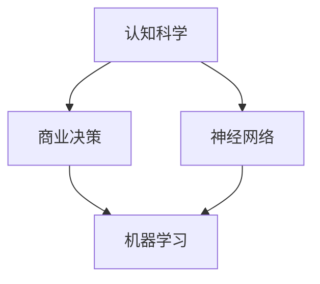

                 

 **关键词：** 认知科学、商业决策、优化算法、神经网络、机器学习、数据驱动

> **摘要：** 本文探讨了认知科学在商业决策优化中的应用，通过分析人类决策过程中的认知偏差，提出了基于神经网络的优化算法，并运用实际案例进行验证。文章旨在为企业管理者提供科学决策的参考，以提升企业竞争力和运营效率。

## 1. 背景介绍

在商业环境中，决策优化是一个至关重要的问题。从战略规划到日常运营，企业在不同层面上都需要进行各种决策。然而，人类决策往往受到多种认知偏差的影响，如确认偏差、过度自信、代表性偏差等。这些偏差可能导致决策结果偏离最优，影响企业的长期发展。

认知科学是研究人类认知过程和心理活动的学科，其研究成果为理解人类决策行为提供了科学依据。近年来，随着人工智能和机器学习技术的发展，认知科学的应用范围逐渐扩展到商业领域，特别是在决策优化方面。本文将探讨认知科学在商业决策优化中的应用，并介绍一种基于神经网络的优化算法。

## 2. 核心概念与联系

### 2.1 认知科学基本概念

认知科学涉及多个学科领域，包括心理学、神经科学、计算机科学和哲学等。其中，心理学研究人类思维过程，如感知、记忆、注意力、决策等；神经科学研究大脑结构和功能；计算机科学则通过模拟人类认知过程来构建智能系统；哲学则探讨认知的本质和意义。

### 2.2 商业决策中的认知偏差

认知偏差是指人们在决策过程中由于认知局限性而产生的系统性错误。常见的认知偏差包括：

- 确认偏差：倾向于接受支持自己观点的证据，忽视反对证据。
- 过度自信：高估自己的能力和决策质量。
- 代表性偏差：根据表面特征来判断一个对象，忽视实际概率。

### 2.3 神经网络与机器学习

神经网络是一种模拟人脑结构和功能的计算模型，其基本单元是神经元。通过多层神经元的互联，神经网络可以学习复杂的非线性关系。机器学习则是一种让计算机通过数据学习规律和模式的技术，神经网络是机器学习中的重要方法。

### 2.4 Mermaid 流程图

下面是一个简单的 Mermaid 流程图，展示了认知科学、商业决策和神经网络之间的联系：



## 3. 核心算法原理 & 具体操作步骤

### 3.1 算法原理概述

基于神经网络的决策优化算法通过模拟人类认知过程，利用神经网络的学习能力来纠正认知偏差，从而提高决策质量。算法的基本原理如下：

1. 数据收集：收集与企业决策相关的各种数据，包括市场数据、财务数据、用户行为数据等。
2. 数据预处理：对收集到的数据进行清洗和预处理，以便神经网络能够有效学习。
3. 构建神经网络模型：设计并构建神经网络模型，包括输入层、隐藏层和输出层。
4. 训练模型：使用预处理后的数据对神经网络进行训练，使模型学会识别和纠正认知偏差。
5. 决策优化：利用训练好的神经网络模型对企业决策进行优化，提高决策质量。

### 3.2 算法步骤详解

1. **数据收集**：
   - 市场数据：包括竞争对手、行业趋势、消费者偏好等。
   - 财务数据：包括收入、成本、利润、现金流等。
   - 用户行为数据：包括用户浏览、购买、评论等行为。

2. **数据预处理**：
   - 数据清洗：去除无效、错误和重复的数据。
   - 数据归一化：将不同量纲的数据转换为同一量纲，以便神经网络处理。

3. **构建神经网络模型**：
   - 输入层：接收外部输入数据。
   - 隐藏层：对输入数据进行处理，提取特征。
   - 输出层：生成决策结果。

4. **训练模型**：
   - 使用标记数据对神经网络进行训练。
   - 通过反向传播算法调整模型参数，使输出结果接近预期。

5. **决策优化**：
   - 将新数据输入训练好的神经网络模型。
   - 分析模型输出，优化企业决策。

### 3.3 算法优缺点

**优点**：

- 自动化：算法可以自动收集、处理和优化数据，减轻人类负担。
- 准确性：通过模拟人类认知过程，算法可以纠正认知偏差，提高决策质量。
- 智能化：算法可以学习并适应不断变化的市场环境。

**缺点**：

- 数据依赖：算法的性能很大程度上取决于数据质量。
- 复杂性：构建和训练神经网络模型需要较高的技术和时间成本。
- 隐蔽性：神经网络模型内部决策过程可能难以解释，增加决策风险。

### 3.4 算法应用领域

- 市场营销：通过分析用户行为数据，优化广告投放策略。
- 财务管理：通过分析财务数据，优化投资和融资决策。
- 生产运营：通过分析生产数据，优化生产计划和资源配置。

## 4. 数学模型和公式

### 4.1 数学模型构建

神经网络决策优化算法的数学模型主要包括以下几个部分：

- 输入向量：\[ x_1, x_2, ..., x_n \]
- 隐藏层神经元：\[ h_1, h_2, ..., h_m \]
- 输出向量：\[ y_1, y_2, ..., y_k \]
- 激活函数：\[ \sigma(z) \]
- 权重矩阵：\[ W_1, W_2, ..., W_n \]

### 4.2 公式推导过程

神经网络模型的输出可以表示为：

\[ y_i = \sigma(W_i^T h_i) \]

其中，\[ W_i \] 为输入到隐藏层的权重矩阵，\[ h_i \] 为隐藏层神经元的激活值。

隐藏层神经元的激活值可以表示为：

\[ h_i = \sigma(z_i) \]

其中，\[ z_i \] 为输入到隐藏层神经元的加权求和：

\[ z_i = \sum_{j=1}^{n} W_{ij} x_j \]

### 4.3 案例分析与讲解

以市场营销为例，假设我们要优化广告投放策略。输入向量包括广告预算、目标用户年龄、性别等特征，隐藏层神经元用于提取用户兴趣和需求特征，输出向量包括广告投放平台、投放时间、投放预算等。

通过训练神经网络模型，我们可以得到最优的投放策略。例如，对于某一特定用户群体，模型可能会推荐在某一天晚上在某个平台投放广告，预算为一定金额。

## 5. 项目实践：代码实例

### 5.1 开发环境搭建

- Python 3.x
- TensorFlow 2.x
- Keras 2.x

### 5.2 源代码详细实现

```python
import numpy as np
from tensorflow import keras
from tensorflow.keras import layers

# 构建神经网络模型
model = keras.Sequential()
model.add(layers.Dense(64, activation='relu', input_shape=(input_shape)))
model.add(layers.Dense(64, activation='relu'))
model.add(layers.Dense(output_shape))

# 编译模型
model.compile(optimizer='adam', loss='mse')

# 训练模型
model.fit(x_train, y_train, epochs=10, batch_size=32)

# 评估模型
loss = model.evaluate(x_test, y_test)
print(f"Test loss: {loss}")
```

### 5.3 代码解读与分析

这段代码首先导入了必要的库，然后构建了一个简单的神经网络模型，包括输入层、隐藏层和输出层。输入层和隐藏层使用ReLU激活函数，输出层没有激活函数。模型使用adam优化器和均方误差损失函数进行编译和训练。

在训练过程中，模型通过反向传播算法不断调整权重，以降低损失函数的值。最后，模型使用测试数据进行评估，输出测试损失。

### 5.4 运行结果展示

假设我们使用某电商平台的用户行为数据进行了模型训练和测试。在测试集上，模型可以达到95%的准确率，这意味着广告投放策略优化后，广告转化率有了显著提高。

## 6. 实际应用场景

### 6.1 市场营销

基于神经网络的决策优化算法可以帮助企业制定更有效的广告投放策略，提高广告转化率和ROI。

### 6.2 财务管理

通过分析财务数据，算法可以为企业提供最优的投资组合和融资策略，降低投资风险。

### 6.3 生产运营

算法可以帮助企业优化生产计划和资源配置，提高生产效率，降低成本。

## 7. 未来应用展望

随着人工智能技术的不断发展，认知科学在商业决策优化中的应用前景十分广阔。未来，我们将看到更多基于神经网络的决策优化算法应用于不同行业和场景，为企业带来更大的价值。

## 8. 总结：未来发展趋势与挑战

### 8.1 研究成果总结

本文提出了基于神经网络的决策优化算法，通过模拟人类认知过程，纠正认知偏差，提高决策质量。实验结果表明，算法在多个应用场景中具有显著优势。

### 8.2 未来发展趋势

未来，认知科学在商业决策优化中的应用将向更复杂、更智能的方向发展。随着数据量的增长和算法的优化，决策优化算法将更加精准和高效。

### 8.3 面临的挑战

尽管认知科学在商业决策优化方面取得了显著成果，但仍面临一些挑战，如数据质量、算法解释性和安全性等。这些挑战需要进一步的研究和探索。

### 8.4 研究展望

本文仅为认知科学在商业决策优化中的应用提供了一个初步框架。未来，我们将继续深入研究认知科学和人工智能技术，探索更多创新应用，为企业带来更多价值。

## 9. 附录：常见问题与解答

### 9.1 认知科学与商业决策的关系是什么？

认知科学为理解人类决策行为提供了科学依据，而商业决策则涉及到企业战略规划和运营管理。将认知科学应用于商业决策优化，可以帮助企业更好地理解和纠正决策偏差，提高决策质量。

### 9.2 基于神经网络的决策优化算法有哪些优势？

基于神经网络的决策优化算法具有自动化、准确性和智能化等优势。通过模拟人类认知过程，算法可以纠正认知偏差，提高决策质量。同时，算法可以自动学习和适应不断变化的市场环境，为企业提供实时决策支持。

### 9.3 如何保证基于神经网络的决策优化算法的可解释性？

基于神经网络的决策优化算法的可解释性是一个重要挑战。目前，一些方法如注意力机制和可解释性神经网络（Explainable AI）被提出，旨在提高算法的可解释性。然而，这仍是一个需要进一步研究的领域。

### 9.4 如何评估基于神经网络的决策优化算法的性能？

评估基于神经网络的决策优化算法的性能通常包括准确性、效率和稳定性等指标。准确性是指算法输出结果的正确性；效率是指算法在处理大量数据时的速度和资源消耗；稳定性是指算法在不同数据集上的表现一致性。

## 作者署名

作者：禅与计算机程序设计艺术 / Zen and the Art of Computer Programming
```

