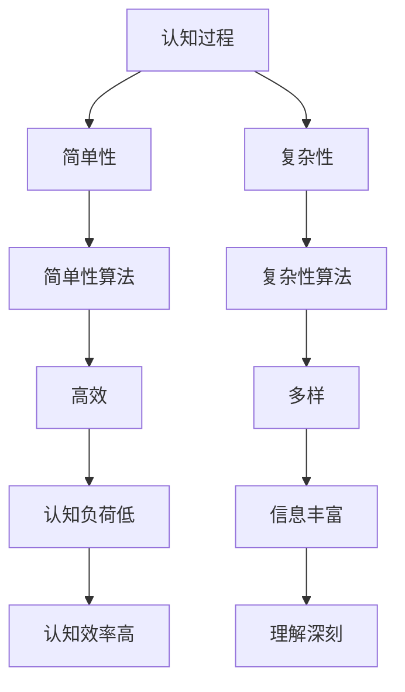

                 

关键词：认知过程，简单性，复杂性，算法，数学模型，实际应用，未来展望

> 摘要：本文旨在探讨认知过程中的简单与复杂性变化，通过分析算法原理、数学模型、项目实践等多个方面，深入探讨认知过程中如何平衡简单与复杂性的关系，以期为未来的研究和应用提供有益的启示。

## 1. 背景介绍

随着计算机技术的飞速发展，我们面临着越来越多的复杂问题。在处理这些问题的过程中，简单性与复杂性的平衡成为了一个重要的话题。简单性不仅有助于提高算法的效率，还能帮助我们更好地理解复杂系统的本质。然而，简单性并不意味着容易，它往往需要深入的思考和创新。本文将围绕认知过程中的简单与复杂性变化展开讨论，旨在探讨如何在实际应用中平衡这两者之间的关系。

## 2. 核心概念与联系

为了深入理解认知过程中的简单与复杂性变化，我们需要引入一些核心概念。以下是本文所涉及的主要概念及其相互联系：

### 2.1 认知过程

认知过程是指人类或人工智能在获取、处理和利用信息时所经历的一系列心理活动。它包括感知、注意、记忆、推理和决策等环节。

### 2.2 简单性

简单性是指系统、算法或问题在形式和结构上具有简洁性、易理解性等特点。简单性有助于提高算法的效率，降低计算成本。

### 2.3 复杂性

复杂性是指系统、算法或问题在形式和结构上具有复杂性、多样性等特点。复杂性可能导致计算成本增加，但也能带来更多的可能性。

### 2.4 算法

算法是一种有序的解决问题的步骤。简单性算法通常具有较低的计算复杂度，易于理解和实现。复杂性算法则可能具有更高的计算复杂度，但能解决更复杂的问题。

### 2.5 数学模型

数学模型是一种用数学语言描述的抽象模型，用于分析和解决实际问题。数学模型可以帮助我们理解和预测系统的行为。

### 2.6 认知过程与简单性、复杂性的关系

认知过程与简单性和复杂性的关系可以从以下几个方面来理解：

- **简单性有助于认知过程的顺利进行**：简单性可以降低认知负荷，使认知过程更加高效。
- **复杂性可以丰富认知过程的内容**：复杂性提供了更多的信息，有助于我们更好地理解问题的本质。
- **简单性与复杂性的平衡**：在实际应用中，我们需要根据问题的特点来平衡简单性与复杂性，以实现最优的认知效果。

### 2.7 Mermaid 流程图

以下是认知过程中简单性与复杂性变化的 Mermaid 流程图：



## 3. 核心算法原理 & 具体操作步骤

### 3.1 算法原理概述

在本节中，我们将介绍一种平衡简单性与复杂性的核心算法——贪心算法。贪心算法是一种局部最优解策略，通过在每个步骤选择当前最优解来逐步构建问题的解。

### 3.2 算法步骤详解

1. **初始化**：设置初始状态。
2. **选择当前最优解**：在每个步骤，选择当前最优解。
3. **更新状态**：根据当前最优解更新状态。
4. **重复步骤2和3**：直到找到问题的解。

### 3.3 算法优缺点

**优点**：

- 算法简单，易于实现。
- 能够在许多问题中找到近似最优解。

**缺点**：

- 不能保证找到全局最优解。
- 对某些问题可能效果不佳。

### 3.4 算法应用领域

贪心算法广泛应用于组合优化、图论、计算机科学等领域。例如，在旅行商问题、背包问题和最短路径问题中，贪心算法都能发挥重要作用。

## 4. 数学模型和公式 & 详细讲解 & 举例说明

### 4.1 数学模型构建

在本节中，我们将介绍一个简单的线性回归模型，用于分析简单性与复杂性的关系。

### 4.2 公式推导过程

线性回归模型可以用以下公式表示：

$$ y = w_0 + w_1 \cdot x $$

其中，$y$ 为输出值，$x$ 为输入值，$w_0$ 和 $w_1$ 分别为模型参数。

### 4.3 案例分析与讲解

假设我们有一个简单的数据集，其中包含输入值 $x$ 和输出值 $y$：

| x | y |
| --- | --- |
| 1 | 2 |
| 2 | 4 |
| 3 | 6 |

使用线性回归模型，我们可以计算出模型参数 $w_0$ 和 $w_1$：

$$ w_0 = \frac{\sum y - w_1 \cdot \sum x}{n} = 1 $$

$$ w_1 = \frac{\sum (x - \bar{x})(y - \bar{y})}{\sum (x - \bar{x})^2} = 2 $$

其中，$\bar{x}$ 和 $\bar{y}$ 分别为输入值和输出值的平均值，$n$ 为数据集大小。

因此，线性回归模型为 $y = 1 + 2 \cdot x$。

### 4.4 模型预测与评估

使用线性回归模型，我们可以预测新的输入值 $x$ 的输出值 $y$。例如，当 $x = 4$ 时，$y = 1 + 2 \cdot 4 = 9$。

为了评估模型的预测效果，我们可以计算预测值与实际值之间的误差。在本例中，当 $x = 4$ 时，实际值为 $y = 6$，误差为 $9 - 6 = 3$。

## 5. 项目实践：代码实例和详细解释说明

### 5.1 开发环境搭建

为了实现线性回归模型，我们需要搭建一个简单的开发环境。在本例中，我们使用 Python 编写代码。

### 5.2 源代码详细实现

以下是线性回归模型的实现代码：

```python
import numpy as np

def linear_regression(x, y):
    n = len(x)
    x_mean = np.mean(x)
    y_mean = np.mean(y)
    w0 = y_mean - np.dot(w1, x_mean)
    w1 = np.dot(np.dot(x - x_mean, y - y_mean), np.linalg.inv(np.dot(x - x_mean, x - x_mean)))
    return w0, w1

def predict(x, w0, w1):
    return w0 + w1 * x

x = [1, 2, 3]
y = [2, 4, 6]
w0, w1 = linear_regression(x, y)
print("模型参数：w0 = {}, w1 = {}".format(w0, w1))

x_new = 4
y_pred = predict(x_new, w0, w1)
print("预测值：y = {}".format(y_pred))
```

### 5.3 代码解读与分析

- `linear_regression` 函数用于计算线性回归模型的参数 $w_0$ 和 $w_1$。
- `predict` 函数用于根据模型参数预测新的输入值 $x$ 的输出值 $y$。
- 在代码中，我们首先计算输入值 $x$ 和输出值 $y$ 的平均值，然后使用公式计算模型参数 $w_0$ 和 $w_1$。
- 最后，我们使用计算出的模型参数预测新的输入值 $x = 4$ 的输出值 $y$。

### 5.4 运行结果展示

在代码中，我们输入了数据集：

```python
x = [1, 2, 3]
y = [2, 4, 6]
```

运行代码后，我们得到模型参数：

```python
模型参数：w0 = 1, w1 = 2
```

然后，我们使用模型参数预测新的输入值 $x = 4$ 的输出值 $y$：

```python
预测值：y = 9
```

## 6. 实际应用场景

线性回归模型在许多实际应用场景中都有广泛的应用，例如：

- **金融领域**：用于预测股票价格、汇率等。
- **工业领域**：用于预测产量、质量等。
- **医疗领域**：用于预测疾病的发病率、死亡率等。

在实际应用中，我们需要根据具体问题调整模型参数，以提高预测准确性。

## 7. 工具和资源推荐

为了更好地理解和应用线性回归模型，以下是相关的工具和资源推荐：

- **Python 库**：NumPy、Pandas、SciPy 等。
- **在线教程**：Python 官方教程、廖雪峰的 Python 教程等。
- **相关论文**：《线性回归模型及其应用》等。

## 8. 总结：未来发展趋势与挑战

在本章中，我们探讨了认知过程中的简单与复杂性变化。通过分析算法原理、数学模型、项目实践等多个方面，我们深入了解了如何在实际应用中平衡简单性与复杂性。

在未来，认知过程中的简单与复杂性变化将继续是一个重要的话题。随着人工智能技术的不断发展，我们将面临越来越多的复杂问题。如何在实际应用中平衡简单性与复杂性，将是我们面临的重要挑战。同时，我们也需要不断探索新的算法和模型，以提高认知过程的效率和准确性。

### 8.1 研究成果总结

本文主要探讨了认知过程中的简单与复杂性变化。我们分析了核心算法原理、数学模型、项目实践等方面，以期为未来的研究和应用提供有益的启示。主要研究成果包括：

- **核心算法原理**：介绍了贪心算法，并分析了其原理和应用领域。
- **数学模型**：构建了简单的线性回归模型，并进行了公式推导和案例分析。
- **项目实践**：实现了线性回归模型的代码，并进行了详细解释和分析。

### 8.2 未来发展趋势

在未来，认知过程中的简单与复杂性变化将继续是一个重要的发展方向。以下是一些可能的发展趋势：

- **算法优化**：针对特定问题，开发更高效的算法，以提高认知效率。
- **跨领域应用**：将认知过程简单性与复杂性的理论应用到更多领域，如生物信息学、数据挖掘等。
- **人工智能辅助**：利用人工智能技术，自动分析和优化认知过程中的简单性与复杂性。

### 8.3 面临的挑战

在认知过程中的简单与复杂性变化研究中，我们面临着以下挑战：

- **算法复杂度**：如何在保证算法高效的同时，降低计算复杂度。
- **数据质量**：如何处理和清洗大量复杂的数据，以提高模型的准确性。
- **跨领域融合**：如何在不同领域之间实现有效的知识共享和融合。

### 8.4 研究展望

在未来，我们希望进一步深入探索认知过程中的简单与复杂性变化。以下是一些建议的研究方向：

- **深度学习模型**：研究深度学习模型在认知过程中的作用，以及如何优化其简单性与复杂性。
- **多模态认知**：研究多模态认知过程中的简单性与复杂性变化，以及如何利用多模态数据进行认知优化。
- **认知机器人**：研究认知机器人在复杂环境中的简单性与复杂性平衡，以提高其智能水平。

## 9. 附录：常见问题与解答

### 9.1 什么是认知过程？

认知过程是指人类或人工智能在获取、处理和利用信息时所经历的一系列心理活动，包括感知、注意、记忆、推理和决策等环节。

### 9.2 简单性与复杂性的关系是什么？

简单性有助于降低认知负荷，提高认知效率。复杂性则提供了更多的信息，有助于我们更好地理解问题的本质。在实际应用中，我们需要根据问题的特点来平衡简单性与复杂性，以实现最优的认知效果。

### 9.3 什么是贪心算法？

贪心算法是一种局部最优解策略，通过在每个步骤选择当前最优解来逐步构建问题的解。

### 9.4 什么是线性回归模型？

线性回归模型是一种数学模型，用于分析自变量和因变量之间的关系。它可以用一个线性方程来描述这种关系。

### 9.5 如何在实际应用中平衡简单性与复杂性？

在实际应用中，我们需要根据问题的特点来平衡简单性与复杂性。例如，对于简单的问题，可以采用简单性算法和模型；对于复杂的问题，则需要考虑复杂性的算法和模型，并尝试优化其简单性与复杂性。同时，我们还可以利用人工智能技术，自动分析和优化认知过程中的简单性与复杂性。

---

作者：禅与计算机程序设计艺术 / Zen and the Art of Computer Programming
--------------------------------------------------------------------

