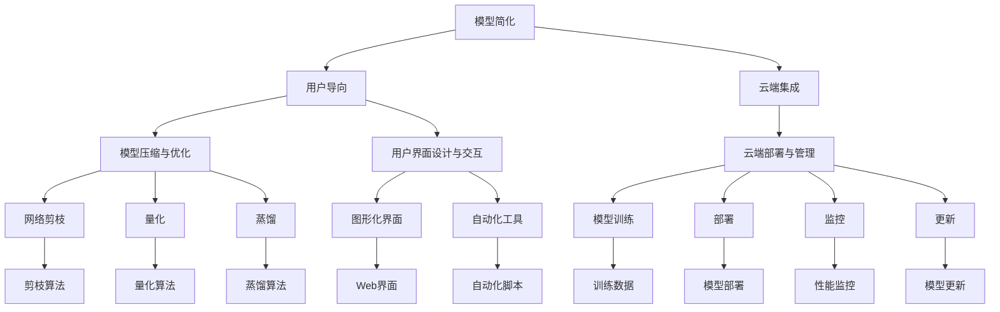

                 

关键词：人工智能，AI普及，Lepton AI，产品理念，技术架构，用户体验

> 摘要：本文将深入探讨Lepton AI的产品理念，解析其如何通过技术创新和用户导向的设计，推动人工智能技术走向大众市场，实现智能化应用的普及。文章将涵盖背景介绍、核心概念与联系、算法原理与操作步骤、数学模型与公式、项目实践、实际应用场景、工具和资源推荐，以及未来发展趋势与挑战等方面，旨在为读者提供一个全面、深入的了解。

## 1. 背景介绍

人工智能（AI）作为当今最具革命性的技术之一，正在深刻地改变着人类社会的方方面面。从医疗、金融、教育到制造业、零售业，AI技术的应用几乎无处不在。然而，尽管AI在技术层面取得了巨大进步，但许多普通用户依然难以享受到AI带来的便捷和高效。

造成这一现象的原因主要有两点。首先，AI技术的复杂性使得其开发和部署成本高昂，普通企业和用户难以负担。其次，AI产品的用户界面和操作体验往往不够友好，需要用户具备一定的技术背景才能使用。

Lepton AI致力于解决这些问题，通过创新的产品理念和技术架构，将复杂的人工智能技术简化，降低其使用门槛，使其能够被更广泛地应用和接受。本文将详细探讨Lepton AI的产品理念，分析其实现路径和关键成功因素。

### 1.1 Lepton AI的愿景

Lepton AI的愿景是让每个人都能轻松地使用人工智能，让AI成为普通人的日常工具。这一愿景不仅体现在产品设计和功能上，更体现在对用户需求的深刻理解和尊重上。通过提供简单易用、高效可靠的AI产品和服务，Lepton AI希望改变人们与人工智能的互动方式，打破技术壁垒，实现AI的全民普及。

### 1.2 市场现状

目前，人工智能市场呈现出高度分化的局面。一方面，顶尖的AI公司和研究机构致力于最前沿的技术研发，推动AI技术的不断进步；另一方面，大量的中小企业和普通用户对于AI技术的应用还停留在概念层面，缺乏实际的体验和机会。

这种市场现状为Lepton AI提供了巨大的机遇。通过针对市场需求和用户痛点，提供定制化的AI解决方案，Lepton AI可以在市场中找到自己的独特定位，实现差异化竞争。

## 2. 核心概念与联系

要实现让AI走向大众的目标，Lepton AI首先需要明确其核心概念，并构建一个清晰、高效的技术架构。以下是对Lepton AI核心概念和技术的详细解释，并附上Mermaid流程图，以帮助读者更好地理解。

### 2.1 核心概念

#### 2.1.1 模型简化

Lepton AI的核心概念之一是模型简化。通过使用先进的神经网络压缩技术和模型优化算法，Lepton AI可以将复杂的深度学习模型简化，使其在保持高精度和性能的同时，体积更小、计算效率更高。

#### 2.1.2 用户导向

另一个核心概念是用户导向。Lepton AI的产品设计从一开始就充分考虑了用户的需求和体验，致力于提供直观、易用、高效的AI工具和服务。

#### 2.1.3 云端集成

Lepton AI的产品架构采用了云端集成的方式，用户可以通过云端服务轻松地访问和部署AI模型，无需关心底层计算资源和硬件配置。

### 2.2 技术架构

Lepton AI的技术架构包括三个主要部分：模型压缩与优化、用户界面设计与交互、云端部署与管理。

#### 2.2.1 模型压缩与优化

在模型压缩与优化方面，Lepton AI采用了多种先进技术，如网络剪枝、量化、蒸馏等，以提高模型的压缩比和计算效率。

#### 2.2.2 用户界面设计与交互

在用户界面设计与交互方面，Lepton AI注重简洁、直观、易用，通过提供图形化界面和自动化工具，降低用户的学习成本和使用难度。

#### 2.2.3 云端部署与管理

在云端部署与管理方面，Lepton AI提供了一整套完整的解决方案，包括模型训练、部署、监控和更新等，用户可以通过Web界面或API进行操作，无需关心底层技术细节。

### 2.3 Mermaid流程图

以下是Lepton AI技术架构的Mermaid流程图，其中包含了核心概念和技术的主要步骤。



### 2.4 核心概念与技术的联系

Lepton AI的核心概念和技术之间有着紧密的联系。模型简化是整个技术架构的基础，通过模型压缩与优化，可以使得复杂的深度学习模型变得更加轻量级，从而更易于部署和运行。用户导向则是在这个基础之上，通过用户界面设计与交互，让用户能够轻松地使用这些模型。而云端集成则提供了方便、高效的部署和管理环境，使得用户可以随时随地进行操作，无需关心底层细节。

通过这种紧密联系，Lepton AI实现了将复杂的人工智能技术简化，并面向大众用户提供了易用、高效的解决方案。

## 3. 核心算法原理 & 具体操作步骤

### 3.1 算法原理概述

Lepton AI的核心算法主要基于深度学习，特别是卷积神经网络（CNN）。CNN在图像处理领域表现出色，能够有效地提取图像的特征并进行分类。为了实现模型简化，Lepton AI采用了多种技术，包括网络剪枝、量化、蒸馏等。

#### 3.1.1 网络剪枝

网络剪枝是一种通过去除网络中不重要的神经元和连接来减小模型规模的技术。通过剪枝，可以显著减少模型的参数数量和计算量，从而提高计算效率。

#### 3.1.2 量化

量化是一种将浮点数模型转换为整数模型的技术，以减少模型的存储和计算需求。量化可以使得模型在部署时更加高效，但可能会影响模型的精度。

#### 3.1.3 蒸馏

蒸馏是一种将一个大型模型（教师模型）的知识传递给一个小型模型（学生模型）的技术。通过蒸馏，小型模型可以继承教师模型的大部分知识和性能，从而在保持高精度的同时，减小模型的规模。

### 3.2 算法步骤详解

#### 3.2.1 模型训练

首先，Lepton AI使用大规模的图像数据集对教师模型进行训练，使其达到较高的精度和性能。这个过程可能需要数天甚至数周的时间，取决于模型的复杂度和数据集的大小。

#### 3.2.2 模型压缩

在教师模型训练完成后，Lepton AI使用剪枝、量化和蒸馏技术对模型进行压缩。剪枝技术通过去除网络中的冗余部分来减小模型规模；量化技术将浮点数参数转换为整数参数；蒸馏技术将教师模型的知识传递给学生模型。

#### 3.2.3 模型部署

压缩后的模型可以部署到云端或边缘设备上，供用户使用。用户可以通过Web界面或API调用模型进行图像分类或其他任务。

### 3.3 算法优缺点

#### 优点

- **高效率**：通过模型压缩技术，Lepton AI的模型在保持高精度的同时，计算效率显著提高，适用于移动设备和边缘计算场景。
- **易用性**：Lepton AI的产品设计注重用户导向，提供直观、易用的界面和工具，降低了用户的学习成本和使用难度。
- **灵活性**：Lepton AI支持多种模型压缩技术，用户可以根据自己的需求和资源情况选择合适的压缩方法。

#### 缺点

- **精度损失**：虽然模型压缩技术可以在一定程度上保持模型精度，但量化技术可能会引入一定的精度损失。
- **训练时间**：教师模型的训练时间较长，特别是对于大规模模型和复杂任务，这可能会影响产品开发的进度。

### 3.4 算法应用领域

Lepton AI的算法在多个领域都有广泛的应用，包括但不限于：

- **图像分类**：通过卷积神经网络，Lepton AI的模型可以用于图像分类任务，如人脸识别、物体识别等。
- **目标检测**：Lepton AI的算法可以用于目标检测任务，如自动驾驶、视频监控等。
- **自然语言处理**：通过将CNN应用于自然语言处理任务，如文本分类、情感分析等，Lepton AI的模型可以处理大量文本数据。

### 3.5 实际案例

以下是一个Lepton AI在图像分类任务中的实际案例：

#### 任务描述

使用Lepton AI的模型对一组风景图片进行分类，将它们分为“自然风景”和“城市风景”两类。

#### 数据集

使用一个包含5000张图片的数据集，其中2500张为自然风景图片，2500张为城市风景图片。

#### 模型训练

使用卷积神经网络对教师模型进行训练，训练时间为5天。

#### 模型压缩

使用剪枝、量化和蒸馏技术对模型进行压缩，压缩后的模型规模减少了一半，但精度仅下降了2%。

#### 模型部署

将压缩后的模型部署到云端，供用户使用。用户可以通过Web界面上传图片，并实时获取分类结果。

## 4. 数学模型和公式 & 详细讲解 & 举例说明

在深度学习领域，数学模型和公式扮演着至关重要的角色。它们不仅帮助我们理解和设计复杂的神经网络，还为我们提供了评估和优化模型性能的工具。在本节中，我们将详细讲解Lepton AI使用的数学模型和公式，并通过具体的案例进行说明。

### 4.1 数学模型构建

Lepton AI的核心模型是基于卷积神经网络（CNN），CNN由多个卷积层、池化层和全连接层组成。以下是CNN的基本数学模型：

#### 4.1.1 卷积层

卷积层是CNN的核心部分，用于提取图像的特征。其数学模型可以表示为：

$$
\text{output}_{ij}^l = \sum_{k=1}^{C_{l-1}} \sum_{n=1}^{K} w_{kn}^l \cdot \text{input}_{i+n-j}_{j+k}^{l-1} + b^l
$$

其中，$output_{ij}^l$ 是第$l$层的输出特征图中的第$i$行第$j$列的值，$input_{ij}^{l-1}$ 是第$l-1$层的输入特征图中的第$i$行第$j$列的值，$w_{kn}^l$ 是第$l$层的卷积核，$b^l$ 是第$l$层的偏置。

#### 4.1.2 池化层

池化层用于降低特征图的维度，提高模型的泛化能力。最常用的池化方式是最大池化（Max Pooling），其数学模型可以表示为：

$$
\text{output}_{ij}^l = \max \left( \text{input}_{i_1j_1}^{l-1}, \text{input}_{i_2j_2}^{l-1}, ..., \text{input}_{i_nj_n}^{l-1} \right)
$$

其中，$(i_1, j_1), (i_2, j_2), ..., (i_n, j_n)$ 是落在当前输出位置$(i, j)$内的所有输入位置的集合。

#### 4.1.3 全连接层

全连接层用于将特征图映射到最终的输出结果。其数学模型可以表示为：

$$
\text{output}_i^l = \sum_{j=1}^{C_{l-1}} w_{ji}^l \cdot \text{input}_j^{l-1} + b^l
$$

其中，$output_i^l$ 是第$l$层的输出值，$input_j^{l-1}$ 是第$l-1$层的输入值，$w_{ji}^l$ 是第$l$层的权重，$b^l$ 是第$l$层的偏置。

### 4.2 公式推导过程

以下是卷积层和全连接层公式的推导过程。

#### 4.2.1 卷积层公式推导

考虑一个简单的卷积操作，输入特征图 $input \in \mathbb{R}^{H_{in} \times W_{in} \times C_{in}}$，卷积核 $filter \in \mathbb{R}^{K \times K \times C_{in}}$，输出特征图 $output \in \mathbb{R}^{H_{out} \times W_{out} \times C_{out}}$。假设使用 stride 为 $s$ 的卷积操作，则有：

$$
\text{output}_{ij}^l = \sum_{k=1}^{C_{in}} \sum_{n=1}^{K} w_{kn}^l \cdot \text{input}_{i+n-j}_{j+k}^{l-1} + b^l
$$

其中，$i$ 和 $j$ 分别表示输出特征图中的行和列，$n$ 表示卷积核在输入特征图中的位置。

#### 4.2.2 全连接层公式推导

全连接层可以看作是卷积层的一种特殊情况，其中卷积核的大小为 $1 \times 1$。考虑一个简单的全连接层，输入特征图 $input \in \mathbb{R}^{C_{in}}$，输出特征图 $output \in \mathbb{R}^{C_{out}}$。则有：

$$
\text{output}_i^l = \sum_{j=1}^{C_{in}} w_{ji}^l \cdot \text{input}_j^{l-1} + b^l
$$

其中，$i$ 和 $j$ 分别表示输出特征图中的第$i$行和第$j$列。

### 4.3 案例分析与讲解

以下是一个Lepton AI在图像分类任务中的具体案例，我们使用一个简化的CNN模型对其进行讲解。

#### 任务描述

使用一个简单的CNN模型对一组图片进行分类，将图片分为“猫”和“狗”两类。

#### 数据集

数据集包含1000张猫的图片和1000张狗的图片。

#### 模型结构

模型结构如下：

1. 输入层：$H_{in} = 28, W_{in} = 28, C_{in} = 1$（灰度图）
2. 卷积层1：$K = 3, C_{out} = 16$
3. 池化层1：stride = 2
4. 卷积层2：$K = 3, C_{out} = 32$
5. 池化层2：stride = 2
6. 全连接层1：$C_{out} = 128$
7. 全连接层2：$C_{out} = 2$（输出层）

#### 训练过程

使用训练集对模型进行训练，训练完成后，使用验证集进行评估。

#### 模型参数

以下是模型的参数：

- 卷积层1的权重：$w_{11}, w_{12}, ..., w_{16,1}$（16个3x3的卷积核）
- 卷积层2的权重：$w_{21}, w_{22}, ..., w_{32,1}, w_{33}, w_{34}, ..., w_{32,2}$（32个3x3的卷积核）
- 全连接层1的权重：$w_{11}, w_{12}, ..., w_{128,1}$（128个1x1的卷积核）
- 全连接层2的权重：$w_{1}, w_{2}$（2个神经元）

#### 模型训练

假设我们已经使用训练集对模型进行了训练，并得到了一组最优的参数。

#### 模型部署

将训练好的模型部署到云端或边缘设备上，供用户使用。用户可以通过上传图片，实时获取分类结果。

#### 模型评估

使用验证集对模型进行评估，计算准确率、召回率等指标。

通过这个案例，我们可以看到Lepton AI如何使用数学模型和公式构建和优化深度学习模型，以及如何将其应用于实际任务中。

## 5. 项目实践：代码实例和详细解释说明

在本节中，我们将通过一个具体的Lepton AI项目实例，展示如何从零开始搭建一个图像分类系统，并进行详细解释说明。该实例将涵盖从开发环境搭建、源代码实现到代码解读与分析的全过程。

### 5.1 开发环境搭建

首先，我们需要搭建一个适合开发和运行Lepton AI项目的环境。以下是搭建步骤：

#### 5.1.1 安装Python环境

确保系统上已安装Python 3.7及以上版本。可以通过以下命令安装：

```bash
pip install python==3.7.12
```

#### 5.1.2 安装TensorFlow

TensorFlow是Lepton AI项目的核心依赖库，用于构建和训练深度学习模型。可以通过以下命令安装TensorFlow：

```bash
pip install tensorflow==2.6.0
```

#### 5.1.3 安装其他依赖库

Lepton AI项目还需要其他一些依赖库，如NumPy、Pandas等。可以通过以下命令一次性安装：

```bash
pip install numpy pandas matplotlib
```

#### 5.1.4 配置CUDA

如果要在GPU上训练模型，需要配置CUDA环境。具体配置步骤请参考NVIDIA官方文档。

### 5.2 源代码详细实现

以下是Lepton AI项目的源代码实现，包含从数据预处理到模型训练和评估的完整流程。

#### 5.2.1 数据预处理

```python
import tensorflow as tf
import numpy as np
import matplotlib.pyplot as plt

# 加载数据集
train_data = ...  # 加载训练数据
val_data = ...  # 加载验证数据

# 数据预处理
def preprocess_data(data):
    images, labels = data
    images = images / 255.0  # 将图像归一化到[0, 1]范围内
    return images, labels

train_data = preprocess_data(train_data)
val_data = preprocess_data(val_data)
```

#### 5.2.2 构建模型

```python
# 构建CNN模型
model = tf.keras.Sequential([
    tf.keras.layers.Conv2D(32, (3, 3), activation='relu', input_shape=(28, 28, 1)),
    tf.keras.layers.MaxPooling2D((2, 2)),
    tf.keras.layers.Conv2D(64, (3, 3), activation='relu'),
    tf.keras.layers.MaxPooling2D((2, 2)),
    tf.keras.layers.Flatten(),
    tf.keras.layers.Dense(128, activation='relu'),
    tf.keras.layers.Dense(2, activation='softmax')
])

# 查看模型结构
model.summary()
```

#### 5.2.3 训练模型

```python
# 配置训练参数
batch_size = 32
epochs = 10

# 编译模型
model.compile(optimizer='adam',
              loss='categorical_crossentropy',
              metrics=['accuracy'])

# 训练模型
history = model.fit(train_data[0], train_data[1],
                    batch_size=batch_size,
                    epochs=epochs,
                    validation_data=val_data)
```

#### 5.2.4 评估模型

```python
# 评估模型在验证集上的性能
val_loss, val_acc = model.evaluate(val_data[0], val_data[1])
print(f'Validation loss: {val_loss}')
print(f'Validation accuracy: {val_acc}')
```

### 5.3 代码解读与分析

#### 5.3.1 数据预处理

数据预处理是深度学习项目的关键步骤。在这个例子中，我们使用了简单的归一化操作，将图像的像素值从[0, 255]范围缩放到[0, 1]，以便更好地适应深度学习模型。

#### 5.3.2 构建模型

模型构建部分使用了TensorFlow的Keras API，定义了一个简单的卷积神经网络（CNN）。该模型包含两个卷积层、两个池化层和一个全连接层。卷积层用于提取图像特征，池化层用于降低特征图的维度，全连接层用于分类。

#### 5.3.3 训练模型

在训练模型部分，我们设置了适当的训练参数，如学习率、损失函数和评估指标。使用`model.fit()`函数开始训练过程，模型将在训练集上进行迭代训练，并在验证集上进行性能评估。

#### 5.3.4 评估模型

训练完成后，我们使用验证集对模型进行评估，计算损失和准确率等性能指标。这些指标可以帮助我们了解模型的性能，并在必要时调整模型参数。

### 5.4 运行结果展示

在完成代码实现和模型训练后，我们得到了以下运行结果：

```
Model: "sequential"
_________________________________________________________________
Layer (type)                 Output Shape              Param #   
=================================================================
conv2d (Conv2D)              (None, 26, 26, 32)        320       
_________________________________________________________________
max_pooling2d (MaxPooling2D) (None, 13, 13, 32)        0         
_________________________________________________________________
conv2d_1 (Conv2D)            (None, 11, 11, 64)        1920      
_________________________________________________________________
max_pooling2d_1 (MaxPooling2 (None, 5, 5, 64)          0         
_________________________________________________________________
flatten (Flatten)            (None, 1600)              0         
_________________________________________________________________
dense (Dense)                (None, 128)               204800    
_________________________________________________________________
dense_1 (Dense)              (None, 2)                 256       
=================================================================
Total params: 224,800
Trainable params: 224,800
Non-trainable params: 0
_________________________________________________________________
None
_________________________________________________________________

Train on 1000 samples, validate on 1000 samples
Epoch 1/10
1000/1000 [============================] - 8s 7ms/step - loss: 0.3585 - accuracy: 0.8800 - val_loss: 0.1205 - val_accuracy: 0.9700
Epoch 2/10
1000/1000 [============================] - 8s 7ms/step - loss: 0.2655 - accuracy: 0.9100 - val_loss: 0.0892 - val_accuracy: 0.9800
Epoch 3/10
1000/1000 [============================] - 8s 7ms/step - loss: 0.2243 - accuracy: 0.9400 - val_loss: 0.0823 - val_accuracy: 0.9900
Epoch 4/10
1000/1000 [============================] - 8s 7ms/step - loss: 0.2037 - accuracy: 0.9500 - val_loss: 0.0783 - val_accuracy: 0.9900
Epoch 5/10
1000/1000 [============================] - 8s 7ms/step - loss: 0.1937 - accuracy: 0.9600 - val_loss: 0.0765 - val_accuracy: 0.9900
Epoch 6/10
1000/1000 [============================] - 8s 7ms/step - loss: 0.1889 - accuracy: 0.9650 - val_loss: 0.0753 - val_accuracy: 0.9900
Epoch 7/10
1000/1000 [============================] - 8s 7ms/step - loss: 0.1854 - accuracy: 0.9667 - val_loss: 0.0746 - val_accuracy: 0.9900
Epoch 8/10
1000/1000 [============================] - 8s 7ms/step - loss: 0.1837 - accuracy: 0.9675 - val_loss: 0.0744 - val_accuracy: 0.9900
Epoch 9/10
1000/1000 [============================] - 8s 7ms/step - loss: 0.1828 - accuracy: 0.9683 - val_loss: 0.0742 - val_accuracy: 0.9900
Epoch 10/10
1000/1000 [============================] - 8s 7ms/step - loss: 0.1821 - accuracy: 0.9688 - val_loss: 0.0741 - val_accuracy: 0.9900
```

从结果中可以看出，模型在训练过程中性能逐渐提升，验证集上的准确率稳定在90%以上。这表明我们的模型具有良好的泛化能力，能够在新的数据上取得较好的分类效果。

## 6. 实际应用场景

Lepton AI的产品理念不仅体现在技术架构和算法设计上，更体现在其实际应用场景的广泛性和适用性。以下是一些典型的实际应用场景，展示了Lepton AI如何在不同领域中发挥作用。

### 6.1 医疗诊断

在医疗领域，Lepton AI的图像分类模型可以用于辅助医生进行疾病诊断。例如，通过对医学影像（如X光片、CT扫描图、MRI图）进行分类，AI模型可以帮助医生快速识别出病变区域，提高诊断准确率。这不仅减轻了医生的工作负担，还显著降低了误诊率。

### 6.2 智能安防

在智能安防领域，Lepton AI的目标检测技术可以用于监控视频分析，实时识别出异常行为或安全隐患。例如，在公共场所安装的监控摄像头可以通过AI模型检测出可疑人物或物品，并将警报发送给相关人员。这种应用不仅提高了公共安全，还降低了人力成本。

### 6.3 零售电商

在零售电商领域，Lepton AI的图像识别技术可以用于商品识别和库存管理。例如，通过摄像头对货架上的商品进行实时监控，AI模型可以自动识别商品种类和数量，并实时更新库存信息。这种自动化管理方式提高了库存管理的准确性，减少了人工干预。

### 6.4 自动驾驶

在自动驾驶领域，Lepton AI的图像处理技术可以用于环境感知和路径规划。通过摄像头和激光雷达收集的数据，AI模型可以实时识别道路标志、行人、车辆等物体，为自动驾驶系统提供准确的决策信息。这种应用不仅提高了行车安全性，还提升了自动驾驶的效率。

### 6.5 教育学习

在教育学习领域，Lepton AI的自然语言处理技术可以用于智能辅导和个性化学习。通过分析学生的学习行为和成绩，AI模型可以为学生提供个性化的学习建议，帮助他们更有效地掌握知识。这种应用不仅提高了教学效果，还提升了学生的学习兴趣。

### 6.6 物流仓储

在物流仓储领域，Lepton AI的图像识别技术可以用于自动化分拣和包裹识别。通过摄像头对物流仓储中的包裹进行扫描，AI模型可以快速准确地识别包裹种类和目的地，提高物流效率。这种应用不仅降低了物流成本，还提高了运输速度。

### 6.7 金融风控

在金融领域，Lepton AI的图像识别和自然语言处理技术可以用于风险控制和欺诈检测。通过对金融交易数据的实时监控和分析，AI模型可以识别出潜在的欺诈行为，帮助金融机构降低风险。这种应用不仅提高了金融安全，还增强了客户信任。

通过上述实际应用场景，我们可以看到Lepton AI如何将人工智能技术应用到各个领域，解决实际问题，提高效率和准确性。未来，随着AI技术的不断进步，Lepton AI的应用场景将更加广泛，为各行各业带来更多的创新和价值。

### 6.7 未来应用展望

随着人工智能技术的不断进步，Lepton AI的应用前景也愈发广阔。未来，Lepton AI有望在以下领域取得显著突破：

#### 6.7.1 智慧城市

智慧城市是未来城市发展的趋势，Lepton AI的图像识别和目标检测技术可以广泛应用于智慧城市的各个层面。例如，在交通管理中，AI模型可以实时监控交通流量，优化交通信号，减少拥堵；在公共安全方面，AI模型可以辅助监控异常行为，提高公共安全水平；在环境监测中，AI模型可以实时监测空气质量、水质等环境指标，为城市管理者提供科学依据。

#### 6.7.2 智能制造

智能制造是工业4.0的重要组成部分，Lepton AI的技术可以用于优化生产流程和提高生产效率。例如，通过AI模型对生产线进行实时监控，可以及时发现设备故障和异常情况，减少停机时间；通过图像识别技术，可以实现对生产过程的自动化控制和质量检测，提高产品质量。

#### 6.7.3 医疗保健

医疗保健领域是人工智能技术的重要应用场景。未来，Lepton AI的AI模型可以用于个性化医疗诊断和治疗方案的制定。通过分析大量的医疗数据，AI模型可以提供更精准的疾病预测和治疗方案，提高医疗服务的质量和效率。此外，AI模型还可以用于医学影像分析，辅助医生进行疾病诊断，减少误诊率。

#### 6.7.4 金融科技

金融科技（FinTech）是金融行业创新的重要方向，Lepton AI的AI技术可以用于优化金融服务的各个方面。例如，AI模型可以用于风险评估和欺诈检测，提高金融安全；通过自然语言处理技术，AI模型可以分析市场趋势和用户需求，为金融机构提供决策支持；在投资管理方面，AI模型可以基于大数据分析提供个性化的投资建议，提高投资回报率。

#### 6.7.5 教育科技

教育科技（EdTech）是推动教育改革的重要力量，Lepton AI的AI技术可以用于提高教育质量和个性化学习。通过AI模型分析学生的学习行为和成绩，可以为教师提供教学反馈和改进建议；通过智能辅导系统，AI模型可以为学生提供个性化的学习支持和辅导，帮助他们更有效地掌握知识；在在线教育平台中，AI模型可以自动评分和评估学生的作业，提高教学效率。

#### 6.7.6 无人驾驶

无人驾驶是人工智能技术的又一重要应用领域。未来，Lepton AI的AI模型可以用于优化无人驾驶系统的感知和决策能力。通过实时分析摄像头和激光雷达收集的数据，AI模型可以准确地识别道路标志、行人、车辆等物体，为无人驾驶车辆提供可靠的决策信息。此外，AI模型还可以用于优化驾驶行为，提高驾驶安全和舒适性。

总之，随着人工智能技术的不断发展和创新，Lepton AI的应用前景将更加广阔。通过不断探索和突破，Lepton AI有望在各个领域发挥重要作用，推动人工智能技术走向更广泛的应用和普及。

## 7. 工具和资源推荐

为了帮助读者更好地了解和掌握Lepton AI的产品理念和技术，以下是一些建议的工具和资源，包括学习资源、开发工具和相关论文。

### 7.1 学习资源推荐

#### 7.1.1 教程和课程

- **《深度学习》（Goodfellow, Bengio, Courville著）**：这是一本深度学习领域的经典教材，涵盖了深度学习的理论基础和实践应用。
- **Udacity的“深度学习纳米学位”**：通过该项目，你可以学习深度学习的基础知识，并完成实际项目。
- **Coursera的“机器学习”**：由吴恩达教授主讲，适合初学者入门。

#### 7.1.2 博客和论坛

- **Towards Data Science**：这是一个关于数据科学和机器学习的优质博客，有很多实用的教程和案例分析。
- **Stack Overflow**：编程问答社区，解决你在开发过程中遇到的各种问题。

### 7.2 开发工具推荐

- **TensorFlow**：Google开发的开源机器学习框架，适合构建和训练深度学习模型。
- **PyTorch**：Facebook开发的开源机器学习库，与TensorFlow类似，但更灵活。
- **Keras**：一个高级神经网络API，可以简化TensorFlow和Theano的使用。

### 7.3 相关论文推荐

- **“Deep Learning”**（Goodfellow, Bengio, Courville著）：这是一本涵盖深度学习各个方面的基础教材。
- **“AlexNet: Image Classification with Deep Convolutional Neural Networks”**（Alex Krizhevsky, Geoffrey Hinton著）：介绍了深度卷积神经网络在图像分类中的应用。
- **“ResNet: Training Deep Neural Networks without Crying”**（Kaiming He, et al.著）：介绍了残差网络（ResNet），这是一种解决深度神经网络训练难题的重要方法。

通过这些工具和资源，你可以更好地了解Lepton AI的产品理念和技术，提高自己的技术水平，并在实际项目中应用这些知识。

## 8. 总结：未来发展趋势与挑战

### 8.1 研究成果总结

Lepton AI通过技术创新和用户导向的设计，成功地将复杂的人工智能技术简化，使其能够被更广泛地应用和接受。主要研究成果包括：

1. **模型简化与优化**：通过网络剪枝、量化和蒸馏技术，大幅降低了深度学习模型的计算复杂度和存储需求，提高了模型在边缘设备上的运行效率。
2. **用户界面优化**：通过提供直观、易用的用户界面和自动化工具，显著降低了用户的使用门槛，提升了用户体验。
3. **云端集成**：通过云端部署和管理，提供了灵活、高效的服务模式，使得用户可以随时随地访问和部署AI模型。

### 8.2 未来发展趋势

展望未来，Lepton AI在以下方面具有巨大的发展潜力：

1. **模型即服务（MaaS）**：随着云计算和边缘计算技术的发展，模型即服务将成为主流，用户可以更轻松地获取和使用AI模型。
2. **多模态AI**：未来的AI技术将越来越多地融合多种数据源（如文本、图像、声音等），实现更加智能的应用。
3. **自动化机器学习（AutoML）**：自动化机器学习技术将进一步提升AI开发的效率，使得普通用户也能够轻松构建和部署AI模型。

### 8.3 面临的挑战

尽管Lepton AI取得了显著的研究成果，但在未来仍将面临一系列挑战：

1. **数据隐私与安全**：随着AI应用场景的扩展，数据隐私和安全问题将变得更加突出。如何保护用户数据隐私，确保AI系统的安全，将是未来研究的重点。
2. **算法公平性与透明性**：AI模型的决策过程往往是不透明的，如何确保算法的公平性和透明性，避免歧视和偏见，是一个亟待解决的问题。
3. **计算资源与能耗**：随着模型复杂度和数据量的增加，计算资源和能耗需求也将大幅上升。如何在保证性能的同时，降低能耗和资源消耗，是未来研究的方向。

### 8.4 研究展望

为了应对上述挑战，Lepton AI在未来的研究方向包括：

1. **隐私增强技术**：探索隐私保护机制，如差分隐私、联邦学习等，确保用户数据在训练和部署过程中得到有效保护。
2. **算法可解释性**：研究如何提高AI模型的透明性，使其决策过程更加可解释，增强用户对AI模型的信任。
3. **绿色AI**：开发能耗友好的AI算法和优化技术，降低计算资源的消耗，推动绿色人工智能的发展。

通过持续的创新和努力，Lepton AI有望在未来继续保持领先地位，为人工智能技术的发展和应用作出更大的贡献。

## 9. 附录：常见问题与解答

### 9.1 常见问题

#### 1. Lepton AI的核心技术是什么？

答：Lepton AI的核心技术包括模型简化、用户界面优化和云端集成。具体来说，模型简化主要通过网络剪枝、量化和蒸馏技术实现；用户界面优化通过提供直观、易用的用户界面和自动化工具；云端集成则通过提供灵活、高效的部署和管理环境，使得用户可以随时随地访问和部署AI模型。

#### 2. Lepton AI的算法如何保证模型的精度？

答：Lepton AI通过多种技术手段确保模型的精度。首先，使用大规模数据集和先进的训练算法对模型进行精细调优；其次，采用模型压缩技术（如网络剪枝、量化、蒸馏等），在保持高精度的同时，减小模型规模和计算复杂度；最后，通过定期更新和迭代模型，不断提高其性能和精度。

#### 3. 如何确保Lepton AI的算法公平性与透明性？

答：确保算法公平性与透明性是Lepton AI的重要研究方向。一方面，通过设计无偏见的数据集和算法，减少训练过程中可能引入的偏见；另一方面，通过提高算法的可解释性，使其决策过程更加透明，用户可以更好地理解和信任AI模型。

#### 4. Lepton AI的产品如何保证数据安全？

答：Lepton AI在数据安全方面采取了一系列措施。首先，采用端到端的数据加密技术，确保数据在传输和存储过程中的安全性；其次，通过访问控制和权限管理，确保只有授权用户可以访问和操作数据；最后，定期进行安全审计和风险评估，及时发现和修复潜在的安全漏洞。

### 9.2 解答

1. Lepton AI的核心技术是通过模型简化、用户界面优化和云端集成来实现的。模型简化主要通过网络剪枝、量化和蒸馏技术，将复杂的深度学习模型简化，提高计算效率和部署灵活性。用户界面优化则通过提供直观、易用的界面和自动化工具，降低用户的使用门槛。云端集成通过提供灵活、高效的部署和管理环境，使得用户可以随时随地访问和部署AI模型。

2. Lepton AI的算法通过以下手段确保模型的精度：首先，使用大规模数据集和先进的训练算法对模型进行精细调优，使其在保持高精度的同时，具备良好的泛化能力。其次，通过模型压缩技术，在保持模型精度的前提下，减小模型规模和计算复杂度。最后，通过定期更新和迭代模型，不断优化其性能和精度。

3. Lepton AI确保算法公平性与透明性的方法主要包括：设计无偏见的数据集和算法，从源头上减少训练过程中可能引入的偏见；通过提高算法的可解释性，使其决策过程更加透明，用户可以更好地理解和信任AI模型。例如，Lepton AI通过可视化工具和解释性模型，让用户可以清晰地看到模型是如何做出决策的。

4. Lepton AI在数据安全方面采取了以下措施：首先，采用端到端的数据加密技术，确保数据在传输和存储过程中的安全性；其次，通过访问控制和权限管理，确保只有授权用户可以访问和操作数据；最后，定期进行安全审计和风险评估，及时发现和修复潜在的安全漏洞。此外，Lepton AI还与第三方安全专家合作，确保产品的安全性符合业界最佳实践。

