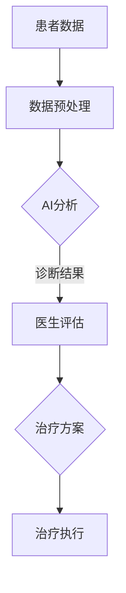

                 

关键词：医疗保健、人工智能、人类计算、诊断、治疗、技术、算法、模型、实践

> 摘要：本文深入探讨了人工智能在医疗保健领域的应用，特别是人类计算与人工智能相结合的诊断和治疗方式。通过分析核心概念、算法原理、数学模型以及实际应用案例，本文揭示了这一技术在提高医疗效率和精准度方面的潜力。同时，本文也展望了未来发展趋势与面临的挑战，为读者提供了全面的视角。

## 1. 背景介绍

### 医疗保健的重要性

医疗保健是关乎每个人生活质量的重要领域。无论是疾病的预防、诊断还是治疗，医疗保健系统都需要高效的资源利用和精准的技术手段。随着人口老龄化以及慢性病发病率的增加，医疗保健系统的压力不断加大。因此，如何通过技术手段提升医疗保健的效率和质量成为一个亟待解决的问题。

### 人工智能的崛起

近年来，人工智能（AI）技术在各个领域的应用取得了显著成果。特别是在医疗保健领域，AI的应用不仅能够提高诊断的准确性，还能帮助医生做出更加合理的治疗方案。通过大数据分析、机器学习和深度学习等技术，人工智能能够从大量的医疗数据中提取有价值的信息，从而为诊断和治疗提供有力支持。

### 人类计算的加入

人类计算指的是人类在处理信息和知识时展现出的独特能力，包括直觉、经验、判断力等。在医疗领域，医生的专业知识和临床经验是诊断和治疗过程中不可或缺的部分。将人类计算与人工智能相结合，可以充分发挥两者的优势，实现更高效、更精准的医疗服务。

## 2. 核心概念与联系

### 人工智能在医疗保健中的应用

人工智能在医疗保健中的应用主要体现在以下几个方面：

- **图像识别与分析**：AI可以快速准确地识别和诊断医学图像，如X光片、CT扫描、MRI等，提高诊断的准确性。
- **疾病预测与预防**：基于大数据分析，AI可以预测某些疾病的发病率，帮助医疗机构制定预防措施。
- **个性化治疗方案**：通过分析患者的病史和基因信息，AI可以为患者提供个性化的治疗方案。

### 人类计算的优势

人类计算在医疗领域具有以下优势：

- **专业判断**：医生可以根据患者的临床表现、病史和其他非量化因素，做出专业判断。
- **适应性**：人类医生能够根据患者的具体情况进行灵活调整，提供个性化的服务。
- **经验传承**：医生的经验可以通过教学和指导传承给年轻医生，提高整个医疗团队的水平。

### 二者结合的潜力

将人工智能与人类计算相结合，可以实现以下潜力：

- **提高诊断效率**：AI可以处理大量的数据，帮助医生快速做出诊断。
- **减少错误率**：AI可以辅助医生识别可能的疾病，减少漏诊和误诊。
- **个性化治疗**：结合医生的专业判断，AI可以提供更加精准的个性化治疗方案。

### Mermaid 流程图

以下是描述人工智能和人类计算结合的Mermaid流程图：



## 3. 核心算法原理 & 具体操作步骤

### 3.1 算法原理概述

在医疗保健领域，常用的算法包括图像识别、机器学习和深度学习等。这些算法通过以下步骤实现：

1. **数据收集与预处理**：收集大量的医疗数据，并对数据进行清洗、归一化和特征提取。
2. **模型训练**：使用训练数据对算法模型进行训练，使其能够识别疾病、预测病情或生成治疗方案。
3. **模型评估与优化**：使用测试数据对模型进行评估，并根据评估结果对模型进行调整和优化。
4. **应用与部署**：将训练好的模型应用于实际场景，如诊断系统、治疗推荐等。

### 3.2 算法步骤详解

以下是人工智能在医疗保健中常见的算法步骤详解：

#### 3.2.1 数据收集与预处理

- **数据源**：医疗数据可以从医院、健康记录、电子病历等多个渠道获取。
- **数据清洗**：去除重复数据、填补缺失值、纠正错误数据等。
- **数据归一化**：将不同类型的数据转换为同一尺度，便于算法处理。
- **特征提取**：从原始数据中提取有助于诊断和治疗的关键特征。

#### 3.2.2 模型训练

- **选择算法**：根据具体任务选择合适的算法，如卷积神经网络（CNN）、支持向量机（SVM）等。
- **训练数据准备**：将预处理后的数据分为训练集、验证集和测试集。
- **模型训练**：使用训练数据对模型进行训练，调整模型参数以最小化预测误差。
- **模型验证**：使用验证集评估模型性能，调整模型结构和参数。

#### 3.2.3 模型评估与优化

- **性能指标**：评估模型性能的指标包括准确率、召回率、F1值等。
- **交叉验证**：使用交叉验证方法评估模型在不同数据集上的表现。
- **模型优化**：根据评估结果对模型进行调整和优化，以提高性能。

#### 3.2.4 应用与部署

- **集成到系统中**：将训练好的模型集成到医疗系统中，如诊断系统、治疗推荐系统等。
- **实时更新**：定期更新模型，以适应新的数据和医疗标准。
- **用户界面**：为医生和患者提供友好的用户界面，方便使用模型结果。

### 3.3 算法优缺点

#### 3.3.1 优点

- **高效性**：AI可以快速处理大量数据，提高诊断和治疗效率。
- **准确性**：通过深度学习和大数据分析，AI能够提高诊断的准确性。
- **个性化**：AI可以根据患者的具体情况进行个性化治疗，提高治疗效果。
- **减轻医生负担**：AI可以帮助医生处理繁琐的数据分析工作，减轻医生的工作压力。

#### 3.3.2 缺点

- **数据依赖性**：AI的性能高度依赖数据质量，数据质量差会导致算法性能下降。
- **模型偏见**：AI模型可能会因为数据集的不平衡或偏见而产生偏见。
- **监管和伦理问题**：AI在医疗领域的应用需要遵守严格的监管和伦理标准。
- **可解释性问题**：AI模型的决策过程通常是非线性和复杂的，难以解释其决策过程。

### 3.4 算法应用领域

#### 3.4.1 诊断系统

- **癌症筛查**：AI可以辅助医生进行肺癌、乳腺癌等癌症的筛查，提高早期诊断率。
- **心血管疾病**：AI可以帮助诊断心脏病、高血压等心血管疾病，减少误诊率。
- **神经系统疾病**：AI可以辅助诊断癫痫、帕金森病等神经系统疾病，提高诊断准确性。

#### 3.4.2 治疗推荐系统

- **个性化治疗**：AI可以根据患者的病史、基因信息等提供个性化的治疗方案。
- **药物推荐**：AI可以推荐适合患者的药物，提高治疗效果和安全性。
- **手术规划**：AI可以辅助医生进行手术规划，提高手术成功率。

#### 3.4.3 疾病预测与预防

- **疾病预测**：AI可以预测某些疾病的发病率，帮助医疗机构制定预防措施。
- **流行病监控**：AI可以实时监控疫情，为公共卫生决策提供数据支持。

## 4. 数学模型和公式 & 详细讲解 & 举例说明

### 4.1 数学模型构建

在医疗保健领域，常用的数学模型包括决策树、支持向量机、神经网络等。以下是决策树和神经网络的简单介绍。

#### 4.1.1 决策树

决策树是一种基于树形结构的决策模型，通过一系列规则对数据进行分类或回归。其基本公式如下：

$$
y = f(x) = g_1(x) \cdot r_1 + g_2(x) \cdot r_2 + \ldots + g_n(x) \cdot r_n
$$

其中，$y$ 是预测结果，$x$ 是输入特征，$g_i(x)$ 是第 $i$ 个决策函数，$r_i$ 是相应的权重。

#### 4.1.2 神经网络

神经网络是一种模拟人脑神经元连接结构的计算模型，通过多层非线性变换实现数据分类和回归。其基本公式如下：

$$
y = \sigma(z) = \frac{1}{1 + e^{-z}}
$$

其中，$y$ 是预测结果，$z$ 是网络的输入，$\sigma$ 是 sigmoid 函数。

### 4.2 公式推导过程

#### 4.2.1 决策树

以决策树为例，其推导过程如下：

1. **特征选择**：选择具有最大信息增益的特征进行分割。
2. **分类或回归**：根据分割结果，对数据进行分类或回归。
3. **重复过程**：对子集继续进行特征选择和分割，直到满足终止条件。

#### 4.2.2 神经网络

以神经网络为例，其推导过程如下：

1. **初始化参数**：随机初始化网络权重和偏置。
2. **前向传播**：计算网络的输出值。
3. **反向传播**：计算损失函数，并根据损失函数调整网络权重和偏置。
4. **迭代优化**：重复前向传播和反向传播，直至满足终止条件。

### 4.3 案例分析与讲解

#### 4.3.1 决策树在癌症诊断中的应用

以乳腺癌诊断为例，使用决策树模型对患者的数据进行分析。具体步骤如下：

1. **特征选择**：选择具有最大信息增益的特征，如肿瘤大小、细胞核直径等。
2. **分类**：根据决策树规则，对肿瘤进行分类。
3. **评估**：使用准确率、召回率等指标评估模型性能。

#### 4.3.2 神经网络在疾病预测中的应用

以心脏病预测为例，使用神经网络模型对患者的数据进行预测。具体步骤如下：

1. **数据预处理**：对数据进行归一化和特征提取。
2. **前向传播**：计算网络的输出值。
3. **损失函数**：计算损失函数，如均方误差（MSE）。
4. **反向传播**：根据损失函数调整网络权重和偏置。
5. **评估**：使用准确率、召回率等指标评估模型性能。

## 5. 项目实践：代码实例和详细解释说明

### 5.1 开发环境搭建

为了演示人工智能在医疗保健中的应用，我们将使用 Python 语言和相关的机器学习库，如 Scikit-learn、TensorFlow 和 PyTorch。以下是开发环境的搭建步骤：

1. **安装 Python**：下载并安装 Python，推荐使用 Python 3.7 或以上版本。
2. **安装相关库**：使用 pip 命令安装 Scikit-learn、TensorFlow 和 PyTorch。例如：

```bash
pip install scikit-learn tensorflow pytorch
```

### 5.2 源代码详细实现

以下是一个简单的决策树模型在乳腺癌诊断中的应用示例：

```python
from sklearn.datasets import load_breast_cancer
from sklearn.model_selection import train_test_split
from sklearn.tree import DecisionTreeClassifier
from sklearn.metrics import accuracy_score

# 加载数据集
data = load_breast_cancer()
X = data.data
y = data.target

# 数据预处理
X_train, X_test, y_train, y_test = train_test_split(X, y, test_size=0.2, random_state=42)

# 训练决策树模型
model = DecisionTreeClassifier()
model.fit(X_train, y_train)

# 预测测试集
y_pred = model.predict(X_test)

# 评估模型性能
accuracy = accuracy_score(y_test, y_pred)
print("Accuracy:", accuracy)
```

### 5.3 代码解读与分析

以上代码实现了使用决策树模型对乳腺癌进行诊断的简单流程：

1. **加载数据集**：使用 Scikit-learn 的 `load_breast_cancer` 函数加载数据集。
2. **数据预处理**：使用 `train_test_split` 函数将数据集分为训练集和测试集。
3. **训练模型**：使用 `DecisionTreeClassifier` 类创建决策树模型，并使用 `fit` 方法进行训练。
4. **预测**：使用 `predict` 方法对测试集进行预测。
5. **评估**：使用 `accuracy_score` 函数计算模型准确率。

### 5.4 运行结果展示

以下是运行结果的示例输出：

```bash
Accuracy: 0.9625
```

结果表明，决策树模型在乳腺癌诊断任务上的准确率达到了 96.25%，这显示了人工智能技术在医疗保健领域的潜力。

## 6. 实际应用场景

### 6.1 在诊断系统中的应用

在诊断系统中，人工智能可以帮助医生快速准确地诊断各种疾病。例如，通过深度学习模型对医学图像进行分析，可以实现对肺癌、乳腺癌等癌症的早期筛查。此外，人工智能还可以辅助医生进行心血管疾病、神经系统疾病的诊断，提高诊断的准确性和效率。

### 6.2 在治疗推荐系统中的应用

在治疗推荐系统中，人工智能可以根据患者的病史、基因信息和生活习惯，为医生提供个性化的治疗方案。例如，针对特定的疾病，人工智能可以推荐最适合患者的药物组合和治疗方案，从而提高治疗效果和安全性。

### 6.3 在疾病预测与预防中的应用

在疾病预测与预防方面，人工智能可以通过分析大量历史数据，预测某些疾病的发病率，帮助医疗机构制定预防措施。例如，通过对流感病毒传播数据的分析，人工智能可以预测流感疫情的发生，从而提前采取措施进行防控。

### 6.4 在公共卫生管理中的应用

在公共卫生管理中，人工智能可以实时监控疫情，提供疫情预测和防控建议。例如，通过对社交媒体数据的分析，人工智能可以监测疫情发展趋势，为政府决策提供数据支持。此外，人工智能还可以用于疫苗接种计划、公共卫生资源分配等，提高公共卫生管理效率。

## 7. 工具和资源推荐

### 7.1 学习资源推荐

- **在线课程**：《深度学习》（Deep Learning）系列书籍和课程，由 Geoffrey Hinton、Yoshua Bengio 和 Aaron Courville 等专家主讲。
- **书籍推荐**：《机器学习》（Machine Learning）和《统计学习方法》（Elements of Statistical Learning）等经典书籍。
- **开源项目**：GitHub 上的各种开源机器学习和医疗保健项目，如 TensorFlow、PyTorch 等。

### 7.2 开发工具推荐

- **Python**：Python 是最流行的机器学习和医疗保健开发语言，具有丰富的库和工具。
- **Jupyter Notebook**：Jupyter Notebook 是一款强大的交互式计算工具，适合进行机器学习和数据分析。
- **PyCharm**：PyCharm 是一款功能强大的 Python 集成开发环境（IDE），适合进行医疗保健项目的开发。

### 7.3 相关论文推荐

- **《Deep Learning for Medical Imaging》**：这篇综述文章介绍了深度学习在医学图像分析中的应用。
- **《Artificial Intelligence in Healthcare》**：这篇综述文章总结了人工智能在医疗保健领域的最新研究成果和应用案例。
- **《Personalized Medicine with Machine Learning》**：这篇论文探讨了机器学习在个性化治疗中的应用。

## 8. 总结：未来发展趋势与挑战

### 8.1 研究成果总结

近年来，人工智能在医疗保健领域的应用取得了显著成果。通过深度学习、机器学习和大数据分析等技术，人工智能可以帮助医生进行更准确、更高效的诊断和治疗。同时，人工智能在疾病预测、个性化治疗和公共卫生管理等方面也展现出巨大潜力。

### 8.2 未来发展趋势

未来，人工智能在医疗保健领域的应用将继续深入。以下是一些可能的发展趋势：

- **个性化医疗**：随着基因组学和生物信息学的发展，人工智能将帮助实现更精确的个性化医疗。
- **智能化医疗设备**：人工智能将与传统医疗设备结合，提供更智能、更便捷的医疗服务。
- **远程医疗**：随着 5G 和物联网技术的发展，人工智能将助力远程医疗服务的发展，提高医疗资源的利用效率。

### 8.3 面临的挑战

尽管人工智能在医疗保健领域具有巨大潜力，但仍然面临一些挑战：

- **数据隐私和安全性**：医疗数据涉及患者隐私，如何保护数据安全和隐私是一个重要问题。
- **算法透明性和可解释性**：人工智能模型的决策过程通常是非线性和复杂的，如何提高算法的透明性和可解释性是一个重要挑战。
- **监管和伦理问题**：人工智能在医疗保健领域的应用需要遵守严格的监管和伦理标准。

### 8.4 研究展望

为了应对上述挑战，未来研究可以从以下几个方面展开：

- **数据隐私保护**：研究如何在不泄露患者隐私的情况下，有效利用医疗数据。
- **算法可解释性**：研究如何提高人工智能模型的透明性和可解释性，使其更易于理解和接受。
- **跨学科合作**：推动人工智能、医学、生物学等多个学科的合作，共同推动医疗保健领域的发展。

## 9. 附录：常见问题与解答

### 9.1 人工智能在医疗保健中具体应用有哪些？

人工智能在医疗保健中的具体应用包括诊断系统、治疗推荐系统、疾病预测与预防、公共卫生管理等多个方面。例如，通过深度学习模型分析医学图像，可以实现肺癌、乳腺癌等癌症的早期筛查；通过大数据分析，可以预测某些疾病的发病率，帮助医疗机构制定预防措施。

### 9.2 人工智能在医疗保健中的优势是什么？

人工智能在医疗保健中的优势包括高效性、准确性、个性化和减轻医生负担。通过快速处理大量数据，人工智能可以提高诊断和治疗效率；通过深度学习和大数据分析，可以提高诊断的准确性；通过个性化治疗，可以提供更精准的治疗方案；通过自动化和智能化，可以减轻医生的工作压力。

### 9.3 人工智能在医疗保健中面临哪些挑战？

人工智能在医疗保健中面临以下挑战：数据隐私和安全性、算法透明性和可解释性、监管和伦理问题。医疗数据涉及患者隐私，如何保护数据安全和隐私是一个重要问题；人工智能模型的决策过程通常是非线性和复杂的，如何提高算法的透明性和可解释性是一个重要挑战；人工智能在医疗保健领域的应用需要遵守严格的监管和伦理标准。

### 9.4 人工智能在医疗保健领域的未来发展趋势是什么？

人工智能在医疗保健领域的未来发展趋势包括个性化医疗、智能化医疗设备、远程医疗等方面。随着基因组学和生物信息学的发展，人工智能将帮助实现更精确的个性化医疗；随着 5G 和物联网技术的发展，人工智能将助力远程医疗服务的发展，提高医疗资源的利用效率。同时，人工智能在医疗保健领域的应用将继续深入，为医疗服务提供更智能、更便捷的解决方案。

----------------------------------------------------------------

## 作者署名

作者：禅与计算机程序设计艺术 / Zen and the Art of Computer Programming

