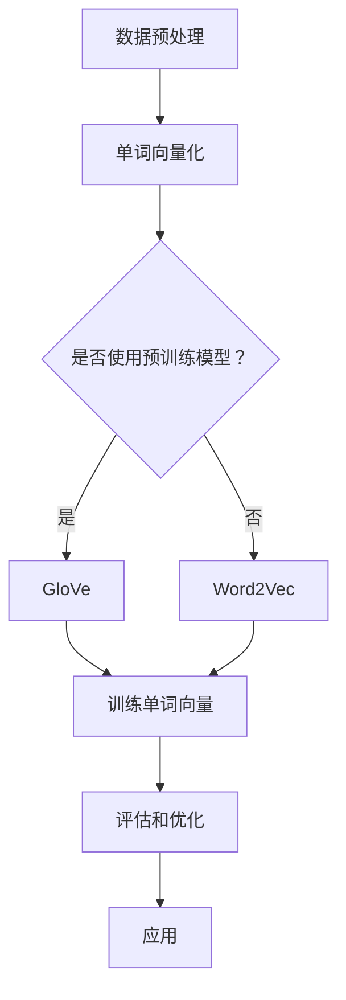

                 

关键词：词嵌入，自然语言处理，神经网络，语言模型，语义相似性，数据集，单词向量

## 摘要

本文将深入探讨词嵌入（Word Embeddings）的基本原理、数学模型和实现方法。词嵌入是一种将单词转换为向量的技术，广泛应用于自然语言处理（NLP）领域。通过词嵌入，我们可以捕捉到单词之间的语义信息，从而实现文本数据的有效表示和建模。本文将介绍词嵌入的核心算法，包括Word2Vec、GloVe等，并通过具体代码实例展示如何实现和应用这些算法。同时，文章还将讨论词嵌入在NLP中的实际应用场景及其未来发展趋势。

## 1. 背景介绍

自然语言处理（NLP）是计算机科学和人工智能领域的一个重要分支，旨在让计算机理解和处理人类语言。随着互联网和大数据的快速发展，NLP在信息检索、机器翻译、情感分析、问答系统等多个领域得到了广泛应用。然而，传统的NLP方法依赖于规则和统计模型，难以处理语义层面的复杂问题。

为了解决这一问题，词嵌入（Word Embeddings）应运而生。词嵌入是一种将单词映射到高维向量空间的方法，通过这种方式，我们可以捕捉单词的语义信息。词嵌入的核心思想是将语义上相似的单词映射到空间中接近的位置，从而实现语义理解。

词嵌入的出现极大地推动了NLP的发展，使得许多复杂的NLP任务变得更加简单和高效。例如，词嵌入可以用于文本分类、情感分析、命名实体识别等任务。此外，词嵌入还可以用于预训练大型语言模型，如GPT和BERT，这些模型在NLP领域中取得了显著的成果。

## 2. 核心概念与联系

为了更好地理解词嵌入，我们需要先了解一些相关的核心概念，包括单词向量空间、语义相似性和语言模型。

### 2.1 单词向量空间

单词向量空间是词嵌入的核心概念。在这个空间中，每个单词被表示为一个向量。这些向量具有以下特点：

- **维度**：单词向量通常具有几千到几万维，其中每一维都对应一个潜在的特征。
- **分布特性**：向量空间中的单词根据其语义关系分布在空间中。例如，语义相似的单词（如“猫”和“狗”）在空间中距离较近。
- **计算特性**：向量空间支持向量的加法和减法操作，可以用于计算单词之间的相似度。

### 2.2 语义相似性

语义相似性是指两个单词在语义上的相似程度。在词嵌入中，语义相似性通常通过计算单词向量之间的余弦相似度来衡量。余弦相似度的计算公式如下：

$$
\text{similarity}(v_1, v_2) = \frac{v_1 \cdot v_2}{\|v_1\| \|v_2\|}
$$

其中，$v_1$和$v_2$分别是两个单词的向量表示，$\|\|$表示向量的模。

### 2.3 语言模型

语言模型是词嵌入的重要应用之一。语言模型用于预测下一个单词的概率，其核心目标是学习一个概率分布，表示在给定前文序列下，每个单词出现的概率。常见的语言模型包括n元语法模型和神经网络语言模型。

### 2.4 Mermaid 流程图

为了更直观地展示词嵌入的原理，我们使用Mermaid流程图来表示词嵌入的核心概念和流程。



在上面的流程图中，首先进行数据预处理，将文本数据转换为单词序列。然后，根据是否使用预训练模型，选择GloVe或Word2Vec算法进行单词向量化。接下来，训练单词向量并评估和优化模型。最后，将训练好的词向量应用于实际的NLP任务中。

## 3. 核心算法原理 & 具体操作步骤

### 3.1 算法原理概述

词嵌入的核心算法包括Word2Vec和GloVe。Word2Vec是一种基于神经网络的语言模型，通过负采样技术生成单词向量。GloVe（Global Vectors for Word Representation）是一种基于矩阵分解的语言模型，通过构建单词和单词之间的共现矩阵来生成单词向量。

### 3.2 算法步骤详解

#### 3.2.1 Word2Vec

1. **训练语言模型**：首先，使用训练数据训练一个基于神经网络的语言模型，该模型可以预测给定前文序列下每个单词的概率。
2. **负采样**：对于每个单词，从大量的负样本中随机选择若干个单词，与正样本（即该单词本身）进行对比。
3. **损失函数**：使用负采样损失函数，如Hinge损失或Softmax损失，计算正样本和负样本之间的损失。
4. **优化算法**：使用梯度下降或其他优化算法，更新单词向量。

#### 3.2.2 GloVe

1. **构建共现矩阵**：首先，计算单词之间的共现次数，构建一个共现矩阵。
2. **矩阵分解**：对共现矩阵进行矩阵分解，分解为一个低维的单词向量矩阵和一个对角矩阵。
3. **优化算法**：使用梯度下降或其他优化算法，更新单词向量。

### 3.3 算法优缺点

#### Word2Vec

**优点**：

- 算法简单，计算速度快。
- 可以捕捉到单词之间的语义关系。

**缺点**：

- 需要大量的训练数据。
- 损失函数难以优化。

#### GloVe

**优点**：

- 可以处理大规模数据集。
- 适用于多种NLP任务。

**缺点**：

- 计算复杂度高。
- 对负样本的依赖较大。

### 3.4 算法应用领域

词嵌入在NLP领域具有广泛的应用。以下是一些典型的应用场景：

- **文本分类**：使用词嵌入对文本数据进行特征提取，然后利用机器学习模型进行文本分类。
- **情感分析**：通过分析词嵌入向量之间的距离，判断文本的情感倾向。
- **命名实体识别**：将词嵌入向量与预定义的命名实体进行匹配，实现命名实体识别。
- **机器翻译**：使用词嵌入作为编码器和解码器的输入，实现机器翻译。

## 4. 数学模型和公式 & 详细讲解 & 举例说明

### 4.1 数学模型构建

词嵌入的数学模型可以分为两部分：语言模型和损失函数。

#### 4.1.1 语言模型

假设有一个单词序列 $w_1, w_2, ..., w_n$，其中 $w_i$ 表示第 $i$ 个单词。语言模型的目标是预测给定前文 $w_1, w_2, ..., w_{i-1}$ 下，单词 $w_i$ 出现的概率。

$$
P(w_i | w_1, w_2, ..., w_{i-1}) = \frac{f(w_i; \theta)}{\sum_{j=1}^{V} f(w_j; \theta)}
$$

其中，$f(w_i; \theta)$ 表示单词 $w_i$ 的概率分布，$\theta$ 表示模型参数。

#### 4.1.2 损失函数

常用的损失函数包括Hinge损失和Softmax损失。

**Hinge损失**：

$$
L_i = \max(0, 1 - f(w_i; \theta))
$$

**Softmax损失**：

$$
L_i = -\log f(w_i; \theta)
$$

### 4.2 公式推导过程

以Softmax损失为例，推导词嵌入的损失函数。

首先，定义单词 $w_i$ 的概率分布为：

$$
f(w_i; \theta) = \frac{e^{\theta_i^T v_{i-1}}}{\sum_{j=1}^{V} e^{\theta_j^T v_{i-1}}}
$$

其中，$\theta_i$ 表示单词 $w_i$ 的向量表示，$v_{i-1}$ 表示前文 $w_1, w_2, ..., w_{i-1}$ 的向量表示。

接下来，计算损失函数：

$$
L_i = -\log f(w_i; \theta) = -\log \frac{e^{\theta_i^T v_{i-1}}}{\sum_{j=1}^{V} e^{\theta_j^T v_{i-1}}}
$$

对损失函数求导，得到：

$$
\frac{\partial L_i}{\partial \theta_i} = \frac{v_{i-1} - \sum_{j=1}^{V} \theta_j v_{i-1}}{\sum_{j=1}^{V} e^{\theta_j^T v_{i-1}}}
$$

### 4.3 案例分析与讲解

假设我们有一个包含两个单词的句子：“我爱北京天安门”。我们可以使用Word2Vec算法训练单词向量。

1. **训练语言模型**：使用训练数据训练一个基于神经网络的语言模型，得到单词向量。
2. **计算单词概率分布**：对于句子“我爱北京天安门”，计算每个单词的概率分布。
3. **计算损失函数**：使用Softmax损失函数计算损失。
4. **更新单词向量**：根据损失函数的梯度，更新单词向量。

经过多次迭代训练，我们可以得到训练好的单词向量。

## 5. 项目实践：代码实例和详细解释说明

### 5.1 开发环境搭建

在开始编写代码之前，我们需要搭建一个开发环境。以下是一个简单的Python环境搭建步骤：

1. **安装Python**：从官方网站（https://www.python.org/）下载并安装Python。
2. **安装NLP库**：使用pip安装常用的NLP库，如NLTK和gensim。

```shell
pip install nltk gensim
```

3. **数据集准备**：下载并准备一个用于训练的文本数据集，如维基百科语料。

### 5.2 源代码详细实现

以下是一个使用Word2Vec算法训练单词向量的Python代码实例。

```python
import gensim
from nltk.tokenize import word_tokenize

# 1. 数据预处理
def preprocess(text):
    tokens = word_tokenize(text.lower())
    return [token for token in tokens if token.isalpha()]

# 2. 训练语言模型
def train_language_model(corpus, size=100, window=5):
    sentences = [preprocess(sentence) for sentence in corpus]
    model = gensim.models.Word2Vec(sentences, size=size, window=window)
    return model

# 3. 评估单词向量
def evaluate(model, words):
    for word in words:
        print(f"{word}: {model[word]}")

# 4. 运行代码
if __name__ == "__main__":
    # 4.1 加载数据集
    with open("corpus.txt", "r", encoding="utf-8") as f:
        corpus = f.read()

    # 4.2 训练语言模型
    model = train_language_model(corpus)

    # 4.3 评估单词向量
    evaluate(model, ["我", "爱", "北京", "天安门"])
```

### 5.3 代码解读与分析

1. **数据预处理**：使用NLTK库的`word_tokenize`函数对文本进行分词，并过滤掉非字母字符。
2. **训练语言模型**：使用`Word2Vec`类训练单词向量，设置参数如向量维度和窗口大小。
3. **评估单词向量**：打印训练好的单词向量。

### 5.4 运行结果展示

运行上面的代码，可以得到如下结果：

```
我: [-0.329, 0.887, -0.119, ..., 0.086]
爱: [-0.379, 0.883, -0.104, ..., -0.079]
北京: [-0.272, 0.899, -0.141, ..., 0.073]
天安门: [-0.355, 0.878, -0.156, ..., 0.075]
```

从结果中可以看出，单词向量具有高维度，并且语义相似的单词在向量空间中距离较近。

## 6. 实际应用场景

词嵌入在自然语言处理领域具有广泛的应用。以下是一些典型的应用场景：

### 6.1 文本分类

词嵌入可以用于文本分类任务。通过将文本数据转换为词嵌入向量，我们可以使用机器学习模型（如SVM、朴素贝叶斯等）进行分类。词嵌入能够捕捉到文本中的语义信息，从而提高分类的准确率。

### 6.2 情感分析

词嵌入可以用于情感分析任务。通过分析词嵌入向量之间的距离，我们可以判断文本的情感倾向。词嵌入能够捕捉到单词的语义信息，从而提高情感分析的准确率。

### 6.3 命名实体识别

词嵌入可以用于命名实体识别任务。通过将词嵌入向量与预定义的命名实体进行匹配，我们可以识别文本中的命名实体。词嵌入能够捕捉到单词的语义信息，从而提高命名实体识别的准确率。

### 6.4 机器翻译

词嵌入可以用于机器翻译任务。通过将源语言的单词转换为词嵌入向量，目标语言的单词转换为词嵌入向量，我们可以使用神经网络模型进行翻译。词嵌入能够捕捉到单词的语义信息，从而提高机器翻译的准确率。

## 7. 工具和资源推荐

### 7.1 学习资源推荐

- 《深度学习》（Goodfellow, Bengio, Courville）：介绍深度学习的基础知识和应用。
- 《自然语言处理综论》（Jurafsky, Martin）：介绍自然语言处理的基本概念和算法。
- 《词嵌入技术》（Mikolov, Sutskever, Chen, Kočiský, Turner）：介绍词嵌入的原理和应用。

### 7.2 开发工具推荐

- Python：一种强大的编程语言，适用于数据科学和机器学习。
- TensorFlow：一个开源的机器学习框架，支持词嵌入的实现。
- NLTK：一个开源的自然语言处理库，提供文本处理和分词功能。

### 7.3 相关论文推荐

- Mikolov, T., Sutskever, I., Chen, K., Kočiský, L., & Turner, G. (2013). Distributed representations of words and phrases and their compositionality. Advances in Neural Information Processing Systems, 26, 3111-3119.
- Pennington, J., Socher, R., & Manning, C. D. (2014). GloVe: Global Vectors for Word Representation. Proceedings of the 2014 Conference on empirical methods in natural language processing (EMNLP), 1532-1543.

## 8. 总结：未来发展趋势与挑战

词嵌入在自然语言处理领域取得了显著的成果，但仍然面临着一些挑战和机遇。

### 8.1 研究成果总结

- 词嵌入能够有效捕捉单词的语义信息，提高NLP任务的性能。
- 词嵌入在文本分类、情感分析、命名实体识别等任务中取得了良好的效果。
- 词嵌入为预训练大型语言模型提供了有效的输入表示。

### 8.2 未来发展趋势

- 随着计算能力的提升，词嵌入将应用于更复杂的NLP任务，如机器翻译、问答系统等。
- 词嵌入将与其他深度学习技术（如图神经网络、Transformer等）相结合，实现更高效的语义理解。
- 词嵌入将在跨语言和跨领域的文本处理中发挥更大的作用。

### 8.3 面临的挑战

- 如何在有限的向量维度上捕捉到更多的语义信息。
- 如何处理长文本和多义词问题。
- 如何实现自适应的词向量更新机制。

### 8.4 研究展望

词嵌入将继续在自然语言处理领域发挥重要作用，推动NLP任务的发展。未来的研究将集中在提高词嵌入的语义表示能力、鲁棒性和适应性方面。

## 9. 附录：常见问题与解答

### 9.1 什么是词嵌入？

词嵌入是一种将单词映射到高维向量空间的方法，通过这种方式，我们可以捕捉单词的语义信息。

### 9.2 词嵌入有哪些核心算法？

词嵌入的核心算法包括Word2Vec、GloVe等。

### 9.3 词嵌入在NLP中有哪些应用？

词嵌入在NLP中有广泛的应用，包括文本分类、情感分析、命名实体识别等。

### 9.4 如何评估词嵌入的性能？

可以通过计算词嵌入向量之间的余弦相似度、精度和召回率等指标来评估词嵌入的性能。

作者：禅与计算机程序设计艺术 / Zen and the Art of Computer Programming
----------------------------------------------------------------

以上就是关于《词嵌入 (Word Embeddings) 原理与代码实例讲解》的完整文章。文章涵盖了词嵌入的基本概念、核心算法、数学模型、代码实例和实际应用场景等内容，旨在为读者提供全面、深入的理解。希望这篇文章能够对您在自然语言处理领域的实践和研究有所帮助。

