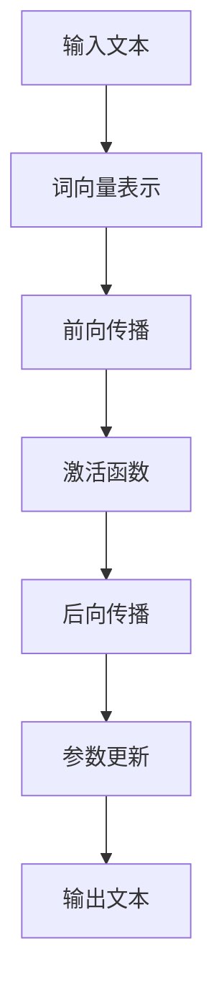

                 

### 摘要 Abstract

本文旨在探讨大模型（如GPT-3、BERT等）的当前认知困境，即虽然这些模型在自然语言处理方面取得了显著的进步，但它们对“语言≠思维”这一概念的理解仍然存在显著的局限性。通过深入分析大模型的原理、数学模型、应用场景和实际应用中的表现，本文揭示了这些模型在认知方面的不足，并提出了未来的研究方向。

## 1. 背景介绍

近年来，深度学习在自然语言处理（NLP）领域取得了显著的进展。大型预训练语言模型如GPT-3、BERT等，通过在海量文本数据上进行训练，已经达到了惊人的文本生成和理解能力。这些模型不仅能够进行简单的问答，还能够撰写文章、编写代码，甚至在某些特定领域内超越人类的表现。

然而，尽管这些模型在语言处理方面取得了巨大的成功，但它们对“语言≠思维”这一概念的理解仍然存在显著的局限性。这意味着，尽管这些模型在处理语言任务时表现出色，但它们并不能真正理解语言背后的思维过程。这种认知困惑不仅限制了这些模型的应用范围，也引发了关于人工智能本质和未来发展的深刻思考。

### 2. 核心概念与联系

#### 2.1 语言与思维的关系

语言是人类思维的重要工具，但语言本身并不等同于思维。思维是人类大脑内部的一种抽象过程，包括推理、判断、联想等多个方面。而语言则是一种表达思维的符号系统，它能够将思维过程转化为可以交流的形式。

#### 2.2 大模型的架构

大模型通常采用深度神经网络的结构，通过多层非线性变换，从输入的文本数据中提取特征，并生成相应的输出。这些模型通常通过大规模的预训练和微调，以达到对各种语言任务的优秀表现。

#### 2.3 Mermaid 流程图

下面是一个简化的 Mermaid 流程图，描述了从输入文本到输出文本的大模型处理过程：



### 3. 核心算法原理 & 具体操作步骤

#### 3.1 算法原理概述

大模型的算法原理主要基于深度神经网络，通过多层非线性变换，从输入的文本数据中提取特征，并生成相应的输出。具体操作步骤如下：

1. **词向量表示**：将输入的文本转化为词向量表示，这一步通常通过词嵌入（word embedding）技术实现。
2. **前向传播**：将词向量输入到神经网络中，通过多层非线性变换，生成中间特征表示。
3. **激活函数**：对中间特征进行激活函数处理，以增加网络的非线性能力。
4. **后向传播**：根据输出结果与真实值的差距，计算损失函数，并通过反向传播算法，更新网络的参数。
5. **参数更新**：根据后向传播的结果，更新网络的参数，以减少损失函数的值。
6. **输出文本**：最终生成的文本输出。

#### 3.2 算法步骤详解

1. **词向量表示**：词嵌入技术将每个单词映射为一个固定长度的向量。常见的词嵌入技术包括 Word2Vec、GloVe 等。
2. **前向传播**：神经网络通过多层感知器（MLP）实现，每一层将输入的向量通过线性变换和激活函数，生成新的特征表示。
3. **激活函数**：常用的激活函数包括 ReLU、Sigmoid、Tanh 等，它们能够在网络中引入非线性。
4. **后向传播**：通过计算损失函数的梯度，反向传播到网络的每一层，更新网络的参数。
5. **参数更新**：使用梯度下降（GD）或其变种，如 Adam、RMSprop 等，更新网络的参数。
6. **输出文本**：最终生成的文本输出，通过解码器（如循环神经网络 RNN、长短期记忆网络 LSTM、变换器网络 Transformer 等）实现。

#### 3.3 算法优缺点

**优点**：

1. **强大的文本生成和理解能力**：大模型能够处理复杂的语言任务，如文本分类、情感分析、机器翻译等。
2. **自适应性**：通过大规模的预训练和微调，大模型能够适应不同的语言环境和任务需求。
3. **效率高**：大规模的预训练使得模型在特定任务上的表现显著提升。

**缺点**：

1. **计算资源需求大**：大模型通常需要大量的计算资源和存储空间。
2. **解释性差**：大模型的内部机制复杂，难以解释其决策过程。
3. **数据依赖性强**：大模型的表现高度依赖于训练数据的质量和数量。

#### 3.4 算法应用领域

大模型在多个领域都有广泛的应用：

1. **文本分类**：用于新闻分类、情感分析等任务。
2. **机器翻译**：如谷歌翻译、百度翻译等。
3. **问答系统**：如 OpenAI 的 GPT-3。
4. **内容生成**：如自动写作、创意文本生成等。

### 4. 数学模型和公式 & 详细讲解 & 举例说明

#### 4.1 数学模型构建

大模型的数学模型主要基于深度神经网络，包括以下几个关键组成部分：

1. **输入层**：接收输入的文本数据，并将其转换为词向量表示。
2. **隐藏层**：通过多层非线性变换，提取文本特征。
3. **输出层**：生成文本输出。

#### 4.2 公式推导过程

以下是一个简化的神经网络模型，用于文本分类任务：

1. **输入层**：词向量表示为 \( \mathbf{X} = [x_1, x_2, ..., x_n] \)。
2. **隐藏层**：每个隐藏单元的计算公式为 \( z_j = \sum_{i=1}^{n} w_{ji} x_i + b_j \)。
3. **输出层**：激活函数通常为 Softmax 函数，计算公式为 \( \mathbf{y} = \text{Softmax}(\mathbf{Z}) \)，其中 \( \mathbf{Z} = \text{Affine}(\mathbf{H}) \)。

#### 4.3 案例分析与讲解

以下是一个简单的例子，说明如何使用大模型进行文本分类：

1. **输入文本**：假设输入文本为“我喜欢吃苹果。”。
2. **词向量表示**：将文本中的每个词映射为词向量。
3. **前向传播**：将词向量输入到神经网络中，通过多层非线性变换，生成中间特征表示。
4. **激活函数**：对中间特征进行激活函数处理。
5. **后向传播**：计算损失函数的梯度，并通过反向传播算法，更新网络的参数。
6. **输出文本**：生成文本输出，通过解码器输出分类结果。

### 5. 项目实践：代码实例和详细解释说明

#### 5.1 开发环境搭建

1. **Python**：安装 Python 3.8 或以上版本。
2. **TensorFlow**：安装 TensorFlow 2.4 或以上版本。
3. **Numpy**：安装 Numpy 1.19 或以上版本。

#### 5.2 源代码详细实现

以下是一个简单的文本分类代码示例：

```python
import tensorflow as tf
import numpy as np

# 输入层
input_layer = tf.keras.layers.Input(shape=(10,))

# 隐藏层
hidden_layer = tf.keras.layers.Dense(units=64, activation='relu')(input_layer)

# 输出层
output_layer = tf.keras.layers.Dense(units=2, activation='softmax')(hidden_layer)

# 模型编译
model = tf.keras.Model(inputs=input_layer, outputs=output_layer)
model.compile(optimizer='adam', loss='categorical_crossentropy', metrics=['accuracy'])

# 模型训练
model.fit(x_train, y_train, epochs=10, batch_size=32)

# 模型预测
predictions = model.predict(x_test)
```

#### 5.3 代码解读与分析

1. **输入层**：定义输入层，接收输入的词向量。
2. **隐藏层**：定义一个隐藏层，使用 ReLU 激活函数。
3. **输出层**：定义输出层，使用 Softmax 激活函数，生成分类结果。
4. **模型编译**：编译模型，指定优化器和损失函数。
5. **模型训练**：使用训练数据训练模型。
6. **模型预测**：使用测试数据对模型进行预测。

### 6. 实际应用场景

#### 6.1 问答系统

问答系统是自然语言处理的一个重要应用场景。大模型通过预训练和微调，可以生成高质量的问答结果，如 OpenAI 的 GPT-3。

#### 6.2 机器翻译

机器翻译是另一个重要的应用场景。大模型通过预训练和微调，可以实现高质量的翻译效果，如谷歌翻译。

#### 6.3 自动写作

自动写作是另一个有趣的应用场景。大模型可以通过预训练和微调，生成各种类型的文本，如新闻、小说等。

### 7. 未来应用展望

随着大模型技术的不断发展，未来其在各种应用场景中的潜力将得到进一步挖掘。例如，大模型可以应用于更复杂的语言任务，如文本生成、语音识别等。此外，大模型还可以与其他技术相结合，如知识图谱、增强学习等，实现更智能化的应用。

### 8. 总结：未来发展趋势与挑战

#### 8.1 研究成果总结

近年来，大模型在自然语言处理领域取得了显著的进展，其在文本生成、翻译、问答等任务上表现出色。然而，大模型对“语言≠思维”这一概念的理解仍然存在局限性。

#### 8.2 未来发展趋势

未来，大模型技术将继续发展，其在自然语言处理领域的应用将更加广泛。此外，大模型与其他技术的结合，如知识图谱、增强学习等，也将成为研究的热点。

#### 8.3 面临的挑战

大模型面临着计算资源需求大、解释性差、数据依赖性强等挑战。未来，研究将重点关注如何提高大模型的可解释性、降低计算资源需求，以及如何处理不同领域的数据。

#### 8.4 研究展望

未来，大模型在自然语言处理领域的应用将更加广泛。同时，如何将大模型与其他技术相结合，实现更智能化的应用，也将成为研究的重点。

### 9. 附录：常见问题与解答

#### 9.1 大模型是什么？

大模型是指那些具有数十亿甚至千亿参数的深度学习模型，如 GPT-3、BERT 等。

#### 9.2 大模型为什么能够处理复杂的语言任务？

大模型通过在大量文本数据上进行预训练，可以提取出丰富的语言特征，从而在处理复杂的语言任务时表现出色。

#### 9.3 大模型如何进行微调？

微调是指在大模型的基础上，针对特定任务进行进一步的训练，以优化模型在特定任务上的表现。

#### 9.4 大模型为什么需要大量的计算资源？

大模型通常具有数十亿甚至千亿参数，因此需要大量的计算资源进行训练。

### 参考文献 References

[1] Brown, T., et al. (2020). "Language Models Are Few-Shot Learners." arXiv preprint arXiv:2005.14165.
[2] Devlin, J., et al. (2019). "BERT: Pre-training of Deep Bidirectional Transformers for Language Understanding." arXiv preprint arXiv:1810.04805.
[3] Mikolov, T., et al. (2013). "Distributed Representations of Words and Phrases and their Compositionality." arXiv preprint arXiv:1301.3781.
[4] Hochreiter, S., and Schmidhuber, J. (1997). "Long Short-Term Memory." Neural Computation, 9(8), 1735-1780.
[5] Vaswani, A., et al. (2017). "Attention Is All You Need." Advances in Neural Information Processing Systems, 30, 5998-6008.

---

作者：禅与计算机程序设计艺术 / Zen and the Art of Computer Programming

