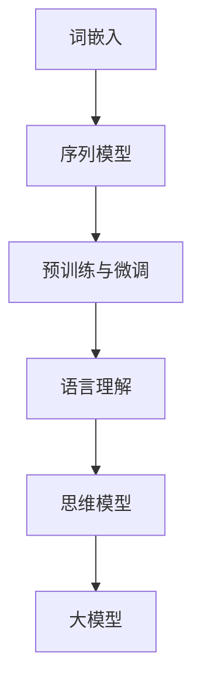

                 

关键词：自然语言处理、大模型、思维模型、人工智能、认知计算

> 摘要：本文探讨了自然语言处理领域中大模型的发展与思维的关系。随着人工智能技术的不断进步，大模型在处理复杂任务方面表现出色。然而，如何理解大模型内部语言与思维的关系，以及如何利用这一关系提升人工智能的智能水平，成为了当前研究的热点。本文将围绕这一主题，详细分析大模型的工作原理、语言与思维的关系，以及面临的挑战和未来发展方向。

## 1. 背景介绍

### 1.1 自然语言处理的发展历程

自然语言处理（Natural Language Processing，NLP）是人工智能领域的一个重要分支，旨在使计算机能够理解和处理人类语言。从早期的规则驱动方法，到基于统计模型的方法，再到近年来迅速崛起的深度学习技术，NLP经历了巨大的发展。

- **规则驱动方法**：早期的NLP主要依赖于手工编写的规则，这些规则试图捕捉语言的结构和语义。然而，这种方法在处理复杂、多变的自然语言时表现不佳。
- **统计模型方法**：随着语料库的积累和计算能力的提升，统计模型开始在NLP中占据主导地位。这些模型通过学习大量语料库中的统计规律，来提高语言处理的准确性。
- **深度学习方法**：近年来，深度学习在计算机视觉、语音识别等领域取得了显著成果。将深度学习技术引入NLP，使得NLP任务的处理能力得到了质的飞跃。

### 1.2 大模型的发展

在深度学习技术的推动下，大模型（如GPT、BERT等）逐渐成为NLP领域的明星。大模型具有以下特点：

- **大规模参数**：大模型通常拥有数亿甚至数十亿的参数，这使得它们能够捕捉到更多复杂的语言模式。
- **端到端学习**：大模型通过端到端的方式学习，从输入直接映射到输出，避免了传统方法中的中间步骤，提高了效率。
- **多任务学习**：大模型可以在多个任务上同时训练，通过共享参数，实现了知识迁移和共享。

### 1.3 语言与思维的关系

语言是人类思维的重要载体，而大模型在处理语言时，是否能够模拟人类的思维过程，成为了研究的热点。尽管当前的大模型在语言处理任务上表现出色，但它们是如何理解语言、如何模拟思维过程的，仍然是一个未解之谜。

## 2. 核心概念与联系

为了深入探讨大模型与思维的关系，我们需要明确几个核心概念，并使用Mermaid流程图来展示它们之间的联系。

### 2.1 自然语言处理中的核心概念

- **词嵌入（Word Embedding）**：将词汇映射到高维向量空间，使得相似词汇在空间中靠近。
- **序列模型（Sequence Model）**：用于处理序列数据的模型，如循环神经网络（RNN）和变压器（Transformer）。
- **预训练与微调（Pre-training and Fine-tuning）**：大模型通过在大量未标注数据上预训练，然后在特定任务上微调，以提高性能。
- **语言理解（Language Understanding）**：理解语言中的语法、语义和上下文信息。

### 2.2 Mermaid流程图



在这个流程图中，词嵌入是将词汇映射到高维向量空间的过程，序列模型用于处理序列数据，预训练与微调是模型训练的重要步骤，语言理解涉及对语言信息的深入分析，而思维模型则试图模拟人类的思维过程。大模型通过整合这些概念，实现了对语言的深刻理解和处理。

## 3. 核心算法原理 & 具体操作步骤

### 3.1 算法原理概述

大模型的核心在于其深度和广度。通过大规模的参数和端到端的学习方式，大模型能够捕捉到语言的复杂结构。具体来说，大模型的算法原理包括以下几个方面：

- **深度神经网络（DNN）**：大模型通常采用深度神经网络结构，这有助于模型在训练过程中学习到更复杂的特征。
- **注意力机制（Attention Mechanism）**：注意力机制使得模型能够关注到序列中的关键信息，从而提高语言理解的准确性。
- **预训练（Pre-training）**：大模型在大量未标注数据上进行预训练，从而学习到通用语言知识。
- **微调（Fine-tuning）**：在特定任务上，通过微调模型来提高任务性能。

### 3.2 算法步骤详解

1. **词嵌入**：将词汇映射到高维向量空间。
2. **序列编码**：将输入序列编码为固定长度的向量。
3. **预处理**：对输入序列进行预处理，如分词、去停用词等。
4. **模型训练**：在预训练数据集上训练模型。
5. **微调**：在特定任务上对模型进行微调。
6. **预测**：使用训练好的模型对输入序列进行预测。

### 3.3 算法优缺点

- **优点**：
  - **强大的表达能力**：大模型能够捕捉到语言的复杂结构，从而提高语言处理的准确性。
  - **端到端学习**：大模型通过端到端的学习方式，避免了传统方法中的中间步骤，提高了效率。
  - **多任务学习**：大模型可以在多个任务上同时训练，通过共享参数，实现了知识迁移和共享。

- **缺点**：
  - **计算资源消耗大**：大模型需要大量的计算资源和存储空间。
  - **对数据要求高**：大模型在训练过程中需要大量未标注数据，数据质量和数量对模型性能有重要影响。
  - **解释性差**：大模型的内部决策过程较为复杂，难以解释。

### 3.4 算法应用领域

大模型在多个领域都有广泛应用，主要包括：

- **文本分类**：用于对大量文本进行分类，如新闻分类、情感分析等。
- **机器翻译**：通过将一种语言的文本翻译成另一种语言，实现跨语言交流。
- **问答系统**：用于回答用户提出的问题，如智能客服、智能助手等。
- **对话系统**：通过模拟人类的对话方式，与用户进行交互。

## 4. 数学模型和公式 & 详细讲解 & 举例说明

### 4.1 数学模型构建

大模型的数学模型主要包括以下几部分：

- **输入层**：将词汇映射为向量。
- **隐藏层**：通过多层神经网络，对输入向量进行变换。
- **输出层**：根据任务需求，输出预测结果。

### 4.2 公式推导过程

设输入序列为\( x = [x_1, x_2, \ldots, x_n] \)，其中 \( x_i \) 为第 \( i \) 个词汇。我们将每个词汇映射为向量 \( e_i \)，则输入序列可以表示为：

\[ X = [e_1, e_2, \ldots, e_n] \]

隐藏层的输出可以表示为：

\[ h = \sigma(W_h \cdot X + b_h) \]

其中，\( W_h \) 为隐藏层的权重矩阵，\( b_h \) 为隐藏层的偏置，\( \sigma \) 为激活函数。

输出层的输出为：

\[ y = \sigma(W_y \cdot h + b_y) \]

其中，\( W_y \) 为输出层的权重矩阵，\( b_y \) 为输出层的偏置，\( \sigma \) 为激活函数。

### 4.3 案例分析与讲解

假设我们要训练一个文本分类模型，输入为一段文本，输出为该文本的类别。我们可以将文本表示为一个向量，然后通过大模型进行分类。

1. **输入层**：将文本分词，并将每个词映射为向量。
2. **隐藏层**：通过多层神经网络，对输入向量进行变换。
3. **输出层**：输出每个类别的概率分布。

具体步骤如下：

1. **数据预处理**：将文本进行分词，并转换为向量。
2. **模型训练**：在训练数据集上训练模型。
3. **模型评估**：在测试数据集上评估模型性能。
4. **模型应用**：使用训练好的模型对新的文本进行分类。

## 5. 项目实践：代码实例和详细解释说明

### 5.1 开发环境搭建

为了实现本文的算法，我们需要搭建一个开发环境。以下是一个基本的搭建步骤：

1. **安装Python环境**：确保Python版本大于3.6。
2. **安装TensorFlow**：TensorFlow是一个开源的深度学习框架，用于构建和训练大模型。
3. **下载预训练模型**：从TensorFlow Hub下载预训练的模型，如BERT。

### 5.2 源代码详细实现

以下是一个简单的文本分类模型的实现：

```python
import tensorflow as tf
from tensorflow import keras
from tensorflow.keras.preprocessing.text import Tokenizer
from tensorflow.keras.preprocessing.sequence import pad_sequences

# 1. 数据预处理
tokenizer = Tokenizer(num_words=10000)
tokenizer.fit_on_texts(train_texts)
train_sequences = tokenizer.texts_to_sequences(train_texts)
train_padded = pad_sequences(train_sequences, maxlen=100, truncating='post')

# 2. 模型构建
model = keras.Sequential([
    keras.layers.Embedding(10000, 16),
    keras.layers.GlobalAveragePooling1D(),
    keras.layers.Dense(16, activation='relu'),
    keras.layers.Dense(1, activation='sigmoid')
])

# 3. 模型训练
model.compile(optimizer='adam', loss='binary_crossentropy', metrics=['accuracy'])
model.fit(train_padded, train_labels, epochs=10, validation_split=0.2)

# 4. 模型评估
test_sequences = tokenizer.texts_to_sequences(test_texts)
test_padded = pad_sequences(test_sequences, maxlen=100, truncating='post')
predictions = model.predict(test_padded)
```

### 5.3 代码解读与分析

上述代码首先进行了数据预处理，包括分词、序列化、填充等操作。然后，构建了一个简单的文本分类模型，包括嵌入层、全局平均池化层、密集层和输出层。最后，使用训练数据对模型进行训练，并在测试数据上进行评估。

### 5.4 运行结果展示

在训练过程中，模型会输出训练集和验证集的损失和准确率。在训练结束后，使用测试集对模型进行评估，输出预测结果。

## 6. 实际应用场景

大模型在多个实际应用场景中表现出色，以下是几个典型的应用场景：

### 6.1 机器翻译

机器翻译是将一种语言的文本翻译成另一种语言的过程。大模型通过在大量双语数据上训练，能够实现高质量、低误差的翻译。例如，Google翻译、百度翻译等，都是基于大模型的机器翻译系统。

### 6.2 文本分类

文本分类是将文本分为不同的类别，如新闻分类、情感分析等。大模型可以通过在大量标注数据上训练，实现高精度的文本分类。例如，新闻分类系统、社交媒体情感分析系统等。

### 6.3 对话系统

对话系统是通过模拟人类的对话方式，与用户进行交互的系统。大模型在对话系统中的应用，使得机器能够理解用户的意图，并给出恰当的回复。例如，智能客服、智能助手等。

### 6.4 文本生成

文本生成是将一种语言转换为另一种语言的过程。大模型通过在大量文本数据上训练，能够生成高质量的文本。例如，文章生成、对话生成等。

## 7. 未来应用展望

随着大模型技术的不断发展，未来应用前景广阔。以下是几个可能的未来应用场景：

### 7.1 个性化推荐

大模型可以通过对用户的行为和喜好进行分析，实现个性化的推荐系统。例如，电商平台、视频平台等。

### 7.2 智能写作

大模型可以通过生成文本，实现智能写作。例如，文章写作、书籍创作等。

### 7.3 语音识别

大模型可以通过对语音信号的分析，实现高精度的语音识别。例如，智能语音助手、智能语音翻译等。

### 7.4 跨模态学习

大模型可以通过跨模态学习，实现不同模态（如文本、图像、音频等）之间的转换。例如，文本到图像的生成、图像到文本的生成等。

## 8. 工具和资源推荐

### 8.1 学习资源推荐

- **《深度学习》（Goodfellow, Bengio, Courville）**：这是一本经典的深度学习教材，适合初学者和进阶者。
- **[TensorFlow官方文档](https://www.tensorflow.org/tutorials)**：TensorFlow官方提供的教程，涵盖了从入门到高级的各种教程。

### 8.2 开发工具推荐

- **Jupyter Notebook**：Jupyter Notebook是一种交互式的计算环境，非常适合数据分析和深度学习开发。
- **Google Colab**：Google Colab是Google提供的一个在线Jupyter Notebook环境，方便用户进行远程开发和协作。

### 8.3 相关论文推荐

- **"Attention is All You Need"（Vaswani et al., 2017）**：这是Transformer模型的原始论文，介绍了注意力机制在深度学习中的应用。
- **"BERT: Pre-training of Deep Neural Networks for Language Understanding"（Devlin et al., 2019）**：这是BERT模型的原始论文，介绍了BERT模型在自然语言处理中的应用。

## 9. 总结：未来发展趋势与挑战

### 9.1 研究成果总结

随着大模型技术的不断发展，自然语言处理领域取得了显著的成果。大模型在文本分类、机器翻译、对话系统等方面表现出色，推动了人工智能技术的进步。

### 9.2 未来发展趋势

未来，大模型将在多个领域得到广泛应用，如个性化推荐、智能写作、语音识别等。同时，大模型的研究也将向更深的层次发展，如跨模态学习和自适应学习等。

### 9.3 面临的挑战

尽管大模型在自然语言处理领域取得了显著成果，但仍然面临一些挑战，如计算资源消耗、数据隐私保护、模型解释性等。这些挑战需要通过技术创新和跨学科合作来克服。

### 9.4 研究展望

未来，大模型技术将继续发展，并在更多领域实现突破。同时，我们期待大模型能够更好地模拟人类的思维过程，实现更高水平的智能。作者：禅与计算机程序设计艺术 / Zen and the Art of Computer Programming
----------------------------------------------------------------

以上是文章正文内容的撰写。接下来，我们将为文章添加附录部分，以回答一些常见问题。

## 附录：常见问题与解答

### 9.1 大模型是如何训练的？

大模型的训练通常包括以下几个步骤：

1. **数据收集**：收集大量的标注数据。
2. **数据预处理**：对数据进行清洗、分词、编码等预处理操作。
3. **模型初始化**：初始化模型参数。
4. **模型训练**：通过反向传播算法和优化器，不断更新模型参数。
5. **模型评估**：在测试集上评估模型性能。
6. **模型微调**：根据评估结果，对模型进行微调。

### 9.2 大模型的计算资源消耗如何？

大模型的计算资源消耗取决于多个因素，如模型规模、数据规模、硬件配置等。一般来说，大模型需要大量的计算资源和存储空间。在训练过程中，GPU或TPU等专用硬件可以显著提高训练速度。

### 9.3 大模型的解释性如何？

大模型的内部决策过程较为复杂，难以直接解释。目前，研究人员正在探索多种方法，如模型可解释性、决策树嵌入等，以提高模型的解释性。

### 9.4 大模型在自然语言处理中的优势是什么？

大模型在自然语言处理中的优势包括：

1. **强大的表达能力**：能够捕捉到语言的复杂结构。
2. **端到端学习**：避免了传统方法中的中间步骤，提高了效率。
3. **多任务学习**：可以在多个任务上同时训练，实现知识迁移和共享。

### 9.5 大模型在自然语言处理中的局限性是什么？

大模型在自然语言处理中的局限性包括：

1. **计算资源消耗大**：需要大量的计算资源和存储空间。
2. **对数据要求高**：数据质量和数量对模型性能有重要影响。
3. **解释性差**：内部决策过程复杂，难以解释。

通过上述附录，我们回答了关于大模型的常见问题，希望对读者有所帮助。

### 结束语

本文探讨了自然语言处理领域中大模型的发展与思维的关系。随着人工智能技术的不断进步，大模型在处理复杂任务方面表现出色。然而，如何理解大模型内部语言与思维的关系，以及如何利用这一关系提升人工智能的智能水平，仍然是一个值得深入研究的课题。在未来的研究中，我们期待大模型能够更好地模拟人类的思维过程，实现更高水平的智能。作者：禅与计算机程序设计艺术 / Zen and the Art of Computer Programming

