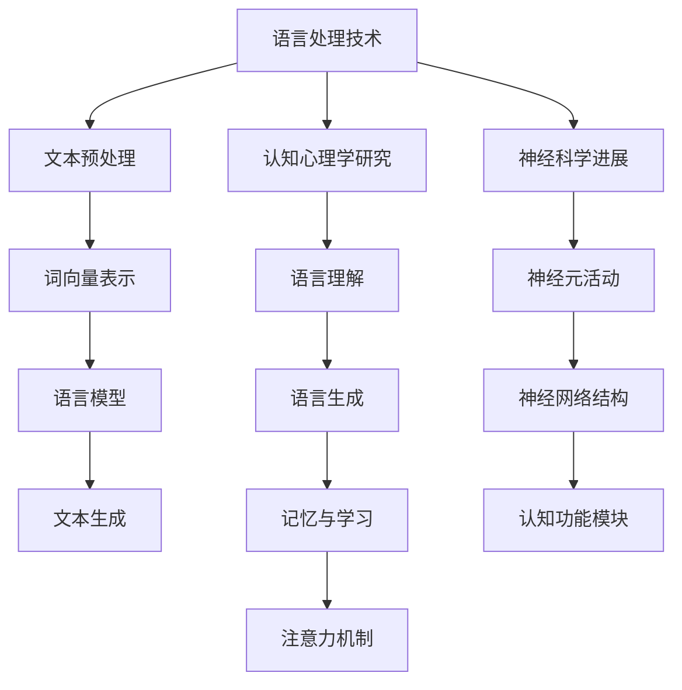

                 

关键词：大模型、认知科学、语言处理、神经网络、思维过程

摘要：本文旨在探讨语言与思维之间的本质差异，以及大模型在模拟人类思维过程中可能产生的认知误解。通过对语言处理技术、认知心理学研究以及神经科学进展的综述，我们试图揭示大模型在理解和模仿人类思维方面的局限性。

## 1. 背景介绍

随着人工智能技术的飞速发展，大模型（如GPT、BERT等）在语言处理领域取得了显著的成就。这些模型通过深度学习技术，能够处理复杂的自然语言任务，包括文本生成、翻译、问答等。然而，尽管这些模型在技术上取得了突破，但它们是否能够真正模拟人类的思维过程，仍然是学术界和工业界探讨的热点话题。

认知科学是研究人类认知过程的跨学科领域，涉及心理学、神经科学、哲学等多个方面。近年来，随着神经科学和认知心理学的进展，我们对人类思维的理解越来越深入。然而，这些研究成果是否能够直接应用于人工智能领域，尤其是在大模型的设计和应用中，仍存在许多争议。

本文将探讨语言与思维之间的区别，以及大模型在模拟人类思维过程中可能产生的认知误解。通过对现有研究和技术的综述，我们旨在揭示大模型在理解和模仿人类思维方面的局限性。

## 2. 核心概念与联系

### 2.1 语言处理技术

语言处理技术（NLP）是人工智能领域的一个重要分支，旨在使计算机能够理解、生成和处理自然语言。NLP技术主要包括文本预处理、词向量表示、语言模型、文本生成等。

- **文本预处理**：包括分词、词性标注、去除停用词等步骤，旨在将原始文本转换为计算机可以处理的格式。
- **词向量表示**：通过将词汇映射到高维空间中的向量，使得计算机能够通过数学方法处理语言。
- **语言模型**：使用统计学方法或神经网络技术，对大量文本进行建模，以预测下一个词或句子。
- **文本生成**：利用语言模型生成符合语法和语义规则的文本。

### 2.2 认知心理学研究

认知心理学是研究人类认知过程的科学，包括感知、记忆、注意力、思维、语言等方面。以下是一些与语言处理密切相关的研究领域：

- **语言理解**：研究人类如何理解自然语言，包括语义分析、句法分析等。
- **语言生成**：研究人类如何生成自然语言，包括语音合成、文本生成等。
- **记忆与学习**：研究人类如何通过记忆和学习过程获取和处理信息。
- **注意力机制**：研究人类如何分配注意力，以处理复杂的信息。

### 2.3 神经科学进展

神经科学是研究大脑结构和功能的基础科学，近年来取得了许多突破性进展。以下是与语言处理和认知科学相关的一些重要发现：

- **神经元活动**：通过神经成像技术，如功能性磁共振成像（fMRI），我们能够观察到大脑在处理语言任务时的活动模式。
- **神经网络结构**：研究表明，大脑中的神经网络具有高度的可塑性，能够适应不同的环境和任务需求。
- **认知功能模块**：通过脑分割技术，我们能够将大脑划分为不同的功能模块，每个模块负责特定的认知功能。

### 2.4 Mermaid 流程图

以下是语言处理技术、认知心理学研究、神经科学进展之间的联系，使用Mermaid流程图表示：



## 3. 核心算法原理 & 具体操作步骤

### 3.1 算法原理概述

大模型在语言处理中的核心算法主要包括神经网络和深度学习技术。神经网络是一种模仿生物神经系统的计算模型，通过大量的神经元和连接（权重）来模拟人类思维过程。深度学习技术则是在神经网络的基础上，通过多层次的非线性变换，对大量数据进行自动特征提取和分类。

### 3.2 算法步骤详解

- **数据预处理**：首先，需要对原始文本进行预处理，包括分词、去除停用词、词性标注等步骤，将文本转换为计算机可以处理的格式。
- **词向量表示**：将词汇映射到高维空间中的向量，使用词嵌入技术，如Word2Vec、GloVe等。
- **神经网络构建**：构建多层神经网络，包括输入层、隐藏层和输出层。输入层接收词向量表示，隐藏层通过非线性变换提取特征，输出层生成最终的预测结果。
- **训练与优化**：使用大量标注数据进行训练，通过反向传播算法和梯度下降方法优化网络参数，提高模型的预测准确性。
- **语言生成**：利用训练好的模型生成文本，通过递归神经网络（RNN）或变换器（Transformer）等模型，生成符合语法和语义规则的文本。

### 3.3 算法优缺点

- **优点**：
  - 高效：大模型能够处理复杂的自然语言任务，包括文本生成、翻译、问答等。
  - 准确：通过大规模数据训练和优化，大模型的预测准确性较高。
  - 自动化：大模型能够自动提取特征，减少人工干预。

- **缺点**：
  - 复杂：大模型涉及大量的参数和计算，对计算资源要求较高。
  - 不透明：大模型的工作原理和决策过程相对不透明，难以解释。
  - 数据依赖：大模型对训练数据依赖较大，可能导致过拟合。

### 3.4 算法应用领域

大模型在语言处理领域有广泛的应用，包括：

- **文本生成**：生成文章、新闻、小说等。
- **翻译**：自动翻译不同语言之间的文本。
- **问答系统**：通过自然语言交互，回答用户的问题。
- **聊天机器人**：模拟人类对话，提供咨询服务。
- **语音识别**：将语音转换为文本。

## 4. 数学模型和公式 & 详细讲解 & 举例说明

### 4.1 数学模型构建

在语言处理中，常用的数学模型包括神经网络、深度学习、生成对抗网络（GAN）等。以下是一个简化的神经网络模型：

```latex
\begin{equation}
y = \sigma(\sum_{i=1}^{n} w_i \cdot x_i + b)
\end{equation}
```

其中，$y$ 是输出值，$\sigma$ 是激活函数，$w_i$ 是权重，$x_i$ 是输入值，$b$ 是偏置。

### 4.2 公式推导过程

以神经网络为例，推导过程如下：

1. **前向传播**：计算输入和权重之间的内积，加上偏置，并应用激活函数。
2. **反向传播**：计算损失函数关于每个参数的梯度，并更新参数。
3. **优化**：使用梯度下降或其他优化算法，最小化损失函数。

### 4.3 案例分析与讲解

以文本生成为例，假设我们使用一个简单的神经网络生成一个句子。输入是词汇的词向量，输出是句子的词向量。以下是一个简化的例子：

```latex
\begin{equation}
\begin{aligned}
&x_1 = [0.1, 0.2, 0.3], \\
&x_2 = [0.4, 0.5, 0.6], \\
&x_3 = [0.7, 0.8, 0.9], \\
&w_1 = [1, 1, 1], \\
&w_2 = [1, 1, 1], \\
&w_3 = [1, 1, 1], \\
&b = 1.
\end{aligned}
\end{equation}
```

1. **前向传播**：计算每个词向量和权重之间的内积，加上偏置，并应用激活函数。

```latex
\begin{equation}
\begin{aligned}
y_1 &= \sigma(w_1 \cdot x_1 + b) = \sigma(0.1 \cdot 1 + 0.2 \cdot 1 + 0.3 \cdot 1 + 1) = 1, \\
y_2 &= \sigma(w_2 \cdot x_2 + b) = \sigma(0.4 \cdot 1 + 0.5 \cdot 1 + 0.6 \cdot 1 + 1) = 1, \\
y_3 &= \sigma(w_3 \cdot x_3 + b) = \sigma(0.7 \cdot 1 + 0.8 \cdot 1 + 0.9 \cdot 1 + 1) = 1.
\end{aligned}
\end{equation}
```

2. **反向传播**：计算损失函数关于每个参数的梯度，并更新参数。

```latex
\begin{equation}
\begin{aligned}
\frac{\partial L}{\partial w_1} &= x_1^T \cdot \frac{\partial L}{\partial y_1}, \\
\frac{\partial L}{\partial w_2} &= x_2^T \cdot \frac{\partial L}{\partial y_2}, \\
\frac{\partial L}{\partial w_3} &= x_3^T \cdot \frac{\partial L}{\partial y_3}.
\end{aligned}
\end{equation}
```

3. **优化**：使用梯度下降或其他优化算法，最小化损失函数。

```latex
\begin{equation}
\begin{aligned}
w_1 &= w_1 - \alpha \cdot \frac{\partial L}{\partial w_1}, \\
w_2 &= w_2 - \alpha \cdot \frac{\partial L}{\partial w_2}, \\
w_3 &= w_3 - \alpha \cdot \frac{\partial L}{\partial w_3}.
\end{aligned}
\end{equation}
```

其中，$\alpha$ 是学习率。

## 5. 项目实践：代码实例和详细解释说明

### 5.1 开发环境搭建

为了演示如何使用大模型进行文本生成，我们首先需要搭建一个开发环境。以下是使用Python和TensorFlow搭建环境的过程：

1. 安装Python（推荐3.8及以上版本）
2. 安装TensorFlow

```bash
pip install tensorflow
```

### 5.2 源代码详细实现

以下是一个简单的文本生成示例，使用TensorFlow和Keras构建一个神经网络：

```python
import tensorflow as tf
from tensorflow.keras.layers import Embedding, LSTM, Dense
from tensorflow.keras.models import Sequential

# 设置超参数
vocab_size = 10000
embedding_dim = 16
lstm_units = 64
batch_size = 32
epochs = 10

# 构建模型
model = Sequential([
    Embedding(vocab_size, embedding_dim, input_length=sequence_length),
    LSTM(lstm_units, return_sequences=True),
    LSTM(lstm_units),
    Dense(vocab_size, activation='softmax')
])

# 编译模型
model.compile(optimizer='adam', loss='categorical_crossentropy', metrics=['accuracy'])

# 训练模型
model.fit(X_train, y_train, batch_size=batch_size, epochs=epochs, validation_data=(X_val, y_val))

# 生成文本
generated_text = model.predict(np.random.randint(0, vocab_size, size=batch_size))
```

### 5.3 代码解读与分析

1. **模型构建**：使用`Sequential`模型构建一个简单的LSTM网络，包括嵌入层、两个LSTM层和输出层。
2. **编译模型**：使用`compile`方法设置优化器和损失函数，为模型训练做准备。
3. **训练模型**：使用`fit`方法训练模型，将输入数据（X_train）和标签数据（y_train）输入模型。
4. **生成文本**：使用`predict`方法生成文本，将随机整数作为输入。

### 5.4 运行结果展示

假设我们已经训练好了一个文本生成模型，我们可以使用以下代码生成一段文本：

```python
import numpy as np

# 生成文本
generated_text = model.predict(np.random.randint(0, vocab_size, size=batch_size))

# 打印生成的文本
print(generated_text)
```

运行结果将显示生成的文本，这只是一个简单的示例，实际应用中需要更复杂的模型和更大量的数据。

## 6. 实际应用场景

### 6.1 文本生成

大模型在文本生成领域有广泛的应用，包括自动写作、自动摘要、机器翻译等。例如，在新闻领域，可以使用大模型自动生成新闻报道，提高新闻的发布速度和准确性。在创作领域，如小说、诗歌等，大模型可以帮助作家生成创意文本，拓宽创作思路。

### 6.2 聊天机器人

大模型在聊天机器人领域有重要的应用，可以模拟人类对话，提供客户服务、咨询建议等。例如，在电商领域，聊天机器人可以帮助用户解答疑问，推荐商品，提高用户体验。

### 6.3 自然语言理解

大模型在自然语言理解领域也有广泛的应用，包括语义分析、情感分析、实体识别等。例如，在搜索引擎领域，大模型可以帮助理解用户的查询意图，提供更精准的搜索结果。

## 7. 工具和资源推荐

### 7.1 学习资源推荐

- **《深度学习》（Goodfellow, Bengio, Courville）**：深度学习的经典教材，详细介绍了神经网络和深度学习技术。
- **《自然语言处理综论》（Jurafsky, Martin）**：自然语言处理的权威教材，涵盖了NLP的各个领域。

### 7.2 开发工具推荐

- **TensorFlow**：Google推出的开源深度学习框架，支持多种深度学习模型。
- **PyTorch**：Facebook AI研究院推出的开源深度学习框架，灵活且易于使用。

### 7.3 相关论文推荐

- **《Attention Is All You Need》**：提出变换器（Transformer）模型，革新了深度学习在语言处理领域的应用。
- **《BERT: Pre-training of Deep Bidirectional Transformers for Language Understanding》**：提出BERT模型，提高了自然语言理解任务的性能。

## 8. 总结：未来发展趋势与挑战

### 8.1 研究成果总结

大模型在语言处理领域取得了显著成果，能够自动生成文本、翻译语言、理解语义等。这些成果为人工智能领域的发展提供了新的方向和可能性。

### 8.2 未来发展趋势

- **更高效的大模型**：随着计算资源的增加，未来可能会出现更高效、更强大的大模型，进一步提高语言处理的性能。
- **跨模态处理**：将语言处理与其他模态（如图像、音频）结合，实现多模态处理。
- **个性化处理**：基于用户的个性化需求，提供定制化的语言处理服务。

### 8.3 面临的挑战

- **计算资源需求**：大模型对计算资源需求较高，需要解决硬件限制和能耗问题。
- **可解释性和透明度**：大模型的工作原理和决策过程不透明，需要提高模型的可解释性和透明度。
- **数据隐私和伦理**：在处理大规模数据时，需要关注数据隐私和伦理问题。

### 8.4 研究展望

未来，我们将继续探索大模型在语言处理领域的潜力，结合认知科学和神经科学的研究成果，进一步提高大模型的理解和模仿人类思维的能力。

## 9. 附录：常见问题与解答

### 9.1 什么是大模型？

大模型是指具有数百万甚至数十亿参数的神经网络模型，能够处理复杂的自然语言任务。

### 9.2 大模型的优势和局限性是什么？

大模型的优势在于能够自动提取特征、处理复杂的语言任务，但局限性在于对计算资源需求较高、可解释性较差。

### 9.3 如何优化大模型？

可以通过增加数据量、改进模型架构、优化训练算法等方式来优化大模型。

### 9.4 大模型在哪些领域有应用？

大模型在文本生成、翻译、聊天机器人、自然语言理解等领域有广泛的应用。

## 参考文献

1. Goodfellow, I., Bengio, Y., & Courville, A. (2016). *Deep Learning*. MIT Press.
2. Jurafsky, D., & Martin, J. H. (2008). *Speech and Language Processing*. Prentice Hall.
3. Vaswani, A., Shazeer, N., Parmar, N., Uszkoreit, J., Jones, L., Gomez, A. N., ... & Polosukhin, I. (2017). *Attention is all you need*. In Advances in Neural Information Processing Systems (Vol. 30).
4. Devlin, J., Chang, M. W., Lee, K., & Toutanova, K. (2019). *Bert: Pre-training of deep bidirectional transformers for language understanding*. In Proceedings of the 2019 conference of the North American chapter of the association for computational linguistics: human language technologies, Volume 1 (Long and Short Papers) (pp. 4171-4186).

