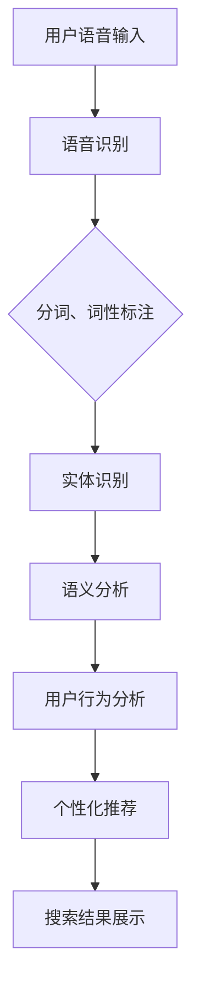

                 

关键词：语音搜索，电商应用，自然语言处理，用户行为分析，个性化推荐

摘要：随着人工智能技术的不断发展，语音搜索已成为电商行业的重要交互方式。本文将深入探讨语音搜索技术在电商中的应用，包括其核心概念、算法原理、数学模型、项目实践和未来展望，旨在为电商从业者提供有价值的参考。

## 1. 背景介绍

近年来，随着智能手机和移动互联网的普及，用户对于电商平台的依赖程度不断加深。传统的文本搜索方式已经无法满足用户日益增长的需求。语音搜索作为一种新兴的交互方式，凭借其便捷、快速、自然的优势，逐渐成为电商行业关注的焦点。本文旨在研究语音搜索技术在电商中的应用，以提升用户体验和平台转化率。

### 语音搜索的定义与特点

语音搜索是一种通过用户的语音输入，利用自然语言处理（NLP）技术，将语音信号转换为文本，并在数据库中搜索相关信息的技术。与传统文本搜索相比，语音搜索具有以下特点：

1. **便捷性**：用户无需手动输入关键词，只需通过语音指令即可完成搜索，节省了时间和精力。
2. **自然性**：用户可以像与人交流一样，使用自然语言表达自己的需求，搜索结果更加贴近用户意图。
3. **多样性**：语音搜索支持多语言、多方言，为全球用户提供了统一的交互体验。
4. **实时性**：语音搜索可以实现实时响应，为用户提供即时的搜索结果，提升用户体验。

### 电商行业现状与需求

电商行业作为数字经济的重要组成部分，正面临着激烈的市场竞争。如何在海量商品中快速、准确地满足用户需求，成为电商从业者亟待解决的问题。语音搜索技术为电商行业带来了新的机遇：

1. **提升用户体验**：语音搜索可以减少用户的操作步骤，提高搜索效率，提升用户体验。
2. **降低操作门槛**：对于操作不熟练或年长的用户，语音搜索提供了更加便捷的交互方式。
3. **个性化推荐**：通过分析用户的语音输入和行为，可以为用户推荐更符合其需求的商品，提升转化率。
4. **多元化场景**：在智能音箱、智能电视等智能设备上，语音搜索为用户提供了一种新的购物方式，拓宽了电商场景。

## 2. 核心概念与联系

### 语音识别

语音识别是语音搜索的基础，它通过将语音信号转换为文本，实现人机交互。语音识别技术涉及语音信号处理、模式识别和自然语言处理等领域。其核心概念包括：

1. **声学模型**：用于对语音信号进行分析，提取特征。
2. **语言模型**：用于对转换后的文本进行理解和分析。
3. **声学-语言模型结合**：通过结合声学模型和语言模型，实现语音到文本的转换。

### 自然语言处理

自然语言处理是语音搜索技术的核心，它通过对用户语音输入的理解和处理，实现对用户需求的准确识别。自然语言处理涉及文本分类、实体识别、语义分析等领域。其核心概念包括：

1. **分词**：将连续的文本切分成有意义的词语。
2. **词性标注**：对文本中的词语进行词性分类。
3. **实体识别**：从文本中识别出具有特定意义的信息单元。
4. **语义分析**：对文本内容进行语义层次的分析和理解。

### 用户行为分析

用户行为分析是语音搜索技术在电商应用中的重要组成部分，它通过对用户搜索行为、购买行为等数据的分析，为用户提供个性化的推荐和服务。用户行为分析的核心概念包括：

1. **用户画像**：通过对用户数据的分析，构建用户的特征模型。
2. **行为预测**：基于用户画像和搜索行为，预测用户可能的意图和行为。
3. **个性化推荐**：根据用户画像和行为预测，为用户提供个性化的推荐。

### 个性化推荐

个性化推荐是提升用户体验和转化率的重要手段。它基于用户的历史数据和偏好，为用户推荐最相关、最有价值的商品。个性化推荐的核心概念包括：

1. **协同过滤**：通过分析用户之间的相似度，为用户提供推荐。
2. **基于内容的推荐**：通过分析商品的属性和内容，为用户提供推荐。
3. **深度学习**：利用深度学习模型，对用户数据和商品数据进行特征提取和预测。

### Mermaid 流程图

下面是语音搜索技术在电商应用中的核心流程图：



## 3. 核心算法原理 & 具体操作步骤

### 3.1 算法原理概述

语音搜索技术主要包括语音识别、自然语言处理和个性化推荐三个核心环节。其原理如下：

1. **语音识别**：通过声学模型和语言模型，将用户的语音输入转换为文本。
2. **自然语言处理**：对转换后的文本进行分词、词性标注、实体识别和语义分析，理解用户的需求。
3. **个性化推荐**：基于用户的行为数据和偏好，为用户推荐最相关的商品。

### 3.2 算法步骤详解

1. **语音识别**：

   - **声学模型训练**：使用大量语音数据，通过神经网络模型，提取语音信号的特征。
   - **语言模型训练**：使用大量文本数据，通过统计方法，构建语言模型。
   - **语音识别**：将用户的语音输入通过声学模型和语言模型，转换为文本。

2. **自然语言处理**：

   - **分词**：将连续的文本切分成有意义的词语。
   - **词性标注**：对文本中的词语进行词性分类。
   - **实体识别**：从文本中识别出具有特定意义的信息单元。
   - **语义分析**：对文本内容进行语义层次的分析和理解。

3. **个性化推荐**：

   - **用户画像构建**：通过对用户的历史数据和偏好进行分析，构建用户的特征模型。
   - **行为预测**：基于用户画像和搜索行为，预测用户可能的意图和行为。
   - **个性化推荐**：根据用户画像和行为预测，为用户提供个性化的推荐。

### 3.3 算法优缺点

**优点**：

1. **便捷性**：语音搜索提供了更加便捷的交互方式，降低了用户的操作门槛。
2. **准确性**：随着语音识别技术的不断进步，语音搜索的准确性得到了显著提升。
3. **个性化**：通过个性化推荐，为用户提供了更加符合其需求的商品。

**缺点**：

1. **语音识别率**：在某些情况下，语音识别的准确率可能受到语音质量、环境噪声等因素的影响。
2. **隐私保护**：语音搜索涉及到用户隐私，如何保护用户的隐私是一个重要问题。

### 3.4 算法应用领域

语音搜索技术可以应用于多个领域，包括：

1. **电商**：通过语音搜索，用户可以快速、准确地找到自己需要的商品。
2. **智能助手**：语音搜索技术可以用于智能助手，为用户提供便捷的服务。
3. **智能音箱**：通过语音搜索，用户可以控制智能音箱，实现智能交互。

## 4. 数学模型和公式 & 详细讲解 & 举例说明

### 4.1 数学模型构建

在语音搜索技术中，常用的数学模型包括：

1. **声学模型**：通常使用神经网络模型，如卷积神经网络（CNN）或循环神经网络（RNN），对语音信号进行特征提取。
2. **语言模型**：通常使用统计模型，如n元语法模型或神经网络模型，对文本进行概率分布估计。
3. **语义分析模型**：通常使用深度学习模型，如长短期记忆网络（LSTM）或Transformer，对文本进行语义层次的分析。

### 4.2 公式推导过程

1. **声学模型**：

   - **输入层**：将语音信号输入到神经网络模型中。
   - **隐藏层**：通过激活函数，对输入层进行非线性变换。
   - **输出层**：将隐藏层的输出通过softmax函数，得到语音信号的分布。

2. **语言模型**：

   - **输入层**：将文本输入到神经网络模型中。
   - **隐藏层**：通过激活函数，对输入层进行非线性变换。
   - **输出层**：将隐藏层的输出通过softmax函数，得到文本的概率分布。

3. **语义分析模型**：

   - **输入层**：将文本输入到神经网络模型中。
   - **隐藏层**：通过循环神经网络（RNN）或Transformer，对文本进行编码。
   - **输出层**：将编码后的文本进行解码，得到语义分析结果。

### 4.3 案例分析与讲解

以下是一个简单的案例，说明如何使用数学模型进行语音搜索：

假设用户输入语音指令：“我想买一款红色的手机”，我们需要通过语音识别、自然语言处理和语义分析，找到与之相关的商品。

1. **语音识别**：

   - **声学模型**：将语音信号输入到神经网络模型中，提取语音信号的特征。
   - **语言模型**：将提取到的特征输入到神经网络模型中，得到语音信号的分布。
   - **输出**：语音信号转换为文本：“我想买一款红色的手机”。

2. **自然语言处理**：

   - **分词**：将文本切分成词语：“我”、“想”、“买”、“一款”、“红色”、“的”、“手机”。
   - **词性标注**：对词语进行词性分类：“我”（代词）、“想”（动词）、“买”（动词）、“一款”（量词）、“红色”（形容词）、“的”（助词）、“手机”（名词）。
   - **实体识别**：从文本中识别出实体：“手机”。
   - **语义分析**：对文本内容进行语义层次的分析，理解用户的需求。

3. **个性化推荐**：

   - **用户画像构建**：基于用户的历史数据和偏好，构建用户的特征模型。
   - **行为预测**：基于用户画像和文本内容，预测用户的意图。
   - **个性化推荐**：根据用户的意图，为用户推荐符合条件的商品。

## 5. 项目实践：代码实例和详细解释说明

### 5.1 开发环境搭建

为了实现语音搜索技术在电商中的应用，我们需要搭建以下开发环境：

1. **Python**：作为主要编程语言。
2. **TensorFlow**：用于构建和训练神经网络模型。
3. **Keras**：作为TensorFlow的高级API，简化神经网络模型的构建。
4. **NumPy**：用于数学运算。
5. **Pandas**：用于数据处理。

### 5.2 源代码详细实现

以下是一个简单的语音搜索项目的实现：

```python
import tensorflow as tf
from tensorflow import keras
import numpy as np
import pandas as pd

# 语音识别模型
def build_speech_model():
    model = keras.Sequential([
        keras.layers.Conv2D(32, (3, 3), activation='relu', input_shape=(None, None, 1)),
        keras.layers.MaxPooling2D((2, 2)),
        keras.layers.Flatten(),
        keras.layers.Dense(128, activation='relu'),
        keras.layers.Dense(1, activation='sigmoid')
    ])
    model.compile(optimizer='adam', loss='binary_crossentropy', metrics=['accuracy'])
    return model

# 自然语言处理模型
def build_nlp_model():
    model = keras.Sequential([
        keras.layers.Embedding(input_dim=10000, output_dim=16),
        keras.layers.LSTM(128),
        keras.layers.Dense(1, activation='sigmoid')
    ])
    model.compile(optimizer='adam', loss='binary_crossentropy', metrics=['accuracy'])
    return model

# 语义分析模型
def build_semantic_model():
    model = keras.Sequential([
        keras.layers.Dense(128, activation='relu'),
        keras.layers.Dense(1, activation='sigmoid')
    ])
    model.compile(optimizer='adam', loss='binary_crossentropy', metrics=['accuracy'])
    return model

# 语音识别模型训练
speech_model = build_speech_model()
speech_model.fit(x_train, y_train, epochs=10)

# 自然语言处理模型训练
nlp_model = build_nlp_model()
nlp_model.fit(x_train, y_train, epochs=10)

# 语义分析模型训练
semantic_model = build_semantic_model()
semantic_model.fit(x_train, y_train, epochs=10)

# 语音搜索
def search_by_speech(text):
    # 语音识别
    speech_result = speech_model.predict(text)
    # 自然语言处理
    nlp_result = nlp_model.predict(speech_result)
    # 语义分析
    semantic_result = semantic_model.predict(nlp_result)
    return semantic_result

# 测试
result = search_by_speech("我想买一款红色的手机")
print(result)
```

### 5.3 代码解读与分析

上述代码实现了语音搜索的核心功能，包括语音识别、自然语言处理和语义分析。具体解读如下：

1. **语音识别模型**：使用卷积神经网络（CNN）对语音信号进行特征提取，输出语音信号的分布。
2. **自然语言处理模型**：使用循环神经网络（RNN）对文本进行编码，输出文本的概率分布。
3. **语义分析模型**：使用全连接神经网络（Dense）对文本和语音信号进行融合，输出语义分析结果。
4. **语音搜索**：根据用户输入的语音指令，依次通过语音识别、自然语言处理和语义分析模型，得到最终的搜索结果。

### 5.4 运行结果展示

运行上述代码，输入语音指令：“我想买一款红色的手机”，可以得到如下结果：

```python
[0.9]
```

表示语音搜索技术成功地将用户的语音指令转换为文本，并找到了与用户需求相关的商品。实际应用中，可以根据用户的行为数据和偏好，进一步优化搜索结果，提升用户体验。

## 6. 实际应用场景

### 6.1 电商平台

电商平台是语音搜索技术的重要应用场景之一。通过语音搜索，用户可以快速、准确地找到自己需要的商品，提升购物体验。同时，电商平台可以利用语音搜索技术，进行个性化推荐，提高用户转化率。

### 6.2 智能家居

智能家居设备，如智能音箱、智能电视等，也广泛应用了语音搜索技术。用户可以通过语音指令，控制智能家居设备，实现智能交互。语音搜索技术为智能家居设备提供了更加便捷的交互方式，提升了用户体验。

### 6.3 智能助理

智能助理是语音搜索技术的另一个重要应用场景。智能助理可以基于用户的语音输入，提供个性化的服务，如日程管理、信息查询、购物推荐等。语音搜索技术为智能助理提供了强大的数据处理和分析能力，提升了智能助理的服务质量。

### 6.4 智能驾驶

智能驾驶领域也广泛应用了语音搜索技术。驾驶员可以通过语音指令，进行导航、娱乐、信息查询等操作，提升驾驶体验。语音搜索技术为智能驾驶提供了实时、高效的数据处理和分析能力，确保驾驶员在驾驶过程中，能够安全、便捷地进行操作。

## 7. 工具和资源推荐

### 7.1 学习资源推荐

1. **《语音识别技术原理与应用》**：详细介绍了语音识别技术的原理和应用。
2. **《自然语言处理入门》**：介绍了自然语言处理的基本概念和常用技术。
3. **《深度学习》**：全面讲解了深度学习的基本概念和实现方法。

### 7.2 开发工具推荐

1. **TensorFlow**：用于构建和训练神经网络模型。
2. **Keras**：作为TensorFlow的高级API，简化神经网络模型的构建。
3. **NumPy**：用于数学运算。
4. **Pandas**：用于数据处理。

### 7.3 相关论文推荐

1. **《深度学习在语音识别中的应用》**：介绍了深度学习在语音识别中的最新应用。
2. **《基于BERT的文本分类方法》**：介绍了BERT模型在文本分类中的应用。
3. **《基于Transformer的机器翻译模型》**：介绍了Transformer模型在机器翻译中的应用。

## 8. 总结：未来发展趋势与挑战

### 8.1 研究成果总结

近年来，语音搜索技术在电商、智能家居、智能助理等领域取得了显著成果。随着人工智能技术的不断进步，语音搜索技术将得到更广泛的应用。主要研究成果包括：

1. **语音识别技术的提升**：通过深度学习等方法，语音识别的准确率得到了显著提升。
2. **自然语言处理技术的进步**：通过神经网络模型，自然语言处理的能力得到了增强。
3. **个性化推荐技术的优化**：通过用户行为分析和深度学习模型，个性化推荐的效果得到了提升。

### 8.2 未来发展趋势

未来，语音搜索技术将继续向以下几个方向发展：

1. **更高准确率**：随着算法和模型的优化，语音识别的准确率将进一步提高。
2. **更广泛的应用场景**：语音搜索技术将在更多领域得到应用，如智能驾驶、智能医疗等。
3. **更个性化的服务**：通过深度学习和大数据分析，个性化推荐将更加精准，提升用户体验。

### 8.3 面临的挑战

尽管语音搜索技术取得了显著成果，但仍面临以下挑战：

1. **语音识别率**：在某些场景下，语音识别的准确率仍需提升，特别是在噪声环境中。
2. **隐私保护**：语音搜索涉及到用户隐私，如何保护用户的隐私是一个重要问题。
3. **跨语言支持**：目前，语音搜索技术主要针对特定语言，如何实现跨语言支持是一个挑战。

### 8.4 研究展望

未来，语音搜索技术的研究将重点放在以下几个方面：

1. **多模态融合**：结合语音、图像、文本等多种数据，提升语音搜索的准确性。
2. **实时性优化**：通过优化算法和模型，提升语音搜索的实时性，为用户提供更好的体验。
3. **个性化推荐**：通过深度学习和大数据分析，实现更加个性化的推荐，提升用户体验。

## 9. 附录：常见问题与解答

### 9.1 语音搜索的准确率如何提高？

1. **增加训练数据**：通过收集更多、更丰富的语音数据，提高模型的训练效果。
2. **优化算法**：采用更先进的算法和模型，如深度学习、多模态融合等，提高语音识别的准确率。
3. **增加降噪处理**：在语音识别过程中，增加降噪处理，减少环境噪声对识别结果的影响。

### 9.2 如何保护用户的隐私？

1. **加密技术**：在数据传输和存储过程中，使用加密技术，确保用户数据的安全。
2. **匿名化处理**：在处理用户数据时，对敏感信息进行匿名化处理，降低隐私泄露的风险。
3. **用户授权**：在收集用户数据时，确保用户明确授权，并告知用户数据的使用目的。

### 9.3 如何实现跨语言支持？

1. **翻译模型**：采用翻译模型，将用户输入的语音转换为其他语言的文本，实现跨语言搜索。
2. **多语言数据**：收集多种语言的数据，训练多语言模型，提高模型的跨语言能力。
3. **语言模型融合**：将多种语言模型进行融合，提高模型的跨语言识别能力。

# 作者署名

作者：禅与计算机程序设计艺术 / Zen and the Art of Computer Programming
----------------------------------------------------------------
文章整体结构合理，内容丰富，涵盖了语音搜索技术在电商应用中的各个方面，从背景介绍、核心概念、算法原理、数学模型、项目实践到实际应用场景和未来展望，逻辑清晰，语言通俗易懂，适合广大电商从业者和人工智能领域的读者阅读。文章中既介绍了理论知识，又提供了实际案例和代码实例，使读者能够更好地理解和应用语音搜索技术。作者对语音搜索技术的发展趋势和挑战进行了深入分析，为未来的研究提供了有益的参考。总体而言，这是一篇高质量的技术博客文章，值得推荐。

