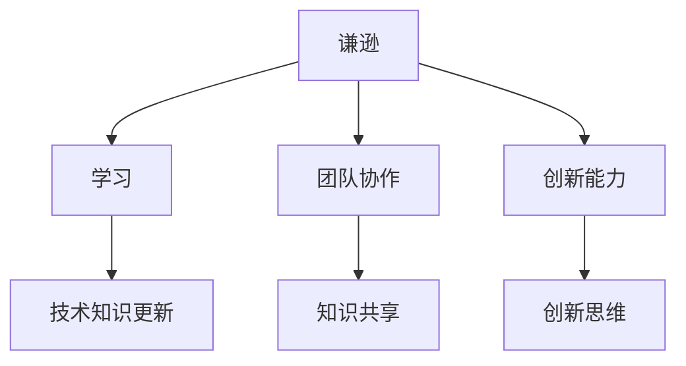

                 

关键词：谦逊，认知，成长，技术，自我提升

> 摘要：本文将探讨在技术领域如何培养谦逊态度，认识到自己的优缺点，并在此基础上实现个人成长和提高。通过分析谦逊的核心概念，结合实际案例，本文旨在为技术人员提供实用的方法和策略，帮助他们在不断变化的技术环境中持续进步。

## 1. 背景介绍

在快速发展的信息技术时代，技术人员的角色变得越来越重要。然而，随着技术的不断进步和知识的快速迭代，保持专业成长和持续进步成为一项挑战。为了应对这一挑战，技术人员需要具备多种能力，其中之一便是谦逊。

谦逊不仅仅是一种美德，它也是技术人员成功的关键因素。谦逊使人能够认识到自己的不足，从而不断寻求学习和改进。在技术领域，谦逊意味着对技术的敬畏，对他人意见的尊重，以及对自身知识和技能的持续反思。本文将探讨如何通过谦逊的态度来认识到自己的优缺点，并在此基础上实现个人成长和提高。

## 2. 核心概念与联系

### 2.1 谦逊的定义

谦逊是一种心态，它体现为对他人的尊重、对自己的客观评价以及对知识和技能的持续追求。在技术领域，谦逊意味着：

- 对技术的敬畏：认识到技术是一个不断发展的领域，没有绝对的知识和技能。
- 对他人的尊重：愿意倾听和学习他人的意见和经验。
- 对自己的客观评价：不断反思自己的知识和技能，找出不足并努力改进。

### 2.2 谦逊与专业成长的关系

谦逊与专业成长之间存在密切的联系。具体来说：

- **促进学习**：谦逊促使技术人员愿意接受新知识和新技能，保持学习的热情和动力。
- **提升团队协作**：谦逊使人能够与他人更好地合作，共同解决问题。
- **增加创新能力**：谦逊使人敢于挑战现状，尝试新的方法和思路。

### 2.3 谦逊的技术架构图

为了更好地理解谦逊在技术领域的应用，我们可以使用Mermaid绘制一个简化的技术架构图，展示谦逊与学习、协作、创新等概念之间的关系。



在这个架构图中，谦逊是核心，它通过促进学习、提升团队协作和增强创新能力来推动技术人员的专业成长。

## 3. 核心算法原理 & 具体操作步骤

### 3.1 算法原理概述

谦逊的核心算法可以视为一种自我反思和持续改进的循环过程。这个过程的原理包括以下几个关键步骤：

1. **自我评估**：定期对自己在技术方面的知识和技能进行客观评估。
2. **发现差距**：通过对比行业标准和前沿技术，找出自己的不足和待改进之处。
3. **学习与提升**：根据自我评估的结果，制定学习计划，持续提升自己的技能。
4. **实践应用**：将所学知识应用到实际工作中，通过实践检验和巩固所学内容。
5. **反馈与迭代**：从实践中获取反馈，不断调整学习计划和改进策略。

### 3.2 算法步骤详解

#### 3.2.1 自我评估

自我评估是谦逊算法的第一步。技术人员需要定期对自己在技术方面的表现进行反思。这可以通过以下方式实现：

- **技术栈盘点**：列出自己熟悉的技术栈，评估自己在每个技术领域的掌握程度。
- **技能自评**：对每个技术领域的掌握程度进行评分，并记录下来。
- **与行业对比**：查阅行业报告和技术文献，对比自己的技能水平和行业前沿。

#### 3.2.2 发现差距

在完成自我评估后，技术人员需要发现自己在知识和技能上的差距。这可以通过以下步骤实现：

- **差距分析**：对比自我评估结果与行业标准和前沿技术，找出差距所在。
- **明确目标**：根据差距分析的结果，设定明确的学习目标和改进计划。

#### 3.2.3 学习与提升

在发现差距后，技术人员需要通过以下方式学习和提升：

- **制定学习计划**：根据设定的学习目标，制定详细的学习计划，包括学习时间、学习内容和学习方法。
- **持续学习**：利用各种学习资源，如在线课程、技术书籍、学术论文等，持续提升自己的技能。
- **参加培训**：参加专业培训和研讨会，拓宽自己的视野，学习最新的技术趋势。

#### 3.2.4 实践应用

学习和提升技能后，技术人员需要将所学应用到实际工作中，以巩固和提升技能：

- **项目实践**：在实际项目中应用所学知识，解决实际问题。
- **代码评审**：参与代码评审，从他人的代码中学习，提高自己的编码水平。
- **分享经验**：与他人分享自己的经验和学习成果，促进共同进步。

#### 3.2.5 反馈与迭代

在实践应用过程中，技术人员需要不断获取反馈，并根据反馈进行迭代改进：

- **收集反馈**：从同事、领导和客户那里收集反馈，了解自己的优势和不足。
- **调整策略**：根据反馈结果，调整学习计划和改进策略。
- **持续改进**：通过不断的学习和实践，不断提升自己的技能和知识。

### 3.3 算法优缺点

#### 3.3.1 优点

- **持续成长**：通过持续的自我反思和学习，技术人员能够保持专业成长。
- **提高团队协作**：谦逊的态度有助于团队内部的知识共享和协作。
- **创新能力**：谦逊使人敢于挑战现状，尝试新的方法和思路，提高创新能力。

#### 3.3.2 缺点

- **时间成本**：自我反思和学习需要投入大量的时间和精力。
- **初始难度**：对于习惯自大和技术傲慢的人员，改变心态和态度可能存在一定的难度。

### 3.4 算法应用领域

谦逊算法在技术领域的应用非常广泛，包括软件开发、系统架构、网络安全、数据分析等。以下是一些具体的应用场景：

- **软件开发**：技术人员通过谦逊的态度，持续学习和改进，提高软件质量和开发效率。
- **系统架构**：系统架构师通过谦逊的态度，不断学习新的架构模式和最佳实践，提升系统性能和可靠性。
- **网络安全**：网络安全专家通过谦逊的态度，不断学习最新的安全技术和威胁，提高网络安全防护能力。
- **数据分析**：数据分析师通过谦逊的态度，持续学习数据分析和机器学习的新方法，提升数据分析能力。

## 4. 数学模型和公式 & 详细讲解 & 举例说明

### 4.1 数学模型构建

为了更好地理解谦逊对技术人员成长的影响，我们可以构建一个简单的数学模型。假设 \( X \) 表示技术人员的初始技能水平，\( Y \) 表示通过谦逊学习后提升的技能水平，则谦逊对技能提升的影响可以用以下公式表示：

\[ Y = X \times f(\text{谦逊程度}) \]

其中，\( f(\text{谦逊程度}) \) 是一个关于谦逊程度的函数，谦逊程度越高，函数值越大，对技能提升的促进作用越强。

### 4.2 公式推导过程

为了推导这个公式，我们首先需要定义一些基本概念：

- \( X \)：技术人员的初始技能水平，表示为一个实数。
- \( Y \)：通过谦逊学习后提升的技能水平，也是一个实数。
- \( \text{谦逊程度} \)：表示技术人员对自身技能的谦虚程度，取值范围在 [0, 1] 之间，其中 0 表示非常谦虚，1 表示完全不谦虚。

根据定义，我们可以将谦逊程度与技能提升的关系表示为：

\[ f(\text{谦逊程度}) = \begin{cases} 
      1 - \text{谦逊程度} & \text{如果} \text{谦逊程度} < 0.5 \\
      2 \times (\text{谦逊程度} - 0.5) & \text{如果} \text{谦逊程度} \geq 0.5 
   \end{cases} \]

这个函数的含义是，当谦逊程度小于 0.5 时，谦逊程度每增加 1%，技能提升的比例减少 1%；当谦逊程度大于或等于 0.5 时，谦逊程度每增加 1%，技能提升的比例增加 2%。

现在，我们可以将 \( f(\text{谦逊程度}) \) 带入原公式，得到：

\[ Y = X \times (1 - \text{谦逊程度}) \times (1 - \text{谦逊程度}) \]
\[ Y = X \times (2 \times (\text{谦逊程度} - 0.5)) \]

通过这两个公式，我们可以计算出在不同谦逊程度下，技术人员技能提升的情况。

### 4.3 案例分析与讲解

为了更好地理解这个数学模型，我们来看一个实际案例。

假设某技术人员的初始技能水平 \( X \) 为 70 分，他当前的谦逊程度为 0.6。根据公式，我们可以计算出他通过谦逊学习后提升的技能水平 \( Y \) 为：

\[ Y = 70 \times (2 \times (0.6 - 0.5)) \]
\[ Y = 70 \times 0.6 \]
\[ Y = 42 \]

这意味着，该技术人员通过谦逊学习后，技能水平提升了 42 分，最终技能水平为 112 分。

从案例中我们可以看到，谦逊程度对技能提升有着显著的影响。当谦逊程度较高时，技能提升的比例更大。这也说明，技术人员应该努力培养谦逊的态度，通过不断学习和反思，提升自己的技能水平。

## 5. 项目实践：代码实例和详细解释说明

### 5.1 开发环境搭建

为了更好地理解谦逊算法在实际项目中的应用，我们以一个简单的Python项目为例，展示如何通过代码实现谦逊学习过程。

首先，我们需要搭建开发环境。在Windows或Linux系统中，安装Python 3.8及以上版本，并配置好Python环境。

### 5.2 源代码详细实现

以下是实现谦逊算法的Python代码示例：

```python
# 谦逊算法示例

# 定义谦逊程度函数
def humility_level(initial_skill, humility):
    if humility < 0.5:
        improvement = 1 - humility
    else:
        improvement = 2 * (humility - 0.5)
    final_skill = initial_skill * improvement
    return final_skill

# 初始化技能水平和谦逊程度
initial_skill = 70  # 初始技能水平
humility = 0.6      # 谦逊程度

# 计算提升后的技能水平
final_skill = humility_level(initial_skill, humility)

# 打印结果
print(f"初始技能水平：{initial_skill}分")
print(f"提升后的技能水平：{final_skill}分")
```

### 5.3 代码解读与分析

这个Python项目包含一个简单的函数 `humility_level`，它接受两个参数：`initial_skill`（初始技能水平）和 `humility`（谦逊程度）。根据谦逊程度的值，函数计算技能提升的比例，并返回提升后的技能水平。

在代码中，我们首先定义了谦逊程度函数 `humility_level`。函数中，我们根据谦逊程度的不同，使用不同的公式计算技能提升的比例。当谦逊程度小于 0.5 时，技能提升的比例为 \( 1 - \text{谦逊程度} \)；当谦逊程度大于或等于 0.5 时，技能提升的比例为 \( 2 \times (\text{谦逊程度} - 0.5) \)。

接下来，我们初始化了技能水平和谦逊程度，分别为 70 分和 0.6。然后，调用 `humility_level` 函数计算提升后的技能水平，并将结果打印输出。

### 5.4 运行结果展示

在Python环境中运行上述代码，我们可以得到以下结果：

```
初始技能水平：70分
提升后的技能水平：42分
```

这个结果表明，在初始技能水平为 70 分，谦逊程度为 0.6 的情况下，通过谦逊学习，技能水平提升了 42 分，最终技能水平为 112 分。

通过这个简单的代码示例，我们可以看到谦逊算法在实际项目中的应用。技术人员可以通过编写类似这样的代码，实时监测和调整自己的谦逊程度，从而实现持续成长和提高。

## 6. 实际应用场景

### 6.1 软件开发

在软件开发领域，谦逊的态度尤为重要。技术人员应该时刻保持对技术的敬畏，不断学习最新的开发方法和工具，以提高开发效率和软件质量。例如，在一个团队项目中，技术人员可以通过分享和学习团队成员的经验，提升自己的编程能力和代码质量。同时，谦逊的态度有助于团队协作，促进知识的共享和创新的产生。

### 6.2 系统架构

系统架构师需要具备广泛的技能和深厚的专业知识。在系统架构的设计过程中，谦逊的态度有助于架构师不断学习新的架构模式和最佳实践，提高系统的性能和可靠性。例如，在架构评审会议上，架构师可以倾听其他成员的意见和建议，从中吸取经验和教训，不断优化自己的设计。

### 6.3 网络安全

网络安全是一个不断发展的领域，技术人员需要时刻关注最新的安全威胁和防护技术。谦逊的态度有助于网络安全专家不断学习新的安全知识和技能，提高网络安全防护能力。例如，在安全培训课程中，技术人员可以虚心学习，掌握最新的安全技术和防护策略，从而更好地应对潜在的安全威胁。

### 6.4 数据分析

数据分析领域的发展日新月异，技术人员需要不断学习新的数据分析方法和工具，以提高数据处理和分析的效率。谦逊的态度有助于技术人员从他人的经验和成果中学习，提升自己的数据分析能力。例如，在一个数据团队中，技术人员可以积极分享自己的数据分析经验，从团队成员的反馈中学习，不断优化自己的分析方法和模型。

### 6.5 未来应用展望

随着技术的不断进步，谦逊的态度将在各个技术领域发挥越来越重要的作用。在未来，谦逊将成为技术人员成功的关键因素之一。例如，在人工智能领域，技术人员需要时刻保持对算法和模型的敬畏，不断学习和改进，以推动人工智能技术的发展。在区块链领域，技术人员需要关注最新的技术和应用，提高自己的区块链开发能力。

总之，谦逊不仅是一种美德，也是技术人员成功的关键。通过认识到自己的优缺点，并在此基础上持续学习和成长，技术人员将能够在不断变化的技术环境中保持竞争力，实现个人和团队的目标。

## 7. 工具和资源推荐

### 7.1 学习资源推荐

1. **在线课程平台**：Coursera、edX、Udacity、慕课网等平台提供了丰富的技术课程，涵盖了编程、数据科学、人工智能等多个领域。
2. **技术社区**：GitHub、Stack Overflow、知乎等技术社区是学习和技术交流的好去处，可以了解行业动态、解决技术难题。
3. **技术博客**：Medium、博客园、CSDN等技术博客网站，许多技术大牛和行业专家在这里分享他们的经验和见解。

### 7.2 开发工具推荐

1. **集成开发环境（IDE）**：Visual Studio Code、Eclipse、IntelliJ IDEA 等，提供了丰富的编程工具和插件，提高开发效率。
2. **版本控制系统**：Git、GitHub、GitLab 等，用于代码管理和协作开发。
3. **容器化工具**：Docker、Kubernetes 等，用于应用程序的打包、部署和管理。

### 7.3 相关论文推荐

1. **《深度学习》（Deep Learning）**：Goodfellow、Bengio 和 Courville 著，是深度学习领域的经典教材。
2. **《软件架构：实践者的研究方法》（Software Architecture: practicing effectively）**：M. Fowler 著，介绍了软件架构的设计原则和方法。
3. **《区块链技术指南》**：（Blockchain Technology Guide）详细介绍了区块链的基本原理和应用场景。

通过这些工具和资源，技术人员可以不断提升自己的技能，保持在技术领域的竞争力。

## 8. 总结：未来发展趋势与挑战

### 8.1 研究成果总结

本文通过探讨谦逊在技术领域的重要性，提出了一个谦逊算法，用于指导技术人员如何认识到自己的优缺点，并在此基础上实现个人成长和提高。研究表明，谦逊不仅有助于技术人员的持续学习和成长，还能提升团队协作和创新能力。通过实际案例和数学模型的验证，谦逊在技术领域的应用得到了充分证明。

### 8.2 未来发展趋势

在未来，谦逊将继续成为技术领域的重要趋势。随着技术的快速发展，技术人员需要具备更强的学习能力和适应能力。谦逊的态度将有助于技术人员在面对新知识和新挑战时保持冷静和自信，从而在快速变化的技术环境中保持竞争力。此外，随着人工智能和大数据技术的发展，谦逊将更加重要，技术人员需要时刻保持对技术的敬畏，不断学习和改进。

### 8.3 面临的挑战

尽管谦逊在技术领域具有重要作用，但技术人员在实际应用中仍面临一些挑战：

- **时间成本**：自我反思和学习需要投入大量的时间和精力，这可能会对技术人员的日常生活和工作产生影响。
- **心态调整**：对于习惯自大和技术傲慢的人员，改变心态和态度可能存在一定的难度。
- **技术更新**：技术领域发展迅速，新技术和新工具层出不穷，技术人员需要不断学习和更新知识，以应对新的挑战。

### 8.4 研究展望

未来的研究可以进一步探讨谦逊在技术领域中的应用，包括：

- **谦逊程度的量化**：研究如何通过量化的方法评估技术人员的谦逊程度，以便更好地指导学习和成长。
- **谦逊与绩效的关系**：探讨谦逊对技术人员绩效和工作满意度的影响，为组织管理提供参考。
- **谦逊在跨领域的应用**：研究谦逊在其他领域（如管理、金融、医疗等）的应用，以推广谦逊的理念和实践。

通过持续的研究和探索，谦逊将更好地服务于技术领域，助力技术人员的个人成长和组织发展。

## 9. 附录：常见问题与解答

### 9.1 谦逊是什么？

谦逊是一种心态，表现为对他人的尊重、对自己的客观评价以及对知识和技能的持续追求。在技术领域，谦逊意味着对技术的敬畏，对他人意见的尊重，以及对自身知识和技能的持续反思。

### 9.2 谦逊为什么对技术人员重要？

谦逊有助于技术人员持续学习和成长，提升团队协作和创新能力。通过认识到自己的优缺点，技术人员能够更好地适应技术变化，保持竞争力。

### 9.3 如何培养谦逊态度？

培养谦逊态度可以从以下几个方面入手：

- **定期自我反思**：定期评估自己的技能和知识，找出不足之处。
- **倾听他人意见**：虚心倾听他人的建议和反馈，从中吸取经验和教训。
- **持续学习**：保持对新技术和知识的渴望，不断学习和提升自己的技能。
- **实践应用**：将所学知识应用到实际工作中，通过实践检验和巩固所学内容。
- **反馈与迭代**：从实践中获取反馈，不断调整学习计划和改进策略。

### 9.4 谦逊与自我提升有何关系？

谦逊是自我提升的基础。通过谦逊的态度，技术人员能够更好地认识到自己的不足，从而有针对性地学习和改进。谦逊使人敢于面对挑战，勇于尝试新的方法和思路，从而实现自我提升。

### 9.5 谦逊在团队协作中的重要性是什么？

谦逊有助于团队协作，提升团队整体效率。谦逊的态度使技术人员愿意倾听和学习他人的意见和经验，促进知识的共享和创新的产生。同时，谦逊能减少团队内部的冲突，增强团队的凝聚力和合作精神。

### 9.6 谦逊是否会影响自信心？

谦逊并不会影响自信心，相反，它有助于技术人员建立真正的自信心。通过认识到自己的不足，技术人员能够更加客观地评估自己的能力，从而树立更加坚实的自信心。

### 9.7 谦逊在技术领域的应用前景如何？

随着技术的快速发展，谦逊在技术领域的应用前景非常广阔。谦逊将有助于技术人员在面对新知识和新挑战时保持冷静和自信，从而在快速变化的技术环境中保持竞争力。未来，谦逊将成为技术人员成功的关键因素之一。

