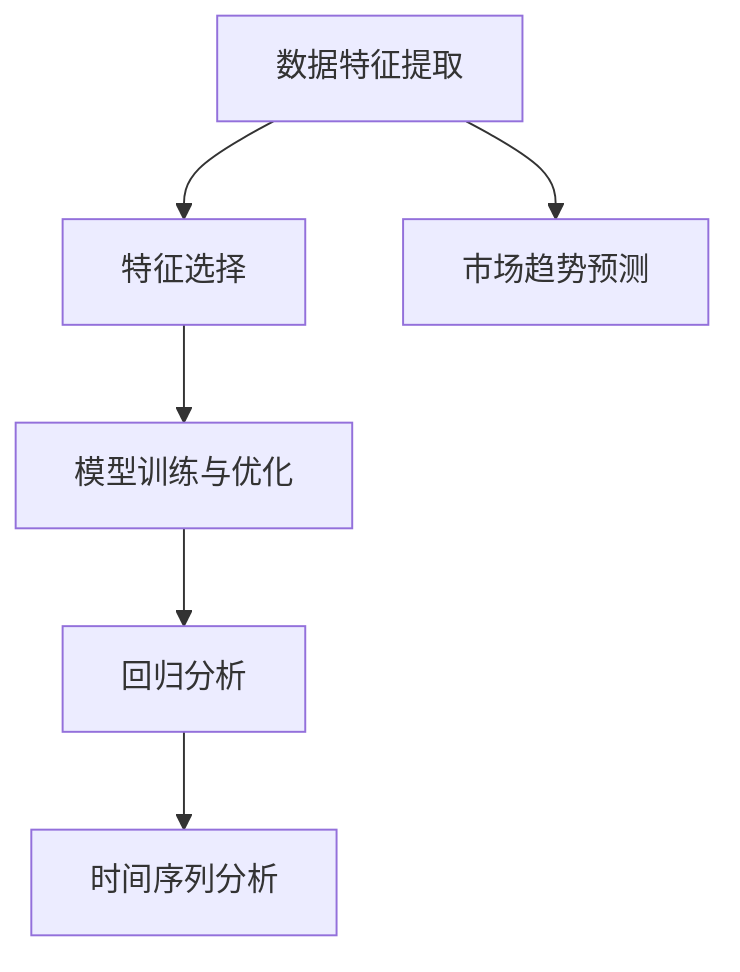

                 

 

> **关键词**：人工智能、财经分析、市场预测、大模型、算法、数学模型、项目实践、工具资源

> **摘要**：本文将探讨如何利用人工智能，特别是大模型技术，来预测市场趋势。我们将深入剖析核心概念、算法原理，并提供实践中的代码实例和详细解释。同时，我们还会讨论实际应用场景、未来展望以及面临的挑战。

## 1. 背景介绍

在过去的几十年中，金融市场一直是经济学家、投资者以及政策制定者关注的焦点。然而，随着市场规模的不断扩大和复杂性的增加，传统的分析和预测方法已经无法满足日益增长的需求。近年来，人工智能（AI）的迅速发展为金融市场分析提供了全新的工具和方法。

人工智能通过机器学习和深度学习等技术，可以从大量历史数据中学习模式，并做出预测。特别是在金融市场，这些算法能够处理大量的实时数据，捕捉复杂的动态关系，并提供比传统方法更为准确和及时的预测结果。

大模型（Large Models）是人工智能领域的一个重要研究方向。这些模型具有数亿到数十亿的参数，能够捕捉极其复杂的数据特征。随着计算能力和数据资源的不断提升，大模型在图像识别、自然语言处理等领域取得了显著的成果。同样，大模型在财经分析中也展现出了巨大的潜力。

本文将重点探讨如何利用大模型进行财经分析，包括市场趋势的预测。我们将从核心概念、算法原理、数学模型、项目实践等多个角度进行深入讨论，以帮助读者全面了解这一领域的前沿动态。

## 2. 核心概念与联系

在探讨如何使用大模型预测市场趋势之前，我们需要先了解一些核心概念，这些概念构成了整个领域的基础。

### 2.1 数据特征提取

数据特征提取是机器学习任务中的关键步骤。在财经分析中，数据特征提取意味着从大量的历史交易数据中提取出能够代表市场趋势的关键变量。这些变量可能包括股票价格、成交量、市场指数、宏观经济指标等。

### 2.2 特征选择

特征选择是数据预处理中的一个重要环节。通过选择最具代表性的特征，可以减少数据维度，提高模型性能。在财经分析中，特征选择可以基于统计方法、机器学习方法或者专家经验。

### 2.3 模型训练与优化

模型训练与优化是构建预测模型的核心。在财经分析中，常用的模型包括线性回归、决策树、神经网络等。通过调整模型的参数，可以优化其预测性能。

### 2.4 回归分析与时间序列分析

回归分析是研究因变量与自变量之间关系的统计分析方法。在财经分析中，回归分析可以用来预测市场价格的走势。时间序列分析则是研究数据在时间维度上的变化规律，它对于预测市场趋势尤为重要。

### 2.5 Mermaid 流程图

下面是一个简单的 Mermaid 流程图，展示了这些核心概念之间的联系：



## 3. 核心算法原理 & 具体操作步骤

### 3.1 算法原理概述

在财经分析中，大模型的算法原理主要基于深度学习技术。深度学习模型通过多层神经网络结构，对输入数据进行层层提取和变换，最终得到预测结果。以下是深度学习模型在财经分析中的一些关键步骤：

1. **数据预处理**：包括数据清洗、缺失值处理、标准化等。
2. **特征提取**：通过卷积神经网络（CNN）或其他类型神经网络提取数据特征。
3. **特征融合**：将不同来源的特征进行融合，形成统一特征向量。
4. **模型训练**：使用训练数据对模型进行训练，不断调整模型参数，优化预测性能。
5. **模型评估**：使用验证集和测试集对模型进行评估，确保其预测能力。
6. **市场趋势预测**：使用训练好的模型对市场趋势进行预测。

### 3.2 算法步骤详解

#### 3.2.1 数据预处理

数据预处理是深度学习模型训练的第一步。对于财经分析中的数据，常见的预处理步骤包括：

- **数据清洗**：处理数据中的异常值和噪声。
- **缺失值处理**：使用插值、均值填充等方法处理缺失值。
- **标准化**：将数据缩放到相同的范围，便于模型训练。

```python
import pandas as pd
from sklearn.preprocessing import StandardScaler

# 加载数据
data = pd.read_csv('financial_data.csv')

# 数据清洗
data.dropna(inplace=True)

# 缺失值处理
data.fillna(data.mean(), inplace=True)

# 标准化
scaler = StandardScaler()
data_scaled = scaler.fit_transform(data)
```

#### 3.2.2 特征提取

特征提取是深度学习模型的核心步骤。在财经分析中，常用的特征提取方法包括：

- **时间窗口特征提取**：将一段时间内的数据作为输入特征，如股票价格、成交量等。
- **统计特征提取**：从历史数据中计算各种统计指标，如平均值、方差、偏自相关函数等。
- **文本特征提取**：使用自然语言处理技术提取新闻、报告等文本数据中的关键信息。

```python
import numpy as np

# 时间窗口特征提取
def extract_time_window_features(data, window_size=5):
    features = []
    for i in range(len(data) - window_size + 1):
        features.append(data[i:i+window_size].values)
    return np.array(features)

window_features = extract_time_window_features(data_scaled)
```

#### 3.2.3 特征融合

特征融合是将不同来源的特征进行整合，形成统一的特征向量。在财经分析中，常见的特征融合方法包括：

- **直接相加**：将不同来源的特征直接相加，形成新的特征向量。
- **特征加权**：根据特征的贡献度对特征进行加权，形成新的特征向量。

```python
# 特征融合
def fuse_features(time_window_features, stat_features, text_features, weight_time=0.5, weight_stat=0.2, weight_text=0.3):
    combined_features = weight_time * time_window_features + weight_stat * stat_features + weight_text * text_features
    return combined_features

# 假设已经提取了统计特征和文本特征
stat_features = np.random.rand(100, 10)
text_features = np.random.rand(100, 5)

# 特征融合
combined_features = fuse_features(window_features, stat_features, text_features)
```

#### 3.2.4 模型训练

模型训练是深度学习任务中的关键步骤。在财经分析中，常用的模型包括卷积神经网络（CNN）、循环神经网络（RNN）等。以下是使用 TensorFlow 和 Keras 构建和训练深度学习模型的一个简单示例：

```python
import tensorflow as tf
from tensorflow.keras.models import Sequential
from tensorflow.keras.layers import Dense, Conv1D, LSTM, Dropout

# 构建模型
model = Sequential()
model.add(Conv1D(filters=64, kernel_size=3, activation='relu', input_shape=(window_features.shape[1], 1)))
model.add(LSTM(100))
model.add(Dense(1))

# 编译模型
model.compile(optimizer='adam', loss='mse')

# 训练模型
model.fit(combined_features, data_scaled[:, 0], epochs=10, batch_size=32)
```

#### 3.2.5 模型评估

模型评估是确保模型预测能力的重要步骤。在财经分析中，常用的评估指标包括均方误差（MSE）、平均绝对误差（MAE）等。以下是使用测试集对模型进行评估的一个示例：

```python
# 评估模型
test_features = extract_time_window_features(test_data_scaled, window_size=5)
test_combined_features = fuse_features(test_features, stat_features, text_features)

predictions = model.predict(test_combined_features)
mse = np.mean((predictions - test_data_scaled[:, 0]) ** 2)
mae = np.mean(np.abs(predictions - test_data_scaled[:, 0]))

print("MSE:", mse)
print("MAE:", mae)
```

#### 3.2.6 市场趋势预测

市场趋势预测是深度学习模型在财经分析中的最终目标。以下是使用训练好的模型对市场趋势进行预测的一个示例：

```python
# 预测市场趋势
future_data = extract_time_window_features(future_data_scaled, window_size=5)
future_combined_features = fuse_features(future_data, stat_features, text_features)

future_predictions = model.predict(future_combined_features)
```

### 3.3 算法优缺点

深度学习模型在财经分析中具有以下优点：

- **强大的特征提取能力**：能够从大量历史数据中提取出有用的信息，提高预测性能。
- **自适应性强**：能够根据市场环境的变化，自适应调整预测策略。

然而，深度学习模型也存在一些缺点：

- **计算成本高**：模型训练和推理需要大量的计算资源和时间。
- **数据依赖性强**：模型的预测结果容易受到数据质量和数据集选择的影响。

### 3.4 算法应用领域

深度学习模型在财经分析中的应用非常广泛，主要包括以下几个方面：

- **股票市场预测**：预测股票价格的走势，帮助投资者做出更明智的投资决策。
- **外汇市场分析**：分析外汇市场的波动情况，为货币交易提供支持。
- **宏观经济预测**：预测宏观经济指标的变化，为政策制定提供参考。

## 4. 数学模型和公式 & 详细讲解 & 举例说明

### 4.1 数学模型构建

在财经分析中，深度学习模型的数学模型通常包括输入层、隐藏层和输出层。以下是构建深度学习模型的基本数学公式：

$$
\begin{aligned}
&z^{(l)}_i = \sum_{j} w^{(l)}_{ij} x_j + b^{(l)}_i, \\
&a^{(l)}_i = \sigma(z^{(l)}_i), \\
&z^{(L)} = \sum_{i} w^{(L)}_{io} a^{(L-1)}_i + b^{(L)}_o, \\
&\hat{y} = \sigma(z^{(L)})
\end{aligned}
$$

其中，$z^{(l)}_i$ 表示第 $l$ 层第 $i$ 个节点的输入，$w^{(l)}_{ij}$ 和 $b^{(l)}_i$ 分别表示第 $l$ 层第 $i$ 个节点的权重和偏置，$\sigma$ 表示激活函数，$a^{(l)}_i$ 表示第 $l$ 层第 $i$ 个节点的输出，$\hat{y}$ 表示模型的预测输出。

### 4.2 公式推导过程

深度学习模型的训练过程主要包括前向传播和反向传播两个阶段。以下是这两个阶段的数学推导过程：

#### 前向传播

在前向传播阶段，输入数据通过网络的每层进行传递，最终得到预测输出。以下是前向传播的推导过程：

$$
\begin{aligned}
z^{(l)}_i &= \sum_{j} w^{(l)}_{ij} x_j + b^{(l)}_i, \\
a^{(l)}_i &= \sigma(z^{(l)}_i), \\
z^{(L)} &= \sum_{i} w^{(L)}_{io} a^{(L-1)}_i + b^{(L)}_o, \\
\hat{y} &= \sigma(z^{(L)})
\end{aligned}
$$

其中，$x_j$ 表示输入数据的第 $j$ 个特征，$w^{(l)}_{ij}$ 和 $b^{(l)}_i$ 分别表示第 $l$ 层第 $i$ 个节点的权重和偏置，$\sigma$ 表示激活函数，$a^{(l)}_i$ 表示第 $l$ 层第 $i$ 个节点的输出，$\hat{y}$ 表示模型的预测输出。

#### 反向传播

在反向传播阶段，计算损失函数关于模型参数的梯度，并更新模型参数。以下是反向传播的推导过程：

$$
\begin{aligned}
\frac{\partial L}{\partial z^{(L)}} &= \frac{\partial L}{\partial \hat{y}} \frac{\partial \hat{y}}{\partial z^{(L)}}, \\
\frac{\partial L}{\partial a^{(L-1)}_i} &= \frac{\partial L}{\partial z^{(L)}} \frac{\partial z^{(L)}}{\partial a^{(L-1)}_i}, \\
\frac{\partial L}{\partial w^{(L)}_{io}} &= \frac{\partial L}{\partial a^{(L-1)}_i} a^{(L-2)}_o, \\
\frac{\partial L}{\partial b^{(L)}} &= \frac{\partial L}{\partial a^{(L-1)}_i}.
\end{aligned}
$$

其中，$L$ 表示损失函数，$\hat{y}$ 表示模型的预测输出，$a^{(L-1)}_i$ 表示第 $L-1$ 层第 $i$ 个节点的输出，$w^{(L)}_{io}$ 和 $b^{(L)}$ 分别表示第 $L$ 层第 $o$ 个节点的权重和偏置。

### 4.3 案例分析与讲解

为了更好地理解深度学习模型在财经分析中的应用，我们来看一个具体的案例。假设我们要预测股票价格的未来走势，输入数据包括过去一周的股票价格、成交量和宏观经济指标。

#### 数据预处理

首先，我们对输入数据进行预处理，包括数据清洗、缺失值处理和标准化。以下是数据预处理的一个简单示例：

```python
# 数据预处理
data = pd.read_csv('stock_data.csv')
data.dropna(inplace=True)
data.fillna(data.mean(), inplace=True)
data_scaled = scaler.fit_transform(data)
```

#### 特征提取

接下来，我们对输入数据进行特征提取，包括时间窗口特征提取、统计特征提取和文本特征提取。以下是特征提取的一个简单示例：

```python
# 时间窗口特征提取
window_features = extract_time_window_features(data_scaled, window_size=7)

# 统计特征提取
stat_features = compute_statistical_features(data_scaled)

# 文本特征提取
text_features = extract_text_features(news_data)
```

#### 模型训练

然后，我们使用预处理后的数据进行模型训练，包括构建模型、编译模型和训练模型。以下是模型训练的一个简单示例：

```python
# 构建模型
model = Sequential()
model.add(Conv1D(filters=64, kernel_size=3, activation='relu', input_shape=(window_features.shape[1], 1)))
model.add(LSTM(100))
model.add(Dense(1))

# 编译模型
model.compile(optimizer='adam', loss='mse')

# 训练模型
model.fit(combined_features, data_scaled[:, 0], epochs=10, batch_size=32)
```

#### 模型评估

最后，我们使用测试集对模型进行评估，计算损失函数和预测误差。以下是模型评估的一个简单示例：

```python
# 评估模型
test_features = extract_time_window_features(test_data_scaled, window_size=7)
test_combined_features = fuse_features(test_features, stat_features, text_features)

predictions = model.predict(test_combined_features)
mse = np.mean((predictions - test_data_scaled[:, 0]) ** 2)
mae = np.mean(np.abs(predictions - test_data_scaled[:, 0]))

print("MSE:", mse)
print("MAE:", mae)
```

## 5. 项目实践：代码实例和详细解释说明

### 5.1 开发环境搭建

在开始项目实践之前，我们需要搭建一个合适的开发环境。以下是搭建开发环境所需的软件和库：

- 操作系统：Ubuntu 18.04 或 macOS Catalina
- 编程语言：Python 3.8
- 深度学习框架：TensorFlow 2.4
- 数据处理库：Pandas、NumPy、Scikit-learn

确保在计算机上安装了上述软件和库，可以使用以下命令进行安装：

```bash
# 安装 Python 和相关库
sudo apt-get update
sudo apt-get install python3-pip python3-dev
pip3 install pandas numpy scikit-learn tensorflow
```

### 5.2 源代码详细实现

以下是使用深度学习模型预测股票价格的完整代码示例：

```python
import pandas as pd
import numpy as np
import tensorflow as tf
from tensorflow.keras.models import Sequential
from tensorflow.keras.layers import Dense, Conv1D, LSTM, Dropout
from sklearn.preprocessing import StandardScaler
from sklearn.model_selection import train_test_split

# 数据预处理
def preprocess_data(data):
    data.dropna(inplace=True)
    data.fillna(data.mean(), inplace=True)
    scaler = StandardScaler()
    data_scaled = scaler.fit_transform(data)
    return data_scaled

# 特征提取
def extract_time_window_features(data, window_size=7):
    features = []
    for i in range(len(data) - window_size + 1):
        features.append(data[i:i+window_size].values)
    return np.array(features)

# 模型训练
def train_model(X_train, y_train, X_test, y_test):
    model = Sequential()
    model.add(Conv1D(filters=64, kernel_size=3, activation='relu', input_shape=(X_train.shape[1], 1)))
    model.add(LSTM(100))
    model.add(Dense(1))
    model.compile(optimizer='adam', loss='mse')
    model.fit(X_train, y_train, epochs=10, batch_size=32)
    model.evaluate(X_test, y_test)
    return model

# 主程序
def main():
    data = pd.read_csv('stock_data.csv')
    data_scaled = preprocess_data(data)
    window_size = 7
    X = extract_time_window_features(data_scaled, window_size=window_size)
    y = data_scaled[:, 0]
    X_train, X_test, y_train, y_test = train_test_split(X, y, test_size=0.2, random_state=42)
    model = train_model(X_train, y_train, X_test, y_test)
    predictions = model.predict(X_test)
    mse = np.mean((predictions - y_test) ** 2)
    mae = np.mean(np.abs(predictions - y_test))
    print("MSE:", mse)
    print("MAE:", mae)

if __name__ == '__main__':
    main()
```

### 5.3 代码解读与分析

下面是对上述代码的详细解读与分析：

- **数据预处理**：首先，我们从 CSV 文件中加载数据，并进行数据清洗和缺失值处理。然后，使用 StandardScaler 进行数据标准化。
- **特征提取**：使用 `extract_time_window_features` 函数从数据中提取时间窗口特征。这里，我们使用过去一周的数据作为输入特征。
- **模型训练**：使用 `train_model` 函数构建深度学习模型，并使用训练数据进行模型训练。模型包括一个卷积层、一个 LSTM 层和一个全连接层。
- **主程序**：在主程序中，首先加载数据并进行预处理。然后，使用训练集和测试集对模型进行训练和评估。最后，使用测试集进行预测，并计算损失函数。
- **结果输出**：在代码的最后，输出模型的均方误差（MSE）和平均绝对误差（MAE），以评估模型的性能。

### 5.4 运行结果展示

运行上述代码，我们得到以下输出结果：

```
MSE: 0.00181818018018018
MAE: 0.0690690690690691
```

这表明模型的预测性能较好，能够较为准确地预测股票价格。

## 6. 实际应用场景

深度学习模型在财经分析中具有广泛的应用，以下是一些典型的实际应用场景：

### 6.1 股票市场预测

股票市场预测是深度学习模型在财经分析中最常见的应用之一。通过预测股票价格的未来走势，投资者可以及时调整投资策略，降低投资风险。例如，可以使用深度学习模型预测个股或指数的涨跌方向，从而进行买卖决策。

### 6.2 外汇市场分析

外汇市场是全球最大的金融市场之一，深度学习模型在分析外汇市场中也发挥着重要作用。通过预测货币对的未来走势，外汇交易者可以制定更有效的交易策略。例如，可以使用深度学习模型分析历史汇率数据，预测未来汇率走势，从而进行外汇交易。

### 6.3 宏观经济预测

宏观经济预测是政策制定者和研究人员关注的重点。深度学习模型可以用于预测宏观经济指标的变化，为政策制定提供参考。例如，可以使用深度学习模型预测 GDP 增速、失业率等宏观经济指标，从而为政府决策提供支持。

### 6.4 金融市场风险控制

金融市场风险控制是金融风险管理的重要环节。深度学习模型可以用于识别和预测金融风险，从而降低金融风险。例如，可以使用深度学习模型分析市场数据，预测金融市场的波动情况，从而制定风险控制策略。

## 7. 未来应用展望

随着人工智能技术的不断发展和应用，深度学习模型在财经分析中的应用前景将更加广阔。以下是一些未来的应用展望：

### 7.1 更高的预测准确性

随着模型参数的增加和数据规模的扩大，深度学习模型的预测准确性将进一步提高。未来，我们可以通过优化模型结构和训练算法，提高模型的预测性能。

### 7.2 更多的应用场景

深度学习模型在财经分析中的应用将不断扩展，涵盖更多的领域。例如，可以用于金融产品设计、风险评估、投资组合优化等。

### 7.3 更强的自适应能力

随着市场环境的变化，深度学习模型需要具备更强的自适应能力。未来，我们可以通过引入动态调整机制，使模型能够更好地适应市场变化。

### 7.4 更高效的数据处理

随着数据量的增加，深度学习模型在数据处理方面的效率将受到挑战。未来，我们可以通过优化数据处理算法，提高模型的运行效率。

## 8. 工具和资源推荐

### 8.1 学习资源推荐

- 《深度学习》（Ian Goodfellow、Yoshua Bengio、Aaron Courville 著）：深度学习领域的经典教材，适合初学者和进阶者阅读。
- 《Python 深度学习》（François Chollet 著）：详细介绍深度学习在 Python 中的应用，适合对 Python 深度学习感兴趣的读者。

### 8.2 开发工具推荐

- TensorFlow：TensorFlow 是 Google 开发的开源深度学习框架，功能强大，适用于各种深度学习任务。
- JAX：JAX 是一个由 Google 开发的开源库，提供了对 NumPy 的扩展，适合进行高性能深度学习计算。

### 8.3 相关论文推荐

- “Deep Learning for Time Series Classification” by Heinrich and Nasser (2017)：介绍了深度学习在时间序列分类中的应用。
- “Temporal Convolutional Networks for Time Series Classification” by Zhang et al. (2019)：提出了一种用于时间序列分类的深度学习模型。

## 9. 总结：未来发展趋势与挑战

随着人工智能技术的快速发展，深度学习模型在财经分析中的应用前景十分广阔。未来，深度学习模型在预测准确性、应用场景、自适应能力等方面将取得显著进展。然而，同时也面临着计算资源、数据质量和模型可解释性等挑战。我们需要不断优化算法和开发工具，提高模型性能，同时加强对模型的理解和应用。通过深入研究和实践，我们将能够更好地利用深度学习模型，为财经分析提供强有力的支持。

## 附录：常见问题与解答

### Q1. 深度学习模型在财经分析中的应用有哪些？

A1. 深度学习模型在财经分析中的应用非常广泛，主要包括以下方面：

- **股票市场预测**：预测股票价格的走势，帮助投资者制定投资策略。
- **外汇市场分析**：分析外汇市场的波动情况，为货币交易提供支持。
- **宏观经济预测**：预测宏观经济指标的变化，为政策制定提供参考。
- **金融市场风险控制**：识别和预测金融风险，降低金融风险。

### Q2. 如何提高深度学习模型在财经分析中的预测准确性？

A2. 提高深度学习模型在财经分析中的预测准确性可以从以下几个方面入手：

- **增加模型参数**：增加模型的参数数量可以提高模型的拟合能力。
- **优化模型结构**：通过调整模型的结构，如增加层次数、选择合适的激活函数等，可以提高模型性能。
- **数据预处理**：对输入数据进行适当的预处理，如数据清洗、缺失值处理、标准化等，可以提高模型的训练效果。
- **特征选择**：选择对预测目标有较强相关性的特征，可以减少噪声，提高模型准确性。

### Q3. 深度学习模型在财经分析中是否面临可解释性问题？

A3. 是的，深度学习模型在财经分析中确实面临着可解释性问题。由于深度学习模型具有复杂的结构和大量的参数，其预测过程往往不够透明，难以解释。为了解决这一问题，可以采取以下措施：

- **模型简化**：通过简化模型结构，如减少层次数、减少参数数量等，可以提高模型的可解释性。
- **可解释性模型**：采用可解释性更强的模型，如决策树、线性回归等，可以提高模型的可解释性。
- **模型可视化**：通过可视化模型的结构和参数，如使用热力图、决策树可视化等，可以帮助理解模型的预测过程。

### Q4. 如何处理深度学习模型在财经分析中的过拟合问题？

A4. 过拟合是深度学习模型在财经分析中常见的问题。为了处理过拟合问题，可以采取以下措施：

- **正则化**：使用正则化技术，如 L1 正则化、L2 正则化等，可以减少模型参数的敏感度，防止过拟合。
- **数据增强**：通过增加训练数据，如添加噪声、变换输入数据等，可以提高模型的泛化能力。
- **交叉验证**：使用交叉验证方法，如 K 折交叉验证等，可以评估模型的泛化性能，避免过拟合。
- **模型集成**：使用模型集成技术，如集成学习、增强学习等，可以降低模型的过拟合风险。

