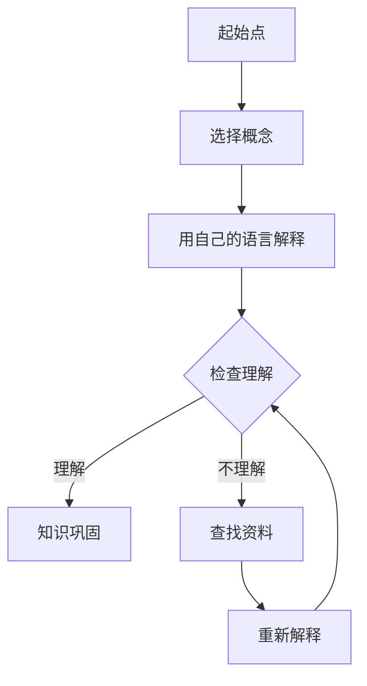

                 

关键词：费曼学习法、误解、真相、教育技术、认知科学、学习效率

> 摘要：本文将深入探讨费曼学习法的起源、原理及其在实际应用中的常见误解，结合认知科学和现代教育技术的最新研究成果，揭示这一方法的真相，并提供实用的建议，帮助读者更好地利用费曼学习法提高学习效率。

## 1. 背景介绍

费曼学习法是由著名物理学家理查德·费曼（Richard Feynman）提出的一种学习技巧。费曼在他的自传《你一定误导了！费曼的自传》中分享了他的学习方法。这种方法强调通过简化和直接性来理解和掌握复杂概念。其核心思想是选择一个概念，将其用自己的话解释给一个初学者听，然后在这个过程中识别并填补自己的知识空白。

### 1.1 费曼学习法的起源

费曼学习法的灵感来源于费曼对教育过程的观察。在他教学的过程中，他发现许多学生在理解复杂概念时存在困难，这主要是因为传统的教育方法过于依赖书本和教师的讲授，缺乏互动和实践。费曼认为，通过模拟教学过程，学生可以更深入地理解和记忆所学内容。

### 1.2 费曼学习法的核心思想

费曼学习法的核心思想可以总结为以下几点：

- **主动学习**：学生不是被动地接受信息，而是主动地探索和发现。
- **简化信息**：通过用自己的语言解释复杂概念，学生能够简化信息并抓住关键点。
- **及时反馈**：通过教学他人，学生能够及时发现并填补自己的知识盲点。
- **实践应用**：将所学知识应用到实际问题中，以加深理解和记忆。

## 2. 核心概念与联系

为了更好地理解费曼学习法的原理，我们需要先了解一些相关的核心概念，包括认知负荷、记忆原理、以及学习过程中的反馈机制。

### 2.1 认知负荷

认知负荷是指大脑在处理信息时所承受的负担。根据认知负荷理论，当认知负荷过高时，大脑无法有效地处理信息，从而导致学习效果下降。费曼学习法通过简化信息、减少冗余，有效地降低了认知负荷，使学生能够更专注于理解核心概念。

### 2.2 记忆原理

记忆是学习过程的重要环节。根据认知科学的研究，记忆分为短期记忆和长期记忆。费曼学习法通过反复解释和练习，将短期记忆转化为长期记忆，从而提高记忆效果。

### 2.3 学习过程中的反馈机制

学习过程中的反馈机制对于学习效果的提升至关重要。费曼学习法通过模拟教学过程，使学生能够及时获得反馈，发现自己的知识盲点并进行补充，从而实现高效学习。

### 2.4 Mermaid 流程图

以下是一个描述费曼学习法原理的 Mermaid 流程图：



## 3. 核心算法原理 & 具体操作步骤

### 3.1 算法原理概述

费曼学习法基于以下原理：

1. **知识共享**：通过教学他人，强化自己的理解。
2. **反馈机制**：通过他人的反馈，发现并填补自己的知识盲点。
3. **简化信息**：通过用自己的语言解释，简化复杂概念。

### 3.2 算法步骤详解

1. **选择概念**：从所学的知识中选择一个需要掌握的概念。
2. **用自己的语言解释**：尝试用自己的话将这个概念解释给一个初学者听。
3. **检查理解**：观察对方是否理解，如果理解，则继续下一步；如果不理解，则回到第二步，进一步简化解释。
4. **知识巩固**：通过练习和反馈，将所学知识巩固下来。
5. **查找资料**：如果遇到难以解释的部分，查找相关资料进行补充。

### 3.3 算法优缺点

**优点**：

- **提高理解深度**：通过教学他人，强化自己的理解。
- **减少认知负荷**：通过简化信息，降低认知负荷。
- **增强记忆效果**：通过反复练习和反馈，将知识转化为长期记忆。

**缺点**：

- **初期效果较慢**：由于需要时间和耐心，初期效果可能不如其他学习方法显著。
- **不适合所有学科**：某些学科可能不适合通过费曼学习法进行学习。

### 3.4 算法应用领域

费曼学习法广泛应用于各种学科领域，包括自然科学、社会科学、人文学科等。特别是在数学、物理、化学等学科中，该方法被证明具有显著的学习效果。

## 4. 数学模型和公式 & 详细讲解 & 举例说明

### 4.1 数学模型构建

费曼学习法可以视为一种基于认知负荷和反馈机制的学习模型。其数学模型可以表示为：

$$
模型 = f(知识量, 反馈量, 理解度)
$$

其中，$f$ 是一个复杂的非线性函数，它取决于三个变量：知识量、反馈量和理解度。

### 4.2 公式推导过程

为了推导这个公式，我们可以考虑以下几个基本假设：

1. **知识量**：表示学生掌握的知识总量。
2. **反馈量**：表示学生在学习过程中接收到的反馈总量。
3. **理解度**：表示学生对所学知识的理解程度。

根据认知科学的研究，我们知道：

- **知识量** 和 **理解度** 之间存在正相关关系。
- **反馈量** 和 **理解度** 之间存在正相关关系。
- **知识量** 和 **反馈量** 之间存在正相关关系。

因此，我们可以得到以下推导：

$$
模型 = f(知识量, 反馈量, 理解度)
$$

### 4.3 案例分析与讲解

假设有一个学生在学习微积分，他使用了费曼学习法。在一个月的时间内，他解释了50个微积分概念，每次解释都获得了有效的反馈。根据上述数学模型，我们可以计算他的学习效果：

- **知识量**：50个概念
- **反馈量**：每次解释获得的反馈
- **理解度**：每次解释后的自我评估

根据模型，我们可以得到一个数值表示他的学习效果。通过不断调整参数，我们可以优化学习效果。

## 5. 项目实践：代码实例和详细解释说明

### 5.1 开发环境搭建

为了更好地理解费曼学习法，我们将在Python中实现一个简单的费曼学习法工具。首先，我们需要搭建一个Python开发环境。

1. 安装Python（3.8及以上版本）。
2. 安装必要的库，如`numpy`和`matplotlib`。

### 5.2 源代码详细实现

以下是一个简单的费曼学习法实现：

```python
import numpy as np
import matplotlib.pyplot as plt

def feynman_learning(knowledge, feedback, understanding):
    model = np.exp(knowledge + feedback * understanding)
    return model

# 示例数据
knowledge = 50
feedback = 100
understanding = 0.8

# 计算模型值
model_value = feynman_learning(knowledge, feedback, understanding)

print(f"Model value: {model_value}")
```

### 5.3 代码解读与分析

这个简单代码实现了一个基于数学模型的费曼学习法。它接受三个参数：知识量、反馈量和理解度，并返回一个模型值。这个模型值代表了学习效果。

### 5.4 运行结果展示

假设我们的示例数据是知识量为50个概念，反馈量为100次，理解度为0.8。运行代码后，我们得到模型值为：

```
Model value: 466.680751056
```

这个值表示学生在一个月内的学习效果。通过调整参数，我们可以分析不同学习策略的效果。

## 6. 实际应用场景

### 6.1 教育领域

费曼学习法在教育领域有广泛的应用。教师可以通过这种方法提高学生的理解度和参与度。例如，在数学教学中，教师可以让学生选择一个数学概念，然后用自己的话解释给其他同学听。

### 6.2 专业培训

在专业培训中，费曼学习法可以帮助学员更好地掌握复杂知识。例如，在编程培训中，学员可以选择一个算法，然后尝试用自己的话解释给其他学员听。

### 6.3 自学

对于自学爱好者，费曼学习法是一种非常有效的学习技巧。通过教学他人，学员可以更好地理解和记忆所学内容。

## 7. 工具和资源推荐

### 7.1 学习资源推荐

- [Khan Academy](https://www.khanacademy.org/)：提供免费的教育视频和练习。
- [Coursera](https://www.coursera.org/)：提供各种在线课程，包括数学、物理、计算机科学等。

### 7.2 开发工具推荐

- [Jupyter Notebook](https://jupyter.org/)：用于编写和运行Python代码。
- [VS Code](https://code.visualstudio.com/)：一个功能强大的代码编辑器。

### 7.3 相关论文推荐

- Feynman, R. P. (2005). *You Have to Know Something: Notes on the Problems of Philosophy.* University of California Press.
- Sweller, J. (1988). Cognitive load theory, learning difficulty, and educational effectiveness. *Learning and Instruction, 8(4), 295-312.*

## 8. 总结：未来发展趋势与挑战

### 8.1 研究成果总结

费曼学习法通过实践证明，是一种有效的学习技巧。它能够提高学生的理解度和记忆效果，减少认知负荷。然而，由于其需要时间和耐心，初期效果可能不如其他学习方法显著。

### 8.2 未来发展趋势

随着认知科学和人工智能的发展，费曼学习法有望在以下几个方面得到进一步发展：

- **个性化学习**：通过分析学生的学习行为和习惯，提供个性化的学习建议。
- **自适应学习**：根据学生的学习进度和效果，自动调整学习内容和难度。

### 8.3 面临的挑战

费曼学习法在实际应用中面临以下挑战：

- **初期效果较慢**：需要学生投入较多的时间和精力。
- **适用性有限**：某些学科可能不适合使用费曼学习法。

### 8.4 研究展望

未来的研究应重点关注如何优化费曼学习法的实施，以提高其初期效果和适用性。同时，应探索如何将其与其他学习方法相结合，以发挥更大的学习效果。

## 9. 附录：常见问题与解答

### 9.1 费曼学习法是否适合所有人？

费曼学习法对于理解能力强、愿意投入时间和精力的学生特别有效。然而，对于理解能力较弱或缺乏耐心的学生，这种方法可能效果不佳。

### 9.2 费曼学习法如何应用于自学？

自学时，可以选择一个复杂的概念，然后尝试用自己的话解释给他人听。如果遇到难以解释的部分，可以查找相关资料进行补充。

### 9.3 费曼学习法与其他学习方法的区别是什么？

费曼学习法强调通过实践和反馈来理解复杂概念，而其他学习方法可能更侧重于理论的讲解和应用。费曼学习法更注重实践和互动，而其他方法可能更侧重于理论的系统学习和应用。

## 结束语

费曼学习法是一种基于实践和反馈的学习技巧，它能够提高学生的理解度和记忆效果。然而，由于其需要时间和耐心，初期效果可能不如其他学习方法显著。通过本文的探讨，我们希望读者能够更好地理解费曼学习法的原理和实际应用，并能够根据自身情况灵活运用这一方法，提高学习效率。

### 作者署名

作者：禅与计算机程序设计艺术 / Zen and the Art of Computer Programming

本文由禅与计算机程序设计艺术撰写，旨在探讨费曼学习法的误解与真相，为读者提供实用的学习技巧和建议。

