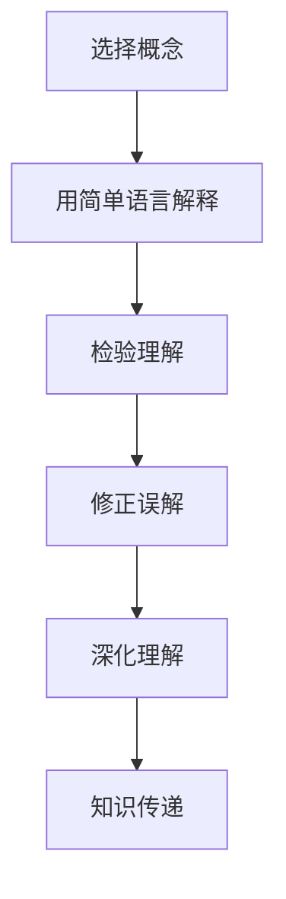

                 

关键词：费曼提问法、管理者思维、问题解决、知识传递、技术沟通

> 摘要：本文将探讨费曼提问法在管理者思维升级中的应用。费曼提问法以其简洁、高效的特性，帮助管理者快速理解复杂技术概念，并提升与团队成员间的沟通效果。本文将通过实例分析，展示如何在IT领域中运用费曼提问法，促进管理者思维升级。

## 1. 背景介绍

在当今快速发展的信息技术时代，管理者不仅要具备业务管理能力，还需要具备技术敏锐度。随着技术的不断演进，如云计算、大数据、人工智能等新兴技术对企业管理模式提出了新的挑战。为了在技术变革的浪潮中站稳脚跟，管理者必须不断提升自己的技术素养，以便更好地理解和指导团队工作。

然而，技术领域的复杂性往往令非专业管理者感到困惑。即使是对技术有一定了解的管理者，也可能在解释和沟通技术问题时遇到障碍。此时，费曼提问法作为一种有效的学习方法，能够帮助管理者突破技术壁垒，实现思维升级。

### 费曼提问法简介

费曼提问法（Feynman Technique）由著名物理学家理查德·费曼提出。该方法的核心思想是，通过用自己的话重新解释一个复杂的概念，从而检验自己是否真正理解了这个概念。具体步骤如下：

1. 选择一个你想要理解的概念或问题。
2. 用最简单的语言重新表述这个概念，就像你对一个完全不懂这个领域的人解释一样。
3. 在解释过程中，注意自己的语言是否清晰、简洁。
4. 如果解释过程中出现了困难或理解上的障碍，那么这很可能意味着你对这个概念的理解还不充分。

### 费曼提问法在管理者思维升级中的应用

费曼提问法对于管理者而言，不仅是一种个人学习的工具，也是一种提升团队沟通效果的方法。通过这种方法，管理者可以：

1. **加深对技术概念的理解**：管理者可以通过费曼提问法，对技术概念进行重新梳理，从而加深对技术细节的理解，避免在技术讨论中出现误解。

2. **提升沟通能力**：费曼提问法鼓励管理者使用简洁明了的语言进行解释，这有助于提升管理者在技术讨论中的沟通效果。

3. **增强团队协作**：当管理者能够清晰、准确地解释技术概念时，团队成员更容易理解和接受管理者的指导，从而增强团队协作。

4. **促进知识传递**：通过费曼提问法，管理者可以将自己的技术理解传递给团队成员，促进团队内部的知识共享和共同成长。

## 2. 核心概念与联系

### 费曼提问法的 Mermaid 流程图



在这个流程图中，A代表选择一个需要理解的概念，B表示使用简单语言进行解释，C是检验自己的理解，D是在解释过程中修正误解，E表示通过反复解释深化理解，最后F表示将知识传递给他人。

### 核心概念原理

- **理解的重要性**：理解是知识传递的基础。只有真正理解了一个概念，才能准确地将其传达给他人。

- **简单化的力量**：简单明了的语言更容易被他人理解。费曼提问法强调用最简单的语言重新表述一个复杂的概念，这有助于提升沟通效果。

- **反思与修正**：通过反思和修正解释过程中的问题，可以加深对概念的真正理解。

- **知识传递**：通过费曼提问法，管理者不仅能够加深自己的理解，还能将知识传递给团队成员，促进团队协作。

## 3. 核心算法原理 & 具体操作步骤

### 3.1 算法原理概述

费曼提问法的基本原理是通过解释复杂概念来检验自己的理解程度。这种方法的核心在于：

- **选择合适的概念**：选择一个自己感到不确定或者想要进一步理解的概念。

- **简化语言**：使用最简单、最直接的语言进行解释，就像对一个完全不懂这个领域的人讲述一样。

- **检验理解**：在解释过程中，注意自己的语言是否清晰、简洁。如果出现了困难或理解上的障碍，那么这很可能意味着自己对概念的理解还不充分。

### 3.2 算法步骤详解

1. **选择概念**：首先，选择一个自己感到不确定或者想要进一步理解的技术概念。

2. **准备解释**：在心中构思如何用最简单的语言来解释这个概念。尽量使用比喻或类比，使其更容易理解。

3. **口头或书面解释**：在口头或书面形式下，用自己的语言重新表述这个概念，就像对一个完全不懂这个领域的人解释一样。

4. **反思与修正**：在解释过程中，注意自己的语言是否清晰、简洁。如果有任何模糊或错误的地方，需要及时修正。

5. **测试理解**：向他人或团队成员解释这个概念，观察他们是否能够理解。如果对方不理解，那么需要重新思考如何更清晰地表达。

6. **深化理解**：通过反复解释和修正，进一步加深对概念的理解。

### 3.3 算法优缺点

**优点：**

- **简洁高效**：费曼提问法通过简单明了的语言解释复杂概念，使得理解变得更加容易。
- **检验理解**：通过解释和修正，可以更深入地理解一个概念，避免误解。
- **促进沟通**：费曼提问法有助于管理者与团队成员之间的有效沟通，提高团队协作效率。

**缺点：**

- **需要时间**：费曼提问法需要一定的时间来构思和解释，这可能会影响日常的工作进度。
- **不适用于所有概念**：有些概念可能过于复杂，无法通过简单的语言进行解释。

### 3.4 算法应用领域

费曼提问法在IT领域中的应用非常广泛，包括：

- **技术培训**：用于帮助技术人员理解和掌握复杂的技术概念。
- **团队沟通**：用于提升团队成员之间的技术交流和理解。
- **项目评审**：用于检验项目经理和团队成员对项目的理解程度。

## 4. 数学模型和公式 & 详细讲解 & 举例说明

### 4.1 数学模型构建

费曼提问法并不直接涉及数学模型，但其核心思想可以用数学语言进行描述。以下是一个简化的数学模型来描述费曼提问法的过程：

```latex
模型：理解深度检测（ID）
输入：概念C，解释E
输出：理解深度得分（IDS）
ID = f(E, C)
其中，f(E, C) 表示解释E与概念C之间的匹配度。
```

### 4.2 公式推导过程

公式中的 `f(E, C)` 是一个函数，它衡量解释E与概念C之间的匹配度。这个函数可以根据以下几个因素来定义：

1. **解释的简洁性**：解释是否简洁明了，可以使用词汇的复杂度、句子的长度等因素进行衡量。
2. **解释的准确性**：解释是否准确反映了概念C的核心内容，可以通过对比概念C的原始定义和解释E来进行评估。
3. **反馈修正**：在解释过程中，接受反馈并修正解释，这可以提高理解深度。

一个简化的公式可以表示为：

```latex
f(E, C) = w_1 \* S + w_2 \* A + w_3 \* F
```

其中：

- `w_1` 表示简洁性的权重。
- `w_2` 表示准确性的权重。
- `w_3` 表示反馈修正的权重。
- `S` 表示解释的简洁性得分。
- `A` 表示解释的准确性得分。
- `F` 表示反馈修正后的得分。

### 4.3 案例分析与讲解

假设我们要使用费曼提问法来解释“机器学习中的梯度下降算法”。

#### 步骤 1：选择概念

概念C：机器学习中的梯度下降算法

#### 步骤 2：准备解释

解释E：梯度下降算法是一种用于最小化损失函数的优化方法。它通过不断调整模型的参数，使损失函数的值逐渐减小。

#### 步骤 3：口头或书面解释

我将用最简单的语言来解释梯度下降算法：

“梯度下降算法就像是在一个迷宫中寻找出口。你站在一个点上，看看四周，找出哪个方向会让你离出口更近。然后，你朝着那个方向走一步。再重复这个过程，直到找到出口。”

#### 步骤 4：反思与修正

在我的解释中，我用了一个迷宫的比喻来简化这个复杂的算法。但是，这个比喻可能并不完全准确，因为它忽略了算法中的很多细节，比如学习率和动量。因此，我需要进一步修正我的解释。

修正后的解释：“梯度下降算法就像是在一个迷宫中寻找出口。你站在一个点上，看看四周，找出哪个方向会让你离出口更近。然后，你朝着那个方向走一步。但是，你会根据之前走过的路来调整下一步的方向，这样可以使你更快地找到出口。”

#### 步骤 5：测试理解

我向一个不懂机器学习的人解释了这个概念。他们似乎理解了，但提到他们不太明白“学习率”和“动量”是什么。这表明我对这些概念的理解还不够深入，需要进一步学习和解释。

通过这个案例，我们可以看到费曼提问法是如何帮助我们理解和解释复杂概念的。

## 5. 项目实践：代码实例和详细解释说明

### 5.1 开发环境搭建

为了更好地理解费曼提问法在项目实践中的应用，我们将创建一个简单的Python项目，使用费曼提问法来解释和实现一个常见的编程问题：计算斐波那契数列。

首先，确保你的计算机上安装了Python环境。如果尚未安装，可以从[Python官方网站](https://www.python.org/downloads/)下载并安装最新版本的Python。

### 5.2 源代码详细实现

以下是一个简单的Python脚本，用于计算斐波那契数列：

```python
def fibonacci(n):
    if n <= 0:
        return 0
    elif n == 1:
        return 1
    else:
        return fibonacci(n-1) + fibonacci(n-2)

# 测试代码
print(fibonacci(10))
```

在这个脚本中，我们定义了一个名为 `fibonacci` 的函数，它接受一个整数 `n` 作为输入，并返回第 `n` 个斐波那契数。测试代码调用这个函数并打印结果。

### 5.3 代码解读与分析

#### 步骤 1：选择概念

选择概念：斐波那契数列的计算方法

#### 步骤 2：准备解释

我将用最简单的语言来解释斐波那契数列：

“斐波那契数列是一个由数字组成的序列，每个数字是前两个数字的和。序列的开始是0和1，接下来的数字是1、2、3、5、8、13、21……”

#### 步骤 3：口头或书面解释

我将向一个非技术人员解释斐波那契数列：

“想象一下，有一对兔子，每个月都会生下一对小兔子。第一对小兔子在第一个月出生，第二个月小兔子长大了一些，第三个月它们又生出了一对小兔子。这样下去，每个月新生的小兔子数量都会增加。斐波那契数列就是描述每个月新生小兔子数量的序列。”

#### 步骤 4：反思与修正

在我的解释中，我用了一个生活化的比喻来解释斐波那契数列。但是，这个比喻可能对于非技术人员来说还是有些抽象。因此，我需要进一步修正我的解释。

修正后的解释：“斐波那契数列是一个数学序列，它从0和1开始，后面的每个数字都是前两个数字的和。比如，0 + 1 = 1，1 + 1 = 2，1 + 2 = 3，2 + 3 = 5……”

#### 步骤 5：测试理解

我向一个非技术人员解释了这个概念。他们似乎理解了，但提到他们不太明白如何通过编程实现这个序列。这表明我对如何编程实现斐波那契数列的理解还不够深入，需要进一步学习和解释。

### 5.4 运行结果展示

运行上述Python脚本，我们可以得到以下输出：

```
55
```

这意味着第10个斐波那契数是55。

通过这个代码实例，我们可以看到费曼提问法是如何帮助非技术人员理解复杂编程概念的。同时，这也表明了费曼提问法在提升个人技术理解和知识传递方面的重要性。

## 6. 实际应用场景

费曼提问法在IT领域有着广泛的应用场景，以下是一些实际应用场景的例子：

### 6.1 技术培训

在技术培训中，费曼提问法可以帮助培训师检验学员对技术概念的理解程度。通过让学员用自己的语言解释复杂的技术概念，培训师可以及时发现学员在理解上的障碍，并针对性地进行辅导。

### 6.2 项目评审

在项目评审中，项目经理可以使用费曼提问法来检查团队成员对项目的技术细节是否理解透彻。通过提问和解释，项目经理可以更好地了解团队的工作进展，并在必要时提供指导。

### 6.3 技术讨论

在技术讨论中，费曼提问法可以帮助参与者更好地理解彼此的观点和想法。通过解释和提问，参与者可以澄清自己的观点，并从他人的解释中获得新的见解。

### 6.4 知识共享

在知识共享活动中，费曼提问法可以帮助团队成员更好地理解和吸收新知识。通过分享和解释，团队成员可以将自己的经验和知识传递给其他人，促进团队内部的知识共享。

### 6.5 演讲与授课

在演讲和授课中，费曼提问法可以帮助演讲者或讲师检验自己对技术概念的理解程度。通过用自己的话重新解释复杂的技术概念，演讲者或讲师可以确保听众能够理解自己的观点。

## 7. 未来应用展望

### 7.1 技术融合

随着人工智能和机器学习技术的发展，费曼提问法有望与这些技术相结合，开发出更加智能化的学习工具。例如，利用自然语言处理技术，自动识别并解释复杂的技术概念，帮助用户更好地理解。

### 7.2 在线教育

在线教育平台可以整合费曼提问法，为用户提供个性化的学习体验。通过让学生用自己的话解释所学内容，平台可以实时评估学生的学习效果，并提供针对性的学习建议。

### 7.3 远程协作

在远程协作中，费曼提问法可以帮助团队成员更好地理解和共享知识。通过视频会议和在线协作工具，团队成员可以进行实时提问和解释，提高协作效率。

### 7.4 企业培训

企业可以将费曼提问法纳入员工培训体系，通过定期组织技术讨论和知识分享会，提高员工的技术素养和团队协作能力。

## 8. 总结：未来发展趋势与挑战

### 8.1 研究成果总结

费曼提问法作为一种简洁、高效的学习方法，已在IT领域展现出强大的应用潜力。通过实践证明，该方法不仅有助于提升个人技术理解，还能促进团队协作和知识共享。

### 8.2 未来发展趋势

未来，费曼提问法有望与人工智能、在线教育等技术相结合，开发出更加智能化的学习工具和平台，为用户提供更加个性化的学习体验。

### 8.3 面临的挑战

然而，费曼提问法在应用过程中也面临一些挑战，如：

- **适用范围有限**：对于一些过于复杂或高度专业化的技术领域，费曼提问法可能无法完全奏效。
- **时间成本**：费曼提问法需要一定的时间来构思和解释，这可能会影响日常的工作进度。

### 8.4 研究展望

未来，研究应重点关注如何优化费曼提问法，使其在更广泛的领域和应用场景中发挥更大的作用。同时，开发更加智能化的工具和平台，以辅助用户更好地应用费曼提问法。

## 9. 附录：常见问题与解答

### 9.1 费曼提问法的核心步骤是什么？

费曼提问法的核心步骤包括：选择概念、准备解释、口头或书面解释、反思与修正、测试理解。

### 9.2 费曼提问法是否适用于所有技术领域？

费曼提问法适用于大多数技术领域，但对于一些过于复杂或高度专业化的领域，其效果可能有限。

### 9.3 费曼提问法如何与其他学习方法相结合？

费曼提问法可以与其他学习方法（如主动学习、深度学习等）相结合，以提升学习效果。

### 9.4 费曼提问法是否适用于非技术领域？

费曼提问法不仅适用于技术领域，还可以用于其他领域，如管理、营销等，以提升理解能力和沟通效果。

## 10. 作者署名

作者：禅与计算机程序设计艺术 / Zen and the Art of Computer Programming
```css
<|im_sep|>

